# 1. Executive Summary

This document defines the standard organizational architecture for [Company Name]. We utilize a Matrix Organizational Structure, designed to balance deep functional expertise with rapid cross-functional execution.
 
 * Functional Departments (Verticals): Where talent is hired, trained, and managed (e.g., Engineering, Finance).
 * Specialized Squads (Horizontals): Where work actually gets done. These are cross-functional teams composed of members from various departments to deliver specific business value (e.g., "Mobile Platform Squad").

# 2. Visual Org Chart (The Matrix Model)

The following diagram illustrates how functional departments (blue) supply talent to execution squads (orange).

```mermaid
graph TD
    %% --- Styles ---
    classDef exec fill:#7e57c2,stroke:#311b92,stroke-width:3px,color:white,font-weight:bold,rx:10,ry:10;
    classDef mgmt fill:#bbdefb,stroke:#1565c0,stroke-width:2px,color:black,font-weight:bold;
    classDef role fill:#ffffff,stroke:#546e7a,stroke-width:1px,stroke-dasharray: 5 5,rx:5,ry:5;
    classDef squad fill:#ffccbc,stroke:#d84315,stroke-width:3px,shape:hexagon,font-weight:bold,color:black;
    classDef pillar fill:#c8e6c9,stroke:#2e7d32,stroke-width:2px,color:black,font-weight:bold,shape:rect;

    %% --- Layer 1: Executive Leadership (C-Suite) ---
    CEO[CEO: Chief Executive Officer]:::exec
    
    subgraph "Executive Layer"
        direction LR
        CTO[CTO: Chief Tech Officer]:::exec
        CPO[CPO: Chief Product Officer]:::exec
        CRO[CRO: Chief Revenue Officer]:::exec
        CFO[CFO: Chief Financial Officer]:::exec
        CLO[CLO: Chief Legal Officer]:::exec
    end

    CEO --> CTO & CPO & CRO & CFO & CLO

    %% --- Layer 2: Functional Management (VPs & Directors) ---
    subgraph "Functional Chain of Command"
        direction LR
        
        %% Tech Branch
        VP_ENG[VP of Engineering]:::mgmt
        DIR_INFRA[Dir. Infrastructure]:::mgmt
        DIR_APP[Dir. App Dev]:::mgmt
        CTO --> VP_ENG
        VP_ENG --> DIR_INFRA & DIR_APP

        %% Product Branch
        VP_PROD[VP of Product]:::mgmt
        VP_DESIGN[VP of Design]:::mgmt
        CPO --> VP_PROD & VP_DESIGN

        %% Sales Branch
        VP_SALES[VP of Sales]:::mgmt
        VP_MKTG[VP of Marketing]:::mgmt
        CRO --> VP_SALES & VP_MKTG

        %% G&A Branch
        VP_FIN[VP Finance]:::mgmt
        VP_PEOPLE[VP People/HR]:::mgmt
        CFO --> VP_FIN
        CLO --> VP_PEOPLE
    end

    %% --- Layer 3: Talent Pools (Individual Roles) ---
    subgraph "Talent Pools (The Resources)"
        %% Engineering Resources
        DIR_INFRA --> R_SREL(SREL1005: SRE):::role
        DIR_INFRA --> R_SEC(SEC1001: Security Eng):::role
        DIR_APP --> R_BACK(SWEN1002: Backend Eng):::role
        DIR_APP --> R_FRONT(SWEN1003: Frontend Eng):::role

        %% Product Resources
        VP_PROD --> R_PM(PROD2001: Product Mgr):::role
        VP_DESIGN --> R_DESN(DESN3001: Designer):::role
        VP_DESIGN --> R_RSCH(RSCH3002: Researcher):::role

        %% GTM Resources
        VP_SALES --> R_AE(SALE9001: Account Exec):::role
        VP_MKTG --> R_BRAND(MKTG9003: Brand Mgr):::role
        
        %% G&A Resources
        VP_FIN --> R_FPA(FINC6001: FP&A Analyst):::role
        VP_PEOPLE --> R_HRBP(PEOP8001: HR Partner):::role
        CLO --> R_LEGAL(LEGL7001: Counsel):::role
    end

    %% --- Layer 4: Execution Squads (Cross-Functional) ---
    %% Grouped by "Tribes" or Strategic Areas
    
    subgraph "Strategic Tribe: Core Platform"
        S_CLOUD{{Cloud Migration Squad}}:::squad
        S_DATA{{Data Platform Squad}}:::squad
    end

    subgraph "Strategic Tribe: Growth & Revenue"
        S_ACQ{{Acquisition/SEO Squad}}:::squad
        S_MON{{Monetization Squad}}:::squad
    end

    subgraph "Strategic Tribe: Enterprise"
        S_LAUNCH{{Ent. Launch Team}}:::squad
        S_PART{{Partner Integ. Squad}}:::squad
    end

    %% --- Layer 5: Strategic Outcomes ---
    %% What these squads are actually achieving for the business
    
    OUT_SCALE(Outcome: 99.99% Uptime & Scale):::pillar
    OUT_REV(Outcome: +30% YOY Revenue):::pillar
    OUT_MKT(Outcome: Fortune 500 Penetration):::pillar

    S_CLOUD & S_DATA --> OUT_SCALE
    S_ACQ & S_MON --> OUT_REV
    S_LAUNCH & S_PART --> OUT_MKT

    %% --- Matrix Assignments (Dotted Lines) ---
    %% Showing how talent flows into the squads
    
    %% Tech Assignments
    R_SREL -.-> S_CLOUD
    R_BACK -.-> S_CLOUD & S_DATA & S_MON & S_PART
    R_FRONT -.-> S_ACQ & S_MON
    R_SEC -.-> S_CLOUD

    %% Product Assignments
    R_PM -.-> S_ACQ & S_MON & S_PART & S_DATA
    R_DESN -.-> S_ACQ & S_MON

    %% GTM Assignments
    R_AE -.-> S_LAUNCH
    R_BRAND -.-> S_ACQ

    %% G&A Assignments
    R_LEGAL -.-> S_PART
    R_FPA -.-> S_MO
```

# 3. Comprehensive Job Role Catalog

The following is the standardized list of roles across the organization. All headcount planning must utilize these Role Codes.

## 3.1 Engineering & Technology

| Role Name | Role Code | Description | Responsibilities | Avg Daily Tasks | Common Partners |
|---|---|---|---|---|---|
| Software Engineer | SWEN1001 | Generalist engineer building core applications. | • Writing code; • Code reviews; • System design; • Debugging | 10:00 Standup; 11:00 Coding; 15:00 Arch sync | Product Mgr, Designer |
| Backend Engineer | SWEN1002 | Builds server-side logic and databases. | • API development; • DB optimization; • Microservices; • Server maintenance | 10:00 Standup; 11:00 API design; 14:00 DB migration | Frontend Eng, Data Eng |
| Frontend Engineer | SWEN1003 | Builds client-side UI (Web/Mobile). | • UI implementation; • State mgmt; • Performance opt; • Browser compatibility | 10:00 Standup; 11:00 React coding; 14:00 Pixel review | Designer, Backend Eng |
| Mobile Engineer | SWEN1004 | Develops native apps for iOS/Android. | • Swift/Kotlin coding; • App Store deploy; • Touch opt; • Device testing | 10:00 Standup; 11:00 Feature dev; 15:00 Build release | Designer, Backend Eng |
| Security Engineer | SEC1001 | Protects infrastructure and data. | • Pen testing; • Vuln scanning; • Security audits; • Incident response | 09:00 Log review; 11:00 Threat modeling; 14:00 Patching | SRE, Backend Eng, Legal |
| QA Engineer | QA1001 | Ensures software quality through testing. | • Writing test scripts; • Automated testing; • Bug tracking; • Release validation | 09:00 Triage bugs; 11:00 Writing tests; 14:00 Regression | Developers, PM |
| Site Reliability Eng | SREL1005 | Ensures uptime and scalability. | • Cloud infra mgmt; • Automating pipelines; • Incident response; • Capacity planning | 10:00 On-call handoff; 11:00 Automation; 14:00 Post-mortem | Backend Eng, DevOps |
| Data Engineer | DATA4002 | Builds data pipelines and storage. | • ETL creation; • Data warehousing; • Query opt; • Data governance | 10:00 Pipeline check; 11:00 Schema design; 14:00 SQL tuning | Data Scientist, Backend Eng |

## 3.2 Product & Design

| Role Name | Role Code | Description | Responsibilities | Avg Daily Tasks | Common Partners |
|---|---|---|---|---|---|
| Product Manager | PROD2001 | Defines product strategy and roadmap. | • Prioritization; • Stakeholder alignment; • User stories; • Market research | 09:00 Metrics; 11:00 Alignment; 13:00 PRDs | Eng Mgr, Designer, Sales |
| Technical PM | PROD2002 | PM for technical products (APIs, Cloud). | • API spec definition; • Developer experience; • Platform roadmap | 10:00 Eng sync; 13:00 Writing specs; 15:00 Dev interview | Engineers, Architects |
| Technical PgM | TPGM5001 | Manages complex cross-team programs. | • Tracking dependencies; • Risk mgmt; • Milestone reporting; • Facilitation | 09:00 Reporting; 11:00 Dependency sync; 13:00 Risk planning | Eng Mgr, Product Mgr |
| Product Designer | DESN3001 | Designs UI and UX. | • Wireframes; • User testing; • Design systems; • Visual QA | 10:00 Critique; 11:00 Figma; 14:00 Usability testing | PM, Frontend Eng |
| UX Writer | DESN3003 | Writes copy for user interfaces. | • Microcopy; • Voice & tone; • Error messages; • Localization prep | 10:00 Design review; 11:00 Drafting; 14:00 Legal review | Designer, PM, Legal |
| User Researcher | RSCH3002 | Conducts qualitative research. | • User interviews; • Surveys; • Usability studies; • Synthesizing data | 10:00 Interview; 11:00 Debrief; 14:00 Analysis | Designer, Product Mgr |
| Data Scientist | DATA4001 | Analyzes data to drive decisions. | • ML models; • A/B tests; • Data mining; • Visualizing insights | 09:30 Pipeline check; 11:00 Modeling; 14:00 Exp review | PM, Backend Eng |

## 3.3 Go-To-Market (Sales & Marketing)

| Role Name | Role Code | Description | Responsibilities | Avg Daily Tasks | Common Partners |
|---|---|---|---|---|---|
| Account Executive | SALE9001 | Sells products to enterprise clients. | • Client demos; • Contract negotiation; • Pipeline mgmt; • Relationship building | 09:00 Outreach; 11:00 Demos; 14:00 Negotiation | Sales Eng, Legal |
| Sales Dev Rep | SALE9002 | Outbound prospecting for leads. | • Cold calling/emailing; • Lead qualification; • Scheduling demos | 09:00 Prospecting; 11:00 Cold calls; 14:00 CRM updates | Account Exec, Marketing |
| Solutions Eng | SALE9003 | Technical expert assisting sales. | • Custom demos; • Proof of Concept (POC); • Technical Q&A; • RFPs | 10:00 Demo; 13:00 Build POC; 15:00 RFP writing | Account Exec, Product |
| Customer Success | CSM9004 | Manages post-sale relationships. | • Onboarding; • Renewals/Upsells; • Usage monitoring; • QBRs | 09:00 Email triage; 11:00 Training; 14:00 QBR prep | Account Exec, Support |
| Brand Marketing | MKTG9003 | Manages reputation and brand. | • Campaign strategy; • Media buying; • Brand guidelines; • Agency mgmt | 10:00 Agency sync; 11:00 Creative review; 14:00 Media plan | Product Mktg, Design |
| Comms / PR | COMM9005 | Media relations and internal comms. | • Press releases; • Crisis comms; • Executive talking points | 09:00 News scan; 11:00 Drafting; 14:00 Reporter briefing | CEO, Marketing, Legal |
| Public Policy Mgr | POLI7002 | Gov't relations and regulations. | • Lobbying; • Analyzing legislation; • Drafting position papers | 09:00 Monitoring; 11:00 Gov't meeting; 14:00 Strategy | Legal, PR, PM |

## 3.4 G&A (General & Administrative)
| Role Name | Role Code | Description | Responsibilities | Avg Daily Tasks | Common Partners |
|---|---|---|---|---|---|
| FP&A Analyst | FINC6001 | Financial Planning & Analysis. | • Forecasting revenue; • Budget variance; • ROI modeling | 09:00 Reports; 11:00 Budget sync; 14:00 Modeling | Product Mgr, Dept Heads |
| Controller | FINC6002 | Head of Accounting operations. | • Financial reporting; • Audits; • Internal controls; • Closing books | 09:00 Ledger review; 11:00 Audit mtg; 14:00 Month close | CFO, FP&A, Legal |
| Corp Counsel | LEGL7001 | General in-house legal advice. | • Contract review; • Regulatory compliance; • Litigation support | 10:00 Redlines; 13:00 Policy review; 15:00 Risk assess | Sales, HR, Security |
| Employment Counsel | LEGL7003 | Legal advice on HR/Labor. | • Employee contracts; • Visa/Immigration; • Termination advice | 10:00 Drafting; 11:00 HR advisory; 14:00 Visa review | HRBP, Recruiter |
| HR Partner | PEOP8001 | Strategic people advisor. | • Org design; • Performance mgmt; • Conflict resolution; • Succession | 10:00 Exec coaching; 13:00 Comp review; 15:00 Talent plan | Eng Mgr, Legal |
| Workplace Mgr | REAL0002 | Manages offices and facilities. | • Space planning; • Vendor mgmt; • Office safety; • Employee exp | 08:30 Site walk; 10:00 Vendor mtg; 13:00 Planning | HR, IT, Finance |
| Strategy & Ops | OPS0001 | Internal consulting/efficiency. | • Process improvement; • OKR tracking; • QBR prep; • Analytics | 09:00 Dashboard; 11:00 Process mapping; 14:00 Exec deck | VP Product, Finance |

# 4. Specialized Squads (Cross-Functional Teams)

Squads are the primary unit of execution. They are cross-functional and designed to operate autonomously.

## 4.1 Engineering & Infrastructure

| Squad Name | Purpose | Composition (Role & Headcount) |
|---|---|---|
| Cloud Migration Squad | Moving legacy systems to public cloud. Focus on "lift and shift" and refactoring. | • SREL1005 (3); • SWEN1002 (4); • TPGM5001 (1); • SEC1001 (1) |
| Developer Experience | Building internal tools and CI/CD pipelines to make other engineers faster. | • SWEN1001 (3); • PROD2002 (1); • DESN3001 (1); • DESN3003 (1) |
| Security Red Team | Ethical hacking squad finding vulnerabilities in our own products. | • SEC1001 (3); • SWEN1002 (1); • TPGM5001 (1) |
| Mobile Platform | Maintains core mobile architecture used by feature squads. | • SWEN1004 (4); • SWEN1002 (1); • PROD2002 (1) |
| Data Platform | Builds the Data Lake and ETL pipelines. | • DATA4002 (4); • SWEN1002 (2); • PROD2001 (1) |

## 4.2 Product & Growth

| Squad Name | Purpose | Composition (Role & Headcount) |
|---|---|---|
| Acquisition (SEO) | Optimizing website/landing pages for organic traffic. | • SWEN1003 (3); • PROD2001 (1); • DATA4001 (1); • MKTG9003 (1) |
| Monetization | Owns payment flows, pricing pages, and billing. | • SWEN1002 (3); • SWEN1003 (2); • PROD2001 (1); • FINC6002 (1); • QA1001 (1) |
| Accessibility (A11y) | Ensures WCAG compliance across products. | • DESN3001 (1); • SWEN1003 (2); • LEGL7001 (1); • QA1001 (1) |
| Internationalization | Adapting product for global markets (Lang/Currency). | • TPGM5001 (1); • SWEN1003 (2); • DESN3003 (1); • PROD2001 (1) |

## 4.3 Business & Corporate Support

| Squad Name | Purpose | Composition (Role & Headcount) |
|---|---|---|
| Strategic Partner | Integrations with major tech partners. | • PROD2001 (1); • SWEN1002 (2); • SALE9001 (1); • LEGL7001 (1) |
| Enterprise Launch | "White glove" implementation for Fortune 500s. | • SALE9003 (2); • CSM9004 (2); • TPGM5001 (1) |
| Event Strategy | Plans major annual conferences. | • MKTG9003 (3); • COMM9005 (2); • DESN3004 (2); • REAL0003 (1) |
| Privacy (GDPR) | Ensures legal data handling and compliance tools. | • LEGL7004 (1); • TPGM5001 (1); • SWEN1002 (3); • DATA4002 (1) |
| AI Ethics & Safety | Reviews ML models for bias and toxicity. | • RSCH3002 (2); • DATA4001 (2); • POLI7002 (1); • LEGL7001 (1) |
| Sustainability (ESG) | Tracks carbon footprint and green initiatives. | • OPS0001 (1); • REAL0002 (1); • FINC6001 (1); • COMM9005 (1); • SREL1005 (1) |
| IPO / Audit Ready | Prepares financial systems for public markets/audits. | • FINC6002 (2); • FINC6001 (2); • LEGL7001 (1); • SWEN1001 (1) |

## 5. Organizational Matrix (Headcount Allocation)

This matrix defines the permanent headcount allocation for each role within the specialized squads defined above.
| Role Code | Role Name | Cloud Migr. | DevEx | Red Team | Mobile Plat. | Data Plat. | Acquisition (SEO) | Checkout (Money) | A11y (Access) | i18n (Global) | Partner Integ. | Ent. Launch | Event Strat. | Privacy (GDPR) | AI Safety | ESG (Green) | IPO Ready | TOTAL |
|---|---|---|---|---|---|---|---|---|---|---|---|---|---|---|---|---|---|---|
| SWEN1001 | Software Eng (Gen) | 0 | 3 | 0 | 0 | 0 | 0 | 0 | 0 | 0 | 0 | 0 | 0 | 0 | 0 | 0 | 1 | 4 |
| SWEN1002 | Backend Eng | 4 | 0 | 1 | 1 | 2 | 0 | 3 | 0 | 0 | 2 | 0 | 0 | 3 | 0 | 0 | 0 | 16 |
| SWEN1003 | Frontend Eng | 0 | 0 | 0 | 0 | 0 | 3 | 2 | 2 | 2 | 0 | 0 | 0 | 0 | 0 | 0 | 0 | 9 |
| SWEN1004 | Mobile Eng | 0 | 0 | 0 | 4 | 0 | 0 | 0 | 0 | 0 | 0 | 0 | 0 | 0 | 0 | 0 | 0 | 4 |
| SREL1005 | Site Reliability | 3 | 0 | 0 | 0 | 0 | 0 | 0 | 0 | 0 | 0 | 0 | 0 | 0 | 0 | 1 | 0 | 4 |
| QA1001 | QA Engineer | 0 | 0 | 0 | 0 | 0 | 0 | 1 | 1 | 0 | 0 | 0 | 0 | 0 | 0 | 0 | 0 | 2 |
| SEC1001 | Security Eng | 1 | 0 | 3 | 0 | 0 | 0 | 0 | 0 | 0 | 0 | 0 | 0 | 0 | 0 | 0 | 0 | 4 |
| DATA4001 | Data Scientist | 0 | 0 | 0 | 0 | 0 | 1 | 0 | 0 | 0 | 0 | 0 | 0 | 0 | 2 | 0 | 0 | 3 |
| DATA4002 | Data Engineer | 0 | 0 | 0 | 0 | 4 | 0 | 0 | 0 | 0 | 0 | 0 | 0 | 1 | 0 | 0 | 0 | 5 |
| PROD2001 | Product Mgr (Gen) | 0 | 0 | 0 | 0 | 1 | 1 | 1 | 0 | 1 | 1 | 0 | 0 | 0 | 0 | 0 | 0 | 5 |
| PROD2002 | Technical PM | 0 | 1 | 0 | 1 | 0 | 0 | 0 | 0 | 0 | 0 | 0 | 0 | 0 | 0 | 0 | 0 | 2 |
| TPGM5001 | Technical PgM | 1 | 0 | 1 | 0 | 0 | 0 | 0 | 0 | 1 | 0 | 1 | 0 | 1 | 0 | 0 | 0 | 5 |
| DESN3001 | Product Designer | 0 | 1 | 0 | 0 | 0 | 0 | 0 | 1 | 0 | 0 | 0 | 0 | 0 | 0 | 0 | 0 | 2 |
| DESN3003 | UX Writer | 0 | 1 | 0 | 0 | 0 | 0 | 0 | 0 | 1 | 0 | 0 | 0 | 0 | 0 | 0 | 0 | 2 |
| DESN3004 | Visual Designer | 0 | 0 | 0 | 0 | 0 | 0 | 0 | 0 | 0 | 0 | 0 | 2 | 0 | 0 | 0 | 0 | 2 |
| RSCH3002 | User Researcher | 0 | 0 | 0 | 0 | 0 | 0 | 0 | 0 | 0 | 0 | 0 | 0 | 0 | 2 | 0 | 0 | 2 |
| SALE9001 | Account Exec | 0 | 0 | 0 | 0 | 0 | 0 | 0 | 0 | 0 | 1 | 0 | 0 | 0 | 0 | 0 | 0 | 1 |
| SALE9003 | Solutions Eng | 0 | 0 | 0 | 0 | 0 | 0 | 0 | 0 | 0 | 0 | 2 | 0 | 0 | 0 | 0 | 0 | 2 |
| CSM9004 | Customer Success | 0 | 0 | 0 | 0 | 0 | 0 | 0 | 0 | 0 | 0 | 2 | 0 | 0 | 0 | 0 | 0 | 2 |
| MKTG9003 | Brand Marketing | 0 | 0 | 0 | 0 | 0 | 1 | 0 | 0 | 0 | 0 | 0 | 3 | 0 | 0 | 0 | 0 | 4 |
| COMM9005 | Comms / PR | 0 | 0 | 0 | 0 | 0 | 0 | 0 | 0 | 0 | 0 | 0 | 2 | 0 | 0 | 1 | 0 | 3 |
| POLI7002 | Policy Mgr | 0 | 0 | 0 | 0 | 0 | 0 | 0 | 0 | 0 | 0 | 0 | 0 | 0 | 1 | 0 | 0 | 1 |
| LEGL7001 | Corp Counsel | 0 | 0 | 0 | 0 | 0 | 0 | 0 | 1 | 0 | 1 | 0 | 0 | 0 | 1 | 0 | 1 | 4 |
| LEGL7004 | Privacy/IP Counsel | 0 | 0 | 0 | 0 | 0 | 0 | 0 | 0 | 0 | 0 | 0 | 0 | 1 | 0 | 0 | 0 | 1 |
| FINC6001 | FP&A Analyst | 0 | 0 | 0 | 0 | 0 | 0 | 0 | 0 | 0 | 0 | 0 | 0 | 0 | 0 | 1 | 2 | 3 |
| FINC6002 | Controller | 0 | 0 | 0 | 0 | 0 | 0 | 1 | 0 | 0 | 0 | 0 | 0 | 0 | 0 | 0 | 2 | 3 |
| OPS0001 | Strategy & Ops | 0 | 0 | 0 | 0 | 0 | 0 | 0 | 0 | 0 | 0 | 0 | 0 | 0 | 0 | 1 | 0 | 1 |
| REAL0002 | Workplace Mgr | 0 | 0 | 0 | 0 | 0 | 0 | 0 | 0 | 0 | 0 | 0 | 0 | 0 | 0 | 1 | 0 | 1 |
| REAL0003 | Facilities Coord | 0 | 0 | 0 | 0 | 0 | 0 | 0 | 0 | 0 | 0 | 0 | 1 | 0 | 0 | 0 | 0 | 1 |
| TOTAL | SQUAD HEADCOUNT | 9 | 6 | 5 | 6 | 7 | 6 | 8 | 4 | 5 | 5 | 5 | 8 | 6 | 6 | 5 | 6 | 97 |
