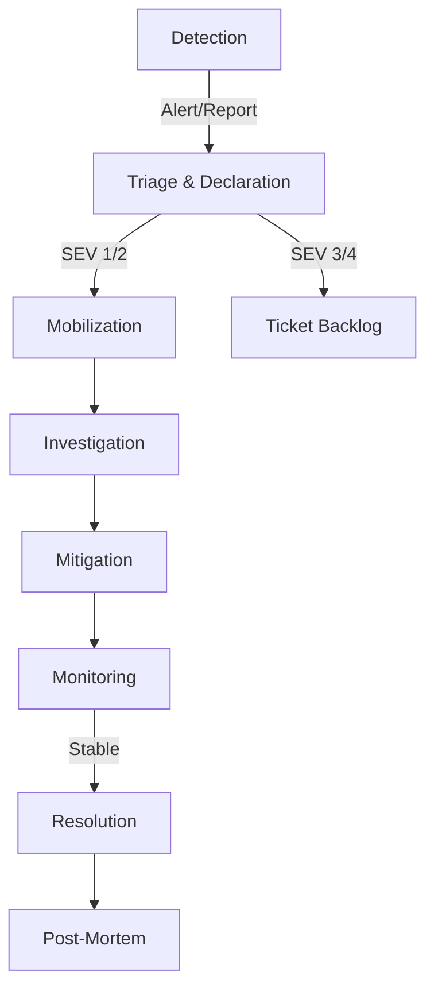

# Incident Management

## Executive Summary
This document defines the process standard for **Incident Management**. Adherence is mandatory to ensure operational excellence.

## The Process
**Effective Date:** January 1, 2024
**Owner:** SRE Directorate
**Audience:** All Engineering, Product, and Support Staff

## 1. Philosophy & Principles

At our organization, we view reliability as our most important feature. If our service is down, it doesn't matter how great the new features are; nobody can use them. Incident management is not just about "fixing what's broken"—it's a rigorous, structured process designed to minimize Mean Time to Resolution (MTTR) and maximize learning.

### Core Principles

*   **Mobilize First, Debug Second:** When an incident occurs, the priority is to assemble the right team (Mobilization). Do not attempt to fix a SEV 1 issue alone in a silo.
*   **Mitigate, Then Resolve:** The primary objective during an incident is to stop the bleeding (Mitigation). If a rollback restores service, do it, even if you don't know the root cause yet. Root cause analysis (RCA) happens *after* the fire is out.
*   **Clear Chain of Command:** In a crisis, consensus-seeking is too slow. We use a hierarchical command structure (Incident Commander) to make rapid decisions.
*   **Blameless Culture:** We assume everyone comes to work to do a good job. Incidents are system failures, not human failures. We never punish individuals for honest mistakes; we fix the system that allowed the mistake to happen.
*   **Communication is Key:** Silence creates panic. Frequent, structured updates (Internal and External) build trust even during an outage.

---

## 2. Incident Lifecycle

The lifecycle of an incident is a linear progression through distinct phases.

### Phase 1: Detection
Incidents are detected via:
1.  **Automated Alerts:** Prometheus/Datadog alerts triggered by threshold violations (e.g., Error Rate > 1%).
2.  **Manual Reporting:** Internal employees noticing issues or Customer Support escalating user tickets.

### Phase 2: Triage & Declaration
The first responder must answer: "Is this an incident?"
*   If yes, **Declare it immediately**. It is better to declare a false positive than to let a real incident burn.
*   Use the Slack command: `/incident declare`.
*   Assign an initial Severity Level (SEV).

### Phase 3: Mobilization (SEV 1/2)
The incident response machinery kicks in.
*   **War Room Created:** A dedicated Slack channel (e.g., `#incident-2023-10-24-db-lag`) and a Zoom bridge are generated.
*   **Roles Assigned:** Incident Commander (IC), Operations Lead (OL), Communications Lead (CL).
*   **Page Out:** PagerDuty escalates to the necessary on-call engineers.

### Phase 4: Investigation & Mitigation
The technical team works to identify the problem and implement a fix.
*   **Hypothesis Generation:** "I think the database is locked."
*   **Verification:** "Checking `pg_stat_activity`... confirmed, heavy locking on `orders` table."
*   **Action:** "Rolling back deployment `v1.2.3`."

### Phase 5: Resolution
The system is stable.
*   User impact has ceased.
*   Alerts have cleared.
*   The IC officially declares the incident "Resolved."

### Phase 6: Post-Mortem
Learning from the failure.
*   **Drafting:** Within 24 hours.
*   **Review Meeting:** Within 5 business days.
*   **Action Items:** Jira tickets created to prevent recurrence.

---

## 3. Severity Levels (SEV) Definitions

Correctly classifying an incident is crucial for mobilizing the right resources.

| Level | Definition | Response Expectation | Examples |
| :--- | :--- | :--- | :--- |
| **SEV 1 (Critical)** | **System Down / Critical Business Impact.**   • 100% outage for all users.  • Data loss or corruption.  • Security breach (active exploitation).  • Regulatory violation. | **Immediate (24/7)**  • Page On-Call immediately.  • Page Engineering Director.  • Notify Exec Team.  • Updates every 15-30 mins. | • "Site can't be reached"  • "Checkout is failing for all users"  • "User database deleted"  • "Ransomware detected" |
| **SEV 2 (Major)** | **Significant Degradation.**  • Core features broken for >10% of users.  • High latency making the app unusable.  • Internal blocking issue (deploy pipeline down). | **Immediate (24/7)**  • Page On-Call immediately.  • Notify Engineering Manager.  • Updates every 30-60 mins. | • "Search is down, but Checkout works"  • "API latency > 5s"  • "Inventory sync delayed by 2 hours" |
| **SEV 3 (Minor)** | **Minor Functionality Loss.**  • Non-critical bugs.  • Workaround available.  • Impacting small subset (<1%) of users. | **Business Hours**  • Page On-Call (Low Urgency).  • Fix within 1-3 business days. | • "User avatar upload failing"  • "Broken link in footer"  • "Admin report export timeout" |
| **SEV 4 (Trivial)** | **Cosmetic / Advice.**  • Typos.  • UI glitches.  • Feature requests disguised as bugs. | **SLA: Next Sprint**  • File Jira ticket.  • Do not page. | • "Button color is wrong shade of blue"  • "Documentation typo" |

---

## 4. Roles & Responsibilities

In a SEV 1/2 incident, we adopt a rigid structure derived from the **Incident Command System (ICS)** used by firefighters.

### Incident Commander (IC)
*The Conductor.*
*   **Authority:** Has absolute authority over the incident. Can preempt any other meeting or work.
*   **Responsibilities:**
    *   Assess severity and impact.
    *   Assign roles (Ops Lead, Comms Lead).
    *   Manage the timeline and "battle rhythm" (e.g., "Status check every 10 mins").
    *   Protect the Ops team from distractions (Exec swoop-ins).
    *   Make the hard calls (e.g., "Initiate failover to Region B").
*   **Anti-Patterns:** The IC should **NOT** look at logs, touch the terminal, or write code. Their head must be "up," looking at the big picture.

### Operations Lead (OL)
*The Doer.*
*   **Responsibilities:**
    *   Lead the technical investigation.
    *   Propose hypotheses and solutions to the IC.
    *   Execute commands (restart servers, rollback, query DB).
    *   Pull in Subject Matter Experts (SMEs) as needed.
*   **Anti-Patterns:** Going "rogue" and executing changes without IC approval.

### Communications Lead (CL)
*The Spokesperson.*
*   **Responsibilities:**
    *   Update the internal status page (StatusPage.io).
    *   Draft public tweets/emails (approved by Legal/PR if needed).
    *   Update the Exec team via a separate channel.
    *   Ensure the Customer Support team has a script for incoming tickets.
*   **Anti-Patterns:** Speculating on root cause publicly before verification.

### Scribe (Optional but Recommended)
*   **Responsibilities:** Record a timeline of events in the Slack channel or a Doc. "10:43 - Ops Lead restarted Pod A."
*   **Why:** Essential for the Post-Mortem.

---

## 5. War Room Protocol

When a SEV 1/2 is declared, we enter "War Room Mode."

### Communication Etiquette
1.  **Clear & Concise:** "I am restarting the load balancer. ETA 2 minutes."
2.  **Ack Everything:** If the IC gives an order, acknowledge it. "Copy, checking logs now."
3.  **No Crosstalk:** Keep the channel clear for incident-related chatter only. Take detailed debugging discussions to a thread or a breakout room.
4.  **Bot Hygiene:** The Incident Bot will post updates. Do not delete them.

### The "Exec Swoop"
Executives often join War Rooms out of concern.
*   **IC Protocol:** The IC should politely direct executives to the **Executive Update Channel** or the **Comms Lead**.
*   **Script:** "Hi [CEO], we are currently investigating a database lock. I have [Ops Lead] working on it. Please direct questions to [Comms Lead] so we can focus on resolution. Thank you."

### Handover
If an incident runs long (>4 hours), fatigue sets in.
*   **Rotation:** The IC must mandate a handover.
*   **Protocol:**
    1.  Incoming IC shadows for 15 mins.
    2.  Outgoing IC posts a "Situation Report" (SITREP).
    3.  Outgoing IC announces: "Handing over Command to [New Name]."
    4.  New IC announces: "I have Command."

---

## 6. Tooling & Automation

We use a suite of tools to manage incidents.

### PagerDuty
*   **Schedules:** Every team must have a Primary and Secondary on-call schedule.
*   **Escalation Policies:** If Primary doesn't Ack in 15 mins, page Secondary. If no Ack in 30 mins, page Manager.

### Slack
*   **Incident Bot:** Custom bot (or third-party like Rootly/FireHydrant).
    *   `/incident declare` - Starts flow.
    *   `/incident update` - Updates status board.
    *   `/incident resolve` - Archives channel.

### Status Page
*   **Public:** `status.ourcompany.com` (Customer facing).
*   **Private:** Internal dashboard for employees.
*   **Components:** API, Web App, iOS, Android, Payments, 3rd Party dependencies.

### Jira
*   **Ticket Type:** `Incident`
*   **Fields:**
    *   `Severity`: SEV 1-4
    *   `Impact Start`: Datetime
    *   `Impact End`: Datetime
    *   `Detected By`: Monitoring / User

### Zoom
*   **Bridge:** Automatically created for SEV 1.
*   **Recording:** Enabled for SEV 1 (for post-mortem review).

---

## 7. Legal & Compliance

Certain incidents trigger legal obligations.

### Data Breach (PII/PHI)
If *any* Personal Identifiable Information (PII) is exposed:
1.  **Stop:** Do not delete logs! They are evidence.
2.  **Notify:** The **Privacy Officer** and **Legal Counsel** must be paged immediately (SEV 1).
3.  **Silence:** Discuss strictly on a "Need to Know" basis.

### Financial Loss
If the incident involves financial transactions (double billing, incorrect transfers):
1.  **Audit Trail:** Preserve all database states.
2.  **Finance Team:** Notify the CFO immediately.

### SOC 2 / ISO 27001 Compliance
*   **Evidence:** All Slack transcripts, PagerDuty logs, and Post-Mortem docs must be exported and saved as evidence for auditors.
*   **Access Reviews:** Check who had access to the production system during the incident.

---

## 8. Post-Incident Analysis (Post-Mortem)

The incident is not over until the paperwork is done.

### The Document
*   **Template:** Use the standard Post-Mortem Template.
*   **Contents:**
    *   Executive Summary.
    *   Timeline (second-by-second).
    *   Root Cause (The "Five Whys").
    *   Impact (Duration, Users affected, $$ cost).
    *   Action Items (Jira links).

### The Meeting
*   **Timing:** Within 5 business days.
*   **Attendance:** IC, Ops Lead, Engineering Manager, Product Owner.
*   **Rule:** **Blamelessness.** We are here to fix the process, not fire the engineer.

### Remediation
*   Action items are tagged `prevention` or `detection`.
*   SLA for completion:
    *   SEV 1 Action Items: 1 Sprint.
    *   SEV 2 Action Items: 2 Sprints.

---

## 9. Checklists

### Incident Commander Checklist
- [ ] Claim the incident (`/incident claim`).
- [ ] Start Zoom bridge.
- [ ] Assign Scribe.
- [ ] Assess Severity.
- [ ] Assign Ops Lead.
- [ ] Assign Comms Lead.
- [ ] Post initial status update.
- [ ] Establish check-in cadence (e.g., "Update me in 10 mins").

### Ops Lead Checklist
- [ ] Acknowledge role.
- [ ] Gather initial metrics/logs.
- [ ] Formulate hypothesis.
- [ ] **Verify** hypothesis (safely).
- [ ] Propose mitigation plan to IC.
- [ ] Execute plan.
- [ ] Verify fix.

### Comms Lead Checklist
- [ ] Acknowledge role.
- [ ] Draft internal update.
- [ ] Update StatusPage (Investigating).
- [ ] Monitor #support channels for user sentiment.
- [ ] Update StatusPage (Identified).
- [ ] Update StatusPage (Monitoring).
- [ ] Update StatusPage (Resolved).

## 10. Glossary

*   **MTTR:** Mean Time To Resolution.
*   **MTTD:** Mean Time To Detection.
*   **SLA:** Service Level Agreement (Contractual).
*   **SLO:** Service Level Objective (Internal Goal).
*   **SLI:** Service Level Indicator (The metric itself).
*   **RCA:** Root Cause Analysis.
*   **SME:** Subject Matter Expert.

---

*For any questions regarding this standard, please contact the SRE Team at `sre-help@company.org`.*

## Roles and Responsibilities
*   **Process Owner:** Ensures the process is up-to-date.
*   **Practitioner:** Follows the process in daily work.
*   **Auditor:** Verifies compliance.

## Continuous Improvement
*   We review this process quarterly.
*   Please submit feedback via Jira.
