# Interview Questions: Frontend Engineer (SWEN1003)

This document contains 100 interview questions tailored for the Frontend Engineer role. The questions are categorized into five key areas: Core Web Technologies (HTML/CSS), JavaScript & TypeScript, Frameworks (React/Vue), Performance & Optimization, and Testing & Tooling.

Each question includes rich formatting and candidate response paths to help evaluate depth of knowledge.

---

## 1. Semantic HTML (HTML/CSS)

**Scenario:** SEO and Accessibility.

**Question:** Why is semantic HTML important?

| Tag | Semantic Meaning |
|---|---|
| `<article>` | Independent content |
| `<nav>` | Navigation links |
| `<div>` | Generic container (non-semantic) |

**Key Concepts:** `HTML5`, `CSS3`

### Candidate Response Paths
*   **Junior**: It's cleaner code.
*   **Senior**: Accessibility Object Model (AOM) and SEO structure.

---

## 2. Box Model (HTML/CSS)

**Scenario:** Content, Padding, Border, Margin.

**Question:** Explain the CSS Box Model.

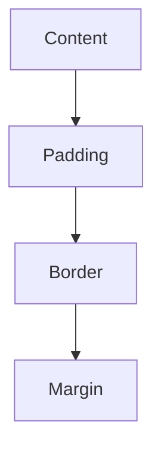

**Key Concepts:** `HTML5`, `CSS3`

### Candidate Response Paths
*   **Junior**: Lists the layers.
*   **Senior**: Discusses `box-sizing: border-box` vs `content-box`.

---

## 3. Flexbox vs Grid (HTML/CSS)

**Scenario:** 1D vs 2D layout.

**Question:** When to use Flexbox vs CSS Grid?

| Layout | Dimensions | Use Case |
|---|---|---|
| Flexbox | 1D (Row/Col) | Navbars, Lists |
| Grid | 2D (Row & Col) | Page Layouts |

**Key Concepts:** `HTML5`, `CSS3`

### Candidate Response Paths
*   **Junior**: Grid is for grids.
*   **Senior**: Flex for content-out, Grid for layout-in.

---

## 4. Specificity (HTML/CSS)

**Scenario:** ID > Class > Tag.

**Question:** How is CSS specificity calculated?

| Selector | Weight |
|---|---|
| ID | 100 |
| Class | 10 |
| Tag | 1 |

**Key Concepts:** `HTML5`, `CSS3`

### Candidate Response Paths
*   **Junior**: IDs are stronger.
*   **Senior**: Calculates `0-1-2` scores explicitly.

---

## 5. Z-Index (HTML/CSS)

**Scenario:** Positioned elements.

**Question:** How does stacking context work with z-index?

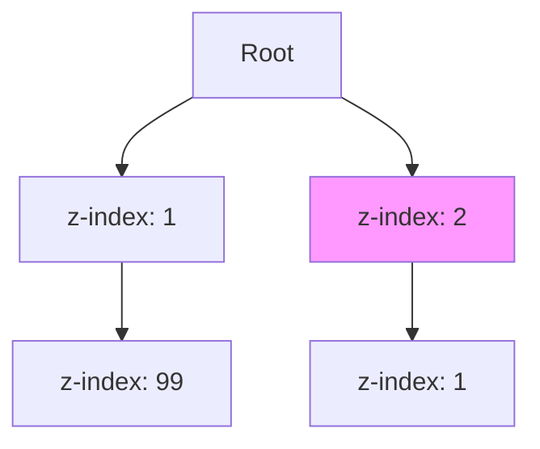

**Key Concepts:** `HTML5`, `CSS3`

### Candidate Response Paths
*   **Junior**: Higher number is on top.
*   **Senior**: Explains how stacking contexts trap children.

---

## 6. Responsive Design (HTML/CSS)

**Scenario:** Media queries min-width.

**Question:** What is the Mobile-First approach?

```css
/* Mobile First */
.col { width: 100%; }
@media (min-width: 768px) {
  .col { width: 50%; }
}
```

**Key Concepts:** `HTML5`, `CSS3`

### Candidate Response Paths
*   **Junior**: Making it work on phone.
*   **Senior**: Starting with base styles and overriding for larger screens to reduce code.

---

## 7. REM vs EM (HTML/CSS)

**Scenario:** Root relative vs Parent relative.

**Question:** Difference between rem and em units.

| Unit | Relative To |
|---|---|
| rem | Root (`<html>`) |
| em | Parent Element |

**Key Concepts:** `HTML5`, `CSS3`

### Candidate Response Paths
*   **Junior**: They are scalable.
*   **Senior**: Compounding issues with `em`.

---

## 8. Centering (HTML/CSS)

**Scenario:** Flex/Grid strategies.

**Question:** How to center a div horizontally and vertically?

```css
.parent {
  display: grid;
  place-items: center;
}
```

**Key Concepts:** `HTML5`, `CSS3`

### Candidate Response Paths
*   **Junior**: margin: 0 auto.
*   **Senior**: Modern Flex/Grid `place-items` vs legacy absolute positioning.

---

## 9. BEM Methodology (HTML/CSS)

**Scenario:** Block Element Modifier.

**Question:** Explain BEM naming convention.

```css
.card {} /* Block */
.card__title {} /* Element */
.card--featured {} /* Modifier */
```

**Key Concepts:** `HTML5`, `CSS3`

### Candidate Response Paths
*   **Junior**: Naming classes nicely.
*   **Senior**: Encapsulation and avoiding specificity wars.

---

## 10. Pseudo-classes (HTML/CSS)

**Scenario:** Element type counting.

**Question:** Difference between :nth-child and :nth-of-type.

| Selector | Matches |
|---|---|
| `:nth-child(2)` | 2nd child of parent |
| `:nth-of-type(2)` | 2nd child OF THAT TYPE |

**Key Concepts:** `HTML5`, `CSS3`

### Candidate Response Paths
*   **Junior**: Selecting numbers.
*   **Senior**: Edge cases with mixed element types.

---

## 11. CSS Variables (HTML/CSS)

**Scenario:** Runtime dynamic theming.

**Question:** Benefits of CSS Custom Properties.

```css
:root {
  --main-color: #333;
}
body {
  color: var(--main-color);
}
```

**Key Concepts:** `HTML5`, `CSS3`

### Candidate Response Paths
*   **Junior**: Reusing colors.
*   **Senior**: Runtime updating via JS and scoping rules.

---

## 12. Critical CSS (HTML/CSS)

**Scenario:** Inlining above-the-fold styles.

**Question:** What is Critical CSS?

```html
<head>
  <style>/* Fold styles */</style>
  <link rel="stylesheet" href="rest.css" media="print" onload="this.media='all'">
</head>
```

**Key Concepts:** `HTML5`, `CSS3`

### Candidate Response Paths
*   **Junior**: Important CSS.
*   **Senior**: Improving FCP (First Contentful Paint).

---

## 13. Shadow DOM (HTML/CSS)

**Scenario:** Encapsulation for Web Components.

**Question:** What is the Shadow DOM?

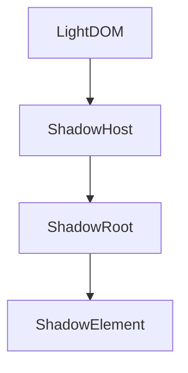

**Key Concepts:** `HTML5`, `CSS3`

### Candidate Response Paths
*   **Junior**: Hidden HTML.
*   **Senior**: Style isolation and component boundaries.

---

## 14. Meta Viewport (HTML/CSS)

**Scenario:** Mobile scaling control.

**Question:** Purpose of the viewport meta tag.

```html
<meta name="viewport" content="width=device-width, initial-scale=1">
```

**Key Concepts:** `HTML5`, `CSS3`

### Candidate Response Paths
*   **Junior**: For mobile.
*   **Senior**: Preventing user scaling or setting 1:1 pixel mapping.

---

## 15. Alt Text (HTML/CSS)

**Scenario:** Descriptive for screen readers.

**Question:** Best practices for Alt Text.

| Image Type | Alt Strategy |
|---|---|
| Decorative | `alt=""` |
| Informational | `alt="Description"` |

**Key Concepts:** `HTML5`, `CSS3`

### Candidate Response Paths
*   **Junior**: Describe image.
*   **Senior**: Contextual description or empty for decorative.

---

## 16. Form Validation (HTML/CSS)

**Scenario:** required, pattern attributes.

**Question:** Native HTML5 form validation features.

```html
<input type="email" required pattern=".+@globex.com">
```

**Key Concepts:** `HTML5`, `CSS3`

### Candidate Response Paths
*   **Junior**: Using JS to check inputs.
*   **Senior**: Constraint Validation API and `:invalid` pseudo-class.

---

## 17. CSS Preprocessors (HTML/CSS)

**Scenario:** Nesting, mixins vs build step.

**Question:** Pros and Cons of SASS/SCSS.

| Feature | SASS | Native CSS |
|---|---|---|
| Nesting | Yes | Yes (New) |
| Mixins | Yes | No |

**Key Concepts:** `HTML5`, `CSS3`

### Candidate Response Paths
*   **Junior**: Cleaner syntax.
*   **Senior**: Compilation overhead vs features like loops/math.

---

## 18. Layout Shift (HTML/CSS)

**Scenario:** Size attributes on images.

**Question:** How to prevent CLS (Cumulative Layout Shift)?

```html
<!-- Bad -->

<!-- Good -->

```

**Key Concepts:** `HTML5`, `CSS3`

### Candidate Response Paths
*   **Junior**: Don't move things.
*   **Senior**: Reserving aspect-ratio space.

---

## 19. Local Storage vs Session (HTML/CSS)

**Scenario:** Persistence and scope.

**Question:** Difference between localStorage, sessionStorage, and cookies.

| Storage | Persists Until | Size Limit |
|---|---|---|
| Local | Explicit clear | ~5MB |
| Session | Tab close | ~5MB |
| Cookie | Expiry date | 4KB |

**Key Concepts:** `HTML5`, `CSS3`

### Candidate Response Paths
*   **Junior**: Storing data.
*   **Senior**: Security implications (XSS) and server transmission (Cookies).

---

## 20. Favicons (HTML/CSS)

**Scenario:** SVG, PNG sizes.

**Question:** Best practices for modern favicons.

```html
<link rel="icon" href="icon.svg" type="image/svg+xml">
<link rel="apple-touch-icon" href="apple-touch-icon.png">
```

**Key Concepts:** `HTML5`, `CSS3`

### Candidate Response Paths
*   **Junior**: Small icon.
*   **Senior**: SVG support and dark mode handling.

---

## 21. Event Loop (JavaScript)

**Scenario:** Call stack, Task Queue, Microtask Queue.

**Question:** Explain the Event Loop.

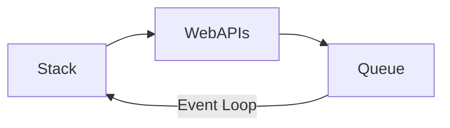

**Key Concepts:** `ES6+`, `Async`

### Candidate Response Paths
*   **Junior**: JS is single threaded.
*   **Senior**: Microtasks (Promises) vs Macrotasks (setTimeout).

---

## 22. Closures (JavaScript)

**Scenario:** Function bundled with its lexical environment.

**Question:** What is a Closure?

```javascript
function outer() {
  let count = 0;
  return () => count++;
}
```

**Key Concepts:** `ES6+`, `Async`

### Candidate Response Paths
*   **Junior**: Function inside function.
*   **Senior**: Data privacy and memoization usage.

---

## 23. Hoisting (JavaScript)

**Scenario:** Var vs Let/Const.

**Question:** Explain variable hoisting.

```javascript
console.log(a); // undefined
var a = 1;
console.log(b); // ReferenceError
let b = 1;
```

**Key Concepts:** `ES6+`, `Async`

### Candidate Response Paths
*   **Junior**: Moving to top.
*   **Senior**: Temporal Dead Zone (TDZ).

---

## 24. Prototypes (JavaScript)

**Scenario:** Prototype chain.

**Question:** How does Prototypal Inheritance work?

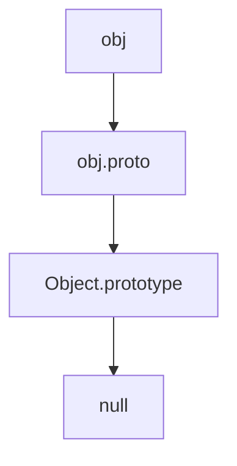

**Key Concepts:** `ES6+`, `Async`

### Candidate Response Paths
*   **Junior**: Inheritance.
*   **Senior**: Difference from Class-based inheritance.

---

## 25. This Keyword (JavaScript)

**Scenario:** Call site (implicit, explicit, new binding).

**Question:** How is 'this' determined?

| Call Type | 'this' refers to |
|---|---|
| obj.method() | obj |
| func() | global/undefined |
| new Func() | new instance |

**Key Concepts:** `ES6+`, `Async`

### Candidate Response Paths
*   **Junior**: The object.
*   **Senior**: Arrow functions lexical binding.

---

## 26. Promises (JavaScript)

**Scenario:** Concurrent handling.

**Question:** Promise.all vs Promise.race.

```javascript
Promise.all([p1, p2]) // Waits for all
Promise.race([p1, p2]) // First to settle
```

**Key Concepts:** `ES6+`, `Async`

### Candidate Response Paths
*   **Junior**: Async handling.
*   **Senior**: Error handling behavior (fail-fast vs fail-safe).

---

## 27. Async/Await (JavaScript)

**Scenario:** Try/Catch blocks.

**Question:** Error handling in Async/Await.

```javascript
try {
  const res = await fetch();
} catch (e) {
  handle(e);
}
```

**Key Concepts:** `ES6+`, `Async`

### Candidate Response Paths
*   **Junior**: Syntactic sugar.
*   **Senior**: It returns a Promise.

---

## 28. ES6 Modules (JavaScript)

**Scenario:** require vs import.

**Question:** CommonJS vs ES Modules.

| Feature | CJS | ESM |
|---|---|---|
| Syntax | require() | import |
| Loading | Synchronous | Asynchronous |

**Key Concepts:** `ES6+`, `Async`

### Candidate Response Paths
*   **Junior**: Import/Export.
*   **Senior**: Tree-shaking support in ESM.

---

## 29. Deep Clone (JavaScript)

**Scenario:** JSON methods vs structuredClone.

**Question:** How to deep clone an object?

```javascript
// Modern
const copy = structuredClone(original);
// Hacky
const copy = JSON.parse(JSON.stringify(original));
```

**Key Concepts:** `ES6+`, `Async`

### Candidate Response Paths
*   **Junior**: JSON parse/stringify.
*   **Senior**: Handling circular references and Date/Map objects.

---

## 30. Debounce vs Throttle (JavaScript)

**Scenario:** Delaying execution vs Rate limiting.

**Question:** Difference between Debounce and Throttle.

| Pattern | Behavior |
|---|---|
| Debounce | Wait for pause |
| Throttle | Limit frequency |


**Key Concepts:** `ES6+`, `Async`

### Candidate Response Paths
*   **Junior**: Limiting calls.
*   **Senior**: Search input (Debounce) vs Scroll listener (Throttle).

---

## 31. Bubbling vs Capturing (JavaScript)

**Scenario:** Phases of event handling.

**Question:** Explain Event Propagation.

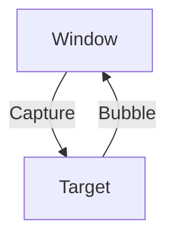

**Key Concepts:** `ES6+`, `Async`

### Candidate Response Paths
*   **Junior**: Events go up.
*   **Senior**: Event delegation usage.

---

## 32. Map vs Set (JavaScript)

**Scenario:** Key types, uniqueness.

**Question:** Use cases for Map and Set.

| Type | Key Types | Unique? |
|---|---|---|
| Object | Strings | Keys |
| Map | Any | Keys |
| Set | N/A | Values |

**Key Concepts:** `ES6+`, `Async`

### Candidate Response Paths
*   **Junior**: Dictionaries.
*   **Senior**: Map preserves insertion order.

---

## 33. WeakMap (JavaScript)

**Scenario:** Garbage collection of keys.

**Question:** What is a WeakMap?

```javascript
let obj = {};
const wm = new WeakMap();
wm.set(obj, 'data');
obj = null; // 'data' can be GC'd
```

**Key Concepts:** `ES6+`, `Async`

### Candidate Response Paths
*   **Junior**: A map.
*   **Senior**: Preventing memory leaks with DOM node references.

---

## 34. Generators (JavaScript)

**Scenario:** Pausing execution with yield.

**Question:** What are Generator functions?

```javascript
function* gen() {
  yield 1;
  yield 2;
}
```

**Key Concepts:** `ES6+`, `Async`

### Candidate Response Paths
*   **Junior**: Functions with stars.
*   **Senior**: Iterators and async flow control (sagas).

---

## 35. Currying (JavaScript)

**Scenario:** Transforming f(a,b) to f(a)(f(b)).

**Question:** What is Currying?

```javascript
const add = a => b => a + b;
add(1)(2);
```

**Key Concepts:** `ES6+`, `Async`

### Candidate Response Paths
*   **Junior**: Nested functions.
*   **Senior**: Partial application and functional composition.

---

## 36. Arrow Functions (JavaScript)

**Scenario:** 'this' binding.

**Question:** Difference between arrow functions and regular functions.

| Feature | Function | Arrow |
|---|---|---|
| `this` | Dynamic | Lexical |
| `arguments` | Yes | No |

**Key Concepts:** `ES6+`, `Async`

### Candidate Response Paths
*   **Junior**: Shorter syntax.
*   **Senior**: Cannot be used as constructors.

---

## 37. Strict Mode (JavaScript)

**Scenario:** Prevents global leaks, silent errors.

**Question:** What does 'use strict' do?

```javascript
'use strict';
x = 3.14; // ReferenceError
```

**Key Concepts:** `ES6+`, `Async`

### Candidate Response Paths
*   **Junior**: Makes JS stricter.
*   **Senior**: Changes `this` behavior and prevents octal literals.

---

## 38. Type Coercion (JavaScript)

**Scenario:** Type conversion rules.

**Question:** Explain '==' vs '==='.

| Comparison | Result |
|---|---|
| '5' == 5 | true |
| '5' === 5 | false |

**Key Concepts:** `ES6+`, `Async`

### Candidate Response Paths
*   **Junior**: Use triple equals.
*   **Senior**: Implicit coercion rules.

---

## 39. Array Methods (JavaScript)

**Scenario:** Return new array vs Side effects.

**Question:** Map vs ForEach.

```javascript
// Returns array
[1,2].map(x => x*2)
// Returns undefined
[1,2].forEach(x => console.log(x))
```

**Key Concepts:** `ES6+`, `Async`

### Candidate Response Paths
*   **Junior**: Looping.
*   **Senior**: Functional purity vs imperative side effects.

---

## 40. Service Workers (JavaScript)

**Scenario:** Offline capability, caching.

**Question:** Role of Service Workers.


**Key Concepts:** `ES6+`, `Async`

### Candidate Response Paths
*   **Junior**: Offline mode.
*   **Senior**: Background sync and Push notifications.

---

## 41. Virtual DOM (Frameworks)

**Scenario:** Diffing algorithm.

**Question:** How does the Virtual DOM work?

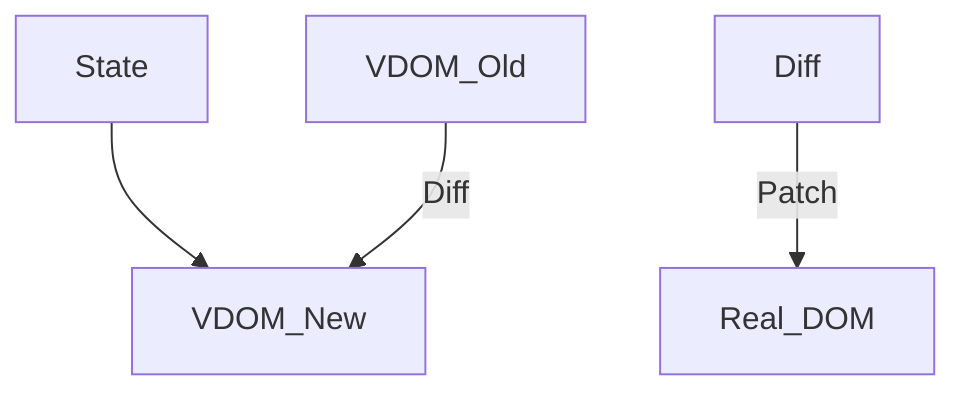

**Key Concepts:** `React`, `Vue`, `Angular`

### Candidate Response Paths
*   **Junior**: It's faster DOM.
*   **Senior**: Reconciliation and minimizing reflows.

---

## 42. Component Lifecycle (Frameworks)

**Scenario:** Mount, Update, Unmount.

**Question:** Explain React Lifecycle methods (or Hooks).

| Phase | Hook | Class |
|---|---|---|
| Mount | useEffect([]) | componentDidMount |
| Update | useEffect([dep]) | componentDidUpdate |

**Key Concepts:** `React`, `Vue`, `Angular`

### Candidate Response Paths
*   **Junior**: useEffect.
*   **Senior**: Cleanup functions and dependency array pitfalls.

---

## 43. State Management (Frameworks)

**Scenario:** Global store vs Prop drilling solution.

**Question:** Redux vs Context API.

| Feature | Context | Redux |
|---|---|---|
| Setup | Simple | Complex |
| Performance | Re-renders children | Optimized Selectors |

**Key Concepts:** `React`, `Vue`, `Angular`

### Candidate Response Paths
*   **Junior**: Redux is hard.
*   **Senior**: When to use which (Frequency of updates).

---

## 44. Props vs State (Frameworks)

**Scenario:** Immutable passed down vs Mutable local.

**Question:** Difference between Props and State.

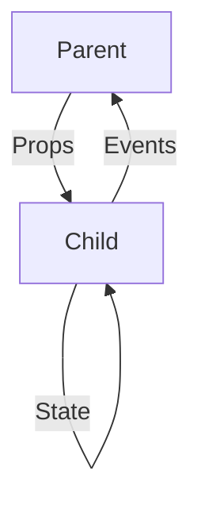

**Key Concepts:** `React`, `Vue`, `Angular`

### Candidate Response Paths
*   **Junior**: Props passed, State local.
*   **Senior**: Unidirectional data flow.

---

## 45. Higher Order Components (Frameworks)

**Scenario:** Function taking a component and returning one.

**Question:** What is a HOC?

```javascript
const withAuth = (Component) => (props) =>
  isAuth ? <Component {...props} /> : <Login />;
```

**Key Concepts:** `React`, `Vue`, `Angular`

### Candidate Response Paths
*   **Junior**: Wrappers.
*   **Senior**: Prop collision and Composition.

---

## 46. Render Props (Frameworks)

**Scenario:** Sharing code via a prop function.

**Question:** What is the Render Props pattern?

```jsx
<Mouse render={mouse => (
  <Cat mouse={mouse} />
)}/>
```

**Key Concepts:** `React`, `Vue`, `Angular`

### Candidate Response Paths
*   **Junior**: Prop that is function.
*   **Senior**: Logic reuse before Hooks existed.

---

## 47. Hooks Rules (Frameworks)

**Scenario:** Top level only, only in functions.

**Question:** Rules of Hooks.

```javascript
// Bad
if (cond) { useEffect(...) }
```

**Key Concepts:** `React`, `Vue`, `Angular`

### Candidate Response Paths
*   **Junior**: Don't put in loops.
*   **Senior**: Maintaining call order stability.

---

## 48. useMemo vs useCallback (Frameworks)

**Scenario:** Referential equality optimization.

**Question:** When to use memoization?

| Hook | Returns | Use Case |
|---|---|---|
| useMemo | Value | Expensive calc |
| useCallback | Function | Passing prop to memo'd child |

**Key Concepts:** `React`, `Vue`, `Angular`

### Candidate Response Paths
*   **Junior**: For performance.
*   **Senior**: Preventing unnecessary re-renders of children.

---

## 49. Reconciliation (Frameworks)

**Scenario:** Updating the DOM efficiently.

**Question:** What is React Reconciliation?

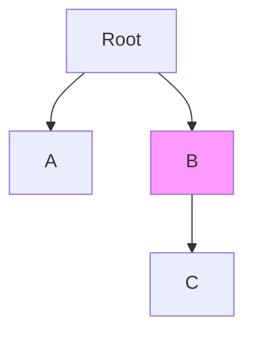

**Key Concepts:** `React`, `Vue`, `Angular`

### Candidate Response Paths
*   **Junior**: Updating UI.
*   **Senior**: Fiber architecture and heuristic diffing (O(n)).

---

## 50. Keys in Lists (Frameworks)

**Scenario:** Identifying changed items.

**Question:** Why are keys important in lists?

```jsx
// Bad
items.map((item, index) => <li key={index} />)
```

**Key Concepts:** `React`, `Vue`, `Angular`

### Candidate Response Paths
*   **Junior**: React warns without them.
*   **Senior**: Stability of identity during re-order.

---

## 51. Controlled Components (Frameworks)

**Scenario:** React state vs DOM state.

**Question:** Controlled vs Uncontrolled components.

| Type | Source of Truth | Access |
|---|---|---|
| Controlled | React State | `value` prop |
| Uncontrolled | DOM | `ref` |

**Key Concepts:** `React`, `Vue`, `Angular`

### Candidate Response Paths
*   **Junior**: Using useState.
*   **Senior**: Validation and masking.

---

## 52. Fragments (Frameworks)

**Scenario:** Grouping without adding DOM nodes.

**Question:** Purpose of Fragments.

```jsx
<>
  <ChildA />
  <ChildB />
</>
```

**Key Concepts:** `React`, `Vue`, `Angular`

### Candidate Response Paths
*   **Junior**: Empty tags.
*   **Senior**: Flexbox layouts and semantic HTML validity.

---

## 53. Portals (Frameworks)

**Scenario:** Modals, Tooltips.

**Question:** Use cases for Portals.

```javascript
createPortal(<Modal />, document.body)
```

**Key Concepts:** `React`, `Vue`, `Angular`

### Candidate Response Paths
*   **Junior**: Popups.
*   **Senior**: Breaking out of `overflow: hidden` containers.

---

## 54. Server Side Rendering (Frameworks)

**Scenario:** SEO, TTI vs TTFB.

**Question:** SSR vs Client Side Rendering (CSR).

| Metric | CSR | SSR |
|---|---|---|
| TTFB | Fast | Slow |
| TTI | Slow | Fast |

**Key Concepts:** `React`, `Vue`, `Angular`

### Candidate Response Paths
*   **Junior**: SEO.
*   **Senior**: Hydration costs.

---

## 55. Static Site Generation (Frameworks)

**Scenario:** Build time vs Request time.

**Question:** SSG vs SSR.

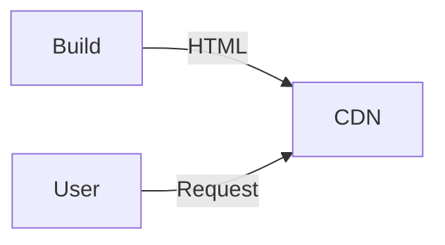

**Key Concepts:** `React`, `Vue`, `Angular`

### Candidate Response Paths
*   **Junior**: Gatsby/Next.
*   **Senior**: Incremental Static Regeneration (ISR).

---

## 56. Hydration (Frameworks)

**Scenario:** Attaching events to static HTML.

**Question:** What is Hydration?

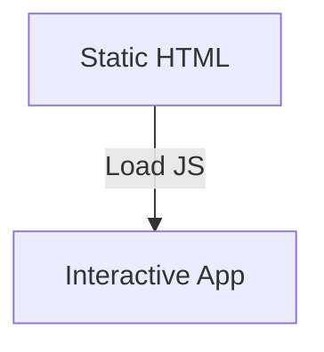

**Key Concepts:** `React`, `Vue`, `Angular`

### Candidate Response Paths
*   **Junior**: Loading JS.
*   **Senior**: Mismatch errors between server and client render.

---

## 57. Lazy Loading (Frameworks)

**Scenario:** React.lazy, Suspense.

**Question:** How to implement code splitting?

```jsx
const OtherComponent = React.lazy(() => import('./OtherComponent'));
```

**Key Concepts:** `React`, `Vue`, `Angular`

### Candidate Response Paths
*   **Junior**: Loading later.
*   **Senior**: Webpack chunks and Suspense fallbacks.

---

## 58. Vue Reactivity (Frameworks)

**Scenario:** Getters/Setters vs Proxies.

**Question:** How does Vue's reactivity system work?

```javascript
// Vue 2
Object.defineProperty(data, 'count', {...})
// Vue 3
new Proxy(data, {...})
```

**Key Concepts:** `React`, `Vue`, `Angular`

### Candidate Response Paths
*   **Junior**: Magic.
*   **Senior**: Dependency tracking and watchers.

---

## 59. Angular DI (Frameworks)

**Scenario:** Services and Providers.

**Question:** Dependency Injection in Angular.

```typescript
constructor(private http: HttpClient) {}
```

**Key Concepts:** `React`, `Vue`, `Angular`

### Candidate Response Paths
*   **Junior**: Services.
*   **Senior**: Hierarchical injectors and singleton scope.

---

## 60. Next.js (Frameworks)

**Scenario:** File-based routing, API routes.

**Question:** Benefits of Next.js.

| Feature | React | Next.js |
|---|---|---|
| Routing | Library (Router) | Built-in (Files) |
| Rendering | CSR | SSR/SSG/ISR |

**Key Concepts:** `React`, `Vue`, `Angular`

### Candidate Response Paths
*   **Junior**: It's easy.
*   **Senior**: Image optimization and Edge middleware.

---

## 61. Critical Rendering Path (Performance)

**Scenario:** DOM -> CSSOM -> Render Tree -> Layout -> Paint.

**Question:** Explain the CRP.

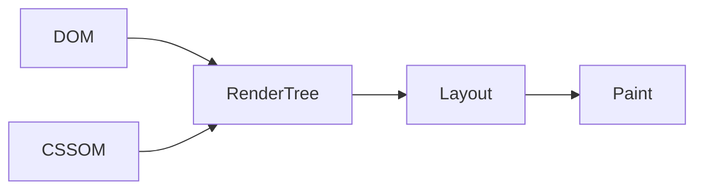

**Key Concepts:** `Optimization`, `Web Vitals`

### Candidate Response Paths
*   **Junior**: How browser renders.
*   **Senior**: Blocking resources and optimization.

---

## 62. Core Web Vitals (Performance)

**Scenario:** User experience metrics.

**Question:** What is LCP, FID, CLS?

| Metric | Meaning | Target |
|---|---|---|
| LCP | Loading | < 2.5s |
| FID | Interactivity | < 100ms |
| CLS | Stability | < 0.1 |

**Key Concepts:** `Optimization`, `Web Vitals`

### Candidate Response Paths
*   **Junior**: Google scores.
*   **Senior**: Strategies to improve each specific metric.

---

## 63. Bundle Size (Performance)

**Scenario:** Tree shaking, Minification.

**Question:** How to reduce bundle size?

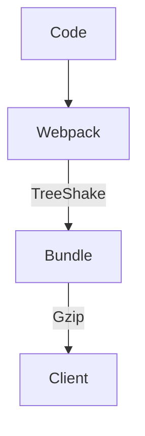

**Key Concepts:** `Optimization`, `Web Vitals`

### Candidate Response Paths
*   **Junior**: Minify.
*   **Senior**: Bundle analysis and vendor splitting.

---

## 64. Image Optimization (Performance)

**Scenario:** Compression and formats.

**Question:** WebP vs JPEG.

```html
<picture>
  <source srcset="img.webp" type="image/webp">
  
</picture>
```

**Key Concepts:** `Optimization`, `Web Vitals`

### Candidate Response Paths
*   **Junior**: Use smaller images.
*   **Senior**: Responsive images (`srcset`) and modern formats.

---

## 65. Preload/Prefetch (Performance)

**Scenario:** High priority vs Low priority.

**Question:** Difference between preload and prefetch.

| Rel | Priority | Use Case |
|---|---|---|
| preload | High | Current Page |
| prefetch | Low | Next Page |

**Key Concepts:** `Optimization`, `Web Vitals`

### Candidate Response Paths
*   **Junior**: Loading faster.
*   **Senior**: Resource hinting for fonts/scripts.

---

## 66. CDN (Performance)

**Scenario:** Latency reduction.

**Question:** Role of CDN in frontend performance.

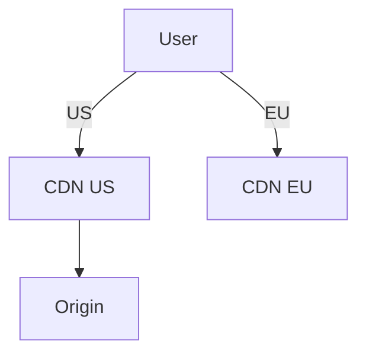

**Key Concepts:** `Optimization`, `Web Vitals`

### Candidate Response Paths
*   **Junior**: Faster images.
*   **Senior**: Caching headers and edge caching strategies.

---

## 67. Reflow vs Repaint (Performance)

**Scenario:** Layout changes vs color changes.

**Question:** What causes Reflow?

| Action | Triggers | Cost |
|---|---|---|
| Resize | Reflow | High |
| Color | Repaint | Low |

**Key Concepts:** `Optimization`, `Web Vitals`

### Candidate Response Paths
*   **Junior**: Rendering.
*   **Senior**: Layout thrashing and batching DOM reads/writes.

---

## 68. Web Workers (Performance)

**Scenario:** Keeping main thread free.

**Question:** Offloading tasks to Web Workers.

```javascript
const worker = new Worker('worker.js');
worker.postMessage(data);
```

**Key Concepts:** `Optimization`, `Web Vitals`

### Candidate Response Paths
*   **Junior**: Background threads.
*   **Senior**: No DOM access, message passing overhead.

---

## 69. Memory Leaks JS (Performance)

**Scenario:** Uncleared intervals, listeners.

**Question:** Common causes of memory leaks in SPA.

```javascript
// Leak
useEffect(() => {
  window.addEventListener('scroll', fn);
  // No cleanup!
}, [])
```

**Key Concepts:** `Optimization`, `Web Vitals`

### Candidate Response Paths
*   **Junior**: Not cleaning up.
*   **Senior**: Detached DOM nodes and closures.

---

## 70. Memoization (Performance)

**Scenario:** Caching results.

**Question:** Implementing a memoize function.

```javascript
const memoized = (args) => cache[args] || (cache[args] = fn(args));
```

**Key Concepts:** `Optimization`, `Web Vitals`

### Candidate Response Paths
*   **Junior**: Caching.
*   **Senior**: Trade-off between CPU and Memory.

---

## 71. HTTP/2 (Performance)

**Scenario:** Multiplexing.

**Question:** Benefits of HTTP/2 for assets.

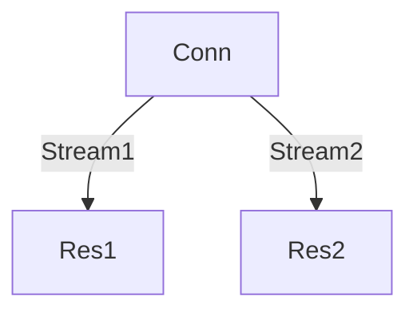

**Key Concepts:** `Optimization`, `Web Vitals`

### Candidate Response Paths
*   **Junior**: Faster.
*   **Senior**: No need for domain sharding or sprite sheets.

---

## 72. Gzip/Brotli (Performance)

**Scenario:** Reducing transfer size.

**Question:** Compression algorithms.

| Algo | Compression | Speed |
|---|---|---|
| Gzip | Good | Fast |
| Brotli | Better | Slower |

**Key Concepts:** `Optimization`, `Web Vitals`

### Candidate Response Paths
*   **Junior**: Zipping files.
*   **Senior**: Server configuration and content-type support.

---

## 73. Lazy Loading Images (Performance)

**Scenario:** loading='lazy' attribute.

**Question:** Native lazy loading.

```html

```

**Key Concepts:** `Optimization`, `Web Vitals`

### Candidate Response Paths
*   **Junior**: JS libraries.
*   **Senior**: Browser support and intersection observer fallback.

---

## 74. Font Loading (Performance)

**Scenario:** Flash of Invisible/Unstyled Text.

**Question:** FOIT vs FOUT.

```css
font-display: swap;
```

**Key Concepts:** `Optimization`, `Web Vitals`

### Candidate Response Paths
*   **Junior**: Fonts loading.
*   **Senior**: Optimizing font rendering critical path.

---

## 75. Throttling Network (Performance)

**Scenario:** DevTools simulation.

**Question:** Testing on slow networks.

| Preset | Speed |
|---|---|
| Fast 3G | 1.6 Mbps |
| Slow 3G | 500 Kbps |

**Key Concepts:** `Optimization`, `Web Vitals`

### Candidate Response Paths
*   **Junior**: Using bad wifi.
*   **Senior**: Chrome DevTools Network conditions.

---

## 76. Request Animation Frame (Performance)

**Scenario:** Syncing with refresh rate.

**Question:** Why use requestAnimationFrame?

```javascript
requestAnimationFrame(() => {
  element.style.width = width + 'px';
});
```

**Key Concepts:** `Optimization`, `Web Vitals`

### Candidate Response Paths
*   **Junior**: Animations.
*   **Senior**: vs setInterval (dropping frames).

---

## 77. Virtualization (Performance)

**Scenario:** Windowing techniques.

**Question:** Rendering large lists.

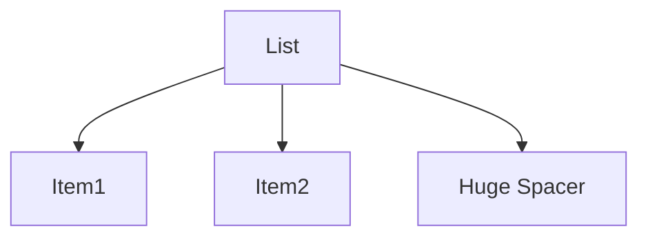

**Key Concepts:** `Optimization`, `Web Vitals`

### Candidate Response Paths
*   **Junior**: Pagination.
*   **Senior**: Recycling DOM nodes (react-window).

---

## 78. Code Splitting (Performance)

**Scenario:** Loading chunks on navigation.

**Question:** Route-based code splitting.

```javascript
import('./routes/Dashboard')
```

**Key Concepts:** `Optimization`, `Web Vitals`

### Candidate Response Paths
*   **Junior**: Splitting files.
*   **Senior**: Dynamic imports and webpack magic comments.

---

## 79. Inline Styles (Performance)

**Scenario:** CSSOM construction.

**Question:** Performance impact of inline styles.

```jsx
<div style={{ color: 'red' }} />
```

**Key Concepts:** `Optimization`, `Web Vitals`

### Candidate Response Paths
*   **Junior**: Bad style.
*   **Senior**: Increases HTML size vs CSS caching.

---

## 80. React Profiler (Performance)

**Scenario:** Identifying expensive renders.

**Question:** Using the Profiler.

```jsx
<Profiler id="App" onRender={callback}>
  <App />
</Profiler>
```

**Key Concepts:** `Optimization`, `Web Vitals`

### Candidate Response Paths
*   **Junior**: Finding bugs.
*   **Senior**: Commit time vs Render time analysis.

---

## 81. Webpack (Tooling & Testing)

**Scenario:** Transforming files, build steps.

**Question:** Concept of Loaders and Plugins.

| Concept | Role |
|---|---|
| Loader | File transform (babel-loader) |
| Plugin | Bundle transform (HtmlWebpackPlugin) |

**Key Concepts:** `DevOps`, `QA`

### Candidate Response Paths
*   **Junior**: Compiles code.
*   **Senior**: Configuration details and custom plugins.

---

## 82. Babel (Tooling & Testing)

**Scenario:** Transpiling ES6+ to ES5.

**Question:** What does Babel do?

```javascript
// Input
const x = () => {};
// Output
var x = function() {};
```

**Key Concepts:** `DevOps`, `QA`

### Candidate Response Paths
*   **Junior**: Updates JS.
*   **Senior**: Polyfills (core-js) vs Syntax transform.

---

## 83. Git Workflow (Tooling & Testing)

**Scenario:** Communication.

**Question:** Handling merge conflicts.

```bash
<<<<<<< HEAD
Mine
=======
Theirs
>>>>>>> branch
```

**Key Concepts:** `DevOps`, `QA`

### Candidate Response Paths
*   **Junior**: Ask senior.
*   **Senior**: Interactive rebase and conflict resolution strategies.

---

## 84. Unit Testing (Tooling & Testing)

**Scenario:** Test runners and assertion libs.

**Question:** Jest vs Mocha.

```javascript
test('adds 1 + 2', () => {
  expect(sum(1, 2)).toBe(3);
});
```

**Key Concepts:** `DevOps`, `QA`

### Candidate Response Paths
*   **Junior**: Testing code.
*   **Senior**: Mocking capabilities and parallel execution.

---

## 85. E2E Testing (Tooling & Testing)

**Scenario:** Browser automation.

**Question:** Cypress vs Selenium.

```javascript
cy.visit('/login');
cy.get('.btn').click();
```

**Key Concepts:** `DevOps`, `QA`

### Candidate Response Paths
*   **Junior**: Clicking buttons.
*   **Senior**: Flakiness, retry logic, and architecture differences.

---

## 86. Snapshot Testing (Tooling & Testing)

**Scenario:** Regression detection vs brittleness.

**Question:** Pros and Cons of Snapshots.

```javascript
expect(tree).toMatchSnapshot();
```

**Key Concepts:** `DevOps`, `QA`

### Candidate Response Paths
*   **Junior**: Easy tests.
*   **Senior**: Easy to ignore failures; good for configuration/static markup.

---

## 87. Mocking (Tooling & Testing)

**Scenario:** msw, jest.mock.

**Question:** Mocking API calls in tests.

```javascript
server.use(
  rest.get('/api', (req, res, ctx) => res(ctx.json({})))
)
```

**Key Concepts:** `DevOps`, `QA`

### Candidate Response Paths
*   **Junior**: Fake data.
*   **Senior**: Service Worker mocking (MSW) vs Jest module mocking.

---

## 88. Accessibility Audit (Tooling & Testing)

**Scenario:** Lighthouse, axe-core.

**Question:** Tools for A11y testing.

| Tool | usage |
|---|---|
| Lighthouse | Overall Score |
| Axe | Specific violations |

**Key Concepts:** `DevOps`, `QA`

### Candidate Response Paths
*   **Junior**: Chrome audit.
*   **Senior**: Automated CI checks vs Manual screen reader testing.

---

## 89. Linting (Tooling & Testing)

**Scenario:** Code quality enforcement.

**Question:** Role of ESLint.

```json
"rules": {
  "no-unused-vars": "error"
}
```

**Key Concepts:** `DevOps`, `QA`

### Candidate Response Paths
*   **Junior**: Finds errors.
*   **Senior**: AST analysis and writing custom rules.

---

## 90. Prettier (Tooling & Testing)

**Scenario:** Formatting vs Code Logic.

**Question:** Prettier vs ESLint.

| Tool | Focus |
|---|---|
| Prettier | Style (Spaces, quotes) |
| ESLint | Quality (Vars, bugs) |

**Key Concepts:** `DevOps`, `QA`

### Candidate Response Paths
*   **Junior**: Make code pretty.
*   **Senior**: Integrating them to avoid conflicts.

---

## 91. Docker (Tooling & Testing)

**Scenario:** Consistent build environment.

**Question:** Why use Docker for frontend?

```dockerfile
FROM node:18-alpine
RUN npm install
```

**Key Concepts:** `DevOps`, `QA`

### Candidate Response Paths
*   **Junior**: Deployment.
*   **Senior**: Reproducible builds matching CI.

---

## 92. CI/CD (Tooling & Testing)

**Scenario:** Build, Test, Deploy (Netlify/Vercel).

**Question:** Frontend deployment pipeline.


**Key Concepts:** `DevOps`, `QA`

### Candidate Response Paths
*   **Junior**: Deploying.
*   **Senior**: Preview deployments and atomic rollbacks.

---

## 93. NPM Scripts (Tooling & Testing)

**Scenario:** start, build, test, eject.

**Question:** Common scripts.

```json
"scripts": {
  "start": "react-scripts start"
}
```

**Key Concepts:** `DevOps`, `QA`

### Candidate Response Paths
*   **Junior**: Running code.
*   **Senior**: Chaining scripts and environment variables.

---

## 94. Package Lock (Tooling & Testing)

**Scenario:** Deterministic dependency tree.

**Question:** Purpose of package-lock.json.

```json
"resolved": "https://registry...",
"integrity": "sha512..."
```

**Key Concepts:** `DevOps`, `QA`

### Candidate Response Paths
*   **Junior**: Auto generated.
*   **Senior**: Ensuring team has exact same versions.

---

## 95. Semantic Versioning (Tooling & Testing)

**Scenario:** Compatibility.

**Question:** Explain SemVer (Major.Minor.Patch).

| Part | Change |
|---|---|
| Major | Breaking |
| Minor | Feature |
| Patch | Fix |

**Key Concepts:** `DevOps`, `QA`

### Candidate Response Paths
*   **Junior**: Numbers.
*   **Senior**: Caret `^` vs Tilde `~` ranges.

---

## 96. Monorepo (Tooling & Testing)

**Scenario:** Shared code, atomic commits.

**Question:** Pros of Monorepos (Nx, Lerna).

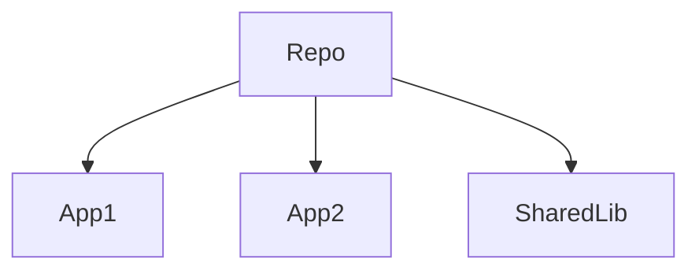

**Key Concepts:** `DevOps`, `QA`

### Candidate Response Paths
*   **Junior**: One folder.
*   **Senior**: Dependency graph and intelligent caching.

---

## 97. TypeScript Generics (Tooling & Testing)

**Scenario:** Reusable type safe components.

**Question:** Use case for Generics.

```typescript
function identity<T>(arg: T): T {
  return arg;
}
```

**Key Concepts:** `DevOps`, `QA`

### Candidate Response Paths
*   **Junior**: Types.
*   **Senior**: Constraints `T extends` and utility types.

---

## 98. TS Interfaces vs Types (Tooling & Testing)

**Scenario:** Extensibility vs Unions.

**Question:** Difference between Interface and Type.

| Feature | Interface | Type |
|---|---|---|
| Extend | Yes | Intersection |
| Unions | No | Yes |

**Key Concepts:** `DevOps`, `QA`

### Candidate Response Paths
*   **Junior**: They are same.
*   **Senior**: Interface merging vs Type flexibility.

---

## 99. Code Coverage (Tooling & Testing)

**Scenario:** Diminishing returns.

**Question:** Is 100% coverage necessary?

```bash
Lines: 80%
Functions: 90%
```

**Key Concepts:** `DevOps`, `QA`

### Candidate Response Paths
*   **Junior**: Yes.
*   **Senior**: No, focus on critical paths and business logic.

---

## 100. Debugging (Tooling & Testing)

**Scenario:** Breakpoints, console, network tab.

**Question:** Debugging strategies.

```javascript
debugger;
```

**Key Concepts:** `DevOps`, `QA`

### Candidate Response Paths
*   **Junior**: Console log.
*   **Senior**: Conditional breakpoints and Performance monitor.

---
