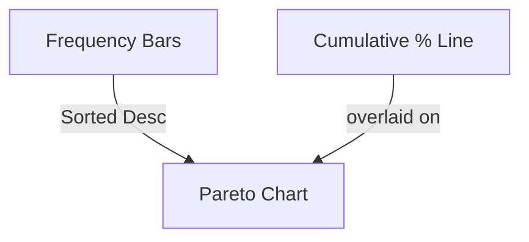

# Data Analysis Interview Questions & Answers (100+)

This guide contains 100+ Data Analysis interview questions, covering statistics, data cleaning, visualization, machine learning concepts, and business metrics. Each question includes a model answer and potential follow-up paths to explore the candidate's depth of understanding.

## Part 1: Statistics & Probability (1-20)

### 1. What is the difference between specific and sensitivity?

| Metric | Formula | Description | "Layman" Term |
| :--- | :--- | :--- | :--- |
| **Sensitivity** (Recall) | $TP / (TP + FN)$ | Ability to correctly identify positive cases. | True Positive Rate |
| **Specificity** | $TN / (TN + FP)$ | Ability to correctly identify negative cases. | True Negative Rate |

**Candidate Response Paths:**

*   **Path A: Medical Context.**
    *   *Follow-up:* "In a cancer screening test, would you prioritize sensitivity or specificity?"
    *   *Answer:* Sensitivity. You don't want to miss a positive case (False Negative). False Positives can be ruled out with further testing.
*   **Path B: Spam Filter Context.**
    *   *Follow-up:* "For a spam folder, which is more important?"
    *   *Answer:* Specificity. You don't want important emails (Ham) going to Spam (False Positive).

### 2. Explain the P-value to a non-technical stakeholder.

The P-value is the probability of seeing results *at least as extreme* as what we observed, assuming that nothing interesting is happening (the null hypothesis is true).

*   **Low P-value (< 0.05):** "This result is very surprising if there's no actual effect. We should probably reject the idea that nothing is happening."
*   **High P-value (> 0.05):** "This result could easily happen by random chance. We can't say for sure there's an effect."

**Candidate Response Paths:**

*   **Path A: "Probability the hypothesis is true".**
    *   *Follow-up:* "Is P=0.03 a 97% chance the alternative hypothesis is true?"
    *   *Answer:* No. It is a common misconception. It strictly refers to the data probability given the null hypothesis, $P(Data | H_0)$, not $P(H_1 | Data)$.

### 3. What is the Central Limit Theorem (CLT)?

The CLT states that the sampling distribution of the sample mean will approach a **Normal Distribution** as the sample size increases, regardless of the population's distribution, provided the samples are independent and identically distributed (i.i.d).

```mermaid
graph LR
    A[Population (Any Shape)] --> B{Sampling}
    B --> C[Sample 1 Mean]
    B --> D[Sample 2 Mean]
    B --> E[Sample N Mean]
    C --> F[Distribution of Means]
    D --> F
    E --> F
    F --> G[Normal Distribution (Bell Curve)]
```

### 4. What is Type I vs Type II error?

| Error | Name | Description | Example (Fire Alarm) |
| :--- | :--- | :--- | :--- |
| **Type I** | False Positive | Rejecting $H_0$ when it is true. | Alarm goes off, but no fire. |
| **Type II** | False Negative | Failing to reject $H_0$ when it is false. | Fire burning, but alarm stays silent. |

**Candidate Response Paths:**

*   **Path A: Alpha and Beta.**
    *   *Follow-up:* "What is the relationship between Type I error and Statistical Power?"
    *   *Answer:* Power = $1 - \beta$ (where $\beta$ is Type II error probability). Reducing Type I error ($\alpha$) usually increases Type II error ($\beta$) if sample size is fixed.

### 5. What is Simpson's Paradox?

A phenomenon where a trend appears in several different groups of data but disappears or reverses when these groups are combined.

*Example:*
*   Hospital A has higher death rates than Hospital B overall.
*   However, Hospital A has *lower* death rates for "Poor Condition" patients AND "Good Condition" patients individually.
*   *Cause:* Hospital A takes in significantly more "Poor Condition" patients than B.

### 6. Explain the difference between Correlation and Causation.

Correlation measures the strength of a linear relationship between two variables. Causation indicates that one variable *causes* the change in the other.
*   "Ice cream sales correlate with shark attacks." (Both caused by Summer/Heat).

### 7. What is selection bias?

Bias introduced by the selection of individuals, groups, or data for analysis in such a way that proper randomization is not achieved.
*Example:* Polling people by landline phone excludes younger demographics who only use mobiles.

### 8. What is the Law of Large Numbers?

As the size of a sample increases, the sample mean gets closer to the expected value (population mean).

### 9. Describe the difference between a Normal and a Skewed distribution.

*   **Normal:** Symmetric, Bell-shaped. Mean = Median = Mode.
*   **Left Skewed (Negative):** Tail is on the left. Mean < Median < Mode.
*   **Right Skewed (Positive):** Tail is on the right. Mode < Median < Mean. (e.g., Income distribution).

### 10. How do you handle missing data?

1.  **Deletion:** Remove rows (Listwise) or columns. (Good if data is Missing Completely At Random - MCAR).
2.  **Imputation:**
    *   Mean/Median/Mode (Simple).
    *   KNN or Regression (Advanced).
3.  **Flagging:** Add a binary column `is_missing` to allow the model to learn the pattern.

### 11. What is R-squared?

$R^2$ (Coefficient of Determination) represents the proportion of the variance for a dependent variable that's explained by an independent variable or variables in a regression model.
*   $R^2 = 1$: Perfect fit.
*   $R^2 = 0$: The model explains none of the variability.

**Candidate Response Paths:**

*   **Path A: "Higher is better".**
    *   *Follow-up:* "Can a low R-squared be good?"
    *   *Answer:* Yes, in fields like psychology or human behavior, predicting specific outcomes is hard, but significant trends (coefficients) are still valuable.

### 12. What is Adjusted R-squared?

$R^2$ always increases (or stays same) when you add more predictors, even junk ones. **Adjusted $R^2$** penalizes the addition of useless predictors. It only increases if the new term improves the model more than would be expected by chance.

### 13. What is Confidence Interval?

A range of values, derived from sample statistics, that is likely to contain the value of an unknown population parameter.
*   *Interpretation:* "If we repeated this sampling 100 times, 95 of the calculated intervals would contain the true population mean." (For a 95% CI).

### 14. What is A/B Testing?

A randomized experiment with two variants, A and B. It involves the application of statistical hypothesis testing (like a t-test or z-test) to determine if the difference in outcomes is significant.

### 15. What are the assumptions of Linear Regression?

1.  **Linearity:** The relationship between X and Y is linear.
2.  **Independence:** Observations are independent.
3.  **Homoscedasticity:** Constant variance of errors.
4.  **Normality:** Errors are normally distributed.
5.  **No Multicollinearity:** Independent variables are not highly correlated.

### 16. What is the difference between Probability and Likelihood?

*   **Probability:** Given a set of parameters (e.g., a fair coin), what is the chance of seeing the data (HHT)? $P(Data | \theta)$.
*   **Likelihood:** Given the data (HHT), how likely are different parameters (e.g., coin fairness $\theta$)? $L(\theta | Data)$.

### 17. What is Bayesian Inference?

A method of statistical inference in which Bayes' theorem is used to update the probability for a hypothesis as more evidence or information becomes available.
$Posterior \propto Likelihood \times Prior$

### 18. What is a Z-score?

A measure of how many standard deviations below or above the population mean a raw score is.
$Z = (X - \mu) / \sigma$

### 19. When should you use a T-test vs a Z-test?

*   **Z-test:** When population variance ($\sigma^2$) is **known** and sample size is large ($n > 30$).
*   **T-test:** When population variance is **unknown** or sample size is small ($n < 30$).

### 20. What is a Box Plot (Box and Whisker)?

A standardized way of displaying the distribution of data based on a five-number summary:
1.  Minimum
2.  First Quartile (Q1)
3.  Median
4.  Third Quartile (Q3)
5.  Maximum

**Chart: Box Plot Components**
```
      |----[  Q1  |  Q3  ]----|
    Min        Median        Max
```

## Part 2: Data Cleaning & Preprocessing (21-40)

### 21. How do you detect outliers?

*   **Visual:** Box plots, Scatter plots.
*   **Z-Score:** Points with $Z > 3$ or $Z < -3$.
*   **IQR Method:** Points outside $1.5 \times IQR$ range (below $Q1 - 1.5 \times IQR$ or above $Q3 + 1.5 \times IQR$).

**Candidate Response Paths:**

*   **Path A: Delete them.**
    *   *Follow-up:* "When should you NOT delete outliers?"
    *   *Answer:* When they are genuine data points (e.g., fraud detection, high-value customers). They might contain the most valuable signal.

### 22. What is One-Hot Encoding?

Converting categorical variables into a form that could be provided to ML algorithms to do a better job in prediction. It creates new binary columns for each category.
*   Color: Red, Blue -> Is_Red: [1, 0], Is_Blue: [0, 1].

### 23. What is Label Encoding?

Converting each value in a column to a number.
*   Low, Medium, High -> 0, 1, 2.
*   *Risk:* Algorithms might misinterpret the numeric order (e.g., treating Dog(1) < Cat(2) < Bird(3) as a mathematical relationship).

### 24. How do you handle duplicate data?

1.  Identify unique keys (Primary Keys).
2.  Check if duplicates are exact copies or partial (same ID, different timestamp).
3.  Decide rule: Keep first? Keep last (most recent)? Aggregation (sum/mean)?

### 25. What is Scaling/Normalization?

Adjusting the range of features.
*   **Min-Max Scaling:** Rescales to [0, 1]. $X_{new} = (X - X_{min}) / (X_{max} - X_{min})$.
*   **Standardization (Z-score):** Center around 0 with std dev of 1.

### 26. Why do we need to scale data?

Algorithms that compute distances (KNN, K-Means, SVM) are sensitive to the scale of input features. If one feature ranges 0-1 and another 0-1000, the second will dominate the distance calculation.

### 27. What is Data Imputation bias?

When the method used to fill missing values distorts the data distribution.
*Example:* Filling missing "Age" with the Mean reduces the variance of the Age variable, making the population look more uniform than it is.

### 28. How do you parse non-standard date formats?

Using libraries like `pandas` (`to_datetime`) with format strings, or regex extraction for messy strings.
*   "2nd of Jan, 2021" -> `%d%S of %b, %Y` (Requires custom logic for ordinal suffixes).

### 29. What is "Tidy Data"?

A standard way of mapping the meaning of a dataset to its structure (Hadley Wickham).
1.  Each variable forms a column.
2.  Each observation forms a row.
3.  Each type of observational unit forms a table.

### 30. How do you handle string data with inconsistent capitalization/spacing?

*   Standardize case (`.lower()`, `.upper()`).
*   Trim whitespace (`.strip()`).
*   Fuzzy matching (Levenshtein distance) to group similar strings ("New York" vs "new york " vs "New  York").

### 31. What is the Curse of Dimensionality?

As the number of features (dimensions) increases, the volume of the space increases so fast that the available data becomes sparse. This makes it problematic for any method that requires statistical significance (clustering, nearest neighbors).

### 32. What is Feature Engineering?

The process of using domain knowledge to extract features from raw data.
*   *Date* -> Day of Week, Is Weekend, Month.
*   *Address* -> Zip Code, City, Distance to Center.

### 33. What is Binning/Discretization?

Grouping continuous values into bins.
*   Age 0-100 -> Groups: 0-18 (Child), 18-60 (Adult), 60+ (Senior).
*   *Benefit:* Can handle outliers and non-linear relationships.

### 34. What is PCA (Principal Component Analysis)?

A dimensionality reduction technique that transforms features into a new set of orthogonal (uncorrelated) features called Principal Components, retaining the maximum variance.

### 35. How do you handle highly correlated features (Multicollinearity)?

*   Remove one of the correlated pairs.
*   Use PCA to combine them.
*   Use regularization (Lasso/Ridge) which can penalize coefficients.

### 36. What is the difference between `NULL` and `NaN`?

*   **NULL:** SQL concept for "unknown".
*   **NaN (Not a Number):** Floating point standard (IEEE 754) for undefined operations (0/0) or missing numerical data in Python/Pandas.

### 37. How to detect data drift?

Monitoring the statistical properties of the input data over time. If the distribution of input variables ($P(X)$) changes, the model trained on old data may degrade.
*   *Metric:* Population Stability Index (PSI), Kullback-Leibler (KL) Divergence.

### 38. Explain "Target Leakage".

When training data contains information about the target that will not be available when the model is used for prediction.
*Example:* Predicting "Will Churn?" but including "Cancellation Date" as a feature.

### 39. What is SMOTE?

**Synthetic Minority Over-sampling Technique**.
Used for imbalanced datasets. It creates synthetic samples for the minority class by interpolating between existing samples, rather than just duplicating them.

### 40. How do you validate that your data cleaning was successful?

*   **Sanity Checks:** Check ranges (Age < 0?), uniqueness (IDs), constraints.
*   **Summary Statistics:** Compare mean/distribution before and after (unless correction was the goal).
*   **Null Checks:** Ensure no unexpected nulls remain.

## Part 3: Exploratory Data Analysis & Visualization (41-60)

### 41. What is EDA?

Exploratory Data Analysis. The process of performing initial investigations on data to discover patterns, spot anomalies, test hypothesis and check assumptions with the help of summary statistics and graphical representations.

### 42. When would you use a Histogram vs a Bar Chart?

*   **Histogram:** For continuous numerical data (distribution of Ages). Bars touch.
*   **Bar Chart:** For categorical data (count of Sales by Product Category). Bars have gaps.

### 43. What is a Scatter Plot used for?

To visualize the relationship (correlation) between two continuous variables.
*Example:* Height vs Weight.

### 44. What is a Heatmap?

A graphical representation of data where individual values are represented as colors.
*   *Use Case:* Correlation Matrix, Website click density, Cohort Analysis retention rates.

### 45. Explain the "Data-Ink Ratio" (Edward Tufte).

The proportion of a graphic's ink devoted to the non-redundant display of data-information.
*   *Goal:* Maximize the ratio. Remove backgrounds, 3D effects, excessive gridlines.

### 46. What is a Violin Plot?

Similar to a box plot, but adds a kernel density plot on each side. It shows the distribution shape (peaks/valleys) which a box plot hides.

### 47. How do you visualize more than 3 dimensions?

*   **Pair Plots:** Matrix of scatter plots.
*   **Color/Size/Shape:** Use bubble charts where size=Dim3, color=Dim4.
*   **Faceting/Small Multiples:** Creating a grid of charts based on a categorical variable.

### 48. What is a Pareto Chart?

A bar chart sorted by frequency (descending) with a line graph showing cumulative percentage. Used to identify the "vital few" problems (80/20 rule).



### 49. When is a Pie Chart appropriate?

Rarely. Only when comparing a few parts to a whole (2-5 categories) and the differences are large.
*   *Criticism:* Humans are bad at comparing angles. Bar charts are usually better.

### 50. What is a Log-Scale used for?

To visualize data that spans several orders of magnitude (e.g., GDP, Stock Prices, exponential growth). It turns exponential curves into straight lines.

### 51. What is a Cohort Analysis?

A subset of behavioral analytics that takes the data from a given dataset and rather than looking at all users as one unit, it breaks them into related groups for analysis.
*   *Example:* Retention rate of users who signed up in Jan vs Feb vs Mar.

### 52. How do you identify seasonality in data?

*   **Time Series Decomposition:** Decompose into Trend, Seasonality, and Noise.
*   **Autocorrelation Plot (ACF):** Check if data correlates with lagged versions of itself (e.g., lag 12 for monthly data).

### 53. What is a Waterfall Chart?

A form of data visualization that helps in understanding the cumulative effect of sequentially introduced positive or negative values.
*   *Use Case:* Financial Statements (Revenue -> Cost of Goods -> Gross Profit -> Tax -> Net Income).

### 54. What is a Funnel Chart?

Visualizes stages in a process where items are progressively filtered out.
*   *Use Case:* E-commerce conversion (Page View -> Add to Cart -> Checkout -> Purchase).

### 55. What is "Anscombe's Quartet"?

Four datasets that have nearly identical simple descriptive statistics (mean, variance, correlation, regression line) but appear very different when graphed.
*   *Lesson:* Always visualize your data; don't trust summary stats blindly.

### 56. What is a QQ Plot (Quantile-Quantile)?

A probability plot to compare two probability distributions.
*   *Use Case:* Checking if data follows a Normal Distribution. If points lie on the 45-degree line, it is normal.

### 57. What is Overplotting and how to fix it?

When so many data points overlap in a scatter plot that it becomes a solid blob.
*   *Fixes:* Reduce marker size, decrease opacity (alpha), use jitter, or use a Hexbin/Heatmap.

### 58. Choosing colors for visualization.

*   **Sequential:** Low to High (Light Blue to Dark Blue). For continuous values.
*   **Diverging:** Negative to Positive (Red to White to Green). For deviations from a median/zero.
*   **Categorical:** Distinct hues. For discrete categories.

### 59. What is a Sankey Diagram?

A flow diagram in which the width of the arrows is proportional to the flow rate.
*   *Use Case:* User journey flow, Energy transfer, Budget breakdown.

### 60. How do you visualize uncertainty?

*   Error bars on points/bars.
*   Shaded confidence regions (e.g., in line charts for time series).

## Part 4: Machine Learning Basics for Analysts (61-80)

### 61. Supervised vs Unsupervised Learning?

*   **Supervised:** Labeled data. Input -> Output. (Regression, Classification).
*   **Unsupervised:** Unlabeled data. Finding structure. (Clustering, PCA).

### 62. Classification vs Regression?

*   **Classification:** Predicting a discrete class label (Spam/Not Spam).
*   **Regression:** Predicting a continuous quantity (House Price).

### 63. What is Overfitting?

When a model learns the training data *too well*, including the noise, and fails to generalize to new data.
*   *Symptoms:* Low Train Error, High Test Error.
*   *Fixes:* Simplify model, Regularization, Cross-Validation, More Data.

### 64. What is Underfitting?

When a model is too simple to capture the underlying structure of the data.
*   *Symptoms:* High Train Error, High Test Error.
*   *Fixes:* More complex model, more features.

**Chart: Bias-Variance Tradeoff**

| | Low Variance | High Variance |
| :--- | :--- | :--- |
| **Low Bias** | Ideal Model | Overfitting |
| **High Bias** | Underfitting | Worst Case |

### 65. What is Cross-Validation (K-Fold)?

Splitting data into K subsets (folds). Train on K-1, test on 1. Repeat K times and average the performance.
*   *Benefit:* Reduces the variance of the performance estimate.

### 66. Explain the Confusion Matrix.

A table used to evaluate classification models.

| | Predicted Positive | Predicted Negative |
| :--- | :--- | :--- |
| **Actual Positive** | True Positive (TP) | False Negative (FN) |
| **Actual Negative** | False Positive (FP) | True Negative (TN) |

### 67. Accuracy vs Precision vs Recall vs F1?

*   **Accuracy:** $(TP+TN) / Total$. (Bad for imbalanced data).
*   **Precision:** $TP / (TP+FP)$. (Quality of positive predictions).
*   **Recall:** $TP / (TP+FN)$. (Quantity of positives found).
*   **F1 Score:** Harmonic mean of Precision and Recall. $2 \times (P \times R) / (P + R)$.

### 68. What is ROC-AUC?

*   **ROC Curve:** Plot of TPR (Recall) vs FPR (1-Specificity) at various thresholds.
*   **AUC (Area Under Curve):** Probability that the model ranks a random positive example higher than a random negative example. 0.5 = Random Guess, 1.0 = Perfect.

### 69. What is K-Means Clustering?

An unsupervised algorithm that partitions data into K clusters.
1.  Initialize K centroids.
2.  Assign points to nearest centroid.
3.  Update centroids to mean of assigned points.
4.  Repeat until convergence.

### 70. How to choose K in K-Means?

**Elbow Method:** Plot Sum of Squared Errors (Inertia) vs K. Look for the "elbow" where improvements diminish.

### 71. What is Decision Tree Pruning?

Removing sections of the tree that provide little power to classify instances (to reduce overfitting).

### 72. Random Forest vs Decision Tree?

*   **Decision Tree:** Single tree. Easy to interpret. Prone to overfitting.
*   **Random Forest:** Ensemble of many trees (Bagging). Robust, higher accuracy. Harder to interpret.

### 73. What is Logistic Regression?

Despite the name, it's a **Classification** algorithm for binary outcomes. It uses the Sigmoid function to squash output between 0 and 1 (probability).
$P(y=1) = 1 / (1 + e^{-(b0 + b1x)})$.

### 74. What is Gradient Descent?

An optimization algorithm used to minimize a function (cost function) by iteratively moving in the direction of steepest descent.

**Candidate Response Paths:**

*   **Path A: Learning Rate.**
    *   *Follow-up:* "What happens if the learning rate is too high vs too low?"
    *   *Answer:* High = Overshoot minimum, diverge. Low = Slow convergence, might get stuck in local minima.

### 75. What is Regularization (L1 vs L2)?

Techniques to prevent overfitting by adding a penalty term to the loss function.
*   **L1 (Lasso):** Adds absolute value of coefficients. Can drive coefficients to zero (Feature Selection).
*   **L2 (Ridge):** Adds squared magnitude of coefficients. Shrinks coefficients evenly.

### 76. What is a Time Series?

A sequence of data points indexed in time order.
*   *Components:* Trend, Seasonality, Cyclicality, Irregularity (Noise).

### 77. Stationarity in Time Series?

A time series is stationary if its statistical properties (mean, variance) do not change over time. Most forecasting models (ARIMA) assume stationarity.

### 78. What is Bagging vs Boosting?

*   **Bagging (Bootstrap Aggregating):** Train parallel models on random subsets (with replacement) and average predictions. (e.g., Random Forest). Reduces Variance.
*   **Boosting:** Train models sequentially. Each model corrects the errors of the previous one. (e.g., XGBoost, AdaBoost). Reduces Bias and Variance.

### 79. Explain "Naive Bayes".

A classification algorithm based on Bayes' Theorem with an assumption of independence among predictors. "Naive" because it assumes the presence of a feature is unrelated to any other feature.

### 80. What is A/B/n Testing?

Testing more than 2 versions (A, B, C...) simultaneously.

## Part 5: Product Metrics & Business (81-100)

### 81. Define Churn Rate.

The percentage of customers who stop using a product or service during a given time period.
$Churn = (Lost Customers / Start Customers) \times 100$.

### 82. What is DAU/MAU?

*   **DAU:** Daily Active Users.
*   **MAU:** Monthly Active Users.
*   **Ratio (DAU/MAU):** Measures "Stickiness". Example: 50% means the average user uses the app 15 days a month.

### 83. What is ARPU?

**Average Revenue Per User**.
Total Revenue / Total Users.

### 84. What is CLV (Customer Lifetime Value)?

The total revenue a business can reasonably expect from a single customer account.
$CLV = Avg Order Value \times Purchase Frequency \times Customer Lifespan$.

### 85. What is CAC (Customer Acquisition Cost)?

Total Cost of Sales & Marketing / Number of New Customers Acquired.
*   *Health Check:* LTV:CAC ratio. Ideally > 3:1.

### 86. How to measure Retention?

**Cohort Analysis** is best.
*   Day N Retention: % of users who return exactly on Day N.
*   Rolling Retention: % of users who return on Day N *or any day after*.

### 87. What is a "North Star Metric"?

The single metric that best captures the core value your product delivers to its customers.
*   *Airbnb:* Nights Booked. (Not just revenue, but value exchanged).
*   *Facebook:* Daily Active Users.

### 88. How would you investigate a sudden drop in DAU?

**Candidate Response Paths:**

*   **Path A: Technical vs Business.**
    *   *Step 1:* Check data pipeline status (Is it a bug?).
    *   *Step 2:* Segmentation. Is it one region? One device (iOS vs Android)? One user type?
    *   *Step 3:* External factors. (Holiday? Competitor launch? Server outage?).

### 89. Metric for an E-commerce site?

*   Conversion Rate (Visits to Purchase).
*   AOV (Average Order Value).
*   Cart Abandonment Rate.

### 90. Metric for a Streaming Service (Netflix)?

*   Hours Streamed per User.
*   Retention Rate (Subscription Renewals).
*   Content Completion Rate.

### 91. What is Survivorship Bias in business?

Focusing on the people/companies that "survived" (succeeded) and overlooking those that failed, leading to false conclusions about what causes success.
*Example:* "Steve Jobs dropped out, so college is useless." (Ignoring all dropouts who failed).

### 92. How to measure the success of a Search feature?

*   **CTR:** Click-Through Rate on results.
*   **Zero Results Rate:** % of searches returning nothing.
*   **Search-to-Action:** % of searches leading to a play/purchase.
*   **Time to Result:** Latency.

### 93. What is NPS?

**Net Promoter Score**. "How likely are you to recommend us to a friend?" (0-10).
*   Promoters (9-10).
*   Passives (7-8).
*   Detractors (0-6).
*   $NPS = \%Promoters - \%Detractors$.

### 94. Explain the difference between Leading and Lagging indicators.

*   **Lagging:** Output metrics. What happened? (Revenue, Churn). Hard to influence directly.
*   **Leading:** Input metrics. Predictive. (Daily Logins, Customer Satisfaction). Can be influenced to change future lagging metrics.

### 95. What is Funnel Drop-off?

The percentage of users who leave the process at each step. Identifying the step with the highest drop-off tells you where to optimize.

### 96. How do you estimate market size (TAM)?

**Total Addressable Market**.
*   *Top-Down:* Industry reports $\times$ % Share.
*   *Bottom-Up:* Price $\times$ Potential Customer Count (Better).

### 97. What is Seasonality vs Trend?

*   **Seasonality:** Repeating short-term cycles (Sales up in Dec).
*   **Trend:** Long-term direction (Sales growing 10% YoY).

### 98. How do you prioritize features?

*   **RICE Score:** (Reach $\times$ Impact $\times$ Confidence) / Effort.
*   **MoSCoW:** Must have, Should have, Could have, Won't have.

### 99. Investigating: "Revenue is down, but Traffic is up."

*   Check Conversion Rate (Are we getting low-quality traffic?).
*   Check AOV (Are people buying cheaper items?).
*   Check Pricing changes or Discounts running.
*   Check Mix Shift (Selling more low-margin items).

### 100. Define "Network Effects".

The phenomenon where a product or service becomes more valuable when more people use it. (e.g., Telephone, Social Networks).

---
**End of Interview Questions**
