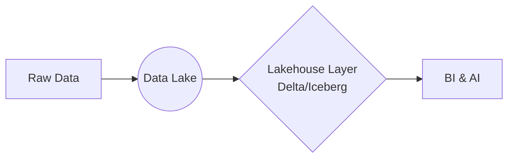
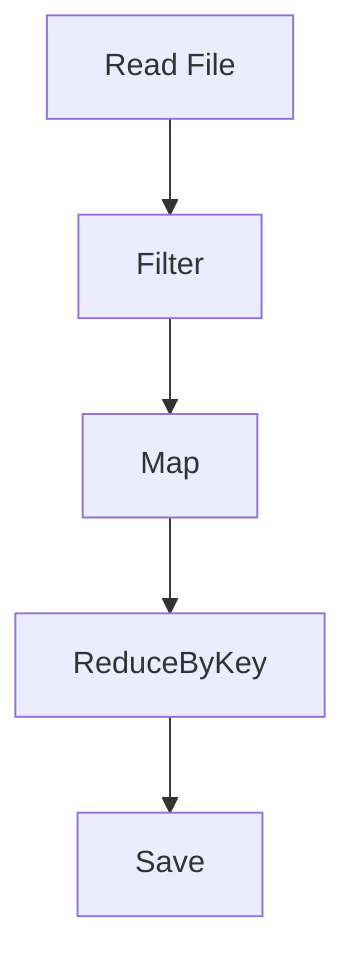
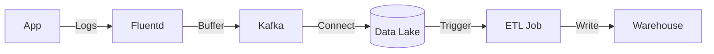

# Data Engineering Interview Questions & Answers (100+)

This guide contains 100+ Data Engineering interview questions, covering Data Modeling, Big Data Frameworks (Spark), Pipelines, Warehousing, and System Design. Each question includes a model answer and potential follow-up paths.

## Part 1: Data Modeling & Architecture (1-20)

### 1. What is the difference between Star Schema and Snowflake Schema?

| Feature | Star Schema | Snowflake Schema |
| :--- | :--- | :--- |
| **Structure** | Denormalized. One fact table, multiple dimension tables. | Normalized. Dimension tables are split into sub-dimensions. |
| **Joins** | Fewer joins (simpler queries). | More joins (complex queries). |
| **Redundancy** | High data redundancy. | Low data redundancy. |
| **Performance** | Faster for read/aggregation (OLAP). | Slightly slower due to joins. |

**Candidate Response Paths:**

*   **Path A: Candidate mentions storage space.**
    *   *Follow-up:* "In modern cloud data warehouses (Snowflake, BigQuery), does the storage saving of Snowflake Schema matter?"
    *   *Answer:* Usually no. Storage is cheap; compute is expensive. Star Schema is preferred for performance (fewer joins).

### 2. What are the 3 Vs of Big Data?

*   **Volume:** The amount of data (TB, PB).
*   **Velocity:** The speed at which data is generated and processed (Streaming vs Batch).
*   **Variety:** The different types of data (Structured, Semi-structured JSON, Unstructured).

*Note: Some add Veracity (quality) and Value.*

### 3. Explain the difference between ETL and ELT.

*   **ETL (Extract, Transform, Load):** Data is transformed *before* loading into the destination. Common in traditional DBs with limited compute.
*   **ELT (Extract, Load, Transform):** Data is loaded raw into the destination, then transformed using the destination's compute power. Common in Cloud Data Warehouses (Snowflake, BigQuery).

**Candidate Response Paths:**

*   **Path A: Candidate prefers ELT.**
    *   *Follow-up:* "When would you still use ETL over ELT?"
    *   *Answer:* When dealing with PII masking needs *before* data hits the warehouse, or when the transformation requires complex processing not efficiently done in SQL.

### 4. What is Data Normalization vs Denormalization?

*   **Normalization:** Organizing data to reduce redundancy (1NF, 2NF, 3NF). Good for OLTP (Write heavy).
*   **Denormalization:** Adding redundancy to optimize read performance. Good for OLAP (Read heavy).

### 5. What is a Slowly Changing Dimension (SCD)?

SCDs track changes in dimension attributes over time.

*   **Type 1 (Overwrite):** No history kept. Update the record.
*   **Type 2 (Add Row):** Keep history by adding a new row with `StartDate`, `EndDate`, and `IsCurrent` flags.
*   **Type 3 (Add Column):** Keep limited history (e.g., `CurrentCity`, `PreviousCity`).

**Candidate Response Paths:**

*   **Path A: Candidate mentions Type 2.**
    *   *Follow-up:* "What is the downside of SCD Type 2?"
    *   *Answer:* The table grows indefinitely. Queries need to filter on `IsCurrent` or Date Ranges.

### 6. What is a Data Lake?

A centralized repository that allows you to store all your structured and unstructured data at any scale. (e.g., S3, ADLS, HDFS).

### 7. What is a Data Warehouse?

A system used for reporting and data analysis. Stores data in a structured format (Schema-on-Write).

### 8. What is a Data Lakehouse?

A new architecture that combines the flexibility of a Data Lake with the management features of a Data Warehouse (ACID transactions, Schema enforcement) using formats like Delta Lake, Iceberg, or Hudi.



### 9. Explain OLTP vs OLAP.

*   **OLTP (Online Transaction Processing):** Operational apps. Fast, small inserts/updates. Row-oriented.
*   **OLAP (Online Analytical Processing):** Analytics. Large scans/aggregations. Column-oriented.

### 10. Why is Columnar Storage better for Analytics?

*   **I/O Efficiency:** Only reads the columns needed for the query.
*   **Compression:** High compression ratios because similar data types are stored together.

### 11. What is CAP Theorem?

In a distributed system, you can only provide 2 of 3:
*   **C**onsistency (Every read receives the most recent write).
*   **A**vailability (Every request receives a response).
*   **P**artition Tolerance (System continues to operate despite network failures).

**Candidate Response Paths:**

*   **Path A: Candidate chooses CP.**
    *   *Follow-up:* "Give an example of a CP system."
    *   *Answer:* HBase, MongoDB (default).

### 12. What is Eventual Consistency?

A consistency model used in distributed systems where, given enough time, all updates will propagate through the system and all replicas will be consistent. (AP systems like Cassandra).

### 13. What is a Surrogate Key?

A system-generated unique identifier (usually an integer or UUID) used as the primary key, rather than a "Natural Key" from the business data.

### 14. What is Data Governance?

The set of processes, roles, policies, standards, and metrics that ensure the effective and efficient use of information in enabling an organization to achieve its goals. Includes Data Quality, Privacy, and Access Control.

### 15. What is Change Data Capture (CDC)?

A pattern to identify and track changes (Insert, Update, Delete) in a source system and deliver those changes to a downstream system in real-time. Tools: Debezium, Oracle GoldenGate.

### 16. What is the difference between Batch and Stream processing?

*   **Batch:** Processing a large volume of data all at once (high latency, high throughput).
*   **Stream:** Processing data record-by-record as it arrives (low latency).

### 17. What is Lambda Architecture?

A hybrid approach designed to handle massive quantities of data by taking advantage of both batch and stream-processing methods.

*   **Speed Layer:** Real-time (Streaming).
*   **Batch Layer:** Historic (Batch).
*   **Serving Layer:** Merges views.

### 18. What is Kappa Architecture?

An architecture that treats everything as a stream. Removes the batch layer of Lambda Architecture.
*Pros:* Simpler code base (one logic for stream and replay).

### 19. What is Sharding?

Horizontal partitioning of a database across multiple instances to spread the load.

### 20. What is a Data Mesh?

A decentralized sociotechnical approach to data architecture. It shifts from a centralized monolith lake/warehouse to domain-oriented data products.

## Part 2: Big Data Frameworks (Spark/Hadoop) (21-40)

### 21. What are the core components of Hadoop?

1.  **HDFS:** Storage (Distributed File System).
2.  **YARN:** Resource Management.
3.  **MapReduce:** Processing Engine.

### 22. Why is Spark faster than MapReduce?

Spark processes data in-memory (RAM), whereas MapReduce writes intermediate results to disk (HDFS) after every map/reduce step.

### 23. What is an RDD (Resilient Distributed Dataset)?

The fundamental data structure of Spark. It is an immutable, distributed collection of objects.
*   **Resilient:** Can recover from node failure using lineage.
*   **Distributed:** Split across cluster.

### 24. RDD vs DataFrame vs Dataset?

| Feature | RDD | DataFrame | Dataset |
| :--- | :--- | :--- | :--- |
| **Level** | Low-level (Java/Scala objects). | High-level (Relational). | Type-safe High-level. |
| **Optimization** | None (You optimize). | Catalyst Optimizer. | Catalyst Optimizer + Type Safety. |
| **Language** | Any. | Any. | Scala/Java only. |

**Candidate Response Paths:**

*   **Path A: Candidate prefers RDDs.**
    *   *Follow-up:* "When should you use RDDs today?"
    *   *Answer:* Rarely. Only when you need fine-grained control over physical data layout or unstructured data manipulation that doesn't fit columnar format.

### 25. What is the Catalyst Optimizer?

The internal query optimizer in Spark SQL. It converts the user's code (DataFrame/SQL) into an optimized physical execution plan (e.g., predicate pushdown, join reordering).

### 26. What is a "Shuffle" in Spark?

The process of redistributing data across partitions (and nodes). It occurs during `groupBy`, `join`, or `repartition`.
*   *Performance Impact:* Very expensive (Disk I/O + Network).

### 27. Explain "Lazy Evaluation" in Spark.

Spark does not execute transformations (like `map`, `filter`) immediately. It builds a DAG (Directed Acyclic Graph) of instructions. Execution only starts when an **Action** (like `collect`, `count`, `save`) is called.
*Benefit:* Allows optimization (combining filters).

### 28. What is the difference between `map()` and `flatMap()`?

*   `map()`: One input -> One output.
*   `flatMap()`: One input -> Zero or more outputs (flattens the result).

### 29. What is Broadcast Join?

A join optimization where the smaller table is sent (broadcasted) to every worker node. This avoids shuffling the large table.
*Config:* `spark.sql.autoBroadcastJoinThreshold`.

### 30. What is Data Skew?

When data is unevenly distributed across partitions. One task takes much longer than others, slowing down the whole job.

**Candidate Response Paths:**

*   **Path A: Solution is Salting.**
    *   *Follow-up:* "How does Salting fix skew?"
    *   *Answer:* You add a random key (salt) to the skewed keys to split them into smaller groups, process them, and then aggregate back.

### 31. What is Partition Pruning?

An optimization where the engine skips reading files/partitions that don't match the query filter.
*Requirement:* Data must be partitioned (e.g., by Date) and query must filter on that column.

### 32. What is Predicate Pushdown?

Pushing filtering logic down to the source system (e.g., Parquet file or Database) to reduce the amount of data read into memory.

### 33. `cache()` vs `persist()`?

*   `cache()`: Persists to Memory (MEMORY_AND_DISK in newer versions).
*   `persist(level)`: Allows specifying storage level (MEMORY_ONLY, DISK_ONLY, MEMORY_AND_DISK_SER).

### 34. What are Accumulators?

Variables that are only "added" to through an associative and commutative operation. Used for counters or sums efficiently in parallel.

### 35. What happens if a worker node fails in Spark?

The Driver detects the failure. Using the DAG/Lineage, it reschedules the lost tasks on other healthy nodes to recompute the missing partitions.

### 36. Coalesce vs Repartition?

*   `repartition(n)`: Full shuffle. Increases or decreases partitions. balances data.
*   `coalesce(n)`: No shuffle (usually). Only decreases partitions. Merges local partitions. Faster.

### 37. What are the file formats optimized for Big Data?

*   **Parquet:** Columnar. Good for compression and partial reads.
*   **Avro:** Row-based. Good for schema evolution and write-heavy loads.
*   **ORC:** Optimized Row Columnar (Hive).

### 38. How do you handle small file problem in HDFS/Spark?

*   **Compaction:** Run a job to merge small files.
*   **Writer Config:** Adjust partition sizes before writing (`coalesce`).

### 39. What is a DAG?

**Directed Acyclic Graph**. A graph of the logical execution plan of steps.



### 40. Explain Serialization in Spark.

Transferring data over network or to disk requires objects to be converted to bytes.
*   **Java Serialization:** Default, slow.
*   **Kryo Serialization:** Faster, compact. Recommended.

## Part 3: Data Pipelines & Orchestration (41-60)

### 41. What is Airflow?

A platform to programmatically author, schedule, and monitor workflows as DAGs (Directed Acyclic Graphs) of tasks. Written in Python.

### 42. What is an Airflow Operator?

A template for a predefined task.
*   `BashOperator`: Execute bash command.
*   `PythonOperator`: Execute python function.
*   `SnowflakeOperator`: Execute SQL in Snowflake.

### 43. What is Backfilling?

Running a workflow for a past period. Airflow allows you to run DAG runs for dates in the past to "fill in" data.

### 44. What is a Sensor in Airflow?

A special type of operator that waits for a certain condition to be true (e.g., a file landing in S3, a specific time) before proceeding.

**Candidate Response Paths:**

*   **Path A: Performance.**
    *   *Follow-up:* "What is `mode='reschedule'` in Sensors?"
    *   *Answer:* It releases the worker slot while waiting, checking again later. Prevents deadlock if many sensors block all workers.

### 45. Idempotency in pipelines?

A pipeline is idempotent if running it multiple times with the same input produces the same result.
*Critical for:* Retry logic and backfilling.

### 46. What is dbt (data build tool)?

A transformation tool that runs within the data warehouse. It allows writing SQL with Jinja templating to build data models. "T" in ELT.

### 47. What is a DAG Run?

An instance of a DAG running for a specific `execution_date`.

### 48. What is XCom (Cross-Communication)?

A mechanism in Airflow for tasks to exchange small amounts of data (metadata).
*Warning:* Do not use for large data transfer (stored in Metadata DB).

### 49. Push vs Pull model in Pipelines?

*   **Push:** Upstream triggers downstream.
*   **Pull:** Downstream polls upstream for readiness.

### 50. What is Data Lineage?

Tracing the life cycle of data: where it originated, how it was transformed, and where it moved. Critical for debugging and compliance.

### 51. How to handle pipeline failures?

*   **Retries:** Automatic retry with exponential backoff.
*   **Alerting:** Slack/Email notifications on failure callback.
*   **Dead Letter Queue:** Move bad data to a separate location for manual inspection.

### 52. What is Templating in Airflow?

Using Jinja templating to inject variables (like `{{ ds }}` for date string) into tasks dynamically at runtime.

### 53. Dynamic DAG generation?

Creating DAG objects in a loop or based on external config files. Useful for generating similar pipelines for 100 different tables.

### 54. What is the Airflow Scheduler?

The component that monitors all DAGs and tasks, triggers task instances once their dependencies are met.

### 55. Kubernetes Executor vs Celery Executor?

*   **Celery:** Distributed workers (VMs). Good for static scale.
*   **Kubernetes:** Pod per task. dynamic scaling. Good for isolation and varying resource needs.

### 56. What is a "SLA" in Airflow?

Service Level Agreement. You can define a time by which a task *must* complete. If it misses, an alert is sent.

### 57. Incremental Loading vs Full Load?

*   **Full Load:** Delete target, reload everything. Simple, robust, slow.
*   **Incremental:** Load only new/changed rows (based on watermark/timestamp). Complex, fast.

### 58. How do you ensure data quality in a pipeline?

*   Schema Validation.
*   Null checks / Range checks.
*   Tools: Great Expectations, dbt tests (`unique`, `not_null`).

### 59. What is a "Zombie Task"?

A task that the scheduler thinks is running, but the worker process has actually died.

### 60. How to parallelize tasks?

In Airflow, simply setting dependencies such that multiple tasks depend on the same upstream task allows them to run in parallel (up to `concurrency` limits).

```python
start >> [task1, task2, task3] >> end
```

## Part 4: Data Warehousing & Storage (61-80)

### 61. Explain "Shared-Nothing Architecture".

Each node has its own disk and CPU. Nodes communicate via network.
*Used in:* Redshift, Teradata, Greenplum.
*Pros:* Performance (Parallelism).
*Cons:* Resizing cluster requires data redistribution.

### 62. Explain "Shared-Disk Architecture" (Separation of Compute & Storage).

All compute nodes access a central storage layer (Object Storage like S3).
*Used in:* Snowflake, BigQuery.
*Pros:* Independent scaling of storage and compute.

### 63. What is a Micro-partition (Snowflake)?

Snowflake automatically divides tables into micro-partitions (contiguous units of storage). It stores metadata (min/max values) for pruning. No manual partitioning needed.

### 64. What is Zero-Copy Cloning?

Creating a copy of a database/table without duplicating the physical data. It just points to the same micro-partitions.
*Use Case:* Creating Dev/Test environments instantly.

### 65. Row-level Security (RLS)?

Restricting data access at the row level based on the user's role.

### 66. What is the difference between Hot, Warm, and Cold storage?

*   **Hot:** High performance, expensive (SSD/NVMe).
*   **Warm:** Infrequent access, cheaper.
*   **Cold:** Archive, cheapest, slow retrieval (Glacier).

### 67. Explain "Vacuum" operation (Redshift/Postgres).

Reclaims storage occupied by deleted/updated rows and sorts data.

### 68. What is a Time-Series Database?

Optimized for handling time-stamped data (metrics, IoT).
*Examples:* InfluxDB, Prometheus, TimescaleDB.

### 69. NoSQL Types?

1.  **Key-Value:** Redis, DynamoDB.
2.  **Document:** MongoDB.
3.  **Column-Family:** Cassandra, HBase.
4.  **Graph:** Neo4j.

### 70. When to use Cassandra?

High write throughput, high availability (AP system). Distributed wide-column store. Good for chat logs, sensor data.

### 71. DynamoDB Partition Key vs Sort Key?

*   **Partition Key:** Determines the physical node.
*   **Sort Key:** Sorts data within the partition.
*   Combination = Primary Key.

### 72. What is a Bloom Filter?

A probabilistic data structure used to test whether an element is a member of a set.
*   Returns "Possibly in set" or "Definitely not in set".
*   Used in joins and disk lookups to avoid reading non-matching files.

### 73. Redis use cases in DE?

*   Caching.
*   Deduplication (Sets/HyperLogLog).
*   Message Broker (Pub/Sub).

### 74. Consistency in S3?

S3 now offers **Strong Consistency** (Read-after-Write). Previously it was eventual.

### 75. File Formats: CSV vs JSON vs Parquet?

| Format | Type | Read Speed | Write Speed | Compression | Schema? |
| :--- | :--- | :--- | :--- | :--- | :--- |
| **CSV** | Text | Slow | Fast | Poor | No |
| **JSON** | Text | Slow | Fast | Poor | No |
| **Parquet** | Binary (Col) | Fast | Slow | Excellent | Yes |

### 76. Partitioning vs Clustering (BigQuery)?

*   **Partitioning:** Physically splitting data by column (e.g., Day). Limits cost.
*   **Clustering:** Sorting data within partitions by columns. Improves filter performance.

### 77. What is ACID transactions support in Data Lakes?

Technologies like **Delta Lake** provide ACID transactions on top of Parquet files in S3.
*   Uses a transaction log (`_delta_log`) to track commits.

### 78. What is Time Travel?

Querying data as it looked at a past point in time. Supported by Snowflake, Delta Lake, BigQuery.

### 79. Schema Evolution?

The ability to handle changes in the schema (adding/renaming columns) without breaking the pipeline.

### 80. Object Storage vs Block Storage?

*   **Object (S3):** Flat namespace, API access, Metadata, Immutable. Cheap.
*   **Block (EBS):** Hierarchical, OS mountable, Fast IO. Expensive.

## Part 5: Streaming & System Design (81-100)

### 81. Explain Apache Kafka architecture.

*   **Producer:** Sends messages.
*   **Broker:** Server storing data.
*   **Topic:** Category of messages.
*   **Partition:** Split of a topic for scalability.
*   **Consumer:** Reads messages.
*   **Zookeeper:** Manages cluster state (Legacy, being replaced by KRaft).

### 82. What is a Consumer Group?

A group of consumers working together to consume a topic. Each partition is consumed by exactly one consumer in the group. Allows parallel processing.

### 83. Kafka "At-least-once" vs "Exactly-once"?

*   **At-least-once:** Message might be processed twice (if ack fails). Default.
*   **Exactly-once:** Transactional. Guaranteed processing once. Harder to achieve.

### 84. What is Log Compaction in Kafka?

Retaining only the last known value for each key in the log, rather than time-based retention. Good for "current state" (e.g., user profiles).

### 85. Kafka vs RabbitMQ?

*   **Kafka:** Log-based. Dumb broker / Smart consumer. High throughput. Replay capability.
*   **RabbitMQ:** Queue-based. Smart broker. Good for complex routing. Messages removed after consumption.

### 86. What is Watermarking in streaming?

A mechanism to handle late data. "I will wait until time T for data from time T-10 min". After that, I finalize the window.

### 87. Windowing types?

*   **Tumbling:** Fixed size, non-overlapping (e.g., every 5 min).
*   **Sliding:** Overlapping (e.g., every 5 min, slide by 1 min).
*   **Session:** Dynamic, based on activity gaps.

### 88. Explain Backpressure.

When the system cannot process data as fast as it arrives.
*Mechanism:* Stop reading from source until buffer clears.

### 89. System Design: Design a Top-K Leaderboard (Real-time).

1.  **Ingest:** Events (Score updates) -> Kafka.
2.  **Process:** Flink/Spark Streaming.
    *   Window (1 min).
    *   Aggregate scores per user.
3.  **Storage:** Redis (Sorted Set).
4.  **API:** Query Redis for Top K.

### 90. System Design: Deduplication at scale.

*   **Batch:** `DISTINCT` or `row_number()`.
*   **Stream:** Bloom Filter (Probabilistic) or RocksDB/State store (Deterministic).

### 91. What is Flink?

A streaming-first processing engine. True streaming (not micro-batch like Spark). Low latency. Powerful state management.

### 92. RocksDB in Stream Processing?

Used as embedded storage for local state in Flink/Kafka Streams. Fast Key-Value store on disk.

### 93. How to handle "Late Arriving Data"?

1.  Drop it.
2.  Process in next window.
3.  Update previous result (Retraction).

### 94. Architecture: Ingesting logs to Data Lake.



### 95. What is a Dead Letter Queue (DLQ)?

A queue where messages that cannot be processed (due to errors/parsing) are sent for manual intervention.

### 96. Schema Registry?

A central repository for managing schemas (Avro/Protobuf).
*   Producers validate schema before sending to Kafka.
*   Consumers retrieve schema to deserialize.
*   Enforces compatibility (Backward/Forward).

### 97. What is ProtoBuf vs Avro?

*   **Avro:** Schema is JSON. Good for Hadoop.
*   **ProtoBuf:** Google. Strongly typed. Good for gRPC and Microservices.

### 98. System Design: How to scale a SQL database?

1.  Read Replicas (for Read heavy).
2.  Caching (Redis/Memcached).
3.  Vertical Scaling.
4.  Sharding (Last resort).

### 99. Idempotent Consumer?

A consumer that can process the same message twice without side effects.
*How:* Check if Message ID exists in DB before processing. Transactional updates.

### 100. Best practices for Data Engineering?

1.  **Idempotency:** Pipelines should be re-runnable.
2.  **Infrastructure as Code:** Terraform/Ansible.
3.  **Version Control:** SQL and DDL in Git.
4.  **Testing:** Unit tests, Data Quality tests.
5.  **Monitoring:** Observability on lag, failures, data volume.

---
**End of Questions**
