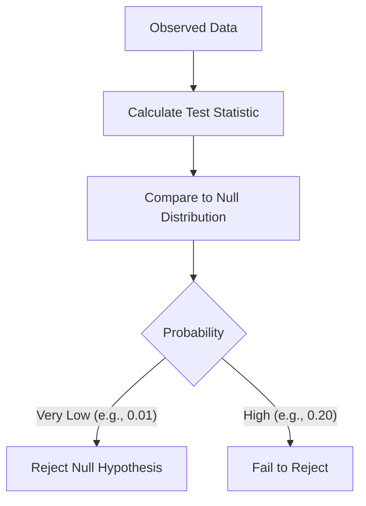
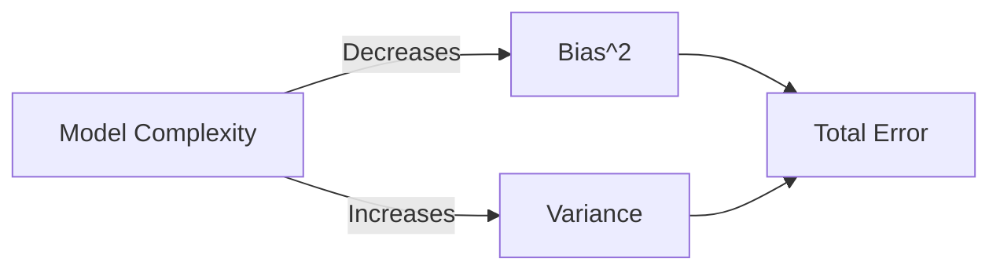
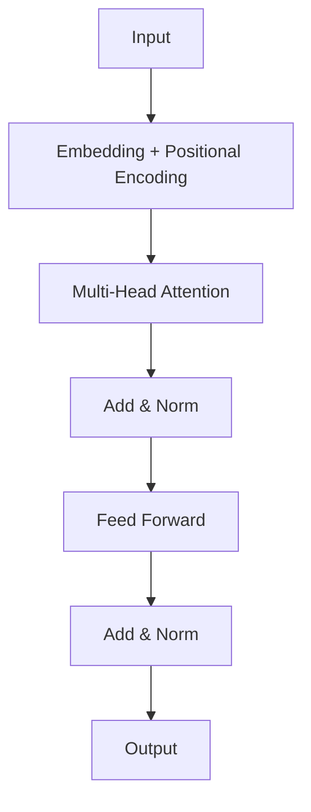

# Data Science Interview Questions & Answers (100+)

This guide contains 100+ Data Science interview questions, ranging from statistics and machine learning to SQL and model deployment. Each question includes a model answer, visual aids, and potential follow-up paths based on the candidate's response.

## Part 1: Statistics & Probability (1-20)

### 1. Explain the Central Limit Theorem (CLT).

The Central Limit Theorem states that the sampling distribution of the sample mean approaches a **Normal Distribution** as the sample size gets larger, regardless of the shape of the population distribution, provided the samples are independent and identically distributed (i.i.d).

**Key Condition:** Sample size $n \geq 30$ is often used as a rule of thumb.

**Candidate Response Paths:**

*   **Path A: Candidate mentions "Sample Mean".**
    *   *Follow-up:* "Does CLT apply if the population distribution is highly skewed?"
    *   *Answer:* Yes, but it may require a larger sample size ($n > 30$) to converge to normality.
*   **Path B: Candidate focuses on "Normal Distribution".**
    *   *Follow-up:* "Why is this important for hypothesis testing?"
    *   *Answer:* It justifies the use of parametric tests (Z-test, t-test) even when the underlying data isn't perfectly normal.

### 2. What is a P-value?

The P-value is the probability of observing test results at least as extreme as the results actually observed, assuming that the **Null Hypothesis ($H_0$)** is true.

*   **Low P-value ($\leq 0.05$):** Reject $H_0$ (Statistically Significant).
*   **High P-value ($> 0.05$):** Fail to reject $H_0$.

**Diagram: P-value Visualization**



### 3. Type I vs Type II Error?

| Error Type | Definition | Symbol | Also Known As |
| :--- | :--- | :--- | :--- |
| **Type I** | Rejecting $H_0$ when it is True | $\alpha$ | False Positive |
| **Type II** | Failing to reject $H_0$ when it is False | $\beta$ | False Negative |

**Candidate Response Paths:**

*   **Path A: Candidate confuses them.**
    *   *Follow-up:* "Think of a fire alarm. What is a Type I error?"
    *   *Answer:* The alarm goes off (Reject Null) but there is no fire (Null is True) = False Alarm.

### 4. What is Power of a Test?

Power ($1 - \beta$) is the probability of correctly rejecting the Null Hypothesis when it is false. It represents the test's ability to detect an effect if one actually exists.

Factors increasing Power:
1.  Larger Sample Size.
2.  Larger Effect Size.
3.  Higher Significance Level ($\alpha$).

### 5. Explain Bias vs Variance.

*   **Bias:** Error from erroneous assumptions in the learning algorithm. High bias causes **Underfitting**.
*   **Variance:** Error from sensitivity to small fluctuations in the training set. High variance causes **Overfitting**.

**Diagram: Bias-Variance Tradeoff**



### 6. What is the difference between Covariance and Correlation?

*   **Covariance:** Measures the direction of the linear relationship between two variables. Range: $(-\infty, \infty)$.
*   **Correlation (Pearson):** Normalized version of covariance. Measures both strength and direction. Range: $[-1, 1]$.

$$ Correlation(X, Y) = \frac{Covariance(X, Y)}{\sigma_X \sigma_Y} $$

### 7. What is Bayes' Theorem?

Describes the probability of an event, based on prior knowledge of conditions that might be related to the event.

$$ P(A|B) = \frac{P(B|A) \cdot P(A)}{P(B)} $$

*   $P(A|B)$: Posterior
*   $P(B|A)$: Likelihood
*   $P(A)$: Prior
*   $P(B)$: Evidence

### 8. What is A/B Testing?

A randomized control experiment to compare two versions (A and B) of a single variable to determine which one performs better.

**Steps:**
1.  Define Metric (e.g., Conversion Rate).
2.  Split Traffic Randomly.
3.  Run Test.
4.  Analyze Results (Z-test/t-test).

### 9. When should you use a t-test vs a Z-test?

*   **Z-test:** Population variance ($\sigma^2$) is **known** OR Sample size is large ($n > 30$).
*   **t-test:** Population variance is **unknown** AND Sample size is small ($n < 30$).

### 10. What is R-squared ($R^2$)?

The proportion of the variance in the dependent variable that is predictable from the independent variable(s).
*   $R^2 = 1$: Perfect fit.
*   $R^2 = 0$: Model explains none of the variability.

**Candidate Response Paths:**

*   **Path A: Candidate praises high $R^2$.**
    *   *Follow-up:* "Does a high $R^2$ imply causation or a good model?"
    *   *Answer:* No. It could be overfitting, or a spurious correlation. Adjusted $R^2$ is often better as it penalizes adding useless predictors.

### 11. What is the Law of Large Numbers?
As a sample size grows, its mean gets closer to the average of the whole population.

### 12. Explain Poisson Distribution.
Models the number of events occurring within a fixed interval of time or space.
*   *Example:* Number of emails received per hour.
*   Parameter: $\lambda$ (average rate).

### 13. What is Sampling Bias?
Occurs when the sample is not representative of the population (e.g., surveying only landline users for a tech product).

### 14. Mean vs Median?
*   **Mean:** Average. Sensitive to outliers.
*   **Median:** Middle value. Robust to outliers.
*   *Use Median* for skewed distributions (e.g., Income).

### 15. What is Standard Deviation?
Measure of the amount of variation or dispersion of a set of values. Square root of Variance.

### 16. What is Confidence Interval?
A range of values so defined that there is a specified probability that the value of a parameter lies within it.
"We are 95% confident that the true mean lies between X and Y."

### 17. Geometric vs Arithmetic Mean?
*   **Arithmetic:** $(a+b)/2$. Used for sums/counts.
*   **Geometric:** $\sqrt{a \cdot b}$. Used for growth rates/percentages.

### 18. What is Prior and Posterior Probability?
*   **Prior:** Probability distribution before seeing data.
*   **Posterior:** Conditional probability distribution after seeing data.

### 19. Explain Maximum Likelihood Estimation (MLE).
A method for estimating the parameters of a probability distribution by maximizing a likelihood function, so that under the assumed statistical model, the observed data is most probable.

### 20. Parametric vs Non-Parametric Tests?
*   **Parametric:** Assume underlying distribution (e.g., Normal). More powerful if assumptions hold. (t-test, ANOVA).
*   **Non-Parametric:** No distributional assumptions. (Mann-Whitney U, Kruskal-Wallis).

## Part 2: Machine Learning Algorithms (21-40)

### 21. Supervised vs Unsupervised Learning?

| Feature | Supervised | Unsupervised |
| :--- | :--- | :--- |
| **Data** | Labeled (Input-Output pairs) | Unlabeled (Input only) |
| **Goal** | Prediction / Classification | Pattern Discovery / Clustering |
| **Examples** | Regression, SVM, Random Forest | K-Means, PCA, Apriori |

### 22. What is Linear Regression?
Models the relationship between two variables by fitting a linear equation ($Y = mX + b$) to observed data.
**Assumptions:** Linearity, Independence, Homoscedasticity, Normality of residuals.

### 23. What is Logistic Regression?
Used for binary classification. Estimates the probability that an instance belongs to a particular class using the **Sigmoid** function.

$$ \sigma(z) = \frac{1}{1 + e^{-z}} $$

### 24. Explain Decision Trees.
A flowchart-like structure where an internal node represents a "test" on an attribute (e.g., is Age > 18?), each branch represents the outcome of the test, and each leaf node represents a class label.

**Candidate Response Paths:**

*   **Path A: Candidate mentions Splitting Criteria.**
    *   *Follow-up:* "What metrics are used to split?"
    *   *Answer:* Gini Impurity (CART) or Information Gain/Entropy (ID3).

### 25. What is Random Forest?
An ensemble method that operates by constructing a multitude of decision trees at training time.
*   **Bagging:** Uses Bootstrap Aggregating (random samples with replacement).
*   **Feature Randomness:** Each split considers only a random subset of features.

### 26. What is the Curse of Dimensionality?
As the number of features (dimensions) increases, the amount of data needed to generalize accurately grows exponentially. Data becomes sparse, and distance metrics (like Euclidean) become less meaningful.

### 27. Explain K-Means Clustering.
1.  Initialize $K$ centroids randomly.
2.  Assign each point to the nearest centroid.
3.  Recompute centroids (mean of points).
4.  Repeat until convergence.

### 28. What is the Elbow Method?
Used to determine the optimal number of clusters ($K$) in K-Means. Plot Sum of Squared Errors (SSE) vs $K$. The "elbow" point represents the best trade-off between error and complexity.

### 29. What is SVM (Support Vector Machine)?
Finds the hyperplane that best separates the classes with the **maximum margin**.
*   **Support Vectors:** The data points closest to the hyperplane.
*   **Kernel Trick:** Projects data into higher dimensions to separate non-linear data.

### 30. Explain Gradient Descent.
Optimization algorithm to minimize a cost function. Iteratively moves in the direction of steepest descent (negative gradient).

**Types:**
*   **Batch:** Uses all data per step (Slow, stable).
*   **Stochastic (SGD):** Uses 1 sample per step (Fast, noisy).
*   **Mini-Batch:** Uses $n$ samples (Balance).

### 31. What is XGBoost?
Extreme Gradient Boosting. An optimized distributed gradient boosting library.
*   **Pros:** High speed, performance, regularization ($L1$/$L2$), handles missing values.

### 32. L1 vs L2 Regularization?

| Feature | L1 (Lasso) | L2 (Ridge) |
| :--- | :--- | :--- |
| **Penalty** | Absolute value of magnitude | Square of magnitude |
| **Effect** | Can shrink coefficients to **Zero** (Feature Selection) | Shrinks to near zero (prevents large weights) |
| **Use Case** | Sparse data, feature selection | Multicollinearity prevention |

### 33. What is PCA (Principal Component Analysis)?
Dimensionality reduction technique. Projects data onto orthogonal vectors (Principal Components) that maximize variance.

### 34. What is Cross-Validation?
Partitioning the data into subsets to evaluate the model.
**K-Fold CV:** Split into $K$ folds. Train on $K-1$, test on 1. Repeat $K$ times. Average the score.

### 35. Explain Naive Bayes.
Probabilistic classifier based on Bayes' Theorem with the "naive" assumption of independence between features. Very fast, good for text classification.

### 36. What is KNN (K-Nearest Neighbors)?
Instance-based learning. Classifies a new point based on the majority class of its $K$ nearest neighbors.
*   Non-parametric.
*   Lazy learner (no training phase).

### 37. What is Ensemble Learning?
Combining multiple models to improve performance.
*   **Bagging:** Parallel models (Random Forest).
*   **Boosting:** Sequential models (AdaBoost, XGBoost).
*   **Stacking:** Meta-model learns from base models.

### 38. How to handle Imbalanced Datasets?
1.  **Resampling:** Oversample minority (SMOTE) or Undersample majority.
2.  **Metric Choice:** Use F1-Score, AUC-ROC instead of Accuracy.
3.  **Algorithmic:** Class weights (penalize errors on minority class).

### 39. What is Homoscedasticity?
Assumption in linear regression that the variance of error terms (residuals) is constant across all values of the independent variables. (Opposite: Heteroscedasticity).

### 40. Linear Regression vs Logistic Regression?
*   **Linear:** Continuous target. minimizes Mean Squared Error.
*   **Logistic:** Categorical/Probability target. Maximizes Likelihood (minimizes Log Loss).

## Part 3: Deep Learning & NLP (41-60)

### 41. What is a Perceptron?
The simplest neural network unit.
$Output = Activation(\sum (Weight \cdot Input) + Bias)$

### 42. Explain Activation Functions.

| Function | Range | Pros | Cons |
| :--- | :--- | :--- | :--- |
| **Sigmoid** | $(0, 1)$ | Probability output | Vanishing gradient |
| **ReLU** | $[0, \infty)$ | Fast, solves vanishing grad | Dead ReLU (negative inputs die) |
| **Tanh** | $(-1, 1)$ | Zero-centered | Vanishing gradient |
| **Softmax** | $(0, 1)$ | Multi-class probs | Computationally expensive |

### 43. What is Backpropagation?
Algorithm to train neural networks. Calculates the gradient of the loss function with respect to weights using the **Chain Rule**, moving backward from output to input layer.

### 44. Explain CNN (Convolutional Neural Network).
Specialized for Grid data (Images).
*   **Convolution Layer:** Detects features (edges, textures) using filters.
*   **Pooling Layer:** Reduces dimensionality (Max Pooling).
*   **Fully Connected Layer:** Classification.

### 45. What is Dropout?
Regularization technique. Randomly sets a fraction of input units to 0 at each update during training to prevent overfitting.

### 46. What is RNN (Recurrent Neural Network)?
Designed for sequential data (Time series, Text). Output from the previous step is fed as input to the current step.
*   **Issue:** Vanishing Gradient problem for long sequences.

### 47. LSTM vs GRU?
*   **LSTM (Long Short-Term Memory):** Has 3 gates (Input, Forget, Output). Maintains a cell state to remember long-term dependencies.
*   **GRU (Gated Recurrent Unit):** Simplified LSTM with 2 gates (Update, Reset). Faster, often comparable performance.

### 48. What is a Transformer?
Architecture based entirely on **Self-Attention** mechanisms, discarding RNNs. Allows parallelization. (Basis for BERT, GPT).

**Diagram: Transformer Block**



### 49. What is BERT?
**B**idirectional **E**ncoder **R**epresentations from **T**ransformers.
*   Pre-trained on Masked LM and Next Sentence Prediction.
*   Contextual embeddings (reads left-to-right and right-to-left simultaneously).

### 50. Tokenization in NLP?
Splitting text into smaller units (tokens).
*   **Word-level:** "Hello", "World".
*   **Subword-level (BPE/WordPiece):** "un", "friend", "ly". Handles out-of-vocabulary words better.

### 51. What is Word2Vec?
Technique to map words to vectors of real numbers.
*   **CBOW:** Predict word from context.
*   **Skip-gram:** Predict context from word.

### 52. What is TF-IDF?
**Term Frequency - Inverse Document Frequency**.
Reflects how important a word is to a document in a collection.
*   Increases with count in document.
*   Decreases if word is common in all documents (e.g., "the").

### 53. Explain Vanishing Gradient Problem.
In deep networks with sigmoid/tanh, gradients become very small during backprop, causing early layers to stop learning.
**Solution:** ReLU, Residual Connections (ResNet), Batch Normalization.

### 54. What is Batch Normalization?
Normalizes the inputs of each layer to have mean 0 and variance 1. Stabilizes learning and allows higher learning rates.

### 55. What is an Autoencoder?
Unsupervised NN that learns to compress input into a latent-space representation (Encoder) and reconstruct it (Decoder). Used for dimensionality reduction and denoising.

### 56. What is GAN (Generative Adversarial Network)?
Two networks competing:
1.  **Generator:** Creates fake data.
2.  **Discriminator:** Tries to distinguish fake from real.
Result: Generator creates realistic data.

### 57. What is Transfer Learning?
Taking a pre-trained model (e.g., ResNet trained on ImageNet) and fine-tuning it for a specific task with less data.

### 58. Stemming vs Lemmatization?
*   **Stemming:** Heuristic chopping of ends (running -> run, ponies -> poni). Fast, crude.
*   **Lemmatization:** Uses vocabulary/morphology to return base root (ponies -> pony, better -> good). Accurate, slower.

### 59. What is Attention Mechanism?
Allows the model to focus on specific parts of the input sequence when generating output, rather than relying on a fixed-length vector.

### 60. What is Explainable AI (XAI)?
Techniques to interpret ML models.
*   **SHAP (Shapley Additive Explanations):** Game theoretic approach.
*   **LIME:** Local approximation.

## Part 4: Data Manipulation & SQL (61-80)

### 61. Order of Execution in SQL?

1.  `FROM` / `JOIN`
2.  `WHERE`
3.  `GROUP BY`
4.  `HAVING`
5.  `SELECT`
6.  `ORDER BY`
7.  `LIMIT`

**Candidate Response Paths:**

*   **Path A: Candidate mentions SELECT first.**
    *   *Follow-up:* "If SELECT is first, can I use an alias defined in SELECT inside the WHERE clause?"
    *   *Answer:* No, because WHERE executes before SELECT.

### 62. Inner vs Left vs Full Join?

| Join Type | Result |
| :--- | :--- |
| **Inner** | Matching rows in both tables |
| **Left** | All rows from Left, matches from Right (NULL if no match) |
| **Right** | All rows from Right, matches from Left |
| **Full Outer** | All rows when there is a match in either |

### 63. What are Window Functions?
Perform calculations across a set of table rows that are somehow related to the current row. Unlike `GROUP BY`, they do not collapse rows.
*   `RANK()`, `LEAD()`, `LAG()`, `ROW_NUMBER()`.

```sql
SELECT name, salary,
       RANK() OVER (ORDER BY salary DESC) as rank
FROM employees;
```

### 64. `WHERE` vs `HAVING`?
*   `WHERE`: Filters rows **before** grouping.
*   `HAVING`: Filters groups **after** grouping (used with aggregates).

### 65. `UNION` vs `UNION ALL`?
*   `UNION`: Removes duplicates. Slower.
*   `UNION ALL`: Keeps duplicates. Faster.

### 66. How to find the second highest salary?

**Candidate Response Paths:**

*   **Path A: Subquery.**
    ```sql
    SELECT MAX(salary) FROM emp WHERE salary < (SELECT MAX(salary) FROM emp)
    ```
*   **Path B: LIMIT/OFFSET.**
    ```sql
    SELECT salary FROM emp ORDER BY salary DESC LIMIT 1 OFFSET 1
    ```
*   **Path C: Dense Rank (Best for ties).**
    ```sql
    SELECT * FROM (
        SELECT salary, DENSE_RANK() OVER(ORDER BY salary DESC) as rnk FROM emp
    ) WHERE rnk = 2
    ```

### 67. Explain Normalization.
Organizing data to reduce redundancy.
*   **1NF:** Atomic values.
*   **2NF:** 1NF + No partial dependency.
*   **3NF:** 2NF + No transitive dependency.

### 68. What is a Primary Key vs Foreign Key?
*   **Primary Key:** Unique identifier for a record. Cannot be NULL.
*   **Foreign Key:** Field that links to the Primary Key of another table.

### 69. Pandas: `loc` vs `iloc`?
*   `loc`: Label-based indexing (`df.loc['row_name', 'col_name']`).
*   `iloc`: Integer-position based indexing (`df.iloc[0, 1]`).

### 70. How to handle missing values in Pandas?
*   `df.dropna()`: Drop rows/cols.
*   `df.fillna(value)`: Fill with constant or mean/median.
*   `df.interpolate()`: Linear interpolation.

### 71. `merge` vs `concat` in Pandas?
*   `merge`: Join based on keys (like SQL JOIN).
*   `concat`: Stack dataframes vertically or horizontally (like SQL UNION).

### 72. What is One-Hot Encoding?
Converting categorical variables into binary columns (0/1).
"Red, Green, Blue" -> `[1,0,0], [0,1,0], [0,0,1]`.
*   **Note:** Use `drop_first=True` to avoid Dummy Variable Trap (Multicollinearity).

### 73. `apply()` vs `map()` vs `applymap()`?
*   `map()`: Series element-wise (dict or function).
*   `apply()`: DataFrame axis-wise (row/col) or Series element-wise.
*   `applymap()`: DataFrame element-wise.

### 74. What is GroupBy in Pandas?
Split-Apply-Combine strategy.
1.  **Split** data into groups based on criteria.
2.  **Apply** function (sum, mean) to each group.
3.  **Combine** results.

### 75. Difference between DELETE, TRUNCATE, DROP?
*   `DELETE`: DML. Deletes rows. Can use WHERE. Rollback possible.
*   `TRUNCATE`: DDL. Resets table. Faster. No WHERE. Cannot rollback (usually).
*   `DROP`: DDL. Removes table schema and data entirely.

### 76. What is an Index in SQL?
Data structure (B-Tree) that improves speed of data retrieval operations at the cost of slower writes/updates and storage space.

### 77. How to optimize a slow query?
1.  Check `EXPLAIN` plan.
2.  Add Indexes on join/filter columns.
3.  Avoid `SELECT *`.
4.  Remove functions on indexed columns in WHERE clause.

### 78. Pandas: Deep vs Shallow Copy?
Same as Python lists.
`df2 = df` is a reference. `df2 = df.copy()` is a deep copy (data is duplicated).

### 79. What is a CTE (Common Table Expression)?
Temporary result set defined within the execution scope of a single statement. `WITH cte AS (...)`. Readable alternative to subqueries.

### 80. ACID properties?
*   **Atomicity:** All or nothing.
*   **Consistency:** DB remains in valid state.
*   **Isolation:** Transactions don't interfere.
*   **Durability:** Saved permanently.

## Part 5: Model Evaluation & Metrics (81-100)

### 81. Precision vs Recall?

| Metric | Formula | Focus | Use Case |
| :--- | :--- | :--- | :--- |
| **Precision** | $TP / (TP + FP)$ | Accuracy of positive predictions | Spam Filter (Don't block good mail) |
| **Recall** | $TP / (TP + FN)$ | Coverage of actual positives | Cancer Detection (Don't miss a case) |

### 82. What is the F1-Score?
Harmonic mean of Precision and Recall.
$$ F1 = 2 \cdot \frac{Precision \cdot Recall}{Precision + Recall} $$
Used when you need a balance between Precision and Recall.

### 83. Explain Confusion Matrix.

**Diagram: Confusion Matrix**

| | Predicted Positive | Predicted Negative |
| :--- | :---: | :---: |
| **Actual Positive** | **True Positive (TP)** | False Negative (FN) Type II |
| **Actual Negative** | False Positive (FP) Type I | **True Negative (TN)** |

### 84. What is ROC-AUC?
*   **ROC Curve:** Plot of TPR (Recall) vs FPR (1-Specificity) at various thresholds.
*   **AUC:** Area Under Curve. Represents probability that the model ranks a random positive example higher than a random negative one. 0.5 = Random, 1.0 = Perfect.

### 85. Accuracy Paradox?
In imbalanced datasets (e.g., 99% benign, 1% fraud), a model predicting "All Benign" has 99% accuracy but is useless. This is why we use F1 or AUC.

### 86. MSE vs MAE?
*   **MSE (Mean Squared Error):** Penalizes large errors heavily (Square). Differentiable.
*   **MAE (Mean Absolute Error):** Linear penalty. More robust to outliers.

### 87. What is R-Squared vs Adjusted R-Squared?
*   $R^2$ increases with every new feature added.
*   Adjusted $R^2$ penalizes adding non-significant features.

### 88. Explain Log Loss (Binary Cross-Entropy).
Measures the performance of a classification model where the prediction input is a probability value between 0 and 1. Heavily penalizes confident wrong predictions.

### 89. What is Specificity?
True Negative Rate. $TN / (TN + FP)$.
Ability to find all the negative samples.

### 90. Evaluation for Clustering?
*   **Silhouette Score:** How similar an object is to its own cluster (cohesion) compared to other clusters (separation). Range $[-1, 1]$.
*   **Davies-Bouldin Index:** Lower is better.

### 91. What is A/B Testing Significance Level?
Usually $\alpha = 0.05$. It means we accept a 5% risk of concluding a difference exists when there is no actual difference.

### 92. Lift Chart / Gain Chart?
Measures how much better the model is at predicting positives than a random guess. Used in marketing.

### 93. What is Root Mean Squared Log Error (RMSLE)?
Used when target variable spans a wide range (e.g., house prices). Penalizes under-prediction more than over-prediction.

### 94. How to detect Data Drift?
Monitoring the statistical properties of input data over time. If the distribution changes ($P(X)$ changes), the model may degrade.
*   **Solution:** Retrain model.

### 95. Model Deployment Strategies?
*   **Shadow Mode:** Run new model alongside old, but don't serve predictions. Compare.
*   **Canary Deployment:** Roll out to small % of users.
*   **Blue/Green:** Switch traffic from old (Blue) to new (Green) environment.

### 96. What is a Pickled Model?
Serialized version of a trained model object (e.g., sklearn model). Saved to file for loading in production.

### 97. What is the difference between Model Parameters and Hyperparameters?
*   **Parameters:** Learned internal variables (Weights, Biases).
*   **Hyperparameters:** External configurations set before training (Learning Rate, K in KNN, Depth of Tree).

### 98. Grid Search vs Random Search?
*   **Grid Search:** Exhuastive search over specified parameter values. Slow.
*   **Random Search:** Randomly samples parameter space. Often finds good models faster.

### 99. What is K-Fold Cross Validation?
Splitting data into K parts. Training on K-1, testing on 1. Rotating until all parts have been used as test set. Reduces variance in performance estimate.

### 100. How do you explain a complex model to a non-technical stakeholder?
*   Focus on **Input -> Output**.
*   Use analogies (e.g., "Think of the model as a committee of experts" for Random Forest).
*   Focus on Business Impact (ROI, Efficiency) rather than AUC/LogLoss.

---
**End of Interview Questions**
