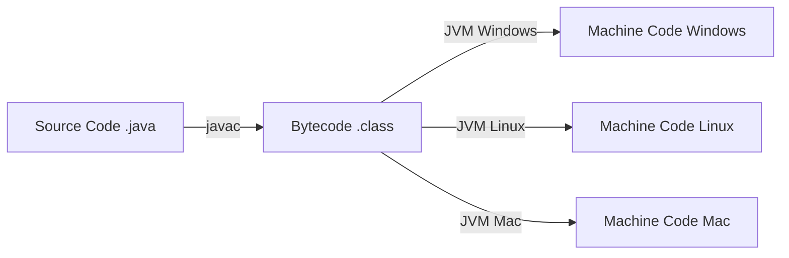
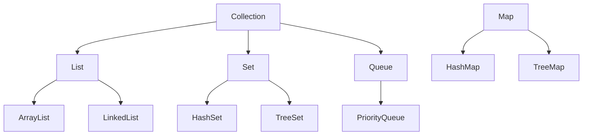
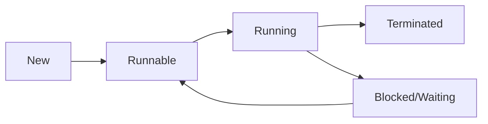
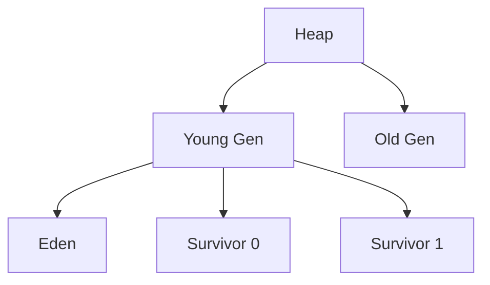

# Java Interview Questions & Answers (100+)

This guide contains 100+ Java interview questions, ranging from core concepts to advanced concurrency and performance tuning. Each question includes a model answer and potential follow-up paths based on the candidate's response.

## Part 1: Core Java & OOP (1-20)

### 1. What is the difference between JDK, JRE, and JVM?

| Component | Full Name | Role | Contains |
| :--- | :--- | :--- | :--- |
| **JVM** | Java Virtual Machine | Executes bytecode. Platform dependent. | Just the execution engine. |
| **JRE** | Java Runtime Environment | Environment to run Java apps. | JVM + Libraries + Class Loader. |
| **JDK** | Java Development Kit | Kit to develop Java apps. | JRE + Tools (javac, debugger, javadoc). |

**Candidate Response Paths:**

*   **Path A: Candidate mentions "Platform Independence".**
    *   *Follow-up:* "Is the JVM itself platform independent?"
    *   *Answer:* No, the JVM is platform-specific (there is a different JVM for Windows, Linux, Mac). The *bytecode* is platform independent.

### 2. Explain the "Write Once, Run Anywhere" concept.

Java code is compiled into **bytecode** (`.class` files), which is an intermediate language. This bytecode is executed by the JVM, which translates it into machine code specific to the underlying hardware.



### 3. What are the main principles of Object-Oriented Programming (OOP)?

1.  **Encapsulation:** Wrapping data (variables) and code (methods) together as a single unit.
2.  **Inheritance:** Mechanism where one class acquires the properties and behaviors of a parent class.
3.  **Polymorphism:** Ability of an object to take on many forms (Overloading, Overriding).
4.  **Abstraction:** Hiding internal details and showing only functionality.

**Candidate Response Paths:**

*   **Path A: Candidate confuses Abstraction and Encapsulation.**
    *   *Follow-up:* "Does a private variable achieve abstraction or encapsulation?"
    *   *Answer:* Encapsulation (data hiding). Abstraction is about the design (interfaces, abstract classes).

### 4. What is the difference between `String`, `StringBuilder`, and `StringBuffer`?

| Class | Mutable? | Thread-Safe? | Performance | Use Case |
| :--- | :--- | :--- | :--- | :--- |
| `String` | No (Immutable) | Yes (Implicitly) | Slow (if modified often) | Constants, Keys |
| `StringBuffer` | Yes | Yes (Synchronized) | Slower than Builder | Multi-threaded env |
| `StringBuilder` | Yes | No | Fast | Single-threaded string manipulation |

### 5. Why is the String class Immutable in Java?

*   **Security:** Strings are used for network connections, database URLs, usernames/passwords. If mutable, these could be changed after security checks.
*   **String Pool:** Immutability allows the String Constant Pool to function (caching), saving memory.
*   **Thread Safety:** Immutable objects are automatically thread-safe.

### 6. What is the difference between `equals()` and `==`?

*   `==`: Compares **references** (memory addresses) for objects. Compares values for primitives.
*   `equals()`: A method that compares **content** (logical equality). Default implementation in `Object` uses `==`, so it must be overridden.

**Candidate Response Paths:**

*   **Path A: Candidate mentions String Constant Pool.**
    *   *Follow-up:* "What is the result of `new String("A") == "A"`?"
    *   *Answer:* `false`. `new` forces a new object on the heap, bypassing the pool for the reference check against the pool literal.

### 7. What is the difference between Overloading and Overriding?

| Feature | Method Overloading | Method Overriding |
| :--- | :--- | :--- |
| **Binding** | Static (Compile-time) | Dynamic (Runtime) |
| **Signature** | Must have different parameters. | Must have same signature. |
| **Scope** | Within the same class. | Parent vs Child class. |
| **Return Type** | Can change. | Must be same (or covariant). |

### 8. What are Wrapper Classes?

Classes that wrap primitive data types into objects.
*   `int` -> `Integer`
*   `char` -> `Character`

**Use Case:** Collections (List, Map) store objects, not primitives.

**Candidate Response Paths:**

*   **Path A: Autoboxing.**
    *   *Follow-up:* "Does Autoboxing have a performance cost?"
    *   *Answer:* Yes, creating objects is more expensive than using stack-based primitives. Also, `Integer` cache applies only to -128 to 127.

### 9. What is the difference between an Interface and an Abstract Class?

| Feature | Interface (Pre-Java 8) | Abstract Class |
| :--- | :--- | :--- |
| **Methods** | Only abstract (public). | Abstract and concrete. |
| **Variables** | `public static final`. | Any type (instance, static). |
| **Inheritance** | A class can implement multiple. | A class can extend only one. |
| **Constructor** | No. | Yes. |

*(Note: Java 8+ added default/static methods to Interfaces, blurring the lines, but state (instance variables) remains the key difference).*

### 10. Explain the `final` keyword.

*   **Final Variable:** Value cannot be changed (constant).
*   **Final Method:** Cannot be overridden.
*   **Final Class:** Cannot be inherited (e.g., `String` class).

**Candidate Response Paths:**

*   **Path A: Final reference.**
    *   *Follow-up:* "If a List is final, can I add elements to it?"
    *   *Answer:* Yes. The *reference* cannot change (point to a new list), but the object itself is mutable.

### 11. What is the `static` keyword?

Belongs to the class rather than an instance.
*   **Static Variable:** Shared copy among all instances.
*   **Static Method:** Can be called without creating an instance. Cannot access instance variables/methods directly.
*   **Static Block:** Executed once when the class is loaded.

### 12. What are the Access Modifiers in Java?

| Modifier | Class | Package | Subclass | World |
| :--- | :--- | :--- | :--- | :--- |
| `public` | Yes | Yes | Yes | Yes |
| `protected` | Yes | Yes | Yes | No |
| `default` (no keyword) | Yes | Yes | No | No |
| `private` | Yes | No | No | No |

### 13. What is Checked vs Unchecked Exception?

*   **Checked Exception:** Checked at compile-time. Must be handled (`try-catch`) or declared (`throws`).
    *   *Examples:* `IOException`, `SQLException`.
*   **Unchecked Exception:** Occurs at runtime. Compiler doesn't force handling. Extends `RuntimeException`.
    *   *Examples:* `NullPointerException`, `ArrayIndexOutOfBoundsException`.

### 14. What is the `finally` block?

A block that always executes after `try` and `catch`, regardless of whether an exception occurred or not.
*   **Use Case:** Closing resources (files, DB connections).

**Candidate Response Paths:**

*   **Path A: When does it NOT execute?**
    *   *Answer:* `System.exit(0)` or JVM crash.

### 15. What is `try-with-resources`?

Introduced in Java 7. Automatically closes resources that implement `AutoCloseable`.

```java
try (BufferedReader br = new BufferedReader(new FileReader(path))) {
    return br.readLine();
} // br is automatically closed here
```

### 16. What is the difference between `throw` and `throws`?

*   `throw`: Used to explicitly throw an exception within a method body.
    *   `throw new Exception("Error");`
*   `throws`: Used in method signature to declare that this method might throw specific exceptions.
    *   `public void method() throws IOException`

### 17. Can you override a private or static method?

*   **Private:** No. They are not visible to subclasses.
*   **Static:** No. If you define a static method with the same signature in a subclass, it is **Method Hiding**, not overriding. Run-time polymorphism does not apply.

### 18. What is the Object class?

The root class of the Java class hierarchy. Every class explicitly or implicitly extends `Object`.
**Key Methods:** `toString()`, `equals()`, `hashCode()`, `getClass()`, `clone()`, `finalize()`, `wait()`, `notify()`.

### 19. What is the contract between `equals()` and `hashCode()`?

1.  If `a.equals(b)` is true, then `a.hashCode()` must equal `b.hashCode()`.
2.  If `a.hashCode() == b.hashCode()`, `a` and `b` may or may not be equal (Collision).

**Consequence:** If you override `equals()`, you **must** override `hashCode()`, otherwise Hash-based collections (HashMap, HashSet) will fail to retrieve objects correctly.

### 20. What is a Marker Interface?

An interface with no methods or fields. It provides run-time type information to the JVM or frameworks.
*   *Examples:* `Serializable`, `Cloneable`, `Remote`.
*   *Modern approach:* Annotations are often used instead.

## Part 2: Collections & Generics (21-40)

### 21. What is the Java Collections Framework hierarchy?

The root interface is `Collection`.
*   **List:** Ordered, allows duplicates.
*   **Set:** Unordered (mostly), unique elements.
*   **Queue:** FIFO (First In First Out).
*(Note: `Map` is part of the framework but does not extend `Collection`.)*



### 22. Difference between `ArrayList` and `LinkedList`?

| Feature | ArrayList | LinkedList |
| :--- | :--- | :--- |
| **Backing Structure** | Dynamic Array. | Doubly Linked List. |
| **Access (Get)** | Fast (O(1)). | Slow (O(n)). |
| **Insertion/Deletion** | Slow (requires shifting) (O(n)). | Fast (pointer change) (O(1) at ends). |
| **Memory** | Less overhead. | More overhead (stores pointers). |

### 23. How does `HashMap` work internally?

It uses an array of Nodes (buckets).
1.  **Hashing:** Calls `hashCode()` on the key to calculate the index.
2.  **Collision:** If two keys map to the same index, they form a Linked List (or Red-Black Tree in Java 8+ if > 8 nodes) in that bucket.
3.  **Retrieval:** Traverses the list/tree at the index, calling `equals()` on keys to find the match.

**Candidate Response Paths:**

*   **Path A: Candidate mentions resizing.**
    *   *Follow-up:* "When does it resize?"
    *   *Answer:* When `size > capacity * loadFactor` (default 0.75). It doubles the array size and rehashes everything.

### 24. Difference between `HashMap` and `Hashtable`?

| Feature | HashMap | Hashtable |
| :--- | :--- | :--- |
| **Thread-Safe** | No. | Yes (Synchronized methods). |
| **Null Keys/Values** | Allows 1 null key, many null values. | No nulls allowed. |
| **Performance** | Faster. | Slower (due to locks). |

### 25. Difference between `HashSet` and `TreeSet`?

*   **HashSet:** Uses `HashMap` internally. Unordered. O(1) operations.
*   **TreeSet:** Uses `TreeMap` (Red-Black Tree). Sorted order. O(log n) operations.

### 26. What is the difference between `Comparable` and `Comparator`?

*   **Comparable:** "Natural" ordering. Implemented by the class itself (`compareTo(T o)`).
    *   *Example:* `String`, `Integer`.
*   **Comparator:** Custom ordering. Implemented in a separate class/lambda (`compare(T o1, T o2)`).
    *   *Example:* Sort by ID, then by Name.

### 27. What is the difference between Fail-Fast and Fail-Safe Iterators?

*   **Fail-Fast:** Throws `ConcurrentModificationException` if the collection is modified (add/remove) while iterating. (e.g., `ArrayList`, `HashMap`).
*   **Fail-Safe:** Iterates over a clone or snapshot. Does not throw exception. (e.g., `CopyOnWriteArrayList`, `ConcurrentHashMap`).

### 28. How do you remove an element from a List while iterating?

**Wrong:** Using `list.remove()` inside a for-each loop (throws `ConcurrentModificationException`).

**Correct:**
1.  Use `Iterator.remove()`.
2.  Use Java 8 `removeIf()`.

```java
Iterator<String> it = list.iterator();
while(it.hasNext()){
    if(it.next().equals("A")) it.remove();
}
```

### 29. What is Generic Type Erasure?

Generics provide type safety at compile-time. At runtime, the JVM wipes out (erases) the specific type information.
*   `List<String>` becomes `List` (raw type) or `List<Object>`.
*   This ensures backward compatibility with older Java versions.

### 30. Explain `<? extends T>` vs `<? super T>`.

PECS: **Producer Extends, Consumer Super**.
*   **? extends T:** Upper bound. You can read from it (Producer), but cannot add (except null). Safe to read as T.
*   **? super T:** Lower bound. You can add to it (Consumer), but reading gives you `Object`.

### 31. What is `PriorityQueue`?

A Queue that processes elements based on priority (Natural ordering or Comparator) rather than FIFO.
*   Internal structure: Binary Heap.
*   Head is always the least element.

### 32. What is `WeakHashMap`?

A Map where keys are **WeakReferences**. If a key is no longer referenced elsewhere in the program, the entry is eligible for Garbage Collection, even if it exists in the Map.
*   *Use Case:* Caching where you don't want the cache to prevent GC.

### 33. What is `IdentityHashMap`?

A Map that uses reference equality (`==`) instead of object equality (`equals()`) for keys.
*   Two distinct objects with same content are considered different keys.

### 34. Can you use `Collections.sort()` on a custom object?

Yes, provided the object implements `Comparable` or you pass a `Comparator`.

### 35. What is `CopyOnWriteArrayList`?

A thread-safe variant of `ArrayList`.
*   **Mechanism:** Every mutation (add, set) creates a fresh copy of the underlying array.
*   **Use Case:** Read-heavy, write-rare scenarios (e.g., Listeners list).

### 36. What is the difference between `Array`, `ArrayList` and `Vector`?

*   **Array:** Fixed size. Holds primitives or objects. Fast.
*   **ArrayList:** Dynamic size. Not thread-safe.
*   **Vector:** Dynamic size. Thread-safe (Legacy, replaced by ArrayList/CopyOnWriteArrayList).

### 37. What happens if you override `equals()` but not `hashCode()` and use it in a HashMap?

The HashMap will treat two equal objects as different keys because they will likely hash to different buckets (default `hashCode` uses memory address). You will lose data (put one, cannot get it back with another equal instance).

### 38. How to make a collection Read-Only?

`Collections.unmodifiableList(list)`.
*   Any attempt to modify it throws `UnsupportedOperationException`.

### 39. What is the Diamond Operator `<>`?

Introduced in Java 7 to reduce verbosity.
*   Before: `List<String> list = new ArrayList<String>();`
*   After: `List<String> list = new ArrayList<>();`
Compiler infers the type.

### 40. What is `BlockingQueue`?

A Queue that supports operations that wait for the queue to become non-empty when retrieving an element, and wait for space to become available when storing an element.
*   **Core for Producer-Consumer pattern.**
*   *Impl:* `ArrayBlockingQueue`, `LinkedBlockingQueue`.

## Part 3: Concurrency & Multithreading (41-60)

### 41. What is the difference between Process and Thread?

| Feature | Process | Thread |
| :--- | :--- | :--- |
| **Memory** | Separate memory space. | Shared memory space (Heap). |
| **Creation** | Heavyweight. | Lightweight. |
| **Communication** | IPC (Inter-Process Communication). | Shared variables, wait/notify. |
| **Crash** | One process crash doesn't affect others. | One thread crash can kill the process. |

### 42. How do you create a thread in Java?

1.  **Extend `Thread` class.**
2.  **Implement `Runnable` interface.**
3.  **Implement `Callable` interface** (Executor Framework).

**Candidate Response Paths:**

*   **Path A: Which is better?**
    *   *Answer:* `Runnable`/`Callable`. Because Java supports single inheritance only, extending `Thread` blocks you from extending anything else. Also, separates task from runner.

### 43. What is the difference between `Runnable` and `Callable`?

*   **Runnable:**
    *   Method: `void run()`
    *   Return value: No.
    *   Exceptions: Cannot throw checked exceptions.
*   **Callable:**
    *   Method: `V call()`
    *   Return value: Yes.
    *   Exceptions: Can throw checked exceptions.

### 44. What are the thread states (Lifecycle)?



*   **New:** Created but not started.
*   **Runnable:** Ready to run (waiting for CPU).
*   **Running:** Executing.
*   **Blocked/Waiting:** Waiting for lock or IO.
*   **Terminated:** Finished execution.

### 45. What is the difference between `start()` and `run()`?

*   **start():** Creates a new thread and calls `run()` internally.
*   **run():** Executes the code in the **current** thread (just a normal method call).

### 46. What is Synchronization?

A mechanism to control access to shared resources by multiple threads to prevent data inconsistency.
*   **Synchronized Method:** Locks the object instance (`this`) or class (`Class` object for static).
*   **Synchronized Block:** Locks a specific object.

### 47. What is a Deadlock?

A situation where two or more threads are blocked forever, waiting for each other to release a lock.

**Example:**
*   Thread 1 locks A, waits for B.
*   Thread 2 locks B, waits for A.

**How to avoid:**
*   Acquire locks in a consistent order.
*   Use `tryLock()` with timeout.

### 48. What is the `volatile` keyword?

It guarantees **visibility**.
*   The value of a volatile variable is always read from the main memory, not from the thread's local cache.
*   It also prevents instruction reordering.
*   *Note:* It does **not** guarantee atomicity (e.g., `i++` is not safe with just volatile).

### 49. What is the difference between `wait()` and `sleep()`?

| Feature | wait() | sleep() |
| :--- | :--- | :--- |
| **Class** | `Object` class. | `Thread` class. |
| **Lock** | Releases the lock. | Holds the lock. |
| **Usage** | Inter-thread communication. | Pause execution. |
| **Wake up** | `notify()` or `notifyAll()`. | Time expires or interrupt. |

### 50. What is `join()`?

It allows one thread to wait for the completion of another.
`t1.join()` causes the current thread to pause execution until `t1` terminates.

### 51. What is the Executor Framework?

Introduced in Java 5. It decouples task submission from task execution.
*   Replaces manual thread creation (`new Thread()`).
*   Uses **Thread Pools** to reuse threads.

### 52. What are the types of Thread Pools?

*   **FixedThreadPool:** Fixed number of threads.
*   **CachedThreadPool:** Creates new threads as needed, reuses idle ones. Unbounded.
*   **SingleThreadExecutor:** Single worker thread.
*   **ScheduledThreadPool:** For scheduled/periodic tasks.

### 53. What is `Future`?

Represents the result of an asynchronous computation.
*   Methods: `isDone()`, `get()` (blocks until result is ready).

### 54. What is `CompletableFuture`?

Introduced in Java 8. It improves `Future` by allowing:
*   Non-blocking callbacks (`thenApply`, `thenAccept`).
*   Chaining multiple futures.
*   Combining futures (`allOf`).
*   Exception handling.

### 55. What is `ThreadLocal`?

A class that provides thread-local variables. Each thread accessing the variable has its own, independently initialized copy.
*   *Use Case:* Storing User ID or Transaction ID per thread in a web request.

### 56. What are Atomic Variables?

Classes in `java.util.concurrent.atomic` (e.g., `AtomicInteger`).
*   They support lock-free thread-safe operations on single variables.
*   Use CAS (Compare-And-Swap) hardware primitives.
*   *Example:* `incrementAndGet()` is a safe alternative to `volatile i++`.

### 57. What is the difference between `synchronized` and `ReentrantLock`?

*   **synchronized:** Implicit lock. Automatic unlock (even on exception). Cannot interrupt waiting.
*   **ReentrantLock:** Explicit lock. Must manually `unlock()` in `finally`.
    *   Features: `tryLock()`, `lockInterruptibly()`, Fair locking option.

### 58. What is a CountDownLatch?

A synchronization aid that allows one or more threads to wait until a set of operations being performed in other threads completes.
*   Initialized with a count (N).
*   Await threads block until count reaches 0 via `countDown()`.

### 59. What is a CyclicBarrier?

Similar to CountDownLatch, but allows a set of threads to all wait for each other to reach a common barrier point.
*   **Reusable:** Unlike CountDownLatch, it can be reset.

### 60. What is the Fork/Join Framework?

Designed for work-stealing parallelism.
*   **RecursiveTask:** Returns a result.
*   **RecursiveAction:** No result.
*   Splits a large task into smaller sub-tasks (Fork), solves them, and combines results (Join).
*   Used by parallel Streams.

## Part 4: JVM, Memory & Performance (61-80)

### 61. Explain the JVM Memory Model.

| Area | Description | Shared? |
| :--- | :--- | :--- |
| **Heap** | Stores Objects. Garbage Collected. | Yes (All threads) |
| **Stack** | Stores method calls, local variables, primitives. | No (Per thread) |
| **Method Area** | Stores Class structures, Static variables, Constants. | Yes |
| **PC Register** | Holds address of current instruction. | No |
| **Native Method Stack** | For Native methods. | No |

### 62. What is Garbage Collection (GC)?

The process by which JVM automatically frees memory used by objects that are no longer reachable.

**Candidate Response Paths:**

*   **Path A: Explicit GC.**
    *   *Follow-up:* "Can you force GC?"
    *   *Answer:* You can suggest it via `System.gc()`, but JVM guarantees nothing.

### 63. How does the Garbage Collector know an object is "garbage"?

**Reachability Analysis.** It starts from **GC Roots** (Stack variables, Static variables, Active threads). Any object not reachable from a GC Root is garbage.

*(Note: Older Reference Counting method is not used due to circular reference issues).*

### 64. What are the different types of GC implementations?

*   **Serial GC:** Single-threaded. (Stop-the-world). Good for small apps.
*   **Parallel GC:** Multiple threads for GC. High throughput.
*   **CMS (Concurrent Mark Sweep):** Low latency. Deprecated in Java 9.
*   **G1 GC (Garbage First):** Splits heap into regions. Balances throughput and latency. Default in newer Java.
*   **ZGC:** Ultra-low latency (<10ms pauses) for huge heaps.

### 65. What is "Stop-the-World"?

A pause where all application threads are suspended so the GC can safely reclaim memory.

### 66. What is the difference between Minor GC and Major GC?

*   **Minor GC:** Collects the **Young Generation** (Eden + Survivor spaces). Fast.
*   **Major/Full GC:** Collects the **Old Generation** (and usually Young too). Slow. "Stop-the-world" is longer.

### 67. Explain the Heap Generations (Young, Old, Perm/Metaspace).

1.  **Young Gen:** New objects are allocated here (Eden). Survivors move to S0/S1.
2.  **Old Gen:** Objects that survive multiple Minor GCs move here.
3.  **Metaspace (Java 8+):** Replaced PermGen. Stores class metadata. Uses native memory.



### 68. What is a Memory Leak in Java?

When objects are no longer needed by the application but are still referenced (e.g., in a static List), preventing GC from removing them.

**Common Causes:**
*   Static collections.
*   Unclosed resources.
*   Listeners/Callbacks not unregistered.

### 69. What is a `StackOverflowError`?

Thrown when the stack size limit is exceeded.
*   **Cause:** Deep or infinite recursion.

### 70. What is an `OutOfMemoryError`?

Thrown when the JVM cannot allocate an object because the Heap is full and GC cannot free up space.
*   **Variations:** Java heap space, Metaspace, GC overhead limit exceeded.

### 71. How do you tune the JVM? (Common Flags)

*   `-Xms`: Initial heap size.
*   `-Xmx`: Max heap size.
*   `-XX:+UseG1GC`: Use G1 Collector.
*   `-Xss`: Stack size per thread.

### 72. What is ClassLoader?

A subsystem of JVM responsible for loading class files at runtime.
1.  **Bootstrap:** Loads core Java classes (rt.jar).
2.  **Extension/Platform:** Loads extensions (lib/ext).
3.  **Application/System:** Loads classes from classpath.

### 73. What is the "Delegation Model" in ClassLoading?

When a ClassLoader is asked to load a class, it delegates the request to its parent first. It only attempts to load if the parent cannot find it.
*   **Security:** Prevents overriding core classes like `java.lang.String`.

### 74. What is JIT (Just-In-Time) Compiler?

Part of the JVM that compiles bytecode into native machine code *at runtime* to improve performance.
*   It identifies "hotspots" (frequently executed methods) and compiles them.

### 75. What are Strong, Soft, Weak, and Phantom References?

*   **Strong:** Normal reference (`obj = new Object()`). Never GC'd if reachable.
*   **Soft:** GC'd only if memory is running low. (Good for caches).
*   **Weak:** GC'd as soon as the collector sees it (if no strong refs exist). (Good for metadata).
*   **Phantom:** Enqueued after the object is finalized but before memory is reclaimed.

### 76. What is the difference between `String literal` and `new String()` memory allocation?

*   `String s = "A";` -> Goes to **String Constant Pool** (Heap). Reused.
*   `String s = new String("A");` -> Goes to **Heap** (Non-pool). New object created every time.

### 77. How does the `finalize()` method work?

Called by GC before destroying the object.
*   **Deprecated in Java 9.**
*   **Issues:** Unpredictable, can resurrect objects, performance drag.
*   **Replacement:** `Cleaner` or `PhantomReference`.

### 78. What is "Escape Analysis"?

A JIT optimization technique. If an object is allocated in a method and its reference never "escapes" (is not returned or assigned to a global), the JVM might:
*   Allocate it on the **Stack** instead of Heap.
*   Eliminate locking (Lock Elision).

### 79. What is a Race Condition?

A condition where the system's behavior depends on the sequence or timing of other uncontrollable events (threads).
*   *Fix:* Synchronization / Atomic Variables.

### 80. What tools do you use for profiling?

*   **VisualVM:** Monitor Heap, Threads, CPU.
*   **JConsole:** Basic monitoring.
*   **Java Flight Recorder (JFR):** Low overhead data collection.
*   **Eclipse MAT:** Analyze Heap Dumps for memory leaks.

## Part 5: Advanced Features, Frameworks & Design Patterns (81-100)

### 81. What is a Functional Interface?

An interface with exactly one abstract method.
*   **Annotation:** `@FunctionalInterface` (Optional, ensures compiler check).
*   **Examples:** `Runnable`, `Callable`, `Comparator`, `Predicate`.
*   **Use:** Enables Lambda Expressions.

### 82. Explain Lambda Expressions.

A short block of code which takes in parameters and returns a value. It is essentially an anonymous function.

```java
(parameter1, parameter2) -> { code block }
list.forEach(n -> System.out.println(n));
```

### 83. What are Streams in Java 8?

A sequence of elements supporting sequential and parallel aggregate operations.
*   **Intermediate Ops (Lazy):** `filter()`, `map()`, `sorted()`.
*   **Terminal Ops (Eager):** `collect()`, `forEach()`, `reduce()`.

**Candidate Response Paths:**

*   **Path A: Parallel Streams.**
    *   *Follow-up:* "Is parallel stream always faster?"
    *   *Answer:* No. For small datasets or tasks with overhead (boxing/unboxing), thread management cost might exceed benefits.

### 84. What is the difference between `map()` and `flatMap()`?

*   `map()`: Transforms one object to another (One-to-One).
    *   `Stream<List<String>>` -> `Stream<Integer>` (size of list)
*   `flatMap()`: Flattens nested structures (One-to-Many).
    *   `Stream<List<String>>` -> `Stream<String>` (all strings from all lists).

### 85. What is `Optional`?

A container object which may or may not contain a non-null value.
*   **Purpose:** To avoid `NullPointerException` and write cleaner code without explicit null checks.
*   **Methods:** `isPresent()`, `orElse()`, `orElseThrow()`.

### 86. What is the Singleton Pattern?

A design pattern that ensures a class has only one instance and provides a global point of access to it.

**Thread-Safe Implementation (Double-Checked Locking):**
```java
public class Singleton {
    private static volatile Singleton instance;
    private Singleton() {} // Private constructor
    public static Singleton getInstance() {
        if (instance == null) {
            synchronized (Singleton.class) {
                if (instance == null) instance = new Singleton();
            }
        }
        return instance;
    }
}
```

### 87. What is the Factory Pattern?

A creational pattern that provides an interface for creating objects in a superclass, but allows subclasses to alter the type of objects that will be created.

### 88. What is Dependency Injection (DI)?

A design pattern used to implement IoC (Inversion of Control). It allows the creation of dependent objects outside of a class and provides those objects to a class through different ways (Constructor, Setter, Field).
*   *Main Framework:* Spring.

### 89. What is Reflection API?

Allows inspection and modification of classes, interfaces, fields, and methods at runtime, even if they are private.
*   *Use:* Frameworks (Spring, Hibernate), Testing (JUnit).
*   *Cons:* Performance overhead, breaks encapsulation.

### 90. What is Serialization?

The process of converting the state of an object into a byte stream (to save to file or send over network).
*   **Interface:** `Serializable`.
*   **serialVersionUID:** Used to verify that the sender and receiver of a serialized object have loaded classes for that object that are compatible.

### 91. What is the `transient` keyword?

Variables marked as `transient` are **not serialized**. During deserialization, they are initialized with their default value (e.g., null or 0).

### 92. What are Java Modules (Project Jigsaw - Java 9)?

A mechanism to group related packages and resources into a module.
*   **Descriptor:** `module-info.java`.
*   **Benefits:** Strong encapsulation (can hide public classes), explicit dependencies, smaller runtime (jlink).

### 93. What is Inversion of Control (IoC)?

A principle where the control of flow of a program is inverted: instead of the programmer controlling the flow, an external framework (Container) controls it.
*   *Example:* Spring Container manages object lifecycle.

### 94. What is AOP (Aspect Oriented Programming)?

A programming paradigm that aims to increase modularity by allowing the separation of cross-cutting concerns (logging, security, transaction management).
*   **Aspect:** The module defined (e.g., Logging).
*   **Advice:** The action taken (Before, After).
*   **Pointcut:** Where to apply the advice.

### 95. What are Annotations?

Metadata added to the code. They provide data about a program that is not part of the program itself.
*   *Built-in:* `@Override`, `@Deprecated`.
*   *Meta-annotations:* `@Retention`, `@Target`.

### 96. What is the difference between `Comparator.comparing()` and `thenComparing()`?

*   `comparing()`: Primary sort key.
*   `thenComparing()`: Secondary sort key (chaining).
    *   `list.sort(Comparator.comparing(User::getName).thenComparing(User::getAge));`

### 97. What is the difference between `invokedynamic` and other invoke instructions?

*   `invokevirtual`: Standard instance method call.
*   `invokedynamic`: (Java 7+) Allows the JVM to link a method call dynamically at runtime. Heavily used by Lambdas.

### 98. How does Java handle Memory Leaks in ThreadLocal?

If `ThreadLocal` variables are not removed (using `remove()`), they stay in the thread's map as long as the thread is alive. In thread pools (Tomcat), threads live forever, leading to memory leaks (Classloader leaks).

### 99. What are Records (Java 14+)?

A concise way to create immutable data classes.
```java
public record Point(int x, int y) {}
```
It automatically generates constructor, getters, `equals()`, `hashCode()`, and `toString()`.

### 100. What is Sealed Class (Java 15+)?

Classes that restrict which other classes may extend them.

```java
public sealed class Shape permits Circle, Square {}
```
*   Allows better control over inheritance hierarchies.

---
**End of Interview Questions**
