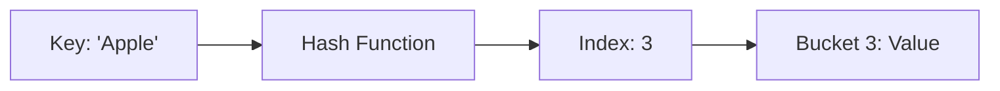

# Python Interview Questions & Answers (100+)

This guide contains 100+ Python interview questions, ranging from basic to advanced. Each question includes a model answer, code snippets, and potential follow-up paths based on the candidate's response.

## Part 1: Core Python Basics (1-20)

### 1. What is the difference between `list` and `tuple`?

| Feature | List | Tuple |
| :--- | :--- | :--- |
| **Mutability** | Mutable (can change) | Immutable (cannot change) |
| **Syntax** | `[]` | `()` |
| **Performance** | Slower (overhead for resizing) | Faster (fixed size) |
| **Use Case** | Collections of items that change | Constant data, Dictionary keys |

**Candidate Response Paths:**

*   **Path A: Candidate mentions Mutability.**
    *   *Follow-up:* "Can a tuple contain a mutable object (like a list) and can that object be modified?"
    *   *Answer:* Yes. `t = (1, [2, 3])`. You can modify `t[1]` because the tuple only stores the *reference* to the list, which doesn't change, even if the list content does.

*   **Path B: Candidate focuses on Syntax.**
    *   *Follow-up:* "How do you create a tuple with a single element?"
    *   *Answer:* You must use a trailing comma: `t = (1,)`. Without it, Python interprets it as an integer in parentheses `(1)`.

### 2. How is memory managed in Python?

Python uses a private heap containing all Python objects and data structures. The management of this private heap is ensured internally by the **Python Memory Manager**.

Key mechanisms:
1.  **Reference Counting:** Objects are deallocated when their reference count drops to zero.
2.  **Garbage Collection:** Handles cyclic references that reference counting cannot catch.

**Candidate Response Paths:**

*   **Path A: Candidate mentions Garbage Collection (GC).**
    *   *Follow-up:* "When does the Garbage Collector run?"
    *   *Answer:* It runs periodically based on thresholds (generations 0, 1, 2). It can also be triggered manually using `gc.collect()`.

### 3. What is PEP 8?

PEP 8 is the style guide for Python code. It ensures consistency and readability.
Key rules:
*   Indentation: 4 spaces.
*   Line Length: 79 characters.
*   Variable Names: `snake_case` for functions/variables, `CamelCase` for classes.

**Candidate Response Paths:**

*   **Path A: Candidate is familiar.**
    *   *Follow-up:* "How do you check your code against PEP 8 automatically?"
    *   *Answer:* Using linters like `flake8`, `pylint`, or formatters like `black` (which is opinionated but compliant).

### 4. What are the key features of Python?

*   **Interpreted:** Executed line by line.
*   **Dynamically Typed:** Type checks happen at runtime.
*   **Object-Oriented:** Everything is an object.
*   **High-level:** Abstraction from memory details.

**Candidate Response Paths:**

*   **Path A: Candidate mentions 'Dynamically Typed'.**
    *   *Follow-up:* "What is the difference between dynamic typing and strong typing? Is Python strongly typed?"
    *   *Answer:* Yes, Python is strongly typed. You cannot add "1" (string) and 1 (int) without explicit conversion, unlike JavaScript (weakly typed).

### 5. Explain `is` vs `==`.

*   `==`: Checks for **Value Equality** (do they hold the same data?).
*   `is`: Checks for **Reference Equality** (do they point to the exact same memory address?).

```python
a = [1, 2, 3]
b = [1, 2, 3]
print(a == b) # True
print(a is b) # False (different objects)
```

**Candidate Response Paths:**

*   **Path A: Candidate understands the difference.**
    *   *Follow-up:* "Why is `None` usually compared using `is`?"
    *   *Answer:* Because `None` is a singleton. There is only one instance of `None` in the system, so `is` is faster and safer (prevents custom `__eq__` methods from fooling the check).

### 6. What acts as a placeholder for an empty block?

The `pass` statement.
It is a null operation; nothing happens when it executes. Useful for empty function definitions or loops during development.

### 7. What is a Dictionary?

A collection of Key-Value pairs. It is unordered (before Python 3.7), mutable, and indexed. Keys must be immutable (hashable).

**Candidate Response Paths:**

*   **Path A: Candidate mentions Hashable keys.**
    *   *Follow-up:* "Can I use a list as a dictionary key?"
    *   *Answer:* No, lists are mutable and thus not hashable. You can use a `tuple` as a key if it contains only immutable elements.

### 8. How do you copy an object in Python?

*   **Assignment (`=`):** Creates a new reference to the same object.
*   **Shallow Copy (`copy.copy()` or `[:]`):** Creates a new object, but inserts references into it to the objects found in the original.
*   **Deep Copy (`copy.deepcopy()`):** Creates a new object and recursively copies everything.

**Candidate Response Paths:**

*   **Path A: Candidate explains Shallow Copy.**
    *   *Follow-up:* "If I change a nested list in a shallow copy, does it affect the original?"
    *   *Answer:* Yes, because the inner list reference is shared.

### 9. What is a `set`?

Unordered collection of unique elements.
Useful for:
*   Removing duplicates.
*   Set operations (Union `|`, Intersection `&`, Difference `-`).

### 10. How do you manage packages in Python?

Using **pip** (Python Installer Package).
Files usually listed in `requirements.txt` or `pyproject.toml`.

**Candidate Response Paths:**

*   **Path A: Candidate mentions Virtual Environments.**
    *   *Follow-up:* "Why are virtual environments important?"
    *   *Answer:* To isolate dependencies per project, avoiding version conflicts between projects or with the system Python.

### 11. What is the difference between `.py` and `.pyc` files?

*   `.py`: Source code.
*   `.pyc`: Bytecode (compiled version). Python compiles `.py` to `.pyc` to speed up loading. Stored in `__pycache__`.

### 12. Explain String Interpolation methods.

1.  `%` formatting (Old): `"Hello %s" % name`
2.  `.format()` (Newer): `"Hello {}".format(name)`
3.  **f-Strings** (Modern, Python 3.6+): `f"Hello {name}"` (Fastest and most readable).

### 13. What is the Global Interpreter Lock (GIL)?

A mutex that protects access to Python objects, preventing multiple native threads from executing Python bytecodes at once. This means Python threads are not truly parallel on multi-core CPUs for CPU-bound tasks.

**Candidate Response Paths:**

*   **Path A: Candidate says 'Python cannot do parallelism'.**
    *   *Follow-up:* "How do we achieve parallelism then?"
    *   *Answer:* Use `multiprocessing` (separate processes have their own memory/GIL) or use libraries like NumPy that release the GIL for heavy computations.

### 14. What are negative indexes?

Python allows accessing elements from the end of a sequence using negative numbers.
`-1` is the last item, `-2` is the second to last.

### 15. What is slicing?

Extracting a part of a sequence.
Syntax: `object[start:stop:step]`

```python
a = [0, 1, 2, 3, 4, 5]
print(a[::-1]) # [5, 4, 3, 2, 1, 0] (Reverses list)
```

### 16. What is the difference between `range` and `xrange`?

*   **Python 2:** `range` returned a list, `xrange` returned an iterator (memory efficient).
*   **Python 3:** `xrange` is gone. `range` now behaves like the old `xrange` (returns a range object/iterator).

### 17. How do you handle errors in Python?

Using `try`, `except`, `else`, and `finally`.

```python
try:
    x = 1 / 0
except ZeroDivisionError:
    print("Error")
else:
    print("Success") # Runs if no exception
finally:
    print("Cleanup") # Always runs
```

### 18. What is a Docstring?

A string literal that occurs as the first statement in a module, function, class, or method definition. Accessed via `__doc__`.

**Style:** Triple quotes `"""Description"""`.

### 19. What is `__init__`?

The constructor method for a class. It is automatically called when a new instance of the class is created. Used to initialize attributes.

### 20. What is `self`?

It represents the instance of the class. By using `self`, we can access the attributes and methods of the class in Python. It is an explicit first argument (unlike `this` in Java/C++ which is implicit).


## Part 2: Control Flow & Loops (21-35)

### 21. What is the difference between `break`, `continue`, and `pass`?

| Statement | Effect |
| :--- | :--- |
| `break` | Terminates the loop immediately. |
| `continue` | Skips the current iteration and jumps to the next. |
| `pass` | Does nothing (placeholder). |

### 22. Can you have an `else` clause with a loop?

Yes, `else` in a loop executes when the loop completes normally (without encountering a `break` statement).

```python
for i in range(3):
    print(i)
else:
    print("Done") # Prints "Done"

for i in range(3):
    if i == 1:
        break
else:
    print("Done") # Does NOT print
```

### 23. What are iterators and iterables?

*   **Iterable:** An object capable of returning its members one at a time (e.g., list, string). Has `__iter__()`.
*   **Iterator:** An object representing a stream of data. Has `__next__()` and `__iter__()`.

### 24. What is List Comprehension?

A concise way to create lists.
Syntax: `[expression for item in iterable if condition]`

```python
squares = [x**2 for x in range(10) if x % 2 == 0]
```

### 25. What is the ternary operator in Python?

`[on_true] if [expression] else [on_false]`

```python
x = 10
status = "Even" if x % 2 == 0 else "Odd"
```

### 26. How does `enumerate()` work?

It adds a counter to an iterable and returns it as an enumerate object (iterator of tuples).

```python
names = ["Alice", "Bob"]
for index, name in enumerate(names, start=1):
    print(f"{index}: {name}")
# Output:
# 1: Alice
# 2: Bob
```

### 27. What is `zip()`?

Aggregates elements from two or more iterables. Returns an iterator of tuples.

```python
names = ["Alice", "Bob"]
ages = [25, 30]
print(list(zip(names, ages))) # [('Alice', 25), ('Bob', 30)]
```

### 28. What happens if `zip`ped lists are different lengths?

`zip()` stops at the shortest list. To fill missing values, use `itertools.zip_longest()`.

### 29. How do you swap two variables in one line?

```python
a, b = b, a
```

### 30. What is the `with` statement?

It is used for **Context Management**. It ensures that resources (like file streams) are properly cleaned up (closed) even if exceptions occur.

```python
with open('file.txt', 'r') as f:
    content = f.read()
# f is automatically closed here
```

### 31. Explain the `if __name__ == "__main__":` block.

It checks if the script is being run directly (not imported as a module). If imported, `__name__` is the module name; if run directly, `__name__` is `"__main__"`.

### 32. What is `dict.get()` vs `dict[]`?

*   `dict[key]`: Raises `KeyError` if key is missing.
*   `dict.get(key, default)`: Returns `None` (or specified default) if key is missing. Safer.

### 33. How to check if a key exists in a dictionary?

Use the `in` operator.
```python
if "key" in my_dict:
    print("Exists")
```

### 34. What is the difference between `for` loop and `while` loop?

*   `for`: Iterates over a sequence (known number of times).
*   `while`: Repeats as long as a condition is true (unknown number of times).

### 35. How to flatten a list of lists?

**Candidate Response Paths:**

*   **Path A: List Comprehension.**
    ```python
    flat = [item for sublist in l for item in sublist]
    ```
*   **Path B: `itertools.chain`.**
    ```python
    import itertools
    flat = list(itertools.chain(*l))
    ```

## Part 3: Functions & Functional Programming (36-50)

### 36. What is the difference between `*args` and `**kwargs`?

*   `*args`: Allows passing a variable number of *positional* arguments (tuple).
*   `**kwargs`: Allows passing a variable number of *keyword* arguments (dictionary).

```python
def func(*args, **kwargs):
    print(args)   # (1, 2)
    print(kwargs) # {'a': 3}

func(1, 2, a=3)
```

### 37. What are lambda functions?

Anonymous, small functions defined with the `lambda` keyword. They can have any number of arguments but only one expression.

```python
add = lambda x, y: x + y
print(add(2, 3)) # 5
```

### 38. Explain `map()`, `filter()`, and `reduce()`.

*   `map(func, iter)`: Applies `func` to all items in `iter`.
*   `filter(func, iter)`: Creates a list of elements for which `func` returns true.
*   `reduce(func, iter)`: Applies a rolling computation to sequential pairs of values (requires `functools`).

### 39. What is a "First Class Function"?

Functions are treated like any other variable. They can be:
1.  Passed as arguments to other functions.
2.  Returned from other functions.
3.  Assigned to variables.

### 40. What is Scope Resolution (LEGB Rule)?

Python searches for variables in this order:
1.  **L**ocal (Inside function)
2.  **E**nclosing (Nested function globals)
3.  **G**lobal (Module level)
4.  **B**uilt-in (Python keywords)

### 41. What is a Closure?

A function object that remembers values in enclosing scopes even if they are not present in memory.

```python
def outer(x):
    def inner(y):
        return x + y # Remembers x
    return inner

add5 = outer(5)
print(add5(10)) # 15
```

### 42. What is the `global` keyword?

Allows you to modify a global variable inside a local scope (function).

```python
x = 10
def change():
    global x
    x = 20
```

### 43. What is the `nonlocal` keyword?

Allows you to modify a variable in the *nearest enclosing scope* (not global). Used in nested functions.

### 44. Default Argument Values Gotcha.

**Question:** What is the output?
```python
def extend_list(val, list=[]):
    list.append(val)
    return list

list1 = extend_list(10)
list2 = extend_list(123, [])
list3 = extend_list('a')
print(list1)
print(list3)
```
**Answer:**
`[10, 'a']` and `[10, 'a']`.
Default arguments are evaluated *once* at function definition time, so the list is shared across calls.

### 45. What is Currying?

Decomposing a function that takes multiple arguments into a sequence of functions that each take a single argument. (Not native to Python syntax but achievable with closures or `functools.partial`).

### 46. What is a Higher-Order Function?

A function that takes another function as an argument or returns a function. (e.g., `map`, `decorator`).

### 47. Difference between parameters and arguments?

*   **Parameters:** Variables listed in the function definition.
*   **Arguments:** Actual values passed to the function when called.

### 48. Can you force Keyword-Only arguments?

Yes, by placing a `*` in the parameter list.

```python
def func(a, *, b):
    pass

func(1, b=2) # OK
func(1, 2)   # Error
```

### 49. What is introspection (or reflection)?

The ability of a program to examine the type or properties of an object at runtime.
Examples: `type()`, `id()`, `dir()`, `getattr()`, `hasattr()`.

### 50. How to create a function generator?

Use the `yield` keyword instead of `return`.

```python
def count_up_to(n):
    count = 1
    while count <= n:
        yield count
        count += 1
```

## Part 4: Data Structures (51-65)

### 51. What is the time complexity of looking up a key in a Dictionary?

O(1) on average (Constant time) because it uses a Hash Table.
O(n) in worst case (Hash collisions, though rare).

### 52. How does a Hash Table work?

It uses a hash function to compute an index into an array of buckets or slots, from which the desired value can be found.

**Diagram: Hash Table**


### 53. What is the difference between `append()` and `extend()`?

*   `append(x)`: Adds `x` as a single element to the end of the list.
*   `extend(iterable)`: Appends all items from the iterable to the end.

```python
x = [1, 2]
x.append([3, 4]) # [1, 2, [3, 4]]
x.extend([3, 4]) # [1, 2, [3, 4], 3, 4]
```

### 54. What is `collections.defaultdict`?

A dictionary subclass that calls a factory function to supply missing values, avoiding `KeyError`.

```python
from collections import defaultdict
d = defaultdict(int)
d['a'] += 1 # 'a' is initialized to 0, then incremented
```

### 55. What is `collections.Counter`?

A dict subclass for counting hashable objects.

```python
from collections import Counter
c = Counter('gallahad')
# {'a': 3, 'l': 2, 'g': 1, 'h': 1, 'd': 1}
```

### 56. What is `collections.namedtuple`?

Factory function for creating tuple subclasses with named fields. Makes code more readable than accessing tuples by index.

```python
from collections import namedtuple
Point = namedtuple('Point', ['x', 'y'])
p = Point(11, 22)
print(p.x) # 11
```

### 57. What is a Deque?

`collections.deque` (Double-Ended Queue). Thread-safe, memory efficient appends and pops from either side of the deque with approx O(1) performance. Lists are O(n) for pop(0).

### 58. How are Lists implemented in Python?

Dynamic Arrays.
They store pointers to objects. When the array is full, it doubles in size (over-allocation) to achieve amortized O(1) appends.

### 59. How are Sets implemented?

Hash Tables (similar to Dictionaries, but with dummy values). This is why set elements must be hashable.

### 60. What is `heapq`?

The `heapq` module provides an implementation of the **Heap queue** algorithm (Priority Queue). It maintains the smallest element at index 0 (Min Heap).

### 61. How to merge two dictionaries?

**Candidate Response Paths:**

*   **Path A: Old method.** `z = x.copy(); z.update(y)`
*   **Path B: Python 3.5+.** `z = {**x, **y}`
*   **Path C: Python 3.9+.** `z = x | y` (Union operator).

### 62. How to remove duplicates from a list while preserving order?

`list(set(l))` destroys order.
**Solution:**
```python
seen = set()
result = [x for x in l if not (x in seen or seen.add(x))]
```
*(Note: `seen.add(x)` returns None, which is Falsy)*.

### 63. What is `frozenset`?

An immutable version of a Python set. Because it is immutable, it is hashable and can be used as a dictionary key or an element of another set.

### 64. What is a Weak Reference?

`weakref` module allows the programmer to create references to objects that do not increase the reference count. Useful for caching/caches to avoid memory leaks (holding objects in cache preventing GC).

### 65. Difference between `sort()` and `sorted()`?

*   `list.sort()`: Sorts the list **in-place**. Returns `None`.
*   `sorted(iterable)`: Returns a **new sorted list**. Original is unchanged.

## Part 5: Object-Oriented Programming (66-80)

### 66. How do you create a Class?

```python
class Dog:
    species = "Canis familiaris" # Class Attribute

    def __init__(self, name):
        self.name = name # Instance Attribute

    def bark(self):
        return f"{self.name} says Woof!"
```

### 67. Explain Inheritance.

Allows a class (Child) to derive attributes and methods from another class (Parent).

```python
class Puppy(Dog):
    def bark(self):
        return "Yap!"
```

### 68. What is `super()`?

A built-in function that returns a proxy object (temporary object of the superclass) that allows you to access methods of the base class.

```python
class Puppy(Dog):
    def __init__(self, name, age):
        super().__init__(name)
        self.age = age
```

### 69. Multiple Inheritance in Python?

Yes, Python supports it.
`class C(A, B): pass`

**Candidate Response Paths:**

*   **Path A: Candidate mentions Diamond Problem.**
    *   *Follow-up:* "How does Python resolve method resolution order in the Diamond Problem?"
    *   *Answer:* It uses the C3 Linearization algorithm (MRO).

### 70. What is MRO (Method Resolution Order)?

The order in which Python looks for a method in a hierarchy of classes.
Viewable via `ClassName.__mro__` or `ClassName.mro()`.

### 71. What are Magic Methods (Dunder Methods)?

Special methods surrounded by double underscores. They allow instances of your classes to interact with built-in operators and functions.
*   `__init__`: Constructor.
*   `__str__`: Readable string representation (for users).
*   `__repr__`: Unambiguous string representation (for devs).
*   `__len__`: for `len()`.
*   `__add__`: for `+`.

### 72. Difference between `__str__` and `__repr__`?

*   `__str__`: Called by `str(object)` and `print`. Intended to be readable.
*   `__repr__`: Called by `repr(object)`. Intended to be unambiguous. Ideally `eval(repr(obj)) == obj`.

### 73. What are Class Methods and Static Methods?

*   `@classmethod`: Takes `cls` as first argument. Can access class state. Factory methods.
*   `@staticmethod`: No implicit first argument. Just a function inside a class namespace.

```python
class MyClass:
    @classmethod
    def from_string(cls, s):
        return cls(...)

    @staticmethod
    def is_valid(x):
        return x > 0
```

### 74. What is Encapsulation?

Restricting access to methods and variables.
In Python, we use `_single_leading_underscore` (convention: protected) and `__double_leading_underscore` (name mangling: private).

### 75. What is Name Mangling?

When using `__var` inside a class, Python changes the name to `_ClassName__var` to prevent subclasses from accidentally overriding it.

### 76. What is Polymorphism?

The ability to present the same interface for different underlying forms (data types).
*Example:* `len()` works on strings, lists, and dicts. `+` adds numbers but concatenates strings.

### 77. What is an Abstract Base Class (ABC)?

A class that cannot be instantiated and requires subclasses to implement specific methods.
Used to define interfaces.

```python
from abc import ABC, abstractmethod

class Shape(ABC):
    @abstractmethod
    def area(self):
        pass
```

### 78. What is `__slots__`?

A mechanism to optimize memory usage by telling Python not to use a `__dict__` for instances, but instead allocate space for a fixed set of attributes.

```python
class Point:
    __slots__ = ['x', 'y']
```

### 79. What is Duck Typing?

"If it looks like a duck and quacks like a duck, it's a duck."
Python doesn't check types; it checks for the presence of methods/attributes at runtime.

### 80. What is a Metaclass?

A class of a class. A class defines how an instance behaves; a metaclass defines how a class behaves.
Everything in Python is an object, including classes. The default metaclass is `type`.
Used for: Frameworks, API registration, singleton patterns.

## Part 6: Advanced Topics & Internals (81-100)

### 81. What is a Decorator?

A design pattern that allows a user to add new functionality to an existing object without modifying its structure. In Python, it is a function that takes another function as an argument.

```python
def my_decorator(func):
    def wrapper():
        print("Before")
        func()
        print("After")
    return wrapper

@my_decorator
def say_hello():
    print("Hello!")
```

### 82. How do you create a decorator with arguments?

You need three levels of nested functions.

```python
def repeat(num_times):
    def decorator_repeat(func):
        def wrapper(*args, **kwargs):
            for _ in range(num_times):
                func(*args, **kwargs)
        return wrapper
    return decorator_repeat

@repeat(3)
def greet(name):
    print(f"Hello {name}")
```

### 83. What is `functools.wraps`?

A decorator used when defining a decorator. It copies the metadata (name, docstring) of the original function to the wrapper function. Without it, debugging is hard (function name becomes `wrapper`).

### 84. What is a Generator?

A function that returns an iterator. It looks like a normal function except that it contains `yield` expressions.
It generates a series of values over time, pausing execution and saving state between each `yield`.

### 85. Generator vs Iterator?

*   Every generator is an iterator, but not vice versa.
*   Generators are easier to write (auto `__iter__` and `__next__`).

### 86. What is a Context Manager?

An object that defines the runtime context to be established when executing a `with` statement.
Must implement `__enter__` and `__exit__`.

```python
class FileManager:
    def __init__(self, name, mode):
        self.file = open(name, mode)
    def __enter__(self):
        return self.file
    def __exit__(self, type, value, traceback):
        self.file.close()
```

### 87. What is the `contextlib` module?

Utilities for creating context managers.
`@contextlib.contextmanager` decorator allows creating a context manager using a generator function (yield separates enter and exit logic).

### 88. Explain `async` and `await` (Asyncio).

*   `async def`: Defines a coroutine.
*   `await`: Pauses execution of the coroutine until the awaitable (IO operation) completes.
Used for concurrency (single-threaded cooperative multitasking), best for IO-bound tasks.

### 89. Threading vs Multiprocessing?

| Feature | Threading | Multiprocessing |
| :--- | :--- | :--- |
| **Memory** | Shared | Separate |
| **GIL** | Yes (limits CPU parallelism) | No (Bypasses GIL) |
| **Use Case** | I/O Bound (Network, Disk) | CPU Bound (Calculations) |
| **Overhead** | Low | High (Process creation) |

### 90. What is a descriptor?

An object attribute with "binding behavior", one whose attribute access has been overridden by methods in the descriptor protocol: `__get__`, `__set__`, and `__delete__`.
Underlies properties, methods, static methods, class methods, and `super()`.

### 91. What is the `property` decorator?

A built-in descriptor that turns a method into a read-only attribute (getter), and allows defining setters and deleters.

```python
class C:
    def __init__(self):
        self._x = None
    @property
    def x(self):
        return self._x
    @x.setter
    def x(self, value):
        self._x = value
```

### 92. How does Python handle circular imports?

If module A imports B, and B imports A, it can cause an `ImportError`.
**Solutions:**
1.  Import inside the function/method (defer import).
2.  Restructure code to remove circular dependency.

### 93. What is the `__call__` method?

Allows an instance of a class to be called as a function.

```python
class Adder:
    def __call__(self, x, y):
        return x + y

add = Adder()
print(add(2, 3)) # 5
```

### 94. What is Pickling and Unpickling?

*   **Pickling:** Serializing a Python object structure into a byte stream.
*   **Unpickling:** Deserializing the byte stream back into an object.
*   **Security Risk:** Never unpickle data received from an untrusted source (can execute arbitrary code).

### 95. What is the difference between `__new__` and `__init__`?

*   `__new__`: Static method. Creates the instance. Returns the instance.
*   `__init__`: Instance method. Initializes the instance. Returns None.
Use `__new__` when subclassing immutable types like tuple or str.

### 96. What is Monkey Patching?

Dynamically changing a piece of code (class or module) at runtime.
Useful for testing (mocking), but dangerous in production code.

### 97. What is the purpose of `__future__` module?

To allow using features from future Python versions in the current version.
e.g., `from __future__ import print_function` in Python 2.

### 98. How do you profile Python code?

*   **cProfile:** Deterministic profiling of Python programs.
*   **timeit:** Measure execution time of small code snippets.

### 99. What are Type Hints?

Introduced in Python 3.5 (PEP 484). Syntax to declare the type of a variable/parameter.
Python runtime ignores them, but static analysis tools (mypy) use them.

```python
def greeting(name: str) -> str:
    return 'Hello ' + name
```

### 100. What is the Walrus Operator `:=`?

Introduced in Python 3.8. Assignment expressions.
Allows you to assign a value to a variable as part of an expression.

```python
if (n := len(a)) > 10:
    print(f"List is too long ({n} elements)")
```

---
**End of Interview Questions**
