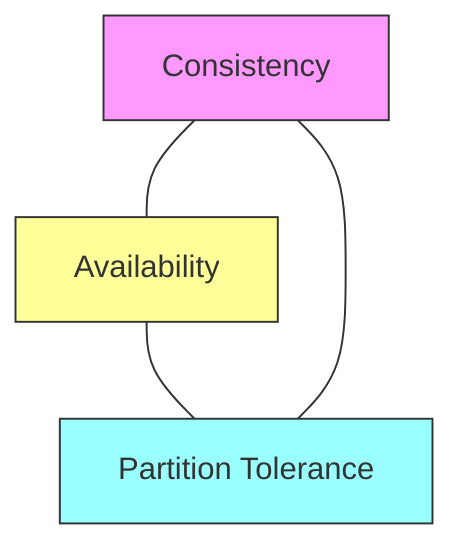

# System Design Interview Questions & Answers (100+)

This guide contains 100+ System Design interview questions, ranging from core concepts to complex distributed system scenarios. Each question includes a model answer and potential follow-up paths based on the candidate's response.

## Part 1: Core Concepts (1-25)

### 1. What is the difference between Vertical Scaling and Horizontal Scaling?

| Feature | Vertical Scaling (Scale Up) | Horizontal Scaling (Scale Out) |
| :--- | :--- | :--- |
| **Definition** | Adding more power (CPU, RAM) to an existing machine. | Adding more machines to the resource pool. |
| **Limit** | Hard limit based on hardware capacity. | Theoretically infinite (constrained by software/network). |
| **Downtime** | Usually requires downtime to upgrade. | No downtime (add nodes dynamically). |
| **Complexity** | Low (no distributed logic). | High (requires load balancing, consistency mgmt). |

**Candidate Response Paths:**

*   **Path A: Candidate mentions Cost.**
    *   *Follow-up:* "At what point does vertical scaling become more expensive than horizontal?"
    *   *Answer:* Specialized high-end hardware follows a non-linear price curve. Two medium servers are often cheaper than one super-server.
*   **Path B: Candidate focuses on Databases.**
    *   *Follow-up:* "Why is it harder to horizontally scale a traditional SQL database?"
    *   *Answer:* ACID compliance and JOINS are difficult to maintain across distributed nodes.

### 2. Explain Load Balancing (L4 vs L7).

A Load Balancer distributes incoming network traffic across a group of backend servers.

*   **Layer 4 (Transport Layer):** Routes traffic based on IP address and Port (TCP/UDP). It is packet-level load balancing.
*   **Layer 7 (Application Layer):** Routes traffic based on content (URL, Cookies, Headers). It is request-level load balancing.

**Candidate Response Paths:**

*   **Path A: Performance.**
    *   *Follow-up:* "Which is faster, L4 or L7?"
    *   *Answer:* L4 is faster because it doesn't need to decrypt/inspect the payload.
*   **Path B: Security.**
    *   *Follow-up:* "Why is L7 better for security?"
    *   *Answer:* It can inspect traffic for SQL injection, terminate SSL, and implement smarter rate limiting.

### 3. What is the CAP Theorem?

In a distributed data store, you can strictly provide only two of the three guarantees:

1.  **Consistency:** Every read receives the most recent write or an error.
2.  **Availability:** Every request receives a (non-error) response, without the guarantee that it contains the most recent write.
3.  **Partition Tolerance:** The system continues to operate despite an arbitrary number of messages being dropped or delayed by the network.

**Candidate Response Paths:**

*   **Path A: "I choose CA".**
    *   *Follow-up:* "Can a distributed system actually be CA?"
    *   *Answer:* No. In a distributed system, network partitions *will* happen. You effectively choose between CP (stop serving requests) or AP (serve stale data) when a partition occurs.

### 4. Compare ACID vs BASE models.

*   **ACID (Relational DBs):** Atomicity, Consistency, Isolation, Durability. Focuses on strict data integrity.
*   **BASE (NoSQL DBs):**
    *   **B**asically **A**vailable: System guarantees availability.
    *   **S**oft state: State may change over time, even without input.
    *   **E**ventual consistency: System will become consistent over time.

### 5. What are the common Caching Strategies?

1.  **Cache Aside (Lazy Loading):** App checks cache. If miss, reads DB, writes to cache.
2.  **Read-Through:** App asks cache. Cache fetches from DB if miss.
3.  **Write-Through:** App writes to cache and DB synchronously.
4.  **Write-Back (Write-Behind):** App writes to cache. Cache writes to DB asynchronously.

**Candidate Response Paths:**

*   **Path A: Write-Back.**
    *   *Follow-up:* "What is the major risk of Write-Back?"
    *   *Answer:* Data loss if the cache crashes before flushing data to the persistent DB.

### 6. What is a CDN (Content Delivery Network)?

A network of geographically distributed servers that deliver static content (images, CSS, JS, videos) to users based on their location.

**Candidate Response Paths:**

*   **Path A: Push vs Pull.**
    *   *Follow-up:* "How does the CDN get the content?"
    *   *Answer:* **Push:** You upload to CDN. **Pull:** CDN fetches from Origin on first request (cache miss).

### 7. Stateless vs Stateful Architecture?

*   **Stateless:** Server retains no client information between requests. Every request must contain all necessary info (e.g., JWT). Scales easily.
*   **Stateful:** Server remembers client data (Session ID) from previous requests. Harder to scale horizontally (requires Sticky Sessions).

### 8. Latency vs Throughput?

*   **Latency:** Time taken to process a single request (Speed).
*   **Throughput:** Number of requests processed per unit time (Capacity).

**Analogy:**
*   *Latency:* How fast a car drives.
*   *Throughput:* How many cars pass a point per hour.

### 9. What are common Availability Patterns?

1.  **Fail-over:**
    *   *Active-Passive:* Heartbeat sends signal. If Active dies, Passive takes over.
    *   *Active-Active:* Both handle traffic.
2.  **Replication:** Master-Slave, Master-Master.

### 10. How does DNS Resolution work?

1.  Browser checks local cache.
2.  OS checks `hosts` file.
3.  Query sent to **Recursive Resolver** (ISP).
4.  Resolver queries **Root Server** (.) -> **TLD Server** (.com) -> **Authoritative Name Server** (example.com).
5.  IP returned to browser.

### 11. What is Consistent Hashing?

A technique to distribute data across nodes in a way that minimizes reorganization when nodes are added or removed.
Instead of `hash(key) % N`, it maps keys and nodes to a "Ring" (0 to 2^32).

**Candidate Response Paths:**

*   **Path A: Hotspots.**
    *   *Follow-up:* "What if one node is very powerful or gets too much data?"
    *   *Answer:* Use "Virtual Nodes" (vnodes). Map one physical node to multiple points on the ring.

### 12. Forward Proxy vs Reverse Proxy?

*   **Forward Proxy:** Sit before the *Client*. Masks the Client ID. (e.g., VPN, Corporate Filter).
*   **Reverse Proxy:** Sit before the *Server*. Masks the Server ID. (e.g., Nginx, Load Balancer).

### 13. Polling vs WebSockets vs Server-Sent Events (SSE).

| Feature | Polling (Short/Long) | WebSockets | SSE |
| :--- | :--- | :--- | :--- |
| **Direction** | Client -> Server | Bidirectional | Server -> Client |
| **Connection** | New connection per request (Short) | Persistent TCP | Persistent HTTP |
| **Use Case** | Dashboards, low frequency | Chat, Gaming | News feeds, Stock Tickers |

### 14. LSM Tree vs B-Tree (Database Indexing).

*   **B-Tree:** (Used in SQL) Optimized for Reads. Data stored in sorted pages. Update in-place.
*   **LSM (Log-Structured Merge):** (Used in Cassandra, Kafka) Optimized for Writes. Appends to log, merges in background.

### 15. What are common Rate Limiting Algorithms?

1.  **Token Bucket:** Tokens added at rate `r`. Request consumes token. (Allows Bursts).
2.  **Leaky Bucket:** Requests enter queue, processed at constant rate. (Smooths traffic).
3.  **Fixed Window Counter:** Counter resets every minute. (Edge case: double bursts at boundary).
4.  **Sliding Window Log:** Precise, stores timestamps. (High memory).
5.  **Sliding Window Counter:** Hybrid approach.

### 16. Strong vs Eventual Consistency?

*   **Strong:** After a write, any subsequent read returns the new value. (High Latency).
*   **Eventual:** After a write, reads may return old value for a "window of inconsistency". (Low Latency).

### 17. What is a Heartbeat?

A periodic signal sent by a component to indicate it is alive and functioning. Used in Fail-over mechanisms.

### 18. What is a Checksum?

A small-sized datum derived from a block of digital data for the purpose of detecting errors that may have been introduced during its transmission or storage.

### 19. What is a Bloom Filter?

A probabilistic data structure used to test whether an element is a member of a set.
*   Returns either "Possibly in set" or "Definitely not in set".
*   Never returns False Negative. Can return False Positive.
*   *Use Case:* Checking if a username is taken before hitting the DB.

### 20. What is Quorum?

The minimum number of votes that a distributed transaction has to obtain to be allowed to perform an operation in a distributed system.
*   `R + W > N` (Read nodes + Write nodes > Total nodes) guarantees strong consistency.

### 21. How does Leader Election work?

Process of designating a single process as the organizer of some task among several computers (nodes).
*   **Algorithms:** Paxos, Raft, Zookeeper (ZAB).

### 22. What is Idempotency?

An operation is idempotent if applying it multiple times has the same effect as applying it once.
*   `POST` is generally NOT idempotent.
*   `PUT` and `DELETE` ARE idempotent.
*   *Implementation:* Use a unique "Idempotency Key" in request headers.

### 23. What is Long-Polling?

1.  Client sends request.
2.  Server holds request open until data is available.
3.  Server sends response.
4.  Client immediately sends new request.

### 24. Peer-to-Peer (P2P) Networks?

Decentralized network where each node acts as both client and server (peer).
*   *Pros:* High availability, no single point of failure.
*   *Cons:* Security, slower discovery (Gossip protocol).

### 25. What is Service Discovery?

How microservices locate each other on a network (IP + Port).
*   **Client-Side:** Client queries Service Registry (Netflix Eureka), then calls service.
*   **Server-Side:** Client calls Load Balancer (AWS ELB), LB queries Registry.

## Part 2: Distributed Systems & Data (26-50)

### 26. What is Database Partitioning (Sharding)?

Breaking up a large database into smaller, more manageable parts called shards.

**Methods:**
1.  **Horizontal Sharding:** Rows split by key (e.g., UserID 1-1000 in DB1).
2.  **Vertical Sharding:** Columns split by feature (e.g., User Profile in DB1, User Photos in DB2).
3.  **Directory Based:** Lookup table knows where data is.

**Candidate Response Paths:**

*   **Path A: Cross-shard joins.**
    *   *Follow-up:* "How do you handle a query that needs data from multiple shards?"
    *   *Answer:* Perform application-level joins or de-normalize data to avoid the join.

### 27. Master-Slave vs Master-Master Replication?

*   **Master-Slave:** Writes go to Master. Reads go to Slaves.
    *   *Pros:* Simple. Strong consistency on Master.
    *   *Cons:* Master is SPOF for writes. Replication lag.
*   **Master-Master:** Writes go to any Master.
    *   *Pros:* High availability for writes.
    *   *Cons:* Write conflicts (Split Brain). Complexity.

### 28. What is the Two-Phase Commit (2PC)?

A distributed algorithm that coordinates all the processes that participate in a distributed atomic transaction on whether to commit or abort (roll back) the transaction.

1.  **Prepare Phase:** Coordinator asks "Can you commit?". Nodes lock resources and say "Yes".
2.  **Commit Phase:** If all "Yes", Coordinator says "Commit". Else "Rollback".

*   *Downside:* Blocking protocol. Slow.

### 29. What is Saga Pattern?

A sequence of local transactions. Each local transaction updates the database and publishes an event or message to trigger the next local transaction in the saga.
*   **Compensation:** If a step fails, execute compensating transactions to undo changes.

### 30. Explain "Split Brain" in distributed systems.

A condition where the network partitions, and two nodes both believe they are the Master/Leader. They both accept writes, leading to data corruption/divergence.
*   *Solution:* Quorum (Majority vote).

### 31. Row-Oriented vs Column-Oriented Databases?

*   **Row-Oriented (Postgres, MySQL):** Stores data by row. Efficient for writing/reading whole records (OLTP).
*   **Column-Oriented (Redshift, Cassandra):** Stores data by column. Efficient for aggregating specific columns over many rows (OLAP).

### 32. What is NoSQL? Types of NoSQL databases?

Non-relational databases. Scalable, flexible schemas.

1.  **Key-Value:** Redis, DynamoDB. (Fast, simple).
2.  **Document:** MongoDB, CouchDB. (JSON-like, flexible).
3.  **Column-Family:** Cassandra, HBase. (Write heavy, massive scale).
4.  **Graph:** Neo4j. (Relations, Friends).

### 33. When to use Cassandra?

*   Heavy Write throughput.
*   Need linear horizontal scalability.
*   Can tolerate eventual consistency.
*   Don't need complex JOINS.

### 34. How does Redis persist data?

1.  **RDB (Snapshotting):** Saves point-in-time snapshots of dataset at intervals. (Fast restart, data loss possible).
2.  **AOF (Append Only File):** Logs every write operation. (Slower restart, higher durability).

### 35. What is a "Thundering Herd" problem?

A large number of processes/users waiting for an event occur simultaneously when the event happens (e.g., Cache Expiry). They all hit the database at once, crashing it.
*   *Solution:* Stagger expiration times (Jitter) or use a "Mutex" to let only one populate the cache.

### 36. What is "Backpressure"?

A feedback mechanism in data flow. If the consumer cannot keep up with the producer, it signals the producer to slow down.
*   *Without Backpressure:* Consumer runs out of memory (OOM) buffering incoming data.

### 37. What is the difference between `PUT` and `PATCH`?

*   `PUT`: Replaces the *entire* resource. (Idempotent).
*   `PATCH`: Applies a *partial* update to the resource. (Not necessarily idempotent).

### 38. What is "Database Federation"?

Splitting data by function across multiple distinct databases (e.g., Forum DB, User DB, Product DB).
*   *Pros:* Less coupling.
*   *Cons:* No cross-DB joins.

### 39. Explain "Gossip Protocol".

A peer-to-peer communication protocol where nodes periodically exchange state information with random other nodes. Info spreads like a virus (epidemic).
*   Used in Cassandra/Dynamo for cluster state management.

### 40. What is a "Dead Letter Queue" (DLQ)?

A service implementation to store messages that meet one or more of the following criteria:
1.  Message that cannot be delivered.
2.  Message processing failed N times.
*   Allows debugging of bad messages without blocking the main queue.

### 41. What is "Geohashing"?

A system for encoding a geographic location into a short string of letters and digits.
*   Grid-based.
*   Shared prefix indicates proximity.
*   *Use Case:* Yelp, Uber (Find nearby).

### 42. What is QuadTree?

A tree data structure where each internal node has exactly four children. Used to partition a two-dimensional space.
*   *Use Case:* Spatial indexing. Better than Geohash for non-uniform distribution of points.

### 43. Pull vs Push models in Monitoring/Metrics?

*   **Push (StatsD, Telegraf):** App sends metrics to collector.
    *   *Pros:* App controls frequency. Short-lived jobs supported.
*   **Pull (Prometheus):** Collector scrapes metrics endpoint on App.
    *   *Pros:* Central control. App doesn't need to know destination.

### 44. What is a "Circuit Breaker"?

A design pattern used to detect failures and encapsulate the logic of preventing a failure from constantly recurring.
*   **Closed:** Requests pass through.
*   **Open:** Requests fail immediately (after threshold of errors).
*   **Half-Open:** Allow test request. If success, Close.

### 45. What is "Message Acknowledgment"?

Ensures delivery.
*   **At-most-once:** Fire and forget.
*   **At-least-once:** Retry until Ack received. (Consumer must handle duplicates).
*   **Exactly-once:** Hardest to achieve (Kafka transactions).

### 46. What is "Compensating Transaction"?

In a distributed transaction (Saga), a transaction that undoes the effect of a previous transaction that had committed. (e.g., Refund money if Order fails).

### 47. Explain "Isolation Levels" in context of Distributed Systems.

*   **Read Uncommitted**
*   **Read Committed**
*   **Repeatable Read**
*   **Serializable**
*   *Snapshot Isolation:* Reads see a consistent snapshot of the DB from start of transaction.

### 48. What is "HyperLogLog"?

A probabilistic data structure used for estimating the cardinality (count of unique items) of a set.
*   Uses very little memory compared to storing all unique IDs.
*   *Use Case:* Count unique daily visitors (100M+).

### 49. What is "Tombstone" in deletion?

In systems like Cassandra (LSM), you cannot physically delete a row immediately (immutable files).
Instead, you write a "Tombstone" marker. The data is actually removed during Compaction.

### 50. File Storage vs Block Storage vs Object Storage?

| Type | Access | Example | Use Case |
| :--- | :--- | :--- | :--- |
| **Block** | Low-level blocks via OS (Fast) | AWS EBS, HDD | Databases, OS Boot |
| **File** | Hierarchical files (Shared) | AWS EFS, NAS | Shared directories |
| **Object** | API (HTTP), Metadata heavy | AWS S3 | Images, Backups, Static Web |

## Part 3: Architecture Patterns & Components (51-75)

### 51. Microservices vs Monolith?

*   **Monolith:** Single codebase, single build, single deployment.
    *   *Pros:* Simple to develop/test/deploy initially. Fast internal calls.
    *   *Cons:* Tight coupling. Hard to scale specific parts. Long build times.
*   **Microservices:** Collection of small, independent services communicating via APIs.
    *   *Pros:* Loose coupling. Scale independently. Technology agnostic.
    *   *Cons:* Complexity of distributed system. Network latency. Data consistency.

### 52. REST vs GraphQL vs gRPC?

| Feature | REST | GraphQL | gRPC |
| :--- | :--- | :--- | :--- |
| **Protocol** | HTTP/1.1 | HTTP/1.1 or 2 | HTTP/2 |
| **Data Format** | JSON (usually) | JSON | Protobuf (Binary) |
| **Fetching** | Over-fetching / Under-fetching | Exact fetching | - |
| **Use Case** | Public APIs, Simple | Complex Client Data Needs | Internal Microservices |

### 53. What is an API Gateway?

A server that acts as an entry point for a system, sitting between clients and microservices.
*   **Responsibilities:** Routing, Authentication, Rate Limiting, SSL Termination, Caching.

### 54. What is "Service Mesh"?

A dedicated infrastructure layer for handling service-to-service communication. (e.g., Istio, Linkerd).
*   **Sidecar Pattern:** A proxy container sits next to every service instance to handle network logic.

### 55. What is the Sidecar Pattern?

Attaching a secondary component (sidecar) to the primary application to provide support features (logging, proxying, monitoring) without changing the app code.

### 56. What is "Event Sourcing"?

Storing the state of a system as a sequence of events (e.g., "AccountCreated", "MoneyDeposited") rather than just the current state (Balance=100).
*   *Pros:* Audit trail, ability to replay history.
*   *Cons:* Complexity, Event schema evolution.

### 57. CQRS (Command Query Responsibility Segregation)?

Separating the Read (Query) and Write (Command) models.
*   **Write Model:** Optimized for updates (Normalized).
*   **Read Model:** Optimized for reading (Denormalized/Views).
*   Often paired with Event Sourcing.

### 58. What is "Strangler Fig Pattern"?

A migration pattern to modernize a Monolith.
1.  Put a Proxy/Gateway in front of Monolith.
2.  Route specific traffic to new Microservices.
3.  Slowly "strangle" the Monolith until it's gone.

### 59. Explain OAuth 2.0.

An authorization framework.
*   **Roles:** Resource Owner (User), Client (App), Authorization Server, Resource Server (API).
*   **Flows:** Authorization Code (Servers), Implicit (Browser/Mobile - deprecated), Client Credentials (Machine-to-Machine).

### 60. What is JWT (JSON Web Token)?

A compact, URL-safe means of representing claims to be transferred between two parties.
*   **Structure:** Header . Payload . Signature
*   *Stateless:* Server verifies signature, doesn't need to look up session in DB.

### 61. Symmetric vs Asymmetric Encryption?

*   **Symmetric:** Same key for encryption and decryption. (Fast).
*   **Asymmetric:** Public Key encrypts, Private Key decrypts. (Secure exchange, slower).
*   *HTTPS:* Uses Asymmetric to exchange a Symmetric key, then uses Symmetric for data.

### 62. What is SSL/TLS Handshake?

1.  Client Hello (I support TLS 1.2, Cipher Suites).
2.  Server Hello (Let's use TLS 1.2).
3.  Server sends Certificate (Public Key).
4.  Client verifies Certificate with CA.
5.  Client generates Session Key, encrypts with Server's Public Key, sends to Server.
6.  Server decrypts with Private Key. Secure channel established.

### 63. What is "Dependency Injection"?

A design pattern where an object receives other objects that it depends on (dependencies) from an external source rather than creating them itself.
*   Decouples code. Makes testing easier (mocking).

### 64. What is Docker vs Kubernetes?

*   **Docker:** Containerization platform. Packages app + libs into a portable container.
*   **Kubernetes (K8s):** Container Orchestration. Manages deployment, scaling, and networking of containers.

### 65. What is "Blue/Green Deployment"?

Run two identical environments.
*   **Blue:** Live.
*   **Green:** New version (Idle).
*   Switch Router from Blue to Green.
*   *Pros:* Instant rollback.

### 66. What is "Canary Deployment"?

Roll out the update to a small subset of users (Canaries) first. Monitor for errors. If safe, roll out to the rest.

### 67. What is "Serverless" (FaaS)?

Cloud computing model where the cloud provider dynamically manages the allocation of machine resources. (AWS Lambda).
*   *Pros:* Pay per execution. No server management.
*   *Cons:* Cold starts. Vendor lock-in.

### 68. What is "Publisher/Subscriber" (Pub/Sub) pattern?

Messaging pattern where Senders (Publishers) do not program the messages to be sent directly to specific Receivers (Subscribers). Instead, messages are categorized.
*   Decouples components.

### 69. RabbitMQ vs Kafka?

*   **RabbitMQ:** Traditional Message Broker. Smart Broker / Dumb Consumer. Good for complex routing logic. Messages removed after ack.
*   **Kafka:** Distributed Event Streaming. Dumb Broker / Smart Consumer. High throughput. Messages persisted on disk for retention period.

### 70. What is "Batch Processing" vs "Stream Processing"?

*   **Batch:** Process a large volume of data all at once (e.g., Daily Hadoop job). High Latency.
*   **Stream:** Process data item by item as it arrives (e.g., Flink, Spark Streaming). Real-time.

### 71. What is a "Reverse Index" (Inverted Index)?

Maps content (words) to its location (documents).
*   *Use Case:* Search Engines (Elasticsearch). "Apple" -> [Doc1, Doc3].

### 72. Explain "MapReduce".

Programming model for processing large data sets.
1.  **Map:** Filter and sort data.
2.  **Reduce:** Aggregate the data.

### 73. What is "Data Lake" vs "Data Warehouse"?

*   **Data Lake (S3):** Stores raw, unstructured data. Low cost. Schema-on-Read.
*   **Data Warehouse (Snowflake):** Stores processed, structured data. High cost. Schema-on-Write.

### 74. What is "ETL"?

Extract, Transform, Load.
*   Process of moving data from source systems to a Data Warehouse.

### 75. What is "Distributed Tracing"?

A method used to profile and monitor applications, especially those built using a microservices architecture.
*   Assigns a unique Request ID (Trace ID) at ingress and propagates it through all services. (Jaeger, Zipkin).

## Part 4: System Design Scenarios (76-100)

### 76. Design a URL Shortener (TinyURL).

*   **Core Req:** Shorten long URL, Redirect short to long. High Read/Write ratio (100:1).
*   **Capacity:** 1B new URLs/month. Storage: 500 bytes per URL = 500GB/month. 5 Years = 30TB.
*   **Key Idea:** Base62 Encoding. 7 chars = $62^7$ = 3.5 Trillion combinations.
*   **DB:** K-V Store (DynamoDB).
*   **Collision:** Pre-generate keys (Key Generation Service) to avoid DB lock.

### 77. Design a Chat System (WhatsApp).

*   **Core Req:** 1-on-1 chat, Group chat, Online status.
*   **Protocol:** WebSockets or XMPP (legacy).
*   **Storage:** HBase or Cassandra (Write heavy).
*   **Flow:** User A -> Gateway -> Chat Server -> User B.
*   **Unread:** If User B offline, store in Push Notification Queue.

### 78. Design Instagram (News Feed).

*   **Core Req:** Upload photos, Follow users, Generate Feed.
*   **Feed Generation:**
    *   *Pull Model:* Query DB for all followings on load. (Slow).
    *   *Push Model (Fan-out on Write):* When User A posts, push ID to all followers' pre-computed feed cache. (Fast reads).
*   **Storage:** S3 for Images. SQL/NoSQL for Metadata.

### 79. Design Rate Limiter.

*   **Placement:** API Gateway or Sidecar.
*   **Storage:** Redis (Sorted Sets or Counters) because it's fast.
*   **Algorithm:** Token Bucket or Sliding Window.
*   **Distributed:** Use Lua scripts in Redis for atomicity.

### 80. Design YouTube (Video Streaming).

*   **Core Req:** Upload, Transcode, Stream.
*   **Upload:** Split video into chunks. Upload to S3.
*   **Processing:** Lambda/Worker Queue to Transcode into multiple formats (720p, 1080p) and codecs (H.264, VP9).
*   **Streaming:** DASH or HLS protocols. Adaptive Bitrate Streaming (switch quality based on bandwidth).
*   **CDN:** Critical for serving chunks.

### 81. Design Typeahead Suggestion (Google Search).

*   **Data Structure:** Trie (Prefix Tree).
*   **Optimization:** Store top 5 popular queries at each Trie node.
*   **Storage:** In-memory (Redis) or custom implementation.
*   **Update:** Asynchronously update weights based on logs.

### 82. Design a Web Crawler.

*   **Components:**
    *   *Seed URLs:* Starting point.
    *   *URL Frontier:* Priority Queue of URLs to visit.
    *   *Fetcher:* Downloads HTML.
    *   *Parser:* Extracts links.
    *   *Dedup:* Checksum/Bloom Filter to avoid cycles/duplicates.
*   **Politeness:** Respect `robots.txt` and rate limits.

### 83. Design Notification System.

*   **Inputs:** Email, SMS, Push.
*   **Components:**
    *   *Notification Service:* Receives requests.
    *   *Queue:* Buffers requests (RabbitMQ).
    *   *Workers:* Call 3rd party providers (SendGrid, Twilio, APNS).
*   **Reliability:** Retry mechanism for failed calls.

### 84. Design Dropbox (File Sync).

*   **Chunking:** Split files into 4MB chunks. Only upload changed chunks (Differential Sync).
*   **Hashing:** Hash each chunk. Deduplication (if another user has same chunk, just point to it).
*   **Client:** Watcher process detects FS changes.
*   **Metadata DB:** Strong consistency (ACID) required for file namespace.

### 85. Design Twitter Search.

*   **Challenge:** Real-time indexing.
*   **Solution:** EarlyBird (Twitter's internal).
*   **Architecture:** Ingest Tweets -> Tokenize -> Write to In-Memory Shards (based on Tweet ID or Time).
*   **Query:** Scatter-Gather to all shards -> Merge results.

### 86. Design Uber (Ride Sharing).

*   **Core Req:** Match Rider with nearby Driver.
*   **Location:** Drivers send GPS every 3s.
*   **Geo-Index:** Geohash or S2 Geometry. Redis GEO commands.
*   **Matching:** Search nearby drivers in Redis. Lock driver. Send request.

### 87. Design Ticketmaster (Booking System).

*   **Challenge:** Concurrency. 10,000 users want the same seat.
*   **Locking:**
    *   *Optimistic:* User selects seat. On checkout, check if still available.
    *   *Pessimistic:* Lock seat for 10 mins when selected. Release if timeout. (Better UX).
*   **Queue:** Virtual Waiting Room if traffic > capacity.

### 88. Design Unique ID Generator (Snowflake).

*   **Req:** Unique, Numerical, Time-sortable, High throughput.
*   **Twitter Snowflake:** 64-bit Integer.
    *   1 bit: Sign.
    *   41 bits: Timestamp (millis).
    *   10 bits: Machine ID (Datacenter + Worker).
    *   12 bits: Sequence Number (per millisecond).

### 89. Design Key-Value Store (like DynamoDB).

*   **Partitioning:** Consistent Hashing.
*   **Replication:** Preference List (Top N nodes in ring).
*   **Consistency:** Tunable (W + R > N). Vector Clocks for versioning.
*   **Gossip:** For node membership.

### 90. Design Metrics Monitoring System (Datadog).

*   **Write Heavy:** Time Series Database (TSDB) like InfluxDB or Prometheus (internally Whisper/TSDB).
*   **Data Model:** Metric Name, Tags (Host, Region), Timestamp, Value.
*   **Downsampling:** Keep raw data for 7 days. Roll up to 1-min avg for 30 days. 1-hour avg for 1 year.

### 91. Design Leaderboard.

*   **Real-time:** Redis `Sorted Sets` (ZSET).
    *   `ZADD leaderboard <score> <user>`
    *   `ZREVRANGE leaderboard 0 9` (Top 10).
*   **Scale:** Shard by range of scores if too big? No, shard by UserID to update score, use Gatherer to merge top lists.

### 92. Design Payment System.

*   **Critical:** ACID, Idempotency, Audit Logs.
*   **Reconciliation:** Asynchronous process to compare DB records with Bank Statements.
*   **Double Entry Ledger:** Every transaction has a Debit and Credit. Sum must be zero.

### 93. Design a URL Crawler Cache/Proxy.

*   **Req:** Save bandwidth.
*   **Hashing:** Hash(URL) -> File Path.
*   **Expiry:** Check HTTP Headers (Cache-Control, ETag).

### 94. Design Amazon Shopping Cart.

*   **Availability:** Must never fail to add item.
*   **Consistency:** Eventual.
*   **Conflict:** Merging carts from different devices (Session vs Logged In). DynamoDB was built for this (Shopping Cart anomaly).

### 95. Design 'Nearby Friends'.

*   **Updates:** Sparse updates (only when moving significant distance).
*   **P2P:** Not viable for mobile.
*   **Server:** Ephemeral location history. Redis Geo.

### 96. Design Distributed Job Scheduler.

*   **Coordination:** Zookeeper/Etcd to elect Leader.
*   **Storage:** Tasks in DB.
*   **Execution:** Workers poll or Leader pushes to Kafka.
*   **Ack:** Worker acks upon completion. If timeout, re-queue.

### 97. Design 'Who Viewed Your Profile'.

*   **Volume:** High write volume.
*   **Async:** Push event to Kafka. Consumer aggregates in batch.
*   **Storage:** NoSQL (Wide Column). Key: `ProfileOwner_Date`, Col: `ViewerID`.

### 98. Design Collaborative Editor (Google Docs).

*   **Algorithm:** Operational Transformation (OT) or CRDT (Conflict-free Replicated Data Type).
*   **Communication:** WebSockets for real-time chars.

### 99. Design API Rate Limiter (Distributed).

*   **Problem:** Syncing counters across nodes is slow.
*   **Solution:** Sticky Sessions (Local memory) OR Redis (Centralized, but latency penalty). OR "Gossip" limit (approximate).

### 100. Design a Proximity Service (Yelp).

*   **Read/Write:** High Read (Search), Low Write (Business moves).
*   **Index:** Static QuadTree. Store in SQL or NoSQL.
*   **Search:** Find QuadTree node, search it + 8 neighbors.

---
**End of System Design Questions**
