# Interview Questions: Backend Engineer (SWEN1002)

This document contains 100 interview questions tailored for the Backend Engineer role. The questions are categorized into five key areas: System Design, Database Management, API Development, Security, and General/Behavioral.

Each question includes rich formatting and candidate response paths to help evaluate depth of knowledge.

---

## 1. Scalability (System Design)

**Scenario:** Focus on horizontal scaling, load balancers, and caching.

**Question:** How would you design a system to handle 1 million concurrent users?

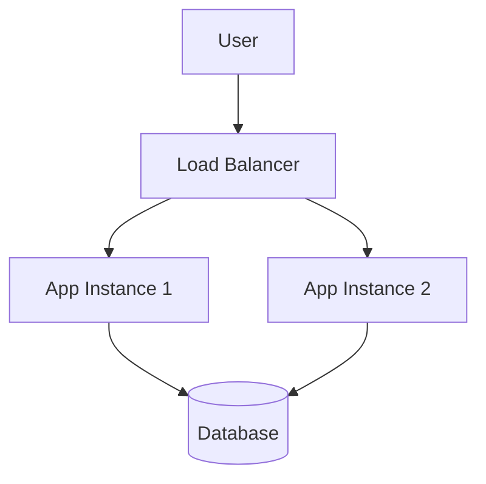

**Key Concepts:** `Distributed Systems`, `Architecture`

### Candidate Response Paths
*   **Junior**: Suggests bigger servers (Vertical Scaling).
*   **Senior**: Suggests horizontal scaling, sharding, and caching layers.

---

## 2. Caching Strategies (System Design)

**Scenario:** Discuss trade-offs between consistency and latency.

**Question:** Explain different caching strategies (Write-through, Write-back, Cache-aside).

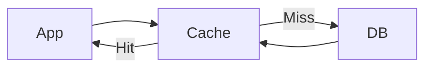

**Key Concepts:** `Distributed Systems`, `Architecture`

### Candidate Response Paths
*   **Junior**: Mentions caching everything.
*   **Senior**: Discusses cache invalidation challenges.

---

## 3. Microservices vs Monolith (System Design)

**Scenario:** Discuss complexity, team size, and deployment overhead.

**Question:** When would you choose a Monolith over Microservices?

| Feature | Monolith | Microservices |
|---|---|---|
| Deploy | Single Artifact | Multiple |
| Scale | All or nothing | Granular |

**Key Concepts:** `Distributed Systems`, `Architecture`

### Candidate Response Paths
*   **Junior**: Says Microservices are always better.
*   **Senior**: Recognizes overhead of Microservices for small teams.

---

## 4. Load Balancing (System Design)

**Scenario:** Explain inspection of data packets vs simply forwarding based on IP.

**Question:** Compare Layer 4 vs Layer 7 Load Balancing.

| Layer | Data | Example |
|---|---|---|
| L4 | IP/Port | HAProxy (TCP) |
| L7 | HTTP Headers | Nginx |

**Key Concepts:** `Distributed Systems`, `Architecture`

### Candidate Response Paths
*   **Junior**: Only knows 'Round Robin'.
*   **Senior**: Discusses Sticky Sessions and Path-based routing.

---

## 5. Message Queues (System Design)

**Scenario:** Discuss idempotency and consumer offsets.

**Question:** How do you ensure message delivery guarantees (At-least-once, Exactly-once) in Kafka?

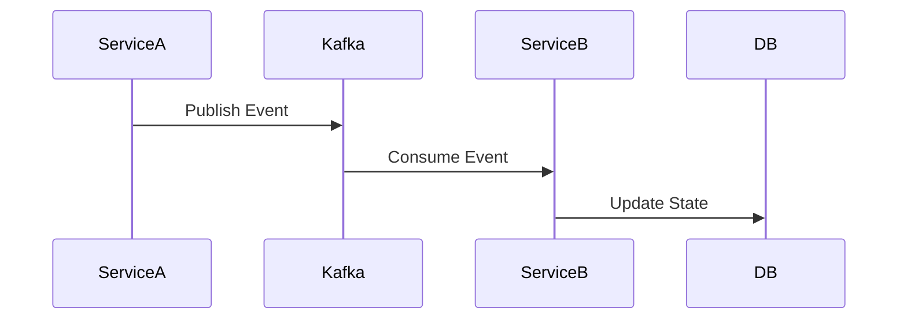

**Key Concepts:** `Distributed Systems`, `Architecture`

### Candidate Response Paths
*   **Junior**: Assumes messages are never lost.
*   **Senior**: Discusses Idempotency keys and Offset management.

---

## 6. Database Sharding (System Design)

**Scenario:** Discuss re-balancing, cross-shard joins, and complexity.

**Question:** What are the risks associated with Database Sharding?

| Strategy | Pros | Cons |
|---|---|---|
| Range | Simple | Hotspots |
| Hash | Even Distribution | Resharding Pain |

**Key Concepts:** `Distributed Systems`, `Architecture`

### Candidate Response Paths
*   **Junior**: Focuses only on performance gains.
*   **Senior**: Highlights the difficulty of Cross-shard joins.

---

## 7. CAP Theorem (System Design)

**Scenario:** Why CP is preferred over AP for payments.

**Question:** Explain the CAP theorem in the context of a distributed payment system.

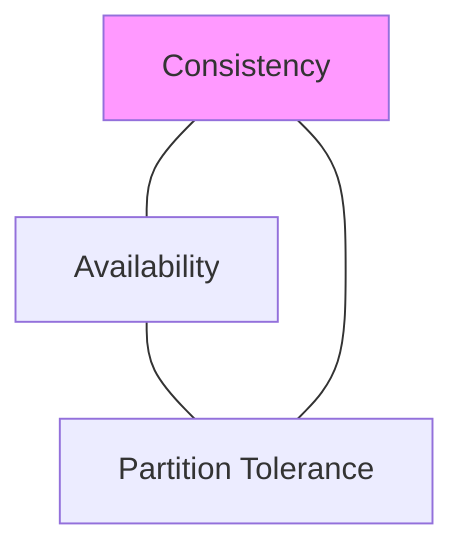

**Key Concepts:** `Distributed Systems`, `Architecture`

### Candidate Response Paths
*   **Junior**: Recites definitions.
*   **Senior**: Explains why you can't have CA in distributed systems.

---

## 8. Rate Limiting (System Design)

**Scenario:** Discuss algorithms like Token Bucket vs Leaky Bucket.

**Question:** Design a rate limiter.

| Algorithm | Pros | Cons |
|---|---|---|
| Token Bucket | Bursts allowed | Complex |
| Fixed Window | Simple | Edge cases |

**Key Concepts:** `Distributed Systems`, `Architecture`

### Candidate Response Paths
*   **Junior**: Uses a simple counter.
*   **Senior**: Discusses Redis based distributed rate limiting.

---

## 9. Consistent Hashing (System Design)

**Scenario:** Minimizing cache misses during node addition/removal.

**Question:** Why is consistent hashing important for distributed caching?

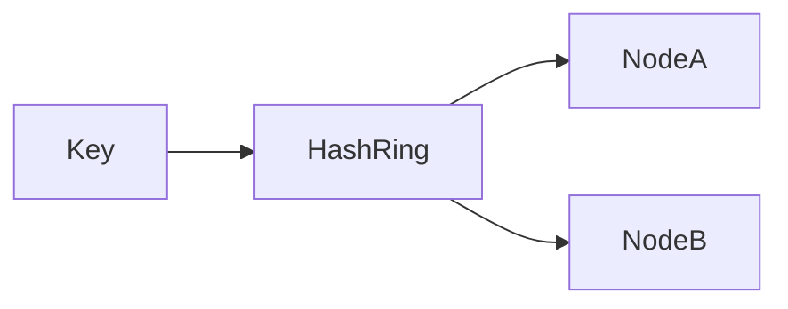

**Key Concepts:** `Distributed Systems`, `Architecture`

### Candidate Response Paths
*   **Junior**: Unsure.
*   **Senior**: Explains minimal key remapping.

---

## 10. Event Sourcing (System Design)

**Scenario:** Audit trails vs complexity of replaying events.

**Question:** What are the benefits and drawbacks of Event Sourcing?

| Aspect | CRUD | Event Sourcing |
|---|---|---|
| State | Current only | History of changes |
| Complexity | Low | High |

**Key Concepts:** `Distributed Systems`, `Architecture`

### Candidate Response Paths
*   **Junior**: Never heard of it.
*   **Senior**: Mentions CQRS pattern alongside it.

---

## 11. Circuit Breaker (System Design)

**Scenario:** Fail fast mechanism.

**Question:** How does a Circuit Breaker pattern prevent cascading failures?

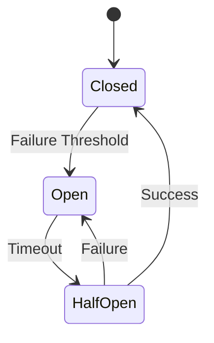

**Key Concepts:** `Distributed Systems`, `Architecture`

### Candidate Response Paths
*   **Junior**: It stops requests.
*   **Senior**: Discusses fallback mechanisms and self-healing.

---

## 12. Service Discovery (System Design)

**Scenario:** DNS vs Sidecars.

**Question:** How do services find each other in a dynamic environment (Kubernetes)?

| Method | Description |
|---|---|
| Server-side | LB handles routing |
| Client-side | Client queries registry |

**Key Concepts:** `Distributed Systems`, `Architecture`

### Candidate Response Paths
*   **Junior**: Hardcoded IPs.
*   **Senior**: DNS, Consul, or K8s Services.

---

## 13. API Gateway (System Design)

**Scenario:** Aggregation, Auth, Rate Limiting.

**Question:** What is the role of an API Gateway in microservices?

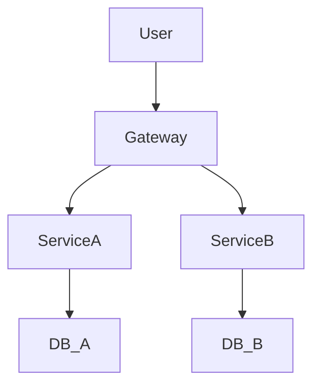

**Key Concepts:** `Distributed Systems`, `Architecture`

### Candidate Response Paths
*   **Junior**: Just a proxy.
*   **Senior**: Cross-cutting concerns like Auth, Logging, Throttling.

---

## 14. Distributed Transactions (System Design)

**Scenario:** Saga Pattern vs 2PC.

**Question:** How do you handle transactions across multiple services?

| Pattern | ACID? | Performance |
|---|---|---|
| 2PC | Yes | Slow (Blocking) |
| Saga | Eventual | Fast |

**Key Concepts:** `Distributed Systems`, `Architecture`

### Candidate Response Paths
*   **Junior**: Use one big database.
*   **Senior**: Orchestration vs Choreography Sagas.

---

## 15. Idempotency (System Design)

**Scenario:** Handling retries safely.

**Question:** Why is idempotency critical in distributed systems?

```python
def charge_card(order_id):
  if db.exists(order_id):
     return
  payment_provider.charge()
```

**Key Concepts:** `Distributed Systems`, `Architecture`

### Candidate Response Paths
*   **Junior**: So we don't crash.
*   **Senior**: Preventing double-charging on network timeouts.

---

## 16. CDN Usage (System Design)

**Scenario:** Edge computing/caching.

**Question:** When should you use a CDN for dynamic content?

| Content Type | CDN Strategy |
|---|---|
| Static | Long TTL |
| Dynamic | Short TTL / Edge Logic |

**Key Concepts:** `Distributed Systems`, `Architecture`

### Candidate Response Paths
*   **Junior**: Only for images.
*   **Senior**: Edge Lambda for personalization.

---

## 17. WebSockets vs Polling (System Design)

**Scenario:** Real-time bidirectional needs.

**Question:** When to use WebSockets over Long Polling?

| Method | Latency | Overhead |
|---|---|---|
| Polling | High | High (Headers) |
| WebSocket | Low | Low (after handshake) |

**Key Concepts:** `Distributed Systems`, `Architecture`

### Candidate Response Paths
*   **Junior**: Polling is easier.
*   **Senior**: Chat apps, live tickers.

---

## 18. SPOF (System Design)

**Scenario:** Redundancy planning.

**Question:** How do you identify Single Points of Failure?

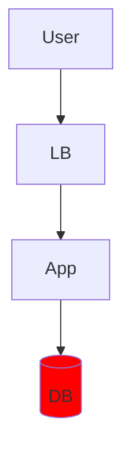

**Key Concepts:** `Distributed Systems`, `Architecture`

### Candidate Response Paths
*   **Junior**: When server crashes.
*   **Senior**: Analyzing architectural diagrams for non-redundant nodes.

---

## 19. Leader Election (System Design)

**Scenario:** Consensus algorithms (Raft/Paxos).

**Question:** Explain Leader Election in a distributed cluster.

| Algorithm | Use Case |
|---|---|
| Raft | Easier to understand |
| Paxos | Theoretical standard |

**Key Concepts:** `Distributed Systems`, `Architecture`

### Candidate Response Paths
*   **Junior**: The biggest server is leader.
*   **Senior**: Split-brain scenarios and Quorums.

---

## 20. Backpressure (System Design)

**Scenario:** Dropping requests vs Queueing.

**Question:** How do you handle a system under heavy load that cannot process requests fast enough?

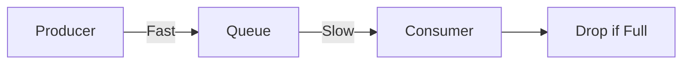

**Key Concepts:** `Distributed Systems`, `Architecture`

### Candidate Response Paths
*   **Junior**: Increase memory.
*   **Senior**: Flow control, dropping traffic, informing sender.

---

## 21. ACID Properties (Database)

**Scenario:** Atomicity, Consistency, Isolation, Durability.

**Question:** Explain ACID compliance.

| Property | Description |
|---|---|
| Atomicity | All or nothing |
| Consistency | Valid state transitions |
| Isolation | Concurrent transaction handling |
| Durability | Committed data is saved |

**Key Concepts:** `SQL`, `Data Modeling`

### Candidate Response Paths
*   **Junior**: Defines acronym.
*   **Senior**: Explains how WAL enables Durability.

---

## 22. Normalization (Database)

**Scenario:** Redundancy vs Read Performance.

**Question:** Why do we normalize databases? When is denormalization better?

| Form | Goal |
|---|---|
| 1NF | Atomic values |
| 3NF | No transitive dependencies |

**Key Concepts:** `SQL`, `Data Modeling`

### Candidate Response Paths
*   **Junior**: Always normalize.
*   **Senior**: Denormalize for read-heavy reporting.

---

## 23. Indexing (Database)

**Scenario:** Logarithmic search time.

**Question:** How do B-Tree indexes work?

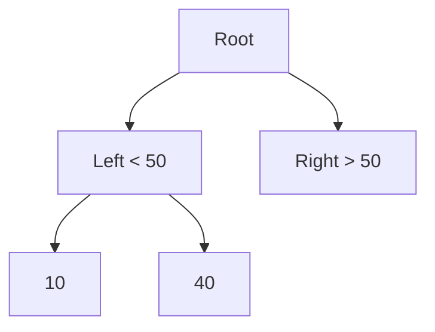

**Key Concepts:** `SQL`, `Data Modeling`

### Candidate Response Paths
*   **Junior**: Makes queries faster.
*   **Senior**: Explains branching factor and page reads.

---

## 24. N+1 Problem (Database)

**Scenario:** Fetching related data in a loop.

**Question:** What is the N+1 query problem and how do you fix it?

```python
# Bad
for user in users:
  print(user.profile.bio)
# Good
users = User.objects.select_related('profile')
```

**Key Concepts:** `SQL`, `Data Modeling`

### Candidate Response Paths
*   **Junior**: Describes the loop.
*   **Senior**: Discusses eager loading vs lazy loading.

---

## 25. SQL vs NoSQL (Database)

**Scenario:** Graph/Document store vs Relational.

**Question:** Choose a database for a social media feed.

| Metric | SQL | NoSQL |
|---|---|---|
| Structure | Structured | Unstructured |
| Joins | Complex | None/Application-side |

**Key Concepts:** `SQL`, `Data Modeling`

### Candidate Response Paths
*   **Junior**: NoSQL is faster.
*   **Senior**: Graph DB for relationships, Document for feed content.

---

## 26. Transaction Isolation (Database)

**Scenario:** Dirty reads vs Phantom reads.

**Question:** Explain 'Read Committed' vs 'Serializable' isolation levels.

| Level | Dirty Read | Phantom Read |
|---|---|---|
| Read Committed | No | Yes |
| Serializable | No | No |

**Key Concepts:** `SQL`, `Data Modeling`

### Candidate Response Paths
*   **Junior**: Unsure.
*   **Senior**: Trade-off between consistency and concurrency.

---

## 27. Replication (Database)

**Scenario:** Write conflicts vs Read scaling.

**Question:** Master-Slave vs Multi-Master replication.

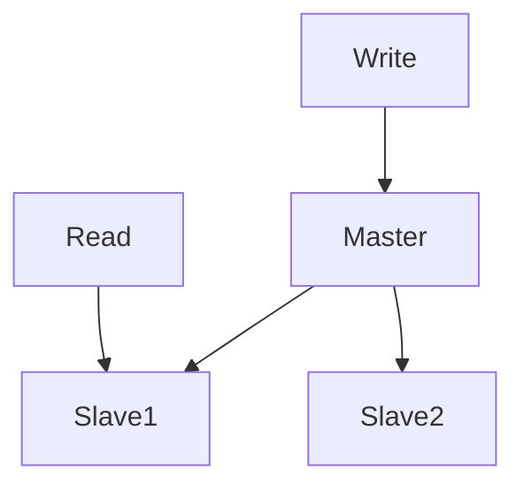

**Key Concepts:** `SQL`, `Data Modeling`

### Candidate Response Paths
*   **Junior**: Backup copies.
*   **Senior**: Async lag and conflict resolution in Multi-Master.

---

## 28. Connection Pooling (Database)

**Scenario:** Overhead of TCP handshakes.

**Question:** Why is connection pooling necessary?

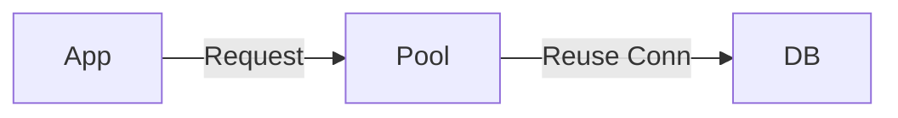

**Key Concepts:** `SQL`, `Data Modeling`

### Candidate Response Paths
*   **Junior**: Saves memory.
*   **Senior**: Reduces handshake latency and limits max connections.

---

## 29. Stored Procedures (Database)

**Scenario:** Performance vs Maintainability.

**Question:** Pros and Cons of business logic in Stored Procedures.

| Aspect | Pros | Cons |
|---|---|---|
| Perf | Reduced Network | CPU on DB |
| Maintenance | Centralized | Hard to Version Control |

**Key Concepts:** `SQL`, `Data Modeling`

### Candidate Response Paths
*   **Junior**: They are faster.
*   **Senior**: Avoid them to keep logic in app layer (easier to scale).

---

## 30. Soft Deletes (Database)

**Scenario:** Is_deleted flag vs Archive table.

**Question:** How to implement Soft Deletes?

```sql
UPDATE users SET deleted_at = NOW() WHERE id = 1;
```

**Key Concepts:** `SQL`, `Data Modeling`

### Candidate Response Paths
*   **Junior**: Add a boolean flag.
*   **Senior**: Discusses impact on unique indexes and query complexity.

---

## 31. Database Migration (Database)

**Scenario:** Expand and Contract pattern.

**Question:** How do you perform a zero-downtime schema migration?

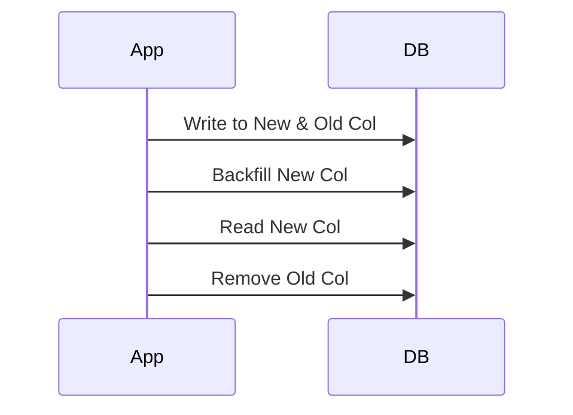

**Key Concepts:** `SQL`, `Data Modeling`

### Candidate Response Paths
*   **Junior**: Run script at night.
*   **Senior**: Dual writes and phased rollout.

---

## 32. Full Text Search (Database)

**Scenario:** Performance difference.

**Question:** Implementing search: LIKE vs Inverted Index (Elasticsearch).

| Method | Speed | Features |
|---|---|---|
| LIKE %..% | O(n) | Basic |
| Inverted Index | O(1) | Fuzzy, Ranking |

**Key Concepts:** `SQL`, `Data Modeling`

### Candidate Response Paths
*   **Junior**: Use wildcards.
*   **Senior**: Lucene based indexing.

---

## 33. Clustering (Database)

**Scenario:** Failover strategies.

**Question:** Active-Active vs Active-Passive clustering.

| Mode | Utilization | Failover |
|---|---|---|
| Active-Passive | 50% | Slow |
| Active-Active | 100% | Complex |

**Key Concepts:** `SQL`, `Data Modeling`

### Candidate Response Paths
*   **Junior**: Redundancy.
*   **Senior**: Discusses split-brain and synchronization.

---

## 34. Row vs Columnar (Database)

**Scenario:** OLAP vs OLTP.

**Question:** When to use a Columnar database (e.g., Cassandra/Redshift)?

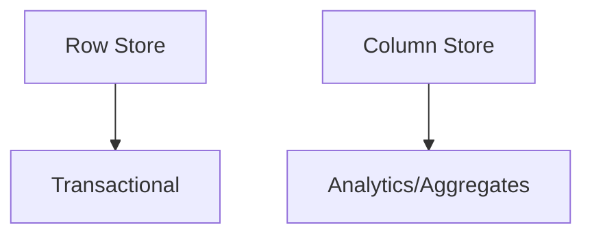

**Key Concepts:** `SQL`, `Data Modeling`

### Candidate Response Paths
*   **Junior**: For big data.
*   **Senior**: Better compression and aggregation performance.

---

## 35. Foreign Keys (Database)

**Scenario:** Constraint checking overhead.

**Question:** Impact of Foreign Keys on insert performance.

| Action | Impact |
|---|---|
| Insert | Needs lookup in parent table |
| Delete | Check cascade rules |

**Key Concepts:** `SQL`, `Data Modeling`

### Candidate Response Paths
*   **Junior**: Ensures integrity.
*   **Senior**: Can cause locking and slow down bulk inserts.

---

## 36. Deadlocks (Database)

**Scenario:** Consistent locking order.

**Question:** How do you debug and prevent deadlocks?

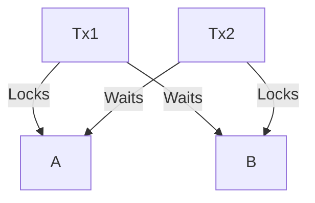

**Key Concepts:** `SQL`, `Data Modeling`

### Candidate Response Paths
*   **Junior**: Restart database.
*   **Senior**: Enforce strict ordering of resource acquisition.

---

## 37. VACUUM (Postgres) (Database)

**Scenario:** Reclaiming storage from dead tuples.

**Question:** What is the purpose of VACUUM in PostgreSQL?

| Concept | Detail |
|---|---|
| MVCC | Creates new row versions |
| Dead Tuples | Old versions needing cleanup |

**Key Concepts:** `SQL`, `Data Modeling`

### Candidate Response Paths
*   **Junior**: Cleans up space.
*   **Senior**: Prevents transaction ID wraparound and bloating.

---

## 38. Partitioning (Database)

**Scenario:** Splitting tables by row vs column.

**Question:** Horizontal Partitioning vs Vertical Partitioning.

| Type | Split By | Use Case |
|---|---|---|
| Vertical | Columns | Infrequently accessed blobs |
| Horizontal | Rows | Time-series data |

**Key Concepts:** `SQL`, `Data Modeling`

### Candidate Response Paths
*   **Junior**: Splitting tables.
*   **Senior**: Partition pruning improvements.

---

## 39. Write Amplification (Database)

**Scenario:** LSM Trees issue.

**Question:** What is write amplification in SSDs/Databases?

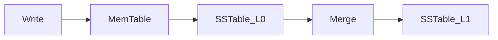

**Key Concepts:** `SQL`, `Data Modeling`

### Candidate Response Paths
*   **Junior**: More writes than needed.
*   **Senior**: Compaction process in LSM trees causing extra I/O.

---

## 40. Time Series (Database)

**Scenario:** TimescaleDB/InfluxDB specific structures.

**Question:** How to store metrics data efficiently?

| Requirement | Solution |
|---|---|
| Retention | Auto-expiry policies |
| Aggregation | Continuous Aggregates |

**Key Concepts:** `SQL`, `Data Modeling`

### Candidate Response Paths
*   **Junior**: Store in SQL.
*   **Senior**: Hyper-tables and compression algorithms for time-series.

---

## 41. REST Constraints (API)

**Scenario:** Statelessness, Cacheability.

**Question:** What are the key constraints of REST?

| Constraint | Benefit |
|---|---|
| Stateless | Scalability |
| Cacheable | Performance |

**Key Concepts:** `HTTP`, `Interface Design`

### Candidate Response Paths
*   **Junior**: It uses JSON.
*   **Senior**: HATEOAS and Uniform Interface.

---

## 42. GraphQL vs REST (API)

**Scenario:** Over-fetching vs Under-fetching.

**Question:** Why choose GraphQL over REST?

| Feature | REST | GraphQL |
|---|---|---|
| Data Fetching | Multiple Endpoints | Single Endpoint |
| Overfetching | Common | Rare |

**Key Concepts:** `HTTP`, `Interface Design`

### Candidate Response Paths
*   **Junior**: GraphQL is newer.
*   **Senior**: Type system and single round-trip benefits.

---

## 43. HTTP Status Codes (API)

**Scenario:** Unauthenticated vs Unauthorized.

**Question:** Difference between 401 and 403.

| Code | Meaning | Action |
|---|---|---|
| 401 | Who are you? | Login |
| 403 | You can't do that | Request Access |

**Key Concepts:** `HTTP`, `Interface Design`

### Candidate Response Paths
*   **Junior**: They are errors.
*   **Senior**: Token missing vs Token insufficient permissions.

---

## 44. Idempotent Methods (API)

**Scenario:** PUT, DELETE, GET.

**Question:** Which HTTP methods are idempotent?

| Method | Idempotent | Safe |
|---|---|---|
| POST | No | No |
| PUT | Yes | No |
| GET | Yes | Yes |

**Key Concepts:** `HTTP`, `Interface Design`

### Candidate Response Paths
*   **Junior**: GET.
*   **Senior**: Explains why POST is not (creation).

---

## 45. HATEOAS (API)

**Scenario:** Hypermedia as the Engine of Application State.

**Question:** What is HATEOAS?

```json
{
  "id": 1,
  "links": [
    {"rel": "self", "href": "/users/1"}
  ]
}
```

**Key Concepts:** `HTTP`, `Interface Design`

### Candidate Response Paths
*   **Junior**: Never heard of it.
*   **Senior**: Self-discoverable APIs.

---

## 46. Versioning (API)

**Scenario:** Breaking changes management.

**Question:** Strategies for API Versioning (URI, Header, Query Param).

| Strategy | Example |
|---|---|
| URI | /v1/users |
| Header | Accept: application/vnd.v1+json |

**Key Concepts:** `HTTP`, `Interface Design`

### Candidate Response Paths
*   **Junior**: Change the URL.
*   **Senior**: Header based is cleaner (content negotiation).

---

## 47. Authentication (API)

**Scenario:** Scalability implications.

**Question:** Session vs Token based auth.

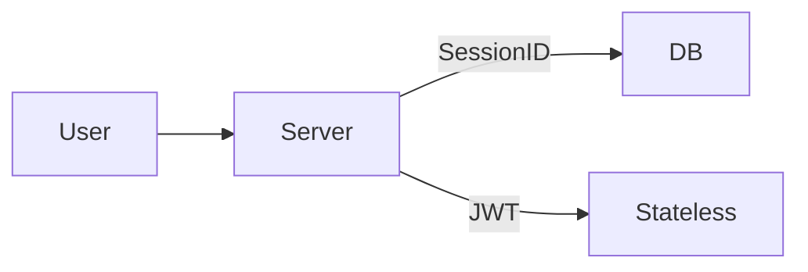

**Key Concepts:** `HTTP`, `Interface Design`

### Candidate Response Paths
*   **Junior**: Cookies.
*   **Senior**: JWT enables stateless auth across microservices.

---

## 48. OAuth2 Flows (API)

**Scenario:** Secure delegation.

**Question:** Explain the Authorization Code flow.

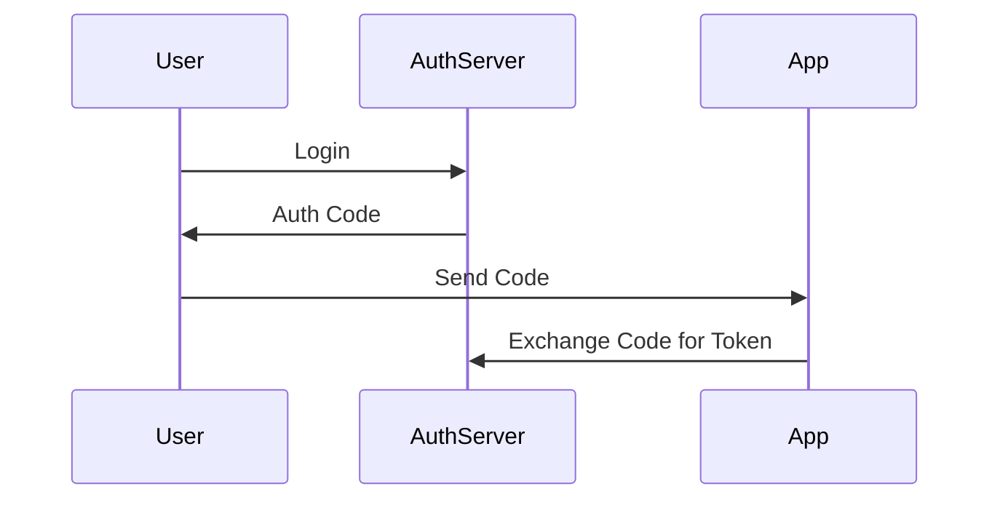

**Key Concepts:** `HTTP`, `Interface Design`

### Candidate Response Paths
*   **Junior**: Login with Google.
*   **Senior**: Difference between Implicit (unsafe) and Auth Code flows.

---

## 49. Webhooks (API)

**Scenario:** HMAC signatures.

**Question:** How to secure Webhooks?

```python
signature = hmac.new(secret, body, sha256).hexdigest()
if signature != header_sig:
  abort(403)
```

**Key Concepts:** `HTTP`, `Interface Design`

### Candidate Response Paths
*   **Junior**: Check IP.
*   **Senior**: Verify payload signature.

---

## 50. gRPC (API)

**Scenario:** Protobuf efficiency, HTTP/2.

**Question:** Benefits of gRPC over JSON/HTTP.

| Feature | REST | gRPC |
|---|---|---|
| Protocol | HTTP/1.1 | HTTP/2 |
| Format | JSON (Text) | Protobuf (Binary) |

**Key Concepts:** `HTTP`, `Interface Design`

### Candidate Response Paths
*   **Junior**: It's faster.
*   **Senior**: Binary serialization and multiplexing.

---

## 51. Pagination (API)

**Scenario:** Performance on large datasets.

**Question:** Offset vs Cursor based pagination.

```sql
-- Offset (Slow)
OFFSET 100000 LIMIT 10
-- Cursor (Fast)
WHERE id > 100000 LIMIT 10
```

**Key Concepts:** `HTTP`, `Interface Design`

### Candidate Response Paths
*   **Junior**: Use LIMIT OFFSET.
*   **Senior**: Keyset pagination avoids scanning skipped rows.

---

## 52. CORS (API)

**Scenario:** Pre-flight OPTIONS requests.

**Question:** How does Cross-Origin Resource Sharing work?

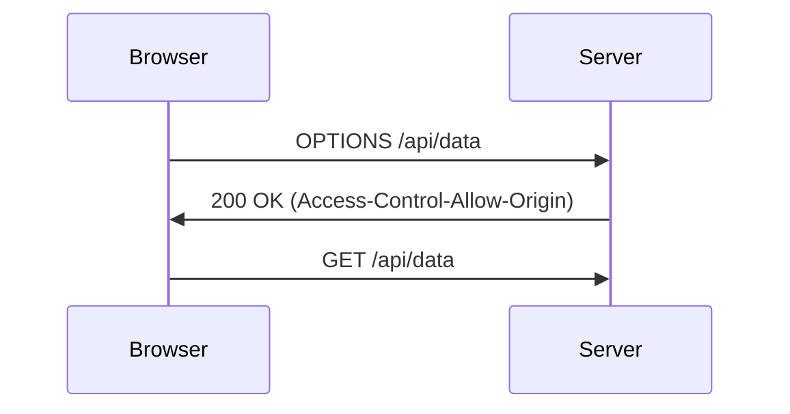

**Key Concepts:** `HTTP`, `Interface Design`

### Candidate Response Paths
*   **Junior**: Browser security error.
*   **Senior**: Pre-flight checks for non-simple requests.

---

## 53. API Documentation (API)

**Scenario:** Contract testing, Client generation.

**Question:** Why is OpenAPI/Swagger important?

```yaml
paths:
  /users:
    get:
      summary: List users
```

**Key Concepts:** `HTTP`, `Interface Design`

### Candidate Response Paths
*   **Junior**: For reading docs.
*   **Senior**: Auto-generating SDKs and mock servers.

---

## 54. Rate Limiting Headers (API)

**Scenario:** X-RateLimit-Remaining.

**Question:** Standard headers for rate limiting.

| Header | Description |
|---|---|
| X-RateLimit-Limit | Window Size |
| X-RateLimit-Reset | Time to reset |

**Key Concepts:** `HTTP`, `Interface Design`

### Candidate Response Paths
*   **Junior**: Don't know.
*   **Senior**: Using headers to programmatically back off.

---

## 55. Payload Size (API)

**Scenario:** Multipart vs Presigned URLs.

**Question:** Handling large file uploads in API.

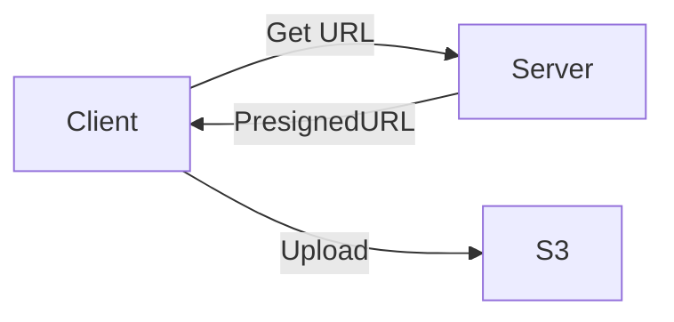

**Key Concepts:** `HTTP`, `Interface Design`

### Candidate Response Paths
*   **Junior**: Upload to server then S3.
*   **Senior**: Direct upload to S3 to save server bandwidth.

---

## 56. Content Negotiation (API)

**Scenario:** Accept headers.

**Question:** What is content negotiation?

```http
GET /resource HTTP/1.1
Accept: application/xml
```

**Key Concepts:** `HTTP`, `Interface Design`

### Candidate Response Paths
*   **Junior**: Format selection.
*   **Senior**: Server chooses representation based on client capability.

---

## 57. Keep-Alive (API)

**Scenario:** Connection reuse.

**Question:** Importance of HTTP Keep-Alive.

```http
Connection: keep-alive
```

**Key Concepts:** `HTTP`, `Interface Design`

### Candidate Response Paths
*   **Junior**: Keeps session active.
*   **Senior**: Avoids TCP 3-way handshake for subsequent requests.

---

## 58. Safe Methods (API)

**Scenario:** No side effects (GET).

**Question:** What defines a 'Safe' HTTP method?

| Method | Safe? |
|---|---|
| GET | Yes |
| DELETE | No |

**Key Concepts:** `HTTP`, `Interface Design`

### Candidate Response Paths
*   **Junior**: Doesn't change data.
*   **Senior**: Can be cached and prefetched without risk.

---

## 59. JSON Patch (API)

**Scenario:** Replace vs Partial Update.

**Question:** PUT vs PATCH.

```json
// PATCH
[{"op": "replace", "path": "/email", "value": "new@example.com"}]
```

**Key Concepts:** `HTTP`, `Interface Design`

### Candidate Response Paths
*   **Junior**: Both update data.
*   **Senior**: PUT is idempotent replacement, PATCH is delta update.

---

## 60. Soap (API)

**Scenario:** Enterprise legacy integrations.

**Question:** Is SOAP still relevant?

```xml
<soap:Envelope>...</soap:Envelope>
```

**Key Concepts:** `HTTP`, `Interface Design`

### Candidate Response Paths
*   **Junior**: No, it's dead.
*   **Senior**: Yes, for strict contracts and ACID transactions in banking.

---

## 61. SQL Injection (Security)

**Scenario:** Parameterized queries.

**Question:** How to prevent SQL Injection?

```sql
SELECT * FROM users WHERE name = 'user' OR '1'='1';
```

**Key Concepts:** `Cybersecurity`, `OWASP`

### Candidate Response Paths
*   **Junior**: Sanitize input.
*   **Senior**: Use Prepared Statements/ORM always.

---

## 62. XSS (Security)

**Scenario:** Sanitization and CSP.

**Question:** Reflected vs Stored XSS.

```html
<script>alert('XSS')</script>
```

**Key Concepts:** `Cybersecurity`, `OWASP`

### Candidate Response Paths
*   **Junior**: Script injection.
*   **Senior**: Content Security Policy (CSP) headers.

---

## 63. CSRF (Security)

**Scenario:** Anti-forgery tokens.

**Question:** How to prevent CSRF?

```html
<input type="hidden" name="csrf_token" value="xyz123" />
```

**Key Concepts:** `Cybersecurity`, `OWASP`

### Candidate Response Paths
*   **Junior**: Don't know.
*   **Senior**: SameSite cookie attribute and Anti-CSRF tokens.

---

## 64. HTTPS (Security)

**Scenario:** Asymmetric vs Symmetric encryption exchange.

**Question:** Explain the SSL/TLS handshake.

```mermaid
sequenceDiagram
Client->>Server: ClientHello
Server->>Client: ServerHello + Cert
Client->>Server: Key Exchange
Client->>Server: Finished (Encrypted)
```

**Key Concepts:** `Cybersecurity`, `OWASP`

### Candidate Response Paths
*   **Junior**: It encrypts data.
*   **Senior**: Key exchange mechanism and trust chain.

---

## 65. Hashing vs Encryption (Security)

**Scenario:** Passwords vs Credit Card numbers.

**Question:** When to hash and when to encrypt?

| Type | Reversible? | Use Case |
|---|---|---|
| Hash | No | Passwords |
| Encrypt | Yes | PII Data |

**Key Concepts:** `Cybersecurity`, `OWASP`

### Candidate Response Paths
*   **Junior**: Hash is better.
*   **Senior**: Hashing is one-way, Encryption is two-way.

---

## 66. Salt (Security)

**Scenario:** Rainbow table attacks.

**Question:** Why do we salt passwords?

```python
hash(password + salt)
```

**Key Concepts:** `Cybersecurity`, `OWASP`

### Candidate Response Paths
*   **Junior**: To make it longer.
*   **Senior**: Prevents Rainbow Table lookups for common passwords.

---

## 67. JWT Security (Security)

**Scenario:** Revocation difficulty, Algorithm confusion.

**Question:** Risks of using JWTs.

```json
{
  "alg": "none",
  "typ": "JWT"
}
```

**Key Concepts:** `Cybersecurity`, `OWASP`

### Candidate Response Paths
*   **Junior**: None.
*   **Senior**: Hard to revoke, alg: none vulnerability.

---

## 68. DDOS (Security)

**Scenario:** Rate limiting, Blackholing.

**Question:** Mitigation strategies for DDOS.

```mermaid
graph TD
Attacker --> WAF
WAF --Block--> Attacker
User --> WAF
WAF --Pass--> Server
```

**Key Concepts:** `Cybersecurity`, `OWASP`

### Candidate Response Paths
*   **Junior**: Block IP.
*   **Senior**: Anycast, WAF, Scrubbing centers.

---

## 69. Man-in-the-Middle (Security)

**Scenario:** Certificate Pinning, HSTS.

**Question:** How to prevent MITM attacks?

```http
Strict-Transport-Security: max-age=31536000
```

**Key Concepts:** `Cybersecurity`, `OWASP`

### Candidate Response Paths
*   **Junior**: Use HTTPS.
*   **Senior**: HSTS and Certificate Pinning.

---

## 70. OWASP Top 10 (Security)

**Scenario:** Injection, Broken Auth, Logging Failures.

**Question:** Name 3 vulnerabilities from OWASP Top 10.

| Rank | Vulnerability |
|---|---|
| 1 | Broken Access Control |
| 2 | Cryptographic Failures |
| 3 | Injection |

**Key Concepts:** `Cybersecurity`, `OWASP`

### Candidate Response Paths
*   **Junior**: Hacking.
*   **Senior**: Lists specific current top 3.

---

## 71. Principal of Least Privilege (Security)

**Scenario:** Granting only necessary permissions.

**Question:** Apply this to database users.

```sql
GRANT SELECT ON users TO app_reader;
-- NOT GRANT ALL
```

**Key Concepts:** `Cybersecurity`, `OWASP`

### Candidate Response Paths
*   **Junior**: Don't give root.
*   **Senior**: Role-based access control (RBAC).

---

## 72. Secrets Management (Security)

**Scenario:** Environment vars, Vault, not git.

**Question:** Where to store API keys?

```bash
# Bad
API_KEY='123' in code
# Good
API_KEY=os.getenv('KEY')
```

**Key Concepts:** `Cybersecurity`, `OWASP`

### Candidate Response Paths
*   **Junior**: .env file.
*   **Senior**: HashiCorp Vault or AWS Secrets Manager.

---

## 73. Input Validation (Security)

**Scenario:** Why whitelist is safer.

**Question:** Whitelisting vs Blacklisting input.

| Approach | Logic | Safety |
|---|---|---|
| Blacklist | Block bad chars | Low |
| Whitelist | Allow good chars | High |

**Key Concepts:** `Cybersecurity`, `OWASP`

### Candidate Response Paths
*   **Junior**: Block script tags.
*   **Senior**: Allow only known good characters (e.g. alphanumeric).

---

## 74. Clickjacking (Security)

**Scenario:** X-Frame-Options.

**Question:** How to prevent Clickjacking?

```http
X-Frame-Options: DENY
```

**Key Concepts:** `Cybersecurity`, `OWASP`

### Candidate Response Paths
*   **Junior**: Don't know.
*   **Senior**: Preventing iframe embedding.

---

## 75. Dependency Scanning (Security)

**Scenario:** SCA tools (Snyk, Dependabot).

**Question:** How to handle vulnerable dependencies?

```bash
npm audit fix
```

**Key Concepts:** `Cybersecurity`, `OWASP`

### Candidate Response Paths
*   **Junior**: Update packages.
*   **Senior**: Automated pipeline scanning with Snyk/Dependabot.

---

## 76. Container Security (Security)

**Scenario:** Running as non-root.

**Question:** Security best practices for Docker.

```dockerfile
USER 1001
```

**Key Concepts:** `Cybersecurity`, `OWASP`

### Candidate Response Paths
*   **Junior**: Use official images.
*   **Senior**: Rootless containers and minimal base images (Alpine/Distroless).

---

## 77. SSH Keys (Security)

**Scenario:** Private vs Public key usage.

**Question:** Public Key Infrastructure basics.

```mermaid
graph LR
Private[Private Key] --Sign--> Data
Data --Verify with Public--> Public[Public Key]
```

**Key Concepts:** `Cybersecurity`, `OWASP`

### Candidate Response Paths
*   **Junior**: Passwordless login.
*   **Senior**: Asymmetric crypto principles.

---

## 78. 2FA (Security)

**Scenario:** Time-based One Time Password.

**Question:** TOTP algorithm basics.

```python
HMAC(Secret, Time / 30)
```

**Key Concepts:** `Cybersecurity`, `OWASP`

### Candidate Response Paths
*   **Junior**: Google Authenticator.
*   **Senior**: Shared secret hashing with time windows.

---

## 79. Logging (Security)

**Scenario:** PII, Secrets, Passwords.

**Question:** What should you NEVER log?

| Category | Example |
|---|---|
| PII | SSN, Email |
| Secrets | API Keys, Passwords |

**Key Concepts:** `Cybersecurity`, `OWASP`

### Candidate Response Paths
*   **Junior**: Passwords.
*   **Senior**: PII compliance (GDPR) and secrets redaction.

---

## 80. Buffer Overflow (Security)

**Scenario:** Unsafe memory manipulation.

**Question:** Why does it happen?

```c
char buf[10];
strcpy(buf, "This string is too long");
```

**Key Concepts:** `Cybersecurity`, `OWASP`

### Candidate Response Paths
*   **Junior**: Writing too much data.
*   **Senior**: Overwriting return address in stack frame.

---

## 81. SOLID Principles (Coding & General)

**Scenario:** Subtypes must be substitutable for base types.

**Question:** Explain Liskov Substitution Principle.

```python
# Violation
class Bird: fly()
class Ostrich(Bird): fly() # Error
```

**Key Concepts:** `Software Engineering`, `Best Practices`

### Candidate Response Paths
*   **Junior**: Recites acronym.
*   **Senior**: Explains inheritance pitfalls.

---

## 82. Design Patterns (Coding & General)

**Scenario:** Global state issues vs convenience.

**Question:** Singleton Pattern: Good or Bad?

```python
class Singleton:
    _instance = None
    def __new__(cls):
        if cls._instance is None:
            cls._instance = super().__new__(cls)
        return cls._instance
```

**Key Concepts:** `Software Engineering`, `Best Practices`

### Candidate Response Paths
*   **Junior**: Good for database connection.
*   **Senior**: Bad due to hidden dependencies and testing difficulty.

---

## 83. Dependency Injection (Coding & General)

**Scenario:** Decoupling and testability.

**Question:** Why use DI?

```python
# DI
class Service:
  def __init__(self, db): ...
```

**Key Concepts:** `Software Engineering`, `Best Practices`

### Candidate Response Paths
*   **Junior**: Makes code cleaner.
*   **Senior**: Inversion of Control for unit testing.

---

## 84. Unit Testing (Coding & General)

**Scenario:** Behavior verification vs State verification.

**Question:** Mocking vs Stubbing.

| Term | Definition |
|---|---|
| Stub | Canned answer |
| Mock | Expectation check |

**Key Concepts:** `Software Engineering`, `Best Practices`

### Candidate Response Paths
*   **Junior**: Faking data.
*   **Senior**: Mocks verify behavior, Stubs provide state.

---

## 85. TDD (Coding & General)

**Scenario:** Red-Green-Refactor.

**Question:** Explain the TDD cycle.

```mermaid
graph TD
Red[Write Fail Test] --> Green[Write Pass Code]
Green --> Refactor
Refactor --> Red
```

**Key Concepts:** `Software Engineering`, `Best Practices`

### Candidate Response Paths
*   **Junior**: Write tests first.
*   **Senior**: Driving design through tests.

---

## 86. Code Review (Coding & General)

**Scenario:** Readability, Logic, Tests.

**Question:** What do you look for in a Code Review?

| Priority | Item |
|---|---|
| High | Bugs, Security |
| Low | Formatting (Lint) |

**Key Concepts:** `Software Engineering`, `Best Practices`

### Candidate Response Paths
*   **Junior**: Syntax errors.
*   **Senior**: Architectural fit and maintainability.

---

## 87. Garbage Collection (Coding & General)

**Scenario:** Mark and Sweep.

**Question:** How does GC work generally?

```mermaid
graph TD
Roots --> ObjA
Roots --> ObjB
ObjA --> ObjC
ObjD[Unreachable] --> ObjE
```

**Key Concepts:** `Software Engineering`, `Best Practices`

### Candidate Response Paths
*   **Junior**: Deletes unused vars.
*   **Senior**: Reference counting vs Reachability analysis.

---

## 88. Threading (Coding & General)

**Scenario:** Two threads accessing shared memory.

**Question:** Race Conditions.

```python
# Race
counter += 1
# Safe
with lock:
  counter += 1
```

**Key Concepts:** `Software Engineering`, `Best Practices`

### Candidate Response Paths
*   **Junior**: Threads crashing.
*   **Senior**: Atomicity and Critical Sections.

---

## 89. Async/Await (Coding & General)

**Scenario:** Non-blocking I/O.

**Question:** Event Loop basics.

```python
async def fetch():
  await db.query()
```

**Key Concepts:** `Software Engineering`, `Best Practices`

### Candidate Response Paths
*   **Junior**: Parallel execution.
*   **Senior**: Concurrency on single thread (waiting for I/O).

---

## 90. Memory Leak (Coding & General)

**Scenario:** Profiling tools.

**Question:** How to detect a memory leak?

```mermaid
graph LR
Usage --Time--> LinearGrowth
```

**Key Concepts:** `Software Engineering`, `Best Practices`

### Candidate Response Paths
*   **Junior**: App crashes.
*   **Senior**: Heap profiling and retention paths.

---

## 91. Big O Notation (Coding & General)

**Scenario:** Merge sort complexity.

**Question:** Explain O(n log n).

| Complexity | Name | Example |
|---|---|---|
| O(1) | Constant | Hash Lookup |
| O(n) | Linear | Loop |
| O(n^2) | Quadratic | Nested Loop |

**Key Concepts:** `Software Engineering`, `Best Practices`

### Candidate Response Paths
*   **Junior**: It's math.
*   **Senior**: Sorting algorithms complexity.

---

## 92. Refactoring (Coding & General)

**Scenario:** Code smells, Technical debt.

**Question:** When do you decide to refactor?

| Signal | Action |
|---|---|
| Duplication | DRY |
| Large Class | Extract Class |

**Key Concepts:** `Software Engineering`, `Best Practices`

### Candidate Response Paths
*   **Junior**: When code is ugly.
*   **Senior**: Boy Scout Rule: Leave it better than found.

---

## 93. Continuous Integration (Coding & General)

**Scenario:** Early bug detection.

**Question:** Benefits of CI.

```mermaid
graph LR
Commit --> Build --> Test --> Report
```

**Key Concepts:** `Software Engineering`, `Best Practices`

### Candidate Response Paths
*   **Junior**: Automated building.
*   **Senior**: Preventing integration hell.

---

## 94. Git Flow (Coding & General)

**Scenario:** History linearity.

**Question:** Merge vs Rebase.

```mermaid
graph TD
A[Master] --> B
A --> C[Feature]
C --Merge--> M[Merge Commit]
C --Rebase--> B'[Replay on B]
```

**Key Concepts:** `Software Engineering`, `Best Practices`

### Candidate Response Paths
*   **Junior**: Rebase is scary.
*   **Senior**: Rebase for clean history, Merge for preserving context.

---

## 95. Immutable Objects (Coding & General)

**Scenario:** Thread safety.

**Question:** Benefits of Immutability.

```python
tuple_data = (1, 2, 3) # Immutable
list_data = [1, 2, 3] # Mutable
```

**Key Concepts:** `Software Engineering`, `Best Practices`

### Candidate Response Paths
*   **Junior**: Cannot change.
*   **Senior**: Eliminates side effects and locking needs.

---

## 96. Clean Code (Coding & General)

**Scenario:** Self-documenting, Small functions.

**Question:** What makes code 'clean'?

| Trait | Description |
|---|---|
| Naming | Intent-revealing |
| Size | Small functions |

**Key Concepts:** `Software Engineering`, `Best Practices`

### Candidate Response Paths
*   **Junior**: Comments everywhere.
*   **Senior**: Code reads like prose.

---

## 97. Technical Debt (Coding & General)

**Scenario:** Interest on a loan.

**Question:** How to explain Technical Debt to a PM?

```mermaid
graph LR
SpeedNow --> Debt
Debt --Interest--> SlowerLater
```

**Key Concepts:** `Software Engineering`, `Best Practices`

### Candidate Response Paths
*   **Junior**: Bad code.
*   **Senior**: Short term trade-off for speed vs long term maintenance cost.

---

## 98. Pair Programming (Coding & General)

**Scenario:** Knowledge sharing vs Exhaustion.

**Question:** Pros and Cons.

| Role | Action |
|---|---|
| Driver | Types code |
| Navigator | Reviews/Strategizes |

**Key Concepts:** `Software Engineering`, `Best Practices`

### Candidate Response Paths
*   **Junior**: Two people one computer.
*   **Senior**: Real-time code review and knowledge transfer.

---

## 99. Mentorship (Coding & General)

**Scenario:** Code reviews, Pair programming.

**Question:** How do you mentor juniors?

| Method | Outcome |
|---|---|
| Socratic | Critical thinking |
| Spoon-feeding | Dependency |

**Key Concepts:** `Software Engineering`, `Best Practices`

### Candidate Response Paths
*   **Junior**: Tell them answers.
*   **Senior**: Guiding them to find answers themselves.

---

## 100. Failure Handling (Coding & General)

**Scenario:** Post-mortem culture.

**Question:** Describe a time you brought down production.

| Step | Action |
|---|---|
| Detect | Monitoring |
| Mitigate | Rollback |
| Prevent | Fix root cause |

**Key Concepts:** `Software Engineering`, `Best Practices`

### Candidate Response Paths
*   **Junior**: I never make mistakes.
*   **Senior**: Owns the mistake and explains the systemic fix.

---
