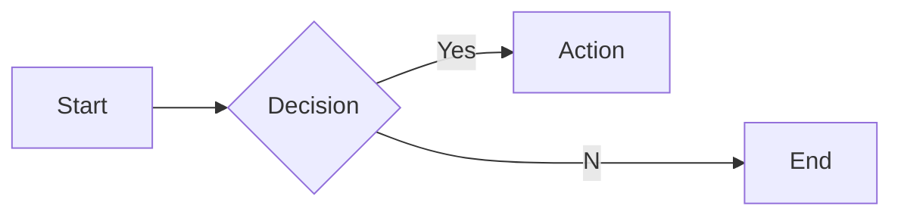
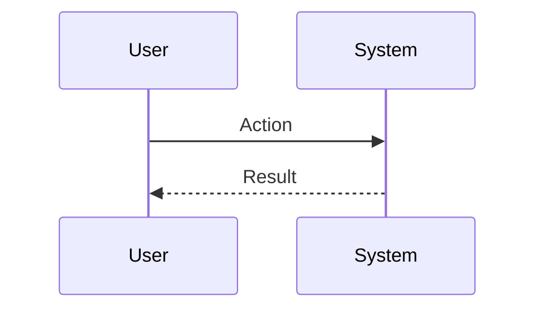

# Interview Questions: UX Writer (ROLE)

This document contains 100 interview questions tailored for the UX Writer role. The questions are designed to assess technical skills, soft skills, and cultural fit.

---

## 1. Design Systems

**Scenario:** Consistency.

**Question:** Why invest in a Design System?

**Key Concepts:** `UI/UX`, `Efficiency`

### Candidate Response Paths
*   **Junior**: It looks nice.
*   **Senior**: Scalability, consistency, and speed of development.

---

## 2. Accessibility

**Scenario:** WCAG.

**Question:** How do you design for accessibility?

**Key Concepts:** `A11y`, `Inclusivity`

### Candidate Response Paths
*   **Junior**: Contrast check.
*   **Senior**: Keyboard navigation, screen reader compatibility, and color blind modes.

---

## 3. User Research

**Scenario:** Validation.

**Question:** When should you conduct user research?

**Key Concepts:** `Research`, `Process`

### Candidate Response Paths
*   **Junior**: At the beginning.
*   **Senior**: Continuously throughout the product lifecycle (Discovery, Testing, Validation).

---

## 4. Handloff

**Scenario:** Dev collaboration.

**Question:** How do you ensure a smooth handoff to engineering?

**Key Concepts:** `Collaboration`, `Process`

### Candidate Response Paths
*   **Junior**: Send the Figma file.
*   **Senior**: Detailed specs, prototypes, and walkthroughs with devs.

---

## 5. Critique

**Scenario:** Feedback.

**Question:** How do you handle design critique?

**Key Concepts:** `Feedback`, `Growth`

### Candidate Response Paths
*   **Junior**: Defend my work.
*   **Senior**: Separate self from work, look for 'why', and iterate.

---

## 6. Tools

**Scenario:** Figma.

**Question:** What is your workflow in Figma?

**Key Concepts:** `Tools`, `Workflow`

### Candidate Response Paths
*   **Junior**: I draw shapes.
*   **Senior**: Components, Auto Layout, Variants, and organized layers.

---

## 7. Mobile Design

**Scenario:** Responsive.

**Question:** What are the key considerations for mobile-first design?

| Metric | Target | Status |
|---|---|---|
| KPI 1 | 100% | Green |
| KPI 2 | < 5% | Yellow |

**Key Concepts:** `Mobile`, `UX`

### Candidate Response Paths
*   **Junior**: Make it smaller.
*   **Senior**: Touch targets, gestures, and content hierarchy.

---

## 8. Prototyping

**Scenario:** Interaction.

**Question:** Why is prototyping important?

**Key Concepts:** `Prototyping`, `Validation`

### Candidate Response Paths
*   **Junior**: To show animations.
*   **Senior**: To test flow and interaction before expensive coding starts.

---

## 9. Data

**Scenario:** Metrics.

**Question:** How do you use data to inform design?

**Key Concepts:** `Data`, `UX`

### Candidate Response Paths
*   **Junior**: Look at clicks.
*   **Senior**: Heatmaps, conversion funnels, and A/B test results.

---

## 10. Empathy

**Scenario:** User needs.

**Question:** How do you build empathy for the user?

**Key Concepts:** `Empathy`, `Research`

### Candidate Response Paths
*   **Junior**: Imagine I am them.
*   **Senior**: Observation, interviews, and personas.

---

## 11. Conflict Resolution

**Scenario:** Disagreement with a peer.

**Question:** Tell me about a time you had a significant disagreement with a colleague. How did you resolve it?

**Key Concepts:** `Communication`, `Soft Skills`

### Candidate Response Paths
*   **Junior**: I told them I was right.
*   **Senior**: I listened to their perspective, found common ground, and we compromised.

---

## 12. Failure Handling

**Scenario:** A project went wrong.

**Question:** Describe a time you failed. What happened and what did you learn?

**Key Concepts:** `Growth Mindset`, `Resilience`

### Candidate Response Paths
*   **Junior**: I tried hard but it failed.
*   **Senior**: I analyzed the root cause, implemented a fix, and shared the learning.

---

## 13. Prioritization

**Scenario:** Too many tasks.

**Question:** How do you prioritize when you have multiple conflicting deadlines?

**Key Concepts:** `Time Management`, `Organization`

### Candidate Response Paths
*   **Junior**: I work longer hours.
*   **Senior**: I communicate with stakeholders to adjust expectations and focus on high-impact tasks.

---

## 14. Adaptability

**Scenario:** Changing requirements.

**Question:** How do you handle sudden changes in project scope or direction?

| Metric | Target | Status |
|---|---|---|
| KPI 1 | 100% | Green |
| KPI 2 | < 5% | Yellow |

**Key Concepts:** `Agility`, `Flexibility`

### Candidate Response Paths
*   **Junior**: I get frustrated but do it.
*   **Senior**: I assess the impact, communicate risks, and pivot quickly.

---

## 15. Communication

**Scenario:** Explaining complex topics.

**Question:** Describe a time you had to explain a complex technical/business concept to a non-expert.

**Key Concepts:** `Clarity`, `Empathy`

### Candidate Response Paths
*   **Junior**: I just said it simpler.
*   **Senior**: I used analogies and checked for understanding throughout.

---

## 16. Teamwork

**Scenario:** Collaborating with difficult personalities.

**Question:** How do you handle working with someone who is difficult to work with?

**Key Concepts:** `Collaboration`, `EQ`

### Candidate Response Paths
*   **Junior**: I avoid them.
*   **Senior**: I try to understand their motivations and find a way to work together effectively.

---

## 17. Innovation

**Scenario:** Improving a process.

**Question:** Tell me about a time you improved a process or workflow.

**Key Concepts:** `Innovation`, `Efficiency`

### Candidate Response Paths
*   **Junior**: I followed the rules.
*   **Senior**: I identified a bottleneck, proposed a solution, and measured the improvement.

---

## 18. Feedback

**Scenario:** Receiving constructive criticism.

**Question:** Tell me about a time you received difficult feedback. How did you react?

**Key Concepts:** `Self-awareness`, `Growth`

### Candidate Response Paths
*   **Junior**: I got defensive.
*   **Senior**: I listened, asked for examples, and worked on a plan to improve.

---

## 19. Leadership

**Scenario:** Leading without authority.

**Question:** Describe a time you demonstrated leadership when you weren't the formal manager.

**Key Concepts:** `Leadership`, `Influence`

### Candidate Response Paths
*   **Junior**: I told people what to do.
*   **Senior**: I rallied the team around a goal and supported them to achieve it.

---

## 20. Decision Making

**Scenario:** Incomplete information.

**Question:** How do you make decisions when you don't have all the data?

**Key Concepts:** `Judgment`, `Risk Mgmt`

### Candidate Response Paths
*   **Junior**: I wait for all data.
*   **Senior**: I assess the risk, make a call based on available info, and adjust as needed.

---

## 21. Teaching Web Design

**Scenario:** Mentorship.

**Question:** How would you teach Web Design to a junior team member?

| Metric | Target | Status |
|---|---|---|
| KPI 1 | 100% | Green |
| KPI 2 | < 5% | Yellow |

**Key Concepts:** `Web Design`, `Mentorship`

### Candidate Response Paths
*   **Junior**: Send them a link.
*   **Senior**: Structured learning path and hands-on practice.

---

## 22. User Testing Best Practices

**Scenario:** Standardization.

**Question:** What are the industry best practices for User Testing?

**Key Concepts:** `User Testing`, `Standards`

### Candidate Response Paths
*   **Junior**: List a few.
*   **Senior**: Discusses why they are best practices and when to break them.

---

## 23. Future of Design Systems

**Scenario:** Trends.

**Question:** Where do you see Design Systems heading in the next 5 years?

**Key Concepts:** `Design Systems`, `Vision`

### Candidate Response Paths
*   **Junior**: It will get better.
*   **Senior**: Emerging trends, AI impact, and market shifts.

---

## 24. Future of Mobile Design

**Scenario:** Trends.

**Question:** Where do you see Mobile Design heading in the next 5 years?

**Key Concepts:** `Mobile Design`, `Vision`

### Candidate Response Paths
*   **Junior**: It will get better.
*   **Senior**: Emerging trends, AI impact, and market shifts.

---

## 25. Metrics for Color Theory

**Scenario:** Measurement.

**Question:** How do you measure success in Color Theory?

**Key Concepts:** `Color Theory`, `Analytics`

### Candidate Response Paths
*   **Junior**: I guess.
*   **Senior**: Specific KPIs and leading/lagging indicators.

---

## 26. Ethics in Web Design

**Scenario:** Ethics.

**Question:** What are the ethical considerations regarding Web Design?

**Key Concepts:** `Web Design`, `Ethics`

### Candidate Response Paths
*   **Junior**: Be nice.
*   **Senior**: Privacy, bias, and societal impact.

---

## 27. Tooling: Wireframing

**Scenario:** Proficiency.

**Question:** How do you utilize Wireframing to improve efficiency?

**Key Concepts:** `Wireframing`, `Productivity`

### Candidate Response Paths
*   **Junior**: I use it daily.
*   **Senior**: Advanced features and automation.

---

## 28. Ethics in Animation

**Scenario:** Ethics.

**Question:** What are the ethical considerations regarding Animation?

| Metric | Target | Status |
|---|---|---|
| KPI 1 | 100% | Green |
| KPI 2 | < 5% | Yellow |

**Key Concepts:** `Animation`, `Ethics`

### Candidate Response Paths
*   **Junior**: Be nice.
*   **Senior**: Privacy, bias, and societal impact.

---

## 29. Design Systems Best Practices

**Scenario:** Standardization.

**Question:** What are the industry best practices for Design Systems?

**Key Concepts:** `Design Systems`, `Standards`

### Candidate Response Paths
*   **Junior**: List a few.
*   **Senior**: Discusses why they are best practices and when to break them.

---

## 30. Start vs Scale for Interaction Design

**Scenario:** Context.

**Question:** How does your approach to Interaction Design differ in a startup vs a large corp?

**Key Concepts:** `Interaction Design`, `Context`

### Candidate Response Paths
*   **Junior**: It's the same.
*   **Senior**: Speed/Chaos vs Process/Stability.

---

## 31. Metrics for Design Systems

**Scenario:** Measurement.

**Question:** How do you measure success in Design Systems?

**Key Concepts:** `Design Systems`, `Analytics`

### Candidate Response Paths
*   **Junior**: I guess.
*   **Senior**: Specific KPIs and leading/lagging indicators.

---

## 32. Scaling Animation

**Scenario:** Growth.

**Question:** How do you scale Animation as the company grows?

**Key Concepts:** `Animation`, `Scale`

### Candidate Response Paths
*   **Junior**: Hire more people.
*   **Senior**: Process automation, documentation, and leverage.

---

## 33. Challenges in User Testing

**Scenario:** Problem Solving.

**Question:** What are the biggest challenges you've faced regarding User Testing?

**Key Concepts:** `User Testing`, `Problem Solving`

### Candidate Response Paths
*   **Junior**: It was hard.
*   **Senior**: Specific examples of obstacles and strategies to overcome them.

---

## 34. Metrics for Animation

**Scenario:** Measurement.

**Question:** How do you measure success in Animation?

**Key Concepts:** `Animation`, `Analytics`

### Candidate Response Paths
*   **Junior**: I guess.
*   **Senior**: Specific KPIs and leading/lagging indicators.

---

## 35. Ethics in Color Theory

**Scenario:** Ethics.

**Question:** What are the ethical considerations regarding Color Theory?

| Metric | Target | Status |
|---|---|---|
| KPI 1 | 100% | Green |
| KPI 2 | < 5% | Yellow |

**Key Concepts:** `Color Theory`, `Ethics`

### Candidate Response Paths
*   **Junior**: Be nice.
*   **Senior**: Privacy, bias, and societal impact.

---

## 36. Teaching Interaction Design

**Scenario:** Mentorship.

**Question:** How would you teach Interaction Design to a junior team member?

**Key Concepts:** `Interaction Design`, `Mentorship`

### Candidate Response Paths
*   **Junior**: Send them a link.
*   **Senior**: Structured learning path and hands-on practice.

---

## 37. Collaboration in Animation

**Scenario:** Teamwork.

**Question:** How does Animation require cross-functional collaboration?

**Key Concepts:** `Animation`, `Collaboration`

### Candidate Response Paths
*   **Junior**: I talk to people.
*   **Senior**: Alignment with other depts and shared goals.

---

## 38. Future of Layout

**Scenario:** Trends.

**Question:** Where do you see Layout heading in the next 5 years?

**Key Concepts:** `Layout`, `Vision`

### Candidate Response Paths
*   **Junior**: It will get better.
*   **Senior**: Emerging trends, AI impact, and market shifts.

---

## 39. Mistakes in Prototyping

**Scenario:** Learning.

**Question:** What common mistakes do people make with Prototyping?

**Key Concepts:** `Prototyping`, `Experience`

### Candidate Response Paths
*   **Junior**: Doing it wrong.
*   **Senior**: Subtle pitfalls and how to avoid them.

---

## 40. Mistakes in Design Systems

**Scenario:** Learning.

**Question:** What common mistakes do people make with Design Systems?

**Key Concepts:** `Design Systems`, `Experience`

### Candidate Response Paths
*   **Junior**: Doing it wrong.
*   **Senior**: Subtle pitfalls and how to avoid them.

---

## 41. Metrics for User Testing

**Scenario:** Measurement.

**Question:** How do you measure success in User Testing?

**Key Concepts:** `User Testing`, `Analytics`

### Candidate Response Paths
*   **Junior**: I guess.
*   **Senior**: Specific KPIs and leading/lagging indicators.

---

## 42. Tooling: Mobile Design

**Scenario:** Proficiency.

**Question:** How do you utilize Mobile Design to improve efficiency?

| Metric | Target | Status |
|---|---|---|
| KPI 1 | 100% | Green |
| KPI 2 | < 5% | Yellow |

**Key Concepts:** `Mobile Design`, `Productivity`

### Candidate Response Paths
*   **Junior**: I use it daily.
*   **Senior**: Advanced features and automation.

---

## 43. Mistakes in Accessibility

**Scenario:** Learning.

**Question:** What common mistakes do people make with Accessibility?

**Key Concepts:** `Accessibility`, `Experience`

### Candidate Response Paths
*   **Junior**: Doing it wrong.
*   **Senior**: Subtle pitfalls and how to avoid them.

---

## 44. Tooling: Layout

**Scenario:** Proficiency.

**Question:** How do you utilize Layout to improve efficiency?

**Key Concepts:** `Layout`, `Productivity`

### Candidate Response Paths
*   **Junior**: I use it daily.
*   **Senior**: Advanced features and automation.

---

## 45. Teaching Usability

**Scenario:** Mentorship.

**Question:** How would you teach Usability to a junior team member?

**Key Concepts:** `Usability`, `Mentorship`

### Candidate Response Paths
*   **Junior**: Send them a link.
*   **Senior**: Structured learning path and hands-on practice.

---

## 46. Mistakes in Information Arch

**Scenario:** Learning.

**Question:** What common mistakes do people make with Information Arch?

**Key Concepts:** `Information Arch`, `Experience`

### Candidate Response Paths
*   **Junior**: Doing it wrong.
*   **Senior**: Subtle pitfalls and how to avoid them.

---

## 47. Deep Dive: Accessibility

**Scenario:** Assessing depth in Accessibility.

**Question:** Can you explain Accessibility in detail and how you have applied it in your past role?

**Key Concepts:** `Accessibility`, `Experience`

### Candidate Response Paths
*   **Junior**: Basic definition.
*   **Senior**: Deep practical application and nuances.

---

## 48. Mistakes in Web Design

**Scenario:** Learning.

**Question:** What common mistakes do people make with Web Design?

**Key Concepts:** `Web Design`, `Experience`

### Candidate Response Paths
*   **Junior**: Doing it wrong.
*   **Senior**: Subtle pitfalls and how to avoid them.

---

## 49. Collaboration in Design Systems

**Scenario:** Teamwork.

**Question:** How does Design Systems require cross-functional collaboration?

| Metric | Target | Status |
|---|---|---|
| KPI 1 | 100% | Green |
| KPI 2 | < 5% | Yellow |

**Key Concepts:** `Design Systems`, `Collaboration`

### Candidate Response Paths
*   **Junior**: I talk to people.
*   **Senior**: Alignment with other depts and shared goals.

---

## 50. Deep Dive: Prototyping

**Scenario:** Assessing depth in Prototyping.

**Question:** Can you explain Prototyping in detail and how you have applied it in your past role?

**Key Concepts:** `Prototyping`, `Experience`

### Candidate Response Paths
*   **Junior**: Basic definition.
*   **Senior**: Deep practical application and nuances.

---

## 51. Start vs Scale for Color Theory

**Scenario:** Context.

**Question:** How does your approach to Color Theory differ in a startup vs a large corp?

**Key Concepts:** `Color Theory`, `Context`

### Candidate Response Paths
*   **Junior**: It's the same.
*   **Senior**: Speed/Chaos vs Process/Stability.

---

## 52. Usability Best Practices

**Scenario:** Standardization.

**Question:** What are the industry best practices for Usability?

**Key Concepts:** `Usability`, `Standards`

### Candidate Response Paths
*   **Junior**: List a few.
*   **Senior**: Discusses why they are best practices and when to break them.

---

## 53. Challenges in Interaction Design

**Scenario:** Problem Solving.

**Question:** What are the biggest challenges you've faced regarding Interaction Design?

**Key Concepts:** `Interaction Design`, `Problem Solving`

### Candidate Response Paths
*   **Junior**: It was hard.
*   **Senior**: Specific examples of obstacles and strategies to overcome them.

---

## 54. Deep Dive: Web Design

**Scenario:** Assessing depth in Web Design.

**Question:** Can you explain Web Design in detail and how you have applied it in your past role?

**Key Concepts:** `Web Design`, `Experience`

### Candidate Response Paths
*   **Junior**: Basic definition.
*   **Senior**: Deep practical application and nuances.

---

## 55. Tooling: Color Theory

**Scenario:** Proficiency.

**Question:** How do you utilize Color Theory to improve efficiency?

**Key Concepts:** `Color Theory`, `Productivity`

### Candidate Response Paths
*   **Junior**: I use it daily.
*   **Senior**: Advanced features and automation.

---

## 56. Mistakes in Color Theory

**Scenario:** Learning.

**Question:** What common mistakes do people make with Color Theory?

| Metric | Target | Status |
|---|---|---|
| KPI 1 | 100% | Green |
| KPI 2 | < 5% | Yellow |

**Key Concepts:** `Color Theory`, `Experience`

### Candidate Response Paths
*   **Junior**: Doing it wrong.
*   **Senior**: Subtle pitfalls and how to avoid them.

---

## 57. Deep Dive: User Testing

**Scenario:** Assessing depth in User Testing.

**Question:** Can you explain User Testing in detail and how you have applied it in your past role?

**Key Concepts:** `User Testing`, `Experience`

### Candidate Response Paths
*   **Junior**: Basic definition.
*   **Senior**: Deep practical application and nuances.

---

## 58. Ethics in Figma

**Scenario:** Ethics.

**Question:** What are the ethical considerations regarding Figma?

**Key Concepts:** `Figma`, `Ethics`

### Candidate Response Paths
*   **Junior**: Be nice.
*   **Senior**: Privacy, bias, and societal impact.

---

## 59. Scaling User Testing

**Scenario:** Growth.

**Question:** How do you scale User Testing as the company grows?

**Key Concepts:** `User Testing`, `Scale`

### Candidate Response Paths
*   **Junior**: Hire more people.
*   **Senior**: Process automation, documentation, and leverage.

---

## 60. Scaling Usability

**Scenario:** Growth.

**Question:** How do you scale Usability as the company grows?

**Key Concepts:** `Usability`, `Scale`

### Candidate Response Paths
*   **Junior**: Hire more people.
*   **Senior**: Process automation, documentation, and leverage.

---

## 61. Color Theory Best Practices

**Scenario:** Standardization.

**Question:** What are the industry best practices for Color Theory?

**Key Concepts:** `Color Theory`, `Standards`

### Candidate Response Paths
*   **Junior**: List a few.
*   **Senior**: Discusses why they are best practices and when to break them.

---

## 62. Deep Dive: Layout

**Scenario:** Assessing depth in Layout.

**Question:** Can you explain Layout in detail and how you have applied it in your past role?

**Key Concepts:** `Layout`, `Experience`

### Candidate Response Paths
*   **Junior**: Basic definition.
*   **Senior**: Deep practical application and nuances.

---

## 63. Collaboration in Figma

**Scenario:** Teamwork.

**Question:** How does Figma require cross-functional collaboration?

| Metric | Target | Status |
|---|---|---|
| KPI 1 | 100% | Green |
| KPI 2 | < 5% | Yellow |

**Key Concepts:** `Figma`, `Collaboration`

### Candidate Response Paths
*   **Junior**: I talk to people.
*   **Senior**: Alignment with other depts and shared goals.

---

## 64. Ethics in Typography

**Scenario:** Ethics.

**Question:** What are the ethical considerations regarding Typography?

**Key Concepts:** `Typography`, `Ethics`

### Candidate Response Paths
*   **Junior**: Be nice.
*   **Senior**: Privacy, bias, and societal impact.

---

## 65. Challenges in Design Systems

**Scenario:** Problem Solving.

**Question:** What are the biggest challenges you've faced regarding Design Systems?

**Key Concepts:** `Design Systems`, `Problem Solving`

### Candidate Response Paths
*   **Junior**: It was hard.
*   **Senior**: Specific examples of obstacles and strategies to overcome them.

---

## 66. Challenges in Mobile Design

**Scenario:** Problem Solving.

**Question:** What are the biggest challenges you've faced regarding Mobile Design?

**Key Concepts:** `Mobile Design`, `Problem Solving`

### Candidate Response Paths
*   **Junior**: It was hard.
*   **Senior**: Specific examples of obstacles and strategies to overcome them.

---

## 67. Challenges in Web Design

**Scenario:** Problem Solving.

**Question:** What are the biggest challenges you've faced regarding Web Design?

**Key Concepts:** `Web Design`, `Problem Solving`

### Candidate Response Paths
*   **Junior**: It was hard.
*   **Senior**: Specific examples of obstacles and strategies to overcome them.

---

## 68. Metrics for Accessibility

**Scenario:** Measurement.

**Question:** How do you measure success in Accessibility?

**Key Concepts:** `Accessibility`, `Analytics`

### Candidate Response Paths
*   **Junior**: I guess.
*   **Senior**: Specific KPIs and leading/lagging indicators.

---

## 69. Mistakes in User Testing

**Scenario:** Learning.

**Question:** What common mistakes do people make with User Testing?

**Key Concepts:** `User Testing`, `Experience`

### Candidate Response Paths
*   **Junior**: Doing it wrong.
*   **Senior**: Subtle pitfalls and how to avoid them.

---

## 70. Tooling: Information Arch

**Scenario:** Proficiency.

**Question:** How do you utilize Information Arch to improve efficiency?

| Metric | Target | Status |
|---|---|---|
| KPI 1 | 100% | Green |
| KPI 2 | < 5% | Yellow |

**Key Concepts:** `Information Arch`, `Productivity`

### Candidate Response Paths
*   **Junior**: I use it daily.
*   **Senior**: Advanced features and automation.

---

## 71. Teaching Typography

**Scenario:** Mentorship.

**Question:** How would you teach Typography to a junior team member?

**Key Concepts:** `Typography`, `Mentorship`

### Candidate Response Paths
*   **Junior**: Send them a link.
*   **Senior**: Structured learning path and hands-on practice.

---

## 72. Start vs Scale for Layout

**Scenario:** Context.

**Question:** How does your approach to Layout differ in a startup vs a large corp?

**Key Concepts:** `Layout`, `Context`

### Candidate Response Paths
*   **Junior**: It's the same.
*   **Senior**: Speed/Chaos vs Process/Stability.

---

## 73. Start vs Scale for Figma

**Scenario:** Context.

**Question:** How does your approach to Figma differ in a startup vs a large corp?

**Key Concepts:** `Figma`, `Context`

### Candidate Response Paths
*   **Junior**: It's the same.
*   **Senior**: Speed/Chaos vs Process/Stability.

---

## 74. Deep Dive: Wireframing

**Scenario:** Assessing depth in Wireframing.

**Question:** Can you explain Wireframing in detail and how you have applied it in your past role?

**Key Concepts:** `Wireframing`, `Experience`

### Candidate Response Paths
*   **Junior**: Basic definition.
*   **Senior**: Deep practical application and nuances.

---

## 75. Collaboration in Prototyping

**Scenario:** Teamwork.

**Question:** How does Prototyping require cross-functional collaboration?

**Key Concepts:** `Prototyping`, `Collaboration`

### Candidate Response Paths
*   **Junior**: I talk to people.
*   **Senior**: Alignment with other depts and shared goals.

---

## 76. Teaching Prototyping

**Scenario:** Mentorship.

**Question:** How would you teach Prototyping to a junior team member?

**Key Concepts:** `Prototyping`, `Mentorship`

### Candidate Response Paths
*   **Junior**: Send them a link.
*   **Senior**: Structured learning path and hands-on practice.

---

## 77. Teaching Color Theory

**Scenario:** Mentorship.

**Question:** How would you teach Color Theory to a junior team member?

| Metric | Target | Status |
|---|---|---|
| KPI 1 | 100% | Green |
| KPI 2 | < 5% | Yellow |

**Key Concepts:** `Color Theory`, `Mentorship`

### Candidate Response Paths
*   **Junior**: Send them a link.
*   **Senior**: Structured learning path and hands-on practice.

---

## 78. Collaboration in Interaction Design

**Scenario:** Teamwork.

**Question:** How does Interaction Design require cross-functional collaboration?

**Key Concepts:** `Interaction Design`, `Collaboration`

### Candidate Response Paths
*   **Junior**: I talk to people.
*   **Senior**: Alignment with other depts and shared goals.

---

## 79. Scaling Interaction Design

**Scenario:** Growth.

**Question:** How do you scale Interaction Design as the company grows?

**Key Concepts:** `Interaction Design`, `Scale`

### Candidate Response Paths
*   **Junior**: Hire more people.
*   **Senior**: Process automation, documentation, and leverage.

---

## 80. Mistakes in Animation

**Scenario:** Learning.

**Question:** What common mistakes do people make with Animation?

**Key Concepts:** `Animation`, `Experience`

### Candidate Response Paths
*   **Junior**: Doing it wrong.
*   **Senior**: Subtle pitfalls and how to avoid them.

---

## 81. Challenges in Information Arch

**Scenario:** Problem Solving.

**Question:** What are the biggest challenges you've faced regarding Information Arch?

**Key Concepts:** `Information Arch`, `Problem Solving`

### Candidate Response Paths
*   **Junior**: It was hard.
*   **Senior**: Specific examples of obstacles and strategies to overcome them.

---

## 82. Collaboration in Information Arch

**Scenario:** Teamwork.

**Question:** How does Information Arch require cross-functional collaboration?

**Key Concepts:** `Information Arch`, `Collaboration`

### Candidate Response Paths
*   **Junior**: I talk to people.
*   **Senior**: Alignment with other depts and shared goals.

---

## 83. Mistakes in Mobile Design

**Scenario:** Learning.

**Question:** What common mistakes do people make with Mobile Design?

**Key Concepts:** `Mobile Design`, `Experience`

### Candidate Response Paths
*   **Junior**: Doing it wrong.
*   **Senior**: Subtle pitfalls and how to avoid them.

---

## 84. Challenges in Prototyping

**Scenario:** Problem Solving.

**Question:** What are the biggest challenges you've faced regarding Prototyping?

| Metric | Target | Status |
|---|---|---|
| KPI 1 | 100% | Green |
| KPI 2 | < 5% | Yellow |

**Key Concepts:** `Prototyping`, `Problem Solving`

### Candidate Response Paths
*   **Junior**: It was hard.
*   **Senior**: Specific examples of obstacles and strategies to overcome them.

---

## 85. Challenges in Animation

**Scenario:** Problem Solving.

**Question:** What are the biggest challenges you've faced regarding Animation?

**Key Concepts:** `Animation`, `Problem Solving`

### Candidate Response Paths
*   **Junior**: It was hard.
*   **Senior**: Specific examples of obstacles and strategies to overcome them.

---

## 86. Ethics in Accessibility

**Scenario:** Ethics.

**Question:** What are the ethical considerations regarding Accessibility?

**Key Concepts:** `Accessibility`, `Ethics`

### Candidate Response Paths
*   **Junior**: Be nice.
*   **Senior**: Privacy, bias, and societal impact.

---

## 87. Prototyping Best Practices

**Scenario:** Standardization.

**Question:** What are the industry best practices for Prototyping?

**Key Concepts:** `Prototyping`, `Standards`

### Candidate Response Paths
*   **Junior**: List a few.
*   **Senior**: Discusses why they are best practices and when to break them.

---

## 88. Ethics in Usability

**Scenario:** Ethics.

**Question:** What are the ethical considerations regarding Usability?

**Key Concepts:** `Usability`, `Ethics`

### Candidate Response Paths
*   **Junior**: Be nice.
*   **Senior**: Privacy, bias, and societal impact.

---

## 89. Metrics for Layout

**Scenario:** Measurement.

**Question:** How do you measure success in Layout?

**Key Concepts:** `Layout`, `Analytics`

### Candidate Response Paths
*   **Junior**: I guess.
*   **Senior**: Specific KPIs and leading/lagging indicators.

---

## 90. Tooling: Accessibility

**Scenario:** Proficiency.

**Question:** How do you utilize Accessibility to improve efficiency?

**Key Concepts:** `Accessibility`, `Productivity`

### Candidate Response Paths
*   **Junior**: I use it daily.
*   **Senior**: Advanced features and automation.

---

## 91. Wireframing Best Practices

**Scenario:** Standardization.

**Question:** What are the industry best practices for Wireframing?

| Metric | Target | Status |
|---|---|---|
| KPI 1 | 100% | Green |
| KPI 2 | < 5% | Yellow |

**Key Concepts:** `Wireframing`, `Standards`

### Candidate Response Paths
*   **Junior**: List a few.
*   **Senior**: Discusses why they are best practices and when to break them.

---

## 92. Teaching Wireframing

**Scenario:** Mentorship.

**Question:** How would you teach Wireframing to a junior team member?

**Key Concepts:** `Wireframing`, `Mentorship`

### Candidate Response Paths
*   **Junior**: Send them a link.
*   **Senior**: Structured learning path and hands-on practice.

---

## 93. Ethics in Design Systems

**Scenario:** Ethics.

**Question:** What are the ethical considerations regarding Design Systems?

**Key Concepts:** `Design Systems`, `Ethics`

### Candidate Response Paths
*   **Junior**: Be nice.
*   **Senior**: Privacy, bias, and societal impact.

---

## 94. Collaboration in Layout

**Scenario:** Teamwork.

**Question:** How does Layout require cross-functional collaboration?

**Key Concepts:** `Layout`, `Collaboration`

### Candidate Response Paths
*   **Junior**: I talk to people.
*   **Senior**: Alignment with other depts and shared goals.

---

## 95. Start vs Scale for Animation

**Scenario:** Context.

**Question:** How does your approach to Animation differ in a startup vs a large corp?

**Key Concepts:** `Animation`, `Context`

### Candidate Response Paths
*   **Junior**: It's the same.
*   **Senior**: Speed/Chaos vs Process/Stability.

---

## 96. Deep Dive: Mobile Design

**Scenario:** Assessing depth in Mobile Design.

**Question:** Can you explain Mobile Design in detail and how you have applied it in your past role?

**Key Concepts:** `Mobile Design`, `Experience`

### Candidate Response Paths
*   **Junior**: Basic definition.
*   **Senior**: Deep practical application and nuances.

---

## 97. Scaling Prototyping

**Scenario:** Growth.

**Question:** How do you scale Prototyping as the company grows?

**Key Concepts:** `Prototyping`, `Scale`

### Candidate Response Paths
*   **Junior**: Hire more people.
*   **Senior**: Process automation, documentation, and leverage.

---

## 98. Tooling: Design Systems

**Scenario:** Proficiency.

**Question:** How do you utilize Design Systems to improve efficiency?

| Metric | Target | Status |
|---|---|---|
| KPI 1 | 100% | Green |
| KPI 2 | < 5% | Yellow |

**Key Concepts:** `Design Systems`, `Productivity`

### Candidate Response Paths
*   **Junior**: I use it daily.
*   **Senior**: Advanced features and automation.

---

## 99. Web Design Best Practices

**Scenario:** Standardization.

**Question:** What are the industry best practices for Web Design?

**Key Concepts:** `Web Design`, `Standards`

### Candidate Response Paths
*   **Junior**: List a few.
*   **Senior**: Discusses why they are best practices and when to break them.

---

## 100. Collaboration in Accessibility

**Scenario:** Teamwork.

**Question:** How does Accessibility require cross-functional collaboration?

**Key Concepts:** `Accessibility`, `Collaboration`

### Candidate Response Paths
*   **Junior**: I talk to people.
*   **Senior**: Alignment with other depts and shared goals.

---
