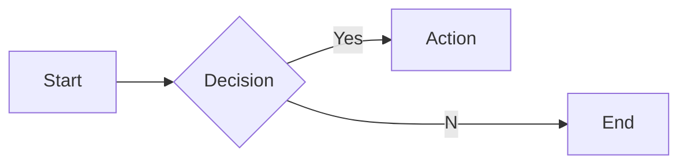
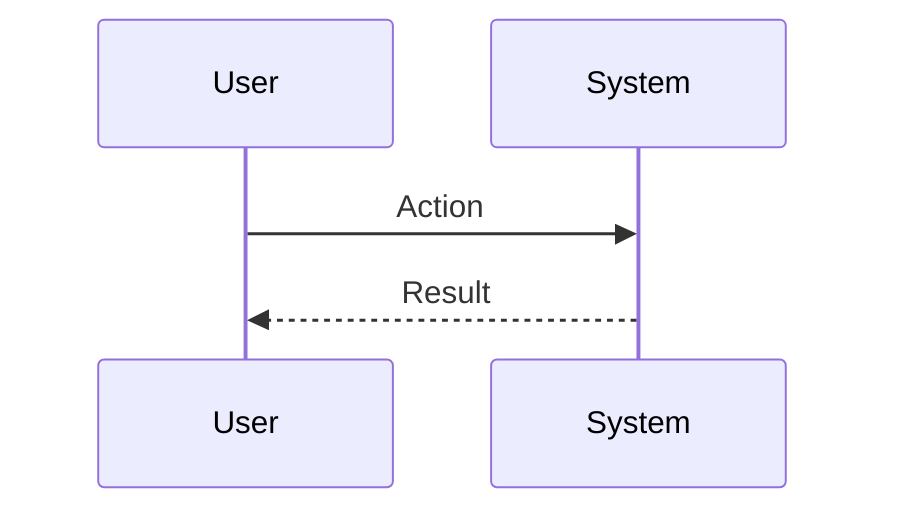

# Interview Questions: VP of Design (ROLE)

This document contains 100 interview questions tailored for the VP of Design role. The questions are designed to assess technical skills, soft skills, and cultural fit.

---

## 1. Design Systems

**Scenario:** Consistency.

**Question:** Why invest in a Design System?

**Key Concepts:** `UI/UX`, `Efficiency`

### Candidate Response Paths
*   **Junior**: It looks nice.
*   **Senior**: Scalability, consistency, and speed of development.

---

## 2. Accessibility

**Scenario:** WCAG.

**Question:** How do you design for accessibility?

**Key Concepts:** `A11y`, `Inclusivity`

### Candidate Response Paths
*   **Junior**: Contrast check.
*   **Senior**: Keyboard navigation, screen reader compatibility, and color blind modes.

---

## 3. User Research

**Scenario:** Validation.

**Question:** When should you conduct user research?

**Key Concepts:** `Research`, `Process`

### Candidate Response Paths
*   **Junior**: At the beginning.
*   **Senior**: Continuously throughout the product lifecycle (Discovery, Testing, Validation).

---

## 4. Handloff

**Scenario:** Dev collaboration.

**Question:** How do you ensure a smooth handoff to engineering?

**Key Concepts:** `Collaboration`, `Process`

### Candidate Response Paths
*   **Junior**: Send the Figma file.
*   **Senior**: Detailed specs, prototypes, and walkthroughs with devs.

---

## 5. Critique

**Scenario:** Feedback.

**Question:** How do you handle design critique?

**Key Concepts:** `Feedback`, `Growth`

### Candidate Response Paths
*   **Junior**: Defend my work.
*   **Senior**: Separate self from work, look for 'why', and iterate.

---

## 6. Tools

**Scenario:** Figma.

**Question:** What is your workflow in Figma?

**Key Concepts:** `Tools`, `Workflow`

### Candidate Response Paths
*   **Junior**: I draw shapes.
*   **Senior**: Components, Auto Layout, Variants, and organized layers.

---

## 7. Mobile Design

**Scenario:** Responsive.

**Question:** What are the key considerations for mobile-first design?

| Metric | Target | Status |
|---|---|---|
| KPI 1 | 100% | Green |
| KPI 2 | < 5% | Yellow |

**Key Concepts:** `Mobile`, `UX`

### Candidate Response Paths
*   **Junior**: Make it smaller.
*   **Senior**: Touch targets, gestures, and content hierarchy.

---

## 8. Prototyping

**Scenario:** Interaction.

**Question:** Why is prototyping important?

**Key Concepts:** `Prototyping`, `Validation`

### Candidate Response Paths
*   **Junior**: To show animations.
*   **Senior**: To test flow and interaction before expensive coding starts.

---

## 9. Data

**Scenario:** Metrics.

**Question:** How do you use data to inform design?

**Key Concepts:** `Data`, `UX`

### Candidate Response Paths
*   **Junior**: Look at clicks.
*   **Senior**: Heatmaps, conversion funnels, and A/B test results.

---

## 10. Empathy

**Scenario:** User needs.

**Question:** How do you build empathy for the user?

**Key Concepts:** `Empathy`, `Research`

### Candidate Response Paths
*   **Junior**: Imagine I am them.
*   **Senior**: Observation, interviews, and personas.

---

## 11. Conflict Resolution

**Scenario:** Disagreement with a peer.

**Question:** Tell me about a time you had a significant disagreement with a colleague. How did you resolve it?

**Key Concepts:** `Communication`, `Soft Skills`

### Candidate Response Paths
*   **Junior**: I told them I was right.
*   **Senior**: I listened to their perspective, found common ground, and we compromised.

---

## 12. Failure Handling

**Scenario:** A project went wrong.

**Question:** Describe a time you failed. What happened and what did you learn?

**Key Concepts:** `Growth Mindset`, `Resilience`

### Candidate Response Paths
*   **Junior**: I tried hard but it failed.
*   **Senior**: I analyzed the root cause, implemented a fix, and shared the learning.

---

## 13. Prioritization

**Scenario:** Too many tasks.

**Question:** How do you prioritize when you have multiple conflicting deadlines?

**Key Concepts:** `Time Management`, `Organization`

### Candidate Response Paths
*   **Junior**: I work longer hours.
*   **Senior**: I communicate with stakeholders to adjust expectations and focus on high-impact tasks.

---

## 14. Adaptability

**Scenario:** Changing requirements.

**Question:** How do you handle sudden changes in project scope or direction?

| Metric | Target | Status |
|---|---|---|
| KPI 1 | 100% | Green |
| KPI 2 | < 5% | Yellow |

**Key Concepts:** `Agility`, `Flexibility`

### Candidate Response Paths
*   **Junior**: I get frustrated but do it.
*   **Senior**: I assess the impact, communicate risks, and pivot quickly.

---

## 15. Communication

**Scenario:** Explaining complex topics.

**Question:** Describe a time you had to explain a complex technical/business concept to a non-expert.

**Key Concepts:** `Clarity`, `Empathy`

### Candidate Response Paths
*   **Junior**: I just said it simpler.
*   **Senior**: I used analogies and checked for understanding throughout.

---

## 16. Teamwork

**Scenario:** Collaborating with difficult personalities.

**Question:** How do you handle working with someone who is difficult to work with?

**Key Concepts:** `Collaboration`, `EQ`

### Candidate Response Paths
*   **Junior**: I avoid them.
*   **Senior**: I try to understand their motivations and find a way to work together effectively.

---

## 17. Innovation

**Scenario:** Improving a process.

**Question:** Tell me about a time you improved a process or workflow.

**Key Concepts:** `Innovation`, `Efficiency`

### Candidate Response Paths
*   **Junior**: I followed the rules.
*   **Senior**: I identified a bottleneck, proposed a solution, and measured the improvement.

---

## 18. Feedback

**Scenario:** Receiving constructive criticism.

**Question:** Tell me about a time you received difficult feedback. How did you react?

**Key Concepts:** `Self-awareness`, `Growth`

### Candidate Response Paths
*   **Junior**: I got defensive.
*   **Senior**: I listened, asked for examples, and worked on a plan to improve.

---

## 19. Leadership

**Scenario:** Leading without authority.

**Question:** Describe a time you demonstrated leadership when you weren't the formal manager.

**Key Concepts:** `Leadership`, `Influence`

### Candidate Response Paths
*   **Junior**: I told people what to do.
*   **Senior**: I rallied the team around a goal and supported them to achieve it.

---

## 20. Decision Making

**Scenario:** Incomplete information.

**Question:** How do you make decisions when you don't have all the data?

**Key Concepts:** `Judgment`, `Risk Mgmt`

### Candidate Response Paths
*   **Junior**: I wait for all data.
*   **Senior**: I assess the risk, make a call based on available info, and adjust as needed.

---

## 21. Collaboration in Web Design

**Scenario:** Teamwork.

**Question:** How does Web Design require cross-functional collaboration?

| Metric | Target | Status |
|---|---|---|
| KPI 1 | 100% | Green |
| KPI 2 | < 5% | Yellow |

**Key Concepts:** `Web Design`, `Collaboration`

### Candidate Response Paths
*   **Junior**: I talk to people.
*   **Senior**: Alignment with other depts and shared goals.

---

## 22. Deep Dive: Prototyping

**Scenario:** Assessing depth in Prototyping.

**Question:** Can you explain Prototyping in detail and how you have applied it in your past role?

**Key Concepts:** `Prototyping`, `Experience`

### Candidate Response Paths
*   **Junior**: Basic definition.
*   **Senior**: Deep practical application and nuances.

---

## 23. Challenges in Prototyping

**Scenario:** Problem Solving.

**Question:** What are the biggest challenges you've faced regarding Prototyping?

**Key Concepts:** `Prototyping`, `Problem Solving`

### Candidate Response Paths
*   **Junior**: It was hard.
*   **Senior**: Specific examples of obstacles and strategies to overcome them.

---

## 24. Collaboration in Color Theory

**Scenario:** Teamwork.

**Question:** How does Color Theory require cross-functional collaboration?

**Key Concepts:** `Color Theory`, `Collaboration`

### Candidate Response Paths
*   **Junior**: I talk to people.
*   **Senior**: Alignment with other depts and shared goals.

---

## 25. Teaching User Testing

**Scenario:** Mentorship.

**Question:** How would you teach User Testing to a junior team member?

**Key Concepts:** `User Testing`, `Mentorship`

### Candidate Response Paths
*   **Junior**: Send them a link.
*   **Senior**: Structured learning path and hands-on practice.

---

## 26. Scaling Figma

**Scenario:** Growth.

**Question:** How do you scale Figma as the company grows?

**Key Concepts:** `Figma`, `Scale`

### Candidate Response Paths
*   **Junior**: Hire more people.
*   **Senior**: Process automation, documentation, and leverage.

---

## 27. Mistakes in Figma

**Scenario:** Learning.

**Question:** What common mistakes do people make with Figma?

**Key Concepts:** `Figma`, `Experience`

### Candidate Response Paths
*   **Junior**: Doing it wrong.
*   **Senior**: Subtle pitfalls and how to avoid them.

---

## 28. Start vs Scale for Figma

**Scenario:** Context.

**Question:** How does your approach to Figma differ in a startup vs a large corp?

| Metric | Target | Status |
|---|---|---|
| KPI 1 | 100% | Green |
| KPI 2 | < 5% | Yellow |

**Key Concepts:** `Figma`, `Context`

### Candidate Response Paths
*   **Junior**: It's the same.
*   **Senior**: Speed/Chaos vs Process/Stability.

---

## 29. Collaboration in Animation

**Scenario:** Teamwork.

**Question:** How does Animation require cross-functional collaboration?

**Key Concepts:** `Animation`, `Collaboration`

### Candidate Response Paths
*   **Junior**: I talk to people.
*   **Senior**: Alignment with other depts and shared goals.

---

## 30. Collaboration in Usability

**Scenario:** Teamwork.

**Question:** How does Usability require cross-functional collaboration?

**Key Concepts:** `Usability`, `Collaboration`

### Candidate Response Paths
*   **Junior**: I talk to people.
*   **Senior**: Alignment with other depts and shared goals.

---

## 31. Deep Dive: Usability

**Scenario:** Assessing depth in Usability.

**Question:** Can you explain Usability in detail and how you have applied it in your past role?

**Key Concepts:** `Usability`, `Experience`

### Candidate Response Paths
*   **Junior**: Basic definition.
*   **Senior**: Deep practical application and nuances.

---

## 32. Accessibility Best Practices

**Scenario:** Standardization.

**Question:** What are the industry best practices for Accessibility?

**Key Concepts:** `Accessibility`, `Standards`

### Candidate Response Paths
*   **Junior**: List a few.
*   **Senior**: Discusses why they are best practices and when to break them.

---

## 33. Teaching Interaction Design

**Scenario:** Mentorship.

**Question:** How would you teach Interaction Design to a junior team member?

**Key Concepts:** `Interaction Design`, `Mentorship`

### Candidate Response Paths
*   **Junior**: Send them a link.
*   **Senior**: Structured learning path and hands-on practice.

---

## 34. Teaching Accessibility

**Scenario:** Mentorship.

**Question:** How would you teach Accessibility to a junior team member?

**Key Concepts:** `Accessibility`, `Mentorship`

### Candidate Response Paths
*   **Junior**: Send them a link.
*   **Senior**: Structured learning path and hands-on practice.

---

## 35. Scaling Typography

**Scenario:** Growth.

**Question:** How do you scale Typography as the company grows?

| Metric | Target | Status |
|---|---|---|
| KPI 1 | 100% | Green |
| KPI 2 | < 5% | Yellow |

**Key Concepts:** `Typography`, `Scale`

### Candidate Response Paths
*   **Junior**: Hire more people.
*   **Senior**: Process automation, documentation, and leverage.

---

## 36. Ethics in Web Design

**Scenario:** Ethics.

**Question:** What are the ethical considerations regarding Web Design?

**Key Concepts:** `Web Design`, `Ethics`

### Candidate Response Paths
*   **Junior**: Be nice.
*   **Senior**: Privacy, bias, and societal impact.

---

## 37. Challenges in User Testing

**Scenario:** Problem Solving.

**Question:** What are the biggest challenges you've faced regarding User Testing?

**Key Concepts:** `User Testing`, `Problem Solving`

### Candidate Response Paths
*   **Junior**: It was hard.
*   **Senior**: Specific examples of obstacles and strategies to overcome them.

---

## 38. Challenges in Accessibility

**Scenario:** Problem Solving.

**Question:** What are the biggest challenges you've faced regarding Accessibility?

**Key Concepts:** `Accessibility`, `Problem Solving`

### Candidate Response Paths
*   **Junior**: It was hard.
*   **Senior**: Specific examples of obstacles and strategies to overcome them.

---

## 39. Start vs Scale for Animation

**Scenario:** Context.

**Question:** How does your approach to Animation differ in a startup vs a large corp?

**Key Concepts:** `Animation`, `Context`

### Candidate Response Paths
*   **Junior**: It's the same.
*   **Senior**: Speed/Chaos vs Process/Stability.

---

## 40. Teaching Mobile Design

**Scenario:** Mentorship.

**Question:** How would you teach Mobile Design to a junior team member?

**Key Concepts:** `Mobile Design`, `Mentorship`

### Candidate Response Paths
*   **Junior**: Send them a link.
*   **Senior**: Structured learning path and hands-on practice.

---

## 41. Metrics for Prototyping

**Scenario:** Measurement.

**Question:** How do you measure success in Prototyping?

**Key Concepts:** `Prototyping`, `Analytics`

### Candidate Response Paths
*   **Junior**: I guess.
*   **Senior**: Specific KPIs and leading/lagging indicators.

---

## 42. Challenges in Layout

**Scenario:** Problem Solving.

**Question:** What are the biggest challenges you've faced regarding Layout?

| Metric | Target | Status |
|---|---|---|
| KPI 1 | 100% | Green |
| KPI 2 | < 5% | Yellow |

**Key Concepts:** `Layout`, `Problem Solving`

### Candidate Response Paths
*   **Junior**: It was hard.
*   **Senior**: Specific examples of obstacles and strategies to overcome them.

---

## 43. Collaboration in Design Systems

**Scenario:** Teamwork.

**Question:** How does Design Systems require cross-functional collaboration?

**Key Concepts:** `Design Systems`, `Collaboration`

### Candidate Response Paths
*   **Junior**: I talk to people.
*   **Senior**: Alignment with other depts and shared goals.

---

## 44. Metrics for Figma

**Scenario:** Measurement.

**Question:** How do you measure success in Figma?

**Key Concepts:** `Figma`, `Analytics`

### Candidate Response Paths
*   **Junior**: I guess.
*   **Senior**: Specific KPIs and leading/lagging indicators.

---

## 45. Ethics in Mobile Design

**Scenario:** Ethics.

**Question:** What are the ethical considerations regarding Mobile Design?

**Key Concepts:** `Mobile Design`, `Ethics`

### Candidate Response Paths
*   **Junior**: Be nice.
*   **Senior**: Privacy, bias, and societal impact.

---

## 46. Deep Dive: Mobile Design

**Scenario:** Assessing depth in Mobile Design.

**Question:** Can you explain Mobile Design in detail and how you have applied it in your past role?

**Key Concepts:** `Mobile Design`, `Experience`

### Candidate Response Paths
*   **Junior**: Basic definition.
*   **Senior**: Deep practical application and nuances.

---

## 47. Collaboration in Wireframing

**Scenario:** Teamwork.

**Question:** How does Wireframing require cross-functional collaboration?

**Key Concepts:** `Wireframing`, `Collaboration`

### Candidate Response Paths
*   **Junior**: I talk to people.
*   **Senior**: Alignment with other depts and shared goals.

---

## 48. Scaling Prototyping

**Scenario:** Growth.

**Question:** How do you scale Prototyping as the company grows?

**Key Concepts:** `Prototyping`, `Scale`

### Candidate Response Paths
*   **Junior**: Hire more people.
*   **Senior**: Process automation, documentation, and leverage.

---

## 49. Mistakes in Design Systems

**Scenario:** Learning.

**Question:** What common mistakes do people make with Design Systems?

| Metric | Target | Status |
|---|---|---|
| KPI 1 | 100% | Green |
| KPI 2 | < 5% | Yellow |

**Key Concepts:** `Design Systems`, `Experience`

### Candidate Response Paths
*   **Junior**: Doing it wrong.
*   **Senior**: Subtle pitfalls and how to avoid them.

---

## 50. Teaching Prototyping

**Scenario:** Mentorship.

**Question:** How would you teach Prototyping to a junior team member?

**Key Concepts:** `Prototyping`, `Mentorship`

### Candidate Response Paths
*   **Junior**: Send them a link.
*   **Senior**: Structured learning path and hands-on practice.

---

## 51. Future of Mobile Design

**Scenario:** Trends.

**Question:** Where do you see Mobile Design heading in the next 5 years?

**Key Concepts:** `Mobile Design`, `Vision`

### Candidate Response Paths
*   **Junior**: It will get better.
*   **Senior**: Emerging trends, AI impact, and market shifts.

---

## 52. Mistakes in Accessibility

**Scenario:** Learning.

**Question:** What common mistakes do people make with Accessibility?

**Key Concepts:** `Accessibility`, `Experience`

### Candidate Response Paths
*   **Junior**: Doing it wrong.
*   **Senior**: Subtle pitfalls and how to avoid them.

---

## 53. Collaboration in Information Arch

**Scenario:** Teamwork.

**Question:** How does Information Arch require cross-functional collaboration?

**Key Concepts:** `Information Arch`, `Collaboration`

### Candidate Response Paths
*   **Junior**: I talk to people.
*   **Senior**: Alignment with other depts and shared goals.

---

## 54. Tooling: Usability

**Scenario:** Proficiency.

**Question:** How do you utilize Usability to improve efficiency?

**Key Concepts:** `Usability`, `Productivity`

### Candidate Response Paths
*   **Junior**: I use it daily.
*   **Senior**: Advanced features and automation.

---

## 55. Start vs Scale for Prototyping

**Scenario:** Context.

**Question:** How does your approach to Prototyping differ in a startup vs a large corp?

**Key Concepts:** `Prototyping`, `Context`

### Candidate Response Paths
*   **Junior**: It's the same.
*   **Senior**: Speed/Chaos vs Process/Stability.

---

## 56. Metrics for Web Design

**Scenario:** Measurement.

**Question:** How do you measure success in Web Design?

| Metric | Target | Status |
|---|---|---|
| KPI 1 | 100% | Green |
| KPI 2 | < 5% | Yellow |

**Key Concepts:** `Web Design`, `Analytics`

### Candidate Response Paths
*   **Junior**: I guess.
*   **Senior**: Specific KPIs and leading/lagging indicators.

---

## 57. Teaching Figma

**Scenario:** Mentorship.

**Question:** How would you teach Figma to a junior team member?

**Key Concepts:** `Figma`, `Mentorship`

### Candidate Response Paths
*   **Junior**: Send them a link.
*   **Senior**: Structured learning path and hands-on practice.

---

## 58. Future of Information Arch

**Scenario:** Trends.

**Question:** Where do you see Information Arch heading in the next 5 years?

**Key Concepts:** `Information Arch`, `Vision`

### Candidate Response Paths
*   **Junior**: It will get better.
*   **Senior**: Emerging trends, AI impact, and market shifts.

---

## 59. Start vs Scale for Typography

**Scenario:** Context.

**Question:** How does your approach to Typography differ in a startup vs a large corp?

**Key Concepts:** `Typography`, `Context`

### Candidate Response Paths
*   **Junior**: It's the same.
*   **Senior**: Speed/Chaos vs Process/Stability.

---

## 60. Mistakes in Usability

**Scenario:** Learning.

**Question:** What common mistakes do people make with Usability?

**Key Concepts:** `Usability`, `Experience`

### Candidate Response Paths
*   **Junior**: Doing it wrong.
*   **Senior**: Subtle pitfalls and how to avoid them.

---

## 61. Deep Dive: Design Systems

**Scenario:** Assessing depth in Design Systems.

**Question:** Can you explain Design Systems in detail and how you have applied it in your past role?

**Key Concepts:** `Design Systems`, `Experience`

### Candidate Response Paths
*   **Junior**: Basic definition.
*   **Senior**: Deep practical application and nuances.

---

## 62. Start vs Scale for Interaction Design

**Scenario:** Context.

**Question:** How does your approach to Interaction Design differ in a startup vs a large corp?

**Key Concepts:** `Interaction Design`, `Context`

### Candidate Response Paths
*   **Junior**: It's the same.
*   **Senior**: Speed/Chaos vs Process/Stability.

---

## 63. Ethics in Accessibility

**Scenario:** Ethics.

**Question:** What are the ethical considerations regarding Accessibility?

| Metric | Target | Status |
|---|---|---|
| KPI 1 | 100% | Green |
| KPI 2 | < 5% | Yellow |

**Key Concepts:** `Accessibility`, `Ethics`

### Candidate Response Paths
*   **Junior**: Be nice.
*   **Senior**: Privacy, bias, and societal impact.

---

## 64. Deep Dive: Color Theory

**Scenario:** Assessing depth in Color Theory.

**Question:** Can you explain Color Theory in detail and how you have applied it in your past role?

**Key Concepts:** `Color Theory`, `Experience`

### Candidate Response Paths
*   **Junior**: Basic definition.
*   **Senior**: Deep practical application and nuances.

---

## 65. Collaboration in Figma

**Scenario:** Teamwork.

**Question:** How does Figma require cross-functional collaboration?

**Key Concepts:** `Figma`, `Collaboration`

### Candidate Response Paths
*   **Junior**: I talk to people.
*   **Senior**: Alignment with other depts and shared goals.

---

## 66. Scaling Web Design

**Scenario:** Growth.

**Question:** How do you scale Web Design as the company grows?

**Key Concepts:** `Web Design`, `Scale`

### Candidate Response Paths
*   **Junior**: Hire more people.
*   **Senior**: Process automation, documentation, and leverage.

---

## 67. Teaching Usability

**Scenario:** Mentorship.

**Question:** How would you teach Usability to a junior team member?

**Key Concepts:** `Usability`, `Mentorship`

### Candidate Response Paths
*   **Junior**: Send them a link.
*   **Senior**: Structured learning path and hands-on practice.

---

## 68. Future of Color Theory

**Scenario:** Trends.

**Question:** Where do you see Color Theory heading in the next 5 years?

**Key Concepts:** `Color Theory`, `Vision`

### Candidate Response Paths
*   **Junior**: It will get better.
*   **Senior**: Emerging trends, AI impact, and market shifts.

---

## 69. Collaboration in Typography

**Scenario:** Teamwork.

**Question:** How does Typography require cross-functional collaboration?

**Key Concepts:** `Typography`, `Collaboration`

### Candidate Response Paths
*   **Junior**: I talk to people.
*   **Senior**: Alignment with other depts and shared goals.

---

## 70. Scaling Color Theory

**Scenario:** Growth.

**Question:** How do you scale Color Theory as the company grows?

| Metric | Target | Status |
|---|---|---|
| KPI 1 | 100% | Green |
| KPI 2 | < 5% | Yellow |

**Key Concepts:** `Color Theory`, `Scale`

### Candidate Response Paths
*   **Junior**: Hire more people.
*   **Senior**: Process automation, documentation, and leverage.

---

## 71. Mistakes in User Testing

**Scenario:** Learning.

**Question:** What common mistakes do people make with User Testing?

**Key Concepts:** `User Testing`, `Experience`

### Candidate Response Paths
*   **Junior**: Doing it wrong.
*   **Senior**: Subtle pitfalls and how to avoid them.

---

## 72. Deep Dive: Interaction Design

**Scenario:** Assessing depth in Interaction Design.

**Question:** Can you explain Interaction Design in detail and how you have applied it in your past role?

**Key Concepts:** `Interaction Design`, `Experience`

### Candidate Response Paths
*   **Junior**: Basic definition.
*   **Senior**: Deep practical application and nuances.

---

## 73. Mistakes in Web Design

**Scenario:** Learning.

**Question:** What common mistakes do people make with Web Design?

**Key Concepts:** `Web Design`, `Experience`

### Candidate Response Paths
*   **Junior**: Doing it wrong.
*   **Senior**: Subtle pitfalls and how to avoid them.

---

## 74. Tooling: Animation

**Scenario:** Proficiency.

**Question:** How do you utilize Animation to improve efficiency?

**Key Concepts:** `Animation`, `Productivity`

### Candidate Response Paths
*   **Junior**: I use it daily.
*   **Senior**: Advanced features and automation.

---

## 75. Challenges in Mobile Design

**Scenario:** Problem Solving.

**Question:** What are the biggest challenges you've faced regarding Mobile Design?

**Key Concepts:** `Mobile Design`, `Problem Solving`

### Candidate Response Paths
*   **Junior**: It was hard.
*   **Senior**: Specific examples of obstacles and strategies to overcome them.

---

## 76. Prototyping Best Practices

**Scenario:** Standardization.

**Question:** What are the industry best practices for Prototyping?

**Key Concepts:** `Prototyping`, `Standards`

### Candidate Response Paths
*   **Junior**: List a few.
*   **Senior**: Discusses why they are best practices and when to break them.

---

## 77. Deep Dive: Information Arch

**Scenario:** Assessing depth in Information Arch.

**Question:** Can you explain Information Arch in detail and how you have applied it in your past role?

| Metric | Target | Status |
|---|---|---|
| KPI 1 | 100% | Green |
| KPI 2 | < 5% | Yellow |

**Key Concepts:** `Information Arch`, `Experience`

### Candidate Response Paths
*   **Junior**: Basic definition.
*   **Senior**: Deep practical application and nuances.

---

## 78. Metrics for Design Systems

**Scenario:** Measurement.

**Question:** How do you measure success in Design Systems?

**Key Concepts:** `Design Systems`, `Analytics`

### Candidate Response Paths
*   **Junior**: I guess.
*   **Senior**: Specific KPIs and leading/lagging indicators.

---

## 79. Collaboration in Accessibility

**Scenario:** Teamwork.

**Question:** How does Accessibility require cross-functional collaboration?

**Key Concepts:** `Accessibility`, `Collaboration`

### Candidate Response Paths
*   **Junior**: I talk to people.
*   **Senior**: Alignment with other depts and shared goals.

---

## 80. Start vs Scale for Accessibility

**Scenario:** Context.

**Question:** How does your approach to Accessibility differ in a startup vs a large corp?

**Key Concepts:** `Accessibility`, `Context`

### Candidate Response Paths
*   **Junior**: It's the same.
*   **Senior**: Speed/Chaos vs Process/Stability.

---

## 81. Metrics for Interaction Design

**Scenario:** Measurement.

**Question:** How do you measure success in Interaction Design?

**Key Concepts:** `Interaction Design`, `Analytics`

### Candidate Response Paths
*   **Junior**: I guess.
*   **Senior**: Specific KPIs and leading/lagging indicators.

---

## 82. Teaching Design Systems

**Scenario:** Mentorship.

**Question:** How would you teach Design Systems to a junior team member?

**Key Concepts:** `Design Systems`, `Mentorship`

### Candidate Response Paths
*   **Junior**: Send them a link.
*   **Senior**: Structured learning path and hands-on practice.

---

## 83. Metrics for Information Arch

**Scenario:** Measurement.

**Question:** How do you measure success in Information Arch?

**Key Concepts:** `Information Arch`, `Analytics`

### Candidate Response Paths
*   **Junior**: I guess.
*   **Senior**: Specific KPIs and leading/lagging indicators.

---

## 84. Tooling: Web Design

**Scenario:** Proficiency.

**Question:** How do you utilize Web Design to improve efficiency?

| Metric | Target | Status |
|---|---|---|
| KPI 1 | 100% | Green |
| KPI 2 | < 5% | Yellow |

**Key Concepts:** `Web Design`, `Productivity`

### Candidate Response Paths
*   **Junior**: I use it daily.
*   **Senior**: Advanced features and automation.

---

## 85. Start vs Scale for Usability

**Scenario:** Context.

**Question:** How does your approach to Usability differ in a startup vs a large corp?

**Key Concepts:** `Usability`, `Context`

### Candidate Response Paths
*   **Junior**: It's the same.
*   **Senior**: Speed/Chaos vs Process/Stability.

---

## 86. Future of Wireframing

**Scenario:** Trends.

**Question:** Where do you see Wireframing heading in the next 5 years?

**Key Concepts:** `Wireframing`, `Vision`

### Candidate Response Paths
*   **Junior**: It will get better.
*   **Senior**: Emerging trends, AI impact, and market shifts.

---

## 87. Deep Dive: Figma

**Scenario:** Assessing depth in Figma.

**Question:** Can you explain Figma in detail and how you have applied it in your past role?

**Key Concepts:** `Figma`, `Experience`

### Candidate Response Paths
*   **Junior**: Basic definition.
*   **Senior**: Deep practical application and nuances.

---

## 88. Collaboration in Interaction Design

**Scenario:** Teamwork.

**Question:** How does Interaction Design require cross-functional collaboration?

**Key Concepts:** `Interaction Design`, `Collaboration`

### Candidate Response Paths
*   **Junior**: I talk to people.
*   **Senior**: Alignment with other depts and shared goals.

---

## 89. Future of Figma

**Scenario:** Trends.

**Question:** Where do you see Figma heading in the next 5 years?

**Key Concepts:** `Figma`, `Vision`

### Candidate Response Paths
*   **Junior**: It will get better.
*   **Senior**: Emerging trends, AI impact, and market shifts.

---

## 90. Mobile Design Best Practices

**Scenario:** Standardization.

**Question:** What are the industry best practices for Mobile Design?

**Key Concepts:** `Mobile Design`, `Standards`

### Candidate Response Paths
*   **Junior**: List a few.
*   **Senior**: Discusses why they are best practices and when to break them.

---

## 91. Teaching Information Arch

**Scenario:** Mentorship.

**Question:** How would you teach Information Arch to a junior team member?

| Metric | Target | Status |
|---|---|---|
| KPI 1 | 100% | Green |
| KPI 2 | < 5% | Yellow |

**Key Concepts:** `Information Arch`, `Mentorship`

### Candidate Response Paths
*   **Junior**: Send them a link.
*   **Senior**: Structured learning path and hands-on practice.

---

## 92. Metrics for Accessibility

**Scenario:** Measurement.

**Question:** How do you measure success in Accessibility?

**Key Concepts:** `Accessibility`, `Analytics`

### Candidate Response Paths
*   **Junior**: I guess.
*   **Senior**: Specific KPIs and leading/lagging indicators.

---

## 93. Tooling: Design Systems

**Scenario:** Proficiency.

**Question:** How do you utilize Design Systems to improve efficiency?

**Key Concepts:** `Design Systems`, `Productivity`

### Candidate Response Paths
*   **Junior**: I use it daily.
*   **Senior**: Advanced features and automation.

---

## 94. Wireframing Best Practices

**Scenario:** Standardization.

**Question:** What are the industry best practices for Wireframing?

**Key Concepts:** `Wireframing`, `Standards`

### Candidate Response Paths
*   **Junior**: List a few.
*   **Senior**: Discusses why they are best practices and when to break them.

---

## 95. Start vs Scale for Wireframing

**Scenario:** Context.

**Question:** How does your approach to Wireframing differ in a startup vs a large corp?

**Key Concepts:** `Wireframing`, `Context`

### Candidate Response Paths
*   **Junior**: It's the same.
*   **Senior**: Speed/Chaos vs Process/Stability.

---

## 96. Mistakes in Layout

**Scenario:** Learning.

**Question:** What common mistakes do people make with Layout?

**Key Concepts:** `Layout`, `Experience`

### Candidate Response Paths
*   **Junior**: Doing it wrong.
*   **Senior**: Subtle pitfalls and how to avoid them.

---

## 97. Challenges in Color Theory

**Scenario:** Problem Solving.

**Question:** What are the biggest challenges you've faced regarding Color Theory?

**Key Concepts:** `Color Theory`, `Problem Solving`

### Candidate Response Paths
*   **Junior**: It was hard.
*   **Senior**: Specific examples of obstacles and strategies to overcome them.

---

## 98. Web Design Best Practices

**Scenario:** Standardization.

**Question:** What are the industry best practices for Web Design?

| Metric | Target | Status |
|---|---|---|
| KPI 1 | 100% | Green |
| KPI 2 | < 5% | Yellow |

**Key Concepts:** `Web Design`, `Standards`

### Candidate Response Paths
*   **Junior**: List a few.
*   **Senior**: Discusses why they are best practices and when to break them.

---

## 99. Challenges in Wireframing

**Scenario:** Problem Solving.

**Question:** What are the biggest challenges you've faced regarding Wireframing?

**Key Concepts:** `Wireframing`, `Problem Solving`

### Candidate Response Paths
*   **Junior**: It was hard.
*   **Senior**: Specific examples of obstacles and strategies to overcome them.

---

## 100. Challenges in Interaction Design

**Scenario:** Problem Solving.

**Question:** What are the biggest challenges you've faced regarding Interaction Design?

**Key Concepts:** `Interaction Design`, `Problem Solving`

### Candidate Response Paths
*   **Junior**: It was hard.
*   **Senior**: Specific examples of obstacles and strategies to overcome them.

---
