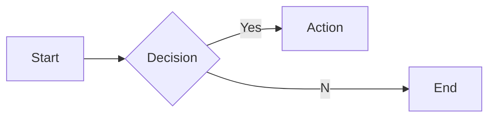
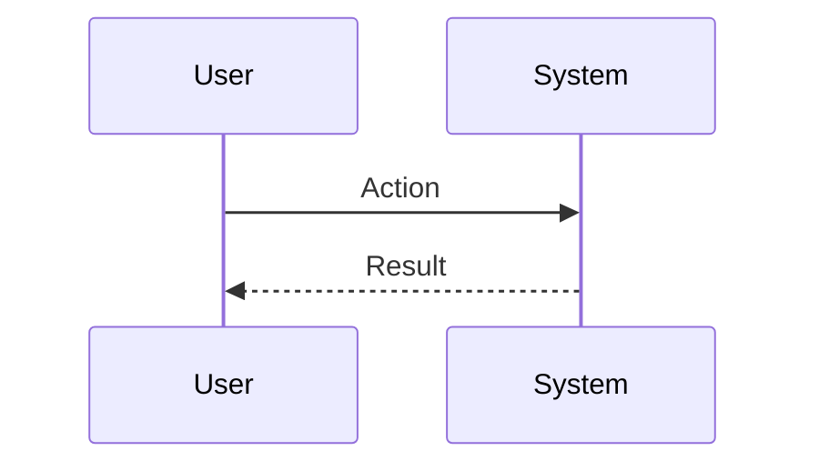

# Interview Questions: Sales Dev Rep (ROLE)

This document contains 100 interview questions tailored for the Sales Dev Rep role. The questions are designed to assess technical skills, soft skills, and cultural fit.

---

## 1. Brand vs Performance

**Scenario:** Budget allocation.

**Question:** How do you balance Brand Marketing vs Performance Marketing?

**Key Concepts:** `Strategy`, `Budgeting`

### Candidate Response Paths
*   **Junior**: All in on ads.
*   **Senior**: Performance for short term, Brand for long term CAC reduction.

---

## 2. SEO Strategy

**Scenario:** Organic growth.

**Question:** What are the pillars of a strong SEO strategy?

**Key Concepts:** `SEO`, `Content`

### Candidate Response Paths
*   **Junior**: Keywords.
*   **Senior**: Technical SEO, Content Quality, and Backlink Authority.

---

## 3. Funnel Optimization

**Scenario:** Conversion rates.

**Question:** How do you optimize the marketing funnel?

**Key Concepts:** `CRO`, `Analytics`

### Candidate Response Paths
*   **Junior**: More traffic.
*   **Senior**: Analyzing drop-off points and A/B testing landing pages.

---

## 4. Content Strategy

**Scenario:** Thought leadership.

**Question:** How do you measure the success of content marketing?

**Key Concepts:** `Content`, `Metrics`

### Candidate Response Paths
*   **Junior**: Views.
*   **Senior**: Engagement, Leads generated, and attribution to revenue.

---

## 5. Social Media

**Scenario:** B2B vs B2C.

**Question:** How does your social media strategy differ for B2B vs B2C?

**Key Concepts:** `Social`, `Strategy`

### Candidate Response Paths
*   **Junior**: Same strategy.
*   **Senior**: B2B focuses on LinkedIn/Education, B2C on emotion/Instagram/TikTok.

---

## 6. Email Marketing

**Scenario:** Nurture.

**Question:** What makes an effective email nurture sequence?

**Key Concepts:** `Email`, `Automation`

### Candidate Response Paths
*   **Junior**: Send lots of emails.
*   **Senior**: Segmentation, personalization, and value-add content (not just sales pitches).

---

## 7. Product Marketing

**Scenario:** Launch.

**Question:** How do you position a new product in a crowded market?

| Metric | Target | Status |
|---|---|---|
| KPI 1 | 100% | Green |
| KPI 2 | < 5% | Yellow |

**Key Concepts:** `PMM`, `Positioning`

### Candidate Response Paths
*   **Junior**: Say we are better.
*   **Senior**: Find the unique differentiator, target a specific wedge, and craft a compelling narrative.

---

## 8. Analytics

**Scenario:** Attribution.

**Question:** How do you handle multi-touch attribution?

**Key Concepts:** `Data`, `Attribution`

### Candidate Response Paths
*   **Junior**: Last click.
*   **Senior**: Using models (Time decay, U-shaped) to understand the full customer journey.

---

## 9. Budgeting

**Scenario:** ROI.

**Question:** How do you justify your marketing budget to the CFO?

**Key Concepts:** `Finance`, `ROI`

### Candidate Response Paths
*   **Junior**: We need brand awareness.
*   **Senior**: Show CAC, LTV, and payback period projections.

---

## 10. Events

**Scenario:** Conference.

**Question:** How do you maximize ROI from a trade show?

**Key Concepts:** `Events`, `Sales Alignment`

### Candidate Response Paths
*   **Junior**: Get a booth.
*   **Senior**: Pre-show outreach, booth engagement strategy, and immediate post-show follow-up.

---

## 11. Conflict Resolution

**Scenario:** Disagreement with a peer.

**Question:** Tell me about a time you had a significant disagreement with a colleague. How did you resolve it?

**Key Concepts:** `Communication`, `Soft Skills`

### Candidate Response Paths
*   **Junior**: I told them I was right.
*   **Senior**: I listened to their perspective, found common ground, and we compromised.

---

## 12. Failure Handling

**Scenario:** A project went wrong.

**Question:** Describe a time you failed. What happened and what did you learn?

**Key Concepts:** `Growth Mindset`, `Resilience`

### Candidate Response Paths
*   **Junior**: I tried hard but it failed.
*   **Senior**: I analyzed the root cause, implemented a fix, and shared the learning.

---

## 13. Prioritization

**Scenario:** Too many tasks.

**Question:** How do you prioritize when you have multiple conflicting deadlines?

**Key Concepts:** `Time Management`, `Organization`

### Candidate Response Paths
*   **Junior**: I work longer hours.
*   **Senior**: I communicate with stakeholders to adjust expectations and focus on high-impact tasks.

---

## 14. Adaptability

**Scenario:** Changing requirements.

**Question:** How do you handle sudden changes in project scope or direction?

| Metric | Target | Status |
|---|---|---|
| KPI 1 | 100% | Green |
| KPI 2 | < 5% | Yellow |

**Key Concepts:** `Agility`, `Flexibility`

### Candidate Response Paths
*   **Junior**: I get frustrated but do it.
*   **Senior**: I assess the impact, communicate risks, and pivot quickly.

---

## 15. Communication

**Scenario:** Explaining complex topics.

**Question:** Describe a time you had to explain a complex technical/business concept to a non-expert.

**Key Concepts:** `Clarity`, `Empathy`

### Candidate Response Paths
*   **Junior**: I just said it simpler.
*   **Senior**: I used analogies and checked for understanding throughout.

---

## 16. Teamwork

**Scenario:** Collaborating with difficult personalities.

**Question:** How do you handle working with someone who is difficult to work with?

**Key Concepts:** `Collaboration`, `EQ`

### Candidate Response Paths
*   **Junior**: I avoid them.
*   **Senior**: I try to understand their motivations and find a way to work together effectively.

---

## 17. Innovation

**Scenario:** Improving a process.

**Question:** Tell me about a time you improved a process or workflow.

**Key Concepts:** `Innovation`, `Efficiency`

### Candidate Response Paths
*   **Junior**: I followed the rules.
*   **Senior**: I identified a bottleneck, proposed a solution, and measured the improvement.

---

## 18. Feedback

**Scenario:** Receiving constructive criticism.

**Question:** Tell me about a time you received difficult feedback. How did you react?

**Key Concepts:** `Self-awareness`, `Growth`

### Candidate Response Paths
*   **Junior**: I got defensive.
*   **Senior**: I listened, asked for examples, and worked on a plan to improve.

---

## 19. Leadership

**Scenario:** Leading without authority.

**Question:** Describe a time you demonstrated leadership when you weren't the formal manager.

**Key Concepts:** `Leadership`, `Influence`

### Candidate Response Paths
*   **Junior**: I told people what to do.
*   **Senior**: I rallied the team around a goal and supported them to achieve it.

---

## 20. Decision Making

**Scenario:** Incomplete information.

**Question:** How do you make decisions when you don't have all the data?

**Key Concepts:** `Judgment`, `Risk Mgmt`

### Candidate Response Paths
*   **Junior**: I wait for all data.
*   **Senior**: I assess the risk, make a call based on available info, and adjust as needed.

---

## 21. Start vs Scale for Video Mktg

**Scenario:** Context.

**Question:** How does your approach to Video Mktg differ in a startup vs a large corp?

| Metric | Target | Status |
|---|---|---|
| KPI 1 | 100% | Green |
| KPI 2 | < 5% | Yellow |

**Key Concepts:** `Video Mktg`, `Context`

### Candidate Response Paths
*   **Junior**: It's the same.
*   **Senior**: Speed/Chaos vs Process/Stability.

---

## 22. Deep Dive: Events

**Scenario:** Assessing depth in Events.

**Question:** Can you explain Events in detail and how you have applied it in your past role?

**Key Concepts:** `Events`, `Experience`

### Candidate Response Paths
*   **Junior**: Basic definition.
*   **Senior**: Deep practical application and nuances.

---

## 23. Future of SEO

**Scenario:** Trends.

**Question:** Where do you see SEO heading in the next 5 years?

**Key Concepts:** `SEO`, `Vision`

### Candidate Response Paths
*   **Junior**: It will get better.
*   **Senior**: Emerging trends, AI impact, and market shifts.

---

## 24. Deep Dive: Podcasting

**Scenario:** Assessing depth in Podcasting.

**Question:** Can you explain Podcasting in detail and how you have applied it in your past role?

**Key Concepts:** `Podcasting`, `Experience`

### Candidate Response Paths
*   **Junior**: Basic definition.
*   **Senior**: Deep practical application and nuances.

---

## 25. Mistakes in PPC

**Scenario:** Learning.

**Question:** What common mistakes do people make with PPC?

**Key Concepts:** `PPC`, `Experience`

### Candidate Response Paths
*   **Junior**: Doing it wrong.
*   **Senior**: Subtle pitfalls and how to avoid them.

---

## 26. Mistakes in Events

**Scenario:** Learning.

**Question:** What common mistakes do people make with Events?

**Key Concepts:** `Events`, `Experience`

### Candidate Response Paths
*   **Junior**: Doing it wrong.
*   **Senior**: Subtle pitfalls and how to avoid them.

---

## 27. PPC Best Practices

**Scenario:** Standardization.

**Question:** What are the industry best practices for PPC?

**Key Concepts:** `PPC`, `Standards`

### Candidate Response Paths
*   **Junior**: List a few.
*   **Senior**: Discusses why they are best practices and when to break them.

---

## 28. Start vs Scale for Copywriting

**Scenario:** Context.

**Question:** How does your approach to Copywriting differ in a startup vs a large corp?

| Metric | Target | Status |
|---|---|---|
| KPI 1 | 100% | Green |
| KPI 2 | < 5% | Yellow |

**Key Concepts:** `Copywriting`, `Context`

### Candidate Response Paths
*   **Junior**: It's the same.
*   **Senior**: Speed/Chaos vs Process/Stability.

---

## 29. Challenges in Brand

**Scenario:** Problem Solving.

**Question:** What are the biggest challenges you've faced regarding Brand?

**Key Concepts:** `Brand`, `Problem Solving`

### Candidate Response Paths
*   **Junior**: It was hard.
*   **Senior**: Specific examples of obstacles and strategies to overcome them.

---

## 30. Metrics for PR

**Scenario:** Measurement.

**Question:** How do you measure success in PR?

**Key Concepts:** `PR`, `Analytics`

### Candidate Response Paths
*   **Junior**: I guess.
*   **Senior**: Specific KPIs and leading/lagging indicators.

---

## 31. Ethics in Webinars

**Scenario:** Ethics.

**Question:** What are the ethical considerations regarding Webinars?

**Key Concepts:** `Webinars`, `Ethics`

### Candidate Response Paths
*   **Junior**: Be nice.
*   **Senior**: Privacy, bias, and societal impact.

---

## 32. Ethics in Influencer Mktg

**Scenario:** Ethics.

**Question:** What are the ethical considerations regarding Influencer Mktg?

**Key Concepts:** `Influencer Mktg`, `Ethics`

### Candidate Response Paths
*   **Junior**: Be nice.
*   **Senior**: Privacy, bias, and societal impact.

---

## 33. Start vs Scale for Analytics

**Scenario:** Context.

**Question:** How does your approach to Analytics differ in a startup vs a large corp?

**Key Concepts:** `Analytics`, `Context`

### Candidate Response Paths
*   **Junior**: It's the same.
*   **Senior**: Speed/Chaos vs Process/Stability.

---

## 34. Challenges in Email Marketing

**Scenario:** Problem Solving.

**Question:** What are the biggest challenges you've faced regarding Email Marketing?

**Key Concepts:** `Email Marketing`, `Problem Solving`

### Candidate Response Paths
*   **Junior**: It was hard.
*   **Senior**: Specific examples of obstacles and strategies to overcome them.

---

## 35. Start vs Scale for Podcasting

**Scenario:** Context.

**Question:** How does your approach to Podcasting differ in a startup vs a large corp?

| Metric | Target | Status |
|---|---|---|
| KPI 1 | 100% | Green |
| KPI 2 | < 5% | Yellow |

**Key Concepts:** `Podcasting`, `Context`

### Candidate Response Paths
*   **Junior**: It's the same.
*   **Senior**: Speed/Chaos vs Process/Stability.

---

## 36. Tooling: Email Marketing

**Scenario:** Proficiency.

**Question:** How do you utilize Email Marketing to improve efficiency?

**Key Concepts:** `Email Marketing`, `Productivity`

### Candidate Response Paths
*   **Junior**: I use it daily.
*   **Senior**: Advanced features and automation.

---

## 37. Collaboration in SEO

**Scenario:** Teamwork.

**Question:** How does SEO require cross-functional collaboration?

**Key Concepts:** `SEO`, `Collaboration`

### Candidate Response Paths
*   **Junior**: I talk to people.
*   **Senior**: Alignment with other depts and shared goals.

---

## 38. Tooling: Video Mktg

**Scenario:** Proficiency.

**Question:** How do you utilize Video Mktg to improve efficiency?

**Key Concepts:** `Video Mktg`, `Productivity`

### Candidate Response Paths
*   **Junior**: I use it daily.
*   **Senior**: Advanced features and automation.

---

## 39. Ethics in Brand

**Scenario:** Ethics.

**Question:** What are the ethical considerations regarding Brand?

**Key Concepts:** `Brand`, `Ethics`

### Candidate Response Paths
*   **Junior**: Be nice.
*   **Senior**: Privacy, bias, and societal impact.

---

## 40. PR Best Practices

**Scenario:** Standardization.

**Question:** What are the industry best practices for PR?

**Key Concepts:** `PR`, `Standards`

### Candidate Response Paths
*   **Junior**: List a few.
*   **Senior**: Discusses why they are best practices and when to break them.

---

## 41. Teaching Social Media

**Scenario:** Mentorship.

**Question:** How would you teach Social Media to a junior team member?

**Key Concepts:** `Social Media`, `Mentorship`

### Candidate Response Paths
*   **Junior**: Send them a link.
*   **Senior**: Structured learning path and hands-on practice.

---

## 42. Tooling: Content Marketing

**Scenario:** Proficiency.

**Question:** How do you utilize Content Marketing to improve efficiency?

| Metric | Target | Status |
|---|---|---|
| KPI 1 | 100% | Green |
| KPI 2 | < 5% | Yellow |

**Key Concepts:** `Content Marketing`, `Productivity`

### Candidate Response Paths
*   **Junior**: I use it daily.
*   **Senior**: Advanced features and automation.

---

## 43. Deep Dive: PPC

**Scenario:** Assessing depth in PPC.

**Question:** Can you explain PPC in detail and how you have applied it in your past role?

**Key Concepts:** `PPC`, `Experience`

### Candidate Response Paths
*   **Junior**: Basic definition.
*   **Senior**: Deep practical application and nuances.

---

## 44. Collaboration in Community Mgmt

**Scenario:** Teamwork.

**Question:** How does Community Mgmt require cross-functional collaboration?

**Key Concepts:** `Community Mgmt`, `Collaboration`

### Candidate Response Paths
*   **Junior**: I talk to people.
*   **Senior**: Alignment with other depts and shared goals.

---

## 45. Brand Best Practices

**Scenario:** Standardization.

**Question:** What are the industry best practices for Brand?

**Key Concepts:** `Brand`, `Standards`

### Candidate Response Paths
*   **Junior**: List a few.
*   **Senior**: Discusses why they are best practices and when to break them.

---

## 46. Mistakes in Content Marketing

**Scenario:** Learning.

**Question:** What common mistakes do people make with Content Marketing?

**Key Concepts:** `Content Marketing`, `Experience`

### Candidate Response Paths
*   **Junior**: Doing it wrong.
*   **Senior**: Subtle pitfalls and how to avoid them.

---

## 47. Teaching Video Mktg

**Scenario:** Mentorship.

**Question:** How would you teach Video Mktg to a junior team member?

**Key Concepts:** `Video Mktg`, `Mentorship`

### Candidate Response Paths
*   **Junior**: Send them a link.
*   **Senior**: Structured learning path and hands-on practice.

---

## 48. Future of PR

**Scenario:** Trends.

**Question:** Where do you see PR heading in the next 5 years?

**Key Concepts:** `PR`, `Vision`

### Candidate Response Paths
*   **Junior**: It will get better.
*   **Senior**: Emerging trends, AI impact, and market shifts.

---

## 49. Mistakes in Community Mgmt

**Scenario:** Learning.

**Question:** What common mistakes do people make with Community Mgmt?

| Metric | Target | Status |
|---|---|---|
| KPI 1 | 100% | Green |
| KPI 2 | < 5% | Yellow |

**Key Concepts:** `Community Mgmt`, `Experience`

### Candidate Response Paths
*   **Junior**: Doing it wrong.
*   **Senior**: Subtle pitfalls and how to avoid them.

---

## 50. Future of Video Mktg

**Scenario:** Trends.

**Question:** Where do you see Video Mktg heading in the next 5 years?

**Key Concepts:** `Video Mktg`, `Vision`

### Candidate Response Paths
*   **Junior**: It will get better.
*   **Senior**: Emerging trends, AI impact, and market shifts.

---

## 51. Tooling: Podcasting

**Scenario:** Proficiency.

**Question:** How do you utilize Podcasting to improve efficiency?

**Key Concepts:** `Podcasting`, `Productivity`

### Candidate Response Paths
*   **Junior**: I use it daily.
*   **Senior**: Advanced features and automation.

---

## 52. Teaching SEO

**Scenario:** Mentorship.

**Question:** How would you teach SEO to a junior team member?

**Key Concepts:** `SEO`, `Mentorship`

### Candidate Response Paths
*   **Junior**: Send them a link.
*   **Senior**: Structured learning path and hands-on practice.

---

## 53. Email Marketing Best Practices

**Scenario:** Standardization.

**Question:** What are the industry best practices for Email Marketing?

**Key Concepts:** `Email Marketing`, `Standards`

### Candidate Response Paths
*   **Junior**: List a few.
*   **Senior**: Discusses why they are best practices and when to break them.

---

## 54. Scaling Email Marketing

**Scenario:** Growth.

**Question:** How do you scale Email Marketing as the company grows?

**Key Concepts:** `Email Marketing`, `Scale`

### Candidate Response Paths
*   **Junior**: Hire more people.
*   **Senior**: Process automation, documentation, and leverage.

---

## 55. Future of Brand

**Scenario:** Trends.

**Question:** Where do you see Brand heading in the next 5 years?

**Key Concepts:** `Brand`, `Vision`

### Candidate Response Paths
*   **Junior**: It will get better.
*   **Senior**: Emerging trends, AI impact, and market shifts.

---

## 56. Teaching Influencer Mktg

**Scenario:** Mentorship.

**Question:** How would you teach Influencer Mktg to a junior team member?

| Metric | Target | Status |
|---|---|---|
| KPI 1 | 100% | Green |
| KPI 2 | < 5% | Yellow |

**Key Concepts:** `Influencer Mktg`, `Mentorship`

### Candidate Response Paths
*   **Junior**: Send them a link.
*   **Senior**: Structured learning path and hands-on practice.

---

## 57. Ethics in Events

**Scenario:** Ethics.

**Question:** What are the ethical considerations regarding Events?

**Key Concepts:** `Events`, `Ethics`

### Candidate Response Paths
*   **Junior**: Be nice.
*   **Senior**: Privacy, bias, and societal impact.

---

## 58. Scaling Content Marketing

**Scenario:** Growth.

**Question:** How do you scale Content Marketing as the company grows?

**Key Concepts:** `Content Marketing`, `Scale`

### Candidate Response Paths
*   **Junior**: Hire more people.
*   **Senior**: Process automation, documentation, and leverage.

---

## 59. Metrics for Podcasting

**Scenario:** Measurement.

**Question:** How do you measure success in Podcasting?

**Key Concepts:** `Podcasting`, `Analytics`

### Candidate Response Paths
*   **Junior**: I guess.
*   **Senior**: Specific KPIs and leading/lagging indicators.

---

## 60. Future of PPC

**Scenario:** Trends.

**Question:** Where do you see PPC heading in the next 5 years?

**Key Concepts:** `PPC`, `Vision`

### Candidate Response Paths
*   **Junior**: It will get better.
*   **Senior**: Emerging trends, AI impact, and market shifts.

---

## 61. Social Media Best Practices

**Scenario:** Standardization.

**Question:** What are the industry best practices for Social Media?

**Key Concepts:** `Social Media`, `Standards`

### Candidate Response Paths
*   **Junior**: List a few.
*   **Senior**: Discusses why they are best practices and when to break them.

---

## 62. Future of Influencer Mktg

**Scenario:** Trends.

**Question:** Where do you see Influencer Mktg heading in the next 5 years?

**Key Concepts:** `Influencer Mktg`, `Vision`

### Candidate Response Paths
*   **Junior**: It will get better.
*   **Senior**: Emerging trends, AI impact, and market shifts.

---

## 63. Metrics for Video Mktg

**Scenario:** Measurement.

**Question:** How do you measure success in Video Mktg?

| Metric | Target | Status |
|---|---|---|
| KPI 1 | 100% | Green |
| KPI 2 | < 5% | Yellow |

**Key Concepts:** `Video Mktg`, `Analytics`

### Candidate Response Paths
*   **Junior**: I guess.
*   **Senior**: Specific KPIs and leading/lagging indicators.

---

## 64. Deep Dive: Brand

**Scenario:** Assessing depth in Brand.

**Question:** Can you explain Brand in detail and how you have applied it in your past role?

**Key Concepts:** `Brand`, `Experience`

### Candidate Response Paths
*   **Junior**: Basic definition.
*   **Senior**: Deep practical application and nuances.

---

## 65. Analytics Best Practices

**Scenario:** Standardization.

**Question:** What are the industry best practices for Analytics?

**Key Concepts:** `Analytics`, `Standards`

### Candidate Response Paths
*   **Junior**: List a few.
*   **Senior**: Discusses why they are best practices and when to break them.

---

## 66. Challenges in Influencer Mktg

**Scenario:** Problem Solving.

**Question:** What are the biggest challenges you've faced regarding Influencer Mktg?

**Key Concepts:** `Influencer Mktg`, `Problem Solving`

### Candidate Response Paths
*   **Junior**: It was hard.
*   **Senior**: Specific examples of obstacles and strategies to overcome them.

---

## 67. Scaling PR

**Scenario:** Growth.

**Question:** How do you scale PR as the company grows?

**Key Concepts:** `PR`, `Scale`

### Candidate Response Paths
*   **Junior**: Hire more people.
*   **Senior**: Process automation, documentation, and leverage.

---

## 68. Tooling: Copywriting

**Scenario:** Proficiency.

**Question:** How do you utilize Copywriting to improve efficiency?

**Key Concepts:** `Copywriting`, `Productivity`

### Candidate Response Paths
*   **Junior**: I use it daily.
*   **Senior**: Advanced features and automation.

---

## 69. Challenges in SEO

**Scenario:** Problem Solving.

**Question:** What are the biggest challenges you've faced regarding SEO?

**Key Concepts:** `SEO`, `Problem Solving`

### Candidate Response Paths
*   **Junior**: It was hard.
*   **Senior**: Specific examples of obstacles and strategies to overcome them.

---

## 70. Metrics for Social Media

**Scenario:** Measurement.

**Question:** How do you measure success in Social Media?

| Metric | Target | Status |
|---|---|---|
| KPI 1 | 100% | Green |
| KPI 2 | < 5% | Yellow |

**Key Concepts:** `Social Media`, `Analytics`

### Candidate Response Paths
*   **Junior**: I guess.
*   **Senior**: Specific KPIs and leading/lagging indicators.

---

## 71. Scaling Video Mktg

**Scenario:** Growth.

**Question:** How do you scale Video Mktg as the company grows?

**Key Concepts:** `Video Mktg`, `Scale`

### Candidate Response Paths
*   **Junior**: Hire more people.
*   **Senior**: Process automation, documentation, and leverage.

---

## 72. Start vs Scale for Brand

**Scenario:** Context.

**Question:** How does your approach to Brand differ in a startup vs a large corp?

**Key Concepts:** `Brand`, `Context`

### Candidate Response Paths
*   **Junior**: It's the same.
*   **Senior**: Speed/Chaos vs Process/Stability.

---

## 73. Mistakes in Social Media

**Scenario:** Learning.

**Question:** What common mistakes do people make with Social Media?

**Key Concepts:** `Social Media`, `Experience`

### Candidate Response Paths
*   **Junior**: Doing it wrong.
*   **Senior**: Subtle pitfalls and how to avoid them.

---

## 74. Teaching Brand

**Scenario:** Mentorship.

**Question:** How would you teach Brand to a junior team member?

**Key Concepts:** `Brand`, `Mentorship`

### Candidate Response Paths
*   **Junior**: Send them a link.
*   **Senior**: Structured learning path and hands-on practice.

---

## 75. Start vs Scale for SEO

**Scenario:** Context.

**Question:** How does your approach to SEO differ in a startup vs a large corp?

**Key Concepts:** `SEO`, `Context`

### Candidate Response Paths
*   **Junior**: It's the same.
*   **Senior**: Speed/Chaos vs Process/Stability.

---

## 76. Start vs Scale for Content Marketing

**Scenario:** Context.

**Question:** How does your approach to Content Marketing differ in a startup vs a large corp?

**Key Concepts:** `Content Marketing`, `Context`

### Candidate Response Paths
*   **Junior**: It's the same.
*   **Senior**: Speed/Chaos vs Process/Stability.

---

## 77. Teaching PPC

**Scenario:** Mentorship.

**Question:** How would you teach PPC to a junior team member?

| Metric | Target | Status |
|---|---|---|
| KPI 1 | 100% | Green |
| KPI 2 | < 5% | Yellow |

**Key Concepts:** `PPC`, `Mentorship`

### Candidate Response Paths
*   **Junior**: Send them a link.
*   **Senior**: Structured learning path and hands-on practice.

---

## 78. Mistakes in Analytics

**Scenario:** Learning.

**Question:** What common mistakes do people make with Analytics?

**Key Concepts:** `Analytics`, `Experience`

### Candidate Response Paths
*   **Junior**: Doing it wrong.
*   **Senior**: Subtle pitfalls and how to avoid them.

---

## 79. Challenges in Social Media

**Scenario:** Problem Solving.

**Question:** What are the biggest challenges you've faced regarding Social Media?

**Key Concepts:** `Social Media`, `Problem Solving`

### Candidate Response Paths
*   **Junior**: It was hard.
*   **Senior**: Specific examples of obstacles and strategies to overcome them.

---

## 80. Tooling: Webinars

**Scenario:** Proficiency.

**Question:** How do you utilize Webinars to improve efficiency?

**Key Concepts:** `Webinars`, `Productivity`

### Candidate Response Paths
*   **Junior**: I use it daily.
*   **Senior**: Advanced features and automation.

---

## 81. Deep Dive: Copywriting

**Scenario:** Assessing depth in Copywriting.

**Question:** Can you explain Copywriting in detail and how you have applied it in your past role?

**Key Concepts:** `Copywriting`, `Experience`

### Candidate Response Paths
*   **Junior**: Basic definition.
*   **Senior**: Deep practical application and nuances.

---

## 82. Ethics in Analytics

**Scenario:** Ethics.

**Question:** What are the ethical considerations regarding Analytics?

**Key Concepts:** `Analytics`, `Ethics`

### Candidate Response Paths
*   **Junior**: Be nice.
*   **Senior**: Privacy, bias, and societal impact.

---

## 83. Mistakes in SEO

**Scenario:** Learning.

**Question:** What common mistakes do people make with SEO?

**Key Concepts:** `SEO`, `Experience`

### Candidate Response Paths
*   **Junior**: Doing it wrong.
*   **Senior**: Subtle pitfalls and how to avoid them.

---

## 84. Ethics in PPC

**Scenario:** Ethics.

**Question:** What are the ethical considerations regarding PPC?

| Metric | Target | Status |
|---|---|---|
| KPI 1 | 100% | Green |
| KPI 2 | < 5% | Yellow |

**Key Concepts:** `PPC`, `Ethics`

### Candidate Response Paths
*   **Junior**: Be nice.
*   **Senior**: Privacy, bias, and societal impact.

---

## 85. Collaboration in Podcasting

**Scenario:** Teamwork.

**Question:** How does Podcasting require cross-functional collaboration?

**Key Concepts:** `Podcasting`, `Collaboration`

### Candidate Response Paths
*   **Junior**: I talk to people.
*   **Senior**: Alignment with other depts and shared goals.

---

## 86. Copywriting Best Practices

**Scenario:** Standardization.

**Question:** What are the industry best practices for Copywriting?

**Key Concepts:** `Copywriting`, `Standards`

### Candidate Response Paths
*   **Junior**: List a few.
*   **Senior**: Discusses why they are best practices and when to break them.

---

## 87. Challenges in Video Mktg

**Scenario:** Problem Solving.

**Question:** What are the biggest challenges you've faced regarding Video Mktg?

**Key Concepts:** `Video Mktg`, `Problem Solving`

### Candidate Response Paths
*   **Junior**: It was hard.
*   **Senior**: Specific examples of obstacles and strategies to overcome them.

---

## 88. Tooling: PR

**Scenario:** Proficiency.

**Question:** How do you utilize PR to improve efficiency?

**Key Concepts:** `PR`, `Productivity`

### Candidate Response Paths
*   **Junior**: I use it daily.
*   **Senior**: Advanced features and automation.

---

## 89. Tooling: SEO

**Scenario:** Proficiency.

**Question:** How do you utilize SEO to improve efficiency?

**Key Concepts:** `SEO`, `Productivity`

### Candidate Response Paths
*   **Junior**: I use it daily.
*   **Senior**: Advanced features and automation.

---

## 90. Start vs Scale for Webinars

**Scenario:** Context.

**Question:** How does your approach to Webinars differ in a startup vs a large corp?

**Key Concepts:** `Webinars`, `Context`

### Candidate Response Paths
*   **Junior**: It's the same.
*   **Senior**: Speed/Chaos vs Process/Stability.

---

## 91. Collaboration in Brand

**Scenario:** Teamwork.

**Question:** How does Brand require cross-functional collaboration?

| Metric | Target | Status |
|---|---|---|
| KPI 1 | 100% | Green |
| KPI 2 | < 5% | Yellow |

**Key Concepts:** `Brand`, `Collaboration`

### Candidate Response Paths
*   **Junior**: I talk to people.
*   **Senior**: Alignment with other depts and shared goals.

---

## 92. Webinars Best Practices

**Scenario:** Standardization.

**Question:** What are the industry best practices for Webinars?

**Key Concepts:** `Webinars`, `Standards`

### Candidate Response Paths
*   **Junior**: List a few.
*   **Senior**: Discusses why they are best practices and when to break them.

---

## 93. Scaling Social Media

**Scenario:** Growth.

**Question:** How do you scale Social Media as the company grows?

**Key Concepts:** `Social Media`, `Scale`

### Candidate Response Paths
*   **Junior**: Hire more people.
*   **Senior**: Process automation, documentation, and leverage.

---

## 94. Metrics for PPC

**Scenario:** Measurement.

**Question:** How do you measure success in PPC?

**Key Concepts:** `PPC`, `Analytics`

### Candidate Response Paths
*   **Junior**: I guess.
*   **Senior**: Specific KPIs and leading/lagging indicators.

---

## 95. Collaboration in PPC

**Scenario:** Teamwork.

**Question:** How does PPC require cross-functional collaboration?

**Key Concepts:** `PPC`, `Collaboration`

### Candidate Response Paths
*   **Junior**: I talk to people.
*   **Senior**: Alignment with other depts and shared goals.

---

## 96. Metrics for Events

**Scenario:** Measurement.

**Question:** How do you measure success in Events?

**Key Concepts:** `Events`, `Analytics`

### Candidate Response Paths
*   **Junior**: I guess.
*   **Senior**: Specific KPIs and leading/lagging indicators.

---

## 97. Teaching Podcasting

**Scenario:** Mentorship.

**Question:** How would you teach Podcasting to a junior team member?

**Key Concepts:** `Podcasting`, `Mentorship`

### Candidate Response Paths
*   **Junior**: Send them a link.
*   **Senior**: Structured learning path and hands-on practice.

---

## 98. Future of Podcasting

**Scenario:** Trends.

**Question:** Where do you see Podcasting heading in the next 5 years?

| Metric | Target | Status |
|---|---|---|
| KPI 1 | 100% | Green |
| KPI 2 | < 5% | Yellow |

**Key Concepts:** `Podcasting`, `Vision`

### Candidate Response Paths
*   **Junior**: It will get better.
*   **Senior**: Emerging trends, AI impact, and market shifts.

---

## 99. Start vs Scale for PR

**Scenario:** Context.

**Question:** How does your approach to PR differ in a startup vs a large corp?

**Key Concepts:** `PR`, `Context`

### Candidate Response Paths
*   **Junior**: It's the same.
*   **Senior**: Speed/Chaos vs Process/Stability.

---

## 100. Teaching PR

**Scenario:** Mentorship.

**Question:** How would you teach PR to a junior team member?

**Key Concepts:** `PR`, `Mentorship`

### Candidate Response Paths
*   **Junior**: Send them a link.
*   **Senior**: Structured learning path and hands-on practice.

---
