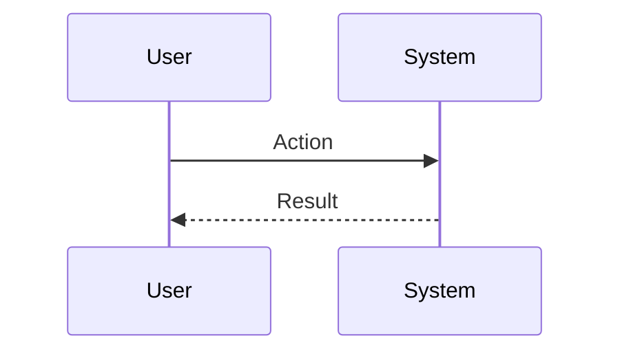
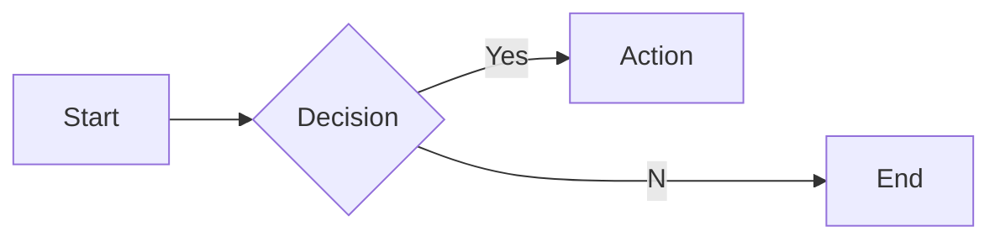

# Interview Questions: Director of People (ROLE)

This document contains 100 interview questions tailored for the Director of People role. The questions are designed to assess technical skills, soft skills, and cultural fit.

---

## 1. DEI Strategy

**Scenario:** Hiring diversity.

**Question:** How do you improve diversity in hiring?

**Key Concepts:** `DEI`, `Recruiting`

### Candidate Response Paths
*   **Junior**: Quotas.
*   **Senior**: Sourcing form diverse pools, removing bias from job descriptions, and structured interviewing.

---

## 2. Performance Reviews

**Scenario:** Feedback loops.

**Question:** What is the purpose of a performance review?

**Key Concepts:** `Management`, `Development`

### Candidate Response Paths
*   **Junior**: To give raises.
*   **Senior**: Alignment on goals, feedback for growth, and documentation.

---

## 3. Culture

**Scenario:** Remote culture.

**Question:** How do you maintain culture in a remote environment?

**Key Concepts:** `Culture`, `Engagement`

### Candidate Response Paths
*   **Junior**: Zoom happy hours.
*   **Senior**: Intentional communication, documented values, and virtual rituals.

---

## 4. Conflict

**Scenario:** Employee dispute.

**Question:** How do you mediate a conflict between two employees?

**Key Concepts:** `Conflict Resolution`, `HR`

### Candidate Response Paths
*   **Junior**: Tell them to stop.
*   **Senior**: Listen to both sides, identify underlying issues, and facilitate a resolution plan.

---

## 5. Compliance

**Scenario:** Labor laws.

**Question:** How do you stay compliant with changing labor laws?

**Key Concepts:** `Compliance`, `Legal`

### Candidate Response Paths
*   **Junior**: Google it.
*   **Senior**: Legal counsel partnership, continuous education, and updating handbooks.

---

## 6. Retention

**Scenario:** High turnover.

**Question:** Turnover is high. What do you do?

**Key Concepts:** `Retention`, `Analytics`

### Candidate Response Paths
*   **Junior**: Pay more.
*   **Senior**: Conduct stay interviews/exit interviews, analyze data, and address root causes.

---

## 7. Compensation

**Scenario:** Bands.

**Question:** How do you design a compensation strategy?

| Metric | Target | Status |
|---|---|---|
| KPI 1 | 100% | Green |
| KPI 2 | < 5% | Yellow |

**Key Concepts:** `Comp`, `Strategy`

### Candidate Response Paths
*   **Junior**: Pay market rate.
*   **Senior**: Benchmarking, defining philosophy (percentile), and ensuring equity.

---

## 8. L&D

**Scenario:** Training.

**Question:** How do you measure the ROI of L&D programs?

**Key Concepts:** `Learning`, `ROI`

### Candidate Response Paths
*   **Junior**: Did they like it?
*   **Senior**: Behavior change, skill application, and impact on business metrics.

---

## 9. Onboarding

**Scenario:** First 90 days.

**Question:** How do you ensure a new hire is successful?

**Key Concepts:** `Onboarding`, `Success`

### Candidate Response Paths
*   **Junior**: Orientation.
*   **Senior**: Clear goals, buddy system, and regular check-ins.

---

## 10. Offboarding

**Scenario:** Layoffs.

**Question:** How do you handle a RIF (Reduction in Force) compassionately?

**Key Concepts:** `Empathy`, `Crisis`

### Candidate Response Paths
*   **Junior**: Send an email.
*   **Senior**: Clear communication, generous severance/support, and caring for remaining employees.

---

## 11. Conflict Resolution

**Scenario:** Disagreement with a peer.

**Question:** Tell me about a time you had a significant disagreement with a colleague. How did you resolve it?

**Key Concepts:** `Communication`, `Soft Skills`

### Candidate Response Paths
*   **Junior**: I told them I was right.
*   **Senior**: I listened to their perspective, found common ground, and we compromised.

---

## 12. Failure Handling

**Scenario:** A project went wrong.

**Question:** Describe a time you failed. What happened and what did you learn?

**Key Concepts:** `Growth Mindset`, `Resilience`

### Candidate Response Paths
*   **Junior**: I tried hard but it failed.
*   **Senior**: I analyzed the root cause, implemented a fix, and shared the learning.

---

## 13. Prioritization

**Scenario:** Too many tasks.

**Question:** How do you prioritize when you have multiple conflicting deadlines?

**Key Concepts:** `Time Management`, `Organization`

### Candidate Response Paths
*   **Junior**: I work longer hours.
*   **Senior**: I communicate with stakeholders to adjust expectations and focus on high-impact tasks.

---

## 14. Adaptability

**Scenario:** Changing requirements.

**Question:** How do you handle sudden changes in project scope or direction?

| Metric | Target | Status |
|---|---|---|
| KPI 1 | 100% | Green |
| KPI 2 | < 5% | Yellow |

**Key Concepts:** `Agility`, `Flexibility`

### Candidate Response Paths
*   **Junior**: I get frustrated but do it.
*   **Senior**: I assess the impact, communicate risks, and pivot quickly.

---

## 15. Communication

**Scenario:** Explaining complex topics.

**Question:** Describe a time you had to explain a complex technical/business concept to a non-expert.

**Key Concepts:** `Clarity`, `Empathy`

### Candidate Response Paths
*   **Junior**: I just said it simpler.
*   **Senior**: I used analogies and checked for understanding throughout.

---

## 16. Teamwork

**Scenario:** Collaborating with difficult personalities.

**Question:** How do you handle working with someone who is difficult to work with?

**Key Concepts:** `Collaboration`, `EQ`

### Candidate Response Paths
*   **Junior**: I avoid them.
*   **Senior**: I try to understand their motivations and find a way to work together effectively.

---

## 17. Innovation

**Scenario:** Improving a process.

**Question:** Tell me about a time you improved a process or workflow.

**Key Concepts:** `Innovation`, `Efficiency`

### Candidate Response Paths
*   **Junior**: I followed the rules.
*   **Senior**: I identified a bottleneck, proposed a solution, and measured the improvement.

---

## 18. Feedback

**Scenario:** Receiving constructive criticism.

**Question:** Tell me about a time you received difficult feedback. How did you react?

**Key Concepts:** `Self-awareness`, `Growth`

### Candidate Response Paths
*   **Junior**: I got defensive.
*   **Senior**: I listened, asked for examples, and worked on a plan to improve.

---

## 19. Leadership

**Scenario:** Leading without authority.

**Question:** Describe a time you demonstrated leadership when you weren't the formal manager.

**Key Concepts:** `Leadership`, `Influence`

### Candidate Response Paths
*   **Junior**: I told people what to do.
*   **Senior**: I rallied the team around a goal and supported them to achieve it.

---

## 20. Decision Making

**Scenario:** Incomplete information.

**Question:** How do you make decisions when you don't have all the data?

**Key Concepts:** `Judgment`, `Risk Mgmt`

### Candidate Response Paths
*   **Junior**: I wait for all data.
*   **Senior**: I assess the risk, make a call based on available info, and adjust as needed.

---

## 21. Performance Best Practices

**Scenario:** Standardization.

**Question:** What are the industry best practices for Performance?

| Metric | Target | Status |
|---|---|---|
| KPI 1 | 100% | Green |
| KPI 2 | < 5% | Yellow |

**Key Concepts:** `Performance`, `Standards`

### Candidate Response Paths
*   **Junior**: List a few.
*   **Senior**: Discusses why they are best practices and when to break them.

---

## 22. Scaling Training

**Scenario:** Growth.

**Question:** How do you scale Training as the company grows?

**Key Concepts:** `Training`, `Scale`

### Candidate Response Paths
*   **Junior**: Hire more people.
*   **Senior**: Process automation, documentation, and leverage.

---

## 23. Start vs Scale for Employee Relations

**Scenario:** Context.

**Question:** How does your approach to Employee Relations differ in a startup vs a large corp?

**Key Concepts:** `Employee Relations`, `Context`

### Candidate Response Paths
*   **Junior**: It's the same.
*   **Senior**: Speed/Chaos vs Process/Stability.

---

## 24. Tooling: Benefits

**Scenario:** Proficiency.

**Question:** How do you utilize Benefits to improve efficiency?

**Key Concepts:** `Benefits`, `Productivity`

### Candidate Response Paths
*   **Junior**: I use it daily.
*   **Senior**: Advanced features and automation.

---

## 25. Deep Dive: Recruiting

**Scenario:** Assessing depth in Recruiting.

**Question:** Can you explain Recruiting in detail and how you have applied it in your past role?

**Key Concepts:** `Recruiting`, `Experience`

### Candidate Response Paths
*   **Junior**: Basic definition.
*   **Senior**: Deep practical application and nuances.

---

## 26. Future of Performance

**Scenario:** Trends.

**Question:** Where do you see Performance heading in the next 5 years?

**Key Concepts:** `Performance`, `Vision`

### Candidate Response Paths
*   **Junior**: It will get better.
*   **Senior**: Emerging trends, AI impact, and market shifts.

---

## 27. Tooling: Training

**Scenario:** Proficiency.

**Question:** How do you utilize Training to improve efficiency?

**Key Concepts:** `Training`, `Productivity`

### Candidate Response Paths
*   **Junior**: I use it daily.
*   **Senior**: Advanced features and automation.

---

## 28. Teaching Performance

**Scenario:** Mentorship.

**Question:** How would you teach Performance to a junior team member?

| Metric | Target | Status |
|---|---|---|
| KPI 1 | 100% | Green |
| KPI 2 | < 5% | Yellow |

**Key Concepts:** `Performance`, `Mentorship`

### Candidate Response Paths
*   **Junior**: Send them a link.
*   **Senior**: Structured learning path and hands-on practice.

---

## 29. Start vs Scale for Compliance

**Scenario:** Context.

**Question:** How does your approach to Compliance differ in a startup vs a large corp?

**Key Concepts:** `Compliance`, `Context`

### Candidate Response Paths
*   **Junior**: It's the same.
*   **Senior**: Speed/Chaos vs Process/Stability.

---

## 30. Mistakes in Recruiting

**Scenario:** Learning.

**Question:** What common mistakes do people make with Recruiting?

**Key Concepts:** `Recruiting`, `Experience`

### Candidate Response Paths
*   **Junior**: Doing it wrong.
*   **Senior**: Subtle pitfalls and how to avoid them.

---

## 31. Deep Dive: Onboarding

**Scenario:** Assessing depth in Onboarding.

**Question:** Can you explain Onboarding in detail and how you have applied it in your past role?

**Key Concepts:** `Onboarding`, `Experience`

### Candidate Response Paths
*   **Junior**: Basic definition.
*   **Senior**: Deep practical application and nuances.

---

## 32. Metrics for Compliance

**Scenario:** Measurement.

**Question:** How do you measure success in Compliance?

**Key Concepts:** `Compliance`, `Analytics`

### Candidate Response Paths
*   **Junior**: I guess.
*   **Senior**: Specific KPIs and leading/lagging indicators.

---

## 33. Internal Comms Best Practices

**Scenario:** Standardization.

**Question:** What are the industry best practices for Internal Comms?

**Key Concepts:** `Internal Comms`, `Standards`

### Candidate Response Paths
*   **Junior**: List a few.
*   **Senior**: Discusses why they are best practices and when to break them.

---

## 34. Start vs Scale for Benefits

**Scenario:** Context.

**Question:** How does your approach to Benefits differ in a startup vs a large corp?

**Key Concepts:** `Benefits`, `Context`

### Candidate Response Paths
*   **Junior**: It's the same.
*   **Senior**: Speed/Chaos vs Process/Stability.

---

## 35. Collaboration in Engagement

**Scenario:** Teamwork.

**Question:** How does Engagement require cross-functional collaboration?

| Metric | Target | Status |
|---|---|---|
| KPI 1 | 100% | Green |
| KPI 2 | < 5% | Yellow |

**Key Concepts:** `Engagement`, `Collaboration`

### Candidate Response Paths
*   **Junior**: I talk to people.
*   **Senior**: Alignment with other depts and shared goals.

---

## 36. Challenges in Performance

**Scenario:** Problem Solving.

**Question:** What are the biggest challenges you've faced regarding Performance?

**Key Concepts:** `Performance`, `Problem Solving`

### Candidate Response Paths
*   **Junior**: It was hard.
*   **Senior**: Specific examples of obstacles and strategies to overcome them.

---

## 37. Scaling Employer Branding

**Scenario:** Growth.

**Question:** How do you scale Employer Branding as the company grows?

**Key Concepts:** `Employer Branding`, `Scale`

### Candidate Response Paths
*   **Junior**: Hire more people.
*   **Senior**: Process automation, documentation, and leverage.

---

## 38. Collaboration in Performance

**Scenario:** Teamwork.

**Question:** How does Performance require cross-functional collaboration?

**Key Concepts:** `Performance`, `Collaboration`

### Candidate Response Paths
*   **Junior**: I talk to people.
*   **Senior**: Alignment with other depts and shared goals.

---

## 39. Tooling: Internal Comms

**Scenario:** Proficiency.

**Question:** How do you utilize Internal Comms to improve efficiency?

**Key Concepts:** `Internal Comms`, `Productivity`

### Candidate Response Paths
*   **Junior**: I use it daily.
*   **Senior**: Advanced features and automation.

---

## 40. Collaboration in Onboarding

**Scenario:** Teamwork.

**Question:** How does Onboarding require cross-functional collaboration?

**Key Concepts:** `Onboarding`, `Collaboration`

### Candidate Response Paths
*   **Junior**: I talk to people.
*   **Senior**: Alignment with other depts and shared goals.

---

## 41. Future of Engagement

**Scenario:** Trends.

**Question:** Where do you see Engagement heading in the next 5 years?

**Key Concepts:** `Engagement`, `Vision`

### Candidate Response Paths
*   **Junior**: It will get better.
*   **Senior**: Emerging trends, AI impact, and market shifts.

---

## 42. Future of DEI

**Scenario:** Trends.

**Question:** Where do you see DEI heading in the next 5 years?

| Metric | Target | Status |
|---|---|---|
| KPI 1 | 100% | Green |
| KPI 2 | < 5% | Yellow |

**Key Concepts:** `DEI`, `Vision`

### Candidate Response Paths
*   **Junior**: It will get better.
*   **Senior**: Emerging trends, AI impact, and market shifts.

---

## 43. Start vs Scale for Recruiting

**Scenario:** Context.

**Question:** How does your approach to Recruiting differ in a startup vs a large corp?

**Key Concepts:** `Recruiting`, `Context`

### Candidate Response Paths
*   **Junior**: It's the same.
*   **Senior**: Speed/Chaos vs Process/Stability.

---

## 44. Mistakes in Offboarding

**Scenario:** Learning.

**Question:** What common mistakes do people make with Offboarding?

**Key Concepts:** `Offboarding`, `Experience`

### Candidate Response Paths
*   **Junior**: Doing it wrong.
*   **Senior**: Subtle pitfalls and how to avoid them.

---

## 45. Mistakes in Employee Relations

**Scenario:** Learning.

**Question:** What common mistakes do people make with Employee Relations?

**Key Concepts:** `Employee Relations`, `Experience`

### Candidate Response Paths
*   **Junior**: Doing it wrong.
*   **Senior**: Subtle pitfalls and how to avoid them.

---

## 46. Metrics for Compensation

**Scenario:** Measurement.

**Question:** How do you measure success in Compensation?

**Key Concepts:** `Compensation`, `Analytics`

### Candidate Response Paths
*   **Junior**: I guess.
*   **Senior**: Specific KPIs and leading/lagging indicators.

---

## 47. Collaboration in Recruiting

**Scenario:** Teamwork.

**Question:** How does Recruiting require cross-functional collaboration?

**Key Concepts:** `Recruiting`, `Collaboration`

### Candidate Response Paths
*   **Junior**: I talk to people.
*   **Senior**: Alignment with other depts and shared goals.

---

## 48. Ethics in Internal Comms

**Scenario:** Ethics.

**Question:** What are the ethical considerations regarding Internal Comms?

**Key Concepts:** `Internal Comms`, `Ethics`

### Candidate Response Paths
*   **Junior**: Be nice.
*   **Senior**: Privacy, bias, and societal impact.

---

## 49. Scaling Employee Relations

**Scenario:** Growth.

**Question:** How do you scale Employee Relations as the company grows?

| Metric | Target | Status |
|---|---|---|
| KPI 1 | 100% | Green |
| KPI 2 | < 5% | Yellow |

**Key Concepts:** `Employee Relations`, `Scale`

### Candidate Response Paths
*   **Junior**: Hire more people.
*   **Senior**: Process automation, documentation, and leverage.

---

## 50. Future of Offboarding

**Scenario:** Trends.

**Question:** Where do you see Offboarding heading in the next 5 years?

**Key Concepts:** `Offboarding`, `Vision`

### Candidate Response Paths
*   **Junior**: It will get better.
*   **Senior**: Emerging trends, AI impact, and market shifts.

---

## 51. Ethics in Onboarding

**Scenario:** Ethics.

**Question:** What are the ethical considerations regarding Onboarding?

**Key Concepts:** `Onboarding`, `Ethics`

### Candidate Response Paths
*   **Junior**: Be nice.
*   **Senior**: Privacy, bias, and societal impact.

---

## 52. Future of Employer Branding

**Scenario:** Trends.

**Question:** Where do you see Employer Branding heading in the next 5 years?

**Key Concepts:** `Employer Branding`, `Vision`

### Candidate Response Paths
*   **Junior**: It will get better.
*   **Senior**: Emerging trends, AI impact, and market shifts.

---

## 53. Start vs Scale for Training

**Scenario:** Context.

**Question:** How does your approach to Training differ in a startup vs a large corp?

**Key Concepts:** `Training`, `Context`

### Candidate Response Paths
*   **Junior**: It's the same.
*   **Senior**: Speed/Chaos vs Process/Stability.

---

## 54. Metrics for DEI

**Scenario:** Measurement.

**Question:** How do you measure success in DEI?

**Key Concepts:** `DEI`, `Analytics`

### Candidate Response Paths
*   **Junior**: I guess.
*   **Senior**: Specific KPIs and leading/lagging indicators.

---

## 55. Employer Branding Best Practices

**Scenario:** Standardization.

**Question:** What are the industry best practices for Employer Branding?

**Key Concepts:** `Employer Branding`, `Standards`

### Candidate Response Paths
*   **Junior**: List a few.
*   **Senior**: Discusses why they are best practices and when to break them.

---

## 56. Challenges in Compliance

**Scenario:** Problem Solving.

**Question:** What are the biggest challenges you've faced regarding Compliance?

| Metric | Target | Status |
|---|---|---|
| KPI 1 | 100% | Green |
| KPI 2 | < 5% | Yellow |

**Key Concepts:** `Compliance`, `Problem Solving`

### Candidate Response Paths
*   **Junior**: It was hard.
*   **Senior**: Specific examples of obstacles and strategies to overcome them.

---

## 57. Start vs Scale for Employer Branding

**Scenario:** Context.

**Question:** How does your approach to Employer Branding differ in a startup vs a large corp?

**Key Concepts:** `Employer Branding`, `Context`

### Candidate Response Paths
*   **Junior**: It's the same.
*   **Senior**: Speed/Chaos vs Process/Stability.

---

## 58. Scaling Culture

**Scenario:** Growth.

**Question:** How do you scale Culture as the company grows?

**Key Concepts:** `Culture`, `Scale`

### Candidate Response Paths
*   **Junior**: Hire more people.
*   **Senior**: Process automation, documentation, and leverage.

---

## 59. Deep Dive: Employee Relations

**Scenario:** Assessing depth in Employee Relations.

**Question:** Can you explain Employee Relations in detail and how you have applied it in your past role?

**Key Concepts:** `Employee Relations`, `Experience`

### Candidate Response Paths
*   **Junior**: Basic definition.
*   **Senior**: Deep practical application and nuances.

---

## 60. Challenges in Training

**Scenario:** Problem Solving.

**Question:** What are the biggest challenges you've faced regarding Training?

**Key Concepts:** `Training`, `Problem Solving`

### Candidate Response Paths
*   **Junior**: It was hard.
*   **Senior**: Specific examples of obstacles and strategies to overcome them.

---

## 61. Future of Culture

**Scenario:** Trends.

**Question:** Where do you see Culture heading in the next 5 years?

**Key Concepts:** `Culture`, `Vision`

### Candidate Response Paths
*   **Junior**: It will get better.
*   **Senior**: Emerging trends, AI impact, and market shifts.

---

## 62. Ethics in Training

**Scenario:** Ethics.

**Question:** What are the ethical considerations regarding Training?

**Key Concepts:** `Training`, `Ethics`

### Candidate Response Paths
*   **Junior**: Be nice.
*   **Senior**: Privacy, bias, and societal impact.

---

## 63. Start vs Scale for DEI

**Scenario:** Context.

**Question:** How does your approach to DEI differ in a startup vs a large corp?

| Metric | Target | Status |
|---|---|---|
| KPI 1 | 100% | Green |
| KPI 2 | < 5% | Yellow |

**Key Concepts:** `DEI`, `Context`

### Candidate Response Paths
*   **Junior**: It's the same.
*   **Senior**: Speed/Chaos vs Process/Stability.

---

## 64. Challenges in Onboarding

**Scenario:** Problem Solving.

**Question:** What are the biggest challenges you've faced regarding Onboarding?

**Key Concepts:** `Onboarding`, `Problem Solving`

### Candidate Response Paths
*   **Junior**: It was hard.
*   **Senior**: Specific examples of obstacles and strategies to overcome them.

---

## 65. Teaching Culture

**Scenario:** Mentorship.

**Question:** How would you teach Culture to a junior team member?

**Key Concepts:** `Culture`, `Mentorship`

### Candidate Response Paths
*   **Junior**: Send them a link.
*   **Senior**: Structured learning path and hands-on practice.

---

## 66. Teaching Compensation

**Scenario:** Mentorship.

**Question:** How would you teach Compensation to a junior team member?

**Key Concepts:** `Compensation`, `Mentorship`

### Candidate Response Paths
*   **Junior**: Send them a link.
*   **Senior**: Structured learning path and hands-on practice.

---

## 67. Tooling: Onboarding

**Scenario:** Proficiency.

**Question:** How do you utilize Onboarding to improve efficiency?

**Key Concepts:** `Onboarding`, `Productivity`

### Candidate Response Paths
*   **Junior**: I use it daily.
*   **Senior**: Advanced features and automation.

---

## 68. Mistakes in Compliance

**Scenario:** Learning.

**Question:** What common mistakes do people make with Compliance?

**Key Concepts:** `Compliance`, `Experience`

### Candidate Response Paths
*   **Junior**: Doing it wrong.
*   **Senior**: Subtle pitfalls and how to avoid them.

---

## 69. Offboarding Best Practices

**Scenario:** Standardization.

**Question:** What are the industry best practices for Offboarding?

**Key Concepts:** `Offboarding`, `Standards`

### Candidate Response Paths
*   **Junior**: List a few.
*   **Senior**: Discusses why they are best practices and when to break them.

---

## 70. Start vs Scale for Compensation

**Scenario:** Context.

**Question:** How does your approach to Compensation differ in a startup vs a large corp?

| Metric | Target | Status |
|---|---|---|
| KPI 1 | 100% | Green |
| KPI 2 | < 5% | Yellow |

**Key Concepts:** `Compensation`, `Context`

### Candidate Response Paths
*   **Junior**: It's the same.
*   **Senior**: Speed/Chaos vs Process/Stability.

---

## 71. Ethics in DEI

**Scenario:** Ethics.

**Question:** What are the ethical considerations regarding DEI?

**Key Concepts:** `DEI`, `Ethics`

### Candidate Response Paths
*   **Junior**: Be nice.
*   **Senior**: Privacy, bias, and societal impact.

---

## 72. Challenges in Offboarding

**Scenario:** Problem Solving.

**Question:** What are the biggest challenges you've faced regarding Offboarding?

**Key Concepts:** `Offboarding`, `Problem Solving`

### Candidate Response Paths
*   **Junior**: It was hard.
*   **Senior**: Specific examples of obstacles and strategies to overcome them.

---

## 73. Mistakes in Performance

**Scenario:** Learning.

**Question:** What common mistakes do people make with Performance?

**Key Concepts:** `Performance`, `Experience`

### Candidate Response Paths
*   **Junior**: Doing it wrong.
*   **Senior**: Subtle pitfalls and how to avoid them.

---

## 74. Tooling: DEI

**Scenario:** Proficiency.

**Question:** How do you utilize DEI to improve efficiency?

**Key Concepts:** `DEI`, `Productivity`

### Candidate Response Paths
*   **Junior**: I use it daily.
*   **Senior**: Advanced features and automation.

---

## 75. Collaboration in HRIS

**Scenario:** Teamwork.

**Question:** How does HRIS require cross-functional collaboration?

**Key Concepts:** `HRIS`, `Collaboration`

### Candidate Response Paths
*   **Junior**: I talk to people.
*   **Senior**: Alignment with other depts and shared goals.

---

## 76. Collaboration in Internal Comms

**Scenario:** Teamwork.

**Question:** How does Internal Comms require cross-functional collaboration?

**Key Concepts:** `Internal Comms`, `Collaboration`

### Candidate Response Paths
*   **Junior**: I talk to people.
*   **Senior**: Alignment with other depts and shared goals.

---

## 77. Teaching Engagement

**Scenario:** Mentorship.

**Question:** How would you teach Engagement to a junior team member?

| Metric | Target | Status |
|---|---|---|
| KPI 1 | 100% | Green |
| KPI 2 | < 5% | Yellow |

**Key Concepts:** `Engagement`, `Mentorship`

### Candidate Response Paths
*   **Junior**: Send them a link.
*   **Senior**: Structured learning path and hands-on practice.

---

## 78. Metrics for Engagement

**Scenario:** Measurement.

**Question:** How do you measure success in Engagement?

**Key Concepts:** `Engagement`, `Analytics`

### Candidate Response Paths
*   **Junior**: I guess.
*   **Senior**: Specific KPIs and leading/lagging indicators.

---

## 79. Start vs Scale for Offboarding

**Scenario:** Context.

**Question:** How does your approach to Offboarding differ in a startup vs a large corp?

**Key Concepts:** `Offboarding`, `Context`

### Candidate Response Paths
*   **Junior**: It's the same.
*   **Senior**: Speed/Chaos vs Process/Stability.

---

## 80. Teaching DEI

**Scenario:** Mentorship.

**Question:** How would you teach DEI to a junior team member?

**Key Concepts:** `DEI`, `Mentorship`

### Candidate Response Paths
*   **Junior**: Send them a link.
*   **Senior**: Structured learning path and hands-on practice.

---

## 81. Deep Dive: Compliance

**Scenario:** Assessing depth in Compliance.

**Question:** Can you explain Compliance in detail and how you have applied it in your past role?

**Key Concepts:** `Compliance`, `Experience`

### Candidate Response Paths
*   **Junior**: Basic definition.
*   **Senior**: Deep practical application and nuances.

---

## 82. Future of Onboarding

**Scenario:** Trends.

**Question:** Where do you see Onboarding heading in the next 5 years?

**Key Concepts:** `Onboarding`, `Vision`

### Candidate Response Paths
*   **Junior**: It will get better.
*   **Senior**: Emerging trends, AI impact, and market shifts.

---

## 83. Mistakes in Onboarding

**Scenario:** Learning.

**Question:** What common mistakes do people make with Onboarding?

**Key Concepts:** `Onboarding`, `Experience`

### Candidate Response Paths
*   **Junior**: Doing it wrong.
*   **Senior**: Subtle pitfalls and how to avoid them.

---

## 84. Challenges in DEI

**Scenario:** Problem Solving.

**Question:** What are the biggest challenges you've faced regarding DEI?

| Metric | Target | Status |
|---|---|---|
| KPI 1 | 100% | Green |
| KPI 2 | < 5% | Yellow |

**Key Concepts:** `DEI`, `Problem Solving`

### Candidate Response Paths
*   **Junior**: It was hard.
*   **Senior**: Specific examples of obstacles and strategies to overcome them.

---

## 85. Challenges in Recruiting

**Scenario:** Problem Solving.

**Question:** What are the biggest challenges you've faced regarding Recruiting?

**Key Concepts:** `Recruiting`, `Problem Solving`

### Candidate Response Paths
*   **Junior**: It was hard.
*   **Senior**: Specific examples of obstacles and strategies to overcome them.

---

## 86. Deep Dive: Performance

**Scenario:** Assessing depth in Performance.

**Question:** Can you explain Performance in detail and how you have applied it in your past role?

**Key Concepts:** `Performance`, `Experience`

### Candidate Response Paths
*   **Junior**: Basic definition.
*   **Senior**: Deep practical application and nuances.

---

## 87. Tooling: Offboarding

**Scenario:** Proficiency.

**Question:** How do you utilize Offboarding to improve efficiency?

**Key Concepts:** `Offboarding`, `Productivity`

### Candidate Response Paths
*   **Junior**: I use it daily.
*   **Senior**: Advanced features and automation.

---

## 88. Future of Training

**Scenario:** Trends.

**Question:** Where do you see Training heading in the next 5 years?

**Key Concepts:** `Training`, `Vision`

### Candidate Response Paths
*   **Junior**: It will get better.
*   **Senior**: Emerging trends, AI impact, and market shifts.

---

## 89. Metrics for Benefits

**Scenario:** Measurement.

**Question:** How do you measure success in Benefits?

**Key Concepts:** `Benefits`, `Analytics`

### Candidate Response Paths
*   **Junior**: I guess.
*   **Senior**: Specific KPIs and leading/lagging indicators.

---

## 90. Ethics in Offboarding

**Scenario:** Ethics.

**Question:** What are the ethical considerations regarding Offboarding?

**Key Concepts:** `Offboarding`, `Ethics`

### Candidate Response Paths
*   **Junior**: Be nice.
*   **Senior**: Privacy, bias, and societal impact.

---

## 91. Collaboration in Benefits

**Scenario:** Teamwork.

**Question:** How does Benefits require cross-functional collaboration?

| Metric | Target | Status |
|---|---|---|
| KPI 1 | 100% | Green |
| KPI 2 | < 5% | Yellow |

**Key Concepts:** `Benefits`, `Collaboration`

### Candidate Response Paths
*   **Junior**: I talk to people.
*   **Senior**: Alignment with other depts and shared goals.

---

## 92. Collaboration in Compliance

**Scenario:** Teamwork.

**Question:** How does Compliance require cross-functional collaboration?

**Key Concepts:** `Compliance`, `Collaboration`

### Candidate Response Paths
*   **Junior**: I talk to people.
*   **Senior**: Alignment with other depts and shared goals.

---

## 93. Teaching Employer Branding

**Scenario:** Mentorship.

**Question:** How would you teach Employer Branding to a junior team member?

**Key Concepts:** `Employer Branding`, `Mentorship`

### Candidate Response Paths
*   **Junior**: Send them a link.
*   **Senior**: Structured learning path and hands-on practice.

---

## 94. Collaboration in Employer Branding

**Scenario:** Teamwork.

**Question:** How does Employer Branding require cross-functional collaboration?

**Key Concepts:** `Employer Branding`, `Collaboration`

### Candidate Response Paths
*   **Junior**: I talk to people.
*   **Senior**: Alignment with other depts and shared goals.

---

## 95. Collaboration in Training

**Scenario:** Teamwork.

**Question:** How does Training require cross-functional collaboration?

**Key Concepts:** `Training`, `Collaboration`

### Candidate Response Paths
*   **Junior**: I talk to people.
*   **Senior**: Alignment with other depts and shared goals.

---

## 96. Deep Dive: Training

**Scenario:** Assessing depth in Training.

**Question:** Can you explain Training in detail and how you have applied it in your past role?

**Key Concepts:** `Training`, `Experience`

### Candidate Response Paths
*   **Junior**: Basic definition.
*   **Senior**: Deep practical application and nuances.

---

## 97. Employee Relations Best Practices

**Scenario:** Standardization.

**Question:** What are the industry best practices for Employee Relations?

**Key Concepts:** `Employee Relations`, `Standards`

### Candidate Response Paths
*   **Junior**: List a few.
*   **Senior**: Discusses why they are best practices and when to break them.

---

## 98. Collaboration in Offboarding

**Scenario:** Teamwork.

**Question:** How does Offboarding require cross-functional collaboration?

| Metric | Target | Status |
|---|---|---|
| KPI 1 | 100% | Green |
| KPI 2 | < 5% | Yellow |

**Key Concepts:** `Offboarding`, `Collaboration`

### Candidate Response Paths
*   **Junior**: I talk to people.
*   **Senior**: Alignment with other depts and shared goals.

---

## 99. Scaling Compliance

**Scenario:** Growth.

**Question:** How do you scale Compliance as the company grows?

**Key Concepts:** `Compliance`, `Scale`

### Candidate Response Paths
*   **Junior**: Hire more people.
*   **Senior**: Process automation, documentation, and leverage.

---

## 100. Deep Dive: Internal Comms

**Scenario:** Assessing depth in Internal Comms.

**Question:** Can you explain Internal Comms in detail and how you have applied it in your past role?

**Key Concepts:** `Internal Comms`, `Experience`

### Candidate Response Paths
*   **Junior**: Basic definition.
*   **Senior**: Deep practical application and nuances.

---
