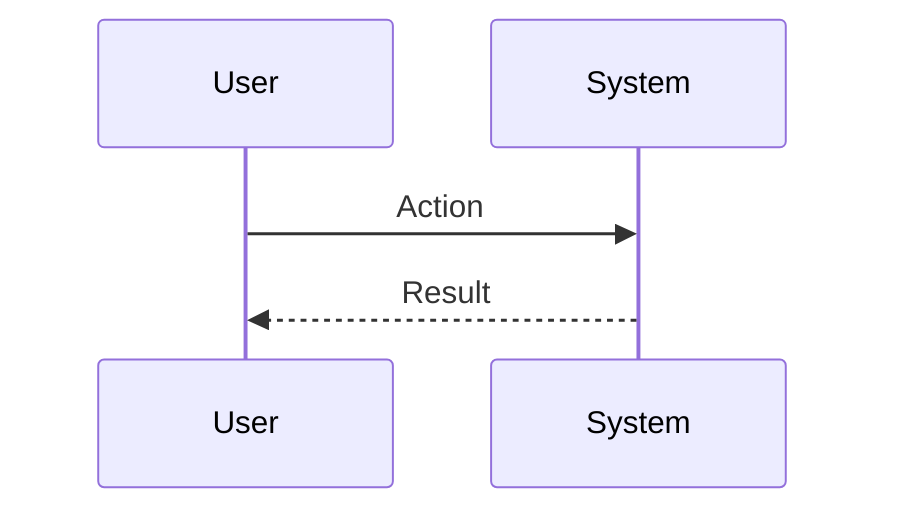
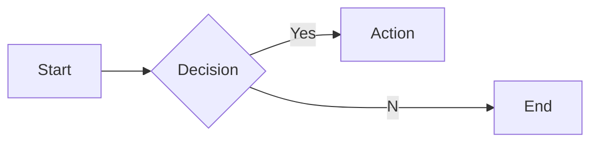

# Interview Questions: Strategy & Ops (ROLE)

This document contains 100 interview questions tailored for the Strategy & Ops role. The questions are designed to assess technical skills, soft skills, and cultural fit.

---

## 1. Conflict Resolution

**Scenario:** Disagreement with a peer.

**Question:** Tell me about a time you had a significant disagreement with a colleague. How did you resolve it?

**Key Concepts:** `Communication`, `Soft Skills`

### Candidate Response Paths
*   **Junior**: I told them I was right.
*   **Senior**: I listened to their perspective, found common ground, and we compromised.

---

## 2. Failure Handling

**Scenario:** A project went wrong.

**Question:** Describe a time you failed. What happened and what did you learn?

**Key Concepts:** `Growth Mindset`, `Resilience`

### Candidate Response Paths
*   **Junior**: I tried hard but it failed.
*   **Senior**: I analyzed the root cause, implemented a fix, and shared the learning.

---

## 3. Prioritization

**Scenario:** Too many tasks.

**Question:** How do you prioritize when you have multiple conflicting deadlines?

**Key Concepts:** `Time Management`, `Organization`

### Candidate Response Paths
*   **Junior**: I work longer hours.
*   **Senior**: I communicate with stakeholders to adjust expectations and focus on high-impact tasks.

---

## 4. Adaptability

**Scenario:** Changing requirements.

**Question:** How do you handle sudden changes in project scope or direction?

**Key Concepts:** `Agility`, `Flexibility`

### Candidate Response Paths
*   **Junior**: I get frustrated but do it.
*   **Senior**: I assess the impact, communicate risks, and pivot quickly.

---

## 5. Communication

**Scenario:** Explaining complex topics.

**Question:** Describe a time you had to explain a complex technical/business concept to a non-expert.

**Key Concepts:** `Clarity`, `Empathy`

### Candidate Response Paths
*   **Junior**: I just said it simpler.
*   **Senior**: I used analogies and checked for understanding throughout.

---

## 6. Teamwork

**Scenario:** Collaborating with difficult personalities.

**Question:** How do you handle working with someone who is difficult to work with?

**Key Concepts:** `Collaboration`, `EQ`

### Candidate Response Paths
*   **Junior**: I avoid them.
*   **Senior**: I try to understand their motivations and find a way to work together effectively.

---

## 7. Innovation

**Scenario:** Improving a process.

**Question:** Tell me about a time you improved a process or workflow.

| Metric | Target | Status |
|---|---|---|
| KPI 1 | 100% | Green |
| KPI 2 | < 5% | Yellow |

**Key Concepts:** `Innovation`, `Efficiency`

### Candidate Response Paths
*   **Junior**: I followed the rules.
*   **Senior**: I identified a bottleneck, proposed a solution, and measured the improvement.

---

## 8. Feedback

**Scenario:** Receiving constructive criticism.

**Question:** Tell me about a time you received difficult feedback. How did you react?

**Key Concepts:** `Self-awareness`, `Growth`

### Candidate Response Paths
*   **Junior**: I got defensive.
*   **Senior**: I listened, asked for examples, and worked on a plan to improve.

---

## 9. Leadership

**Scenario:** Leading without authority.

**Question:** Describe a time you demonstrated leadership when you weren't the formal manager.

**Key Concepts:** `Leadership`, `Influence`

### Candidate Response Paths
*   **Junior**: I told people what to do.
*   **Senior**: I rallied the team around a goal and supported them to achieve it.

---

## 10. Decision Making

**Scenario:** Incomplete information.

**Question:** How do you make decisions when you don't have all the data?

**Key Concepts:** `Judgment`, `Risk Mgmt`

### Candidate Response Paths
*   **Junior**: I wait for all data.
*   **Senior**: I assess the risk, make a call based on available info, and adjust as needed.

---

## 11. Challenges in Learning

**Scenario:** Problem Solving.

**Question:** What are the biggest challenges you've faced regarding Learning?

**Key Concepts:** `Learning`, `Problem Solving`

### Candidate Response Paths
*   **Junior**: It was hard.
*   **Senior**: Specific examples of obstacles and strategies to overcome them.

---

## 12. Tooling: Innovation

**Scenario:** Proficiency.

**Question:** How do you utilize Innovation to improve efficiency?

**Key Concepts:** `Innovation`, `Productivity`

### Candidate Response Paths
*   **Junior**: I use it daily.
*   **Senior**: Advanced features and automation.

---

## 13. Ethics in Integrity

**Scenario:** Ethics.

**Question:** What are the ethical considerations regarding Integrity?

**Key Concepts:** `Integrity`, `Ethics`

### Candidate Response Paths
*   **Junior**: Be nice.
*   **Senior**: Privacy, bias, and societal impact.

---

## 14. Integrity Best Practices

**Scenario:** Standardization.

**Question:** What are the industry best practices for Integrity?

| Metric | Target | Status |
|---|---|---|
| KPI 1 | 100% | Green |
| KPI 2 | < 5% | Yellow |

**Key Concepts:** `Integrity`, `Standards`

### Candidate Response Paths
*   **Junior**: List a few.
*   **Senior**: Discusses why they are best practices and when to break them.

---

## 15. Focus Best Practices

**Scenario:** Standardization.

**Question:** What are the industry best practices for Focus?

**Key Concepts:** `Focus`, `Standards`

### Candidate Response Paths
*   **Junior**: List a few.
*   **Senior**: Discusses why they are best practices and when to break them.

---

## 16. Teaching Problem Solving

**Scenario:** Mentorship.

**Question:** How would you teach Problem Solving to a junior team member?

**Key Concepts:** `Problem Solving`, `Mentorship`

### Candidate Response Paths
*   **Junior**: Send them a link.
*   **Senior**: Structured learning path and hands-on practice.

---

## 17. Future of Motivation

**Scenario:** Trends.

**Question:** Where do you see Motivation heading in the next 5 years?

**Key Concepts:** `Motivation`, `Vision`

### Candidate Response Paths
*   **Junior**: It will get better.
*   **Senior**: Emerging trends, AI impact, and market shifts.

---

## 18. Collaboration in Conflict

**Scenario:** Teamwork.

**Question:** How does Conflict require cross-functional collaboration?

**Key Concepts:** `Conflict`, `Collaboration`

### Candidate Response Paths
*   **Junior**: I talk to people.
*   **Senior**: Alignment with other depts and shared goals.

---

## 19. Challenges in Problem Solving

**Scenario:** Problem Solving.

**Question:** What are the biggest challenges you've faced regarding Problem Solving?

**Key Concepts:** `Problem Solving`, `Problem Solving`

### Candidate Response Paths
*   **Junior**: It was hard.
*   **Senior**: Specific examples of obstacles and strategies to overcome them.

---

## 20. Mistakes in Innovation

**Scenario:** Learning.

**Question:** What common mistakes do people make with Innovation?

**Key Concepts:** `Innovation`, `Experience`

### Candidate Response Paths
*   **Junior**: Doing it wrong.
*   **Senior**: Subtle pitfalls and how to avoid them.

---

## 21. Teaching Conflict

**Scenario:** Mentorship.

**Question:** How would you teach Conflict to a junior team member?

| Metric | Target | Status |
|---|---|---|
| KPI 1 | 100% | Green |
| KPI 2 | < 5% | Yellow |

**Key Concepts:** `Conflict`, `Mentorship`

### Candidate Response Paths
*   **Junior**: Send them a link.
*   **Senior**: Structured learning path and hands-on practice.

---

## 22. Challenges in Innovation

**Scenario:** Problem Solving.

**Question:** What are the biggest challenges you've faced regarding Innovation?

**Key Concepts:** `Innovation`, `Problem Solving`

### Candidate Response Paths
*   **Junior**: It was hard.
*   **Senior**: Specific examples of obstacles and strategies to overcome them.

---

## 23. Metrics for Leadership

**Scenario:** Measurement.

**Question:** How do you measure success in Leadership?

**Key Concepts:** `Leadership`, `Analytics`

### Candidate Response Paths
*   **Junior**: I guess.
*   **Senior**: Specific KPIs and leading/lagging indicators.

---

## 24. Start vs Scale for Motivation

**Scenario:** Context.

**Question:** How does your approach to Motivation differ in a startup vs a large corp?

**Key Concepts:** `Motivation`, `Context`

### Candidate Response Paths
*   **Junior**: It's the same.
*   **Senior**: Speed/Chaos vs Process/Stability.

---

## 25. Future of Empathy

**Scenario:** Trends.

**Question:** Where do you see Empathy heading in the next 5 years?

**Key Concepts:** `Empathy`, `Vision`

### Candidate Response Paths
*   **Junior**: It will get better.
*   **Senior**: Emerging trends, AI impact, and market shifts.

---

## 26. Ethics in Teamwork

**Scenario:** Ethics.

**Question:** What are the ethical considerations regarding Teamwork?

**Key Concepts:** `Teamwork`, `Ethics`

### Candidate Response Paths
*   **Junior**: Be nice.
*   **Senior**: Privacy, bias, and societal impact.

---

## 27. Scaling Resilience

**Scenario:** Growth.

**Question:** How do you scale Resilience as the company grows?

**Key Concepts:** `Resilience`, `Scale`

### Candidate Response Paths
*   **Junior**: Hire more people.
*   **Senior**: Process automation, documentation, and leverage.

---

## 28. Teamwork Best Practices

**Scenario:** Standardization.

**Question:** What are the industry best practices for Teamwork?

| Metric | Target | Status |
|---|---|---|
| KPI 1 | 100% | Green |
| KPI 2 | < 5% | Yellow |

**Key Concepts:** `Teamwork`, `Standards`

### Candidate Response Paths
*   **Junior**: List a few.
*   **Senior**: Discusses why they are best practices and when to break them.

---

## 29. Tooling: Empathy

**Scenario:** Proficiency.

**Question:** How do you utilize Empathy to improve efficiency?

**Key Concepts:** `Empathy`, `Productivity`

### Candidate Response Paths
*   **Junior**: I use it daily.
*   **Senior**: Advanced features and automation.

---

## 30. Challenges in Leadership

**Scenario:** Problem Solving.

**Question:** What are the biggest challenges you've faced regarding Leadership?

**Key Concepts:** `Leadership`, `Problem Solving`

### Candidate Response Paths
*   **Junior**: It was hard.
*   **Senior**: Specific examples of obstacles and strategies to overcome them.

---

## 31. Deep Dive: Resilience

**Scenario:** Assessing depth in Resilience.

**Question:** Can you explain Resilience in detail and how you have applied it in your past role?

**Key Concepts:** `Resilience`, `Experience`

### Candidate Response Paths
*   **Junior**: Basic definition.
*   **Senior**: Deep practical application and nuances.

---

## 32. Learning Best Practices

**Scenario:** Standardization.

**Question:** What are the industry best practices for Learning?

**Key Concepts:** `Learning`, `Standards`

### Candidate Response Paths
*   **Junior**: List a few.
*   **Senior**: Discusses why they are best practices and when to break them.

---

## 33. Metrics for Empathy

**Scenario:** Measurement.

**Question:** How do you measure success in Empathy?

**Key Concepts:** `Empathy`, `Analytics`

### Candidate Response Paths
*   **Junior**: I guess.
*   **Senior**: Specific KPIs and leading/lagging indicators.

---

## 34. Ethics in Focus

**Scenario:** Ethics.

**Question:** What are the ethical considerations regarding Focus?

**Key Concepts:** `Focus`, `Ethics`

### Candidate Response Paths
*   **Junior**: Be nice.
*   **Senior**: Privacy, bias, and societal impact.

---

## 35. Empathy Best Practices

**Scenario:** Standardization.

**Question:** What are the industry best practices for Empathy?

| Metric | Target | Status |
|---|---|---|
| KPI 1 | 100% | Green |
| KPI 2 | < 5% | Yellow |

**Key Concepts:** `Empathy`, `Standards`

### Candidate Response Paths
*   **Junior**: List a few.
*   **Senior**: Discusses why they are best practices and when to break them.

---

## 36. Ethics in Problem Solving

**Scenario:** Ethics.

**Question:** What are the ethical considerations regarding Problem Solving?

**Key Concepts:** `Problem Solving`, `Ethics`

### Candidate Response Paths
*   **Junior**: Be nice.
*   **Senior**: Privacy, bias, and societal impact.

---

## 37. Metrics for Feedback

**Scenario:** Measurement.

**Question:** How do you measure success in Feedback?

**Key Concepts:** `Feedback`, `Analytics`

### Candidate Response Paths
*   **Junior**: I guess.
*   **Senior**: Specific KPIs and leading/lagging indicators.

---

## 38. Teaching Teamwork

**Scenario:** Mentorship.

**Question:** How would you teach Teamwork to a junior team member?

**Key Concepts:** `Teamwork`, `Mentorship`

### Candidate Response Paths
*   **Junior**: Send them a link.
*   **Senior**: Structured learning path and hands-on practice.

---

## 39. Future of Feedback

**Scenario:** Trends.

**Question:** Where do you see Feedback heading in the next 5 years?

**Key Concepts:** `Feedback`, `Vision`

### Candidate Response Paths
*   **Junior**: It will get better.
*   **Senior**: Emerging trends, AI impact, and market shifts.

---

## 40. Deep Dive: Teamwork

**Scenario:** Assessing depth in Teamwork.

**Question:** Can you explain Teamwork in detail and how you have applied it in your past role?

**Key Concepts:** `Teamwork`, `Experience`

### Candidate Response Paths
*   **Junior**: Basic definition.
*   **Senior**: Deep practical application and nuances.

---

## 41. Ethics in Feedback

**Scenario:** Ethics.

**Question:** What are the ethical considerations regarding Feedback?

**Key Concepts:** `Feedback`, `Ethics`

### Candidate Response Paths
*   **Junior**: Be nice.
*   **Senior**: Privacy, bias, and societal impact.

---

## 42. Teaching Feedback

**Scenario:** Mentorship.

**Question:** How would you teach Feedback to a junior team member?

| Metric | Target | Status |
|---|---|---|
| KPI 1 | 100% | Green |
| KPI 2 | < 5% | Yellow |

**Key Concepts:** `Feedback`, `Mentorship`

### Candidate Response Paths
*   **Junior**: Send them a link.
*   **Senior**: Structured learning path and hands-on practice.

---

## 43. Tooling: Communication

**Scenario:** Proficiency.

**Question:** How do you utilize Communication to improve efficiency?

**Key Concepts:** `Communication`, `Productivity`

### Candidate Response Paths
*   **Junior**: I use it daily.
*   **Senior**: Advanced features and automation.

---

## 44. Communication Best Practices

**Scenario:** Standardization.

**Question:** What are the industry best practices for Communication?

**Key Concepts:** `Communication`, `Standards`

### Candidate Response Paths
*   **Junior**: List a few.
*   **Senior**: Discusses why they are best practices and when to break them.

---

## 45. Deep Dive: Communication

**Scenario:** Assessing depth in Communication.

**Question:** Can you explain Communication in detail and how you have applied it in your past role?

**Key Concepts:** `Communication`, `Experience`

### Candidate Response Paths
*   **Junior**: Basic definition.
*   **Senior**: Deep practical application and nuances.

---

## 46. Deep Dive: Motivation

**Scenario:** Assessing depth in Motivation.

**Question:** Can you explain Motivation in detail and how you have applied it in your past role?

**Key Concepts:** `Motivation`, `Experience`

### Candidate Response Paths
*   **Junior**: Basic definition.
*   **Senior**: Deep practical application and nuances.

---

## 47. Metrics for Focus

**Scenario:** Measurement.

**Question:** How do you measure success in Focus?

**Key Concepts:** `Focus`, `Analytics`

### Candidate Response Paths
*   **Junior**: I guess.
*   **Senior**: Specific KPIs and leading/lagging indicators.

---

## 48. Teaching Resilience

**Scenario:** Mentorship.

**Question:** How would you teach Resilience to a junior team member?

**Key Concepts:** `Resilience`, `Mentorship`

### Candidate Response Paths
*   **Junior**: Send them a link.
*   **Senior**: Structured learning path and hands-on practice.

---

## 49. Collaboration in Time Management

**Scenario:** Teamwork.

**Question:** How does Time Management require cross-functional collaboration?

| Metric | Target | Status |
|---|---|---|
| KPI 1 | 100% | Green |
| KPI 2 | < 5% | Yellow |

**Key Concepts:** `Time Management`, `Collaboration`

### Candidate Response Paths
*   **Junior**: I talk to people.
*   **Senior**: Alignment with other depts and shared goals.

---

## 50. Ethics in Time Management

**Scenario:** Ethics.

**Question:** What are the ethical considerations regarding Time Management?

**Key Concepts:** `Time Management`, `Ethics`

### Candidate Response Paths
*   **Junior**: Be nice.
*   **Senior**: Privacy, bias, and societal impact.

---

## 51. Start vs Scale for Communication

**Scenario:** Context.

**Question:** How does your approach to Communication differ in a startup vs a large corp?

**Key Concepts:** `Communication`, `Context`

### Candidate Response Paths
*   **Junior**: It's the same.
*   **Senior**: Speed/Chaos vs Process/Stability.

---

## 52. Motivation Best Practices

**Scenario:** Standardization.

**Question:** What are the industry best practices for Motivation?

**Key Concepts:** `Motivation`, `Standards`

### Candidate Response Paths
*   **Junior**: List a few.
*   **Senior**: Discusses why they are best practices and when to break them.

---

## 53. Deep Dive: Feedback

**Scenario:** Assessing depth in Feedback.

**Question:** Can you explain Feedback in detail and how you have applied it in your past role?

**Key Concepts:** `Feedback`, `Experience`

### Candidate Response Paths
*   **Junior**: Basic definition.
*   **Senior**: Deep practical application and nuances.

---

## 54. Scaling Integrity

**Scenario:** Growth.

**Question:** How do you scale Integrity as the company grows?

**Key Concepts:** `Integrity`, `Scale`

### Candidate Response Paths
*   **Junior**: Hire more people.
*   **Senior**: Process automation, documentation, and leverage.

---

## 55. Deep Dive: Learning

**Scenario:** Assessing depth in Learning.

**Question:** Can you explain Learning in detail and how you have applied it in your past role?

**Key Concepts:** `Learning`, `Experience`

### Candidate Response Paths
*   **Junior**: Basic definition.
*   **Senior**: Deep practical application and nuances.

---

## 56. Collaboration in Empathy

**Scenario:** Teamwork.

**Question:** How does Empathy require cross-functional collaboration?

| Metric | Target | Status |
|---|---|---|
| KPI 1 | 100% | Green |
| KPI 2 | < 5% | Yellow |

**Key Concepts:** `Empathy`, `Collaboration`

### Candidate Response Paths
*   **Junior**: I talk to people.
*   **Senior**: Alignment with other depts and shared goals.

---

## 57. Teaching Learning

**Scenario:** Mentorship.

**Question:** How would you teach Learning to a junior team member?

**Key Concepts:** `Learning`, `Mentorship`

### Candidate Response Paths
*   **Junior**: Send them a link.
*   **Senior**: Structured learning path and hands-on practice.

---

## 58. Ethics in Communication

**Scenario:** Ethics.

**Question:** What are the ethical considerations regarding Communication?

**Key Concepts:** `Communication`, `Ethics`

### Candidate Response Paths
*   **Junior**: Be nice.
*   **Senior**: Privacy, bias, and societal impact.

---

## 59. Scaling Focus

**Scenario:** Growth.

**Question:** How do you scale Focus as the company grows?

**Key Concepts:** `Focus`, `Scale`

### Candidate Response Paths
*   **Junior**: Hire more people.
*   **Senior**: Process automation, documentation, and leverage.

---

## 60. Metrics for Innovation

**Scenario:** Measurement.

**Question:** How do you measure success in Innovation?

**Key Concepts:** `Innovation`, `Analytics`

### Candidate Response Paths
*   **Junior**: I guess.
*   **Senior**: Specific KPIs and leading/lagging indicators.

---

## 61. Collaboration in Leadership

**Scenario:** Teamwork.

**Question:** How does Leadership require cross-functional collaboration?

**Key Concepts:** `Leadership`, `Collaboration`

### Candidate Response Paths
*   **Junior**: I talk to people.
*   **Senior**: Alignment with other depts and shared goals.

---

## 62. Mistakes in Focus

**Scenario:** Learning.

**Question:** What common mistakes do people make with Focus?

**Key Concepts:** `Focus`, `Experience`

### Candidate Response Paths
*   **Junior**: Doing it wrong.
*   **Senior**: Subtle pitfalls and how to avoid them.

---

## 63. Mistakes in Motivation

**Scenario:** Learning.

**Question:** What common mistakes do people make with Motivation?

| Metric | Target | Status |
|---|---|---|
| KPI 1 | 100% | Green |
| KPI 2 | < 5% | Yellow |

**Key Concepts:** `Motivation`, `Experience`

### Candidate Response Paths
*   **Junior**: Doing it wrong.
*   **Senior**: Subtle pitfalls and how to avoid them.

---

## 64. Deep Dive: Conflict

**Scenario:** Assessing depth in Conflict.

**Question:** Can you explain Conflict in detail and how you have applied it in your past role?

**Key Concepts:** `Conflict`, `Experience`

### Candidate Response Paths
*   **Junior**: Basic definition.
*   **Senior**: Deep practical application and nuances.

---

## 65. Challenges in Time Management

**Scenario:** Problem Solving.

**Question:** What are the biggest challenges you've faced regarding Time Management?

**Key Concepts:** `Time Management`, `Problem Solving`

### Candidate Response Paths
*   **Junior**: It was hard.
*   **Senior**: Specific examples of obstacles and strategies to overcome them.

---

## 66. Teaching Adaptability

**Scenario:** Mentorship.

**Question:** How would you teach Adaptability to a junior team member?

**Key Concepts:** `Adaptability`, `Mentorship`

### Candidate Response Paths
*   **Junior**: Send them a link.
*   **Senior**: Structured learning path and hands-on practice.

---

## 67. Tooling: Focus

**Scenario:** Proficiency.

**Question:** How do you utilize Focus to improve efficiency?

**Key Concepts:** `Focus`, `Productivity`

### Candidate Response Paths
*   **Junior**: I use it daily.
*   **Senior**: Advanced features and automation.

---

## 68. Collaboration in Learning

**Scenario:** Teamwork.

**Question:** How does Learning require cross-functional collaboration?

**Key Concepts:** `Learning`, `Collaboration`

### Candidate Response Paths
*   **Junior**: I talk to people.
*   **Senior**: Alignment with other depts and shared goals.

---

## 69. Teaching Integrity

**Scenario:** Mentorship.

**Question:** How would you teach Integrity to a junior team member?

**Key Concepts:** `Integrity`, `Mentorship`

### Candidate Response Paths
*   **Junior**: Send them a link.
*   **Senior**: Structured learning path and hands-on practice.

---

## 70. Challenges in Focus

**Scenario:** Problem Solving.

**Question:** What are the biggest challenges you've faced regarding Focus?

| Metric | Target | Status |
|---|---|---|
| KPI 1 | 100% | Green |
| KPI 2 | < 5% | Yellow |

**Key Concepts:** `Focus`, `Problem Solving`

### Candidate Response Paths
*   **Junior**: It was hard.
*   **Senior**: Specific examples of obstacles and strategies to overcome them.

---

## 71. Ethics in Empathy

**Scenario:** Ethics.

**Question:** What are the ethical considerations regarding Empathy?

**Key Concepts:** `Empathy`, `Ethics`

### Candidate Response Paths
*   **Junior**: Be nice.
*   **Senior**: Privacy, bias, and societal impact.

---

## 72. Leadership Best Practices

**Scenario:** Standardization.

**Question:** What are the industry best practices for Leadership?

**Key Concepts:** `Leadership`, `Standards`

### Candidate Response Paths
*   **Junior**: List a few.
*   **Senior**: Discusses why they are best practices and when to break them.

---

## 73. Future of Adaptability

**Scenario:** Trends.

**Question:** Where do you see Adaptability heading in the next 5 years?

**Key Concepts:** `Adaptability`, `Vision`

### Candidate Response Paths
*   **Junior**: It will get better.
*   **Senior**: Emerging trends, AI impact, and market shifts.

---

## 74. Collaboration in Communication

**Scenario:** Teamwork.

**Question:** How does Communication require cross-functional collaboration?

**Key Concepts:** `Communication`, `Collaboration`

### Candidate Response Paths
*   **Junior**: I talk to people.
*   **Senior**: Alignment with other depts and shared goals.

---

## 75. Mistakes in Feedback

**Scenario:** Learning.

**Question:** What common mistakes do people make with Feedback?

**Key Concepts:** `Feedback`, `Experience`

### Candidate Response Paths
*   **Junior**: Doing it wrong.
*   **Senior**: Subtle pitfalls and how to avoid them.

---

## 76. Metrics for Integrity

**Scenario:** Measurement.

**Question:** How do you measure success in Integrity?

**Key Concepts:** `Integrity`, `Analytics`

### Candidate Response Paths
*   **Junior**: I guess.
*   **Senior**: Specific KPIs and leading/lagging indicators.

---

## 77. Future of Resilience

**Scenario:** Trends.

**Question:** Where do you see Resilience heading in the next 5 years?

| Metric | Target | Status |
|---|---|---|
| KPI 1 | 100% | Green |
| KPI 2 | < 5% | Yellow |

**Key Concepts:** `Resilience`, `Vision`

### Candidate Response Paths
*   **Junior**: It will get better.
*   **Senior**: Emerging trends, AI impact, and market shifts.

---

## 78. Future of Integrity

**Scenario:** Trends.

**Question:** Where do you see Integrity heading in the next 5 years?

**Key Concepts:** `Integrity`, `Vision`

### Candidate Response Paths
*   **Junior**: It will get better.
*   **Senior**: Emerging trends, AI impact, and market shifts.

---

## 79. Start vs Scale for Conflict

**Scenario:** Context.

**Question:** How does your approach to Conflict differ in a startup vs a large corp?

**Key Concepts:** `Conflict`, `Context`

### Candidate Response Paths
*   **Junior**: It's the same.
*   **Senior**: Speed/Chaos vs Process/Stability.

---

## 80. Future of Leadership

**Scenario:** Trends.

**Question:** Where do you see Leadership heading in the next 5 years?

**Key Concepts:** `Leadership`, `Vision`

### Candidate Response Paths
*   **Junior**: It will get better.
*   **Senior**: Emerging trends, AI impact, and market shifts.

---

## 81. Resilience Best Practices

**Scenario:** Standardization.

**Question:** What are the industry best practices for Resilience?

**Key Concepts:** `Resilience`, `Standards`

### Candidate Response Paths
*   **Junior**: List a few.
*   **Senior**: Discusses why they are best practices and when to break them.

---

## 82. Challenges in Adaptability

**Scenario:** Problem Solving.

**Question:** What are the biggest challenges you've faced regarding Adaptability?

**Key Concepts:** `Adaptability`, `Problem Solving`

### Candidate Response Paths
*   **Junior**: It was hard.
*   **Senior**: Specific examples of obstacles and strategies to overcome them.

---

## 83. Deep Dive: Leadership

**Scenario:** Assessing depth in Leadership.

**Question:** Can you explain Leadership in detail and how you have applied it in your past role?

**Key Concepts:** `Leadership`, `Experience`

### Candidate Response Paths
*   **Junior**: Basic definition.
*   **Senior**: Deep practical application and nuances.

---

## 84. Mistakes in Learning

**Scenario:** Learning.

**Question:** What common mistakes do people make with Learning?

| Metric | Target | Status |
|---|---|---|
| KPI 1 | 100% | Green |
| KPI 2 | < 5% | Yellow |

**Key Concepts:** `Learning`, `Experience`

### Candidate Response Paths
*   **Junior**: Doing it wrong.
*   **Senior**: Subtle pitfalls and how to avoid them.

---

## 85. Deep Dive: Innovation

**Scenario:** Assessing depth in Innovation.

**Question:** Can you explain Innovation in detail and how you have applied it in your past role?

**Key Concepts:** `Innovation`, `Experience`

### Candidate Response Paths
*   **Junior**: Basic definition.
*   **Senior**: Deep practical application and nuances.

---

## 86. Metrics for Teamwork

**Scenario:** Measurement.

**Question:** How do you measure success in Teamwork?

**Key Concepts:** `Teamwork`, `Analytics`

### Candidate Response Paths
*   **Junior**: I guess.
*   **Senior**: Specific KPIs and leading/lagging indicators.

---

## 87. Metrics for Problem Solving

**Scenario:** Measurement.

**Question:** How do you measure success in Problem Solving?

**Key Concepts:** `Problem Solving`, `Analytics`

### Candidate Response Paths
*   **Junior**: I guess.
*   **Senior**: Specific KPIs and leading/lagging indicators.

---

## 88. Scaling Feedback

**Scenario:** Growth.

**Question:** How do you scale Feedback as the company grows?

**Key Concepts:** `Feedback`, `Scale`

### Candidate Response Paths
*   **Junior**: Hire more people.
*   **Senior**: Process automation, documentation, and leverage.

---

## 89. Future of Innovation

**Scenario:** Trends.

**Question:** Where do you see Innovation heading in the next 5 years?

**Key Concepts:** `Innovation`, `Vision`

### Candidate Response Paths
*   **Junior**: It will get better.
*   **Senior**: Emerging trends, AI impact, and market shifts.

---

## 90. Tooling: Conflict

**Scenario:** Proficiency.

**Question:** How do you utilize Conflict to improve efficiency?

**Key Concepts:** `Conflict`, `Productivity`

### Candidate Response Paths
*   **Junior**: I use it daily.
*   **Senior**: Advanced features and automation.

---

## 91. Scaling Conflict

**Scenario:** Growth.

**Question:** How do you scale Conflict as the company grows?

| Metric | Target | Status |
|---|---|---|
| KPI 1 | 100% | Green |
| KPI 2 | < 5% | Yellow |

**Key Concepts:** `Conflict`, `Scale`

### Candidate Response Paths
*   **Junior**: Hire more people.
*   **Senior**: Process automation, documentation, and leverage.

---

## 92. Challenges in Teamwork

**Scenario:** Problem Solving.

**Question:** What are the biggest challenges you've faced regarding Teamwork?

**Key Concepts:** `Teamwork`, `Problem Solving`

### Candidate Response Paths
*   **Junior**: It was hard.
*   **Senior**: Specific examples of obstacles and strategies to overcome them.

---

## 93. Metrics for Motivation

**Scenario:** Measurement.

**Question:** How do you measure success in Motivation?

**Key Concepts:** `Motivation`, `Analytics`

### Candidate Response Paths
*   **Junior**: I guess.
*   **Senior**: Specific KPIs and leading/lagging indicators.

---

## 94. Mistakes in Resilience

**Scenario:** Learning.

**Question:** What common mistakes do people make with Resilience?

**Key Concepts:** `Resilience`, `Experience`

### Candidate Response Paths
*   **Junior**: Doing it wrong.
*   **Senior**: Subtle pitfalls and how to avoid them.

---

## 95. Start vs Scale for Focus

**Scenario:** Context.

**Question:** How does your approach to Focus differ in a startup vs a large corp?

**Key Concepts:** `Focus`, `Context`

### Candidate Response Paths
*   **Junior**: It's the same.
*   **Senior**: Speed/Chaos vs Process/Stability.

---

## 96. Ethics in Resilience

**Scenario:** Ethics.

**Question:** What are the ethical considerations regarding Resilience?

**Key Concepts:** `Resilience`, `Ethics`

### Candidate Response Paths
*   **Junior**: Be nice.
*   **Senior**: Privacy, bias, and societal impact.

---

## 97. Scaling Empathy

**Scenario:** Growth.

**Question:** How do you scale Empathy as the company grows?

**Key Concepts:** `Empathy`, `Scale`

### Candidate Response Paths
*   **Junior**: Hire more people.
*   **Senior**: Process automation, documentation, and leverage.

---

## 98. Challenges in Integrity

**Scenario:** Problem Solving.

**Question:** What are the biggest challenges you've faced regarding Integrity?

| Metric | Target | Status |
|---|---|---|
| KPI 1 | 100% | Green |
| KPI 2 | < 5% | Yellow |

**Key Concepts:** `Integrity`, `Problem Solving`

### Candidate Response Paths
*   **Junior**: It was hard.
*   **Senior**: Specific examples of obstacles and strategies to overcome them.

---

## 99. Metrics for Resilience

**Scenario:** Measurement.

**Question:** How do you measure success in Resilience?

**Key Concepts:** `Resilience`, `Analytics`

### Candidate Response Paths
*   **Junior**: I guess.
*   **Senior**: Specific KPIs and leading/lagging indicators.

---

## 100. Future of Learning

**Scenario:** Trends.

**Question:** Where do you see Learning heading in the next 5 years?

**Key Concepts:** `Learning`, `Vision`

### Candidate Response Paths
*   **Junior**: It will get better.
*   **Senior**: Emerging trends, AI impact, and market shifts.

---
