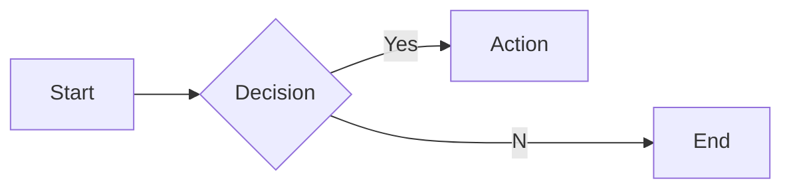
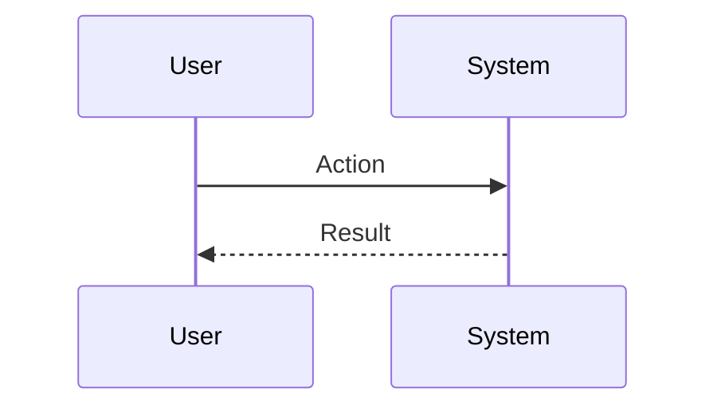

# Interview Questions: Data Platform (ROLE)

This document contains 100 interview questions tailored for the Data Platform role. The questions are designed to assess technical skills, soft skills, and cultural fit.

---

## 1. Conflict Resolution

**Scenario:** Disagreement with a peer.

**Question:** Tell me about a time you had a significant disagreement with a colleague. How did you resolve it?

**Key Concepts:** `Communication`, `Soft Skills`

### Candidate Response Paths
*   **Junior**: I told them I was right.
*   **Senior**: I listened to their perspective, found common ground, and we compromised.

---

## 2. Failure Handling

**Scenario:** A project went wrong.

**Question:** Describe a time you failed. What happened and what did you learn?

**Key Concepts:** `Growth Mindset`, `Resilience`

### Candidate Response Paths
*   **Junior**: I tried hard but it failed.
*   **Senior**: I analyzed the root cause, implemented a fix, and shared the learning.

---

## 3. Prioritization

**Scenario:** Too many tasks.

**Question:** How do you prioritize when you have multiple conflicting deadlines?

**Key Concepts:** `Time Management`, `Organization`

### Candidate Response Paths
*   **Junior**: I work longer hours.
*   **Senior**: I communicate with stakeholders to adjust expectations and focus on high-impact tasks.

---

## 4. Adaptability

**Scenario:** Changing requirements.

**Question:** How do you handle sudden changes in project scope or direction?

**Key Concepts:** `Agility`, `Flexibility`

### Candidate Response Paths
*   **Junior**: I get frustrated but do it.
*   **Senior**: I assess the impact, communicate risks, and pivot quickly.

---

## 5. Communication

**Scenario:** Explaining complex topics.

**Question:** Describe a time you had to explain a complex technical/business concept to a non-expert.

**Key Concepts:** `Clarity`, `Empathy`

### Candidate Response Paths
*   **Junior**: I just said it simpler.
*   **Senior**: I used analogies and checked for understanding throughout.

---

## 6. Teamwork

**Scenario:** Collaborating with difficult personalities.

**Question:** How do you handle working with someone who is difficult to work with?

**Key Concepts:** `Collaboration`, `EQ`

### Candidate Response Paths
*   **Junior**: I avoid them.
*   **Senior**: I try to understand their motivations and find a way to work together effectively.

---

## 7. Innovation

**Scenario:** Improving a process.

**Question:** Tell me about a time you improved a process or workflow.

| Metric | Target | Status |
|---|---|---|
| KPI 1 | 100% | Green |
| KPI 2 | < 5% | Yellow |

**Key Concepts:** `Innovation`, `Efficiency`

### Candidate Response Paths
*   **Junior**: I followed the rules.
*   **Senior**: I identified a bottleneck, proposed a solution, and measured the improvement.

---

## 8. Feedback

**Scenario:** Receiving constructive criticism.

**Question:** Tell me about a time you received difficult feedback. How did you react?

**Key Concepts:** `Self-awareness`, `Growth`

### Candidate Response Paths
*   **Junior**: I got defensive.
*   **Senior**: I listened, asked for examples, and worked on a plan to improve.

---

## 9. Leadership

**Scenario:** Leading without authority.

**Question:** Describe a time you demonstrated leadership when you weren't the formal manager.

**Key Concepts:** `Leadership`, `Influence`

### Candidate Response Paths
*   **Junior**: I told people what to do.
*   **Senior**: I rallied the team around a goal and supported them to achieve it.

---

## 10. Decision Making

**Scenario:** Incomplete information.

**Question:** How do you make decisions when you don't have all the data?

**Key Concepts:** `Judgment`, `Risk Mgmt`

### Candidate Response Paths
*   **Junior**: I wait for all data.
*   **Senior**: I assess the risk, make a call based on available info, and adjust as needed.

---

## 11. Ethics in Learning

**Scenario:** Ethics.

**Question:** What are the ethical considerations regarding Learning?

**Key Concepts:** `Learning`, `Ethics`

### Candidate Response Paths
*   **Junior**: Be nice.
*   **Senior**: Privacy, bias, and societal impact.

---

## 12. Future of Integrity

**Scenario:** Trends.

**Question:** Where do you see Integrity heading in the next 5 years?

**Key Concepts:** `Integrity`, `Vision`

### Candidate Response Paths
*   **Junior**: It will get better.
*   **Senior**: Emerging trends, AI impact, and market shifts.

---

## 13. Adaptability Best Practices

**Scenario:** Standardization.

**Question:** What are the industry best practices for Adaptability?

**Key Concepts:** `Adaptability`, `Standards`

### Candidate Response Paths
*   **Junior**: List a few.
*   **Senior**: Discusses why they are best practices and when to break them.

---

## 14. Deep Dive: Problem Solving

**Scenario:** Assessing depth in Problem Solving.

**Question:** Can you explain Problem Solving in detail and how you have applied it in your past role?

| Metric | Target | Status |
|---|---|---|
| KPI 1 | 100% | Green |
| KPI 2 | < 5% | Yellow |

**Key Concepts:** `Problem Solving`, `Experience`

### Candidate Response Paths
*   **Junior**: Basic definition.
*   **Senior**: Deep practical application and nuances.

---

## 15. Future of Problem Solving

**Scenario:** Trends.

**Question:** Where do you see Problem Solving heading in the next 5 years?

**Key Concepts:** `Problem Solving`, `Vision`

### Candidate Response Paths
*   **Junior**: It will get better.
*   **Senior**: Emerging trends, AI impact, and market shifts.

---

## 16. Mistakes in Communication

**Scenario:** Learning.

**Question:** What common mistakes do people make with Communication?

**Key Concepts:** `Communication`, `Experience`

### Candidate Response Paths
*   **Junior**: Doing it wrong.
*   **Senior**: Subtle pitfalls and how to avoid them.

---

## 17. Mistakes in Empathy

**Scenario:** Learning.

**Question:** What common mistakes do people make with Empathy?

**Key Concepts:** `Empathy`, `Experience`

### Candidate Response Paths
*   **Junior**: Doing it wrong.
*   **Senior**: Subtle pitfalls and how to avoid them.

---

## 18. Deep Dive: Resilience

**Scenario:** Assessing depth in Resilience.

**Question:** Can you explain Resilience in detail and how you have applied it in your past role?

**Key Concepts:** `Resilience`, `Experience`

### Candidate Response Paths
*   **Junior**: Basic definition.
*   **Senior**: Deep practical application and nuances.

---

## 19. Future of Focus

**Scenario:** Trends.

**Question:** Where do you see Focus heading in the next 5 years?

**Key Concepts:** `Focus`, `Vision`

### Candidate Response Paths
*   **Junior**: It will get better.
*   **Senior**: Emerging trends, AI impact, and market shifts.

---

## 20. Ethics in Adaptability

**Scenario:** Ethics.

**Question:** What are the ethical considerations regarding Adaptability?

**Key Concepts:** `Adaptability`, `Ethics`

### Candidate Response Paths
*   **Junior**: Be nice.
*   **Senior**: Privacy, bias, and societal impact.

---

## 21. Start vs Scale for Teamwork

**Scenario:** Context.

**Question:** How does your approach to Teamwork differ in a startup vs a large corp?

| Metric | Target | Status |
|---|---|---|
| KPI 1 | 100% | Green |
| KPI 2 | < 5% | Yellow |

**Key Concepts:** `Teamwork`, `Context`

### Candidate Response Paths
*   **Junior**: It's the same.
*   **Senior**: Speed/Chaos vs Process/Stability.

---

## 22. Start vs Scale for Problem Solving

**Scenario:** Context.

**Question:** How does your approach to Problem Solving differ in a startup vs a large corp?

**Key Concepts:** `Problem Solving`, `Context`

### Candidate Response Paths
*   **Junior**: It's the same.
*   **Senior**: Speed/Chaos vs Process/Stability.

---

## 23. Ethics in Conflict

**Scenario:** Ethics.

**Question:** What are the ethical considerations regarding Conflict?

**Key Concepts:** `Conflict`, `Ethics`

### Candidate Response Paths
*   **Junior**: Be nice.
*   **Senior**: Privacy, bias, and societal impact.

---

## 24. Teaching Feedback

**Scenario:** Mentorship.

**Question:** How would you teach Feedback to a junior team member?

**Key Concepts:** `Feedback`, `Mentorship`

### Candidate Response Paths
*   **Junior**: Send them a link.
*   **Senior**: Structured learning path and hands-on practice.

---

## 25. Mistakes in Adaptability

**Scenario:** Learning.

**Question:** What common mistakes do people make with Adaptability?

**Key Concepts:** `Adaptability`, `Experience`

### Candidate Response Paths
*   **Junior**: Doing it wrong.
*   **Senior**: Subtle pitfalls and how to avoid them.

---

## 26. Mistakes in Resilience

**Scenario:** Learning.

**Question:** What common mistakes do people make with Resilience?

**Key Concepts:** `Resilience`, `Experience`

### Candidate Response Paths
*   **Junior**: Doing it wrong.
*   **Senior**: Subtle pitfalls and how to avoid them.

---

## 27. Scaling Leadership

**Scenario:** Growth.

**Question:** How do you scale Leadership as the company grows?

**Key Concepts:** `Leadership`, `Scale`

### Candidate Response Paths
*   **Junior**: Hire more people.
*   **Senior**: Process automation, documentation, and leverage.

---

## 28. Ethics in Resilience

**Scenario:** Ethics.

**Question:** What are the ethical considerations regarding Resilience?

| Metric | Target | Status |
|---|---|---|
| KPI 1 | 100% | Green |
| KPI 2 | < 5% | Yellow |

**Key Concepts:** `Resilience`, `Ethics`

### Candidate Response Paths
*   **Junior**: Be nice.
*   **Senior**: Privacy, bias, and societal impact.

---

## 29. Collaboration in Integrity

**Scenario:** Teamwork.

**Question:** How does Integrity require cross-functional collaboration?

**Key Concepts:** `Integrity`, `Collaboration`

### Candidate Response Paths
*   **Junior**: I talk to people.
*   **Senior**: Alignment with other depts and shared goals.

---

## 30. Mistakes in Problem Solving

**Scenario:** Learning.

**Question:** What common mistakes do people make with Problem Solving?

**Key Concepts:** `Problem Solving`, `Experience`

### Candidate Response Paths
*   **Junior**: Doing it wrong.
*   **Senior**: Subtle pitfalls and how to avoid them.

---

## 31. Collaboration in Motivation

**Scenario:** Teamwork.

**Question:** How does Motivation require cross-functional collaboration?

**Key Concepts:** `Motivation`, `Collaboration`

### Candidate Response Paths
*   **Junior**: I talk to people.
*   **Senior**: Alignment with other depts and shared goals.

---

## 32. Tooling: Focus

**Scenario:** Proficiency.

**Question:** How do you utilize Focus to improve efficiency?

**Key Concepts:** `Focus`, `Productivity`

### Candidate Response Paths
*   **Junior**: I use it daily.
*   **Senior**: Advanced features and automation.

---

## 33. Scaling Integrity

**Scenario:** Growth.

**Question:** How do you scale Integrity as the company grows?

**Key Concepts:** `Integrity`, `Scale`

### Candidate Response Paths
*   **Junior**: Hire more people.
*   **Senior**: Process automation, documentation, and leverage.

---

## 34. Metrics for Learning

**Scenario:** Measurement.

**Question:** How do you measure success in Learning?

**Key Concepts:** `Learning`, `Analytics`

### Candidate Response Paths
*   **Junior**: I guess.
*   **Senior**: Specific KPIs and leading/lagging indicators.

---

## 35. Start vs Scale for Focus

**Scenario:** Context.

**Question:** How does your approach to Focus differ in a startup vs a large corp?

| Metric | Target | Status |
|---|---|---|
| KPI 1 | 100% | Green |
| KPI 2 | < 5% | Yellow |

**Key Concepts:** `Focus`, `Context`

### Candidate Response Paths
*   **Junior**: It's the same.
*   **Senior**: Speed/Chaos vs Process/Stability.

---

## 36. Tooling: Empathy

**Scenario:** Proficiency.

**Question:** How do you utilize Empathy to improve efficiency?

**Key Concepts:** `Empathy`, `Productivity`

### Candidate Response Paths
*   **Junior**: I use it daily.
*   **Senior**: Advanced features and automation.

---

## 37. Start vs Scale for Adaptability

**Scenario:** Context.

**Question:** How does your approach to Adaptability differ in a startup vs a large corp?

**Key Concepts:** `Adaptability`, `Context`

### Candidate Response Paths
*   **Junior**: It's the same.
*   **Senior**: Speed/Chaos vs Process/Stability.

---

## 38. Teamwork Best Practices

**Scenario:** Standardization.

**Question:** What are the industry best practices for Teamwork?

**Key Concepts:** `Teamwork`, `Standards`

### Candidate Response Paths
*   **Junior**: List a few.
*   **Senior**: Discusses why they are best practices and when to break them.

---

## 39. Mistakes in Integrity

**Scenario:** Learning.

**Question:** What common mistakes do people make with Integrity?

**Key Concepts:** `Integrity`, `Experience`

### Candidate Response Paths
*   **Junior**: Doing it wrong.
*   **Senior**: Subtle pitfalls and how to avoid them.

---

## 40. Scaling Communication

**Scenario:** Growth.

**Question:** How do you scale Communication as the company grows?

**Key Concepts:** `Communication`, `Scale`

### Candidate Response Paths
*   **Junior**: Hire more people.
*   **Senior**: Process automation, documentation, and leverage.

---

## 41. Metrics for Empathy

**Scenario:** Measurement.

**Question:** How do you measure success in Empathy?

**Key Concepts:** `Empathy`, `Analytics`

### Candidate Response Paths
*   **Junior**: I guess.
*   **Senior**: Specific KPIs and leading/lagging indicators.

---

## 42. Future of Communication

**Scenario:** Trends.

**Question:** Where do you see Communication heading in the next 5 years?

| Metric | Target | Status |
|---|---|---|
| KPI 1 | 100% | Green |
| KPI 2 | < 5% | Yellow |

**Key Concepts:** `Communication`, `Vision`

### Candidate Response Paths
*   **Junior**: It will get better.
*   **Senior**: Emerging trends, AI impact, and market shifts.

---

## 43. Tooling: Resilience

**Scenario:** Proficiency.

**Question:** How do you utilize Resilience to improve efficiency?

**Key Concepts:** `Resilience`, `Productivity`

### Candidate Response Paths
*   **Junior**: I use it daily.
*   **Senior**: Advanced features and automation.

---

## 44. Collaboration in Adaptability

**Scenario:** Teamwork.

**Question:** How does Adaptability require cross-functional collaboration?

**Key Concepts:** `Adaptability`, `Collaboration`

### Candidate Response Paths
*   **Junior**: I talk to people.
*   **Senior**: Alignment with other depts and shared goals.

---

## 45. Challenges in Resilience

**Scenario:** Problem Solving.

**Question:** What are the biggest challenges you've faced regarding Resilience?

**Key Concepts:** `Resilience`, `Problem Solving`

### Candidate Response Paths
*   **Junior**: It was hard.
*   **Senior**: Specific examples of obstacles and strategies to overcome them.

---

## 46. Deep Dive: Time Management

**Scenario:** Assessing depth in Time Management.

**Question:** Can you explain Time Management in detail and how you have applied it in your past role?

**Key Concepts:** `Time Management`, `Experience`

### Candidate Response Paths
*   **Junior**: Basic definition.
*   **Senior**: Deep practical application and nuances.

---

## 47. Collaboration in Focus

**Scenario:** Teamwork.

**Question:** How does Focus require cross-functional collaboration?

**Key Concepts:** `Focus`, `Collaboration`

### Candidate Response Paths
*   **Junior**: I talk to people.
*   **Senior**: Alignment with other depts and shared goals.

---

## 48. Teaching Motivation

**Scenario:** Mentorship.

**Question:** How would you teach Motivation to a junior team member?

**Key Concepts:** `Motivation`, `Mentorship`

### Candidate Response Paths
*   **Junior**: Send them a link.
*   **Senior**: Structured learning path and hands-on practice.

---

## 49. Mistakes in Innovation

**Scenario:** Learning.

**Question:** What common mistakes do people make with Innovation?

| Metric | Target | Status |
|---|---|---|
| KPI 1 | 100% | Green |
| KPI 2 | < 5% | Yellow |

**Key Concepts:** `Innovation`, `Experience`

### Candidate Response Paths
*   **Junior**: Doing it wrong.
*   **Senior**: Subtle pitfalls and how to avoid them.

---

## 50. Mistakes in Focus

**Scenario:** Learning.

**Question:** What common mistakes do people make with Focus?

**Key Concepts:** `Focus`, `Experience`

### Candidate Response Paths
*   **Junior**: Doing it wrong.
*   **Senior**: Subtle pitfalls and how to avoid them.

---

## 51. Tooling: Problem Solving

**Scenario:** Proficiency.

**Question:** How do you utilize Problem Solving to improve efficiency?

**Key Concepts:** `Problem Solving`, `Productivity`

### Candidate Response Paths
*   **Junior**: I use it daily.
*   **Senior**: Advanced features and automation.

---

## 52. Deep Dive: Adaptability

**Scenario:** Assessing depth in Adaptability.

**Question:** Can you explain Adaptability in detail and how you have applied it in your past role?

**Key Concepts:** `Adaptability`, `Experience`

### Candidate Response Paths
*   **Junior**: Basic definition.
*   **Senior**: Deep practical application and nuances.

---

## 53. Tooling: Adaptability

**Scenario:** Proficiency.

**Question:** How do you utilize Adaptability to improve efficiency?

**Key Concepts:** `Adaptability`, `Productivity`

### Candidate Response Paths
*   **Junior**: I use it daily.
*   **Senior**: Advanced features and automation.

---

## 54. Conflict Best Practices

**Scenario:** Standardization.

**Question:** What are the industry best practices for Conflict?

**Key Concepts:** `Conflict`, `Standards`

### Candidate Response Paths
*   **Junior**: List a few.
*   **Senior**: Discusses why they are best practices and when to break them.

---

## 55. Ethics in Innovation

**Scenario:** Ethics.

**Question:** What are the ethical considerations regarding Innovation?

**Key Concepts:** `Innovation`, `Ethics`

### Candidate Response Paths
*   **Junior**: Be nice.
*   **Senior**: Privacy, bias, and societal impact.

---

## 56. Mistakes in Time Management

**Scenario:** Learning.

**Question:** What common mistakes do people make with Time Management?

| Metric | Target | Status |
|---|---|---|
| KPI 1 | 100% | Green |
| KPI 2 | < 5% | Yellow |

**Key Concepts:** `Time Management`, `Experience`

### Candidate Response Paths
*   **Junior**: Doing it wrong.
*   **Senior**: Subtle pitfalls and how to avoid them.

---

## 57. Future of Empathy

**Scenario:** Trends.

**Question:** Where do you see Empathy heading in the next 5 years?

**Key Concepts:** `Empathy`, `Vision`

### Candidate Response Paths
*   **Junior**: It will get better.
*   **Senior**: Emerging trends, AI impact, and market shifts.

---

## 58. Deep Dive: Communication

**Scenario:** Assessing depth in Communication.

**Question:** Can you explain Communication in detail and how you have applied it in your past role?

**Key Concepts:** `Communication`, `Experience`

### Candidate Response Paths
*   **Junior**: Basic definition.
*   **Senior**: Deep practical application and nuances.

---

## 59. Deep Dive: Teamwork

**Scenario:** Assessing depth in Teamwork.

**Question:** Can you explain Teamwork in detail and how you have applied it in your past role?

**Key Concepts:** `Teamwork`, `Experience`

### Candidate Response Paths
*   **Junior**: Basic definition.
*   **Senior**: Deep practical application and nuances.

---

## 60. Collaboration in Problem Solving

**Scenario:** Teamwork.

**Question:** How does Problem Solving require cross-functional collaboration?

**Key Concepts:** `Problem Solving`, `Collaboration`

### Candidate Response Paths
*   **Junior**: I talk to people.
*   **Senior**: Alignment with other depts and shared goals.

---

## 61. Ethics in Time Management

**Scenario:** Ethics.

**Question:** What are the ethical considerations regarding Time Management?

**Key Concepts:** `Time Management`, `Ethics`

### Candidate Response Paths
*   **Junior**: Be nice.
*   **Senior**: Privacy, bias, and societal impact.

---

## 62. Start vs Scale for Learning

**Scenario:** Context.

**Question:** How does your approach to Learning differ in a startup vs a large corp?

**Key Concepts:** `Learning`, `Context`

### Candidate Response Paths
*   **Junior**: It's the same.
*   **Senior**: Speed/Chaos vs Process/Stability.

---

## 63. Tooling: Communication

**Scenario:** Proficiency.

**Question:** How do you utilize Communication to improve efficiency?

| Metric | Target | Status |
|---|---|---|
| KPI 1 | 100% | Green |
| KPI 2 | < 5% | Yellow |

**Key Concepts:** `Communication`, `Productivity`

### Candidate Response Paths
*   **Junior**: I use it daily.
*   **Senior**: Advanced features and automation.

---

## 64. Scaling Learning

**Scenario:** Growth.

**Question:** How do you scale Learning as the company grows?

**Key Concepts:** `Learning`, `Scale`

### Candidate Response Paths
*   **Junior**: Hire more people.
*   **Senior**: Process automation, documentation, and leverage.

---

## 65. Metrics for Focus

**Scenario:** Measurement.

**Question:** How do you measure success in Focus?

**Key Concepts:** `Focus`, `Analytics`

### Candidate Response Paths
*   **Junior**: I guess.
*   **Senior**: Specific KPIs and leading/lagging indicators.

---

## 66. Scaling Motivation

**Scenario:** Growth.

**Question:** How do you scale Motivation as the company grows?

**Key Concepts:** `Motivation`, `Scale`

### Candidate Response Paths
*   **Junior**: Hire more people.
*   **Senior**: Process automation, documentation, and leverage.

---

## 67. Start vs Scale for Leadership

**Scenario:** Context.

**Question:** How does your approach to Leadership differ in a startup vs a large corp?

**Key Concepts:** `Leadership`, `Context`

### Candidate Response Paths
*   **Junior**: It's the same.
*   **Senior**: Speed/Chaos vs Process/Stability.

---

## 68. Resilience Best Practices

**Scenario:** Standardization.

**Question:** What are the industry best practices for Resilience?

**Key Concepts:** `Resilience`, `Standards`

### Candidate Response Paths
*   **Junior**: List a few.
*   **Senior**: Discusses why they are best practices and when to break them.

---

## 69. Ethics in Communication

**Scenario:** Ethics.

**Question:** What are the ethical considerations regarding Communication?

**Key Concepts:** `Communication`, `Ethics`

### Candidate Response Paths
*   **Junior**: Be nice.
*   **Senior**: Privacy, bias, and societal impact.

---

## 70. Tooling: Conflict

**Scenario:** Proficiency.

**Question:** How do you utilize Conflict to improve efficiency?

| Metric | Target | Status |
|---|---|---|
| KPI 1 | 100% | Green |
| KPI 2 | < 5% | Yellow |

**Key Concepts:** `Conflict`, `Productivity`

### Candidate Response Paths
*   **Junior**: I use it daily.
*   **Senior**: Advanced features and automation.

---

## 71. Metrics for Adaptability

**Scenario:** Measurement.

**Question:** How do you measure success in Adaptability?

**Key Concepts:** `Adaptability`, `Analytics`

### Candidate Response Paths
*   **Junior**: I guess.
*   **Senior**: Specific KPIs and leading/lagging indicators.

---

## 72. Future of Teamwork

**Scenario:** Trends.

**Question:** Where do you see Teamwork heading in the next 5 years?

**Key Concepts:** `Teamwork`, `Vision`

### Candidate Response Paths
*   **Junior**: It will get better.
*   **Senior**: Emerging trends, AI impact, and market shifts.

---

## 73. Scaling Conflict

**Scenario:** Growth.

**Question:** How do you scale Conflict as the company grows?

**Key Concepts:** `Conflict`, `Scale`

### Candidate Response Paths
*   **Junior**: Hire more people.
*   **Senior**: Process automation, documentation, and leverage.

---

## 74. Challenges in Motivation

**Scenario:** Problem Solving.

**Question:** What are the biggest challenges you've faced regarding Motivation?

**Key Concepts:** `Motivation`, `Problem Solving`

### Candidate Response Paths
*   **Junior**: It was hard.
*   **Senior**: Specific examples of obstacles and strategies to overcome them.

---

## 75. Deep Dive: Motivation

**Scenario:** Assessing depth in Motivation.

**Question:** Can you explain Motivation in detail and how you have applied it in your past role?

**Key Concepts:** `Motivation`, `Experience`

### Candidate Response Paths
*   **Junior**: Basic definition.
*   **Senior**: Deep practical application and nuances.

---

## 76. Challenges in Integrity

**Scenario:** Problem Solving.

**Question:** What are the biggest challenges you've faced regarding Integrity?

**Key Concepts:** `Integrity`, `Problem Solving`

### Candidate Response Paths
*   **Junior**: It was hard.
*   **Senior**: Specific examples of obstacles and strategies to overcome them.

---

## 77. Metrics for Innovation

**Scenario:** Measurement.

**Question:** How do you measure success in Innovation?

| Metric | Target | Status |
|---|---|---|
| KPI 1 | 100% | Green |
| KPI 2 | < 5% | Yellow |

**Key Concepts:** `Innovation`, `Analytics`

### Candidate Response Paths
*   **Junior**: I guess.
*   **Senior**: Specific KPIs and leading/lagging indicators.

---

## 78. Start vs Scale for Time Management

**Scenario:** Context.

**Question:** How does your approach to Time Management differ in a startup vs a large corp?

**Key Concepts:** `Time Management`, `Context`

### Candidate Response Paths
*   **Junior**: It's the same.
*   **Senior**: Speed/Chaos vs Process/Stability.

---

## 79. Future of Time Management

**Scenario:** Trends.

**Question:** Where do you see Time Management heading in the next 5 years?

**Key Concepts:** `Time Management`, `Vision`

### Candidate Response Paths
*   **Junior**: It will get better.
*   **Senior**: Emerging trends, AI impact, and market shifts.

---

## 80. Teaching Resilience

**Scenario:** Mentorship.

**Question:** How would you teach Resilience to a junior team member?

**Key Concepts:** `Resilience`, `Mentorship`

### Candidate Response Paths
*   **Junior**: Send them a link.
*   **Senior**: Structured learning path and hands-on practice.

---

## 81. Metrics for Integrity

**Scenario:** Measurement.

**Question:** How do you measure success in Integrity?

**Key Concepts:** `Integrity`, `Analytics`

### Candidate Response Paths
*   **Junior**: I guess.
*   **Senior**: Specific KPIs and leading/lagging indicators.

---

## 82. Teaching Teamwork

**Scenario:** Mentorship.

**Question:** How would you teach Teamwork to a junior team member?

**Key Concepts:** `Teamwork`, `Mentorship`

### Candidate Response Paths
*   **Junior**: Send them a link.
*   **Senior**: Structured learning path and hands-on practice.

---

## 83. Start vs Scale for Communication

**Scenario:** Context.

**Question:** How does your approach to Communication differ in a startup vs a large corp?

**Key Concepts:** `Communication`, `Context`

### Candidate Response Paths
*   **Junior**: It's the same.
*   **Senior**: Speed/Chaos vs Process/Stability.

---

## 84. Teaching Time Management

**Scenario:** Mentorship.

**Question:** How would you teach Time Management to a junior team member?

| Metric | Target | Status |
|---|---|---|
| KPI 1 | 100% | Green |
| KPI 2 | < 5% | Yellow |

**Key Concepts:** `Time Management`, `Mentorship`

### Candidate Response Paths
*   **Junior**: Send them a link.
*   **Senior**: Structured learning path and hands-on practice.

---

## 85. Start vs Scale for Resilience

**Scenario:** Context.

**Question:** How does your approach to Resilience differ in a startup vs a large corp?

**Key Concepts:** `Resilience`, `Context`

### Candidate Response Paths
*   **Junior**: It's the same.
*   **Senior**: Speed/Chaos vs Process/Stability.

---

## 86. Deep Dive: Innovation

**Scenario:** Assessing depth in Innovation.

**Question:** Can you explain Innovation in detail and how you have applied it in your past role?

**Key Concepts:** `Innovation`, `Experience`

### Candidate Response Paths
*   **Junior**: Basic definition.
*   **Senior**: Deep practical application and nuances.

---

## 87. Teaching Innovation

**Scenario:** Mentorship.

**Question:** How would you teach Innovation to a junior team member?

**Key Concepts:** `Innovation`, `Mentorship`

### Candidate Response Paths
*   **Junior**: Send them a link.
*   **Senior**: Structured learning path and hands-on practice.

---

## 88. Motivation Best Practices

**Scenario:** Standardization.

**Question:** What are the industry best practices for Motivation?

**Key Concepts:** `Motivation`, `Standards`

### Candidate Response Paths
*   **Junior**: List a few.
*   **Senior**: Discusses why they are best practices and when to break them.

---

## 89. Feedback Best Practices

**Scenario:** Standardization.

**Question:** What are the industry best practices for Feedback?

**Key Concepts:** `Feedback`, `Standards`

### Candidate Response Paths
*   **Junior**: List a few.
*   **Senior**: Discusses why they are best practices and when to break them.

---

## 90. Tooling: Innovation

**Scenario:** Proficiency.

**Question:** How do you utilize Innovation to improve efficiency?

**Key Concepts:** `Innovation`, `Productivity`

### Candidate Response Paths
*   **Junior**: I use it daily.
*   **Senior**: Advanced features and automation.

---

## 91. Metrics for Time Management

**Scenario:** Measurement.

**Question:** How do you measure success in Time Management?

| Metric | Target | Status |
|---|---|---|
| KPI 1 | 100% | Green |
| KPI 2 | < 5% | Yellow |

**Key Concepts:** `Time Management`, `Analytics`

### Candidate Response Paths
*   **Junior**: I guess.
*   **Senior**: Specific KPIs and leading/lagging indicators.

---

## 92. Scaling Problem Solving

**Scenario:** Growth.

**Question:** How do you scale Problem Solving as the company grows?

**Key Concepts:** `Problem Solving`, `Scale`

### Candidate Response Paths
*   **Junior**: Hire more people.
*   **Senior**: Process automation, documentation, and leverage.

---

## 93. Ethics in Leadership

**Scenario:** Ethics.

**Question:** What are the ethical considerations regarding Leadership?

**Key Concepts:** `Leadership`, `Ethics`

### Candidate Response Paths
*   **Junior**: Be nice.
*   **Senior**: Privacy, bias, and societal impact.

---

## 94. Scaling Innovation

**Scenario:** Growth.

**Question:** How do you scale Innovation as the company grows?

**Key Concepts:** `Innovation`, `Scale`

### Candidate Response Paths
*   **Junior**: Hire more people.
*   **Senior**: Process automation, documentation, and leverage.

---

## 95. Metrics for Conflict

**Scenario:** Measurement.

**Question:** How do you measure success in Conflict?

**Key Concepts:** `Conflict`, `Analytics`

### Candidate Response Paths
*   **Junior**: I guess.
*   **Senior**: Specific KPIs and leading/lagging indicators.

---

## 96. Metrics for Resilience

**Scenario:** Measurement.

**Question:** How do you measure success in Resilience?

**Key Concepts:** `Resilience`, `Analytics`

### Candidate Response Paths
*   **Junior**: I guess.
*   **Senior**: Specific KPIs and leading/lagging indicators.

---

## 97. Empathy Best Practices

**Scenario:** Standardization.

**Question:** What are the industry best practices for Empathy?

**Key Concepts:** `Empathy`, `Standards`

### Candidate Response Paths
*   **Junior**: List a few.
*   **Senior**: Discusses why they are best practices and when to break them.

---

## 98. Ethics in Focus

**Scenario:** Ethics.

**Question:** What are the ethical considerations regarding Focus?

| Metric | Target | Status |
|---|---|---|
| KPI 1 | 100% | Green |
| KPI 2 | < 5% | Yellow |

**Key Concepts:** `Focus`, `Ethics`

### Candidate Response Paths
*   **Junior**: Be nice.
*   **Senior**: Privacy, bias, and societal impact.

---

## 99. Deep Dive: Feedback

**Scenario:** Assessing depth in Feedback.

**Question:** Can you explain Feedback in detail and how you have applied it in your past role?

**Key Concepts:** `Feedback`, `Experience`

### Candidate Response Paths
*   **Junior**: Basic definition.
*   **Senior**: Deep practical application and nuances.

---

## 100. Challenges in Leadership

**Scenario:** Problem Solving.

**Question:** What are the biggest challenges you've faced regarding Leadership?

**Key Concepts:** `Leadership`, `Problem Solving`

### Candidate Response Paths
*   **Junior**: It was hard.
*   **Senior**: Specific examples of obstacles and strategies to overcome them.

---
