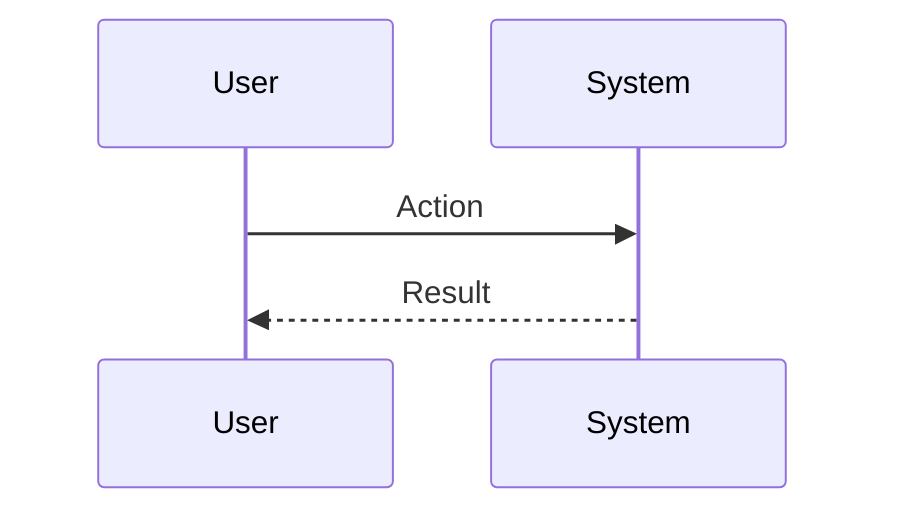
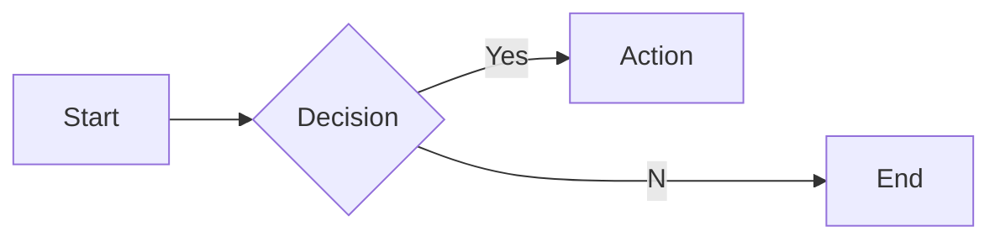

# Interview Questions: data_engineer (ROLE)

This document contains 100 interview questions tailored for the data_engineer role. The questions are designed to assess technical skills, soft skills, and cultural fit.

---

## 1. Code Review

**Scenario:** Large PRs.

**Question:** What is your approach to reviewing a massive Pull Request?

**Key Concepts:** `Code Quality`, `Process`

### Candidate Response Paths
*   **Junior**: LGTM.
*   **Senior**: Ask for it to be broken down, or checkout locally to verify.

---

## 2. Debugging

**Scenario:** Production bug.

**Question:** Production is down. Walk me through your debugging process.

**Key Concepts:** `Troubleshooting`, `Ops`

### Candidate Response Paths
*   **Junior**: Check logs.
*   **Senior**: Verify impact, Rollback if possible, bisect, fix.

---

## 3. System Design

**Scenario:** Scalability.

**Question:** Design a URL shortener.

**Key Concepts:** `System Design`, `Scalability`

### Candidate Response Paths
*   **Junior**: Database with auto-increment ID.
*   **Senior**: Distributed ID generation, hashing, redirection, and analytics.

---

## 4. Testing

**Scenario:** TDD.

**Question:** What is your philosophy on testing? Do you practice TDD?

**Key Concepts:** `Testing`, `Quality`

### Candidate Response Paths
*   **Junior**: I test manually.
*   **Senior**: Pyramid of testing (Unit > Integration > E2E) and pragmatic TDD.

---

## 5. Security

**Scenario:** SQL Injection.

**Question:** How do you prevent SQL injection in your code?

**Key Concepts:** `Security`, `Coding`

### Candidate Response Paths
*   **Junior**: Sanitize input.
*   **Senior**: Use ORMs and parameterized queries.

---

## 6. Performance

**Scenario:** Slow API.

**Question:** An API endpoint is slow. How do you optimize it?

**Key Concepts:** `Performance`, `Profiling`

### Candidate Response Paths
*   **Junior**: Add more servers.
*   **Senior**: Profile the code, check DB queries (N+1), add caching.

---

## 7. Documentation

**Scenario:** Legacy code.

**Question:** How do you handle working with undocumented legacy code?

| Metric | Target | Status |
|---|---|---|
| KPI 1 | 100% | Green |
| KPI 2 | < 5% | Yellow |

**Key Concepts:** `Documentation`, `Maintenance`

### Candidate Response Paths
*   **Junior**: Rewrite it.
*   **Senior**: Read code, write tests to characterize behavior, then refactor.

---

## 8. CI/CD

**Scenario:** Deployment.

**Question:** Describe your ideal CI/CD pipeline.

**Key Concepts:** `DevOps`, `Automation`

### Candidate Response Paths
*   **Junior**: I ftp files.
*   **Senior**: Lint -> Test -> Build -> Staging -> Integration Tests -> Production.

---

## 9. Database

**Scenario:** Indexing.

**Question:** When should you add an index to a database column?

**Key Concepts:** `Database`, `Optimization`

### Candidate Response Paths
*   **Junior**: On every column.
*   **Senior**: On columns used in WHERE/JOIN/ORDER BY, considering write performance impact.

---

## 10. API Design

**Scenario:** REST vs GraphQL.

**Question:** When would you choose GraphQL over REST?

**Key Concepts:** `API`, `Architecture`

### Candidate Response Paths
*   **Junior**: GraphQL is new.
*   **Senior**: To avoid over-fetching/under-fetching and for complex nested data requirements.

---

## 11. Conflict Resolution

**Scenario:** Disagreement with a peer.

**Question:** Tell me about a time you had a significant disagreement with a colleague. How did you resolve it?

**Key Concepts:** `Communication`, `Soft Skills`

### Candidate Response Paths
*   **Junior**: I told them I was right.
*   **Senior**: I listened to their perspective, found common ground, and we compromised.

---

## 12. Failure Handling

**Scenario:** A project went wrong.

**Question:** Describe a time you failed. What happened and what did you learn?

**Key Concepts:** `Growth Mindset`, `Resilience`

### Candidate Response Paths
*   **Junior**: I tried hard but it failed.
*   **Senior**: I analyzed the root cause, implemented a fix, and shared the learning.

---

## 13. Prioritization

**Scenario:** Too many tasks.

**Question:** How do you prioritize when you have multiple conflicting deadlines?

**Key Concepts:** `Time Management`, `Organization`

### Candidate Response Paths
*   **Junior**: I work longer hours.
*   **Senior**: I communicate with stakeholders to adjust expectations and focus on high-impact tasks.

---

## 14. Adaptability

**Scenario:** Changing requirements.

**Question:** How do you handle sudden changes in project scope or direction?

| Metric | Target | Status |
|---|---|---|
| KPI 1 | 100% | Green |
| KPI 2 | < 5% | Yellow |

**Key Concepts:** `Agility`, `Flexibility`

### Candidate Response Paths
*   **Junior**: I get frustrated but do it.
*   **Senior**: I assess the impact, communicate risks, and pivot quickly.

---

## 15. Communication

**Scenario:** Explaining complex topics.

**Question:** Describe a time you had to explain a complex technical/business concept to a non-expert.

**Key Concepts:** `Clarity`, `Empathy`

### Candidate Response Paths
*   **Junior**: I just said it simpler.
*   **Senior**: I used analogies and checked for understanding throughout.

---

## 16. Teamwork

**Scenario:** Collaborating with difficult personalities.

**Question:** How do you handle working with someone who is difficult to work with?

**Key Concepts:** `Collaboration`, `EQ`

### Candidate Response Paths
*   **Junior**: I avoid them.
*   **Senior**: I try to understand their motivations and find a way to work together effectively.

---

## 17. Innovation

**Scenario:** Improving a process.

**Question:** Tell me about a time you improved a process or workflow.

**Key Concepts:** `Innovation`, `Efficiency`

### Candidate Response Paths
*   **Junior**: I followed the rules.
*   **Senior**: I identified a bottleneck, proposed a solution, and measured the improvement.

---

## 18. Feedback

**Scenario:** Receiving constructive criticism.

**Question:** Tell me about a time you received difficult feedback. How did you react?

**Key Concepts:** `Self-awareness`, `Growth`

### Candidate Response Paths
*   **Junior**: I got defensive.
*   **Senior**: I listened, asked for examples, and worked on a plan to improve.

---

## 19. Leadership

**Scenario:** Leading without authority.

**Question:** Describe a time you demonstrated leadership when you weren't the formal manager.

**Key Concepts:** `Leadership`, `Influence`

### Candidate Response Paths
*   **Junior**: I told people what to do.
*   **Senior**: I rallied the team around a goal and supported them to achieve it.

---

## 20. Decision Making

**Scenario:** Incomplete information.

**Question:** How do you make decisions when you don't have all the data?

**Key Concepts:** `Judgment`, `Risk Mgmt`

### Candidate Response Paths
*   **Junior**: I wait for all data.
*   **Senior**: I assess the risk, make a call based on available info, and adjust as needed.

---

## 21. Challenges in Cloud

**Scenario:** Problem Solving.

**Question:** What are the biggest challenges you've faced regarding Cloud?

| Metric | Target | Status |
|---|---|---|
| KPI 1 | 100% | Green |
| KPI 2 | < 5% | Yellow |

**Key Concepts:** `Cloud`, `Problem Solving`

### Candidate Response Paths
*   **Junior**: It was hard.
*   **Senior**: Specific examples of obstacles and strategies to overcome them.

---

## 22. Start vs Scale for Containers

**Scenario:** Context.

**Question:** How does your approach to Containers differ in a startup vs a large corp?

**Key Concepts:** `Containers`, `Context`

### Candidate Response Paths
*   **Junior**: It's the same.
*   **Senior**: Speed/Chaos vs Process/Stability.

---

## 23. CI/CD Best Practices

**Scenario:** Standardization.

**Question:** What are the industry best practices for CI/CD?

**Key Concepts:** `CI/CD`, `Standards`

### Candidate Response Paths
*   **Junior**: List a few.
*   **Senior**: Discusses why they are best practices and when to break them.

---

## 24. Ethics in Cloud

**Scenario:** Ethics.

**Question:** What are the ethical considerations regarding Cloud?

**Key Concepts:** `Cloud`, `Ethics`

### Candidate Response Paths
*   **Junior**: Be nice.
*   **Senior**: Privacy, bias, and societal impact.

---

## 25. Mistakes in Performance

**Scenario:** Learning.

**Question:** What common mistakes do people make with Performance?

**Key Concepts:** `Performance`, `Experience`

### Candidate Response Paths
*   **Junior**: Doing it wrong.
*   **Senior**: Subtle pitfalls and how to avoid them.

---

## 26. Challenges in Code Review

**Scenario:** Problem Solving.

**Question:** What are the biggest challenges you've faced regarding Code Review?

**Key Concepts:** `Code Review`, `Problem Solving`

### Candidate Response Paths
*   **Junior**: It was hard.
*   **Senior**: Specific examples of obstacles and strategies to overcome them.

---

## 27. Deep Dive: Microservices

**Scenario:** Assessing depth in Microservices.

**Question:** Can you explain Microservices in detail and how you have applied it in your past role?

**Key Concepts:** `Microservices`, `Experience`

### Candidate Response Paths
*   **Junior**: Basic definition.
*   **Senior**: Deep practical application and nuances.

---

## 28. Future of Accessibility

**Scenario:** Trends.

**Question:** Where do you see Accessibility heading in the next 5 years?

| Metric | Target | Status |
|---|---|---|
| KPI 1 | 100% | Green |
| KPI 2 | < 5% | Yellow |

**Key Concepts:** `Accessibility`, `Vision`

### Candidate Response Paths
*   **Junior**: It will get better.
*   **Senior**: Emerging trends, AI impact, and market shifts.

---

## 29. Ethics in Git

**Scenario:** Ethics.

**Question:** What are the ethical considerations regarding Git?

**Key Concepts:** `Git`, `Ethics`

### Candidate Response Paths
*   **Junior**: Be nice.
*   **Senior**: Privacy, bias, and societal impact.

---

## 30. Teaching Accessibility

**Scenario:** Mentorship.

**Question:** How would you teach Accessibility to a junior team member?

**Key Concepts:** `Accessibility`, `Mentorship`

### Candidate Response Paths
*   **Junior**: Send them a link.
*   **Senior**: Structured learning path and hands-on practice.

---

## 31. Scaling Cloud

**Scenario:** Growth.

**Question:** How do you scale Cloud as the company grows?

**Key Concepts:** `Cloud`, `Scale`

### Candidate Response Paths
*   **Junior**: Hire more people.
*   **Senior**: Process automation, documentation, and leverage.

---

## 32. Scaling Security

**Scenario:** Growth.

**Question:** How do you scale Security as the company grows?

**Key Concepts:** `Security`, `Scale`

### Candidate Response Paths
*   **Junior**: Hire more people.
*   **Senior**: Process automation, documentation, and leverage.

---

## 33. Mistakes in Git

**Scenario:** Learning.

**Question:** What common mistakes do people make with Git?

**Key Concepts:** `Git`, `Experience`

### Candidate Response Paths
*   **Junior**: Doing it wrong.
*   **Senior**: Subtle pitfalls and how to avoid them.

---

## 34. Challenges in Database Design

**Scenario:** Problem Solving.

**Question:** What are the biggest challenges you've faced regarding Database Design?

**Key Concepts:** `Database Design`, `Problem Solving`

### Candidate Response Paths
*   **Junior**: It was hard.
*   **Senior**: Specific examples of obstacles and strategies to overcome them.

---

## 35. Deep Dive: Serverless

**Scenario:** Assessing depth in Serverless.

**Question:** Can you explain Serverless in detail and how you have applied it in your past role?

| Metric | Target | Status |
|---|---|---|
| KPI 1 | 100% | Green |
| KPI 2 | < 5% | Yellow |

**Key Concepts:** `Serverless`, `Experience`

### Candidate Response Paths
*   **Junior**: Basic definition.
*   **Senior**: Deep practical application and nuances.

---

## 36. Start vs Scale for Git

**Scenario:** Context.

**Question:** How does your approach to Git differ in a startup vs a large corp?

**Key Concepts:** `Git`, `Context`

### Candidate Response Paths
*   **Junior**: It's the same.
*   **Senior**: Speed/Chaos vs Process/Stability.

---

## 37. Future of Database Design

**Scenario:** Trends.

**Question:** Where do you see Database Design heading in the next 5 years?

**Key Concepts:** `Database Design`, `Vision`

### Candidate Response Paths
*   **Junior**: It will get better.
*   **Senior**: Emerging trends, AI impact, and market shifts.

---

## 38. Scaling Accessibility

**Scenario:** Growth.

**Question:** How do you scale Accessibility as the company grows?

**Key Concepts:** `Accessibility`, `Scale`

### Candidate Response Paths
*   **Junior**: Hire more people.
*   **Senior**: Process automation, documentation, and leverage.

---

## 39. Mistakes in Documentation

**Scenario:** Learning.

**Question:** What common mistakes do people make with Documentation?

**Key Concepts:** `Documentation`, `Experience`

### Candidate Response Paths
*   **Junior**: Doing it wrong.
*   **Senior**: Subtle pitfalls and how to avoid them.

---

## 40. Collaboration in Accessibility

**Scenario:** Teamwork.

**Question:** How does Accessibility require cross-functional collaboration?

**Key Concepts:** `Accessibility`, `Collaboration`

### Candidate Response Paths
*   **Junior**: I talk to people.
*   **Senior**: Alignment with other depts and shared goals.

---

## 41. Database Design Best Practices

**Scenario:** Standardization.

**Question:** What are the industry best practices for Database Design?

**Key Concepts:** `Database Design`, `Standards`

### Candidate Response Paths
*   **Junior**: List a few.
*   **Senior**: Discusses why they are best practices and when to break them.

---

## 42. Collaboration in Git

**Scenario:** Teamwork.

**Question:** How does Git require cross-functional collaboration?

| Metric | Target | Status |
|---|---|---|
| KPI 1 | 100% | Green |
| KPI 2 | < 5% | Yellow |

**Key Concepts:** `Git`, `Collaboration`

### Candidate Response Paths
*   **Junior**: I talk to people.
*   **Senior**: Alignment with other depts and shared goals.

---

## 43. Collaboration in Security

**Scenario:** Teamwork.

**Question:** How does Security require cross-functional collaboration?

**Key Concepts:** `Security`, `Collaboration`

### Candidate Response Paths
*   **Junior**: I talk to people.
*   **Senior**: Alignment with other depts and shared goals.

---

## 44. Collaboration in Performance

**Scenario:** Teamwork.

**Question:** How does Performance require cross-functional collaboration?

**Key Concepts:** `Performance`, `Collaboration`

### Candidate Response Paths
*   **Junior**: I talk to people.
*   **Senior**: Alignment with other depts and shared goals.

---

## 45. Metrics for Microservices

**Scenario:** Measurement.

**Question:** How do you measure success in Microservices?

**Key Concepts:** `Microservices`, `Analytics`

### Candidate Response Paths
*   **Junior**: I guess.
*   **Senior**: Specific KPIs and leading/lagging indicators.

---

## 46. Metrics for Cloud

**Scenario:** Measurement.

**Question:** How do you measure success in Cloud?

**Key Concepts:** `Cloud`, `Analytics`

### Candidate Response Paths
*   **Junior**: I guess.
*   **Senior**: Specific KPIs and leading/lagging indicators.

---

## 47. Tooling: Database Design

**Scenario:** Proficiency.

**Question:** How do you utilize Database Design to improve efficiency?

**Key Concepts:** `Database Design`, `Productivity`

### Candidate Response Paths
*   **Junior**: I use it daily.
*   **Senior**: Advanced features and automation.

---

## 48. Metrics for Debugging

**Scenario:** Measurement.

**Question:** How do you measure success in Debugging?

**Key Concepts:** `Debugging`, `Analytics`

### Candidate Response Paths
*   **Junior**: I guess.
*   **Senior**: Specific KPIs and leading/lagging indicators.

---

## 49. Metrics for CI/CD

**Scenario:** Measurement.

**Question:** How do you measure success in CI/CD?

| Metric | Target | Status |
|---|---|---|
| KPI 1 | 100% | Green |
| KPI 2 | < 5% | Yellow |

**Key Concepts:** `CI/CD`, `Analytics`

### Candidate Response Paths
*   **Junior**: I guess.
*   **Senior**: Specific KPIs and leading/lagging indicators.

---

## 50. Start vs Scale for Code Review

**Scenario:** Context.

**Question:** How does your approach to Code Review differ in a startup vs a large corp?

**Key Concepts:** `Code Review`, `Context`

### Candidate Response Paths
*   **Junior**: It's the same.
*   **Senior**: Speed/Chaos vs Process/Stability.

---

## 51. Collaboration in Documentation

**Scenario:** Teamwork.

**Question:** How does Documentation require cross-functional collaboration?

**Key Concepts:** `Documentation`, `Collaboration`

### Candidate Response Paths
*   **Junior**: I talk to people.
*   **Senior**: Alignment with other depts and shared goals.

---

## 52. Ethics in Debugging

**Scenario:** Ethics.

**Question:** What are the ethical considerations regarding Debugging?

**Key Concepts:** `Debugging`, `Ethics`

### Candidate Response Paths
*   **Junior**: Be nice.
*   **Senior**: Privacy, bias, and societal impact.

---

## 53. Mistakes in API Design

**Scenario:** Learning.

**Question:** What common mistakes do people make with API Design?

**Key Concepts:** `API Design`, `Experience`

### Candidate Response Paths
*   **Junior**: Doing it wrong.
*   **Senior**: Subtle pitfalls and how to avoid them.

---

## 54. Ethics in Security

**Scenario:** Ethics.

**Question:** What are the ethical considerations regarding Security?

**Key Concepts:** `Security`, `Ethics`

### Candidate Response Paths
*   **Junior**: Be nice.
*   **Senior**: Privacy, bias, and societal impact.

---

## 55. Scaling Containers

**Scenario:** Growth.

**Question:** How do you scale Containers as the company grows?

**Key Concepts:** `Containers`, `Scale`

### Candidate Response Paths
*   **Junior**: Hire more people.
*   **Senior**: Process automation, documentation, and leverage.

---

## 56. Security Best Practices

**Scenario:** Standardization.

**Question:** What are the industry best practices for Security?

| Metric | Target | Status |
|---|---|---|
| KPI 1 | 100% | Green |
| KPI 2 | < 5% | Yellow |

**Key Concepts:** `Security`, `Standards`

### Candidate Response Paths
*   **Junior**: List a few.
*   **Senior**: Discusses why they are best practices and when to break them.

---

## 57. Tooling: CI/CD

**Scenario:** Proficiency.

**Question:** How do you utilize CI/CD to improve efficiency?

**Key Concepts:** `CI/CD`, `Productivity`

### Candidate Response Paths
*   **Junior**: I use it daily.
*   **Senior**: Advanced features and automation.

---

## 58. Mistakes in Cloud

**Scenario:** Learning.

**Question:** What common mistakes do people make with Cloud?

**Key Concepts:** `Cloud`, `Experience`

### Candidate Response Paths
*   **Junior**: Doing it wrong.
*   **Senior**: Subtle pitfalls and how to avoid them.

---

## 59. Ethics in Code Review

**Scenario:** Ethics.

**Question:** What are the ethical considerations regarding Code Review?

**Key Concepts:** `Code Review`, `Ethics`

### Candidate Response Paths
*   **Junior**: Be nice.
*   **Senior**: Privacy, bias, and societal impact.

---

## 60. Start vs Scale for Debugging

**Scenario:** Context.

**Question:** How does your approach to Debugging differ in a startup vs a large corp?

**Key Concepts:** `Debugging`, `Context`

### Candidate Response Paths
*   **Junior**: It's the same.
*   **Senior**: Speed/Chaos vs Process/Stability.

---

## 61. Challenges in Git

**Scenario:** Problem Solving.

**Question:** What are the biggest challenges you've faced regarding Git?

**Key Concepts:** `Git`, `Problem Solving`

### Candidate Response Paths
*   **Junior**: It was hard.
*   **Senior**: Specific examples of obstacles and strategies to overcome them.

---

## 62. Challenges in Containers

**Scenario:** Problem Solving.

**Question:** What are the biggest challenges you've faced regarding Containers?

**Key Concepts:** `Containers`, `Problem Solving`

### Candidate Response Paths
*   **Junior**: It was hard.
*   **Senior**: Specific examples of obstacles and strategies to overcome them.

---

## 63. Future of Containers

**Scenario:** Trends.

**Question:** Where do you see Containers heading in the next 5 years?

| Metric | Target | Status |
|---|---|---|
| KPI 1 | 100% | Green |
| KPI 2 | < 5% | Yellow |

**Key Concepts:** `Containers`, `Vision`

### Candidate Response Paths
*   **Junior**: It will get better.
*   **Senior**: Emerging trends, AI impact, and market shifts.

---

## 64. Deep Dive: Containers

**Scenario:** Assessing depth in Containers.

**Question:** Can you explain Containers in detail and how you have applied it in your past role?

**Key Concepts:** `Containers`, `Experience`

### Candidate Response Paths
*   **Junior**: Basic definition.
*   **Senior**: Deep practical application and nuances.

---

## 65. Tooling: Performance

**Scenario:** Proficiency.

**Question:** How do you utilize Performance to improve efficiency?

**Key Concepts:** `Performance`, `Productivity`

### Candidate Response Paths
*   **Junior**: I use it daily.
*   **Senior**: Advanced features and automation.

---

## 66. Collaboration in Serverless

**Scenario:** Teamwork.

**Question:** How does Serverless require cross-functional collaboration?

**Key Concepts:** `Serverless`, `Collaboration`

### Candidate Response Paths
*   **Junior**: I talk to people.
*   **Senior**: Alignment with other depts and shared goals.

---

## 67. Teaching Database Design

**Scenario:** Mentorship.

**Question:** How would you teach Database Design to a junior team member?

**Key Concepts:** `Database Design`, `Mentorship`

### Candidate Response Paths
*   **Junior**: Send them a link.
*   **Senior**: Structured learning path and hands-on practice.

---

## 68. Accessibility Best Practices

**Scenario:** Standardization.

**Question:** What are the industry best practices for Accessibility?

**Key Concepts:** `Accessibility`, `Standards`

### Candidate Response Paths
*   **Junior**: List a few.
*   **Senior**: Discusses why they are best practices and when to break them.

---

## 69. Collaboration in Microservices

**Scenario:** Teamwork.

**Question:** How does Microservices require cross-functional collaboration?

**Key Concepts:** `Microservices`, `Collaboration`

### Candidate Response Paths
*   **Junior**: I talk to people.
*   **Senior**: Alignment with other depts and shared goals.

---

## 70. Mistakes in CI/CD

**Scenario:** Learning.

**Question:** What common mistakes do people make with CI/CD?

| Metric | Target | Status |
|---|---|---|
| KPI 1 | 100% | Green |
| KPI 2 | < 5% | Yellow |

**Key Concepts:** `CI/CD`, `Experience`

### Candidate Response Paths
*   **Junior**: Doing it wrong.
*   **Senior**: Subtle pitfalls and how to avoid them.

---

## 71. Start vs Scale for CI/CD

**Scenario:** Context.

**Question:** How does your approach to CI/CD differ in a startup vs a large corp?

**Key Concepts:** `CI/CD`, `Context`

### Candidate Response Paths
*   **Junior**: It's the same.
*   **Senior**: Speed/Chaos vs Process/Stability.

---

## 72. Metrics for Containers

**Scenario:** Measurement.

**Question:** How do you measure success in Containers?

**Key Concepts:** `Containers`, `Analytics`

### Candidate Response Paths
*   **Junior**: I guess.
*   **Senior**: Specific KPIs and leading/lagging indicators.

---

## 73. Challenges in Security

**Scenario:** Problem Solving.

**Question:** What are the biggest challenges you've faced regarding Security?

**Key Concepts:** `Security`, `Problem Solving`

### Candidate Response Paths
*   **Junior**: It was hard.
*   **Senior**: Specific examples of obstacles and strategies to overcome them.

---

## 74. Ethics in Microservices

**Scenario:** Ethics.

**Question:** What are the ethical considerations regarding Microservices?

**Key Concepts:** `Microservices`, `Ethics`

### Candidate Response Paths
*   **Junior**: Be nice.
*   **Senior**: Privacy, bias, and societal impact.

---

## 75. Deep Dive: Documentation

**Scenario:** Assessing depth in Documentation.

**Question:** Can you explain Documentation in detail and how you have applied it in your past role?

**Key Concepts:** `Documentation`, `Experience`

### Candidate Response Paths
*   **Junior**: Basic definition.
*   **Senior**: Deep practical application and nuances.

---

## 76. Start vs Scale for Database Design

**Scenario:** Context.

**Question:** How does your approach to Database Design differ in a startup vs a large corp?

**Key Concepts:** `Database Design`, `Context`

### Candidate Response Paths
*   **Junior**: It's the same.
*   **Senior**: Speed/Chaos vs Process/Stability.

---

## 77. Challenges in Debugging

**Scenario:** Problem Solving.

**Question:** What are the biggest challenges you've faced regarding Debugging?

| Metric | Target | Status |
|---|---|---|
| KPI 1 | 100% | Green |
| KPI 2 | < 5% | Yellow |

**Key Concepts:** `Debugging`, `Problem Solving`

### Candidate Response Paths
*   **Junior**: It was hard.
*   **Senior**: Specific examples of obstacles and strategies to overcome them.

---

## 78. Collaboration in API Design

**Scenario:** Teamwork.

**Question:** How does API Design require cross-functional collaboration?

**Key Concepts:** `API Design`, `Collaboration`

### Candidate Response Paths
*   **Junior**: I talk to people.
*   **Senior**: Alignment with other depts and shared goals.

---

## 79. Metrics for Testing

**Scenario:** Measurement.

**Question:** How do you measure success in Testing?

**Key Concepts:** `Testing`, `Analytics`

### Candidate Response Paths
*   **Junior**: I guess.
*   **Senior**: Specific KPIs and leading/lagging indicators.

---

## 80. Code Review Best Practices

**Scenario:** Standardization.

**Question:** What are the industry best practices for Code Review?

**Key Concepts:** `Code Review`, `Standards`

### Candidate Response Paths
*   **Junior**: List a few.
*   **Senior**: Discusses why they are best practices and when to break them.

---

## 81. Performance Best Practices

**Scenario:** Standardization.

**Question:** What are the industry best practices for Performance?

**Key Concepts:** `Performance`, `Standards`

### Candidate Response Paths
*   **Junior**: List a few.
*   **Senior**: Discusses why they are best practices and when to break them.

---

## 82. Start vs Scale for API Design

**Scenario:** Context.

**Question:** How does your approach to API Design differ in a startup vs a large corp?

**Key Concepts:** `API Design`, `Context`

### Candidate Response Paths
*   **Junior**: It's the same.
*   **Senior**: Speed/Chaos vs Process/Stability.

---

## 83. Metrics for Database Design

**Scenario:** Measurement.

**Question:** How do you measure success in Database Design?

**Key Concepts:** `Database Design`, `Analytics`

### Candidate Response Paths
*   **Junior**: I guess.
*   **Senior**: Specific KPIs and leading/lagging indicators.

---

## 84. Ethics in Performance

**Scenario:** Ethics.

**Question:** What are the ethical considerations regarding Performance?

| Metric | Target | Status |
|---|---|---|
| KPI 1 | 100% | Green |
| KPI 2 | < 5% | Yellow |

**Key Concepts:** `Performance`, `Ethics`

### Candidate Response Paths
*   **Junior**: Be nice.
*   **Senior**: Privacy, bias, and societal impact.

---

## 85. Start vs Scale for Performance

**Scenario:** Context.

**Question:** How does your approach to Performance differ in a startup vs a large corp?

**Key Concepts:** `Performance`, `Context`

### Candidate Response Paths
*   **Junior**: It's the same.
*   **Senior**: Speed/Chaos vs Process/Stability.

---

## 86. Teaching Testing

**Scenario:** Mentorship.

**Question:** How would you teach Testing to a junior team member?

**Key Concepts:** `Testing`, `Mentorship`

### Candidate Response Paths
*   **Junior**: Send them a link.
*   **Senior**: Structured learning path and hands-on practice.

---

## 87. Challenges in CI/CD

**Scenario:** Problem Solving.

**Question:** What are the biggest challenges you've faced regarding CI/CD?

**Key Concepts:** `CI/CD`, `Problem Solving`

### Candidate Response Paths
*   **Junior**: It was hard.
*   **Senior**: Specific examples of obstacles and strategies to overcome them.

---

## 88. Collaboration in Testing

**Scenario:** Teamwork.

**Question:** How does Testing require cross-functional collaboration?

**Key Concepts:** `Testing`, `Collaboration`

### Candidate Response Paths
*   **Junior**: I talk to people.
*   **Senior**: Alignment with other depts and shared goals.

---

## 89. Future of Performance

**Scenario:** Trends.

**Question:** Where do you see Performance heading in the next 5 years?

**Key Concepts:** `Performance`, `Vision`

### Candidate Response Paths
*   **Junior**: It will get better.
*   **Senior**: Emerging trends, AI impact, and market shifts.

---

## 90. Start vs Scale for Testing

**Scenario:** Context.

**Question:** How does your approach to Testing differ in a startup vs a large corp?

**Key Concepts:** `Testing`, `Context`

### Candidate Response Paths
*   **Junior**: It's the same.
*   **Senior**: Speed/Chaos vs Process/Stability.

---

## 91. Containers Best Practices

**Scenario:** Standardization.

**Question:** What are the industry best practices for Containers?

| Metric | Target | Status |
|---|---|---|
| KPI 1 | 100% | Green |
| KPI 2 | < 5% | Yellow |

**Key Concepts:** `Containers`, `Standards`

### Candidate Response Paths
*   **Junior**: List a few.
*   **Senior**: Discusses why they are best practices and when to break them.

---

## 92. Mistakes in Serverless

**Scenario:** Learning.

**Question:** What common mistakes do people make with Serverless?

**Key Concepts:** `Serverless`, `Experience`

### Candidate Response Paths
*   **Junior**: Doing it wrong.
*   **Senior**: Subtle pitfalls and how to avoid them.

---

## 93. Future of Security

**Scenario:** Trends.

**Question:** Where do you see Security heading in the next 5 years?

**Key Concepts:** `Security`, `Vision`

### Candidate Response Paths
*   **Junior**: It will get better.
*   **Senior**: Emerging trends, AI impact, and market shifts.

---

## 94. Teaching Containers

**Scenario:** Mentorship.

**Question:** How would you teach Containers to a junior team member?

**Key Concepts:** `Containers`, `Mentorship`

### Candidate Response Paths
*   **Junior**: Send them a link.
*   **Senior**: Structured learning path and hands-on practice.

---

## 95. Metrics for Accessibility

**Scenario:** Measurement.

**Question:** How do you measure success in Accessibility?

**Key Concepts:** `Accessibility`, `Analytics`

### Candidate Response Paths
*   **Junior**: I guess.
*   **Senior**: Specific KPIs and leading/lagging indicators.

---

## 96. Future of Code Review

**Scenario:** Trends.

**Question:** Where do you see Code Review heading in the next 5 years?

**Key Concepts:** `Code Review`, `Vision`

### Candidate Response Paths
*   **Junior**: It will get better.
*   **Senior**: Emerging trends, AI impact, and market shifts.

---

## 97. Teaching Serverless

**Scenario:** Mentorship.

**Question:** How would you teach Serverless to a junior team member?

**Key Concepts:** `Serverless`, `Mentorship`

### Candidate Response Paths
*   **Junior**: Send them a link.
*   **Senior**: Structured learning path and hands-on practice.

---

## 98. Start vs Scale for Security

**Scenario:** Context.

**Question:** How does your approach to Security differ in a startup vs a large corp?

| Metric | Target | Status |
|---|---|---|
| KPI 1 | 100% | Green |
| KPI 2 | < 5% | Yellow |

**Key Concepts:** `Security`, `Context`

### Candidate Response Paths
*   **Junior**: It's the same.
*   **Senior**: Speed/Chaos vs Process/Stability.

---

## 99. Start vs Scale for Documentation

**Scenario:** Context.

**Question:** How does your approach to Documentation differ in a startup vs a large corp?

**Key Concepts:** `Documentation`, `Context`

### Candidate Response Paths
*   **Junior**: It's the same.
*   **Senior**: Speed/Chaos vs Process/Stability.

---

## 100. Mistakes in Security

**Scenario:** Learning.

**Question:** What common mistakes do people make with Security?

**Key Concepts:** `Security`, `Experience`

### Candidate Response Paths
*   **Junior**: Doing it wrong.
*   **Senior**: Subtle pitfalls and how to avoid them.

---
