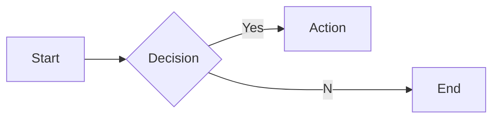
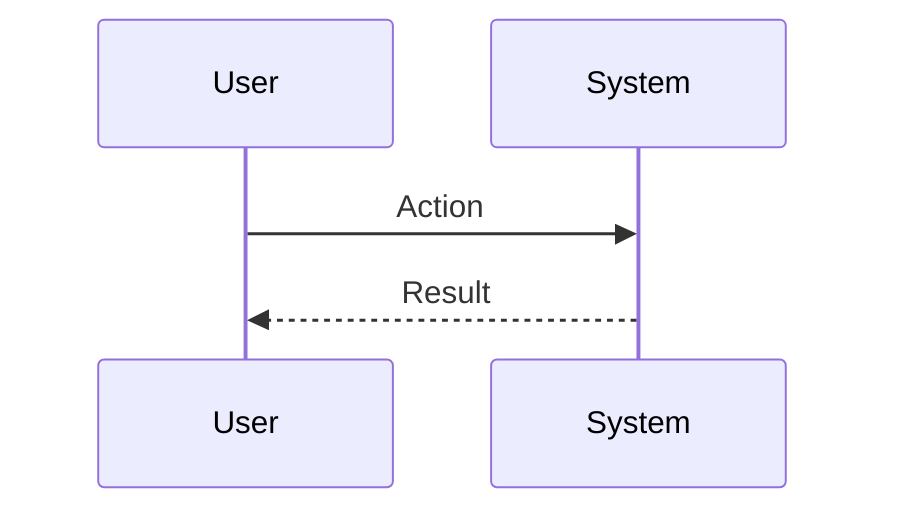

# Interview Questions: director_of_infrastructure (ROLE)

This document contains 100 interview questions tailored for the director_of_infrastructure role. The questions are designed to assess technical skills, soft skills, and cultural fit.

---

## 1. Tech Debt vs Features

**Scenario:** Product wants features, Eng wants refactor.

**Question:** How do you balance technical debt with new feature development?

**Key Concepts:** `Prioritization`, `Negotiation`

### Candidate Response Paths
*   **Junior**: We just do features.
*   **Senior**: Allocating a % capacity for debt or dedicated 'fix-it' sprints.

---

## 2. Team Morale

**Scenario:** Burnout.

**Question:** How do you detect and prevent burnout in your engineering team?

**Key Concepts:** `People Mgmt`, `Empathy`

### Candidate Response Paths
*   **Junior**: Tell them to take a day off.
*   **Senior**: Monitoring velocity drops, 1:1 sentiment, and enforcing work-life balance.

---

## 3. Performance Management

**Scenario:** Underperforming engineer.

**Question:** How do you handle a senior engineer who is technically brilliant but toxic?

**Key Concepts:** `Management`, `Culture`

### Candidate Response Paths
*   **Junior**: Keep them because they code well.
*   **Senior**: Coaching first, but if behavior doesn't change, manage them out to protect culture.

---

## 4. Recruiting

**Scenario:** Hiring freeze.

**Question:** How do you attract top talent when you can't offer the highest salaries?

**Key Concepts:** `Hiring`, `Culture`

### Candidate Response Paths
*   **Junior**: I can't.
*   **Senior**: Sell the mission, the challenge, and the team culture.

---

## 5. Engineering Culture

**Scenario:** Silos.

**Question:** How do you break down silos between different engineering teams?

**Key Concepts:** `Collaboration`, `Culture`

### Candidate Response Paths
*   **Junior**: Force them to meet.
*   **Senior**: Shared goals, rotation programs, and guilds/chapters.

---

## 6. Process Improvement

**Scenario:** Slow velocity.

**Question:** Your team's velocity has dropped. What do you do?

**Key Concepts:** `Agile`, `Metrics`

### Candidate Response Paths
*   **Junior**: Ask them to work harder.
*   **Senior**: Analyze the bottlenecks (retrospectives), check for blockers, and simplify process.

---

## 7. Stakeholder Management

**Scenario:** Missed deadline.

**Question:** How do you handle communicating a missed deadline to the business?

| Metric | Target | Status |
|---|---|---|
| KPI 1 | 100% | Green |
| KPI 2 | < 5% | Yellow |

**Key Concepts:** `Communication`, `Trust`

### Candidate Response Paths
*   **Junior**: Hide it until the end.
*   **Senior**: Early warning, explanation of root cause, and revised confident plan.

---

## 8. Mentorship

**Scenario:** Junior growth.

**Question:** How do you structure mentorship within your team?

**Key Concepts:** `Growth`, `People`

### Candidate Response Paths
*   **Junior**: Pair them up.
*   **Senior**: Formal goals, regular check-ins, and clear career ladders.

---

## 9. Onboarding

**Scenario:** New hire.

**Question:** What does a successful onboarding process look like?

**Key Concepts:** `Process`, `Experience`

### Candidate Response Paths
*   **Junior**: Give them a laptop.
*   **Senior**: First commit on day 1, 30-60-90 day plan, and a buddy system.

---

## 10. Remote Work

**Scenario:** Distributed team.

**Question:** How do you manage a fully distributed engineering team effectively?

**Key Concepts:** `Remote`, `Management`

### Candidate Response Paths
*   **Junior**: Zoom all day.
*   **Senior**: Async-first communication, written documentation, and building social connection.

---

## 11. Conflict Resolution

**Scenario:** Disagreement with a peer.

**Question:** Tell me about a time you had a significant disagreement with a colleague. How did you resolve it?

**Key Concepts:** `Communication`, `Soft Skills`

### Candidate Response Paths
*   **Junior**: I told them I was right.
*   **Senior**: I listened to their perspective, found common ground, and we compromised.

---

## 12. Failure Handling

**Scenario:** A project went wrong.

**Question:** Describe a time you failed. What happened and what did you learn?

**Key Concepts:** `Growth Mindset`, `Resilience`

### Candidate Response Paths
*   **Junior**: I tried hard but it failed.
*   **Senior**: I analyzed the root cause, implemented a fix, and shared the learning.

---

## 13. Prioritization

**Scenario:** Too many tasks.

**Question:** How do you prioritize when you have multiple conflicting deadlines?

**Key Concepts:** `Time Management`, `Organization`

### Candidate Response Paths
*   **Junior**: I work longer hours.
*   **Senior**: I communicate with stakeholders to adjust expectations and focus on high-impact tasks.

---

## 14. Adaptability

**Scenario:** Changing requirements.

**Question:** How do you handle sudden changes in project scope or direction?

| Metric | Target | Status |
|---|---|---|
| KPI 1 | 100% | Green |
| KPI 2 | < 5% | Yellow |

**Key Concepts:** `Agility`, `Flexibility`

### Candidate Response Paths
*   **Junior**: I get frustrated but do it.
*   **Senior**: I assess the impact, communicate risks, and pivot quickly.

---

## 15. Communication

**Scenario:** Explaining complex topics.

**Question:** Describe a time you had to explain a complex technical/business concept to a non-expert.

**Key Concepts:** `Clarity`, `Empathy`

### Candidate Response Paths
*   **Junior**: I just said it simpler.
*   **Senior**: I used analogies and checked for understanding throughout.

---

## 16. Teamwork

**Scenario:** Collaborating with difficult personalities.

**Question:** How do you handle working with someone who is difficult to work with?

**Key Concepts:** `Collaboration`, `EQ`

### Candidate Response Paths
*   **Junior**: I avoid them.
*   **Senior**: I try to understand their motivations and find a way to work together effectively.

---

## 17. Innovation

**Scenario:** Improving a process.

**Question:** Tell me about a time you improved a process or workflow.

**Key Concepts:** `Innovation`, `Efficiency`

### Candidate Response Paths
*   **Junior**: I followed the rules.
*   **Senior**: I identified a bottleneck, proposed a solution, and measured the improvement.

---

## 18. Feedback

**Scenario:** Receiving constructive criticism.

**Question:** Tell me about a time you received difficult feedback. How did you react?

**Key Concepts:** `Self-awareness`, `Growth`

### Candidate Response Paths
*   **Junior**: I got defensive.
*   **Senior**: I listened, asked for examples, and worked on a plan to improve.

---

## 19. Leadership

**Scenario:** Leading without authority.

**Question:** Describe a time you demonstrated leadership when you weren't the formal manager.

**Key Concepts:** `Leadership`, `Influence`

### Candidate Response Paths
*   **Junior**: I told people what to do.
*   **Senior**: I rallied the team around a goal and supported them to achieve it.

---

## 20. Decision Making

**Scenario:** Incomplete information.

**Question:** How do you make decisions when you don't have all the data?

**Key Concepts:** `Judgment`, `Risk Mgmt`

### Candidate Response Paths
*   **Junior**: I wait for all data.
*   **Senior**: I assess the risk, make a call based on available info, and adjust as needed.

---

## 21. Mistakes in Budgeting

**Scenario:** Learning.

**Question:** What common mistakes do people make with Budgeting?

| Metric | Target | Status |
|---|---|---|
| KPI 1 | 100% | Green |
| KPI 2 | < 5% | Yellow |

**Key Concepts:** `Budgeting`, `Experience`

### Candidate Response Paths
*   **Junior**: Doing it wrong.
*   **Senior**: Subtle pitfalls and how to avoid them.

---

## 22. Future of Scrum

**Scenario:** Trends.

**Question:** Where do you see Scrum heading in the next 5 years?

**Key Concepts:** `Scrum`, `Vision`

### Candidate Response Paths
*   **Junior**: It will get better.
*   **Senior**: Emerging trends, AI impact, and market shifts.

---

## 23. Tooling: Remote Work

**Scenario:** Proficiency.

**Question:** How do you utilize Remote Work to improve efficiency?

**Key Concepts:** `Remote Work`, `Productivity`

### Candidate Response Paths
*   **Junior**: I use it daily.
*   **Senior**: Advanced features and automation.

---

## 24. Start vs Scale for Career Ladders

**Scenario:** Context.

**Question:** How does your approach to Career Ladders differ in a startup vs a large corp?

**Key Concepts:** `Career Ladders`, `Context`

### Candidate Response Paths
*   **Junior**: It's the same.
*   **Senior**: Speed/Chaos vs Process/Stability.

---

## 25. Metrics for Kanban

**Scenario:** Measurement.

**Question:** How do you measure success in Kanban?

**Key Concepts:** `Kanban`, `Analytics`

### Candidate Response Paths
*   **Junior**: I guess.
*   **Senior**: Specific KPIs and leading/lagging indicators.

---

## 26. Future of Onboarding

**Scenario:** Trends.

**Question:** Where do you see Onboarding heading in the next 5 years?

**Key Concepts:** `Onboarding`, `Vision`

### Candidate Response Paths
*   **Junior**: It will get better.
*   **Senior**: Emerging trends, AI impact, and market shifts.

---

## 27. Future of Budgeting

**Scenario:** Trends.

**Question:** Where do you see Budgeting heading in the next 5 years?

**Key Concepts:** `Budgeting`, `Vision`

### Candidate Response Paths
*   **Junior**: It will get better.
*   **Senior**: Emerging trends, AI impact, and market shifts.

---

## 28. Future of Career Ladders

**Scenario:** Trends.

**Question:** Where do you see Career Ladders heading in the next 5 years?

| Metric | Target | Status |
|---|---|---|
| KPI 1 | 100% | Green |
| KPI 2 | < 5% | Yellow |

**Key Concepts:** `Career Ladders`, `Vision`

### Candidate Response Paths
*   **Junior**: It will get better.
*   **Senior**: Emerging trends, AI impact, and market shifts.

---

## 29. Metrics for Incident Mgmt

**Scenario:** Measurement.

**Question:** How do you measure success in Incident Mgmt?

**Key Concepts:** `Incident Mgmt`, `Analytics`

### Candidate Response Paths
*   **Junior**: I guess.
*   **Senior**: Specific KPIs and leading/lagging indicators.

---

## 30. Future of Incident Mgmt

**Scenario:** Trends.

**Question:** Where do you see Incident Mgmt heading in the next 5 years?

**Key Concepts:** `Incident Mgmt`, `Vision`

### Candidate Response Paths
*   **Junior**: It will get better.
*   **Senior**: Emerging trends, AI impact, and market shifts.

---

## 31. Metrics for Mentorship

**Scenario:** Measurement.

**Question:** How do you measure success in Mentorship?

**Key Concepts:** `Mentorship`, `Analytics`

### Candidate Response Paths
*   **Junior**: I guess.
*   **Senior**: Specific KPIs and leading/lagging indicators.

---

## 32. Future of Vendor Mgmt

**Scenario:** Trends.

**Question:** Where do you see Vendor Mgmt heading in the next 5 years?

**Key Concepts:** `Vendor Mgmt`, `Vision`

### Candidate Response Paths
*   **Junior**: It will get better.
*   **Senior**: Emerging trends, AI impact, and market shifts.

---

## 33. Scaling Tech Debt

**Scenario:** Growth.

**Question:** How do you scale Tech Debt as the company grows?

**Key Concepts:** `Tech Debt`, `Scale`

### Candidate Response Paths
*   **Junior**: Hire more people.
*   **Senior**: Process automation, documentation, and leverage.

---

## 34. Tech Debt Best Practices

**Scenario:** Standardization.

**Question:** What are the industry best practices for Tech Debt?

**Key Concepts:** `Tech Debt`, `Standards`

### Candidate Response Paths
*   **Junior**: List a few.
*   **Senior**: Discusses why they are best practices and when to break them.

---

## 35. Collaboration in Budgeting

**Scenario:** Teamwork.

**Question:** How does Budgeting require cross-functional collaboration?

| Metric | Target | Status |
|---|---|---|
| KPI 1 | 100% | Green |
| KPI 2 | < 5% | Yellow |

**Key Concepts:** `Budgeting`, `Collaboration`

### Candidate Response Paths
*   **Junior**: I talk to people.
*   **Senior**: Alignment with other depts and shared goals.

---

## 36. Start vs Scale for OKRs

**Scenario:** Context.

**Question:** How does your approach to OKRs differ in a startup vs a large corp?

**Key Concepts:** `OKRs`, `Context`

### Candidate Response Paths
*   **Junior**: It's the same.
*   **Senior**: Speed/Chaos vs Process/Stability.

---

## 37. Start vs Scale for Tech Debt

**Scenario:** Context.

**Question:** How does your approach to Tech Debt differ in a startup vs a large corp?

**Key Concepts:** `Tech Debt`, `Context`

### Candidate Response Paths
*   **Junior**: It's the same.
*   **Senior**: Speed/Chaos vs Process/Stability.

---

## 38. Ethics in Vendor Mgmt

**Scenario:** Ethics.

**Question:** What are the ethical considerations regarding Vendor Mgmt?

**Key Concepts:** `Vendor Mgmt`, `Ethics`

### Candidate Response Paths
*   **Junior**: Be nice.
*   **Senior**: Privacy, bias, and societal impact.

---

## 39. Challenges in Performance Reviews

**Scenario:** Problem Solving.

**Question:** What are the biggest challenges you've faced regarding Performance Reviews?

**Key Concepts:** `Performance Reviews`, `Problem Solving`

### Candidate Response Paths
*   **Junior**: It was hard.
*   **Senior**: Specific examples of obstacles and strategies to overcome them.

---

## 40. Challenges in Agile

**Scenario:** Problem Solving.

**Question:** What are the biggest challenges you've faced regarding Agile?

**Key Concepts:** `Agile`, `Problem Solving`

### Candidate Response Paths
*   **Junior**: It was hard.
*   **Senior**: Specific examples of obstacles and strategies to overcome them.

---

## 41. Challenges in Budgeting

**Scenario:** Problem Solving.

**Question:** What are the biggest challenges you've faced regarding Budgeting?

**Key Concepts:** `Budgeting`, `Problem Solving`

### Candidate Response Paths
*   **Junior**: It was hard.
*   **Senior**: Specific examples of obstacles and strategies to overcome them.

---

## 42. Ethics in Tech Debt

**Scenario:** Ethics.

**Question:** What are the ethical considerations regarding Tech Debt?

| Metric | Target | Status |
|---|---|---|
| KPI 1 | 100% | Green |
| KPI 2 | < 5% | Yellow |

**Key Concepts:** `Tech Debt`, `Ethics`

### Candidate Response Paths
*   **Junior**: Be nice.
*   **Senior**: Privacy, bias, and societal impact.

---

## 43. Mistakes in Velocity

**Scenario:** Learning.

**Question:** What common mistakes do people make with Velocity?

**Key Concepts:** `Velocity`, `Experience`

### Candidate Response Paths
*   **Junior**: Doing it wrong.
*   **Senior**: Subtle pitfalls and how to avoid them.

---

## 44. Mentorship Best Practices

**Scenario:** Standardization.

**Question:** What are the industry best practices for Mentorship?

**Key Concepts:** `Mentorship`, `Standards`

### Candidate Response Paths
*   **Junior**: List a few.
*   **Senior**: Discusses why they are best practices and when to break them.

---

## 45. Collaboration in Onboarding

**Scenario:** Teamwork.

**Question:** How does Onboarding require cross-functional collaboration?

**Key Concepts:** `Onboarding`, `Collaboration`

### Candidate Response Paths
*   **Junior**: I talk to people.
*   **Senior**: Alignment with other depts and shared goals.

---

## 46. Collaboration in Agile

**Scenario:** Teamwork.

**Question:** How does Agile require cross-functional collaboration?

**Key Concepts:** `Agile`, `Collaboration`

### Candidate Response Paths
*   **Junior**: I talk to people.
*   **Senior**: Alignment with other depts and shared goals.

---

## 47. Ethics in Kanban

**Scenario:** Ethics.

**Question:** What are the ethical considerations regarding Kanban?

**Key Concepts:** `Kanban`, `Ethics`

### Candidate Response Paths
*   **Junior**: Be nice.
*   **Senior**: Privacy, bias, and societal impact.

---

## 48. Scaling Onboarding

**Scenario:** Growth.

**Question:** How do you scale Onboarding as the company grows?

**Key Concepts:** `Onboarding`, `Scale`

### Candidate Response Paths
*   **Junior**: Hire more people.
*   **Senior**: Process automation, documentation, and leverage.

---

## 49. Deep Dive: Budgeting

**Scenario:** Assessing depth in Budgeting.

**Question:** Can you explain Budgeting in detail and how you have applied it in your past role?

| Metric | Target | Status |
|---|---|---|
| KPI 1 | 100% | Green |
| KPI 2 | < 5% | Yellow |

**Key Concepts:** `Budgeting`, `Experience`

### Candidate Response Paths
*   **Junior**: Basic definition.
*   **Senior**: Deep practical application and nuances.

---

## 50. Challenges in Onboarding

**Scenario:** Problem Solving.

**Question:** What are the biggest challenges you've faced regarding Onboarding?

**Key Concepts:** `Onboarding`, `Problem Solving`

### Candidate Response Paths
*   **Junior**: It was hard.
*   **Senior**: Specific examples of obstacles and strategies to overcome them.

---

## 51. Challenges in Remote Work

**Scenario:** Problem Solving.

**Question:** What are the biggest challenges you've faced regarding Remote Work?

**Key Concepts:** `Remote Work`, `Problem Solving`

### Candidate Response Paths
*   **Junior**: It was hard.
*   **Senior**: Specific examples of obstacles and strategies to overcome them.

---

## 52. Start vs Scale for Mentorship

**Scenario:** Context.

**Question:** How does your approach to Mentorship differ in a startup vs a large corp?

**Key Concepts:** `Mentorship`, `Context`

### Candidate Response Paths
*   **Junior**: It's the same.
*   **Senior**: Speed/Chaos vs Process/Stability.

---

## 53. Teaching Career Ladders

**Scenario:** Mentorship.

**Question:** How would you teach Career Ladders to a junior team member?

**Key Concepts:** `Career Ladders`, `Mentorship`

### Candidate Response Paths
*   **Junior**: Send them a link.
*   **Senior**: Structured learning path and hands-on practice.

---

## 54. Start vs Scale for Kanban

**Scenario:** Context.

**Question:** How does your approach to Kanban differ in a startup vs a large corp?

**Key Concepts:** `Kanban`, `Context`

### Candidate Response Paths
*   **Junior**: It's the same.
*   **Senior**: Speed/Chaos vs Process/Stability.

---

## 55. Collaboration in Velocity

**Scenario:** Teamwork.

**Question:** How does Velocity require cross-functional collaboration?

**Key Concepts:** `Velocity`, `Collaboration`

### Candidate Response Paths
*   **Junior**: I talk to people.
*   **Senior**: Alignment with other depts and shared goals.

---

## 56. Ethics in Velocity

**Scenario:** Ethics.

**Question:** What are the ethical considerations regarding Velocity?

| Metric | Target | Status |
|---|---|---|
| KPI 1 | 100% | Green |
| KPI 2 | < 5% | Yellow |

**Key Concepts:** `Velocity`, `Ethics`

### Candidate Response Paths
*   **Junior**: Be nice.
*   **Senior**: Privacy, bias, and societal impact.

---

## 57. Metrics for Performance Reviews

**Scenario:** Measurement.

**Question:** How do you measure success in Performance Reviews?

**Key Concepts:** `Performance Reviews`, `Analytics`

### Candidate Response Paths
*   **Junior**: I guess.
*   **Senior**: Specific KPIs and leading/lagging indicators.

---

## 58. Ethics in Onboarding

**Scenario:** Ethics.

**Question:** What are the ethical considerations regarding Onboarding?

**Key Concepts:** `Onboarding`, `Ethics`

### Candidate Response Paths
*   **Junior**: Be nice.
*   **Senior**: Privacy, bias, and societal impact.

---

## 59. Metrics for Vendor Mgmt

**Scenario:** Measurement.

**Question:** How do you measure success in Vendor Mgmt?

**Key Concepts:** `Vendor Mgmt`, `Analytics`

### Candidate Response Paths
*   **Junior**: I guess.
*   **Senior**: Specific KPIs and leading/lagging indicators.

---

## 60. Tooling: Mentorship

**Scenario:** Proficiency.

**Question:** How do you utilize Mentorship to improve efficiency?

**Key Concepts:** `Mentorship`, `Productivity`

### Candidate Response Paths
*   **Junior**: I use it daily.
*   **Senior**: Advanced features and automation.

---

## 61. Mistakes in Performance Reviews

**Scenario:** Learning.

**Question:** What common mistakes do people make with Performance Reviews?

**Key Concepts:** `Performance Reviews`, `Experience`

### Candidate Response Paths
*   **Junior**: Doing it wrong.
*   **Senior**: Subtle pitfalls and how to avoid them.

---

## 62. Start vs Scale for Performance Reviews

**Scenario:** Context.

**Question:** How does your approach to Performance Reviews differ in a startup vs a large corp?

**Key Concepts:** `Performance Reviews`, `Context`

### Candidate Response Paths
*   **Junior**: It's the same.
*   **Senior**: Speed/Chaos vs Process/Stability.

---

## 63. Career Ladders Best Practices

**Scenario:** Standardization.

**Question:** What are the industry best practices for Career Ladders?

| Metric | Target | Status |
|---|---|---|
| KPI 1 | 100% | Green |
| KPI 2 | < 5% | Yellow |

**Key Concepts:** `Career Ladders`, `Standards`

### Candidate Response Paths
*   **Junior**: List a few.
*   **Senior**: Discusses why they are best practices and when to break them.

---

## 64. Tooling: Budgeting

**Scenario:** Proficiency.

**Question:** How do you utilize Budgeting to improve efficiency?

**Key Concepts:** `Budgeting`, `Productivity`

### Candidate Response Paths
*   **Junior**: I use it daily.
*   **Senior**: Advanced features and automation.

---

## 65. Mistakes in Mentorship

**Scenario:** Learning.

**Question:** What common mistakes do people make with Mentorship?

**Key Concepts:** `Mentorship`, `Experience`

### Candidate Response Paths
*   **Junior**: Doing it wrong.
*   **Senior**: Subtle pitfalls and how to avoid them.

---

## 66. Ethics in Scrum

**Scenario:** Ethics.

**Question:** What are the ethical considerations regarding Scrum?

**Key Concepts:** `Scrum`, `Ethics`

### Candidate Response Paths
*   **Junior**: Be nice.
*   **Senior**: Privacy, bias, and societal impact.

---

## 67. Tooling: Hiring

**Scenario:** Proficiency.

**Question:** How do you utilize Hiring to improve efficiency?

**Key Concepts:** `Hiring`, `Productivity`

### Candidate Response Paths
*   **Junior**: I use it daily.
*   **Senior**: Advanced features and automation.

---

## 68. Mistakes in Tech Debt

**Scenario:** Learning.

**Question:** What common mistakes do people make with Tech Debt?

**Key Concepts:** `Tech Debt`, `Experience`

### Candidate Response Paths
*   **Junior**: Doing it wrong.
*   **Senior**: Subtle pitfalls and how to avoid them.

---

## 69. Scrum Best Practices

**Scenario:** Standardization.

**Question:** What are the industry best practices for Scrum?

**Key Concepts:** `Scrum`, `Standards`

### Candidate Response Paths
*   **Junior**: List a few.
*   **Senior**: Discusses why they are best practices and when to break them.

---

## 70. Scaling Mentorship

**Scenario:** Growth.

**Question:** How do you scale Mentorship as the company grows?

| Metric | Target | Status |
|---|---|---|
| KPI 1 | 100% | Green |
| KPI 2 | < 5% | Yellow |

**Key Concepts:** `Mentorship`, `Scale`

### Candidate Response Paths
*   **Junior**: Hire more people.
*   **Senior**: Process automation, documentation, and leverage.

---

## 71. Scaling Scrum

**Scenario:** Growth.

**Question:** How do you scale Scrum as the company grows?

**Key Concepts:** `Scrum`, `Scale`

### Candidate Response Paths
*   **Junior**: Hire more people.
*   **Senior**: Process automation, documentation, and leverage.

---

## 72. Agile Best Practices

**Scenario:** Standardization.

**Question:** What are the industry best practices for Agile?

**Key Concepts:** `Agile`, `Standards`

### Candidate Response Paths
*   **Junior**: List a few.
*   **Senior**: Discusses why they are best practices and when to break them.

---

## 73. Collaboration in Mentorship

**Scenario:** Teamwork.

**Question:** How does Mentorship require cross-functional collaboration?

**Key Concepts:** `Mentorship`, `Collaboration`

### Candidate Response Paths
*   **Junior**: I talk to people.
*   **Senior**: Alignment with other depts and shared goals.

---

## 74. Incident Mgmt Best Practices

**Scenario:** Standardization.

**Question:** What are the industry best practices for Incident Mgmt?

**Key Concepts:** `Incident Mgmt`, `Standards`

### Candidate Response Paths
*   **Junior**: List a few.
*   **Senior**: Discusses why they are best practices and when to break them.

---

## 75. Challenges in Career Ladders

**Scenario:** Problem Solving.

**Question:** What are the biggest challenges you've faced regarding Career Ladders?

**Key Concepts:** `Career Ladders`, `Problem Solving`

### Candidate Response Paths
*   **Junior**: It was hard.
*   **Senior**: Specific examples of obstacles and strategies to overcome them.

---

## 76. Deep Dive: Career Ladders

**Scenario:** Assessing depth in Career Ladders.

**Question:** Can you explain Career Ladders in detail and how you have applied it in your past role?

**Key Concepts:** `Career Ladders`, `Experience`

### Candidate Response Paths
*   **Junior**: Basic definition.
*   **Senior**: Deep practical application and nuances.

---

## 77. Teaching Vendor Mgmt

**Scenario:** Mentorship.

**Question:** How would you teach Vendor Mgmt to a junior team member?

| Metric | Target | Status |
|---|---|---|
| KPI 1 | 100% | Green |
| KPI 2 | < 5% | Yellow |

**Key Concepts:** `Vendor Mgmt`, `Mentorship`

### Candidate Response Paths
*   **Junior**: Send them a link.
*   **Senior**: Structured learning path and hands-on practice.

---

## 78. Future of Hiring

**Scenario:** Trends.

**Question:** Where do you see Hiring heading in the next 5 years?

**Key Concepts:** `Hiring`, `Vision`

### Candidate Response Paths
*   **Junior**: It will get better.
*   **Senior**: Emerging trends, AI impact, and market shifts.

---

## 79. Challenges in OKRs

**Scenario:** Problem Solving.

**Question:** What are the biggest challenges you've faced regarding OKRs?

**Key Concepts:** `OKRs`, `Problem Solving`

### Candidate Response Paths
*   **Junior**: It was hard.
*   **Senior**: Specific examples of obstacles and strategies to overcome them.

---

## 80. Start vs Scale for Velocity

**Scenario:** Context.

**Question:** How does your approach to Velocity differ in a startup vs a large corp?

**Key Concepts:** `Velocity`, `Context`

### Candidate Response Paths
*   **Junior**: It's the same.
*   **Senior**: Speed/Chaos vs Process/Stability.

---

## 81. Challenges in Vendor Mgmt

**Scenario:** Problem Solving.

**Question:** What are the biggest challenges you've faced regarding Vendor Mgmt?

**Key Concepts:** `Vendor Mgmt`, `Problem Solving`

### Candidate Response Paths
*   **Junior**: It was hard.
*   **Senior**: Specific examples of obstacles and strategies to overcome them.

---

## 82. Scaling Vendor Mgmt

**Scenario:** Growth.

**Question:** How do you scale Vendor Mgmt as the company grows?

**Key Concepts:** `Vendor Mgmt`, `Scale`

### Candidate Response Paths
*   **Junior**: Hire more people.
*   **Senior**: Process automation, documentation, and leverage.

---

## 83. Collaboration in Performance Reviews

**Scenario:** Teamwork.

**Question:** How does Performance Reviews require cross-functional collaboration?

**Key Concepts:** `Performance Reviews`, `Collaboration`

### Candidate Response Paths
*   **Junior**: I talk to people.
*   **Senior**: Alignment with other depts and shared goals.

---

## 84. Start vs Scale for Remote Work

**Scenario:** Context.

**Question:** How does your approach to Remote Work differ in a startup vs a large corp?

| Metric | Target | Status |
|---|---|---|
| KPI 1 | 100% | Green |
| KPI 2 | < 5% | Yellow |

**Key Concepts:** `Remote Work`, `Context`

### Candidate Response Paths
*   **Junior**: It's the same.
*   **Senior**: Speed/Chaos vs Process/Stability.

---

## 85. Tooling: Tech Debt

**Scenario:** Proficiency.

**Question:** How do you utilize Tech Debt to improve efficiency?

**Key Concepts:** `Tech Debt`, `Productivity`

### Candidate Response Paths
*   **Junior**: I use it daily.
*   **Senior**: Advanced features and automation.

---

## 86. Collaboration in Vendor Mgmt

**Scenario:** Teamwork.

**Question:** How does Vendor Mgmt require cross-functional collaboration?

**Key Concepts:** `Vendor Mgmt`, `Collaboration`

### Candidate Response Paths
*   **Junior**: I talk to people.
*   **Senior**: Alignment with other depts and shared goals.

---

## 87. Metrics for Remote Work

**Scenario:** Measurement.

**Question:** How do you measure success in Remote Work?

**Key Concepts:** `Remote Work`, `Analytics`

### Candidate Response Paths
*   **Junior**: I guess.
*   **Senior**: Specific KPIs and leading/lagging indicators.

---

## 88. Teaching Budgeting

**Scenario:** Mentorship.

**Question:** How would you teach Budgeting to a junior team member?

**Key Concepts:** `Budgeting`, `Mentorship`

### Candidate Response Paths
*   **Junior**: Send them a link.
*   **Senior**: Structured learning path and hands-on practice.

---

## 89. Challenges in Velocity

**Scenario:** Problem Solving.

**Question:** What are the biggest challenges you've faced regarding Velocity?

**Key Concepts:** `Velocity`, `Problem Solving`

### Candidate Response Paths
*   **Junior**: It was hard.
*   **Senior**: Specific examples of obstacles and strategies to overcome them.

---

## 90. Collaboration in Kanban

**Scenario:** Teamwork.

**Question:** How does Kanban require cross-functional collaboration?

**Key Concepts:** `Kanban`, `Collaboration`

### Candidate Response Paths
*   **Junior**: I talk to people.
*   **Senior**: Alignment with other depts and shared goals.

---

## 91. Teaching Agile

**Scenario:** Mentorship.

**Question:** How would you teach Agile to a junior team member?

| Metric | Target | Status |
|---|---|---|
| KPI 1 | 100% | Green |
| KPI 2 | < 5% | Yellow |

**Key Concepts:** `Agile`, `Mentorship`

### Candidate Response Paths
*   **Junior**: Send them a link.
*   **Senior**: Structured learning path and hands-on practice.

---

## 92. Metrics for OKRs

**Scenario:** Measurement.

**Question:** How do you measure success in OKRs?

**Key Concepts:** `OKRs`, `Analytics`

### Candidate Response Paths
*   **Junior**: I guess.
*   **Senior**: Specific KPIs and leading/lagging indicators.

---

## 93. Teaching Velocity

**Scenario:** Mentorship.

**Question:** How would you teach Velocity to a junior team member?

**Key Concepts:** `Velocity`, `Mentorship`

### Candidate Response Paths
*   **Junior**: Send them a link.
*   **Senior**: Structured learning path and hands-on practice.

---

## 94. Scaling Performance Reviews

**Scenario:** Growth.

**Question:** How do you scale Performance Reviews as the company grows?

**Key Concepts:** `Performance Reviews`, `Scale`

### Candidate Response Paths
*   **Junior**: Hire more people.
*   **Senior**: Process automation, documentation, and leverage.

---

## 95. Future of Performance Reviews

**Scenario:** Trends.

**Question:** Where do you see Performance Reviews heading in the next 5 years?

**Key Concepts:** `Performance Reviews`, `Vision`

### Candidate Response Paths
*   **Junior**: It will get better.
*   **Senior**: Emerging trends, AI impact, and market shifts.

---

## 96. Challenges in Kanban

**Scenario:** Problem Solving.

**Question:** What are the biggest challenges you've faced regarding Kanban?

**Key Concepts:** `Kanban`, `Problem Solving`

### Candidate Response Paths
*   **Junior**: It was hard.
*   **Senior**: Specific examples of obstacles and strategies to overcome them.

---

## 97. Teaching Tech Debt

**Scenario:** Mentorship.

**Question:** How would you teach Tech Debt to a junior team member?

**Key Concepts:** `Tech Debt`, `Mentorship`

### Candidate Response Paths
*   **Junior**: Send them a link.
*   **Senior**: Structured learning path and hands-on practice.

---

## 98. Collaboration in Incident Mgmt

**Scenario:** Teamwork.

**Question:** How does Incident Mgmt require cross-functional collaboration?

| Metric | Target | Status |
|---|---|---|
| KPI 1 | 100% | Green |
| KPI 2 | < 5% | Yellow |

**Key Concepts:** `Incident Mgmt`, `Collaboration`

### Candidate Response Paths
*   **Junior**: I talk to people.
*   **Senior**: Alignment with other depts and shared goals.

---

## 99. Ethics in Agile

**Scenario:** Ethics.

**Question:** What are the ethical considerations regarding Agile?

**Key Concepts:** `Agile`, `Ethics`

### Candidate Response Paths
*   **Junior**: Be nice.
*   **Senior**: Privacy, bias, and societal impact.

---

## 100. Deep Dive: Kanban

**Scenario:** Assessing depth in Kanban.

**Question:** Can you explain Kanban in detail and how you have applied it in your past role?

**Key Concepts:** `Kanban`, `Experience`

### Candidate Response Paths
*   **Junior**: Basic definition.
*   **Senior**: Deep practical application and nuances.

---
