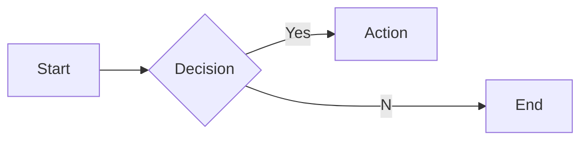
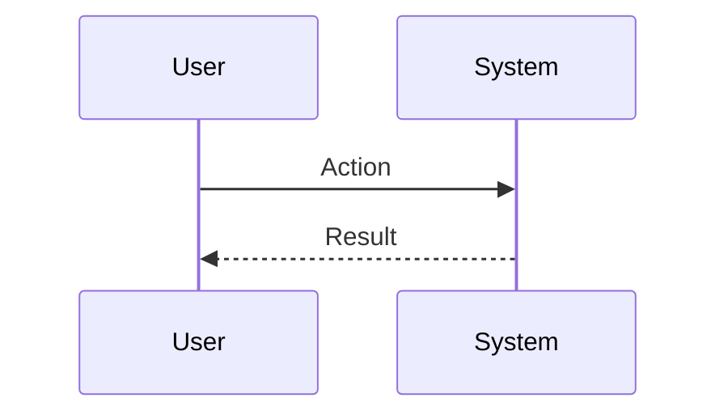

# Interview Questions: engineering_manager (ROLE)

This document contains 100 interview questions tailored for the engineering_manager role. The questions are designed to assess technical skills, soft skills, and cultural fit.

---

## 1. Tech Debt vs Features

**Scenario:** Product wants features, Eng wants refactor.

**Question:** How do you balance technical debt with new feature development?

**Key Concepts:** `Prioritization`, `Negotiation`

### Candidate Response Paths
*   **Junior**: We just do features.
*   **Senior**: Allocating a % capacity for debt or dedicated 'fix-it' sprints.

---

## 2. Team Morale

**Scenario:** Burnout.

**Question:** How do you detect and prevent burnout in your engineering team?

**Key Concepts:** `People Mgmt`, `Empathy`

### Candidate Response Paths
*   **Junior**: Tell them to take a day off.
*   **Senior**: Monitoring velocity drops, 1:1 sentiment, and enforcing work-life balance.

---

## 3. Performance Management

**Scenario:** Underperforming engineer.

**Question:** How do you handle a senior engineer who is technically brilliant but toxic?

**Key Concepts:** `Management`, `Culture`

### Candidate Response Paths
*   **Junior**: Keep them because they code well.
*   **Senior**: Coaching first, but if behavior doesn't change, manage them out to protect culture.

---

## 4. Recruiting

**Scenario:** Hiring freeze.

**Question:** How do you attract top talent when you can't offer the highest salaries?

**Key Concepts:** `Hiring`, `Culture`

### Candidate Response Paths
*   **Junior**: I can't.
*   **Senior**: Sell the mission, the challenge, and the team culture.

---

## 5. Engineering Culture

**Scenario:** Silos.

**Question:** How do you break down silos between different engineering teams?

**Key Concepts:** `Collaboration`, `Culture`

### Candidate Response Paths
*   **Junior**: Force them to meet.
*   **Senior**: Shared goals, rotation programs, and guilds/chapters.

---

## 6. Process Improvement

**Scenario:** Slow velocity.

**Question:** Your team's velocity has dropped. What do you do?

**Key Concepts:** `Agile`, `Metrics`

### Candidate Response Paths
*   **Junior**: Ask them to work harder.
*   **Senior**: Analyze the bottlenecks (retrospectives), check for blockers, and simplify process.

---

## 7. Stakeholder Management

**Scenario:** Missed deadline.

**Question:** How do you handle communicating a missed deadline to the business?

| Metric | Target | Status |
|---|---|---|
| KPI 1 | 100% | Green |
| KPI 2 | < 5% | Yellow |

**Key Concepts:** `Communication`, `Trust`

### Candidate Response Paths
*   **Junior**: Hide it until the end.
*   **Senior**: Early warning, explanation of root cause, and revised confident plan.

---

## 8. Mentorship

**Scenario:** Junior growth.

**Question:** How do you structure mentorship within your team?

**Key Concepts:** `Growth`, `People`

### Candidate Response Paths
*   **Junior**: Pair them up.
*   **Senior**: Formal goals, regular check-ins, and clear career ladders.

---

## 9. Onboarding

**Scenario:** New hire.

**Question:** What does a successful onboarding process look like?

**Key Concepts:** `Process`, `Experience`

### Candidate Response Paths
*   **Junior**: Give them a laptop.
*   **Senior**: First commit on day 1, 30-60-90 day plan, and a buddy system.

---

## 10. Remote Work

**Scenario:** Distributed team.

**Question:** How do you manage a fully distributed engineering team effectively?

**Key Concepts:** `Remote`, `Management`

### Candidate Response Paths
*   **Junior**: Zoom all day.
*   **Senior**: Async-first communication, written documentation, and building social connection.

---

## 11. Conflict Resolution

**Scenario:** Disagreement with a peer.

**Question:** Tell me about a time you had a significant disagreement with a colleague. How did you resolve it?

**Key Concepts:** `Communication`, `Soft Skills`

### Candidate Response Paths
*   **Junior**: I told them I was right.
*   **Senior**: I listened to their perspective, found common ground, and we compromised.

---

## 12. Failure Handling

**Scenario:** A project went wrong.

**Question:** Describe a time you failed. What happened and what did you learn?

**Key Concepts:** `Growth Mindset`, `Resilience`

### Candidate Response Paths
*   **Junior**: I tried hard but it failed.
*   **Senior**: I analyzed the root cause, implemented a fix, and shared the learning.

---

## 13. Prioritization

**Scenario:** Too many tasks.

**Question:** How do you prioritize when you have multiple conflicting deadlines?

**Key Concepts:** `Time Management`, `Organization`

### Candidate Response Paths
*   **Junior**: I work longer hours.
*   **Senior**: I communicate with stakeholders to adjust expectations and focus on high-impact tasks.

---

## 14. Adaptability

**Scenario:** Changing requirements.

**Question:** How do you handle sudden changes in project scope or direction?

| Metric | Target | Status |
|---|---|---|
| KPI 1 | 100% | Green |
| KPI 2 | < 5% | Yellow |

**Key Concepts:** `Agility`, `Flexibility`

### Candidate Response Paths
*   **Junior**: I get frustrated but do it.
*   **Senior**: I assess the impact, communicate risks, and pivot quickly.

---

## 15. Communication

**Scenario:** Explaining complex topics.

**Question:** Describe a time you had to explain a complex technical/business concept to a non-expert.

**Key Concepts:** `Clarity`, `Empathy`

### Candidate Response Paths
*   **Junior**: I just said it simpler.
*   **Senior**: I used analogies and checked for understanding throughout.

---

## 16. Teamwork

**Scenario:** Collaborating with difficult personalities.

**Question:** How do you handle working with someone who is difficult to work with?

**Key Concepts:** `Collaboration`, `EQ`

### Candidate Response Paths
*   **Junior**: I avoid them.
*   **Senior**: I try to understand their motivations and find a way to work together effectively.

---

## 17. Innovation

**Scenario:** Improving a process.

**Question:** Tell me about a time you improved a process or workflow.

**Key Concepts:** `Innovation`, `Efficiency`

### Candidate Response Paths
*   **Junior**: I followed the rules.
*   **Senior**: I identified a bottleneck, proposed a solution, and measured the improvement.

---

## 18. Feedback

**Scenario:** Receiving constructive criticism.

**Question:** Tell me about a time you received difficult feedback. How did you react?

**Key Concepts:** `Self-awareness`, `Growth`

### Candidate Response Paths
*   **Junior**: I got defensive.
*   **Senior**: I listened, asked for examples, and worked on a plan to improve.

---

## 19. Leadership

**Scenario:** Leading without authority.

**Question:** Describe a time you demonstrated leadership when you weren't the formal manager.

**Key Concepts:** `Leadership`, `Influence`

### Candidate Response Paths
*   **Junior**: I told people what to do.
*   **Senior**: I rallied the team around a goal and supported them to achieve it.

---

## 20. Decision Making

**Scenario:** Incomplete information.

**Question:** How do you make decisions when you don't have all the data?

**Key Concepts:** `Judgment`, `Risk Mgmt`

### Candidate Response Paths
*   **Junior**: I wait for all data.
*   **Senior**: I assess the risk, make a call based on available info, and adjust as needed.

---

## 21. Scaling Kanban

**Scenario:** Growth.

**Question:** How do you scale Kanban as the company grows?

| Metric | Target | Status |
|---|---|---|
| KPI 1 | 100% | Green |
| KPI 2 | < 5% | Yellow |

**Key Concepts:** `Kanban`, `Scale`

### Candidate Response Paths
*   **Junior**: Hire more people.
*   **Senior**: Process automation, documentation, and leverage.

---

## 22. Ethics in OKRs

**Scenario:** Ethics.

**Question:** What are the ethical considerations regarding OKRs?

**Key Concepts:** `OKRs`, `Ethics`

### Candidate Response Paths
*   **Junior**: Be nice.
*   **Senior**: Privacy, bias, and societal impact.

---

## 23. Future of Onboarding

**Scenario:** Trends.

**Question:** Where do you see Onboarding heading in the next 5 years?

**Key Concepts:** `Onboarding`, `Vision`

### Candidate Response Paths
*   **Junior**: It will get better.
*   **Senior**: Emerging trends, AI impact, and market shifts.

---

## 24. Collaboration in Kanban

**Scenario:** Teamwork.

**Question:** How does Kanban require cross-functional collaboration?

**Key Concepts:** `Kanban`, `Collaboration`

### Candidate Response Paths
*   **Junior**: I talk to people.
*   **Senior**: Alignment with other depts and shared goals.

---

## 25. Ethics in Budgeting

**Scenario:** Ethics.

**Question:** What are the ethical considerations regarding Budgeting?

**Key Concepts:** `Budgeting`, `Ethics`

### Candidate Response Paths
*   **Junior**: Be nice.
*   **Senior**: Privacy, bias, and societal impact.

---

## 26. Teaching Performance Reviews

**Scenario:** Mentorship.

**Question:** How would you teach Performance Reviews to a junior team member?

**Key Concepts:** `Performance Reviews`, `Mentorship`

### Candidate Response Paths
*   **Junior**: Send them a link.
*   **Senior**: Structured learning path and hands-on practice.

---

## 27. Collaboration in Mentorship

**Scenario:** Teamwork.

**Question:** How does Mentorship require cross-functional collaboration?

**Key Concepts:** `Mentorship`, `Collaboration`

### Candidate Response Paths
*   **Junior**: I talk to people.
*   **Senior**: Alignment with other depts and shared goals.

---

## 28. Start vs Scale for Velocity

**Scenario:** Context.

**Question:** How does your approach to Velocity differ in a startup vs a large corp?

| Metric | Target | Status |
|---|---|---|
| KPI 1 | 100% | Green |
| KPI 2 | < 5% | Yellow |

**Key Concepts:** `Velocity`, `Context`

### Candidate Response Paths
*   **Junior**: It's the same.
*   **Senior**: Speed/Chaos vs Process/Stability.

---

## 29. Challenges in Performance Reviews

**Scenario:** Problem Solving.

**Question:** What are the biggest challenges you've faced regarding Performance Reviews?

**Key Concepts:** `Performance Reviews`, `Problem Solving`

### Candidate Response Paths
*   **Junior**: It was hard.
*   **Senior**: Specific examples of obstacles and strategies to overcome them.

---

## 30. Ethics in Tech Debt

**Scenario:** Ethics.

**Question:** What are the ethical considerations regarding Tech Debt?

**Key Concepts:** `Tech Debt`, `Ethics`

### Candidate Response Paths
*   **Junior**: Be nice.
*   **Senior**: Privacy, bias, and societal impact.

---

## 31. Mistakes in Kanban

**Scenario:** Learning.

**Question:** What common mistakes do people make with Kanban?

**Key Concepts:** `Kanban`, `Experience`

### Candidate Response Paths
*   **Junior**: Doing it wrong.
*   **Senior**: Subtle pitfalls and how to avoid them.

---

## 32. Scaling OKRs

**Scenario:** Growth.

**Question:** How do you scale OKRs as the company grows?

**Key Concepts:** `OKRs`, `Scale`

### Candidate Response Paths
*   **Junior**: Hire more people.
*   **Senior**: Process automation, documentation, and leverage.

---

## 33. Vendor Mgmt Best Practices

**Scenario:** Standardization.

**Question:** What are the industry best practices for Vendor Mgmt?

**Key Concepts:** `Vendor Mgmt`, `Standards`

### Candidate Response Paths
*   **Junior**: List a few.
*   **Senior**: Discusses why they are best practices and when to break them.

---

## 34. Deep Dive: Budgeting

**Scenario:** Assessing depth in Budgeting.

**Question:** Can you explain Budgeting in detail and how you have applied it in your past role?

**Key Concepts:** `Budgeting`, `Experience`

### Candidate Response Paths
*   **Junior**: Basic definition.
*   **Senior**: Deep practical application and nuances.

---

## 35. Ethics in Vendor Mgmt

**Scenario:** Ethics.

**Question:** What are the ethical considerations regarding Vendor Mgmt?

| Metric | Target | Status |
|---|---|---|
| KPI 1 | 100% | Green |
| KPI 2 | < 5% | Yellow |

**Key Concepts:** `Vendor Mgmt`, `Ethics`

### Candidate Response Paths
*   **Junior**: Be nice.
*   **Senior**: Privacy, bias, and societal impact.

---

## 36. Challenges in Budgeting

**Scenario:** Problem Solving.

**Question:** What are the biggest challenges you've faced regarding Budgeting?

**Key Concepts:** `Budgeting`, `Problem Solving`

### Candidate Response Paths
*   **Junior**: It was hard.
*   **Senior**: Specific examples of obstacles and strategies to overcome them.

---

## 37. Deep Dive: Onboarding

**Scenario:** Assessing depth in Onboarding.

**Question:** Can you explain Onboarding in detail and how you have applied it in your past role?

**Key Concepts:** `Onboarding`, `Experience`

### Candidate Response Paths
*   **Junior**: Basic definition.
*   **Senior**: Deep practical application and nuances.

---

## 38. Deep Dive: Career Ladders

**Scenario:** Assessing depth in Career Ladders.

**Question:** Can you explain Career Ladders in detail and how you have applied it in your past role?

**Key Concepts:** `Career Ladders`, `Experience`

### Candidate Response Paths
*   **Junior**: Basic definition.
*   **Senior**: Deep practical application and nuances.

---

## 39. Start vs Scale for Incident Mgmt

**Scenario:** Context.

**Question:** How does your approach to Incident Mgmt differ in a startup vs a large corp?

**Key Concepts:** `Incident Mgmt`, `Context`

### Candidate Response Paths
*   **Junior**: It's the same.
*   **Senior**: Speed/Chaos vs Process/Stability.

---

## 40. Future of Scrum

**Scenario:** Trends.

**Question:** Where do you see Scrum heading in the next 5 years?

**Key Concepts:** `Scrum`, `Vision`

### Candidate Response Paths
*   **Junior**: It will get better.
*   **Senior**: Emerging trends, AI impact, and market shifts.

---

## 41. Future of Kanban

**Scenario:** Trends.

**Question:** Where do you see Kanban heading in the next 5 years?

**Key Concepts:** `Kanban`, `Vision`

### Candidate Response Paths
*   **Junior**: It will get better.
*   **Senior**: Emerging trends, AI impact, and market shifts.

---

## 42. Collaboration in Hiring

**Scenario:** Teamwork.

**Question:** How does Hiring require cross-functional collaboration?

| Metric | Target | Status |
|---|---|---|
| KPI 1 | 100% | Green |
| KPI 2 | < 5% | Yellow |

**Key Concepts:** `Hiring`, `Collaboration`

### Candidate Response Paths
*   **Junior**: I talk to people.
*   **Senior**: Alignment with other depts and shared goals.

---

## 43. Tooling: Career Ladders

**Scenario:** Proficiency.

**Question:** How do you utilize Career Ladders to improve efficiency?

**Key Concepts:** `Career Ladders`, `Productivity`

### Candidate Response Paths
*   **Junior**: I use it daily.
*   **Senior**: Advanced features and automation.

---

## 44. Metrics for Incident Mgmt

**Scenario:** Measurement.

**Question:** How do you measure success in Incident Mgmt?

**Key Concepts:** `Incident Mgmt`, `Analytics`

### Candidate Response Paths
*   **Junior**: I guess.
*   **Senior**: Specific KPIs and leading/lagging indicators.

---

## 45. Metrics for Hiring

**Scenario:** Measurement.

**Question:** How do you measure success in Hiring?

**Key Concepts:** `Hiring`, `Analytics`

### Candidate Response Paths
*   **Junior**: I guess.
*   **Senior**: Specific KPIs and leading/lagging indicators.

---

## 46. Deep Dive: Kanban

**Scenario:** Assessing depth in Kanban.

**Question:** Can you explain Kanban in detail and how you have applied it in your past role?

**Key Concepts:** `Kanban`, `Experience`

### Candidate Response Paths
*   **Junior**: Basic definition.
*   **Senior**: Deep practical application and nuances.

---

## 47. Teaching Incident Mgmt

**Scenario:** Mentorship.

**Question:** How would you teach Incident Mgmt to a junior team member?

**Key Concepts:** `Incident Mgmt`, `Mentorship`

### Candidate Response Paths
*   **Junior**: Send them a link.
*   **Senior**: Structured learning path and hands-on practice.

---

## 48. Challenges in Incident Mgmt

**Scenario:** Problem Solving.

**Question:** What are the biggest challenges you've faced regarding Incident Mgmt?

**Key Concepts:** `Incident Mgmt`, `Problem Solving`

### Candidate Response Paths
*   **Junior**: It was hard.
*   **Senior**: Specific examples of obstacles and strategies to overcome them.

---

## 49. Teaching Kanban

**Scenario:** Mentorship.

**Question:** How would you teach Kanban to a junior team member?

| Metric | Target | Status |
|---|---|---|
| KPI 1 | 100% | Green |
| KPI 2 | < 5% | Yellow |

**Key Concepts:** `Kanban`, `Mentorship`

### Candidate Response Paths
*   **Junior**: Send them a link.
*   **Senior**: Structured learning path and hands-on practice.

---

## 50. Ethics in Performance Reviews

**Scenario:** Ethics.

**Question:** What are the ethical considerations regarding Performance Reviews?

**Key Concepts:** `Performance Reviews`, `Ethics`

### Candidate Response Paths
*   **Junior**: Be nice.
*   **Senior**: Privacy, bias, and societal impact.

---

## 51. Metrics for Vendor Mgmt

**Scenario:** Measurement.

**Question:** How do you measure success in Vendor Mgmt?

**Key Concepts:** `Vendor Mgmt`, `Analytics`

### Candidate Response Paths
*   **Junior**: I guess.
*   **Senior**: Specific KPIs and leading/lagging indicators.

---

## 52. Challenges in Vendor Mgmt

**Scenario:** Problem Solving.

**Question:** What are the biggest challenges you've faced regarding Vendor Mgmt?

**Key Concepts:** `Vendor Mgmt`, `Problem Solving`

### Candidate Response Paths
*   **Junior**: It was hard.
*   **Senior**: Specific examples of obstacles and strategies to overcome them.

---

## 53. Teaching OKRs

**Scenario:** Mentorship.

**Question:** How would you teach OKRs to a junior team member?

**Key Concepts:** `OKRs`, `Mentorship`

### Candidate Response Paths
*   **Junior**: Send them a link.
*   **Senior**: Structured learning path and hands-on practice.

---

## 54. Start vs Scale for Career Ladders

**Scenario:** Context.

**Question:** How does your approach to Career Ladders differ in a startup vs a large corp?

**Key Concepts:** `Career Ladders`, `Context`

### Candidate Response Paths
*   **Junior**: It's the same.
*   **Senior**: Speed/Chaos vs Process/Stability.

---

## 55. Agile Best Practices

**Scenario:** Standardization.

**Question:** What are the industry best practices for Agile?

**Key Concepts:** `Agile`, `Standards`

### Candidate Response Paths
*   **Junior**: List a few.
*   **Senior**: Discusses why they are best practices and when to break them.

---

## 56. Challenges in Velocity

**Scenario:** Problem Solving.

**Question:** What are the biggest challenges you've faced regarding Velocity?

| Metric | Target | Status |
|---|---|---|
| KPI 1 | 100% | Green |
| KPI 2 | < 5% | Yellow |

**Key Concepts:** `Velocity`, `Problem Solving`

### Candidate Response Paths
*   **Junior**: It was hard.
*   **Senior**: Specific examples of obstacles and strategies to overcome them.

---

## 57. OKRs Best Practices

**Scenario:** Standardization.

**Question:** What are the industry best practices for OKRs?

**Key Concepts:** `OKRs`, `Standards`

### Candidate Response Paths
*   **Junior**: List a few.
*   **Senior**: Discusses why they are best practices and when to break them.

---

## 58. Deep Dive: Scrum

**Scenario:** Assessing depth in Scrum.

**Question:** Can you explain Scrum in detail and how you have applied it in your past role?

**Key Concepts:** `Scrum`, `Experience`

### Candidate Response Paths
*   **Junior**: Basic definition.
*   **Senior**: Deep practical application and nuances.

---

## 59. Metrics for Remote Work

**Scenario:** Measurement.

**Question:** How do you measure success in Remote Work?

**Key Concepts:** `Remote Work`, `Analytics`

### Candidate Response Paths
*   **Junior**: I guess.
*   **Senior**: Specific KPIs and leading/lagging indicators.

---

## 60. Deep Dive: Vendor Mgmt

**Scenario:** Assessing depth in Vendor Mgmt.

**Question:** Can you explain Vendor Mgmt in detail and how you have applied it in your past role?

**Key Concepts:** `Vendor Mgmt`, `Experience`

### Candidate Response Paths
*   **Junior**: Basic definition.
*   **Senior**: Deep practical application and nuances.

---

## 61. Start vs Scale for Budgeting

**Scenario:** Context.

**Question:** How does your approach to Budgeting differ in a startup vs a large corp?

**Key Concepts:** `Budgeting`, `Context`

### Candidate Response Paths
*   **Junior**: It's the same.
*   **Senior**: Speed/Chaos vs Process/Stability.

---

## 62. Teaching Velocity

**Scenario:** Mentorship.

**Question:** How would you teach Velocity to a junior team member?

**Key Concepts:** `Velocity`, `Mentorship`

### Candidate Response Paths
*   **Junior**: Send them a link.
*   **Senior**: Structured learning path and hands-on practice.

---

## 63. Start vs Scale for Kanban

**Scenario:** Context.

**Question:** How does your approach to Kanban differ in a startup vs a large corp?

| Metric | Target | Status |
|---|---|---|
| KPI 1 | 100% | Green |
| KPI 2 | < 5% | Yellow |

**Key Concepts:** `Kanban`, `Context`

### Candidate Response Paths
*   **Junior**: It's the same.
*   **Senior**: Speed/Chaos vs Process/Stability.

---

## 64. Challenges in Kanban

**Scenario:** Problem Solving.

**Question:** What are the biggest challenges you've faced regarding Kanban?

**Key Concepts:** `Kanban`, `Problem Solving`

### Candidate Response Paths
*   **Junior**: It was hard.
*   **Senior**: Specific examples of obstacles and strategies to overcome them.

---

## 65. Start vs Scale for Remote Work

**Scenario:** Context.

**Question:** How does your approach to Remote Work differ in a startup vs a large corp?

**Key Concepts:** `Remote Work`, `Context`

### Candidate Response Paths
*   **Junior**: It's the same.
*   **Senior**: Speed/Chaos vs Process/Stability.

---

## 66. Mistakes in Scrum

**Scenario:** Learning.

**Question:** What common mistakes do people make with Scrum?

**Key Concepts:** `Scrum`, `Experience`

### Candidate Response Paths
*   **Junior**: Doing it wrong.
*   **Senior**: Subtle pitfalls and how to avoid them.

---

## 67. Collaboration in Remote Work

**Scenario:** Teamwork.

**Question:** How does Remote Work require cross-functional collaboration?

**Key Concepts:** `Remote Work`, `Collaboration`

### Candidate Response Paths
*   **Junior**: I talk to people.
*   **Senior**: Alignment with other depts and shared goals.

---

## 68. Metrics for Mentorship

**Scenario:** Measurement.

**Question:** How do you measure success in Mentorship?

**Key Concepts:** `Mentorship`, `Analytics`

### Candidate Response Paths
*   **Junior**: I guess.
*   **Senior**: Specific KPIs and leading/lagging indicators.

---

## 69. Deep Dive: Mentorship

**Scenario:** Assessing depth in Mentorship.

**Question:** Can you explain Mentorship in detail and how you have applied it in your past role?

**Key Concepts:** `Mentorship`, `Experience`

### Candidate Response Paths
*   **Junior**: Basic definition.
*   **Senior**: Deep practical application and nuances.

---

## 70. Tooling: Incident Mgmt

**Scenario:** Proficiency.

**Question:** How do you utilize Incident Mgmt to improve efficiency?

| Metric | Target | Status |
|---|---|---|
| KPI 1 | 100% | Green |
| KPI 2 | < 5% | Yellow |

**Key Concepts:** `Incident Mgmt`, `Productivity`

### Candidate Response Paths
*   **Junior**: I use it daily.
*   **Senior**: Advanced features and automation.

---

## 71. Deep Dive: Remote Work

**Scenario:** Assessing depth in Remote Work.

**Question:** Can you explain Remote Work in detail and how you have applied it in your past role?

**Key Concepts:** `Remote Work`, `Experience`

### Candidate Response Paths
*   **Junior**: Basic definition.
*   **Senior**: Deep practical application and nuances.

---

## 72. Future of OKRs

**Scenario:** Trends.

**Question:** Where do you see OKRs heading in the next 5 years?

**Key Concepts:** `OKRs`, `Vision`

### Candidate Response Paths
*   **Junior**: It will get better.
*   **Senior**: Emerging trends, AI impact, and market shifts.

---

## 73. Scaling Mentorship

**Scenario:** Growth.

**Question:** How do you scale Mentorship as the company grows?

**Key Concepts:** `Mentorship`, `Scale`

### Candidate Response Paths
*   **Junior**: Hire more people.
*   **Senior**: Process automation, documentation, and leverage.

---

## 74. Deep Dive: Hiring

**Scenario:** Assessing depth in Hiring.

**Question:** Can you explain Hiring in detail and how you have applied it in your past role?

**Key Concepts:** `Hiring`, `Experience`

### Candidate Response Paths
*   **Junior**: Basic definition.
*   **Senior**: Deep practical application and nuances.

---

## 75. Challenges in Scrum

**Scenario:** Problem Solving.

**Question:** What are the biggest challenges you've faced regarding Scrum?

**Key Concepts:** `Scrum`, `Problem Solving`

### Candidate Response Paths
*   **Junior**: It was hard.
*   **Senior**: Specific examples of obstacles and strategies to overcome them.

---

## 76. Challenges in Tech Debt

**Scenario:** Problem Solving.

**Question:** What are the biggest challenges you've faced regarding Tech Debt?

**Key Concepts:** `Tech Debt`, `Problem Solving`

### Candidate Response Paths
*   **Junior**: It was hard.
*   **Senior**: Specific examples of obstacles and strategies to overcome them.

---

## 77. Collaboration in Velocity

**Scenario:** Teamwork.

**Question:** How does Velocity require cross-functional collaboration?

| Metric | Target | Status |
|---|---|---|
| KPI 1 | 100% | Green |
| KPI 2 | < 5% | Yellow |

**Key Concepts:** `Velocity`, `Collaboration`

### Candidate Response Paths
*   **Junior**: I talk to people.
*   **Senior**: Alignment with other depts and shared goals.

---

## 78. Ethics in Remote Work

**Scenario:** Ethics.

**Question:** What are the ethical considerations regarding Remote Work?

**Key Concepts:** `Remote Work`, `Ethics`

### Candidate Response Paths
*   **Junior**: Be nice.
*   **Senior**: Privacy, bias, and societal impact.

---

## 79. Future of Performance Reviews

**Scenario:** Trends.

**Question:** Where do you see Performance Reviews heading in the next 5 years?

**Key Concepts:** `Performance Reviews`, `Vision`

### Candidate Response Paths
*   **Junior**: It will get better.
*   **Senior**: Emerging trends, AI impact, and market shifts.

---

## 80. Challenges in Hiring

**Scenario:** Problem Solving.

**Question:** What are the biggest challenges you've faced regarding Hiring?

**Key Concepts:** `Hiring`, `Problem Solving`

### Candidate Response Paths
*   **Junior**: It was hard.
*   **Senior**: Specific examples of obstacles and strategies to overcome them.

---

## 81. Mistakes in Hiring

**Scenario:** Learning.

**Question:** What common mistakes do people make with Hiring?

**Key Concepts:** `Hiring`, `Experience`

### Candidate Response Paths
*   **Junior**: Doing it wrong.
*   **Senior**: Subtle pitfalls and how to avoid them.

---

## 82. Teaching Budgeting

**Scenario:** Mentorship.

**Question:** How would you teach Budgeting to a junior team member?

**Key Concepts:** `Budgeting`, `Mentorship`

### Candidate Response Paths
*   **Junior**: Send them a link.
*   **Senior**: Structured learning path and hands-on practice.

---

## 83. Deep Dive: Velocity

**Scenario:** Assessing depth in Velocity.

**Question:** Can you explain Velocity in detail and how you have applied it in your past role?

**Key Concepts:** `Velocity`, `Experience`

### Candidate Response Paths
*   **Junior**: Basic definition.
*   **Senior**: Deep practical application and nuances.

---

## 84. Ethics in Velocity

**Scenario:** Ethics.

**Question:** What are the ethical considerations regarding Velocity?

| Metric | Target | Status |
|---|---|---|
| KPI 1 | 100% | Green |
| KPI 2 | < 5% | Yellow |

**Key Concepts:** `Velocity`, `Ethics`

### Candidate Response Paths
*   **Junior**: Be nice.
*   **Senior**: Privacy, bias, and societal impact.

---

## 85. Scaling Hiring

**Scenario:** Growth.

**Question:** How do you scale Hiring as the company grows?

**Key Concepts:** `Hiring`, `Scale`

### Candidate Response Paths
*   **Junior**: Hire more people.
*   **Senior**: Process automation, documentation, and leverage.

---

## 86. Tooling: Hiring

**Scenario:** Proficiency.

**Question:** How do you utilize Hiring to improve efficiency?

**Key Concepts:** `Hiring`, `Productivity`

### Candidate Response Paths
*   **Junior**: I use it daily.
*   **Senior**: Advanced features and automation.

---

## 87. Ethics in Hiring

**Scenario:** Ethics.

**Question:** What are the ethical considerations regarding Hiring?

**Key Concepts:** `Hiring`, `Ethics`

### Candidate Response Paths
*   **Junior**: Be nice.
*   **Senior**: Privacy, bias, and societal impact.

---

## 88. Scaling Incident Mgmt

**Scenario:** Growth.

**Question:** How do you scale Incident Mgmt as the company grows?

**Key Concepts:** `Incident Mgmt`, `Scale`

### Candidate Response Paths
*   **Junior**: Hire more people.
*   **Senior**: Process automation, documentation, and leverage.

---

## 89. Mistakes in Tech Debt

**Scenario:** Learning.

**Question:** What common mistakes do people make with Tech Debt?

**Key Concepts:** `Tech Debt`, `Experience`

### Candidate Response Paths
*   **Junior**: Doing it wrong.
*   **Senior**: Subtle pitfalls and how to avoid them.

---

## 90. Tooling: Scrum

**Scenario:** Proficiency.

**Question:** How do you utilize Scrum to improve efficiency?

**Key Concepts:** `Scrum`, `Productivity`

### Candidate Response Paths
*   **Junior**: I use it daily.
*   **Senior**: Advanced features and automation.

---

## 91. Deep Dive: Tech Debt

**Scenario:** Assessing depth in Tech Debt.

**Question:** Can you explain Tech Debt in detail and how you have applied it in your past role?

| Metric | Target | Status |
|---|---|---|
| KPI 1 | 100% | Green |
| KPI 2 | < 5% | Yellow |

**Key Concepts:** `Tech Debt`, `Experience`

### Candidate Response Paths
*   **Junior**: Basic definition.
*   **Senior**: Deep practical application and nuances.

---

## 92. Metrics for Onboarding

**Scenario:** Measurement.

**Question:** How do you measure success in Onboarding?

**Key Concepts:** `Onboarding`, `Analytics`

### Candidate Response Paths
*   **Junior**: I guess.
*   **Senior**: Specific KPIs and leading/lagging indicators.

---

## 93. Future of Tech Debt

**Scenario:** Trends.

**Question:** Where do you see Tech Debt heading in the next 5 years?

**Key Concepts:** `Tech Debt`, `Vision`

### Candidate Response Paths
*   **Junior**: It will get better.
*   **Senior**: Emerging trends, AI impact, and market shifts.

---

## 94. Tooling: Velocity

**Scenario:** Proficiency.

**Question:** How do you utilize Velocity to improve efficiency?

**Key Concepts:** `Velocity`, `Productivity`

### Candidate Response Paths
*   **Junior**: I use it daily.
*   **Senior**: Advanced features and automation.

---

## 95. Future of Mentorship

**Scenario:** Trends.

**Question:** Where do you see Mentorship heading in the next 5 years?

**Key Concepts:** `Mentorship`, `Vision`

### Candidate Response Paths
*   **Junior**: It will get better.
*   **Senior**: Emerging trends, AI impact, and market shifts.

---

## 96. Ethics in Incident Mgmt

**Scenario:** Ethics.

**Question:** What are the ethical considerations regarding Incident Mgmt?

**Key Concepts:** `Incident Mgmt`, `Ethics`

### Candidate Response Paths
*   **Junior**: Be nice.
*   **Senior**: Privacy, bias, and societal impact.

---

## 97. Mistakes in Velocity

**Scenario:** Learning.

**Question:** What common mistakes do people make with Velocity?

**Key Concepts:** `Velocity`, `Experience`

### Candidate Response Paths
*   **Junior**: Doing it wrong.
*   **Senior**: Subtle pitfalls and how to avoid them.

---

## 98. Collaboration in Performance Reviews

**Scenario:** Teamwork.

**Question:** How does Performance Reviews require cross-functional collaboration?

| Metric | Target | Status |
|---|---|---|
| KPI 1 | 100% | Green |
| KPI 2 | < 5% | Yellow |

**Key Concepts:** `Performance Reviews`, `Collaboration`

### Candidate Response Paths
*   **Junior**: I talk to people.
*   **Senior**: Alignment with other depts and shared goals.

---

## 99. Mistakes in Career Ladders

**Scenario:** Learning.

**Question:** What common mistakes do people make with Career Ladders?

**Key Concepts:** `Career Ladders`, `Experience`

### Candidate Response Paths
*   **Junior**: Doing it wrong.
*   **Senior**: Subtle pitfalls and how to avoid them.

---

## 100. Tech Debt Best Practices

**Scenario:** Standardization.

**Question:** What are the industry best practices for Tech Debt?

**Key Concepts:** `Tech Debt`, `Standards`

### Candidate Response Paths
*   **Junior**: List a few.
*   **Senior**: Discusses why they are best practices and when to break them.

---
