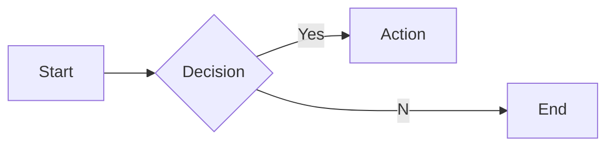
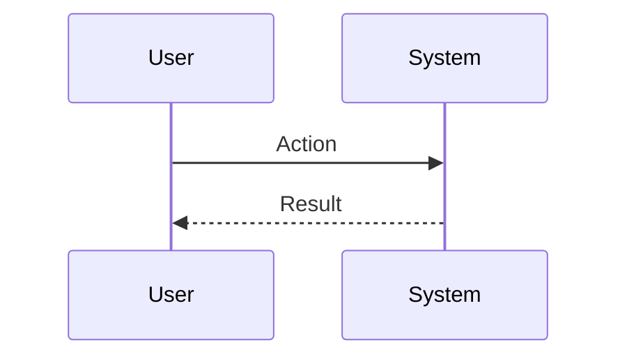

# Interview Questions: ceo (ROLE)

This document contains 100 interview questions tailored for the ceo role. The questions are designed to assess technical skills, soft skills, and cultural fit.

---

## 1. Strategic Vision

**Scenario:** Long-term planning.

**Question:** How do you define and communicate a 3-5 year vision for the company/department?

**Key Concepts:** `Strategy`, `Leadership`

### Candidate Response Paths
*   **Junior**: I focus on next year.
*   **Senior**: I analyze market trends, align with core values, and use storytelling to inspire the org.

---

## 2. Culture Building

**Scenario:** Toxic culture vs High performance.

**Question:** How do you build and maintain a high-performance culture?

**Key Concepts:** `Culture`, `Management`

### Candidate Response Paths
*   **Junior**: Pizza parties.
*   **Senior**: Defining clear values, rewarding behavior that aligns, and swift action on toxicity.

---

## 3. Crisis Management

**Scenario:** PR disaster or major outage.

**Question:** Walk me through your thought process during a major company crisis.

**Key Concepts:** `Crisis Mgmt`, `Leadership`

### Candidate Response Paths
*   **Junior**: Panic and blame.
*   **Senior**: Stabilize, Communicate, Remediation, and Post-Mortem.

---

## 4. Board Relations

**Scenario:** Bad news delivery.

**Question:** How do you manage board expectations when targets are missed?

**Key Concepts:** `Communication`, `Stakeholder Mgmt`

### Candidate Response Paths
*   **Junior**: Hide the bad news.
*   **Senior**: Transparency, presenting a recovery plan, and owning the outcome.

---

## 5. Hiring Executives

**Scenario:** Building your leadership team.

**Question:** What do you look for when hiring a VP/Director reporting to you?

**Key Concepts:** `Hiring`, `Leadership`

### Candidate Response Paths
*   **Junior**: Skills on paper.
*   **Senior**: Cultural add, strategic thinking, and ability to scale.

---

## 6. Resource Allocation

**Scenario:** Budget cuts.

**Question:** How do you decide where to cut budget when necessary?

**Key Concepts:** `Finance`, `Strategy`

### Candidate Response Paths
*   **Junior**: Cut everything equally.
*   **Senior**: Protect core revenue drivers and cut non-essential initiatives.

---

## 7. Mergers & Acquisitions

**Scenario:** Buying a company.

**Question:** What are your key criteria for evaluating an acquisition target?

| Metric | Target | Status |
|---|---|---|
| KPI 1 | 100% | Green |
| KPI 2 | < 5% | Yellow |

**Key Concepts:** `M&A`, `Strategy`

### Candidate Response Paths
*   **Junior**: Price.
*   **Senior**: Cultural fit, tech synergy, and accretive value.

---

## 8. Stakeholder Management

**Scenario:** Conflicting interests.

**Question:** How do you balance the needs of customers, employees, and investors?

**Key Concepts:** `Balance`, `Leadership`

### Candidate Response Paths
*   **Junior**: Focus on investors.
*   **Senior**: Finding the sweet spot where all three benefit long-term.

---

## 9. Organizational Design

**Scenario:** Restructuring.

**Question:** When do you know it's time to restructure the organization?

**Key Concepts:** `Org Design`, `Scale`

### Candidate Response Paths
*   **Junior**: When people complain.
*   **Senior**: When the current structure impedes execution or strategy.

---

## 10. Change Management

**Scenario:** Pivot.

**Question:** How do you lead the organization through a major strategic pivot?

**Key Concepts:** `Change Mgmt`, `Communication`

### Candidate Response Paths
*   **Junior**: Send an email.
*   **Senior**: Clear 'why', constant communication, and quick wins.

---

## 11. Conflict Resolution

**Scenario:** Disagreement with a peer.

**Question:** Tell me about a time you had a significant disagreement with a colleague. How did you resolve it?

**Key Concepts:** `Communication`, `Soft Skills`

### Candidate Response Paths
*   **Junior**: I told them I was right.
*   **Senior**: I listened to their perspective, found common ground, and we compromised.

---

## 12. Failure Handling

**Scenario:** A project went wrong.

**Question:** Describe a time you failed. What happened and what did you learn?

**Key Concepts:** `Growth Mindset`, `Resilience`

### Candidate Response Paths
*   **Junior**: I tried hard but it failed.
*   **Senior**: I analyzed the root cause, implemented a fix, and shared the learning.

---

## 13. Prioritization

**Scenario:** Too many tasks.

**Question:** How do you prioritize when you have multiple conflicting deadlines?

**Key Concepts:** `Time Management`, `Organization`

### Candidate Response Paths
*   **Junior**: I work longer hours.
*   **Senior**: I communicate with stakeholders to adjust expectations and focus on high-impact tasks.

---

## 14. Adaptability

**Scenario:** Changing requirements.

**Question:** How do you handle sudden changes in project scope or direction?

| Metric | Target | Status |
|---|---|---|
| KPI 1 | 100% | Green |
| KPI 2 | < 5% | Yellow |

**Key Concepts:** `Agility`, `Flexibility`

### Candidate Response Paths
*   **Junior**: I get frustrated but do it.
*   **Senior**: I assess the impact, communicate risks, and pivot quickly.

---

## 15. Communication

**Scenario:** Explaining complex topics.

**Question:** Describe a time you had to explain a complex technical/business concept to a non-expert.

**Key Concepts:** `Clarity`, `Empathy`

### Candidate Response Paths
*   **Junior**: I just said it simpler.
*   **Senior**: I used analogies and checked for understanding throughout.

---

## 16. Teamwork

**Scenario:** Collaborating with difficult personalities.

**Question:** How do you handle working with someone who is difficult to work with?

**Key Concepts:** `Collaboration`, `EQ`

### Candidate Response Paths
*   **Junior**: I avoid them.
*   **Senior**: I try to understand their motivations and find a way to work together effectively.

---

## 17. Innovation

**Scenario:** Improving a process.

**Question:** Tell me about a time you improved a process or workflow.

**Key Concepts:** `Innovation`, `Efficiency`

### Candidate Response Paths
*   **Junior**: I followed the rules.
*   **Senior**: I identified a bottleneck, proposed a solution, and measured the improvement.

---

## 18. Feedback

**Scenario:** Receiving constructive criticism.

**Question:** Tell me about a time you received difficult feedback. How did you react?

**Key Concepts:** `Self-awareness`, `Growth`

### Candidate Response Paths
*   **Junior**: I got defensive.
*   **Senior**: I listened, asked for examples, and worked on a plan to improve.

---

## 19. Leadership

**Scenario:** Leading without authority.

**Question:** Describe a time you demonstrated leadership when you weren't the formal manager.

**Key Concepts:** `Leadership`, `Influence`

### Candidate Response Paths
*   **Junior**: I told people what to do.
*   **Senior**: I rallied the team around a goal and supported them to achieve it.

---

## 20. Decision Making

**Scenario:** Incomplete information.

**Question:** How do you make decisions when you don't have all the data?

**Key Concepts:** `Judgment`, `Risk Mgmt`

### Candidate Response Paths
*   **Junior**: I wait for all data.
*   **Senior**: I assess the risk, make a call based on available info, and adjust as needed.

---

## 21. Challenges in Crisis Comms

**Scenario:** Problem Solving.

**Question:** What are the biggest challenges you've faced regarding Crisis Comms?

| Metric | Target | Status |
|---|---|---|
| KPI 1 | 100% | Green |
| KPI 2 | < 5% | Yellow |

**Key Concepts:** `Crisis Comms`, `Problem Solving`

### Candidate Response Paths
*   **Junior**: It was hard.
*   **Senior**: Specific examples of obstacles and strategies to overcome them.

---

## 22. Metrics for Public Speaking

**Scenario:** Measurement.

**Question:** How do you measure success in Public Speaking?

**Key Concepts:** `Public Speaking`, `Analytics`

### Candidate Response Paths
*   **Junior**: I guess.
*   **Senior**: Specific KPIs and leading/lagging indicators.

---

## 23. Future of Risk Management

**Scenario:** Trends.

**Question:** Where do you see Risk Management heading in the next 5 years?

**Key Concepts:** `Risk Management`, `Vision`

### Candidate Response Paths
*   **Junior**: It will get better.
*   **Senior**: Emerging trends, AI impact, and market shifts.

---

## 24. Future of Public Speaking

**Scenario:** Trends.

**Question:** Where do you see Public Speaking heading in the next 5 years?

**Key Concepts:** `Public Speaking`, `Vision`

### Candidate Response Paths
*   **Junior**: It will get better.
*   **Senior**: Emerging trends, AI impact, and market shifts.

---

## 25. Org Design Best Practices

**Scenario:** Standardization.

**Question:** What are the industry best practices for Org Design?

**Key Concepts:** `Org Design`, `Standards`

### Candidate Response Paths
*   **Junior**: List a few.
*   **Senior**: Discusses why they are best practices and when to break them.

---

## 26. Metrics for IPO

**Scenario:** Measurement.

**Question:** How do you measure success in IPO?

**Key Concepts:** `IPO`, `Analytics`

### Candidate Response Paths
*   **Junior**: I guess.
*   **Senior**: Specific KPIs and leading/lagging indicators.

---

## 27. Deep Dive: Crisis Comms

**Scenario:** Assessing depth in Crisis Comms.

**Question:** Can you explain Crisis Comms in detail and how you have applied it in your past role?

**Key Concepts:** `Crisis Comms`, `Experience`

### Candidate Response Paths
*   **Junior**: Basic definition.
*   **Senior**: Deep practical application and nuances.

---

## 28. Change Management Best Practices

**Scenario:** Standardization.

**Question:** What are the industry best practices for Change Management?

| Metric | Target | Status |
|---|---|---|
| KPI 1 | 100% | Green |
| KPI 2 | < 5% | Yellow |

**Key Concepts:** `Change Management`, `Standards`

### Candidate Response Paths
*   **Junior**: List a few.
*   **Senior**: Discusses why they are best practices and when to break them.

---

## 29. Teaching Digital Transformation

**Scenario:** Mentorship.

**Question:** How would you teach Digital Transformation to a junior team member?

**Key Concepts:** `Digital Transformation`, `Mentorship`

### Candidate Response Paths
*   **Junior**: Send them a link.
*   **Senior**: Structured learning path and hands-on practice.

---

## 30. Tooling: Compensation Strategy

**Scenario:** Proficiency.

**Question:** How do you utilize Compensation Strategy to improve efficiency?

**Key Concepts:** `Compensation Strategy`, `Productivity`

### Candidate Response Paths
*   **Junior**: I use it daily.
*   **Senior**: Advanced features and automation.

---

## 31. Start vs Scale for Public Speaking

**Scenario:** Context.

**Question:** How does your approach to Public Speaking differ in a startup vs a large corp?

**Key Concepts:** `Public Speaking`, `Context`

### Candidate Response Paths
*   **Junior**: It's the same.
*   **Senior**: Speed/Chaos vs Process/Stability.

---

## 32. Teaching IPO

**Scenario:** Mentorship.

**Question:** How would you teach IPO to a junior team member?

**Key Concepts:** `IPO`, `Mentorship`

### Candidate Response Paths
*   **Junior**: Send them a link.
*   **Senior**: Structured learning path and hands-on practice.

---

## 33. Ethics in ESG

**Scenario:** Ethics.

**Question:** What are the ethical considerations regarding ESG?

**Key Concepts:** `ESG`, `Ethics`

### Candidate Response Paths
*   **Junior**: Be nice.
*   **Senior**: Privacy, bias, and societal impact.

---

## 34. Tooling: Org Design

**Scenario:** Proficiency.

**Question:** How do you utilize Org Design to improve efficiency?

**Key Concepts:** `Org Design`, `Productivity`

### Candidate Response Paths
*   **Junior**: I use it daily.
*   **Senior**: Advanced features and automation.

---

## 35. Tooling: Investor Relations

**Scenario:** Proficiency.

**Question:** How do you utilize Investor Relations to improve efficiency?

| Metric | Target | Status |
|---|---|---|
| KPI 1 | 100% | Green |
| KPI 2 | < 5% | Yellow |

**Key Concepts:** `Investor Relations`, `Productivity`

### Candidate Response Paths
*   **Junior**: I use it daily.
*   **Senior**: Advanced features and automation.

---

## 36. Tooling: Digital Transformation

**Scenario:** Proficiency.

**Question:** How do you utilize Digital Transformation to improve efficiency?

**Key Concepts:** `Digital Transformation`, `Productivity`

### Candidate Response Paths
*   **Junior**: I use it daily.
*   **Senior**: Advanced features and automation.

---

## 37. Tooling: Global Expansion

**Scenario:** Proficiency.

**Question:** How do you utilize Global Expansion to improve efficiency?

**Key Concepts:** `Global Expansion`, `Productivity`

### Candidate Response Paths
*   **Junior**: I use it daily.
*   **Senior**: Advanced features and automation.

---

## 38. Tooling: Crisis Comms

**Scenario:** Proficiency.

**Question:** How do you utilize Crisis Comms to improve efficiency?

**Key Concepts:** `Crisis Comms`, `Productivity`

### Candidate Response Paths
*   **Junior**: I use it daily.
*   **Senior**: Advanced features and automation.

---

## 39. Compensation Strategy Best Practices

**Scenario:** Standardization.

**Question:** What are the industry best practices for Compensation Strategy?

**Key Concepts:** `Compensation Strategy`, `Standards`

### Candidate Response Paths
*   **Junior**: List a few.
*   **Senior**: Discusses why they are best practices and when to break them.

---

## 40. Mistakes in Change Management

**Scenario:** Learning.

**Question:** What common mistakes do people make with Change Management?

**Key Concepts:** `Change Management`, `Experience`

### Candidate Response Paths
*   **Junior**: Doing it wrong.
*   **Senior**: Subtle pitfalls and how to avoid them.

---

## 41. Future of Capital Allocation

**Scenario:** Trends.

**Question:** Where do you see Capital Allocation heading in the next 5 years?

**Key Concepts:** `Capital Allocation`, `Vision`

### Candidate Response Paths
*   **Junior**: It will get better.
*   **Senior**: Emerging trends, AI impact, and market shifts.

---

## 42. Mistakes in Compensation Strategy

**Scenario:** Learning.

**Question:** What common mistakes do people make with Compensation Strategy?

| Metric | Target | Status |
|---|---|---|
| KPI 1 | 100% | Green |
| KPI 2 | < 5% | Yellow |

**Key Concepts:** `Compensation Strategy`, `Experience`

### Candidate Response Paths
*   **Junior**: Doing it wrong.
*   **Senior**: Subtle pitfalls and how to avoid them.

---

## 43. Scaling Board Mgmt

**Scenario:** Growth.

**Question:** How do you scale Board Mgmt as the company grows?

**Key Concepts:** `Board Mgmt`, `Scale`

### Candidate Response Paths
*   **Junior**: Hire more people.
*   **Senior**: Process automation, documentation, and leverage.

---

## 44. Metrics for Risk Management

**Scenario:** Measurement.

**Question:** How do you measure success in Risk Management?

**Key Concepts:** `Risk Management`, `Analytics`

### Candidate Response Paths
*   **Junior**: I guess.
*   **Senior**: Specific KPIs and leading/lagging indicators.

---

## 45. Scaling ESG

**Scenario:** Growth.

**Question:** How do you scale ESG as the company grows?

**Key Concepts:** `ESG`, `Scale`

### Candidate Response Paths
*   **Junior**: Hire more people.
*   **Senior**: Process automation, documentation, and leverage.

---

## 46. Ethics in Global Expansion

**Scenario:** Ethics.

**Question:** What are the ethical considerations regarding Global Expansion?

**Key Concepts:** `Global Expansion`, `Ethics`

### Candidate Response Paths
*   **Junior**: Be nice.
*   **Senior**: Privacy, bias, and societal impact.

---

## 47. Deep Dive: Risk Management

**Scenario:** Assessing depth in Risk Management.

**Question:** Can you explain Risk Management in detail and how you have applied it in your past role?

**Key Concepts:** `Risk Management`, `Experience`

### Candidate Response Paths
*   **Junior**: Basic definition.
*   **Senior**: Deep practical application and nuances.

---

## 48. Teaching Global Expansion

**Scenario:** Mentorship.

**Question:** How would you teach Global Expansion to a junior team member?

**Key Concepts:** `Global Expansion`, `Mentorship`

### Candidate Response Paths
*   **Junior**: Send them a link.
*   **Senior**: Structured learning path and hands-on practice.

---

## 49. Collaboration in Digital Transformation

**Scenario:** Teamwork.

**Question:** How does Digital Transformation require cross-functional collaboration?

| Metric | Target | Status |
|---|---|---|
| KPI 1 | 100% | Green |
| KPI 2 | < 5% | Yellow |

**Key Concepts:** `Digital Transformation`, `Collaboration`

### Candidate Response Paths
*   **Junior**: I talk to people.
*   **Senior**: Alignment with other depts and shared goals.

---

## 50. Public Speaking Best Practices

**Scenario:** Standardization.

**Question:** What are the industry best practices for Public Speaking?

**Key Concepts:** `Public Speaking`, `Standards`

### Candidate Response Paths
*   **Junior**: List a few.
*   **Senior**: Discusses why they are best practices and when to break them.

---

## 51. Tooling: Capital Allocation

**Scenario:** Proficiency.

**Question:** How do you utilize Capital Allocation to improve efficiency?

**Key Concepts:** `Capital Allocation`, `Productivity`

### Candidate Response Paths
*   **Junior**: I use it daily.
*   **Senior**: Advanced features and automation.

---

## 52. Collaboration in Capital Allocation

**Scenario:** Teamwork.

**Question:** How does Capital Allocation require cross-functional collaboration?

**Key Concepts:** `Capital Allocation`, `Collaboration`

### Candidate Response Paths
*   **Junior**: I talk to people.
*   **Senior**: Alignment with other depts and shared goals.

---

## 53. Scaling Public Speaking

**Scenario:** Growth.

**Question:** How do you scale Public Speaking as the company grows?

**Key Concepts:** `Public Speaking`, `Scale`

### Candidate Response Paths
*   **Junior**: Hire more people.
*   **Senior**: Process automation, documentation, and leverage.

---

## 54. Collaboration in Org Design

**Scenario:** Teamwork.

**Question:** How does Org Design require cross-functional collaboration?

**Key Concepts:** `Org Design`, `Collaboration`

### Candidate Response Paths
*   **Junior**: I talk to people.
*   **Senior**: Alignment with other depts and shared goals.

---

## 55. Collaboration in Change Management

**Scenario:** Teamwork.

**Question:** How does Change Management require cross-functional collaboration?

**Key Concepts:** `Change Management`, `Collaboration`

### Candidate Response Paths
*   **Junior**: I talk to people.
*   **Senior**: Alignment with other depts and shared goals.

---

## 56. Metrics for Org Design

**Scenario:** Measurement.

**Question:** How do you measure success in Org Design?

| Metric | Target | Status |
|---|---|---|
| KPI 1 | 100% | Green |
| KPI 2 | < 5% | Yellow |

**Key Concepts:** `Org Design`, `Analytics`

### Candidate Response Paths
*   **Junior**: I guess.
*   **Senior**: Specific KPIs and leading/lagging indicators.

---

## 57. Deep Dive: Public Speaking

**Scenario:** Assessing depth in Public Speaking.

**Question:** Can you explain Public Speaking in detail and how you have applied it in your past role?

**Key Concepts:** `Public Speaking`, `Experience`

### Candidate Response Paths
*   **Junior**: Basic definition.
*   **Senior**: Deep practical application and nuances.

---

## 58. Scaling M&A

**Scenario:** Growth.

**Question:** How do you scale M&A as the company grows?

**Key Concepts:** `M&A`, `Scale`

### Candidate Response Paths
*   **Junior**: Hire more people.
*   **Senior**: Process automation, documentation, and leverage.

---

## 59. Capital Allocation Best Practices

**Scenario:** Standardization.

**Question:** What are the industry best practices for Capital Allocation?

**Key Concepts:** `Capital Allocation`, `Standards`

### Candidate Response Paths
*   **Junior**: List a few.
*   **Senior**: Discusses why they are best practices and when to break them.

---

## 60. Scaling IPO

**Scenario:** Growth.

**Question:** How do you scale IPO as the company grows?

**Key Concepts:** `IPO`, `Scale`

### Candidate Response Paths
*   **Junior**: Hire more people.
*   **Senior**: Process automation, documentation, and leverage.

---

## 61. Mistakes in Global Expansion

**Scenario:** Learning.

**Question:** What common mistakes do people make with Global Expansion?

**Key Concepts:** `Global Expansion`, `Experience`

### Candidate Response Paths
*   **Junior**: Doing it wrong.
*   **Senior**: Subtle pitfalls and how to avoid them.

---

## 62. Collaboration in ESG

**Scenario:** Teamwork.

**Question:** How does ESG require cross-functional collaboration?

**Key Concepts:** `ESG`, `Collaboration`

### Candidate Response Paths
*   **Junior**: I talk to people.
*   **Senior**: Alignment with other depts and shared goals.

---

## 63. Ethics in Board Mgmt

**Scenario:** Ethics.

**Question:** What are the ethical considerations regarding Board Mgmt?

| Metric | Target | Status |
|---|---|---|
| KPI 1 | 100% | Green |
| KPI 2 | < 5% | Yellow |

**Key Concepts:** `Board Mgmt`, `Ethics`

### Candidate Response Paths
*   **Junior**: Be nice.
*   **Senior**: Privacy, bias, and societal impact.

---

## 64. ESG Best Practices

**Scenario:** Standardization.

**Question:** What are the industry best practices for ESG?

**Key Concepts:** `ESG`, `Standards`

### Candidate Response Paths
*   **Junior**: List a few.
*   **Senior**: Discusses why they are best practices and when to break them.

---

## 65. Deep Dive: Capital Allocation

**Scenario:** Assessing depth in Capital Allocation.

**Question:** Can you explain Capital Allocation in detail and how you have applied it in your past role?

**Key Concepts:** `Capital Allocation`, `Experience`

### Candidate Response Paths
*   **Junior**: Basic definition.
*   **Senior**: Deep practical application and nuances.

---

## 66. Mistakes in IPO

**Scenario:** Learning.

**Question:** What common mistakes do people make with IPO?

**Key Concepts:** `IPO`, `Experience`

### Candidate Response Paths
*   **Junior**: Doing it wrong.
*   **Senior**: Subtle pitfalls and how to avoid them.

---

## 67. Global Expansion Best Practices

**Scenario:** Standardization.

**Question:** What are the industry best practices for Global Expansion?

**Key Concepts:** `Global Expansion`, `Standards`

### Candidate Response Paths
*   **Junior**: List a few.
*   **Senior**: Discusses why they are best practices and when to break them.

---

## 68. Ethics in Crisis Comms

**Scenario:** Ethics.

**Question:** What are the ethical considerations regarding Crisis Comms?

**Key Concepts:** `Crisis Comms`, `Ethics`

### Candidate Response Paths
*   **Junior**: Be nice.
*   **Senior**: Privacy, bias, and societal impact.

---

## 69. Deep Dive: Compensation Strategy

**Scenario:** Assessing depth in Compensation Strategy.

**Question:** Can you explain Compensation Strategy in detail and how you have applied it in your past role?

**Key Concepts:** `Compensation Strategy`, `Experience`

### Candidate Response Paths
*   **Junior**: Basic definition.
*   **Senior**: Deep practical application and nuances.

---

## 70. Metrics for Capital Allocation

**Scenario:** Measurement.

**Question:** How do you measure success in Capital Allocation?

| Metric | Target | Status |
|---|---|---|
| KPI 1 | 100% | Green |
| KPI 2 | < 5% | Yellow |

**Key Concepts:** `Capital Allocation`, `Analytics`

### Candidate Response Paths
*   **Junior**: I guess.
*   **Senior**: Specific KPIs and leading/lagging indicators.

---

## 71. Teaching Capital Allocation

**Scenario:** Mentorship.

**Question:** How would you teach Capital Allocation to a junior team member?

**Key Concepts:** `Capital Allocation`, `Mentorship`

### Candidate Response Paths
*   **Junior**: Send them a link.
*   **Senior**: Structured learning path and hands-on practice.

---

## 72. Future of Compensation Strategy

**Scenario:** Trends.

**Question:** Where do you see Compensation Strategy heading in the next 5 years?

**Key Concepts:** `Compensation Strategy`, `Vision`

### Candidate Response Paths
*   **Junior**: It will get better.
*   **Senior**: Emerging trends, AI impact, and market shifts.

---

## 73. Challenges in Investor Relations

**Scenario:** Problem Solving.

**Question:** What are the biggest challenges you've faced regarding Investor Relations?

**Key Concepts:** `Investor Relations`, `Problem Solving`

### Candidate Response Paths
*   **Junior**: It was hard.
*   **Senior**: Specific examples of obstacles and strategies to overcome them.

---

## 74. Teaching Crisis Comms

**Scenario:** Mentorship.

**Question:** How would you teach Crisis Comms to a junior team member?

**Key Concepts:** `Crisis Comms`, `Mentorship`

### Candidate Response Paths
*   **Junior**: Send them a link.
*   **Senior**: Structured learning path and hands-on practice.

---

## 75. Start vs Scale for Global Expansion

**Scenario:** Context.

**Question:** How does your approach to Global Expansion differ in a startup vs a large corp?

**Key Concepts:** `Global Expansion`, `Context`

### Candidate Response Paths
*   **Junior**: It's the same.
*   **Senior**: Speed/Chaos vs Process/Stability.

---

## 76. Start vs Scale for Digital Transformation

**Scenario:** Context.

**Question:** How does your approach to Digital Transformation differ in a startup vs a large corp?

**Key Concepts:** `Digital Transformation`, `Context`

### Candidate Response Paths
*   **Junior**: It's the same.
*   **Senior**: Speed/Chaos vs Process/Stability.

---

## 77. Future of Board Mgmt

**Scenario:** Trends.

**Question:** Where do you see Board Mgmt heading in the next 5 years?

| Metric | Target | Status |
|---|---|---|
| KPI 1 | 100% | Green |
| KPI 2 | < 5% | Yellow |

**Key Concepts:** `Board Mgmt`, `Vision`

### Candidate Response Paths
*   **Junior**: It will get better.
*   **Senior**: Emerging trends, AI impact, and market shifts.

---

## 78. Metrics for Digital Transformation

**Scenario:** Measurement.

**Question:** How do you measure success in Digital Transformation?

**Key Concepts:** `Digital Transformation`, `Analytics`

### Candidate Response Paths
*   **Junior**: I guess.
*   **Senior**: Specific KPIs and leading/lagging indicators.

---

## 79. Tooling: Culture

**Scenario:** Proficiency.

**Question:** How do you utilize Culture to improve efficiency?

**Key Concepts:** `Culture`, `Productivity`

### Candidate Response Paths
*   **Junior**: I use it daily.
*   **Senior**: Advanced features and automation.

---

## 80. Future of Digital Transformation

**Scenario:** Trends.

**Question:** Where do you see Digital Transformation heading in the next 5 years?

**Key Concepts:** `Digital Transformation`, `Vision`

### Candidate Response Paths
*   **Junior**: It will get better.
*   **Senior**: Emerging trends, AI impact, and market shifts.

---

## 81. Tooling: Risk Management

**Scenario:** Proficiency.

**Question:** How do you utilize Risk Management to improve efficiency?

**Key Concepts:** `Risk Management`, `Productivity`

### Candidate Response Paths
*   **Junior**: I use it daily.
*   **Senior**: Advanced features and automation.

---

## 82. Teaching Compensation Strategy

**Scenario:** Mentorship.

**Question:** How would you teach Compensation Strategy to a junior team member?

**Key Concepts:** `Compensation Strategy`, `Mentorship`

### Candidate Response Paths
*   **Junior**: Send them a link.
*   **Senior**: Structured learning path and hands-on practice.

---

## 83. Metrics for Change Management

**Scenario:** Measurement.

**Question:** How do you measure success in Change Management?

**Key Concepts:** `Change Management`, `Analytics`

### Candidate Response Paths
*   **Junior**: I guess.
*   **Senior**: Specific KPIs and leading/lagging indicators.

---

## 84. Start vs Scale for Risk Management

**Scenario:** Context.

**Question:** How does your approach to Risk Management differ in a startup vs a large corp?

| Metric | Target | Status |
|---|---|---|
| KPI 1 | 100% | Green |
| KPI 2 | < 5% | Yellow |

**Key Concepts:** `Risk Management`, `Context`

### Candidate Response Paths
*   **Junior**: It's the same.
*   **Senior**: Speed/Chaos vs Process/Stability.

---

## 85. Challenges in Compensation Strategy

**Scenario:** Problem Solving.

**Question:** What are the biggest challenges you've faced regarding Compensation Strategy?

**Key Concepts:** `Compensation Strategy`, `Problem Solving`

### Candidate Response Paths
*   **Junior**: It was hard.
*   **Senior**: Specific examples of obstacles and strategies to overcome them.

---

## 86. Metrics for Culture

**Scenario:** Measurement.

**Question:** How do you measure success in Culture?

**Key Concepts:** `Culture`, `Analytics`

### Candidate Response Paths
*   **Junior**: I guess.
*   **Senior**: Specific KPIs and leading/lagging indicators.

---

## 87. Deep Dive: Investor Relations

**Scenario:** Assessing depth in Investor Relations.

**Question:** Can you explain Investor Relations in detail and how you have applied it in your past role?

**Key Concepts:** `Investor Relations`, `Experience`

### Candidate Response Paths
*   **Junior**: Basic definition.
*   **Senior**: Deep practical application and nuances.

---

## 88. Challenges in Board Mgmt

**Scenario:** Problem Solving.

**Question:** What are the biggest challenges you've faced regarding Board Mgmt?

**Key Concepts:** `Board Mgmt`, `Problem Solving`

### Candidate Response Paths
*   **Junior**: It was hard.
*   **Senior**: Specific examples of obstacles and strategies to overcome them.

---

## 89. Culture Best Practices

**Scenario:** Standardization.

**Question:** What are the industry best practices for Culture?

**Key Concepts:** `Culture`, `Standards`

### Candidate Response Paths
*   **Junior**: List a few.
*   **Senior**: Discusses why they are best practices and when to break them.

---

## 90. Future of Crisis Comms

**Scenario:** Trends.

**Question:** Where do you see Crisis Comms heading in the next 5 years?

**Key Concepts:** `Crisis Comms`, `Vision`

### Candidate Response Paths
*   **Junior**: It will get better.
*   **Senior**: Emerging trends, AI impact, and market shifts.

---

## 91. Mistakes in ESG

**Scenario:** Learning.

**Question:** What common mistakes do people make with ESG?

| Metric | Target | Status |
|---|---|---|
| KPI 1 | 100% | Green |
| KPI 2 | < 5% | Yellow |

**Key Concepts:** `ESG`, `Experience`

### Candidate Response Paths
*   **Junior**: Doing it wrong.
*   **Senior**: Subtle pitfalls and how to avoid them.

---

## 92. Tooling: Public Speaking

**Scenario:** Proficiency.

**Question:** How do you utilize Public Speaking to improve efficiency?

**Key Concepts:** `Public Speaking`, `Productivity`

### Candidate Response Paths
*   **Junior**: I use it daily.
*   **Senior**: Advanced features and automation.

---

## 93. Tooling: Change Management

**Scenario:** Proficiency.

**Question:** How do you utilize Change Management to improve efficiency?

**Key Concepts:** `Change Management`, `Productivity`

### Candidate Response Paths
*   **Junior**: I use it daily.
*   **Senior**: Advanced features and automation.

---

## 94. Scaling Capital Allocation

**Scenario:** Growth.

**Question:** How do you scale Capital Allocation as the company grows?

**Key Concepts:** `Capital Allocation`, `Scale`

### Candidate Response Paths
*   **Junior**: Hire more people.
*   **Senior**: Process automation, documentation, and leverage.

---

## 95. Deep Dive: Org Design

**Scenario:** Assessing depth in Org Design.

**Question:** Can you explain Org Design in detail and how you have applied it in your past role?

**Key Concepts:** `Org Design`, `Experience`

### Candidate Response Paths
*   **Junior**: Basic definition.
*   **Senior**: Deep practical application and nuances.

---

## 96. Deep Dive: Global Expansion

**Scenario:** Assessing depth in Global Expansion.

**Question:** Can you explain Global Expansion in detail and how you have applied it in your past role?

**Key Concepts:** `Global Expansion`, `Experience`

### Candidate Response Paths
*   **Junior**: Basic definition.
*   **Senior**: Deep practical application and nuances.

---

## 97. Scaling Crisis Comms

**Scenario:** Growth.

**Question:** How do you scale Crisis Comms as the company grows?

**Key Concepts:** `Crisis Comms`, `Scale`

### Candidate Response Paths
*   **Junior**: Hire more people.
*   **Senior**: Process automation, documentation, and leverage.

---

## 98. Future of Global Expansion

**Scenario:** Trends.

**Question:** Where do you see Global Expansion heading in the next 5 years?

| Metric | Target | Status |
|---|---|---|
| KPI 1 | 100% | Green |
| KPI 2 | < 5% | Yellow |

**Key Concepts:** `Global Expansion`, `Vision`

### Candidate Response Paths
*   **Junior**: It will get better.
*   **Senior**: Emerging trends, AI impact, and market shifts.

---

## 99. Scaling Culture

**Scenario:** Growth.

**Question:** How do you scale Culture as the company grows?

**Key Concepts:** `Culture`, `Scale`

### Candidate Response Paths
*   **Junior**: Hire more people.
*   **Senior**: Process automation, documentation, and leverage.

---

## 100. Metrics for Investor Relations

**Scenario:** Measurement.

**Question:** How do you measure success in Investor Relations?

**Key Concepts:** `Investor Relations`, `Analytics`

### Candidate Response Paths
*   **Junior**: I guess.
*   **Senior**: Specific KPIs and leading/lagging indicators.

---
