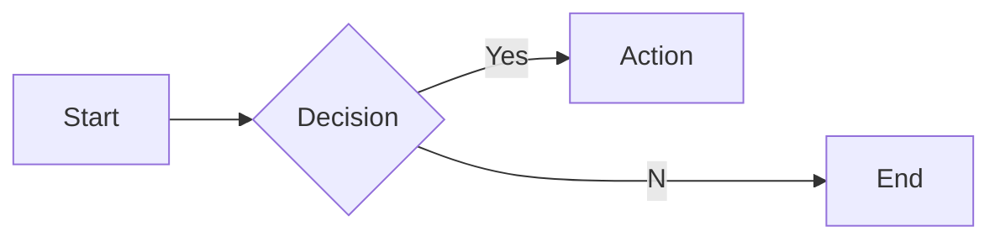
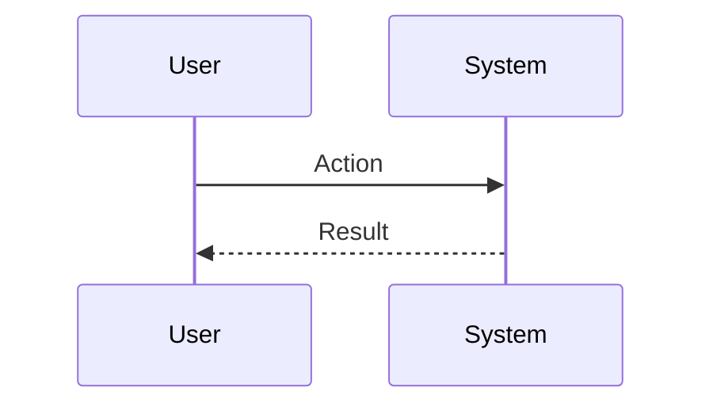

# Interview Questions: ceo (ROLE)

This document contains 100 interview questions tailored for the ceo role. The questions are designed to assess technical skills, soft skills, and cultural fit.

---

## 1. Strategic Vision

**Scenario:** Long-term planning.

**Question:** How do you define and communicate a 3-5 year vision for the company/department?

**Key Concepts:** `Strategy`, `Leadership`

### Candidate Response Paths
*   **Junior**: I focus on next year.
*   **Senior**: I analyze market trends, align with core values, and use storytelling to inspire the org.

---

## 2. Culture Building

**Scenario:** Toxic culture vs High performance.

**Question:** How do you build and maintain a high-performance culture?

**Key Concepts:** `Culture`, `Management`

### Candidate Response Paths
*   **Junior**: Pizza parties.
*   **Senior**: Defining clear values, rewarding behavior that aligns, and swift action on toxicity.

---

## 3. Crisis Management

**Scenario:** PR disaster or major outage.

**Question:** Walk me through your thought process during a major company crisis.

**Key Concepts:** `Crisis Mgmt`, `Leadership`

### Candidate Response Paths
*   **Junior**: Panic and blame.
*   **Senior**: Stabilize, Communicate, Remediation, and Post-Mortem.

---

## 4. Board Relations

**Scenario:** Bad news delivery.

**Question:** How do you manage board expectations when targets are missed?

**Key Concepts:** `Communication`, `Stakeholder Mgmt`

### Candidate Response Paths
*   **Junior**: Hide the bad news.
*   **Senior**: Transparency, presenting a recovery plan, and owning the outcome.

---

## 5. Hiring Executives

**Scenario:** Building your leadership team.

**Question:** What do you look for when hiring a VP/Director reporting to you?

**Key Concepts:** `Hiring`, `Leadership`

### Candidate Response Paths
*   **Junior**: Skills on paper.
*   **Senior**: Cultural add, strategic thinking, and ability to scale.

---

## 6. Resource Allocation

**Scenario:** Budget cuts.

**Question:** How do you decide where to cut budget when necessary?

**Key Concepts:** `Finance`, `Strategy`

### Candidate Response Paths
*   **Junior**: Cut everything equally.
*   **Senior**: Protect core revenue drivers and cut non-essential initiatives.

---

## 7. Mergers & Acquisitions

**Scenario:** Buying a company.

**Question:** What are your key criteria for evaluating an acquisition target?

| Metric | Target | Status |
|---|---|---|
| KPI 1 | 100% | Green |
| KPI 2 | < 5% | Yellow |

**Key Concepts:** `M&A`, `Strategy`

### Candidate Response Paths
*   **Junior**: Price.
*   **Senior**: Cultural fit, tech synergy, and accretive value.

---

## 8. Stakeholder Management

**Scenario:** Conflicting interests.

**Question:** How do you balance the needs of customers, employees, and investors?

**Key Concepts:** `Balance`, `Leadership`

### Candidate Response Paths
*   **Junior**: Focus on investors.
*   **Senior**: Finding the sweet spot where all three benefit long-term.

---

## 9. Organizational Design

**Scenario:** Restructuring.

**Question:** When do you know it's time to restructure the organization?

**Key Concepts:** `Org Design`, `Scale`

### Candidate Response Paths
*   **Junior**: When people complain.
*   **Senior**: When the current structure impedes execution or strategy.

---

## 10. Change Management

**Scenario:** Pivot.

**Question:** How do you lead the organization through a major strategic pivot?

**Key Concepts:** `Change Mgmt`, `Communication`

### Candidate Response Paths
*   **Junior**: Send an email.
*   **Senior**: Clear 'why', constant communication, and quick wins.

---

## 11. Conflict Resolution

**Scenario:** Disagreement with a peer.

**Question:** Tell me about a time you had a significant disagreement with a colleague. How did you resolve it?

**Key Concepts:** `Communication`, `Soft Skills`

### Candidate Response Paths
*   **Junior**: I told them I was right.
*   **Senior**: I listened to their perspective, found common ground, and we compromised.

---

## 12. Failure Handling

**Scenario:** A project went wrong.

**Question:** Describe a time you failed. What happened and what did you learn?

**Key Concepts:** `Growth Mindset`, `Resilience`

### Candidate Response Paths
*   **Junior**: I tried hard but it failed.
*   **Senior**: I analyzed the root cause, implemented a fix, and shared the learning.

---

## 13. Prioritization

**Scenario:** Too many tasks.

**Question:** How do you prioritize when you have multiple conflicting deadlines?

**Key Concepts:** `Time Management`, `Organization`

### Candidate Response Paths
*   **Junior**: I work longer hours.
*   **Senior**: I communicate with stakeholders to adjust expectations and focus on high-impact tasks.

---

## 14. Adaptability

**Scenario:** Changing requirements.

**Question:** How do you handle sudden changes in project scope or direction?

| Metric | Target | Status |
|---|---|---|
| KPI 1 | 100% | Green |
| KPI 2 | < 5% | Yellow |

**Key Concepts:** `Agility`, `Flexibility`

### Candidate Response Paths
*   **Junior**: I get frustrated but do it.
*   **Senior**: I assess the impact, communicate risks, and pivot quickly.

---

## 15. Communication

**Scenario:** Explaining complex topics.

**Question:** Describe a time you had to explain a complex technical/business concept to a non-expert.

**Key Concepts:** `Clarity`, `Empathy`

### Candidate Response Paths
*   **Junior**: I just said it simpler.
*   **Senior**: I used analogies and checked for understanding throughout.

---

## 16. Teamwork

**Scenario:** Collaborating with difficult personalities.

**Question:** How do you handle working with someone who is difficult to work with?

**Key Concepts:** `Collaboration`, `EQ`

### Candidate Response Paths
*   **Junior**: I avoid them.
*   **Senior**: I try to understand their motivations and find a way to work together effectively.

---

## 17. Innovation

**Scenario:** Improving a process.

**Question:** Tell me about a time you improved a process or workflow.

**Key Concepts:** `Innovation`, `Efficiency`

### Candidate Response Paths
*   **Junior**: I followed the rules.
*   **Senior**: I identified a bottleneck, proposed a solution, and measured the improvement.

---

## 18. Feedback

**Scenario:** Receiving constructive criticism.

**Question:** Tell me about a time you received difficult feedback. How did you react?

**Key Concepts:** `Self-awareness`, `Growth`

### Candidate Response Paths
*   **Junior**: I got defensive.
*   **Senior**: I listened, asked for examples, and worked on a plan to improve.

---

## 19. Leadership

**Scenario:** Leading without authority.

**Question:** Describe a time you demonstrated leadership when you weren't the formal manager.

**Key Concepts:** `Leadership`, `Influence`

### Candidate Response Paths
*   **Junior**: I told people what to do.
*   **Senior**: I rallied the team around a goal and supported them to achieve it.

---

## 20. Decision Making

**Scenario:** Incomplete information.

**Question:** How do you make decisions when you don't have all the data?

**Key Concepts:** `Judgment`, `Risk Mgmt`

### Candidate Response Paths
*   **Junior**: I wait for all data.
*   **Senior**: I assess the risk, make a call based on available info, and adjust as needed.

---

## 21. Start vs Scale for Crisis Comms

**Scenario:** Context.

**Question:** How does your approach to Crisis Comms differ in a startup vs a large corp?

| Metric | Target | Status |
|---|---|---|
| KPI 1 | 100% | Green |
| KPI 2 | < 5% | Yellow |

**Key Concepts:** `Crisis Comms`, `Context`

### Candidate Response Paths
*   **Junior**: It's the same.
*   **Senior**: Speed/Chaos vs Process/Stability.

---

## 22. Start vs Scale for Compensation Strategy

**Scenario:** Context.

**Question:** How does your approach to Compensation Strategy differ in a startup vs a large corp?

**Key Concepts:** `Compensation Strategy`, `Context`

### Candidate Response Paths
*   **Junior**: It's the same.
*   **Senior**: Speed/Chaos vs Process/Stability.

---

## 23. Challenges in Culture

**Scenario:** Problem Solving.

**Question:** What are the biggest challenges you've faced regarding Culture?

**Key Concepts:** `Culture`, `Problem Solving`

### Candidate Response Paths
*   **Junior**: It was hard.
*   **Senior**: Specific examples of obstacles and strategies to overcome them.

---

## 24. Mistakes in Digital Transformation

**Scenario:** Learning.

**Question:** What common mistakes do people make with Digital Transformation?

**Key Concepts:** `Digital Transformation`, `Experience`

### Candidate Response Paths
*   **Junior**: Doing it wrong.
*   **Senior**: Subtle pitfalls and how to avoid them.

---

## 25. Deep Dive: Change Management

**Scenario:** Assessing depth in Change Management.

**Question:** Can you explain Change Management in detail and how you have applied it in your past role?

**Key Concepts:** `Change Management`, `Experience`

### Candidate Response Paths
*   **Junior**: Basic definition.
*   **Senior**: Deep practical application and nuances.

---

## 26. Deep Dive: Digital Transformation

**Scenario:** Assessing depth in Digital Transformation.

**Question:** Can you explain Digital Transformation in detail and how you have applied it in your past role?

**Key Concepts:** `Digital Transformation`, `Experience`

### Candidate Response Paths
*   **Junior**: Basic definition.
*   **Senior**: Deep practical application and nuances.

---

## 27. Ethics in Capital Allocation

**Scenario:** Ethics.

**Question:** What are the ethical considerations regarding Capital Allocation?

**Key Concepts:** `Capital Allocation`, `Ethics`

### Candidate Response Paths
*   **Junior**: Be nice.
*   **Senior**: Privacy, bias, and societal impact.

---

## 28. Future of Capital Allocation

**Scenario:** Trends.

**Question:** Where do you see Capital Allocation heading in the next 5 years?

| Metric | Target | Status |
|---|---|---|
| KPI 1 | 100% | Green |
| KPI 2 | < 5% | Yellow |

**Key Concepts:** `Capital Allocation`, `Vision`

### Candidate Response Paths
*   **Junior**: It will get better.
*   **Senior**: Emerging trends, AI impact, and market shifts.

---

## 29. Teaching Public Speaking

**Scenario:** Mentorship.

**Question:** How would you teach Public Speaking to a junior team member?

**Key Concepts:** `Public Speaking`, `Mentorship`

### Candidate Response Paths
*   **Junior**: Send them a link.
*   **Senior**: Structured learning path and hands-on practice.

---

## 30. Teaching Investor Relations

**Scenario:** Mentorship.

**Question:** How would you teach Investor Relations to a junior team member?

**Key Concepts:** `Investor Relations`, `Mentorship`

### Candidate Response Paths
*   **Junior**: Send them a link.
*   **Senior**: Structured learning path and hands-on practice.

---

## 31. Scaling Culture

**Scenario:** Growth.

**Question:** How do you scale Culture as the company grows?

**Key Concepts:** `Culture`, `Scale`

### Candidate Response Paths
*   **Junior**: Hire more people.
*   **Senior**: Process automation, documentation, and leverage.

---

## 32. Tooling: Crisis Comms

**Scenario:** Proficiency.

**Question:** How do you utilize Crisis Comms to improve efficiency?

**Key Concepts:** `Crisis Comms`, `Productivity`

### Candidate Response Paths
*   **Junior**: I use it daily.
*   **Senior**: Advanced features and automation.

---

## 33. Metrics for Change Management

**Scenario:** Measurement.

**Question:** How do you measure success in Change Management?

**Key Concepts:** `Change Management`, `Analytics`

### Candidate Response Paths
*   **Junior**: I guess.
*   **Senior**: Specific KPIs and leading/lagging indicators.

---

## 34. Tooling: Org Design

**Scenario:** Proficiency.

**Question:** How do you utilize Org Design to improve efficiency?

**Key Concepts:** `Org Design`, `Productivity`

### Candidate Response Paths
*   **Junior**: I use it daily.
*   **Senior**: Advanced features and automation.

---

## 35. Challenges in Crisis Comms

**Scenario:** Problem Solving.

**Question:** What are the biggest challenges you've faced regarding Crisis Comms?

| Metric | Target | Status |
|---|---|---|
| KPI 1 | 100% | Green |
| KPI 2 | < 5% | Yellow |

**Key Concepts:** `Crisis Comms`, `Problem Solving`

### Candidate Response Paths
*   **Junior**: It was hard.
*   **Senior**: Specific examples of obstacles and strategies to overcome them.

---

## 36. Metrics for Culture

**Scenario:** Measurement.

**Question:** How do you measure success in Culture?

**Key Concepts:** `Culture`, `Analytics`

### Candidate Response Paths
*   **Junior**: I guess.
*   **Senior**: Specific KPIs and leading/lagging indicators.

---

## 37. Challenges in IPO

**Scenario:** Problem Solving.

**Question:** What are the biggest challenges you've faced regarding IPO?

**Key Concepts:** `IPO`, `Problem Solving`

### Candidate Response Paths
*   **Junior**: It was hard.
*   **Senior**: Specific examples of obstacles and strategies to overcome them.

---

## 38. Compensation Strategy Best Practices

**Scenario:** Standardization.

**Question:** What are the industry best practices for Compensation Strategy?

**Key Concepts:** `Compensation Strategy`, `Standards`

### Candidate Response Paths
*   **Junior**: List a few.
*   **Senior**: Discusses why they are best practices and when to break them.

---

## 39. Challenges in Investor Relations

**Scenario:** Problem Solving.

**Question:** What are the biggest challenges you've faced regarding Investor Relations?

**Key Concepts:** `Investor Relations`, `Problem Solving`

### Candidate Response Paths
*   **Junior**: It was hard.
*   **Senior**: Specific examples of obstacles and strategies to overcome them.

---

## 40. Scaling Investor Relations

**Scenario:** Growth.

**Question:** How do you scale Investor Relations as the company grows?

**Key Concepts:** `Investor Relations`, `Scale`

### Candidate Response Paths
*   **Junior**: Hire more people.
*   **Senior**: Process automation, documentation, and leverage.

---

## 41. Future of ESG

**Scenario:** Trends.

**Question:** Where do you see ESG heading in the next 5 years?

**Key Concepts:** `ESG`, `Vision`

### Candidate Response Paths
*   **Junior**: It will get better.
*   **Senior**: Emerging trends, AI impact, and market shifts.

---

## 42. Capital Allocation Best Practices

**Scenario:** Standardization.

**Question:** What are the industry best practices for Capital Allocation?

| Metric | Target | Status |
|---|---|---|
| KPI 1 | 100% | Green |
| KPI 2 | < 5% | Yellow |

**Key Concepts:** `Capital Allocation`, `Standards`

### Candidate Response Paths
*   **Junior**: List a few.
*   **Senior**: Discusses why they are best practices and when to break them.

---

## 43. Start vs Scale for Investor Relations

**Scenario:** Context.

**Question:** How does your approach to Investor Relations differ in a startup vs a large corp?

**Key Concepts:** `Investor Relations`, `Context`

### Candidate Response Paths
*   **Junior**: It's the same.
*   **Senior**: Speed/Chaos vs Process/Stability.

---

## 44. Scaling ESG

**Scenario:** Growth.

**Question:** How do you scale ESG as the company grows?

**Key Concepts:** `ESG`, `Scale`

### Candidate Response Paths
*   **Junior**: Hire more people.
*   **Senior**: Process automation, documentation, and leverage.

---

## 45. Mistakes in ESG

**Scenario:** Learning.

**Question:** What common mistakes do people make with ESG?

**Key Concepts:** `ESG`, `Experience`

### Candidate Response Paths
*   **Junior**: Doing it wrong.
*   **Senior**: Subtle pitfalls and how to avoid them.

---

## 46. Metrics for Global Expansion

**Scenario:** Measurement.

**Question:** How do you measure success in Global Expansion?

**Key Concepts:** `Global Expansion`, `Analytics`

### Candidate Response Paths
*   **Junior**: I guess.
*   **Senior**: Specific KPIs and leading/lagging indicators.

---

## 47. Future of Change Management

**Scenario:** Trends.

**Question:** Where do you see Change Management heading in the next 5 years?

**Key Concepts:** `Change Management`, `Vision`

### Candidate Response Paths
*   **Junior**: It will get better.
*   **Senior**: Emerging trends, AI impact, and market shifts.

---

## 48. Ethics in Risk Management

**Scenario:** Ethics.

**Question:** What are the ethical considerations regarding Risk Management?

**Key Concepts:** `Risk Management`, `Ethics`

### Candidate Response Paths
*   **Junior**: Be nice.
*   **Senior**: Privacy, bias, and societal impact.

---

## 49. Tooling: Public Speaking

**Scenario:** Proficiency.

**Question:** How do you utilize Public Speaking to improve efficiency?

| Metric | Target | Status |
|---|---|---|
| KPI 1 | 100% | Green |
| KPI 2 | < 5% | Yellow |

**Key Concepts:** `Public Speaking`, `Productivity`

### Candidate Response Paths
*   **Junior**: I use it daily.
*   **Senior**: Advanced features and automation.

---

## 50. Future of Org Design

**Scenario:** Trends.

**Question:** Where do you see Org Design heading in the next 5 years?

**Key Concepts:** `Org Design`, `Vision`

### Candidate Response Paths
*   **Junior**: It will get better.
*   **Senior**: Emerging trends, AI impact, and market shifts.

---

## 51. Tooling: M&A

**Scenario:** Proficiency.

**Question:** How do you utilize M&A to improve efficiency?

**Key Concepts:** `M&A`, `Productivity`

### Candidate Response Paths
*   **Junior**: I use it daily.
*   **Senior**: Advanced features and automation.

---

## 52. Future of Global Expansion

**Scenario:** Trends.

**Question:** Where do you see Global Expansion heading in the next 5 years?

**Key Concepts:** `Global Expansion`, `Vision`

### Candidate Response Paths
*   **Junior**: It will get better.
*   **Senior**: Emerging trends, AI impact, and market shifts.

---

## 53. Start vs Scale for Change Management

**Scenario:** Context.

**Question:** How does your approach to Change Management differ in a startup vs a large corp?

**Key Concepts:** `Change Management`, `Context`

### Candidate Response Paths
*   **Junior**: It's the same.
*   **Senior**: Speed/Chaos vs Process/Stability.

---

## 54. Ethics in Crisis Comms

**Scenario:** Ethics.

**Question:** What are the ethical considerations regarding Crisis Comms?

**Key Concepts:** `Crisis Comms`, `Ethics`

### Candidate Response Paths
*   **Junior**: Be nice.
*   **Senior**: Privacy, bias, and societal impact.

---

## 55. Future of Investor Relations

**Scenario:** Trends.

**Question:** Where do you see Investor Relations heading in the next 5 years?

**Key Concepts:** `Investor Relations`, `Vision`

### Candidate Response Paths
*   **Junior**: It will get better.
*   **Senior**: Emerging trends, AI impact, and market shifts.

---

## 56. Teaching Crisis Comms

**Scenario:** Mentorship.

**Question:** How would you teach Crisis Comms to a junior team member?

| Metric | Target | Status |
|---|---|---|
| KPI 1 | 100% | Green |
| KPI 2 | < 5% | Yellow |

**Key Concepts:** `Crisis Comms`, `Mentorship`

### Candidate Response Paths
*   **Junior**: Send them a link.
*   **Senior**: Structured learning path and hands-on practice.

---

## 57. Mistakes in M&A

**Scenario:** Learning.

**Question:** What common mistakes do people make with M&A?

**Key Concepts:** `M&A`, `Experience`

### Candidate Response Paths
*   **Junior**: Doing it wrong.
*   **Senior**: Subtle pitfalls and how to avoid them.

---

## 58. Mistakes in Culture

**Scenario:** Learning.

**Question:** What common mistakes do people make with Culture?

**Key Concepts:** `Culture`, `Experience`

### Candidate Response Paths
*   **Junior**: Doing it wrong.
*   **Senior**: Subtle pitfalls and how to avoid them.

---

## 59. Challenges in Compensation Strategy

**Scenario:** Problem Solving.

**Question:** What are the biggest challenges you've faced regarding Compensation Strategy?

**Key Concepts:** `Compensation Strategy`, `Problem Solving`

### Candidate Response Paths
*   **Junior**: It was hard.
*   **Senior**: Specific examples of obstacles and strategies to overcome them.

---

## 60. ESG Best Practices

**Scenario:** Standardization.

**Question:** What are the industry best practices for ESG?

**Key Concepts:** `ESG`, `Standards`

### Candidate Response Paths
*   **Junior**: List a few.
*   **Senior**: Discusses why they are best practices and when to break them.

---

## 61. Public Speaking Best Practices

**Scenario:** Standardization.

**Question:** What are the industry best practices for Public Speaking?

**Key Concepts:** `Public Speaking`, `Standards`

### Candidate Response Paths
*   **Junior**: List a few.
*   **Senior**: Discusses why they are best practices and when to break them.

---

## 62. Teaching M&A

**Scenario:** Mentorship.

**Question:** How would you teach M&A to a junior team member?

**Key Concepts:** `M&A`, `Mentorship`

### Candidate Response Paths
*   **Junior**: Send them a link.
*   **Senior**: Structured learning path and hands-on practice.

---

## 63. Start vs Scale for Board Mgmt

**Scenario:** Context.

**Question:** How does your approach to Board Mgmt differ in a startup vs a large corp?

| Metric | Target | Status |
|---|---|---|
| KPI 1 | 100% | Green |
| KPI 2 | < 5% | Yellow |

**Key Concepts:** `Board Mgmt`, `Context`

### Candidate Response Paths
*   **Junior**: It's the same.
*   **Senior**: Speed/Chaos vs Process/Stability.

---

## 64. Scaling Public Speaking

**Scenario:** Growth.

**Question:** How do you scale Public Speaking as the company grows?

**Key Concepts:** `Public Speaking`, `Scale`

### Candidate Response Paths
*   **Junior**: Hire more people.
*   **Senior**: Process automation, documentation, and leverage.

---

## 65. Collaboration in Public Speaking

**Scenario:** Teamwork.

**Question:** How does Public Speaking require cross-functional collaboration?

**Key Concepts:** `Public Speaking`, `Collaboration`

### Candidate Response Paths
*   **Junior**: I talk to people.
*   **Senior**: Alignment with other depts and shared goals.

---

## 66. Collaboration in Investor Relations

**Scenario:** Teamwork.

**Question:** How does Investor Relations require cross-functional collaboration?

**Key Concepts:** `Investor Relations`, `Collaboration`

### Candidate Response Paths
*   **Junior**: I talk to people.
*   **Senior**: Alignment with other depts and shared goals.

---

## 67. Tooling: Board Mgmt

**Scenario:** Proficiency.

**Question:** How do you utilize Board Mgmt to improve efficiency?

**Key Concepts:** `Board Mgmt`, `Productivity`

### Candidate Response Paths
*   **Junior**: I use it daily.
*   **Senior**: Advanced features and automation.

---

## 68. Future of Crisis Comms

**Scenario:** Trends.

**Question:** Where do you see Crisis Comms heading in the next 5 years?

**Key Concepts:** `Crisis Comms`, `Vision`

### Candidate Response Paths
*   **Junior**: It will get better.
*   **Senior**: Emerging trends, AI impact, and market shifts.

---

## 69. Metrics for Risk Management

**Scenario:** Measurement.

**Question:** How do you measure success in Risk Management?

**Key Concepts:** `Risk Management`, `Analytics`

### Candidate Response Paths
*   **Junior**: I guess.
*   **Senior**: Specific KPIs and leading/lagging indicators.

---

## 70. Mistakes in Org Design

**Scenario:** Learning.

**Question:** What common mistakes do people make with Org Design?

| Metric | Target | Status |
|---|---|---|
| KPI 1 | 100% | Green |
| KPI 2 | < 5% | Yellow |

**Key Concepts:** `Org Design`, `Experience`

### Candidate Response Paths
*   **Junior**: Doing it wrong.
*   **Senior**: Subtle pitfalls and how to avoid them.

---

## 71. Risk Management Best Practices

**Scenario:** Standardization.

**Question:** What are the industry best practices for Risk Management?

**Key Concepts:** `Risk Management`, `Standards`

### Candidate Response Paths
*   **Junior**: List a few.
*   **Senior**: Discusses why they are best practices and when to break them.

---

## 72. Challenges in Board Mgmt

**Scenario:** Problem Solving.

**Question:** What are the biggest challenges you've faced regarding Board Mgmt?

**Key Concepts:** `Board Mgmt`, `Problem Solving`

### Candidate Response Paths
*   **Junior**: It was hard.
*   **Senior**: Specific examples of obstacles and strategies to overcome them.

---

## 73. Mistakes in Board Mgmt

**Scenario:** Learning.

**Question:** What common mistakes do people make with Board Mgmt?

**Key Concepts:** `Board Mgmt`, `Experience`

### Candidate Response Paths
*   **Junior**: Doing it wrong.
*   **Senior**: Subtle pitfalls and how to avoid them.

---

## 74. M&A Best Practices

**Scenario:** Standardization.

**Question:** What are the industry best practices for M&A?

**Key Concepts:** `M&A`, `Standards`

### Candidate Response Paths
*   **Junior**: List a few.
*   **Senior**: Discusses why they are best practices and when to break them.

---

## 75. Ethics in ESG

**Scenario:** Ethics.

**Question:** What are the ethical considerations regarding ESG?

**Key Concepts:** `ESG`, `Ethics`

### Candidate Response Paths
*   **Junior**: Be nice.
*   **Senior**: Privacy, bias, and societal impact.

---

## 76. IPO Best Practices

**Scenario:** Standardization.

**Question:** What are the industry best practices for IPO?

**Key Concepts:** `IPO`, `Standards`

### Candidate Response Paths
*   **Junior**: List a few.
*   **Senior**: Discusses why they are best practices and when to break them.

---

## 77. Board Mgmt Best Practices

**Scenario:** Standardization.

**Question:** What are the industry best practices for Board Mgmt?

| Metric | Target | Status |
|---|---|---|
| KPI 1 | 100% | Green |
| KPI 2 | < 5% | Yellow |

**Key Concepts:** `Board Mgmt`, `Standards`

### Candidate Response Paths
*   **Junior**: List a few.
*   **Senior**: Discusses why they are best practices and when to break them.

---

## 78. Teaching Global Expansion

**Scenario:** Mentorship.

**Question:** How would you teach Global Expansion to a junior team member?

**Key Concepts:** `Global Expansion`, `Mentorship`

### Candidate Response Paths
*   **Junior**: Send them a link.
*   **Senior**: Structured learning path and hands-on practice.

---

## 79. Start vs Scale for Global Expansion

**Scenario:** Context.

**Question:** How does your approach to Global Expansion differ in a startup vs a large corp?

**Key Concepts:** `Global Expansion`, `Context`

### Candidate Response Paths
*   **Junior**: It's the same.
*   **Senior**: Speed/Chaos vs Process/Stability.

---

## 80. Teaching ESG

**Scenario:** Mentorship.

**Question:** How would you teach ESG to a junior team member?

**Key Concepts:** `ESG`, `Mentorship`

### Candidate Response Paths
*   **Junior**: Send them a link.
*   **Senior**: Structured learning path and hands-on practice.

---

## 81. Metrics for Digital Transformation

**Scenario:** Measurement.

**Question:** How do you measure success in Digital Transformation?

**Key Concepts:** `Digital Transformation`, `Analytics`

### Candidate Response Paths
*   **Junior**: I guess.
*   **Senior**: Specific KPIs and leading/lagging indicators.

---

## 82. Teaching Capital Allocation

**Scenario:** Mentorship.

**Question:** How would you teach Capital Allocation to a junior team member?

**Key Concepts:** `Capital Allocation`, `Mentorship`

### Candidate Response Paths
*   **Junior**: Send them a link.
*   **Senior**: Structured learning path and hands-on practice.

---

## 83. Culture Best Practices

**Scenario:** Standardization.

**Question:** What are the industry best practices for Culture?

**Key Concepts:** `Culture`, `Standards`

### Candidate Response Paths
*   **Junior**: List a few.
*   **Senior**: Discusses why they are best practices and when to break them.

---

## 84. Tooling: Culture

**Scenario:** Proficiency.

**Question:** How do you utilize Culture to improve efficiency?

| Metric | Target | Status |
|---|---|---|
| KPI 1 | 100% | Green |
| KPI 2 | < 5% | Yellow |

**Key Concepts:** `Culture`, `Productivity`

### Candidate Response Paths
*   **Junior**: I use it daily.
*   **Senior**: Advanced features and automation.

---

## 85. Ethics in Investor Relations

**Scenario:** Ethics.

**Question:** What are the ethical considerations regarding Investor Relations?

**Key Concepts:** `Investor Relations`, `Ethics`

### Candidate Response Paths
*   **Junior**: Be nice.
*   **Senior**: Privacy, bias, and societal impact.

---

## 86. Org Design Best Practices

**Scenario:** Standardization.

**Question:** What are the industry best practices for Org Design?

**Key Concepts:** `Org Design`, `Standards`

### Candidate Response Paths
*   **Junior**: List a few.
*   **Senior**: Discusses why they are best practices and when to break them.

---

## 87. Future of Digital Transformation

**Scenario:** Trends.

**Question:** Where do you see Digital Transformation heading in the next 5 years?

**Key Concepts:** `Digital Transformation`, `Vision`

### Candidate Response Paths
*   **Junior**: It will get better.
*   **Senior**: Emerging trends, AI impact, and market shifts.

---

## 88. Tooling: Digital Transformation

**Scenario:** Proficiency.

**Question:** How do you utilize Digital Transformation to improve efficiency?

**Key Concepts:** `Digital Transformation`, `Productivity`

### Candidate Response Paths
*   **Junior**: I use it daily.
*   **Senior**: Advanced features and automation.

---

## 89. Metrics for IPO

**Scenario:** Measurement.

**Question:** How do you measure success in IPO?

**Key Concepts:** `IPO`, `Analytics`

### Candidate Response Paths
*   **Junior**: I guess.
*   **Senior**: Specific KPIs and leading/lagging indicators.

---

## 90. Collaboration in ESG

**Scenario:** Teamwork.

**Question:** How does ESG require cross-functional collaboration?

**Key Concepts:** `ESG`, `Collaboration`

### Candidate Response Paths
*   **Junior**: I talk to people.
*   **Senior**: Alignment with other depts and shared goals.

---

## 91. Change Management Best Practices

**Scenario:** Standardization.

**Question:** What are the industry best practices for Change Management?

| Metric | Target | Status |
|---|---|---|
| KPI 1 | 100% | Green |
| KPI 2 | < 5% | Yellow |

**Key Concepts:** `Change Management`, `Standards`

### Candidate Response Paths
*   **Junior**: List a few.
*   **Senior**: Discusses why they are best practices and when to break them.

---

## 92. Ethics in M&A

**Scenario:** Ethics.

**Question:** What are the ethical considerations regarding M&A?

**Key Concepts:** `M&A`, `Ethics`

### Candidate Response Paths
*   **Junior**: Be nice.
*   **Senior**: Privacy, bias, and societal impact.

---

## 93. Start vs Scale for Culture

**Scenario:** Context.

**Question:** How does your approach to Culture differ in a startup vs a large corp?

**Key Concepts:** `Culture`, `Context`

### Candidate Response Paths
*   **Junior**: It's the same.
*   **Senior**: Speed/Chaos vs Process/Stability.

---

## 94. Tooling: Capital Allocation

**Scenario:** Proficiency.

**Question:** How do you utilize Capital Allocation to improve efficiency?

**Key Concepts:** `Capital Allocation`, `Productivity`

### Candidate Response Paths
*   **Junior**: I use it daily.
*   **Senior**: Advanced features and automation.

---

## 95. Future of Culture

**Scenario:** Trends.

**Question:** Where do you see Culture heading in the next 5 years?

**Key Concepts:** `Culture`, `Vision`

### Candidate Response Paths
*   **Junior**: It will get better.
*   **Senior**: Emerging trends, AI impact, and market shifts.

---

## 96. Challenges in Org Design

**Scenario:** Problem Solving.

**Question:** What are the biggest challenges you've faced regarding Org Design?

**Key Concepts:** `Org Design`, `Problem Solving`

### Candidate Response Paths
*   **Junior**: It was hard.
*   **Senior**: Specific examples of obstacles and strategies to overcome them.

---

## 97. Deep Dive: Culture

**Scenario:** Assessing depth in Culture.

**Question:** Can you explain Culture in detail and how you have applied it in your past role?

**Key Concepts:** `Culture`, `Experience`

### Candidate Response Paths
*   **Junior**: Basic definition.
*   **Senior**: Deep practical application and nuances.

---

## 98. Deep Dive: Board Mgmt

**Scenario:** Assessing depth in Board Mgmt.

**Question:** Can you explain Board Mgmt in detail and how you have applied it in your past role?

| Metric | Target | Status |
|---|---|---|
| KPI 1 | 100% | Green |
| KPI 2 | < 5% | Yellow |

**Key Concepts:** `Board Mgmt`, `Experience`

### Candidate Response Paths
*   **Junior**: Basic definition.
*   **Senior**: Deep practical application and nuances.

---

## 99. Tooling: ESG

**Scenario:** Proficiency.

**Question:** How do you utilize ESG to improve efficiency?

**Key Concepts:** `ESG`, `Productivity`

### Candidate Response Paths
*   **Junior**: I use it daily.
*   **Senior**: Advanced features and automation.

---

## 100. Teaching IPO

**Scenario:** Mentorship.

**Question:** How would you teach IPO to a junior team member?

**Key Concepts:** `IPO`, `Mentorship`

### Candidate Response Paths
*   **Junior**: Send them a link.
*   **Senior**: Structured learning path and hands-on practice.

---
