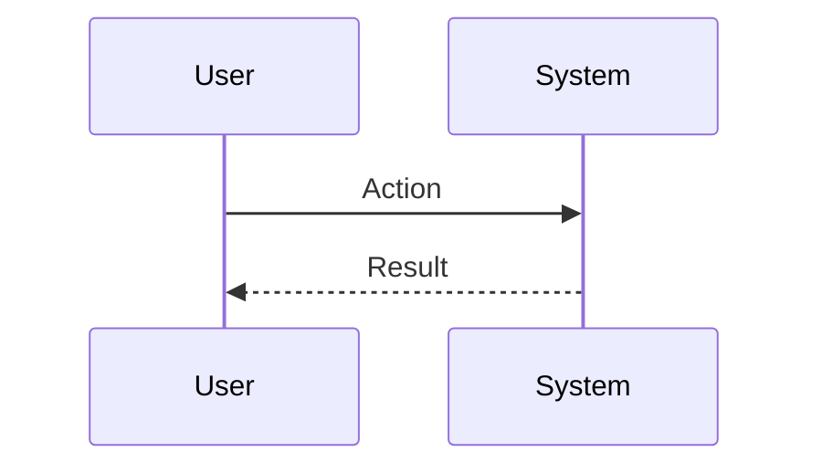
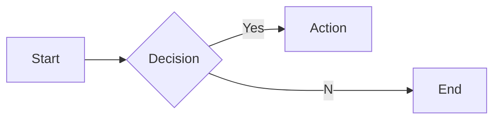

# Interview Questions: controller (ROLE)

This document contains 100 interview questions tailored for the controller role. The questions are designed to assess technical skills, soft skills, and cultural fit.

---

## 1. Cash Flow vs Profit

**Scenario:** Startup metrics.

**Question:** Why is Cash Flow more important than Profit for a startup?

**Key Concepts:** `Accounting`, `Strategy`

### Candidate Response Paths
*   **Junior**: Profit is king.
*   **Senior**: You can be profitable on paper but die if you run out of cash (runway).

---

## 2. Budgeting Process

**Scenario:** Zero-based budgeting.

**Question:** Describe your approach to the annual budgeting process.

**Key Concepts:** `Planning`, `FP&A`

### Candidate Response Paths
*   **Junior**: Copy last year.
*   **Senior**: Bottom-up build combined with top-down targets.

---

## 3. Financial Modeling

**Scenario:** Forecast.

**Question:** How do you build a robust financial model?

**Key Concepts:** `Modeling`, `Excel`

### Candidate Response Paths
*   **Junior**: Assume growth.
*   **Senior**: Driver-based modeling, sensitivity analysis, and scenario planning.

---

## 4. Metrics

**Scenario:** SaaS.

**Question:** What are the key SaaS metrics you track?

**Key Concepts:** `SaaS`, `Metrics`

### Candidate Response Paths
*   **Junior**: Revenue.
*   **Senior**: ARR, MRR, Churn, CAC, LTV, Net Retention, Rule of 40.

---

## 5. Cost Control

**Scenario:** OpEx.

**Question:** How do you identify cost saving opportunities?

**Key Concepts:** `Efficiency`, `Analysis`

### Candidate Response Paths
*   **Junior**: Stop buying coffee.
*   **Senior**: Vendor analysis, cloud spend optimization, and process efficiency.

---

## 6. Compliance

**Scenario:** Audit.

**Question:** How do you prepare for a financial audit?

**Key Concepts:** `Audit`, `Compliance`

### Candidate Response Paths
*   **Junior**: Clean up files.
*   **Senior**: Maintaining clean books year-round, documentation of controls, and reconciliation.

---

## 7. Risk

**Scenario:** Market downturn.

**Question:** How do you hedge against financial risk?

| Metric | Target | Status |
|---|---|---|
| KPI 1 | 100% | Green |
| KPI 2 | < 5% | Yellow |

**Key Concepts:** `Risk`, `Strategy`

### Candidate Response Paths
*   **Junior**: Save money.
*   **Senior**: Diversification, insurance, and maintaining healthy cash reserves.

---

## 8. Reporting

**Scenario:** Board deck.

**Question:** How do you present complex financial data to the board?

**Key Concepts:** `Communication`, `Reporting`

### Candidate Response Paths
*   **Junior**: Spreadsheets.
*   **Senior**: Key highlights, visualizations, and narrative around the numbers.

---

## 9. Fundraising

**Scenario:** Series A/B.

**Question:** What is Finance's role in fundraising?

**Key Concepts:** `Fundraising`, `Due Diligence`

### Candidate Response Paths
*   **Junior**: Send bank statements.
*   **Senior**: Data room prep, financial storytelling, and due diligence management.

---

## 10. Systems

**Scenario:** ERP.

**Question:** When is the right time to switch from QuickBooks to NetSuite?

**Key Concepts:** `Systems`, `Scale`

### Candidate Response Paths
*   **Junior**: When we have money.
*   **Senior**: When complexity (multi-entity, rev rec) outgrows the current system capabilities.

---

## 11. Conflict Resolution

**Scenario:** Disagreement with a peer.

**Question:** Tell me about a time you had a significant disagreement with a colleague. How did you resolve it?

**Key Concepts:** `Communication`, `Soft Skills`

### Candidate Response Paths
*   **Junior**: I told them I was right.
*   **Senior**: I listened to their perspective, found common ground, and we compromised.

---

## 12. Failure Handling

**Scenario:** A project went wrong.

**Question:** Describe a time you failed. What happened and what did you learn?

**Key Concepts:** `Growth Mindset`, `Resilience`

### Candidate Response Paths
*   **Junior**: I tried hard but it failed.
*   **Senior**: I analyzed the root cause, implemented a fix, and shared the learning.

---

## 13. Prioritization

**Scenario:** Too many tasks.

**Question:** How do you prioritize when you have multiple conflicting deadlines?

**Key Concepts:** `Time Management`, `Organization`

### Candidate Response Paths
*   **Junior**: I work longer hours.
*   **Senior**: I communicate with stakeholders to adjust expectations and focus on high-impact tasks.

---

## 14. Adaptability

**Scenario:** Changing requirements.

**Question:** How do you handle sudden changes in project scope or direction?

| Metric | Target | Status |
|---|---|---|
| KPI 1 | 100% | Green |
| KPI 2 | < 5% | Yellow |

**Key Concepts:** `Agility`, `Flexibility`

### Candidate Response Paths
*   **Junior**: I get frustrated but do it.
*   **Senior**: I assess the impact, communicate risks, and pivot quickly.

---

## 15. Communication

**Scenario:** Explaining complex topics.

**Question:** Describe a time you had to explain a complex technical/business concept to a non-expert.

**Key Concepts:** `Clarity`, `Empathy`

### Candidate Response Paths
*   **Junior**: I just said it simpler.
*   **Senior**: I used analogies and checked for understanding throughout.

---

## 16. Teamwork

**Scenario:** Collaborating with difficult personalities.

**Question:** How do you handle working with someone who is difficult to work with?

**Key Concepts:** `Collaboration`, `EQ`

### Candidate Response Paths
*   **Junior**: I avoid them.
*   **Senior**: I try to understand their motivations and find a way to work together effectively.

---

## 17. Innovation

**Scenario:** Improving a process.

**Question:** Tell me about a time you improved a process or workflow.

**Key Concepts:** `Innovation`, `Efficiency`

### Candidate Response Paths
*   **Junior**: I followed the rules.
*   **Senior**: I identified a bottleneck, proposed a solution, and measured the improvement.

---

## 18. Feedback

**Scenario:** Receiving constructive criticism.

**Question:** Tell me about a time you received difficult feedback. How did you react?

**Key Concepts:** `Self-awareness`, `Growth`

### Candidate Response Paths
*   **Junior**: I got defensive.
*   **Senior**: I listened, asked for examples, and worked on a plan to improve.

---

## 19. Leadership

**Scenario:** Leading without authority.

**Question:** Describe a time you demonstrated leadership when you weren't the formal manager.

**Key Concepts:** `Leadership`, `Influence`

### Candidate Response Paths
*   **Junior**: I told people what to do.
*   **Senior**: I rallied the team around a goal and supported them to achieve it.

---

## 20. Decision Making

**Scenario:** Incomplete information.

**Question:** How do you make decisions when you don't have all the data?

**Key Concepts:** `Judgment`, `Risk Mgmt`

### Candidate Response Paths
*   **Junior**: I wait for all data.
*   **Senior**: I assess the risk, make a call based on available info, and adjust as needed.

---

## 21. Start vs Scale for FP&A

**Scenario:** Context.

**Question:** How does your approach to FP&A differ in a startup vs a large corp?

| Metric | Target | Status |
|---|---|---|
| KPI 1 | 100% | Green |
| KPI 2 | < 5% | Yellow |

**Key Concepts:** `FP&A`, `Context`

### Candidate Response Paths
*   **Junior**: It's the same.
*   **Senior**: Speed/Chaos vs Process/Stability.

---

## 22. Teaching Auditing

**Scenario:** Mentorship.

**Question:** How would you teach Auditing to a junior team member?

**Key Concepts:** `Auditing`, `Mentorship`

### Candidate Response Paths
*   **Junior**: Send them a link.
*   **Senior**: Structured learning path and hands-on practice.

---

## 23. Deep Dive: Procurement

**Scenario:** Assessing depth in Procurement.

**Question:** Can you explain Procurement in detail and how you have applied it in your past role?

**Key Concepts:** `Procurement`, `Experience`

### Candidate Response Paths
*   **Junior**: Basic definition.
*   **Senior**: Deep practical application and nuances.

---

## 24. Teaching FP&A

**Scenario:** Mentorship.

**Question:** How would you teach FP&A to a junior team member?

**Key Concepts:** `FP&A`, `Mentorship`

### Candidate Response Paths
*   **Junior**: Send them a link.
*   **Senior**: Structured learning path and hands-on practice.

---

## 25. Teaching Forecasting

**Scenario:** Mentorship.

**Question:** How would you teach Forecasting to a junior team member?

**Key Concepts:** `Forecasting`, `Mentorship`

### Candidate Response Paths
*   **Junior**: Send them a link.
*   **Senior**: Structured learning path and hands-on practice.

---

## 26. Challenges in GAAP

**Scenario:** Problem Solving.

**Question:** What are the biggest challenges you've faced regarding GAAP?

**Key Concepts:** `GAAP`, `Problem Solving`

### Candidate Response Paths
*   **Junior**: It was hard.
*   **Senior**: Specific examples of obstacles and strategies to overcome them.

---

## 27. FP&A Best Practices

**Scenario:** Standardization.

**Question:** What are the industry best practices for FP&A?

**Key Concepts:** `FP&A`, `Standards`

### Candidate Response Paths
*   **Junior**: List a few.
*   **Senior**: Discusses why they are best practices and when to break them.

---

## 28. Future of Procurement

**Scenario:** Trends.

**Question:** Where do you see Procurement heading in the next 5 years?

| Metric | Target | Status |
|---|---|---|
| KPI 1 | 100% | Green |
| KPI 2 | < 5% | Yellow |

**Key Concepts:** `Procurement`, `Vision`

### Candidate Response Paths
*   **Junior**: It will get better.
*   **Senior**: Emerging trends, AI impact, and market shifts.

---

## 29. Ethics in Forecasting

**Scenario:** Ethics.

**Question:** What are the ethical considerations regarding Forecasting?

**Key Concepts:** `Forecasting`, `Ethics`

### Candidate Response Paths
*   **Junior**: Be nice.
*   **Senior**: Privacy, bias, and societal impact.

---

## 30. Teaching Payroll

**Scenario:** Mentorship.

**Question:** How would you teach Payroll to a junior team member?

**Key Concepts:** `Payroll`, `Mentorship`

### Candidate Response Paths
*   **Junior**: Send them a link.
*   **Senior**: Structured learning path and hands-on practice.

---

## 31. Teaching Valuation

**Scenario:** Mentorship.

**Question:** How would you teach Valuation to a junior team member?

**Key Concepts:** `Valuation`, `Mentorship`

### Candidate Response Paths
*   **Junior**: Send them a link.
*   **Senior**: Structured learning path and hands-on practice.

---

## 32. Future of ERP

**Scenario:** Trends.

**Question:** Where do you see ERP heading in the next 5 years?

**Key Concepts:** `ERP`, `Vision`

### Candidate Response Paths
*   **Junior**: It will get better.
*   **Senior**: Emerging trends, AI impact, and market shifts.

---

## 33. Ethics in Cap Table

**Scenario:** Ethics.

**Question:** What are the ethical considerations regarding Cap Table?

**Key Concepts:** `Cap Table`, `Ethics`

### Candidate Response Paths
*   **Junior**: Be nice.
*   **Senior**: Privacy, bias, and societal impact.

---

## 34. Teaching GAAP

**Scenario:** Mentorship.

**Question:** How would you teach GAAP to a junior team member?

**Key Concepts:** `GAAP`, `Mentorship`

### Candidate Response Paths
*   **Junior**: Send them a link.
*   **Senior**: Structured learning path and hands-on practice.

---

## 35. Metrics for Cap Table

**Scenario:** Measurement.

**Question:** How do you measure success in Cap Table?

| Metric | Target | Status |
|---|---|---|
| KPI 1 | 100% | Green |
| KPI 2 | < 5% | Yellow |

**Key Concepts:** `Cap Table`, `Analytics`

### Candidate Response Paths
*   **Junior**: I guess.
*   **Senior**: Specific KPIs and leading/lagging indicators.

---

## 36. Tooling: Cash Flow

**Scenario:** Proficiency.

**Question:** How do you utilize Cash Flow to improve efficiency?

**Key Concepts:** `Cash Flow`, `Productivity`

### Candidate Response Paths
*   **Junior**: I use it daily.
*   **Senior**: Advanced features and automation.

---

## 37. Scaling Cap Table

**Scenario:** Growth.

**Question:** How do you scale Cap Table as the company grows?

**Key Concepts:** `Cap Table`, `Scale`

### Candidate Response Paths
*   **Junior**: Hire more people.
*   **Senior**: Process automation, documentation, and leverage.

---

## 38. Scaling Tax

**Scenario:** Growth.

**Question:** How do you scale Tax as the company grows?

**Key Concepts:** `Tax`, `Scale`

### Candidate Response Paths
*   **Junior**: Hire more people.
*   **Senior**: Process automation, documentation, and leverage.

---

## 39. Start vs Scale for Financial Modeling

**Scenario:** Context.

**Question:** How does your approach to Financial Modeling differ in a startup vs a large corp?

**Key Concepts:** `Financial Modeling`, `Context`

### Candidate Response Paths
*   **Junior**: It's the same.
*   **Senior**: Speed/Chaos vs Process/Stability.

---

## 40. Auditing Best Practices

**Scenario:** Standardization.

**Question:** What are the industry best practices for Auditing?

**Key Concepts:** `Auditing`, `Standards`

### Candidate Response Paths
*   **Junior**: List a few.
*   **Senior**: Discusses why they are best practices and when to break them.

---

## 41. Challenges in Tax

**Scenario:** Problem Solving.

**Question:** What are the biggest challenges you've faced regarding Tax?

**Key Concepts:** `Tax`, `Problem Solving`

### Candidate Response Paths
*   **Junior**: It was hard.
*   **Senior**: Specific examples of obstacles and strategies to overcome them.

---

## 42. Deep Dive: Compliance

**Scenario:** Assessing depth in Compliance.

**Question:** Can you explain Compliance in detail and how you have applied it in your past role?

| Metric | Target | Status |
|---|---|---|
| KPI 1 | 100% | Green |
| KPI 2 | < 5% | Yellow |

**Key Concepts:** `Compliance`, `Experience`

### Candidate Response Paths
*   **Junior**: Basic definition.
*   **Senior**: Deep practical application and nuances.

---

## 43. Challenges in Forecasting

**Scenario:** Problem Solving.

**Question:** What are the biggest challenges you've faced regarding Forecasting?

**Key Concepts:** `Forecasting`, `Problem Solving`

### Candidate Response Paths
*   **Junior**: It was hard.
*   **Senior**: Specific examples of obstacles and strategies to overcome them.

---

## 44. Deep Dive: Tax

**Scenario:** Assessing depth in Tax.

**Question:** Can you explain Tax in detail and how you have applied it in your past role?

**Key Concepts:** `Tax`, `Experience`

### Candidate Response Paths
*   **Junior**: Basic definition.
*   **Senior**: Deep practical application and nuances.

---

## 45. Teaching Tax

**Scenario:** Mentorship.

**Question:** How would you teach Tax to a junior team member?

**Key Concepts:** `Tax`, `Mentorship`

### Candidate Response Paths
*   **Junior**: Send them a link.
*   **Senior**: Structured learning path and hands-on practice.

---

## 46. Collaboration in Valuation

**Scenario:** Teamwork.

**Question:** How does Valuation require cross-functional collaboration?

**Key Concepts:** `Valuation`, `Collaboration`

### Candidate Response Paths
*   **Junior**: I talk to people.
*   **Senior**: Alignment with other depts and shared goals.

---

## 47. Scaling Financial Modeling

**Scenario:** Growth.

**Question:** How do you scale Financial Modeling as the company grows?

**Key Concepts:** `Financial Modeling`, `Scale`

### Candidate Response Paths
*   **Junior**: Hire more people.
*   **Senior**: Process automation, documentation, and leverage.

---

## 48. Collaboration in FP&A

**Scenario:** Teamwork.

**Question:** How does FP&A require cross-functional collaboration?

**Key Concepts:** `FP&A`, `Collaboration`

### Candidate Response Paths
*   **Junior**: I talk to people.
*   **Senior**: Alignment with other depts and shared goals.

---

## 49. Scaling Valuation

**Scenario:** Growth.

**Question:** How do you scale Valuation as the company grows?

| Metric | Target | Status |
|---|---|---|
| KPI 1 | 100% | Green |
| KPI 2 | < 5% | Yellow |

**Key Concepts:** `Valuation`, `Scale`

### Candidate Response Paths
*   **Junior**: Hire more people.
*   **Senior**: Process automation, documentation, and leverage.

---

## 50. Challenges in Expense Mgmt

**Scenario:** Problem Solving.

**Question:** What are the biggest challenges you've faced regarding Expense Mgmt?

**Key Concepts:** `Expense Mgmt`, `Problem Solving`

### Candidate Response Paths
*   **Junior**: It was hard.
*   **Senior**: Specific examples of obstacles and strategies to overcome them.

---

## 51. Metrics for Payroll

**Scenario:** Measurement.

**Question:** How do you measure success in Payroll?

**Key Concepts:** `Payroll`, `Analytics`

### Candidate Response Paths
*   **Junior**: I guess.
*   **Senior**: Specific KPIs and leading/lagging indicators.

---

## 52. Future of Forecasting

**Scenario:** Trends.

**Question:** Where do you see Forecasting heading in the next 5 years?

**Key Concepts:** `Forecasting`, `Vision`

### Candidate Response Paths
*   **Junior**: It will get better.
*   **Senior**: Emerging trends, AI impact, and market shifts.

---

## 53. Mistakes in ERP

**Scenario:** Learning.

**Question:** What common mistakes do people make with ERP?

**Key Concepts:** `ERP`, `Experience`

### Candidate Response Paths
*   **Junior**: Doing it wrong.
*   **Senior**: Subtle pitfalls and how to avoid them.

---

## 54. Tooling: FP&A

**Scenario:** Proficiency.

**Question:** How do you utilize FP&A to improve efficiency?

**Key Concepts:** `FP&A`, `Productivity`

### Candidate Response Paths
*   **Junior**: I use it daily.
*   **Senior**: Advanced features and automation.

---

## 55. Scaling Forecasting

**Scenario:** Growth.

**Question:** How do you scale Forecasting as the company grows?

**Key Concepts:** `Forecasting`, `Scale`

### Candidate Response Paths
*   **Junior**: Hire more people.
*   **Senior**: Process automation, documentation, and leverage.

---

## 56. Challenges in ERP

**Scenario:** Problem Solving.

**Question:** What are the biggest challenges you've faced regarding ERP?

| Metric | Target | Status |
|---|---|---|
| KPI 1 | 100% | Green |
| KPI 2 | < 5% | Yellow |

**Key Concepts:** `ERP`, `Problem Solving`

### Candidate Response Paths
*   **Junior**: It was hard.
*   **Senior**: Specific examples of obstacles and strategies to overcome them.

---

## 57. Cap Table Best Practices

**Scenario:** Standardization.

**Question:** What are the industry best practices for Cap Table?

**Key Concepts:** `Cap Table`, `Standards`

### Candidate Response Paths
*   **Junior**: List a few.
*   **Senior**: Discusses why they are best practices and when to break them.

---

## 58. Challenges in Procurement

**Scenario:** Problem Solving.

**Question:** What are the biggest challenges you've faced regarding Procurement?

**Key Concepts:** `Procurement`, `Problem Solving`

### Candidate Response Paths
*   **Junior**: It was hard.
*   **Senior**: Specific examples of obstacles and strategies to overcome them.

---

## 59. Challenges in Valuation

**Scenario:** Problem Solving.

**Question:** What are the biggest challenges you've faced regarding Valuation?

**Key Concepts:** `Valuation`, `Problem Solving`

### Candidate Response Paths
*   **Junior**: It was hard.
*   **Senior**: Specific examples of obstacles and strategies to overcome them.

---

## 60. Mistakes in Compliance

**Scenario:** Learning.

**Question:** What common mistakes do people make with Compliance?

**Key Concepts:** `Compliance`, `Experience`

### Candidate Response Paths
*   **Junior**: Doing it wrong.
*   **Senior**: Subtle pitfalls and how to avoid them.

---

## 61. Collaboration in Financial Modeling

**Scenario:** Teamwork.

**Question:** How does Financial Modeling require cross-functional collaboration?

**Key Concepts:** `Financial Modeling`, `Collaboration`

### Candidate Response Paths
*   **Junior**: I talk to people.
*   **Senior**: Alignment with other depts and shared goals.

---

## 62. Mistakes in Valuation

**Scenario:** Learning.

**Question:** What common mistakes do people make with Valuation?

**Key Concepts:** `Valuation`, `Experience`

### Candidate Response Paths
*   **Junior**: Doing it wrong.
*   **Senior**: Subtle pitfalls and how to avoid them.

---

## 63. Mistakes in FP&A

**Scenario:** Learning.

**Question:** What common mistakes do people make with FP&A?

| Metric | Target | Status |
|---|---|---|
| KPI 1 | 100% | Green |
| KPI 2 | < 5% | Yellow |

**Key Concepts:** `FP&A`, `Experience`

### Candidate Response Paths
*   **Junior**: Doing it wrong.
*   **Senior**: Subtle pitfalls and how to avoid them.

---

## 64. Start vs Scale for Cash Flow

**Scenario:** Context.

**Question:** How does your approach to Cash Flow differ in a startup vs a large corp?

**Key Concepts:** `Cash Flow`, `Context`

### Candidate Response Paths
*   **Junior**: It's the same.
*   **Senior**: Speed/Chaos vs Process/Stability.

---

## 65. Ethics in Excel

**Scenario:** Ethics.

**Question:** What are the ethical considerations regarding Excel?

**Key Concepts:** `Excel`, `Ethics`

### Candidate Response Paths
*   **Junior**: Be nice.
*   **Senior**: Privacy, bias, and societal impact.

---

## 66. Cash Flow Best Practices

**Scenario:** Standardization.

**Question:** What are the industry best practices for Cash Flow?

**Key Concepts:** `Cash Flow`, `Standards`

### Candidate Response Paths
*   **Junior**: List a few.
*   **Senior**: Discusses why they are best practices and when to break them.

---

## 67. Start vs Scale for Tax

**Scenario:** Context.

**Question:** How does your approach to Tax differ in a startup vs a large corp?

**Key Concepts:** `Tax`, `Context`

### Candidate Response Paths
*   **Junior**: It's the same.
*   **Senior**: Speed/Chaos vs Process/Stability.

---

## 68. Tooling: Financial Modeling

**Scenario:** Proficiency.

**Question:** How do you utilize Financial Modeling to improve efficiency?

**Key Concepts:** `Financial Modeling`, `Productivity`

### Candidate Response Paths
*   **Junior**: I use it daily.
*   **Senior**: Advanced features and automation.

---

## 69. Deep Dive: FP&A

**Scenario:** Assessing depth in FP&A.

**Question:** Can you explain FP&A in detail and how you have applied it in your past role?

**Key Concepts:** `FP&A`, `Experience`

### Candidate Response Paths
*   **Junior**: Basic definition.
*   **Senior**: Deep practical application and nuances.

---

## 70. Challenges in Payroll

**Scenario:** Problem Solving.

**Question:** What are the biggest challenges you've faced regarding Payroll?

| Metric | Target | Status |
|---|---|---|
| KPI 1 | 100% | Green |
| KPI 2 | < 5% | Yellow |

**Key Concepts:** `Payroll`, `Problem Solving`

### Candidate Response Paths
*   **Junior**: It was hard.
*   **Senior**: Specific examples of obstacles and strategies to overcome them.

---

## 71. ERP Best Practices

**Scenario:** Standardization.

**Question:** What are the industry best practices for ERP?

**Key Concepts:** `ERP`, `Standards`

### Candidate Response Paths
*   **Junior**: List a few.
*   **Senior**: Discusses why they are best practices and when to break them.

---

## 72. Scaling Procurement

**Scenario:** Growth.

**Question:** How do you scale Procurement as the company grows?

**Key Concepts:** `Procurement`, `Scale`

### Candidate Response Paths
*   **Junior**: Hire more people.
*   **Senior**: Process automation, documentation, and leverage.

---

## 73. Ethics in GAAP

**Scenario:** Ethics.

**Question:** What are the ethical considerations regarding GAAP?

**Key Concepts:** `GAAP`, `Ethics`

### Candidate Response Paths
*   **Junior**: Be nice.
*   **Senior**: Privacy, bias, and societal impact.

---

## 74. Tooling: Excel

**Scenario:** Proficiency.

**Question:** How do you utilize Excel to improve efficiency?

**Key Concepts:** `Excel`, `Productivity`

### Candidate Response Paths
*   **Junior**: I use it daily.
*   **Senior**: Advanced features and automation.

---

## 75. Mistakes in Cap Table

**Scenario:** Learning.

**Question:** What common mistakes do people make with Cap Table?

**Key Concepts:** `Cap Table`, `Experience`

### Candidate Response Paths
*   **Junior**: Doing it wrong.
*   **Senior**: Subtle pitfalls and how to avoid them.

---

## 76. Payroll Best Practices

**Scenario:** Standardization.

**Question:** What are the industry best practices for Payroll?

**Key Concepts:** `Payroll`, `Standards`

### Candidate Response Paths
*   **Junior**: List a few.
*   **Senior**: Discusses why they are best practices and when to break them.

---

## 77. Tax Best Practices

**Scenario:** Standardization.

**Question:** What are the industry best practices for Tax?

| Metric | Target | Status |
|---|---|---|
| KPI 1 | 100% | Green |
| KPI 2 | < 5% | Yellow |

**Key Concepts:** `Tax`, `Standards`

### Candidate Response Paths
*   **Junior**: List a few.
*   **Senior**: Discusses why they are best practices and when to break them.

---

## 78. Future of Financial Modeling

**Scenario:** Trends.

**Question:** Where do you see Financial Modeling heading in the next 5 years?

**Key Concepts:** `Financial Modeling`, `Vision`

### Candidate Response Paths
*   **Junior**: It will get better.
*   **Senior**: Emerging trends, AI impact, and market shifts.

---

## 79. Ethics in Financial Modeling

**Scenario:** Ethics.

**Question:** What are the ethical considerations regarding Financial Modeling?

**Key Concepts:** `Financial Modeling`, `Ethics`

### Candidate Response Paths
*   **Junior**: Be nice.
*   **Senior**: Privacy, bias, and societal impact.

---

## 80. Collaboration in GAAP

**Scenario:** Teamwork.

**Question:** How does GAAP require cross-functional collaboration?

**Key Concepts:** `GAAP`, `Collaboration`

### Candidate Response Paths
*   **Junior**: I talk to people.
*   **Senior**: Alignment with other depts and shared goals.

---

## 81. Tooling: ERP

**Scenario:** Proficiency.

**Question:** How do you utilize ERP to improve efficiency?

**Key Concepts:** `ERP`, `Productivity`

### Candidate Response Paths
*   **Junior**: I use it daily.
*   **Senior**: Advanced features and automation.

---

## 82. Teaching Financial Modeling

**Scenario:** Mentorship.

**Question:** How would you teach Financial Modeling to a junior team member?

**Key Concepts:** `Financial Modeling`, `Mentorship`

### Candidate Response Paths
*   **Junior**: Send them a link.
*   **Senior**: Structured learning path and hands-on practice.

---

## 83. Start vs Scale for Auditing

**Scenario:** Context.

**Question:** How does your approach to Auditing differ in a startup vs a large corp?

**Key Concepts:** `Auditing`, `Context`

### Candidate Response Paths
*   **Junior**: It's the same.
*   **Senior**: Speed/Chaos vs Process/Stability.

---

## 84. Future of Excel

**Scenario:** Trends.

**Question:** Where do you see Excel heading in the next 5 years?

| Metric | Target | Status |
|---|---|---|
| KPI 1 | 100% | Green |
| KPI 2 | < 5% | Yellow |

**Key Concepts:** `Excel`, `Vision`

### Candidate Response Paths
*   **Junior**: It will get better.
*   **Senior**: Emerging trends, AI impact, and market shifts.

---

## 85. Tooling: Auditing

**Scenario:** Proficiency.

**Question:** How do you utilize Auditing to improve efficiency?

**Key Concepts:** `Auditing`, `Productivity`

### Candidate Response Paths
*   **Junior**: I use it daily.
*   **Senior**: Advanced features and automation.

---

## 86. Future of GAAP

**Scenario:** Trends.

**Question:** Where do you see GAAP heading in the next 5 years?

**Key Concepts:** `GAAP`, `Vision`

### Candidate Response Paths
*   **Junior**: It will get better.
*   **Senior**: Emerging trends, AI impact, and market shifts.

---

## 87. Ethics in FP&A

**Scenario:** Ethics.

**Question:** What are the ethical considerations regarding FP&A?

**Key Concepts:** `FP&A`, `Ethics`

### Candidate Response Paths
*   **Junior**: Be nice.
*   **Senior**: Privacy, bias, and societal impact.

---

## 88. Mistakes in Auditing

**Scenario:** Learning.

**Question:** What common mistakes do people make with Auditing?

**Key Concepts:** `Auditing`, `Experience`

### Candidate Response Paths
*   **Junior**: Doing it wrong.
*   **Senior**: Subtle pitfalls and how to avoid them.

---

## 89. Mistakes in Excel

**Scenario:** Learning.

**Question:** What common mistakes do people make with Excel?

**Key Concepts:** `Excel`, `Experience`

### Candidate Response Paths
*   **Junior**: Doing it wrong.
*   **Senior**: Subtle pitfalls and how to avoid them.

---

## 90. Tooling: Cap Table

**Scenario:** Proficiency.

**Question:** How do you utilize Cap Table to improve efficiency?

**Key Concepts:** `Cap Table`, `Productivity`

### Candidate Response Paths
*   **Junior**: I use it daily.
*   **Senior**: Advanced features and automation.

---

## 91. Start vs Scale for Excel

**Scenario:** Context.

**Question:** How does your approach to Excel differ in a startup vs a large corp?

| Metric | Target | Status |
|---|---|---|
| KPI 1 | 100% | Green |
| KPI 2 | < 5% | Yellow |

**Key Concepts:** `Excel`, `Context`

### Candidate Response Paths
*   **Junior**: It's the same.
*   **Senior**: Speed/Chaos vs Process/Stability.

---

## 92. Start vs Scale for Procurement

**Scenario:** Context.

**Question:** How does your approach to Procurement differ in a startup vs a large corp?

**Key Concepts:** `Procurement`, `Context`

### Candidate Response Paths
*   **Junior**: It's the same.
*   **Senior**: Speed/Chaos vs Process/Stability.

---

## 93. Metrics for Forecasting

**Scenario:** Measurement.

**Question:** How do you measure success in Forecasting?

**Key Concepts:** `Forecasting`, `Analytics`

### Candidate Response Paths
*   **Junior**: I guess.
*   **Senior**: Specific KPIs and leading/lagging indicators.

---

## 94. Collaboration in Procurement

**Scenario:** Teamwork.

**Question:** How does Procurement require cross-functional collaboration?

**Key Concepts:** `Procurement`, `Collaboration`

### Candidate Response Paths
*   **Junior**: I talk to people.
*   **Senior**: Alignment with other depts and shared goals.

---

## 95. Deep Dive: Cash Flow

**Scenario:** Assessing depth in Cash Flow.

**Question:** Can you explain Cash Flow in detail and how you have applied it in your past role?

**Key Concepts:** `Cash Flow`, `Experience`

### Candidate Response Paths
*   **Junior**: Basic definition.
*   **Senior**: Deep practical application and nuances.

---

## 96. Expense Mgmt Best Practices

**Scenario:** Standardization.

**Question:** What are the industry best practices for Expense Mgmt?

**Key Concepts:** `Expense Mgmt`, `Standards`

### Candidate Response Paths
*   **Junior**: List a few.
*   **Senior**: Discusses why they are best practices and when to break them.

---

## 97. Future of Tax

**Scenario:** Trends.

**Question:** Where do you see Tax heading in the next 5 years?

**Key Concepts:** `Tax`, `Vision`

### Candidate Response Paths
*   **Junior**: It will get better.
*   **Senior**: Emerging trends, AI impact, and market shifts.

---

## 98. Metrics for Financial Modeling

**Scenario:** Measurement.

**Question:** How do you measure success in Financial Modeling?

| Metric | Target | Status |
|---|---|---|
| KPI 1 | 100% | Green |
| KPI 2 | < 5% | Yellow |

**Key Concepts:** `Financial Modeling`, `Analytics`

### Candidate Response Paths
*   **Junior**: I guess.
*   **Senior**: Specific KPIs and leading/lagging indicators.

---

## 99. Compliance Best Practices

**Scenario:** Standardization.

**Question:** What are the industry best practices for Compliance?

**Key Concepts:** `Compliance`, `Standards`

### Candidate Response Paths
*   **Junior**: List a few.
*   **Senior**: Discusses why they are best practices and when to break them.

---

## 100. Future of Expense Mgmt

**Scenario:** Trends.

**Question:** Where do you see Expense Mgmt heading in the next 5 years?

**Key Concepts:** `Expense Mgmt`, `Vision`

### Candidate Response Paths
*   **Junior**: It will get better.
*   **Senior**: Emerging trends, AI impact, and market shifts.

---
