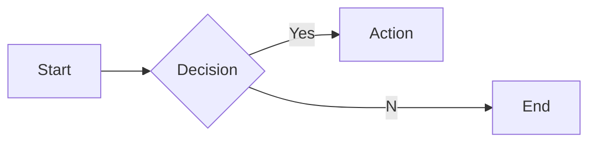
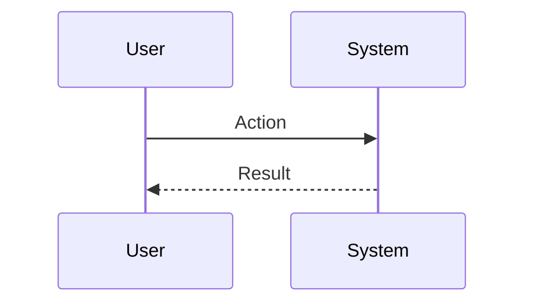

# Interview Questions: corp_counsel (ROLE)

This document contains 100 interview questions tailored for the corp_counsel role. The questions are designed to assess technical skills, soft skills, and cultural fit.

---

## 1. Risk Mitigation

**Scenario:** Contract negotiation.

**Question:** What are the most critical clauses in a SaaS contract?

**Key Concepts:** `Contracts`, `Risk`

### Candidate Response Paths
*   **Junior**: Price.
*   **Senior**: Indemnification, Limitation of Liability, and SLA.

---

## 2. Data Privacy

**Scenario:** GDPR/CCPA.

**Question:** How do we ensure compliance with GDPR?

**Key Concepts:** `Compliance`, `Privacy`

### Candidate Response Paths
*   **Junior**: Cookie banner.
*   **Senior**: Data mapping, Right to be forgotten processes, and DPA.

---

## 3. IP

**Scenario:** Trademarks.

**Question:** How do you protect the company's IP?

**Key Concepts:** `IP`, `Strategy`

### Candidate Response Paths
*   **Junior**: File patents.
*   **Senior**: Trade secrets, copyright, trademarks, and employee invention assignment agreements.

---

## 4. Litigation

**Scenario:** Lawsuit.

**Question:** How do you manage potential litigation?

**Key Concepts:** `Litigation`, `Risk`

### Candidate Response Paths
*   **Junior**: Settle.
*   **Senior**: Early assessment, document preservation, and outside counsel management.

---

## 5. Compliance

**Scenario:** Regulatory.

**Question:** How do you keep the company compliant with evolving regulations?

**Key Concepts:** `Compliance`, `Ops`

### Candidate Response Paths
*   **Junior**: Read news.
*   **Senior**: Compliance calendar, audits, and training programs.

---

## 6. Sales Support

**Scenario:** Deal velocity.

**Question:** How can Legal help Sales close deals faster?

**Key Concepts:** `Efficiency`, `Sales`

### Candidate Response Paths
*   **Junior**: Review faster.
*   **Senior**: Standard templates, playbooks for negotiation, and self-service for NDA.

---

## 7. Employment Law

**Scenario:** Termination.

**Question:** What are the legal risks in terminating an employee?

| Metric | Target | Status |
|---|---|---|
| KPI 1 | 100% | Green |
| KPI 2 | < 5% | Yellow |

**Key Concepts:** `Employment`, `Risk`

### Candidate Response Paths
*   **Junior**: None if at-will.
*   **Senior**: Discrimination claims, retaliation, and ensuring documentation is solid.

---

## 8. Corporate Governance

**Scenario:** Board minutes.

**Question:** Why is corporate governance important?

**Key Concepts:** `Governance`, `Compliance`

### Candidate Response Paths
*   **Junior**: It's a rule.
*   **Senior**: Fiduciary duty, investor confidence, and preventing liability.

---

## 9. Ethics

**Scenario:** Conflict of interest.

**Question:** How do you handle a conflict of interest?

**Key Concepts:** `Ethics`, `Policy`

### Candidate Response Paths
*   **Junior**: Ignore it.
*   **Senior**: Disclosure, recusal, and following policy.

---

## 10. Open Source

**Scenario:** Licensing.

**Question:** What are the risks of using open source software?

**Key Concepts:** `Licensing`, `IP`

### Candidate Response Paths
*   **Junior**: It's free.
*   **Senior**: Viral licenses (GPL), security vulnerabilities, and patent risks.

---

## 11. Conflict Resolution

**Scenario:** Disagreement with a peer.

**Question:** Tell me about a time you had a significant disagreement with a colleague. How did you resolve it?

**Key Concepts:** `Communication`, `Soft Skills`

### Candidate Response Paths
*   **Junior**: I told them I was right.
*   **Senior**: I listened to their perspective, found common ground, and we compromised.

---

## 12. Failure Handling

**Scenario:** A project went wrong.

**Question:** Describe a time you failed. What happened and what did you learn?

**Key Concepts:** `Growth Mindset`, `Resilience`

### Candidate Response Paths
*   **Junior**: I tried hard but it failed.
*   **Senior**: I analyzed the root cause, implemented a fix, and shared the learning.

---

## 13. Prioritization

**Scenario:** Too many tasks.

**Question:** How do you prioritize when you have multiple conflicting deadlines?

**Key Concepts:** `Time Management`, `Organization`

### Candidate Response Paths
*   **Junior**: I work longer hours.
*   **Senior**: I communicate with stakeholders to adjust expectations and focus on high-impact tasks.

---

## 14. Adaptability

**Scenario:** Changing requirements.

**Question:** How do you handle sudden changes in project scope or direction?

| Metric | Target | Status |
|---|---|---|
| KPI 1 | 100% | Green |
| KPI 2 | < 5% | Yellow |

**Key Concepts:** `Agility`, `Flexibility`

### Candidate Response Paths
*   **Junior**: I get frustrated but do it.
*   **Senior**: I assess the impact, communicate risks, and pivot quickly.

---

## 15. Communication

**Scenario:** Explaining complex topics.

**Question:** Describe a time you had to explain a complex technical/business concept to a non-expert.

**Key Concepts:** `Clarity`, `Empathy`

### Candidate Response Paths
*   **Junior**: I just said it simpler.
*   **Senior**: I used analogies and checked for understanding throughout.

---

## 16. Teamwork

**Scenario:** Collaborating with difficult personalities.

**Question:** How do you handle working with someone who is difficult to work with?

**Key Concepts:** `Collaboration`, `EQ`

### Candidate Response Paths
*   **Junior**: I avoid them.
*   **Senior**: I try to understand their motivations and find a way to work together effectively.

---

## 17. Innovation

**Scenario:** Improving a process.

**Question:** Tell me about a time you improved a process or workflow.

**Key Concepts:** `Innovation`, `Efficiency`

### Candidate Response Paths
*   **Junior**: I followed the rules.
*   **Senior**: I identified a bottleneck, proposed a solution, and measured the improvement.

---

## 18. Feedback

**Scenario:** Receiving constructive criticism.

**Question:** Tell me about a time you received difficult feedback. How did you react?

**Key Concepts:** `Self-awareness`, `Growth`

### Candidate Response Paths
*   **Junior**: I got defensive.
*   **Senior**: I listened, asked for examples, and worked on a plan to improve.

---

## 19. Leadership

**Scenario:** Leading without authority.

**Question:** Describe a time you demonstrated leadership when you weren't the formal manager.

**Key Concepts:** `Leadership`, `Influence`

### Candidate Response Paths
*   **Junior**: I told people what to do.
*   **Senior**: I rallied the team around a goal and supported them to achieve it.

---

## 20. Decision Making

**Scenario:** Incomplete information.

**Question:** How do you make decisions when you don't have all the data?

**Key Concepts:** `Judgment`, `Risk Mgmt`

### Candidate Response Paths
*   **Junior**: I wait for all data.
*   **Senior**: I assess the risk, make a call based on available info, and adjust as needed.

---

## 21. Scaling Open Source

**Scenario:** Growth.

**Question:** How do you scale Open Source as the company grows?

| Metric | Target | Status |
|---|---|---|
| KPI 1 | 100% | Green |
| KPI 2 | < 5% | Yellow |

**Key Concepts:** `Open Source`, `Scale`

### Candidate Response Paths
*   **Junior**: Hire more people.
*   **Senior**: Process automation, documentation, and leverage.

---

## 22. Teaching Mergers

**Scenario:** Mentorship.

**Question:** How would you teach Mergers to a junior team member?

**Key Concepts:** `Mergers`, `Mentorship`

### Candidate Response Paths
*   **Junior**: Send them a link.
*   **Senior**: Structured learning path and hands-on practice.

---

## 23. Start vs Scale for Regulations

**Scenario:** Context.

**Question:** How does your approach to Regulations differ in a startup vs a large corp?

**Key Concepts:** `Regulations`, `Context`

### Candidate Response Paths
*   **Junior**: It's the same.
*   **Senior**: Speed/Chaos vs Process/Stability.

---

## 24. Ethics in Contracts

**Scenario:** Ethics.

**Question:** What are the ethical considerations regarding Contracts?

**Key Concepts:** `Contracts`, `Ethics`

### Candidate Response Paths
*   **Junior**: Be nice.
*   **Senior**: Privacy, bias, and societal impact.

---

## 25. Ethics in IP

**Scenario:** Ethics.

**Question:** What are the ethical considerations regarding IP?

**Key Concepts:** `IP`, `Ethics`

### Candidate Response Paths
*   **Junior**: Be nice.
*   **Senior**: Privacy, bias, and societal impact.

---

## 26. Metrics for Employment Law

**Scenario:** Measurement.

**Question:** How do you measure success in Employment Law?

**Key Concepts:** `Employment Law`, `Analytics`

### Candidate Response Paths
*   **Junior**: I guess.
*   **Senior**: Specific KPIs and leading/lagging indicators.

---

## 27. Mistakes in Negotiation

**Scenario:** Learning.

**Question:** What common mistakes do people make with Negotiation?

**Key Concepts:** `Negotiation`, `Experience`

### Candidate Response Paths
*   **Junior**: Doing it wrong.
*   **Senior**: Subtle pitfalls and how to avoid them.

---

## 28. Challenges in Open Source

**Scenario:** Problem Solving.

**Question:** What are the biggest challenges you've faced regarding Open Source?

| Metric | Target | Status |
|---|---|---|
| KPI 1 | 100% | Green |
| KPI 2 | < 5% | Yellow |

**Key Concepts:** `Open Source`, `Problem Solving`

### Candidate Response Paths
*   **Junior**: It was hard.
*   **Senior**: Specific examples of obstacles and strategies to overcome them.

---

## 29. Negotiation Best Practices

**Scenario:** Standardization.

**Question:** What are the industry best practices for Negotiation?

**Key Concepts:** `Negotiation`, `Standards`

### Candidate Response Paths
*   **Junior**: List a few.
*   **Senior**: Discusses why they are best practices and when to break them.

---

## 30. Collaboration in Employment Law

**Scenario:** Teamwork.

**Question:** How does Employment Law require cross-functional collaboration?

**Key Concepts:** `Employment Law`, `Collaboration`

### Candidate Response Paths
*   **Junior**: I talk to people.
*   **Senior**: Alignment with other depts and shared goals.

---

## 31. Start vs Scale for Compliance

**Scenario:** Context.

**Question:** How does your approach to Compliance differ in a startup vs a large corp?

**Key Concepts:** `Compliance`, `Context`

### Candidate Response Paths
*   **Junior**: It's the same.
*   **Senior**: Speed/Chaos vs Process/Stability.

---

## 32. Metrics for Open Source

**Scenario:** Measurement.

**Question:** How do you measure success in Open Source?

**Key Concepts:** `Open Source`, `Analytics`

### Candidate Response Paths
*   **Junior**: I guess.
*   **Senior**: Specific KPIs and leading/lagging indicators.

---

## 33. Metrics for Patents

**Scenario:** Measurement.

**Question:** How do you measure success in Patents?

**Key Concepts:** `Patents`, `Analytics`

### Candidate Response Paths
*   **Junior**: I guess.
*   **Senior**: Specific KPIs and leading/lagging indicators.

---

## 34. Teaching Open Source

**Scenario:** Mentorship.

**Question:** How would you teach Open Source to a junior team member?

**Key Concepts:** `Open Source`, `Mentorship`

### Candidate Response Paths
*   **Junior**: Send them a link.
*   **Senior**: Structured learning path and hands-on practice.

---

## 35. Mistakes in Patents

**Scenario:** Learning.

**Question:** What common mistakes do people make with Patents?

| Metric | Target | Status |
|---|---|---|
| KPI 1 | 100% | Green |
| KPI 2 | < 5% | Yellow |

**Key Concepts:** `Patents`, `Experience`

### Candidate Response Paths
*   **Junior**: Doing it wrong.
*   **Senior**: Subtle pitfalls and how to avoid them.

---

## 36. Future of Trademarks

**Scenario:** Trends.

**Question:** Where do you see Trademarks heading in the next 5 years?

**Key Concepts:** `Trademarks`, `Vision`

### Candidate Response Paths
*   **Junior**: It will get better.
*   **Senior**: Emerging trends, AI impact, and market shifts.

---

## 37. Tooling: Negotiation

**Scenario:** Proficiency.

**Question:** How do you utilize Negotiation to improve efficiency?

**Key Concepts:** `Negotiation`, `Productivity`

### Candidate Response Paths
*   **Junior**: I use it daily.
*   **Senior**: Advanced features and automation.

---

## 38. Start vs Scale for Patents

**Scenario:** Context.

**Question:** How does your approach to Patents differ in a startup vs a large corp?

**Key Concepts:** `Patents`, `Context`

### Candidate Response Paths
*   **Junior**: It's the same.
*   **Senior**: Speed/Chaos vs Process/Stability.

---

## 39. Deep Dive: Mergers

**Scenario:** Assessing depth in Mergers.

**Question:** Can you explain Mergers in detail and how you have applied it in your past role?

**Key Concepts:** `Mergers`, `Experience`

### Candidate Response Paths
*   **Junior**: Basic definition.
*   **Senior**: Deep practical application and nuances.

---

## 40. Ethics in Litigation

**Scenario:** Ethics.

**Question:** What are the ethical considerations regarding Litigation?

**Key Concepts:** `Litigation`, `Ethics`

### Candidate Response Paths
*   **Junior**: Be nice.
*   **Senior**: Privacy, bias, and societal impact.

---

## 41. Metrics for Corporate Governance

**Scenario:** Measurement.

**Question:** How do you measure success in Corporate Governance?

**Key Concepts:** `Corporate Governance`, `Analytics`

### Candidate Response Paths
*   **Junior**: I guess.
*   **Senior**: Specific KPIs and leading/lagging indicators.

---

## 42. Start vs Scale for Ethics

**Scenario:** Context.

**Question:** How does your approach to Ethics differ in a startup vs a large corp?

| Metric | Target | Status |
|---|---|---|
| KPI 1 | 100% | Green |
| KPI 2 | < 5% | Yellow |

**Key Concepts:** `Ethics`, `Context`

### Candidate Response Paths
*   **Junior**: It's the same.
*   **Senior**: Speed/Chaos vs Process/Stability.

---

## 43. Challenges in Negotiation

**Scenario:** Problem Solving.

**Question:** What are the biggest challenges you've faced regarding Negotiation?

**Key Concepts:** `Negotiation`, `Problem Solving`

### Candidate Response Paths
*   **Junior**: It was hard.
*   **Senior**: Specific examples of obstacles and strategies to overcome them.

---

## 44. Metrics for Compliance

**Scenario:** Measurement.

**Question:** How do you measure success in Compliance?

**Key Concepts:** `Compliance`, `Analytics`

### Candidate Response Paths
*   **Junior**: I guess.
*   **Senior**: Specific KPIs and leading/lagging indicators.

---

## 45. Mistakes in Regulations

**Scenario:** Learning.

**Question:** What common mistakes do people make with Regulations?

**Key Concepts:** `Regulations`, `Experience`

### Candidate Response Paths
*   **Junior**: Doing it wrong.
*   **Senior**: Subtle pitfalls and how to avoid them.

---

## 46. Teaching Negotiation

**Scenario:** Mentorship.

**Question:** How would you teach Negotiation to a junior team member?

**Key Concepts:** `Negotiation`, `Mentorship`

### Candidate Response Paths
*   **Junior**: Send them a link.
*   **Senior**: Structured learning path and hands-on practice.

---

## 47. Challenges in Compliance

**Scenario:** Problem Solving.

**Question:** What are the biggest challenges you've faced regarding Compliance?

**Key Concepts:** `Compliance`, `Problem Solving`

### Candidate Response Paths
*   **Junior**: It was hard.
*   **Senior**: Specific examples of obstacles and strategies to overcome them.

---

## 48. Ethics in Employment Law

**Scenario:** Ethics.

**Question:** What are the ethical considerations regarding Employment Law?

**Key Concepts:** `Employment Law`, `Ethics`

### Candidate Response Paths
*   **Junior**: Be nice.
*   **Senior**: Privacy, bias, and societal impact.

---

## 49. Future of Patents

**Scenario:** Trends.

**Question:** Where do you see Patents heading in the next 5 years?

| Metric | Target | Status |
|---|---|---|
| KPI 1 | 100% | Green |
| KPI 2 | < 5% | Yellow |

**Key Concepts:** `Patents`, `Vision`

### Candidate Response Paths
*   **Junior**: It will get better.
*   **Senior**: Emerging trends, AI impact, and market shifts.

---

## 50. Tooling: Employment Law

**Scenario:** Proficiency.

**Question:** How do you utilize Employment Law to improve efficiency?

**Key Concepts:** `Employment Law`, `Productivity`

### Candidate Response Paths
*   **Junior**: I use it daily.
*   **Senior**: Advanced features and automation.

---

## 51. Metrics for Mergers

**Scenario:** Measurement.

**Question:** How do you measure success in Mergers?

**Key Concepts:** `Mergers`, `Analytics`

### Candidate Response Paths
*   **Junior**: I guess.
*   **Senior**: Specific KPIs and leading/lagging indicators.

---

## 52. Deep Dive: IP

**Scenario:** Assessing depth in IP.

**Question:** Can you explain IP in detail and how you have applied it in your past role?

**Key Concepts:** `IP`, `Experience`

### Candidate Response Paths
*   **Junior**: Basic definition.
*   **Senior**: Deep practical application and nuances.

---

## 53. Deep Dive: Contracts

**Scenario:** Assessing depth in Contracts.

**Question:** Can you explain Contracts in detail and how you have applied it in your past role?

**Key Concepts:** `Contracts`, `Experience`

### Candidate Response Paths
*   **Junior**: Basic definition.
*   **Senior**: Deep practical application and nuances.

---

## 54. Challenges in Trademarks

**Scenario:** Problem Solving.

**Question:** What are the biggest challenges you've faced regarding Trademarks?

**Key Concepts:** `Trademarks`, `Problem Solving`

### Candidate Response Paths
*   **Junior**: It was hard.
*   **Senior**: Specific examples of obstacles and strategies to overcome them.

---

## 55. Teaching Litigation

**Scenario:** Mentorship.

**Question:** How would you teach Litigation to a junior team member?

**Key Concepts:** `Litigation`, `Mentorship`

### Candidate Response Paths
*   **Junior**: Send them a link.
*   **Senior**: Structured learning path and hands-on practice.

---

## 56. Start vs Scale for Privacy

**Scenario:** Context.

**Question:** How does your approach to Privacy differ in a startup vs a large corp?

| Metric | Target | Status |
|---|---|---|
| KPI 1 | 100% | Green |
| KPI 2 | < 5% | Yellow |

**Key Concepts:** `Privacy`, `Context`

### Candidate Response Paths
*   **Junior**: It's the same.
*   **Senior**: Speed/Chaos vs Process/Stability.

---

## 57. Collaboration in Trademarks

**Scenario:** Teamwork.

**Question:** How does Trademarks require cross-functional collaboration?

**Key Concepts:** `Trademarks`, `Collaboration`

### Candidate Response Paths
*   **Junior**: I talk to people.
*   **Senior**: Alignment with other depts and shared goals.

---

## 58. Ethics in Mergers

**Scenario:** Ethics.

**Question:** What are the ethical considerations regarding Mergers?

**Key Concepts:** `Mergers`, `Ethics`

### Candidate Response Paths
*   **Junior**: Be nice.
*   **Senior**: Privacy, bias, and societal impact.

---

## 59. Mistakes in Ethics

**Scenario:** Learning.

**Question:** What common mistakes do people make with Ethics?

**Key Concepts:** `Ethics`, `Experience`

### Candidate Response Paths
*   **Junior**: Doing it wrong.
*   **Senior**: Subtle pitfalls and how to avoid them.

---

## 60. Employment Law Best Practices

**Scenario:** Standardization.

**Question:** What are the industry best practices for Employment Law?

**Key Concepts:** `Employment Law`, `Standards`

### Candidate Response Paths
*   **Junior**: List a few.
*   **Senior**: Discusses why they are best practices and when to break them.

---

## 61. Future of IP

**Scenario:** Trends.

**Question:** Where do you see IP heading in the next 5 years?

**Key Concepts:** `IP`, `Vision`

### Candidate Response Paths
*   **Junior**: It will get better.
*   **Senior**: Emerging trends, AI impact, and market shifts.

---

## 62. Tooling: Regulations

**Scenario:** Proficiency.

**Question:** How do you utilize Regulations to improve efficiency?

**Key Concepts:** `Regulations`, `Productivity`

### Candidate Response Paths
*   **Junior**: I use it daily.
*   **Senior**: Advanced features and automation.

---

## 63. Scaling Corporate Governance

**Scenario:** Growth.

**Question:** How do you scale Corporate Governance as the company grows?

| Metric | Target | Status |
|---|---|---|
| KPI 1 | 100% | Green |
| KPI 2 | < 5% | Yellow |

**Key Concepts:** `Corporate Governance`, `Scale`

### Candidate Response Paths
*   **Junior**: Hire more people.
*   **Senior**: Process automation, documentation, and leverage.

---

## 64. Ethics in Open Source

**Scenario:** Ethics.

**Question:** What are the ethical considerations regarding Open Source?

**Key Concepts:** `Open Source`, `Ethics`

### Candidate Response Paths
*   **Junior**: Be nice.
*   **Senior**: Privacy, bias, and societal impact.

---

## 65. Challenges in Corporate Governance

**Scenario:** Problem Solving.

**Question:** What are the biggest challenges you've faced regarding Corporate Governance?

**Key Concepts:** `Corporate Governance`, `Problem Solving`

### Candidate Response Paths
*   **Junior**: It was hard.
*   **Senior**: Specific examples of obstacles and strategies to overcome them.

---

## 66. Scaling Litigation

**Scenario:** Growth.

**Question:** How do you scale Litigation as the company grows?

**Key Concepts:** `Litigation`, `Scale`

### Candidate Response Paths
*   **Junior**: Hire more people.
*   **Senior**: Process automation, documentation, and leverage.

---

## 67. Collaboration in Open Source

**Scenario:** Teamwork.

**Question:** How does Open Source require cross-functional collaboration?

**Key Concepts:** `Open Source`, `Collaboration`

### Candidate Response Paths
*   **Junior**: I talk to people.
*   **Senior**: Alignment with other depts and shared goals.

---

## 68. Collaboration in Ethics

**Scenario:** Teamwork.

**Question:** How does Ethics require cross-functional collaboration?

**Key Concepts:** `Ethics`, `Collaboration`

### Candidate Response Paths
*   **Junior**: I talk to people.
*   **Senior**: Alignment with other depts and shared goals.

---

## 69. Mistakes in Litigation

**Scenario:** Learning.

**Question:** What common mistakes do people make with Litigation?

**Key Concepts:** `Litigation`, `Experience`

### Candidate Response Paths
*   **Junior**: Doing it wrong.
*   **Senior**: Subtle pitfalls and how to avoid them.

---

## 70. Start vs Scale for Data Security

**Scenario:** Context.

**Question:** How does your approach to Data Security differ in a startup vs a large corp?

| Metric | Target | Status |
|---|---|---|
| KPI 1 | 100% | Green |
| KPI 2 | < 5% | Yellow |

**Key Concepts:** `Data Security`, `Context`

### Candidate Response Paths
*   **Junior**: It's the same.
*   **Senior**: Speed/Chaos vs Process/Stability.

---

## 71. Scaling Employment Law

**Scenario:** Growth.

**Question:** How do you scale Employment Law as the company grows?

**Key Concepts:** `Employment Law`, `Scale`

### Candidate Response Paths
*   **Junior**: Hire more people.
*   **Senior**: Process automation, documentation, and leverage.

---

## 72. Future of Ethics

**Scenario:** Trends.

**Question:** Where do you see Ethics heading in the next 5 years?

**Key Concepts:** `Ethics`, `Vision`

### Candidate Response Paths
*   **Junior**: It will get better.
*   **Senior**: Emerging trends, AI impact, and market shifts.

---

## 73. Deep Dive: Corporate Governance

**Scenario:** Assessing depth in Corporate Governance.

**Question:** Can you explain Corporate Governance in detail and how you have applied it in your past role?

**Key Concepts:** `Corporate Governance`, `Experience`

### Candidate Response Paths
*   **Junior**: Basic definition.
*   **Senior**: Deep practical application and nuances.

---

## 74. Scaling Ethics

**Scenario:** Growth.

**Question:** How do you scale Ethics as the company grows?

**Key Concepts:** `Ethics`, `Scale`

### Candidate Response Paths
*   **Junior**: Hire more people.
*   **Senior**: Process automation, documentation, and leverage.

---

## 75. Mistakes in Employment Law

**Scenario:** Learning.

**Question:** What common mistakes do people make with Employment Law?

**Key Concepts:** `Employment Law`, `Experience`

### Candidate Response Paths
*   **Junior**: Doing it wrong.
*   **Senior**: Subtle pitfalls and how to avoid them.

---

## 76. Challenges in Employment Law

**Scenario:** Problem Solving.

**Question:** What are the biggest challenges you've faced regarding Employment Law?

**Key Concepts:** `Employment Law`, `Problem Solving`

### Candidate Response Paths
*   **Junior**: It was hard.
*   **Senior**: Specific examples of obstacles and strategies to overcome them.

---

## 77. Metrics for Privacy

**Scenario:** Measurement.

**Question:** How do you measure success in Privacy?

| Metric | Target | Status |
|---|---|---|
| KPI 1 | 100% | Green |
| KPI 2 | < 5% | Yellow |

**Key Concepts:** `Privacy`, `Analytics`

### Candidate Response Paths
*   **Junior**: I guess.
*   **Senior**: Specific KPIs and leading/lagging indicators.

---

## 78. Future of Data Security

**Scenario:** Trends.

**Question:** Where do you see Data Security heading in the next 5 years?

**Key Concepts:** `Data Security`, `Vision`

### Candidate Response Paths
*   **Junior**: It will get better.
*   **Senior**: Emerging trends, AI impact, and market shifts.

---

## 79. Mistakes in Corporate Governance

**Scenario:** Learning.

**Question:** What common mistakes do people make with Corporate Governance?

**Key Concepts:** `Corporate Governance`, `Experience`

### Candidate Response Paths
*   **Junior**: Doing it wrong.
*   **Senior**: Subtle pitfalls and how to avoid them.

---

## 80. Deep Dive: Employment Law

**Scenario:** Assessing depth in Employment Law.

**Question:** Can you explain Employment Law in detail and how you have applied it in your past role?

**Key Concepts:** `Employment Law`, `Experience`

### Candidate Response Paths
*   **Junior**: Basic definition.
*   **Senior**: Deep practical application and nuances.

---

## 81. Tooling: Corporate Governance

**Scenario:** Proficiency.

**Question:** How do you utilize Corporate Governance to improve efficiency?

**Key Concepts:** `Corporate Governance`, `Productivity`

### Candidate Response Paths
*   **Junior**: I use it daily.
*   **Senior**: Advanced features and automation.

---

## 82. Teaching Data Security

**Scenario:** Mentorship.

**Question:** How would you teach Data Security to a junior team member?

**Key Concepts:** `Data Security`, `Mentorship`

### Candidate Response Paths
*   **Junior**: Send them a link.
*   **Senior**: Structured learning path and hands-on practice.

---

## 83. Metrics for Contracts

**Scenario:** Measurement.

**Question:** How do you measure success in Contracts?

**Key Concepts:** `Contracts`, `Analytics`

### Candidate Response Paths
*   **Junior**: I guess.
*   **Senior**: Specific KPIs and leading/lagging indicators.

---

## 84. Tooling: Data Security

**Scenario:** Proficiency.

**Question:** How do you utilize Data Security to improve efficiency?

| Metric | Target | Status |
|---|---|---|
| KPI 1 | 100% | Green |
| KPI 2 | < 5% | Yellow |

**Key Concepts:** `Data Security`, `Productivity`

### Candidate Response Paths
*   **Junior**: I use it daily.
*   **Senior**: Advanced features and automation.

---

## 85. Tooling: Privacy

**Scenario:** Proficiency.

**Question:** How do you utilize Privacy to improve efficiency?

**Key Concepts:** `Privacy`, `Productivity`

### Candidate Response Paths
*   **Junior**: I use it daily.
*   **Senior**: Advanced features and automation.

---

## 86. Challenges in Patents

**Scenario:** Problem Solving.

**Question:** What are the biggest challenges you've faced regarding Patents?

**Key Concepts:** `Patents`, `Problem Solving`

### Candidate Response Paths
*   **Junior**: It was hard.
*   **Senior**: Specific examples of obstacles and strategies to overcome them.

---

## 87. Deep Dive: Privacy

**Scenario:** Assessing depth in Privacy.

**Question:** Can you explain Privacy in detail and how you have applied it in your past role?

**Key Concepts:** `Privacy`, `Experience`

### Candidate Response Paths
*   **Junior**: Basic definition.
*   **Senior**: Deep practical application and nuances.

---

## 88. Privacy Best Practices

**Scenario:** Standardization.

**Question:** What are the industry best practices for Privacy?

**Key Concepts:** `Privacy`, `Standards`

### Candidate Response Paths
*   **Junior**: List a few.
*   **Senior**: Discusses why they are best practices and when to break them.

---

## 89. Tooling: Litigation

**Scenario:** Proficiency.

**Question:** How do you utilize Litigation to improve efficiency?

**Key Concepts:** `Litigation`, `Productivity`

### Candidate Response Paths
*   **Junior**: I use it daily.
*   **Senior**: Advanced features and automation.

---

## 90. Metrics for Data Security

**Scenario:** Measurement.

**Question:** How do you measure success in Data Security?

**Key Concepts:** `Data Security`, `Analytics`

### Candidate Response Paths
*   **Junior**: I guess.
*   **Senior**: Specific KPIs and leading/lagging indicators.

---

## 91. Start vs Scale for Mergers

**Scenario:** Context.

**Question:** How does your approach to Mergers differ in a startup vs a large corp?

| Metric | Target | Status |
|---|---|---|
| KPI 1 | 100% | Green |
| KPI 2 | < 5% | Yellow |

**Key Concepts:** `Mergers`, `Context`

### Candidate Response Paths
*   **Junior**: It's the same.
*   **Senior**: Speed/Chaos vs Process/Stability.

---

## 92. Deep Dive: Negotiation

**Scenario:** Assessing depth in Negotiation.

**Question:** Can you explain Negotiation in detail and how you have applied it in your past role?

**Key Concepts:** `Negotiation`, `Experience`

### Candidate Response Paths
*   **Junior**: Basic definition.
*   **Senior**: Deep practical application and nuances.

---

## 93. Collaboration in Negotiation

**Scenario:** Teamwork.

**Question:** How does Negotiation require cross-functional collaboration?

**Key Concepts:** `Negotiation`, `Collaboration`

### Candidate Response Paths
*   **Junior**: I talk to people.
*   **Senior**: Alignment with other depts and shared goals.

---

## 94. Mergers Best Practices

**Scenario:** Standardization.

**Question:** What are the industry best practices for Mergers?

**Key Concepts:** `Mergers`, `Standards`

### Candidate Response Paths
*   **Junior**: List a few.
*   **Senior**: Discusses why they are best practices and when to break them.

---

## 95. Ethics in Patents

**Scenario:** Ethics.

**Question:** What are the ethical considerations regarding Patents?

**Key Concepts:** `Patents`, `Ethics`

### Candidate Response Paths
*   **Junior**: Be nice.
*   **Senior**: Privacy, bias, and societal impact.

---

## 96. Metrics for Litigation

**Scenario:** Measurement.

**Question:** How do you measure success in Litigation?

**Key Concepts:** `Litigation`, `Analytics`

### Candidate Response Paths
*   **Junior**: I guess.
*   **Senior**: Specific KPIs and leading/lagging indicators.

---

## 97. Start vs Scale for Corporate Governance

**Scenario:** Context.

**Question:** How does your approach to Corporate Governance differ in a startup vs a large corp?

**Key Concepts:** `Corporate Governance`, `Context`

### Candidate Response Paths
*   **Junior**: It's the same.
*   **Senior**: Speed/Chaos vs Process/Stability.

---

## 98. Challenges in Regulations

**Scenario:** Problem Solving.

**Question:** What are the biggest challenges you've faced regarding Regulations?

| Metric | Target | Status |
|---|---|---|
| KPI 1 | 100% | Green |
| KPI 2 | < 5% | Yellow |

**Key Concepts:** `Regulations`, `Problem Solving`

### Candidate Response Paths
*   **Junior**: It was hard.
*   **Senior**: Specific examples of obstacles and strategies to overcome them.

---

## 99. Challenges in Litigation

**Scenario:** Problem Solving.

**Question:** What are the biggest challenges you've faced regarding Litigation?

**Key Concepts:** `Litigation`, `Problem Solving`

### Candidate Response Paths
*   **Junior**: It was hard.
*   **Senior**: Specific examples of obstacles and strategies to overcome them.

---

## 100. Deep Dive: Litigation

**Scenario:** Assessing depth in Litigation.

**Question:** Can you explain Litigation in detail and how you have applied it in your past role?

**Key Concepts:** `Litigation`, `Experience`

### Candidate Response Paths
*   **Junior**: Basic definition.
*   **Senior**: Deep practical application and nuances.

---
