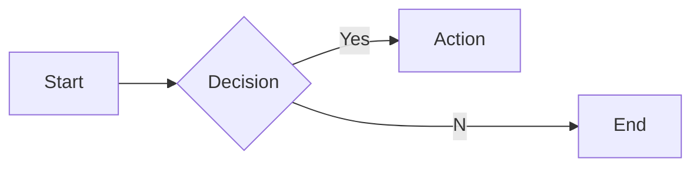
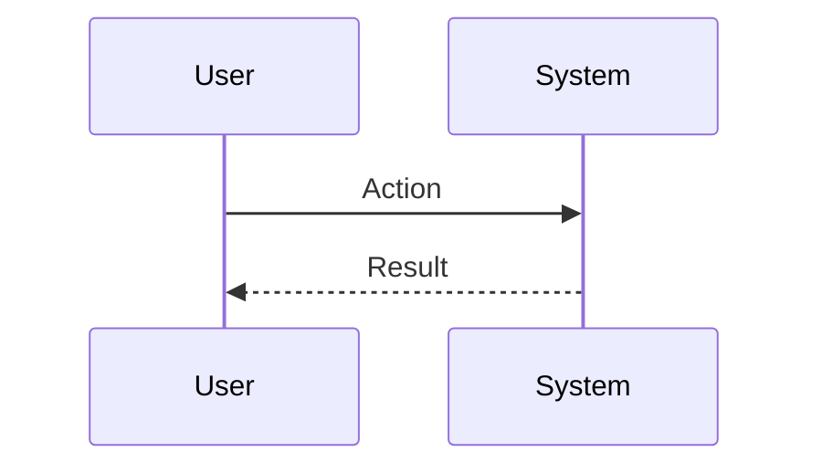

# Interview Questions: director_of_finance (ROLE)

This document contains 100 interview questions tailored for the director_of_finance role. The questions are designed to assess technical skills, soft skills, and cultural fit.

---

## 1. Cash Flow vs Profit

**Scenario:** Startup metrics.

**Question:** Why is Cash Flow more important than Profit for a startup?

**Key Concepts:** `Accounting`, `Strategy`

### Candidate Response Paths
*   **Junior**: Profit is king.
*   **Senior**: You can be profitable on paper but die if you run out of cash (runway).

---

## 2. Budgeting Process

**Scenario:** Zero-based budgeting.

**Question:** Describe your approach to the annual budgeting process.

**Key Concepts:** `Planning`, `FP&A`

### Candidate Response Paths
*   **Junior**: Copy last year.
*   **Senior**: Bottom-up build combined with top-down targets.

---

## 3. Financial Modeling

**Scenario:** Forecast.

**Question:** How do you build a robust financial model?

**Key Concepts:** `Modeling`, `Excel`

### Candidate Response Paths
*   **Junior**: Assume growth.
*   **Senior**: Driver-based modeling, sensitivity analysis, and scenario planning.

---

## 4. Metrics

**Scenario:** SaaS.

**Question:** What are the key SaaS metrics you track?

**Key Concepts:** `SaaS`, `Metrics`

### Candidate Response Paths
*   **Junior**: Revenue.
*   **Senior**: ARR, MRR, Churn, CAC, LTV, Net Retention, Rule of 40.

---

## 5. Cost Control

**Scenario:** OpEx.

**Question:** How do you identify cost saving opportunities?

**Key Concepts:** `Efficiency`, `Analysis`

### Candidate Response Paths
*   **Junior**: Stop buying coffee.
*   **Senior**: Vendor analysis, cloud spend optimization, and process efficiency.

---

## 6. Compliance

**Scenario:** Audit.

**Question:** How do you prepare for a financial audit?

**Key Concepts:** `Audit`, `Compliance`

### Candidate Response Paths
*   **Junior**: Clean up files.
*   **Senior**: Maintaining clean books year-round, documentation of controls, and reconciliation.

---

## 7. Risk

**Scenario:** Market downturn.

**Question:** How do you hedge against financial risk?

| Metric | Target | Status |
|---|---|---|
| KPI 1 | 100% | Green |
| KPI 2 | < 5% | Yellow |

**Key Concepts:** `Risk`, `Strategy`

### Candidate Response Paths
*   **Junior**: Save money.
*   **Senior**: Diversification, insurance, and maintaining healthy cash reserves.

---

## 8. Reporting

**Scenario:** Board deck.

**Question:** How do you present complex financial data to the board?

**Key Concepts:** `Communication`, `Reporting`

### Candidate Response Paths
*   **Junior**: Spreadsheets.
*   **Senior**: Key highlights, visualizations, and narrative around the numbers.

---

## 9. Fundraising

**Scenario:** Series A/B.

**Question:** What is Finance's role in fundraising?

**Key Concepts:** `Fundraising`, `Due Diligence`

### Candidate Response Paths
*   **Junior**: Send bank statements.
*   **Senior**: Data room prep, financial storytelling, and due diligence management.

---

## 10. Systems

**Scenario:** ERP.

**Question:** When is the right time to switch from QuickBooks to NetSuite?

**Key Concepts:** `Systems`, `Scale`

### Candidate Response Paths
*   **Junior**: When we have money.
*   **Senior**: When complexity (multi-entity, rev rec) outgrows the current system capabilities.

---

## 11. Conflict Resolution

**Scenario:** Disagreement with a peer.

**Question:** Tell me about a time you had a significant disagreement with a colleague. How did you resolve it?

**Key Concepts:** `Communication`, `Soft Skills`

### Candidate Response Paths
*   **Junior**: I told them I was right.
*   **Senior**: I listened to their perspective, found common ground, and we compromised.

---

## 12. Failure Handling

**Scenario:** A project went wrong.

**Question:** Describe a time you failed. What happened and what did you learn?

**Key Concepts:** `Growth Mindset`, `Resilience`

### Candidate Response Paths
*   **Junior**: I tried hard but it failed.
*   **Senior**: I analyzed the root cause, implemented a fix, and shared the learning.

---

## 13. Prioritization

**Scenario:** Too many tasks.

**Question:** How do you prioritize when you have multiple conflicting deadlines?

**Key Concepts:** `Time Management`, `Organization`

### Candidate Response Paths
*   **Junior**: I work longer hours.
*   **Senior**: I communicate with stakeholders to adjust expectations and focus on high-impact tasks.

---

## 14. Adaptability

**Scenario:** Changing requirements.

**Question:** How do you handle sudden changes in project scope or direction?

| Metric | Target | Status |
|---|---|---|
| KPI 1 | 100% | Green |
| KPI 2 | < 5% | Yellow |

**Key Concepts:** `Agility`, `Flexibility`

### Candidate Response Paths
*   **Junior**: I get frustrated but do it.
*   **Senior**: I assess the impact, communicate risks, and pivot quickly.

---

## 15. Communication

**Scenario:** Explaining complex topics.

**Question:** Describe a time you had to explain a complex technical/business concept to a non-expert.

**Key Concepts:** `Clarity`, `Empathy`

### Candidate Response Paths
*   **Junior**: I just said it simpler.
*   **Senior**: I used analogies and checked for understanding throughout.

---

## 16. Teamwork

**Scenario:** Collaborating with difficult personalities.

**Question:** How do you handle working with someone who is difficult to work with?

**Key Concepts:** `Collaboration`, `EQ`

### Candidate Response Paths
*   **Junior**: I avoid them.
*   **Senior**: I try to understand their motivations and find a way to work together effectively.

---

## 17. Innovation

**Scenario:** Improving a process.

**Question:** Tell me about a time you improved a process or workflow.

**Key Concepts:** `Innovation`, `Efficiency`

### Candidate Response Paths
*   **Junior**: I followed the rules.
*   **Senior**: I identified a bottleneck, proposed a solution, and measured the improvement.

---

## 18. Feedback

**Scenario:** Receiving constructive criticism.

**Question:** Tell me about a time you received difficult feedback. How did you react?

**Key Concepts:** `Self-awareness`, `Growth`

### Candidate Response Paths
*   **Junior**: I got defensive.
*   **Senior**: I listened, asked for examples, and worked on a plan to improve.

---

## 19. Leadership

**Scenario:** Leading without authority.

**Question:** Describe a time you demonstrated leadership when you weren't the formal manager.

**Key Concepts:** `Leadership`, `Influence`

### Candidate Response Paths
*   **Junior**: I told people what to do.
*   **Senior**: I rallied the team around a goal and supported them to achieve it.

---

## 20. Decision Making

**Scenario:** Incomplete information.

**Question:** How do you make decisions when you don't have all the data?

**Key Concepts:** `Judgment`, `Risk Mgmt`

### Candidate Response Paths
*   **Junior**: I wait for all data.
*   **Senior**: I assess the risk, make a call based on available info, and adjust as needed.

---

## 21. Tooling: Cap Table

**Scenario:** Proficiency.

**Question:** How do you utilize Cap Table to improve efficiency?

| Metric | Target | Status |
|---|---|---|
| KPI 1 | 100% | Green |
| KPI 2 | < 5% | Yellow |

**Key Concepts:** `Cap Table`, `Productivity`

### Candidate Response Paths
*   **Junior**: I use it daily.
*   **Senior**: Advanced features and automation.

---

## 22. Mistakes in Payroll

**Scenario:** Learning.

**Question:** What common mistakes do people make with Payroll?

**Key Concepts:** `Payroll`, `Experience`

### Candidate Response Paths
*   **Junior**: Doing it wrong.
*   **Senior**: Subtle pitfalls and how to avoid them.

---

## 23. Collaboration in Cap Table

**Scenario:** Teamwork.

**Question:** How does Cap Table require cross-functional collaboration?

**Key Concepts:** `Cap Table`, `Collaboration`

### Candidate Response Paths
*   **Junior**: I talk to people.
*   **Senior**: Alignment with other depts and shared goals.

---

## 24. Metrics for GAAP

**Scenario:** Measurement.

**Question:** How do you measure success in GAAP?

**Key Concepts:** `GAAP`, `Analytics`

### Candidate Response Paths
*   **Junior**: I guess.
*   **Senior**: Specific KPIs and leading/lagging indicators.

---

## 25. Teaching Expense Mgmt

**Scenario:** Mentorship.

**Question:** How would you teach Expense Mgmt to a junior team member?

**Key Concepts:** `Expense Mgmt`, `Mentorship`

### Candidate Response Paths
*   **Junior**: Send them a link.
*   **Senior**: Structured learning path and hands-on practice.

---

## 26. Challenges in FP&A

**Scenario:** Problem Solving.

**Question:** What are the biggest challenges you've faced regarding FP&A?

**Key Concepts:** `FP&A`, `Problem Solving`

### Candidate Response Paths
*   **Junior**: It was hard.
*   **Senior**: Specific examples of obstacles and strategies to overcome them.

---

## 27. Teaching Cap Table

**Scenario:** Mentorship.

**Question:** How would you teach Cap Table to a junior team member?

**Key Concepts:** `Cap Table`, `Mentorship`

### Candidate Response Paths
*   **Junior**: Send them a link.
*   **Senior**: Structured learning path and hands-on practice.

---

## 28. Collaboration in Expense Mgmt

**Scenario:** Teamwork.

**Question:** How does Expense Mgmt require cross-functional collaboration?

| Metric | Target | Status |
|---|---|---|
| KPI 1 | 100% | Green |
| KPI 2 | < 5% | Yellow |

**Key Concepts:** `Expense Mgmt`, `Collaboration`

### Candidate Response Paths
*   **Junior**: I talk to people.
*   **Senior**: Alignment with other depts and shared goals.

---

## 29. Challenges in ERP

**Scenario:** Problem Solving.

**Question:** What are the biggest challenges you've faced regarding ERP?

**Key Concepts:** `ERP`, `Problem Solving`

### Candidate Response Paths
*   **Junior**: It was hard.
*   **Senior**: Specific examples of obstacles and strategies to overcome them.

---

## 30. Collaboration in Auditing

**Scenario:** Teamwork.

**Question:** How does Auditing require cross-functional collaboration?

**Key Concepts:** `Auditing`, `Collaboration`

### Candidate Response Paths
*   **Junior**: I talk to people.
*   **Senior**: Alignment with other depts and shared goals.

---

## 31. Scaling FP&A

**Scenario:** Growth.

**Question:** How do you scale FP&A as the company grows?

**Key Concepts:** `FP&A`, `Scale`

### Candidate Response Paths
*   **Junior**: Hire more people.
*   **Senior**: Process automation, documentation, and leverage.

---

## 32. Scaling Expense Mgmt

**Scenario:** Growth.

**Question:** How do you scale Expense Mgmt as the company grows?

**Key Concepts:** `Expense Mgmt`, `Scale`

### Candidate Response Paths
*   **Junior**: Hire more people.
*   **Senior**: Process automation, documentation, and leverage.

---

## 33. Start vs Scale for Cap Table

**Scenario:** Context.

**Question:** How does your approach to Cap Table differ in a startup vs a large corp?

**Key Concepts:** `Cap Table`, `Context`

### Candidate Response Paths
*   **Junior**: It's the same.
*   **Senior**: Speed/Chaos vs Process/Stability.

---

## 34. Teaching Auditing

**Scenario:** Mentorship.

**Question:** How would you teach Auditing to a junior team member?

**Key Concepts:** `Auditing`, `Mentorship`

### Candidate Response Paths
*   **Junior**: Send them a link.
*   **Senior**: Structured learning path and hands-on practice.

---

## 35. Metrics for ERP

**Scenario:** Measurement.

**Question:** How do you measure success in ERP?

| Metric | Target | Status |
|---|---|---|
| KPI 1 | 100% | Green |
| KPI 2 | < 5% | Yellow |

**Key Concepts:** `ERP`, `Analytics`

### Candidate Response Paths
*   **Junior**: I guess.
*   **Senior**: Specific KPIs and leading/lagging indicators.

---

## 36. Deep Dive: GAAP

**Scenario:** Assessing depth in GAAP.

**Question:** Can you explain GAAP in detail and how you have applied it in your past role?

**Key Concepts:** `GAAP`, `Experience`

### Candidate Response Paths
*   **Junior**: Basic definition.
*   **Senior**: Deep practical application and nuances.

---

## 37. Metrics for Auditing

**Scenario:** Measurement.

**Question:** How do you measure success in Auditing?

**Key Concepts:** `Auditing`, `Analytics`

### Candidate Response Paths
*   **Junior**: I guess.
*   **Senior**: Specific KPIs and leading/lagging indicators.

---

## 38. Deep Dive: Payroll

**Scenario:** Assessing depth in Payroll.

**Question:** Can you explain Payroll in detail and how you have applied it in your past role?

**Key Concepts:** `Payroll`, `Experience`

### Candidate Response Paths
*   **Junior**: Basic definition.
*   **Senior**: Deep practical application and nuances.

---

## 39. Scaling Tax

**Scenario:** Growth.

**Question:** How do you scale Tax as the company grows?

**Key Concepts:** `Tax`, `Scale`

### Candidate Response Paths
*   **Junior**: Hire more people.
*   **Senior**: Process automation, documentation, and leverage.

---

## 40. Collaboration in Tax

**Scenario:** Teamwork.

**Question:** How does Tax require cross-functional collaboration?

**Key Concepts:** `Tax`, `Collaboration`

### Candidate Response Paths
*   **Junior**: I talk to people.
*   **Senior**: Alignment with other depts and shared goals.

---

## 41. Payroll Best Practices

**Scenario:** Standardization.

**Question:** What are the industry best practices for Payroll?

**Key Concepts:** `Payroll`, `Standards`

### Candidate Response Paths
*   **Junior**: List a few.
*   **Senior**: Discusses why they are best practices and when to break them.

---

## 42. Collaboration in ERP

**Scenario:** Teamwork.

**Question:** How does ERP require cross-functional collaboration?

| Metric | Target | Status |
|---|---|---|
| KPI 1 | 100% | Green |
| KPI 2 | < 5% | Yellow |

**Key Concepts:** `ERP`, `Collaboration`

### Candidate Response Paths
*   **Junior**: I talk to people.
*   **Senior**: Alignment with other depts and shared goals.

---

## 43. Collaboration in Cash Flow

**Scenario:** Teamwork.

**Question:** How does Cash Flow require cross-functional collaboration?

**Key Concepts:** `Cash Flow`, `Collaboration`

### Candidate Response Paths
*   **Junior**: I talk to people.
*   **Senior**: Alignment with other depts and shared goals.

---

## 44. Challenges in Valuation

**Scenario:** Problem Solving.

**Question:** What are the biggest challenges you've faced regarding Valuation?

**Key Concepts:** `Valuation`, `Problem Solving`

### Candidate Response Paths
*   **Junior**: It was hard.
*   **Senior**: Specific examples of obstacles and strategies to overcome them.

---

## 45. Tooling: Compliance

**Scenario:** Proficiency.

**Question:** How do you utilize Compliance to improve efficiency?

**Key Concepts:** `Compliance`, `Productivity`

### Candidate Response Paths
*   **Junior**: I use it daily.
*   **Senior**: Advanced features and automation.

---

## 46. Collaboration in Procurement

**Scenario:** Teamwork.

**Question:** How does Procurement require cross-functional collaboration?

**Key Concepts:** `Procurement`, `Collaboration`

### Candidate Response Paths
*   **Junior**: I talk to people.
*   **Senior**: Alignment with other depts and shared goals.

---

## 47. Challenges in Payroll

**Scenario:** Problem Solving.

**Question:** What are the biggest challenges you've faced regarding Payroll?

**Key Concepts:** `Payroll`, `Problem Solving`

### Candidate Response Paths
*   **Junior**: It was hard.
*   **Senior**: Specific examples of obstacles and strategies to overcome them.

---

## 48. Future of ERP

**Scenario:** Trends.

**Question:** Where do you see ERP heading in the next 5 years?

**Key Concepts:** `ERP`, `Vision`

### Candidate Response Paths
*   **Junior**: It will get better.
*   **Senior**: Emerging trends, AI impact, and market shifts.

---

## 49. Challenges in Expense Mgmt

**Scenario:** Problem Solving.

**Question:** What are the biggest challenges you've faced regarding Expense Mgmt?

| Metric | Target | Status |
|---|---|---|
| KPI 1 | 100% | Green |
| KPI 2 | < 5% | Yellow |

**Key Concepts:** `Expense Mgmt`, `Problem Solving`

### Candidate Response Paths
*   **Junior**: It was hard.
*   **Senior**: Specific examples of obstacles and strategies to overcome them.

---

## 50. Future of Procurement

**Scenario:** Trends.

**Question:** Where do you see Procurement heading in the next 5 years?

**Key Concepts:** `Procurement`, `Vision`

### Candidate Response Paths
*   **Junior**: It will get better.
*   **Senior**: Emerging trends, AI impact, and market shifts.

---

## 51. Mistakes in Cash Flow

**Scenario:** Learning.

**Question:** What common mistakes do people make with Cash Flow?

**Key Concepts:** `Cash Flow`, `Experience`

### Candidate Response Paths
*   **Junior**: Doing it wrong.
*   **Senior**: Subtle pitfalls and how to avoid them.

---

## 52. Future of Expense Mgmt

**Scenario:** Trends.

**Question:** Where do you see Expense Mgmt heading in the next 5 years?

**Key Concepts:** `Expense Mgmt`, `Vision`

### Candidate Response Paths
*   **Junior**: It will get better.
*   **Senior**: Emerging trends, AI impact, and market shifts.

---

## 53. Deep Dive: Expense Mgmt

**Scenario:** Assessing depth in Expense Mgmt.

**Question:** Can you explain Expense Mgmt in detail and how you have applied it in your past role?

**Key Concepts:** `Expense Mgmt`, `Experience`

### Candidate Response Paths
*   **Junior**: Basic definition.
*   **Senior**: Deep practical application and nuances.

---

## 54. Scaling GAAP

**Scenario:** Growth.

**Question:** How do you scale GAAP as the company grows?

**Key Concepts:** `GAAP`, `Scale`

### Candidate Response Paths
*   **Junior**: Hire more people.
*   **Senior**: Process automation, documentation, and leverage.

---

## 55. Teaching FP&A

**Scenario:** Mentorship.

**Question:** How would you teach FP&A to a junior team member?

**Key Concepts:** `FP&A`, `Mentorship`

### Candidate Response Paths
*   **Junior**: Send them a link.
*   **Senior**: Structured learning path and hands-on practice.

---

## 56. Teaching Compliance

**Scenario:** Mentorship.

**Question:** How would you teach Compliance to a junior team member?

| Metric | Target | Status |
|---|---|---|
| KPI 1 | 100% | Green |
| KPI 2 | < 5% | Yellow |

**Key Concepts:** `Compliance`, `Mentorship`

### Candidate Response Paths
*   **Junior**: Send them a link.
*   **Senior**: Structured learning path and hands-on practice.

---

## 57. Start vs Scale for Financial Modeling

**Scenario:** Context.

**Question:** How does your approach to Financial Modeling differ in a startup vs a large corp?

**Key Concepts:** `Financial Modeling`, `Context`

### Candidate Response Paths
*   **Junior**: It's the same.
*   **Senior**: Speed/Chaos vs Process/Stability.

---

## 58. Start vs Scale for Cash Flow

**Scenario:** Context.

**Question:** How does your approach to Cash Flow differ in a startup vs a large corp?

**Key Concepts:** `Cash Flow`, `Context`

### Candidate Response Paths
*   **Junior**: It's the same.
*   **Senior**: Speed/Chaos vs Process/Stability.

---

## 59. Mistakes in FP&A

**Scenario:** Learning.

**Question:** What common mistakes do people make with FP&A?

**Key Concepts:** `FP&A`, `Experience`

### Candidate Response Paths
*   **Junior**: Doing it wrong.
*   **Senior**: Subtle pitfalls and how to avoid them.

---

## 60. Ethics in FP&A

**Scenario:** Ethics.

**Question:** What are the ethical considerations regarding FP&A?

**Key Concepts:** `FP&A`, `Ethics`

### Candidate Response Paths
*   **Junior**: Be nice.
*   **Senior**: Privacy, bias, and societal impact.

---

## 61. Start vs Scale for Payroll

**Scenario:** Context.

**Question:** How does your approach to Payroll differ in a startup vs a large corp?

**Key Concepts:** `Payroll`, `Context`

### Candidate Response Paths
*   **Junior**: It's the same.
*   **Senior**: Speed/Chaos vs Process/Stability.

---

## 62. Collaboration in Excel

**Scenario:** Teamwork.

**Question:** How does Excel require cross-functional collaboration?

**Key Concepts:** `Excel`, `Collaboration`

### Candidate Response Paths
*   **Junior**: I talk to people.
*   **Senior**: Alignment with other depts and shared goals.

---

## 63. Mistakes in Expense Mgmt

**Scenario:** Learning.

**Question:** What common mistakes do people make with Expense Mgmt?

| Metric | Target | Status |
|---|---|---|
| KPI 1 | 100% | Green |
| KPI 2 | < 5% | Yellow |

**Key Concepts:** `Expense Mgmt`, `Experience`

### Candidate Response Paths
*   **Junior**: Doing it wrong.
*   **Senior**: Subtle pitfalls and how to avoid them.

---

## 64. Deep Dive: Financial Modeling

**Scenario:** Assessing depth in Financial Modeling.

**Question:** Can you explain Financial Modeling in detail and how you have applied it in your past role?

**Key Concepts:** `Financial Modeling`, `Experience`

### Candidate Response Paths
*   **Junior**: Basic definition.
*   **Senior**: Deep practical application and nuances.

---

## 65. Metrics for Tax

**Scenario:** Measurement.

**Question:** How do you measure success in Tax?

**Key Concepts:** `Tax`, `Analytics`

### Candidate Response Paths
*   **Junior**: I guess.
*   **Senior**: Specific KPIs and leading/lagging indicators.

---

## 66. Tooling: Excel

**Scenario:** Proficiency.

**Question:** How do you utilize Excel to improve efficiency?

**Key Concepts:** `Excel`, `Productivity`

### Candidate Response Paths
*   **Junior**: I use it daily.
*   **Senior**: Advanced features and automation.

---

## 67. Future of Financial Modeling

**Scenario:** Trends.

**Question:** Where do you see Financial Modeling heading in the next 5 years?

**Key Concepts:** `Financial Modeling`, `Vision`

### Candidate Response Paths
*   **Junior**: It will get better.
*   **Senior**: Emerging trends, AI impact, and market shifts.

---

## 68. Collaboration in GAAP

**Scenario:** Teamwork.

**Question:** How does GAAP require cross-functional collaboration?

**Key Concepts:** `GAAP`, `Collaboration`

### Candidate Response Paths
*   **Junior**: I talk to people.
*   **Senior**: Alignment with other depts and shared goals.

---

## 69. Challenges in Procurement

**Scenario:** Problem Solving.

**Question:** What are the biggest challenges you've faced regarding Procurement?

**Key Concepts:** `Procurement`, `Problem Solving`

### Candidate Response Paths
*   **Junior**: It was hard.
*   **Senior**: Specific examples of obstacles and strategies to overcome them.

---

## 70. Deep Dive: Tax

**Scenario:** Assessing depth in Tax.

**Question:** Can you explain Tax in detail and how you have applied it in your past role?

| Metric | Target | Status |
|---|---|---|
| KPI 1 | 100% | Green |
| KPI 2 | < 5% | Yellow |

**Key Concepts:** `Tax`, `Experience`

### Candidate Response Paths
*   **Junior**: Basic definition.
*   **Senior**: Deep practical application and nuances.

---

## 71. Tooling: Cash Flow

**Scenario:** Proficiency.

**Question:** How do you utilize Cash Flow to improve efficiency?

**Key Concepts:** `Cash Flow`, `Productivity`

### Candidate Response Paths
*   **Junior**: I use it daily.
*   **Senior**: Advanced features and automation.

---

## 72. Start vs Scale for Compliance

**Scenario:** Context.

**Question:** How does your approach to Compliance differ in a startup vs a large corp?

**Key Concepts:** `Compliance`, `Context`

### Candidate Response Paths
*   **Junior**: It's the same.
*   **Senior**: Speed/Chaos vs Process/Stability.

---

## 73. Start vs Scale for FP&A

**Scenario:** Context.

**Question:** How does your approach to FP&A differ in a startup vs a large corp?

**Key Concepts:** `FP&A`, `Context`

### Candidate Response Paths
*   **Junior**: It's the same.
*   **Senior**: Speed/Chaos vs Process/Stability.

---

## 74. Start vs Scale for Forecasting

**Scenario:** Context.

**Question:** How does your approach to Forecasting differ in a startup vs a large corp?

**Key Concepts:** `Forecasting`, `Context`

### Candidate Response Paths
*   **Junior**: It's the same.
*   **Senior**: Speed/Chaos vs Process/Stability.

---

## 75. Ethics in Cash Flow

**Scenario:** Ethics.

**Question:** What are the ethical considerations regarding Cash Flow?

**Key Concepts:** `Cash Flow`, `Ethics`

### Candidate Response Paths
*   **Junior**: Be nice.
*   **Senior**: Privacy, bias, and societal impact.

---

## 76. Deep Dive: Cash Flow

**Scenario:** Assessing depth in Cash Flow.

**Question:** Can you explain Cash Flow in detail and how you have applied it in your past role?

**Key Concepts:** `Cash Flow`, `Experience`

### Candidate Response Paths
*   **Junior**: Basic definition.
*   **Senior**: Deep practical application and nuances.

---

## 77. Tooling: FP&A

**Scenario:** Proficiency.

**Question:** How do you utilize FP&A to improve efficiency?

| Metric | Target | Status |
|---|---|---|
| KPI 1 | 100% | Green |
| KPI 2 | < 5% | Yellow |

**Key Concepts:** `FP&A`, `Productivity`

### Candidate Response Paths
*   **Junior**: I use it daily.
*   **Senior**: Advanced features and automation.

---

## 78. Collaboration in Valuation

**Scenario:** Teamwork.

**Question:** How does Valuation require cross-functional collaboration?

**Key Concepts:** `Valuation`, `Collaboration`

### Candidate Response Paths
*   **Junior**: I talk to people.
*   **Senior**: Alignment with other depts and shared goals.

---

## 79. Metrics for Procurement

**Scenario:** Measurement.

**Question:** How do you measure success in Procurement?

**Key Concepts:** `Procurement`, `Analytics`

### Candidate Response Paths
*   **Junior**: I guess.
*   **Senior**: Specific KPIs and leading/lagging indicators.

---

## 80. Mistakes in Cap Table

**Scenario:** Learning.

**Question:** What common mistakes do people make with Cap Table?

**Key Concepts:** `Cap Table`, `Experience`

### Candidate Response Paths
*   **Junior**: Doing it wrong.
*   **Senior**: Subtle pitfalls and how to avoid them.

---

## 81. Future of FP&A

**Scenario:** Trends.

**Question:** Where do you see FP&A heading in the next 5 years?

**Key Concepts:** `FP&A`, `Vision`

### Candidate Response Paths
*   **Junior**: It will get better.
*   **Senior**: Emerging trends, AI impact, and market shifts.

---

## 82. Ethics in ERP

**Scenario:** Ethics.

**Question:** What are the ethical considerations regarding ERP?

**Key Concepts:** `ERP`, `Ethics`

### Candidate Response Paths
*   **Junior**: Be nice.
*   **Senior**: Privacy, bias, and societal impact.

---

## 83. Future of Forecasting

**Scenario:** Trends.

**Question:** Where do you see Forecasting heading in the next 5 years?

**Key Concepts:** `Forecasting`, `Vision`

### Candidate Response Paths
*   **Junior**: It will get better.
*   **Senior**: Emerging trends, AI impact, and market shifts.

---

## 84. Ethics in GAAP

**Scenario:** Ethics.

**Question:** What are the ethical considerations regarding GAAP?

| Metric | Target | Status |
|---|---|---|
| KPI 1 | 100% | Green |
| KPI 2 | < 5% | Yellow |

**Key Concepts:** `GAAP`, `Ethics`

### Candidate Response Paths
*   **Junior**: Be nice.
*   **Senior**: Privacy, bias, and societal impact.

---

## 85. Ethics in Compliance

**Scenario:** Ethics.

**Question:** What are the ethical considerations regarding Compliance?

**Key Concepts:** `Compliance`, `Ethics`

### Candidate Response Paths
*   **Junior**: Be nice.
*   **Senior**: Privacy, bias, and societal impact.

---

## 86. Mistakes in Tax

**Scenario:** Learning.

**Question:** What common mistakes do people make with Tax?

**Key Concepts:** `Tax`, `Experience`

### Candidate Response Paths
*   **Junior**: Doing it wrong.
*   **Senior**: Subtle pitfalls and how to avoid them.

---

## 87. Teaching Payroll

**Scenario:** Mentorship.

**Question:** How would you teach Payroll to a junior team member?

**Key Concepts:** `Payroll`, `Mentorship`

### Candidate Response Paths
*   **Junior**: Send them a link.
*   **Senior**: Structured learning path and hands-on practice.

---

## 88. Ethics in Tax

**Scenario:** Ethics.

**Question:** What are the ethical considerations regarding Tax?

**Key Concepts:** `Tax`, `Ethics`

### Candidate Response Paths
*   **Junior**: Be nice.
*   **Senior**: Privacy, bias, and societal impact.

---

## 89. Tooling: Payroll

**Scenario:** Proficiency.

**Question:** How do you utilize Payroll to improve efficiency?

**Key Concepts:** `Payroll`, `Productivity`

### Candidate Response Paths
*   **Junior**: I use it daily.
*   **Senior**: Advanced features and automation.

---

## 90. Scaling Procurement

**Scenario:** Growth.

**Question:** How do you scale Procurement as the company grows?

**Key Concepts:** `Procurement`, `Scale`

### Candidate Response Paths
*   **Junior**: Hire more people.
*   **Senior**: Process automation, documentation, and leverage.

---

## 91. Scaling Forecasting

**Scenario:** Growth.

**Question:** How do you scale Forecasting as the company grows?

| Metric | Target | Status |
|---|---|---|
| KPI 1 | 100% | Green |
| KPI 2 | < 5% | Yellow |

**Key Concepts:** `Forecasting`, `Scale`

### Candidate Response Paths
*   **Junior**: Hire more people.
*   **Senior**: Process automation, documentation, and leverage.

---

## 92. GAAP Best Practices

**Scenario:** Standardization.

**Question:** What are the industry best practices for GAAP?

**Key Concepts:** `GAAP`, `Standards`

### Candidate Response Paths
*   **Junior**: List a few.
*   **Senior**: Discusses why they are best practices and when to break them.

---

## 93. Start vs Scale for Valuation

**Scenario:** Context.

**Question:** How does your approach to Valuation differ in a startup vs a large corp?

**Key Concepts:** `Valuation`, `Context`

### Candidate Response Paths
*   **Junior**: It's the same.
*   **Senior**: Speed/Chaos vs Process/Stability.

---

## 94. Challenges in Tax

**Scenario:** Problem Solving.

**Question:** What are the biggest challenges you've faced regarding Tax?

**Key Concepts:** `Tax`, `Problem Solving`

### Candidate Response Paths
*   **Junior**: It was hard.
*   **Senior**: Specific examples of obstacles and strategies to overcome them.

---

## 95. Scaling ERP

**Scenario:** Growth.

**Question:** How do you scale ERP as the company grows?

**Key Concepts:** `ERP`, `Scale`

### Candidate Response Paths
*   **Junior**: Hire more people.
*   **Senior**: Process automation, documentation, and leverage.

---

## 96. Challenges in Forecasting

**Scenario:** Problem Solving.

**Question:** What are the biggest challenges you've faced regarding Forecasting?

**Key Concepts:** `Forecasting`, `Problem Solving`

### Candidate Response Paths
*   **Junior**: It was hard.
*   **Senior**: Specific examples of obstacles and strategies to overcome them.

---

## 97. Mistakes in Auditing

**Scenario:** Learning.

**Question:** What common mistakes do people make with Auditing?

**Key Concepts:** `Auditing`, `Experience`

### Candidate Response Paths
*   **Junior**: Doing it wrong.
*   **Senior**: Subtle pitfalls and how to avoid them.

---

## 98. Tooling: Expense Mgmt

**Scenario:** Proficiency.

**Question:** How do you utilize Expense Mgmt to improve efficiency?

| Metric | Target | Status |
|---|---|---|
| KPI 1 | 100% | Green |
| KPI 2 | < 5% | Yellow |

**Key Concepts:** `Expense Mgmt`, `Productivity`

### Candidate Response Paths
*   **Junior**: I use it daily.
*   **Senior**: Advanced features and automation.

---

## 99. Future of Valuation

**Scenario:** Trends.

**Question:** Where do you see Valuation heading in the next 5 years?

**Key Concepts:** `Valuation`, `Vision`

### Candidate Response Paths
*   **Junior**: It will get better.
*   **Senior**: Emerging trends, AI impact, and market shifts.

---

## 100. Teaching Financial Modeling

**Scenario:** Mentorship.

**Question:** How would you teach Financial Modeling to a junior team member?

**Key Concepts:** `Financial Modeling`, `Mentorship`

### Candidate Response Paths
*   **Junior**: Send them a link.
*   **Senior**: Structured learning path and hands-on practice.

---
