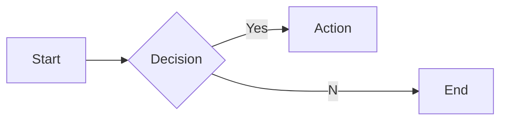
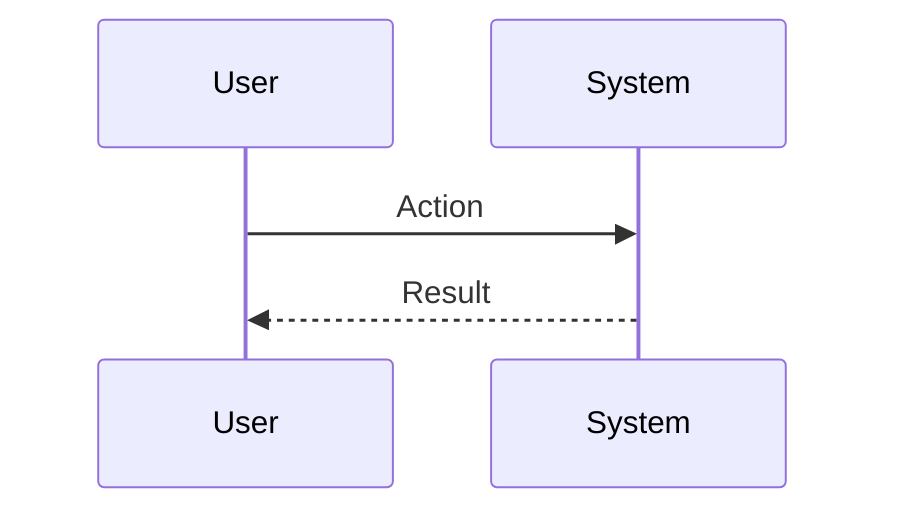

# Interview Questions: director_of_people (ROLE)

This document contains 100 interview questions tailored for the director_of_people role. The questions are designed to assess technical skills, soft skills, and cultural fit.

---

## 1. DEI Strategy

**Scenario:** Hiring diversity.

**Question:** How do you improve diversity in hiring?

**Key Concepts:** `DEI`, `Recruiting`

### Candidate Response Paths
*   **Junior**: Quotas.
*   **Senior**: Sourcing form diverse pools, removing bias from job descriptions, and structured interviewing.

---

## 2. Performance Reviews

**Scenario:** Feedback loops.

**Question:** What is the purpose of a performance review?

**Key Concepts:** `Management`, `Development`

### Candidate Response Paths
*   **Junior**: To give raises.
*   **Senior**: Alignment on goals, feedback for growth, and documentation.

---

## 3. Culture

**Scenario:** Remote culture.

**Question:** How do you maintain culture in a remote environment?

**Key Concepts:** `Culture`, `Engagement`

### Candidate Response Paths
*   **Junior**: Zoom happy hours.
*   **Senior**: Intentional communication, documented values, and virtual rituals.

---

## 4. Conflict

**Scenario:** Employee dispute.

**Question:** How do you mediate a conflict between two employees?

**Key Concepts:** `Conflict Resolution`, `HR`

### Candidate Response Paths
*   **Junior**: Tell them to stop.
*   **Senior**: Listen to both sides, identify underlying issues, and facilitate a resolution plan.

---

## 5. Compliance

**Scenario:** Labor laws.

**Question:** How do you stay compliant with changing labor laws?

**Key Concepts:** `Compliance`, `Legal`

### Candidate Response Paths
*   **Junior**: Google it.
*   **Senior**: Legal counsel partnership, continuous education, and updating handbooks.

---

## 6. Retention

**Scenario:** High turnover.

**Question:** Turnover is high. What do you do?

**Key Concepts:** `Retention`, `Analytics`

### Candidate Response Paths
*   **Junior**: Pay more.
*   **Senior**: Conduct stay interviews/exit interviews, analyze data, and address root causes.

---

## 7. Compensation

**Scenario:** Bands.

**Question:** How do you design a compensation strategy?

| Metric | Target | Status |
|---|---|---|
| KPI 1 | 100% | Green |
| KPI 2 | < 5% | Yellow |

**Key Concepts:** `Comp`, `Strategy`

### Candidate Response Paths
*   **Junior**: Pay market rate.
*   **Senior**: Benchmarking, defining philosophy (percentile), and ensuring equity.

---

## 8. L&D

**Scenario:** Training.

**Question:** How do you measure the ROI of L&D programs?

**Key Concepts:** `Learning`, `ROI`

### Candidate Response Paths
*   **Junior**: Did they like it?
*   **Senior**: Behavior change, skill application, and impact on business metrics.

---

## 9. Onboarding

**Scenario:** First 90 days.

**Question:** How do you ensure a new hire is successful?

**Key Concepts:** `Onboarding`, `Success`

### Candidate Response Paths
*   **Junior**: Orientation.
*   **Senior**: Clear goals, buddy system, and regular check-ins.

---

## 10. Offboarding

**Scenario:** Layoffs.

**Question:** How do you handle a RIF (Reduction in Force) compassionately?

**Key Concepts:** `Empathy`, `Crisis`

### Candidate Response Paths
*   **Junior**: Send an email.
*   **Senior**: Clear communication, generous severance/support, and caring for remaining employees.

---

## 11. Conflict Resolution

**Scenario:** Disagreement with a peer.

**Question:** Tell me about a time you had a significant disagreement with a colleague. How did you resolve it?

**Key Concepts:** `Communication`, `Soft Skills`

### Candidate Response Paths
*   **Junior**: I told them I was right.
*   **Senior**: I listened to their perspective, found common ground, and we compromised.

---

## 12. Failure Handling

**Scenario:** A project went wrong.

**Question:** Describe a time you failed. What happened and what did you learn?

**Key Concepts:** `Growth Mindset`, `Resilience`

### Candidate Response Paths
*   **Junior**: I tried hard but it failed.
*   **Senior**: I analyzed the root cause, implemented a fix, and shared the learning.

---

## 13. Prioritization

**Scenario:** Too many tasks.

**Question:** How do you prioritize when you have multiple conflicting deadlines?

**Key Concepts:** `Time Management`, `Organization`

### Candidate Response Paths
*   **Junior**: I work longer hours.
*   **Senior**: I communicate with stakeholders to adjust expectations and focus on high-impact tasks.

---

## 14. Adaptability

**Scenario:** Changing requirements.

**Question:** How do you handle sudden changes in project scope or direction?

| Metric | Target | Status |
|---|---|---|
| KPI 1 | 100% | Green |
| KPI 2 | < 5% | Yellow |

**Key Concepts:** `Agility`, `Flexibility`

### Candidate Response Paths
*   **Junior**: I get frustrated but do it.
*   **Senior**: I assess the impact, communicate risks, and pivot quickly.

---

## 15. Communication

**Scenario:** Explaining complex topics.

**Question:** Describe a time you had to explain a complex technical/business concept to a non-expert.

**Key Concepts:** `Clarity`, `Empathy`

### Candidate Response Paths
*   **Junior**: I just said it simpler.
*   **Senior**: I used analogies and checked for understanding throughout.

---

## 16. Teamwork

**Scenario:** Collaborating with difficult personalities.

**Question:** How do you handle working with someone who is difficult to work with?

**Key Concepts:** `Collaboration`, `EQ`

### Candidate Response Paths
*   **Junior**: I avoid them.
*   **Senior**: I try to understand their motivations and find a way to work together effectively.

---

## 17. Innovation

**Scenario:** Improving a process.

**Question:** Tell me about a time you improved a process or workflow.

**Key Concepts:** `Innovation`, `Efficiency`

### Candidate Response Paths
*   **Junior**: I followed the rules.
*   **Senior**: I identified a bottleneck, proposed a solution, and measured the improvement.

---

## 18. Feedback

**Scenario:** Receiving constructive criticism.

**Question:** Tell me about a time you received difficult feedback. How did you react?

**Key Concepts:** `Self-awareness`, `Growth`

### Candidate Response Paths
*   **Junior**: I got defensive.
*   **Senior**: I listened, asked for examples, and worked on a plan to improve.

---

## 19. Leadership

**Scenario:** Leading without authority.

**Question:** Describe a time you demonstrated leadership when you weren't the formal manager.

**Key Concepts:** `Leadership`, `Influence`

### Candidate Response Paths
*   **Junior**: I told people what to do.
*   **Senior**: I rallied the team around a goal and supported them to achieve it.

---

## 20. Decision Making

**Scenario:** Incomplete information.

**Question:** How do you make decisions when you don't have all the data?

**Key Concepts:** `Judgment`, `Risk Mgmt`

### Candidate Response Paths
*   **Junior**: I wait for all data.
*   **Senior**: I assess the risk, make a call based on available info, and adjust as needed.

---

## 21. Challenges in Culture

**Scenario:** Problem Solving.

**Question:** What are the biggest challenges you've faced regarding Culture?

| Metric | Target | Status |
|---|---|---|
| KPI 1 | 100% | Green |
| KPI 2 | < 5% | Yellow |

**Key Concepts:** `Culture`, `Problem Solving`

### Candidate Response Paths
*   **Junior**: It was hard.
*   **Senior**: Specific examples of obstacles and strategies to overcome them.

---

## 22. Deep Dive: Culture

**Scenario:** Assessing depth in Culture.

**Question:** Can you explain Culture in detail and how you have applied it in your past role?

**Key Concepts:** `Culture`, `Experience`

### Candidate Response Paths
*   **Junior**: Basic definition.
*   **Senior**: Deep practical application and nuances.

---

## 23. Teaching HRIS

**Scenario:** Mentorship.

**Question:** How would you teach HRIS to a junior team member?

**Key Concepts:** `HRIS`, `Mentorship`

### Candidate Response Paths
*   **Junior**: Send them a link.
*   **Senior**: Structured learning path and hands-on practice.

---

## 24. Deep Dive: Recruiting

**Scenario:** Assessing depth in Recruiting.

**Question:** Can you explain Recruiting in detail and how you have applied it in your past role?

**Key Concepts:** `Recruiting`, `Experience`

### Candidate Response Paths
*   **Junior**: Basic definition.
*   **Senior**: Deep practical application and nuances.

---

## 25. Collaboration in Training

**Scenario:** Teamwork.

**Question:** How does Training require cross-functional collaboration?

**Key Concepts:** `Training`, `Collaboration`

### Candidate Response Paths
*   **Junior**: I talk to people.
*   **Senior**: Alignment with other depts and shared goals.

---

## 26. Challenges in Employee Relations

**Scenario:** Problem Solving.

**Question:** What are the biggest challenges you've faced regarding Employee Relations?

**Key Concepts:** `Employee Relations`, `Problem Solving`

### Candidate Response Paths
*   **Junior**: It was hard.
*   **Senior**: Specific examples of obstacles and strategies to overcome them.

---

## 27. Future of Onboarding

**Scenario:** Trends.

**Question:** Where do you see Onboarding heading in the next 5 years?

**Key Concepts:** `Onboarding`, `Vision`

### Candidate Response Paths
*   **Junior**: It will get better.
*   **Senior**: Emerging trends, AI impact, and market shifts.

---

## 28. Deep Dive: Internal Comms

**Scenario:** Assessing depth in Internal Comms.

**Question:** Can you explain Internal Comms in detail and how you have applied it in your past role?

| Metric | Target | Status |
|---|---|---|
| KPI 1 | 100% | Green |
| KPI 2 | < 5% | Yellow |

**Key Concepts:** `Internal Comms`, `Experience`

### Candidate Response Paths
*   **Junior**: Basic definition.
*   **Senior**: Deep practical application and nuances.

---

## 29. Mistakes in DEI

**Scenario:** Learning.

**Question:** What common mistakes do people make with DEI?

**Key Concepts:** `DEI`, `Experience`

### Candidate Response Paths
*   **Junior**: Doing it wrong.
*   **Senior**: Subtle pitfalls and how to avoid them.

---

## 30. Challenges in Performance

**Scenario:** Problem Solving.

**Question:** What are the biggest challenges you've faced regarding Performance?

**Key Concepts:** `Performance`, `Problem Solving`

### Candidate Response Paths
*   **Junior**: It was hard.
*   **Senior**: Specific examples of obstacles and strategies to overcome them.

---

## 31. Compensation Best Practices

**Scenario:** Standardization.

**Question:** What are the industry best practices for Compensation?

**Key Concepts:** `Compensation`, `Standards`

### Candidate Response Paths
*   **Junior**: List a few.
*   **Senior**: Discusses why they are best practices and when to break them.

---

## 32. Tooling: Engagement

**Scenario:** Proficiency.

**Question:** How do you utilize Engagement to improve efficiency?

**Key Concepts:** `Engagement`, `Productivity`

### Candidate Response Paths
*   **Junior**: I use it daily.
*   **Senior**: Advanced features and automation.

---

## 33. Ethics in Onboarding

**Scenario:** Ethics.

**Question:** What are the ethical considerations regarding Onboarding?

**Key Concepts:** `Onboarding`, `Ethics`

### Candidate Response Paths
*   **Junior**: Be nice.
*   **Senior**: Privacy, bias, and societal impact.

---

## 34. Tooling: Employer Branding

**Scenario:** Proficiency.

**Question:** How do you utilize Employer Branding to improve efficiency?

**Key Concepts:** `Employer Branding`, `Productivity`

### Candidate Response Paths
*   **Junior**: I use it daily.
*   **Senior**: Advanced features and automation.

---

## 35. Future of Offboarding

**Scenario:** Trends.

**Question:** Where do you see Offboarding heading in the next 5 years?

| Metric | Target | Status |
|---|---|---|
| KPI 1 | 100% | Green |
| KPI 2 | < 5% | Yellow |

**Key Concepts:** `Offboarding`, `Vision`

### Candidate Response Paths
*   **Junior**: It will get better.
*   **Senior**: Emerging trends, AI impact, and market shifts.

---

## 36. Tooling: Offboarding

**Scenario:** Proficiency.

**Question:** How do you utilize Offboarding to improve efficiency?

**Key Concepts:** `Offboarding`, `Productivity`

### Candidate Response Paths
*   **Junior**: I use it daily.
*   **Senior**: Advanced features and automation.

---

## 37. Scaling Performance

**Scenario:** Growth.

**Question:** How do you scale Performance as the company grows?

**Key Concepts:** `Performance`, `Scale`

### Candidate Response Paths
*   **Junior**: Hire more people.
*   **Senior**: Process automation, documentation, and leverage.

---

## 38. Metrics for Compliance

**Scenario:** Measurement.

**Question:** How do you measure success in Compliance?

**Key Concepts:** `Compliance`, `Analytics`

### Candidate Response Paths
*   **Junior**: I guess.
*   **Senior**: Specific KPIs and leading/lagging indicators.

---

## 39. Future of Benefits

**Scenario:** Trends.

**Question:** Where do you see Benefits heading in the next 5 years?

**Key Concepts:** `Benefits`, `Vision`

### Candidate Response Paths
*   **Junior**: It will get better.
*   **Senior**: Emerging trends, AI impact, and market shifts.

---

## 40. Start vs Scale for Employer Branding

**Scenario:** Context.

**Question:** How does your approach to Employer Branding differ in a startup vs a large corp?

**Key Concepts:** `Employer Branding`, `Context`

### Candidate Response Paths
*   **Junior**: It's the same.
*   **Senior**: Speed/Chaos vs Process/Stability.

---

## 41. Scaling Onboarding

**Scenario:** Growth.

**Question:** How do you scale Onboarding as the company grows?

**Key Concepts:** `Onboarding`, `Scale`

### Candidate Response Paths
*   **Junior**: Hire more people.
*   **Senior**: Process automation, documentation, and leverage.

---

## 42. Teaching Compliance

**Scenario:** Mentorship.

**Question:** How would you teach Compliance to a junior team member?

| Metric | Target | Status |
|---|---|---|
| KPI 1 | 100% | Green |
| KPI 2 | < 5% | Yellow |

**Key Concepts:** `Compliance`, `Mentorship`

### Candidate Response Paths
*   **Junior**: Send them a link.
*   **Senior**: Structured learning path and hands-on practice.

---

## 43. Tooling: DEI

**Scenario:** Proficiency.

**Question:** How do you utilize DEI to improve efficiency?

**Key Concepts:** `DEI`, `Productivity`

### Candidate Response Paths
*   **Junior**: I use it daily.
*   **Senior**: Advanced features and automation.

---

## 44. Challenges in HRIS

**Scenario:** Problem Solving.

**Question:** What are the biggest challenges you've faced regarding HRIS?

**Key Concepts:** `HRIS`, `Problem Solving`

### Candidate Response Paths
*   **Junior**: It was hard.
*   **Senior**: Specific examples of obstacles and strategies to overcome them.

---

## 45. Deep Dive: Compensation

**Scenario:** Assessing depth in Compensation.

**Question:** Can you explain Compensation in detail and how you have applied it in your past role?

**Key Concepts:** `Compensation`, `Experience`

### Candidate Response Paths
*   **Junior**: Basic definition.
*   **Senior**: Deep practical application and nuances.

---

## 46. Mistakes in Engagement

**Scenario:** Learning.

**Question:** What common mistakes do people make with Engagement?

**Key Concepts:** `Engagement`, `Experience`

### Candidate Response Paths
*   **Junior**: Doing it wrong.
*   **Senior**: Subtle pitfalls and how to avoid them.

---

## 47. Performance Best Practices

**Scenario:** Standardization.

**Question:** What are the industry best practices for Performance?

**Key Concepts:** `Performance`, `Standards`

### Candidate Response Paths
*   **Junior**: List a few.
*   **Senior**: Discusses why they are best practices and when to break them.

---

## 48. Teaching DEI

**Scenario:** Mentorship.

**Question:** How would you teach DEI to a junior team member?

**Key Concepts:** `DEI`, `Mentorship`

### Candidate Response Paths
*   **Junior**: Send them a link.
*   **Senior**: Structured learning path and hands-on practice.

---

## 49. Future of Recruiting

**Scenario:** Trends.

**Question:** Where do you see Recruiting heading in the next 5 years?

| Metric | Target | Status |
|---|---|---|
| KPI 1 | 100% | Green |
| KPI 2 | < 5% | Yellow |

**Key Concepts:** `Recruiting`, `Vision`

### Candidate Response Paths
*   **Junior**: It will get better.
*   **Senior**: Emerging trends, AI impact, and market shifts.

---

## 50. Deep Dive: Performance

**Scenario:** Assessing depth in Performance.

**Question:** Can you explain Performance in detail and how you have applied it in your past role?

**Key Concepts:** `Performance`, `Experience`

### Candidate Response Paths
*   **Junior**: Basic definition.
*   **Senior**: Deep practical application and nuances.

---

## 51. Scaling Recruiting

**Scenario:** Growth.

**Question:** How do you scale Recruiting as the company grows?

**Key Concepts:** `Recruiting`, `Scale`

### Candidate Response Paths
*   **Junior**: Hire more people.
*   **Senior**: Process automation, documentation, and leverage.

---

## 52. Start vs Scale for Engagement

**Scenario:** Context.

**Question:** How does your approach to Engagement differ in a startup vs a large corp?

**Key Concepts:** `Engagement`, `Context`

### Candidate Response Paths
*   **Junior**: It's the same.
*   **Senior**: Speed/Chaos vs Process/Stability.

---

## 53. Future of Employer Branding

**Scenario:** Trends.

**Question:** Where do you see Employer Branding heading in the next 5 years?

**Key Concepts:** `Employer Branding`, `Vision`

### Candidate Response Paths
*   **Junior**: It will get better.
*   **Senior**: Emerging trends, AI impact, and market shifts.

---

## 54. Ethics in Performance

**Scenario:** Ethics.

**Question:** What are the ethical considerations regarding Performance?

**Key Concepts:** `Performance`, `Ethics`

### Candidate Response Paths
*   **Junior**: Be nice.
*   **Senior**: Privacy, bias, and societal impact.

---

## 55. Collaboration in Compliance

**Scenario:** Teamwork.

**Question:** How does Compliance require cross-functional collaboration?

**Key Concepts:** `Compliance`, `Collaboration`

### Candidate Response Paths
*   **Junior**: I talk to people.
*   **Senior**: Alignment with other depts and shared goals.

---

## 56. Future of HRIS

**Scenario:** Trends.

**Question:** Where do you see HRIS heading in the next 5 years?

| Metric | Target | Status |
|---|---|---|
| KPI 1 | 100% | Green |
| KPI 2 | < 5% | Yellow |

**Key Concepts:** `HRIS`, `Vision`

### Candidate Response Paths
*   **Junior**: It will get better.
*   **Senior**: Emerging trends, AI impact, and market shifts.

---

## 57. Start vs Scale for Recruiting

**Scenario:** Context.

**Question:** How does your approach to Recruiting differ in a startup vs a large corp?

**Key Concepts:** `Recruiting`, `Context`

### Candidate Response Paths
*   **Junior**: It's the same.
*   **Senior**: Speed/Chaos vs Process/Stability.

---

## 58. Scaling Offboarding

**Scenario:** Growth.

**Question:** How do you scale Offboarding as the company grows?

**Key Concepts:** `Offboarding`, `Scale`

### Candidate Response Paths
*   **Junior**: Hire more people.
*   **Senior**: Process automation, documentation, and leverage.

---

## 59. Mistakes in Internal Comms

**Scenario:** Learning.

**Question:** What common mistakes do people make with Internal Comms?

**Key Concepts:** `Internal Comms`, `Experience`

### Candidate Response Paths
*   **Junior**: Doing it wrong.
*   **Senior**: Subtle pitfalls and how to avoid them.

---

## 60. Challenges in Recruiting

**Scenario:** Problem Solving.

**Question:** What are the biggest challenges you've faced regarding Recruiting?

**Key Concepts:** `Recruiting`, `Problem Solving`

### Candidate Response Paths
*   **Junior**: It was hard.
*   **Senior**: Specific examples of obstacles and strategies to overcome them.

---

## 61. Future of Compliance

**Scenario:** Trends.

**Question:** Where do you see Compliance heading in the next 5 years?

**Key Concepts:** `Compliance`, `Vision`

### Candidate Response Paths
*   **Junior**: It will get better.
*   **Senior**: Emerging trends, AI impact, and market shifts.

---

## 62. Collaboration in Compensation

**Scenario:** Teamwork.

**Question:** How does Compensation require cross-functional collaboration?

**Key Concepts:** `Compensation`, `Collaboration`

### Candidate Response Paths
*   **Junior**: I talk to people.
*   **Senior**: Alignment with other depts and shared goals.

---

## 63. Compliance Best Practices

**Scenario:** Standardization.

**Question:** What are the industry best practices for Compliance?

| Metric | Target | Status |
|---|---|---|
| KPI 1 | 100% | Green |
| KPI 2 | < 5% | Yellow |

**Key Concepts:** `Compliance`, `Standards`

### Candidate Response Paths
*   **Junior**: List a few.
*   **Senior**: Discusses why they are best practices and when to break them.

---

## 64. Teaching Engagement

**Scenario:** Mentorship.

**Question:** How would you teach Engagement to a junior team member?

**Key Concepts:** `Engagement`, `Mentorship`

### Candidate Response Paths
*   **Junior**: Send them a link.
*   **Senior**: Structured learning path and hands-on practice.

---

## 65. Internal Comms Best Practices

**Scenario:** Standardization.

**Question:** What are the industry best practices for Internal Comms?

**Key Concepts:** `Internal Comms`, `Standards`

### Candidate Response Paths
*   **Junior**: List a few.
*   **Senior**: Discusses why they are best practices and when to break them.

---

## 66. Teaching Employer Branding

**Scenario:** Mentorship.

**Question:** How would you teach Employer Branding to a junior team member?

**Key Concepts:** `Employer Branding`, `Mentorship`

### Candidate Response Paths
*   **Junior**: Send them a link.
*   **Senior**: Structured learning path and hands-on practice.

---

## 67. Scaling Engagement

**Scenario:** Growth.

**Question:** How do you scale Engagement as the company grows?

**Key Concepts:** `Engagement`, `Scale`

### Candidate Response Paths
*   **Junior**: Hire more people.
*   **Senior**: Process automation, documentation, and leverage.

---

## 68. Collaboration in Onboarding

**Scenario:** Teamwork.

**Question:** How does Onboarding require cross-functional collaboration?

**Key Concepts:** `Onboarding`, `Collaboration`

### Candidate Response Paths
*   **Junior**: I talk to people.
*   **Senior**: Alignment with other depts and shared goals.

---

## 69. Tooling: Culture

**Scenario:** Proficiency.

**Question:** How do you utilize Culture to improve efficiency?

**Key Concepts:** `Culture`, `Productivity`

### Candidate Response Paths
*   **Junior**: I use it daily.
*   **Senior**: Advanced features and automation.

---

## 70. Tooling: Benefits

**Scenario:** Proficiency.

**Question:** How do you utilize Benefits to improve efficiency?

| Metric | Target | Status |
|---|---|---|
| KPI 1 | 100% | Green |
| KPI 2 | < 5% | Yellow |

**Key Concepts:** `Benefits`, `Productivity`

### Candidate Response Paths
*   **Junior**: I use it daily.
*   **Senior**: Advanced features and automation.

---

## 71. Mistakes in Benefits

**Scenario:** Learning.

**Question:** What common mistakes do people make with Benefits?

**Key Concepts:** `Benefits`, `Experience`

### Candidate Response Paths
*   **Junior**: Doing it wrong.
*   **Senior**: Subtle pitfalls and how to avoid them.

---

## 72. Tooling: Employee Relations

**Scenario:** Proficiency.

**Question:** How do you utilize Employee Relations to improve efficiency?

**Key Concepts:** `Employee Relations`, `Productivity`

### Candidate Response Paths
*   **Junior**: I use it daily.
*   **Senior**: Advanced features and automation.

---

## 73. Mistakes in Offboarding

**Scenario:** Learning.

**Question:** What common mistakes do people make with Offboarding?

**Key Concepts:** `Offboarding`, `Experience`

### Candidate Response Paths
*   **Junior**: Doing it wrong.
*   **Senior**: Subtle pitfalls and how to avoid them.

---

## 74. Challenges in Compensation

**Scenario:** Problem Solving.

**Question:** What are the biggest challenges you've faced regarding Compensation?

**Key Concepts:** `Compensation`, `Problem Solving`

### Candidate Response Paths
*   **Junior**: It was hard.
*   **Senior**: Specific examples of obstacles and strategies to overcome them.

---

## 75. Start vs Scale for Training

**Scenario:** Context.

**Question:** How does your approach to Training differ in a startup vs a large corp?

**Key Concepts:** `Training`, `Context`

### Candidate Response Paths
*   **Junior**: It's the same.
*   **Senior**: Speed/Chaos vs Process/Stability.

---

## 76. Metrics for Internal Comms

**Scenario:** Measurement.

**Question:** How do you measure success in Internal Comms?

**Key Concepts:** `Internal Comms`, `Analytics`

### Candidate Response Paths
*   **Junior**: I guess.
*   **Senior**: Specific KPIs and leading/lagging indicators.

---

## 77. Mistakes in Compliance

**Scenario:** Learning.

**Question:** What common mistakes do people make with Compliance?

| Metric | Target | Status |
|---|---|---|
| KPI 1 | 100% | Green |
| KPI 2 | < 5% | Yellow |

**Key Concepts:** `Compliance`, `Experience`

### Candidate Response Paths
*   **Junior**: Doing it wrong.
*   **Senior**: Subtle pitfalls and how to avoid them.

---

## 78. Deep Dive: Onboarding

**Scenario:** Assessing depth in Onboarding.

**Question:** Can you explain Onboarding in detail and how you have applied it in your past role?

**Key Concepts:** `Onboarding`, `Experience`

### Candidate Response Paths
*   **Junior**: Basic definition.
*   **Senior**: Deep practical application and nuances.

---

## 79. Collaboration in Engagement

**Scenario:** Teamwork.

**Question:** How does Engagement require cross-functional collaboration?

**Key Concepts:** `Engagement`, `Collaboration`

### Candidate Response Paths
*   **Junior**: I talk to people.
*   **Senior**: Alignment with other depts and shared goals.

---

## 80. Mistakes in Culture

**Scenario:** Learning.

**Question:** What common mistakes do people make with Culture?

**Key Concepts:** `Culture`, `Experience`

### Candidate Response Paths
*   **Junior**: Doing it wrong.
*   **Senior**: Subtle pitfalls and how to avoid them.

---

## 81. Metrics for Employee Relations

**Scenario:** Measurement.

**Question:** How do you measure success in Employee Relations?

**Key Concepts:** `Employee Relations`, `Analytics`

### Candidate Response Paths
*   **Junior**: I guess.
*   **Senior**: Specific KPIs and leading/lagging indicators.

---

## 82. Future of Performance

**Scenario:** Trends.

**Question:** Where do you see Performance heading in the next 5 years?

**Key Concepts:** `Performance`, `Vision`

### Candidate Response Paths
*   **Junior**: It will get better.
*   **Senior**: Emerging trends, AI impact, and market shifts.

---

## 83. Training Best Practices

**Scenario:** Standardization.

**Question:** What are the industry best practices for Training?

**Key Concepts:** `Training`, `Standards`

### Candidate Response Paths
*   **Junior**: List a few.
*   **Senior**: Discusses why they are best practices and when to break them.

---

## 84. Scaling DEI

**Scenario:** Growth.

**Question:** How do you scale DEI as the company grows?

| Metric | Target | Status |
|---|---|---|
| KPI 1 | 100% | Green |
| KPI 2 | < 5% | Yellow |

**Key Concepts:** `DEI`, `Scale`

### Candidate Response Paths
*   **Junior**: Hire more people.
*   **Senior**: Process automation, documentation, and leverage.

---

## 85. Collaboration in HRIS

**Scenario:** Teamwork.

**Question:** How does HRIS require cross-functional collaboration?

**Key Concepts:** `HRIS`, `Collaboration`

### Candidate Response Paths
*   **Junior**: I talk to people.
*   **Senior**: Alignment with other depts and shared goals.

---

## 86. Scaling Benefits

**Scenario:** Growth.

**Question:** How do you scale Benefits as the company grows?

**Key Concepts:** `Benefits`, `Scale`

### Candidate Response Paths
*   **Junior**: Hire more people.
*   **Senior**: Process automation, documentation, and leverage.

---

## 87. Tooling: Internal Comms

**Scenario:** Proficiency.

**Question:** How do you utilize Internal Comms to improve efficiency?

**Key Concepts:** `Internal Comms`, `Productivity`

### Candidate Response Paths
*   **Junior**: I use it daily.
*   **Senior**: Advanced features and automation.

---

## 88. Teaching Training

**Scenario:** Mentorship.

**Question:** How would you teach Training to a junior team member?

**Key Concepts:** `Training`, `Mentorship`

### Candidate Response Paths
*   **Junior**: Send them a link.
*   **Senior**: Structured learning path and hands-on practice.

---

## 89. Challenges in Compliance

**Scenario:** Problem Solving.

**Question:** What are the biggest challenges you've faced regarding Compliance?

**Key Concepts:** `Compliance`, `Problem Solving`

### Candidate Response Paths
*   **Junior**: It was hard.
*   **Senior**: Specific examples of obstacles and strategies to overcome them.

---

## 90. Metrics for Employer Branding

**Scenario:** Measurement.

**Question:** How do you measure success in Employer Branding?

**Key Concepts:** `Employer Branding`, `Analytics`

### Candidate Response Paths
*   **Junior**: I guess.
*   **Senior**: Specific KPIs and leading/lagging indicators.

---

## 91. Metrics for Benefits

**Scenario:** Measurement.

**Question:** How do you measure success in Benefits?

| Metric | Target | Status |
|---|---|---|
| KPI 1 | 100% | Green |
| KPI 2 | < 5% | Yellow |

**Key Concepts:** `Benefits`, `Analytics`

### Candidate Response Paths
*   **Junior**: I guess.
*   **Senior**: Specific KPIs and leading/lagging indicators.

---

## 92. Tooling: Performance

**Scenario:** Proficiency.

**Question:** How do you utilize Performance to improve efficiency?

**Key Concepts:** `Performance`, `Productivity`

### Candidate Response Paths
*   **Junior**: I use it daily.
*   **Senior**: Advanced features and automation.

---

## 93. Mistakes in Training

**Scenario:** Learning.

**Question:** What common mistakes do people make with Training?

**Key Concepts:** `Training`, `Experience`

### Candidate Response Paths
*   **Junior**: Doing it wrong.
*   **Senior**: Subtle pitfalls and how to avoid them.

---

## 94. Mistakes in Performance

**Scenario:** Learning.

**Question:** What common mistakes do people make with Performance?

**Key Concepts:** `Performance`, `Experience`

### Candidate Response Paths
*   **Junior**: Doing it wrong.
*   **Senior**: Subtle pitfalls and how to avoid them.

---

## 95. Challenges in Offboarding

**Scenario:** Problem Solving.

**Question:** What are the biggest challenges you've faced regarding Offboarding?

**Key Concepts:** `Offboarding`, `Problem Solving`

### Candidate Response Paths
*   **Junior**: It was hard.
*   **Senior**: Specific examples of obstacles and strategies to overcome them.

---

## 96. Collaboration in DEI

**Scenario:** Teamwork.

**Question:** How does DEI require cross-functional collaboration?

**Key Concepts:** `DEI`, `Collaboration`

### Candidate Response Paths
*   **Junior**: I talk to people.
*   **Senior**: Alignment with other depts and shared goals.

---

## 97. Future of Engagement

**Scenario:** Trends.

**Question:** Where do you see Engagement heading in the next 5 years?

**Key Concepts:** `Engagement`, `Vision`

### Candidate Response Paths
*   **Junior**: It will get better.
*   **Senior**: Emerging trends, AI impact, and market shifts.

---

## 98. Collaboration in Performance

**Scenario:** Teamwork.

**Question:** How does Performance require cross-functional collaboration?

| Metric | Target | Status |
|---|---|---|
| KPI 1 | 100% | Green |
| KPI 2 | < 5% | Yellow |

**Key Concepts:** `Performance`, `Collaboration`

### Candidate Response Paths
*   **Junior**: I talk to people.
*   **Senior**: Alignment with other depts and shared goals.

---

## 99. Start vs Scale for Compensation

**Scenario:** Context.

**Question:** How does your approach to Compensation differ in a startup vs a large corp?

**Key Concepts:** `Compensation`, `Context`

### Candidate Response Paths
*   **Junior**: It's the same.
*   **Senior**: Speed/Chaos vs Process/Stability.

---

## 100. Start vs Scale for HRIS

**Scenario:** Context.

**Question:** How does your approach to HRIS differ in a startup vs a large corp?

**Key Concepts:** `HRIS`, `Context`

### Candidate Response Paths
*   **Junior**: It's the same.
*   **Senior**: Speed/Chaos vs Process/Stability.

---
