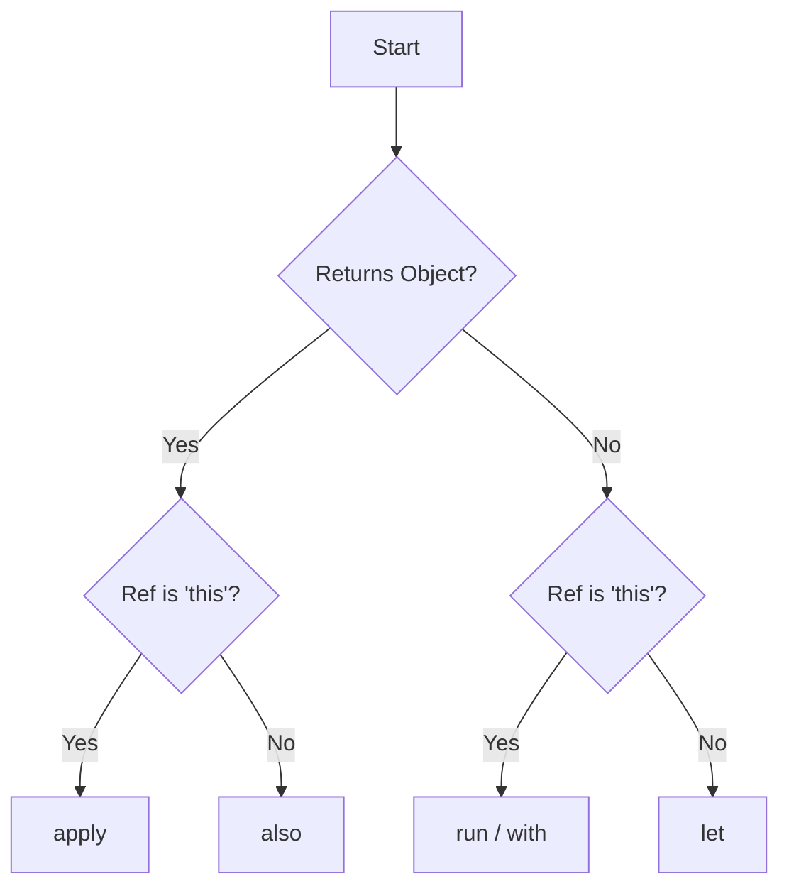

# Kotlin Interview Questions & Answers (100+)

This guide contains 100+ Kotlin interview questions, ranging from basic syntax to advanced concurrency and coroutines. Each question includes a model answer, code examples, and potential follow-up paths based on the candidate's response.

## Part 1: Basic Kotlin Concepts (1-20)

### 1. What is the difference between `val` and `var`?

*   `val`: Immutable reference. Once assigned, it cannot be reassigned. (Similar to `final` in Java).
*   `var`: Mutable reference. Can be reassigned.

**Candidate Response Paths:**

*   **Path A: Candidate mentions 'Immutable'.**
    *   *Follow-up:* "Does `val` mean the object itself is immutable?"
    *   *Answer:* No, `val` only guarantees the *reference* is immutable. If the object is a `MutableList`, you can still add items to it.

*   **Path B: Candidate compares to Java.**
    *   *Follow-up:* "When would you prefer `val` over `var`?"
    *   *Answer:* Always prefer `val` for thread safety and predictability, unless mutation is strictly required.

### 2. How does Kotlin handle Null Safety?

Kotlin's type system distinguishes between references that can hold `null` (nullable references) and those that cannot (non-null references).

| Syntax | Name | Description |
| :--- | :--- | :--- |
| `String` | Non-nullable | Cannot hold null. Compiler error if assigned null. |
| `String?` | Nullable | Can hold null. |

**Key Operators:**
*   `?.` (Safe Call)
*   `!!` (Not-null Assertion)
*   `?:` (Elvis Operator)

**Candidate Response Paths:**

*   **Path A: Candidate mentions `!!`.**
    *   *Follow-up:* "When is it acceptable to use `!!`?"
    *   *Answer:* Rarely. Only when you are 100% sure the value is not null and the compiler can't deduce it, or in quick prototypes/tests. It throws a `NullPointerException` if null.

### 3. What is the Elvis Operator `?:`?

It returns the expression on its left if it is not null, otherwise it returns the expression on its right.

```kotlin
val length = text?.length ?: -1
```

**Candidate Response Paths:**

*   **Path A: Control flow.**
    *   *Follow-up:* "Can you use `return` or `throw` on the right side of `?:`?"
    *   *Answer:* Yes, because `return` and `throw` are expressions in Kotlin.
    ```kotlin
    val name = user.name ?: throw IllegalArgumentException("Name required")
    ```

### 4. What is Type Inference?

The compiler can automatically identify the data type of a variable from the context or the assigned value.

```kotlin
val name = "Kotlin" // Compiler knows this is String
```

**Candidate Response Paths:**

*   **Path A: Limitations.**
    *   *Follow-up:* "When *must* you explicitly specify the type?"
    *   *Answer:* When declaring a variable without initializing it immediately, or when the inferred type is not the desired one (e.g., `Long` vs `Int`).

### 5. What is the difference between `const val` and `val`?

*   `val`: Read-only variable, determined at **runtime**.
*   `const val`: Compile-time constant. Must be a top-level property or a member of an `object` (or `companion object`). Only primitives and String.

### 6. What are String Templates?

Strings that contain expressions beginning with `$`.

```kotlin
val i = 10
println("i = $i")
println("i + 1 = ${i + 1}")
```

### 7. Explain `lateinit` vs `lazy`.

| Feature | `lateinit` | `lazy` |
| :--- | :--- | :--- |
| **Mutability** | `var` (Mutable) | `val` (Read-only) |
| **Type** | Non-primitive types only | Any type |
| **Initialization** | Later in code | On first access |
| **Thread Safety** | Not thread-safe by default | Thread-safe (synchronized) by default |

**Candidate Response Paths:**

*   **Path A: Use cases.**
    *   *Follow-up:* "Why use `lateinit` in Android?"
    *   *Answer:* For dependency injection or View initialization in `onCreate` where you can't initialize at declaration but know it won't be null when used.

### 8. What are Data Classes?

Classes whose main purpose is to hold data. The compiler automatically derives the following members:
*   `equals()` / `hashCode()`
*   `toString()`
*   `componentN()` functions (for destructuring)
*   `copy()`

```kotlin
data class User(val name: String, val age: Int)
```

**Candidate Response Paths:**

*   **Path A: Inheritance.**
    *   *Follow-up:* "Can a Data Class be `open` or `abstract`?"
    *   *Answer:* No, data classes are final by default and cannot be open or abstract.

### 9. What is the difference between `==` and `===`?

*   `==`: Structural equality. Checks if contents are equal (calls `equals()`).
*   `===`: Referential equality. Checks if variables point to the same object in memory.

### 10. How does the `when` expression work?

It replaces the switch operator of C-like languages but is more powerful. It can be used as a statement or an expression.

```kotlin
val result = when (x) {
    1 -> "One"
    in 2..10 -> "Between 2 and 10"
    is String -> "It's a string"
    else -> "Unknown"
}
```

### 11. How do loops work in Kotlin?

*   **For:** Iterates over anything that provides an iterator.
    ```kotlin
    for (item in collection) print(item)
    ```
*   **While / Do-While:** Standard conditional loops.

### 12. What are Range Expressions?

Tools to define a range of values.

```kotlin
val r1 = 1..10        // 1 to 10 inclusive
val r2 = 1 until 10   // 1 to 9
val r3 = 10 downTo 1  // 10 to 1
val r4 = 1..10 step 2 // 1, 3, 5, 7, 9
```

### 13. How do you define a function?

```kotlin
fun sum(a: Int, b: Int): Int {
    return a + b
}
// Single-expression syntax
fun sum(a: Int, b: Int) = a + b
```

**Candidate Response Paths:**

*   **Path A: Default Arguments.**
    *   *Follow-up:* "How do default arguments help compared to Java?"
    *   *Answer:* They reduce the need for method overloading.

### 14. What are Extension Functions?

They allow you to add new functionality to a class without inheriting from it or using design patterns like Decorator.

```kotlin
fun String.removeFirstLastChar(): String =  this.substring(1, this.length - 1)
```

**Candidate Response Paths:**

*   **Path A: Under the hood.**
    *   *Follow-up:* "Does it actually modify the class?"
    *   *Answer:* No, it resolves statically. It's syntactic sugar for a static method that takes the instance as the first parameter.

### 15. What are Infix Functions?

Functions marked with `infix` keyword can be called using infix notation (omitting the dot and the parentheses).
*   Must be member functions or extension functions.
*   Must have a single parameter.

```kotlin
infix fun Int.plus(x: Int): Int = this + x
// Usage
1 plus 2
```

### 16. Explain Classes and Objects in Kotlin.

Classes are declared using `class`. Objects can be:
*   **Object Declaration:** Singleton.
*   **Object Expression:** Anonymous class.

### 17. What are the Visibility Modifiers?

*   `public` (Default): Visible everywhere.
*   `private`: Visible inside file (top-level) or class.
*   `protected`: Visible in class and subclasses.
*   `internal`: Visible within the same module.

**Candidate Response Paths:**

*   **Path A: Internal.**
    *   *Follow-up:* "What constitutes a 'module'?"
    *   *Answer:* A Maven/Gradle module, or an IntelliJ IDEA module.

### 18. Primary vs Secondary Constructors.

*   **Primary:** Part of the class header.
*   **Secondary:** Prefixed with `constructor`. Must delegate to the primary constructor (directly or indirectly) using `this()`.

### 19. How does Inheritance work?

All classes inherit from `Any`. Classes are `final` by default. To allow inheritance, mark the class with `open`.

```kotlin
open class Base(p: Int)
class Derived(p: Int) : Base(p)
```

### 20. How are Interfaces different in Kotlin compared to Java 7?

Kotlin interfaces can contain properties and functions with default implementations. They cannot store state.

```kotlin
interface MyInterface {
    val prop: Int // abstract
    fun foo() { print("Default impl") }
}
```

## Part 2: OOP & Functional Programming (21-40)

### 21. What is the difference between an Abstract Class and an Interface?

| Feature | Abstract Class | Interface |
| :--- | :--- | :--- |
| **State** | Can hold state (fields). | Cannot hold state (only properties without backing fields). |
| **Constructor** | Can have constructors. | Cannot have constructors. |
| **Inheritance** | Single inheritance. | Multiple implementation. |
| **Use Case** | Is-A relationship, sharing state. | Can-Do relationship, behavior contract. |

### 22. What are Sealed Classes?

`sealed` classes represent restricted class hierarchies. All direct subclasses must be known at compile time and declared in the same package (and same module).

**Use Case:**
Perfect for `when` expressions, ensuring all cases are covered without an `else` branch.

```kotlin
sealed class Result
data class Success(val data: String) : Result()
data class Error(val exception: Exception) : Result()
object Loading : Result()
```

### 23. What is an Object Declaration?

It is Kotlin's way of defining a Singleton.

```kotlin
object DatabaseConfig {
    val url = "jdbc:..."
}
```
The initialization is thread-safe and lazy (on first access).

### 24. What is a Companion Object?

An object declared inside a class using the `companion` keyword.
*   It is tied to the class, not instances.
*   Similar to `static` members in Java.
*   Can implement interfaces.

**Candidate Response Paths:**

*   **Path A: Access.**
    *   *Follow-up:* "How do you access members of a companion object?"
    *   *Answer:* Simply by using the class name: `MyClass.create()`.

### 25. What are the requirements for a Data Class?

1.  Primary constructor must have at least one parameter.
2.  All primary constructor parameters must be marked as `val` or `var`.
3.  Cannot be abstract, open, sealed, or inner.

### 26. Explain Class Delegation (`by` keyword).

Kotlin supports the "composition over inheritance" pattern natively. A class can implement an interface by delegating all of its public members to a specified object.

```kotlin
interface Base { fun print() }
class BaseImpl(val x: Int) : Base {
    override fun print() = print(x)
}
class Derived(b: Base) : Base by b
```

### 27. What are Higher-Order Functions?

A function that takes another function as a parameter and/or returns a function.

```kotlin
fun calculate(x: Int, y: Int, operation: (Int, Int) -> Int): Int {
    return operation(x, y)
}
```

### 28. What is a Lambda Expression?

An anonymous function that can be treated as a value.
Syntax: `{ variable(s) -> body }`

**Candidate Response Paths:**

*   **Path A: 'it' keyword.**
    *   *Follow-up:* "When can you use `it`?"
    *   *Answer:* When a lambda has exactly one parameter, you can omit the parameter declaration and refer to it as `it`.

### 29. What are Inline Functions?

Using higher-order functions imposes runtime penalties (object allocation for lambdas). The `inline` modifier tells the compiler to copy the function's code (and the lambda) directly into the call site.

**Pros:** Performance boost for loop-heavy high-order functions.
**Cons:** Code size increases.

### 30. What is `noinline` and `crossinline`?

*   `noinline`: Used in an inline function to prevent a specific lambda parameter from being inlined.
*   `crossinline`: Used when a lambda is passed to an inline function but executed in a different context (e.g., inside a nested object or local function), disallowing non-local returns.

### 31. What are Reified Type Parameters?

In Java, generics are erased at runtime (Type Erasure). In Kotlin, you can use `inline` functions with `reified` type parameters to access the type at runtime.

```kotlin
inline fun <reified T> isType(value: Any) = value is T
```

### 32. Explain Scope Functions (`let`, `run`, `with`, `apply`, `also`).

They execute a block of code within the context of an object.

| Function | Object Reference | Return Value | Use Case |
| :--- | :--- | :--- | :--- |
| `let` | `it` | Lambda result | Null checks, temporary scope. |
| `run` | `this` | Lambda result | Object configuration + computation. |
| `with` | `this` | Lambda result | Grouping calls on an object. |
| `apply` | `this` | Object itself | Object configuration (builder). |
| `also` | `it` | Object itself | Side effects (logging, validation). |



### 33. What are Destructuring Declarations?

A way to unpack a single composite value into multiple variables.

```kotlin
val (name, age) = user // user must be data class or have componentN functions
```

### 34. What is Operator Overloading?

Kotlin allows providing custom implementations for a predefined set of operators (`+`, `-`, `*`, `++`, etc.) on user-defined types. You must use the `operator` modifier.

```kotlin
data class Point(val x: Int, val y: Int) {
    operator fun plus(p: Point) = Point(x + p.x, y + p.y)
}
```

### 35. What are Type Aliases?

Provide alternative names for existing types. Useful for shortening long generic types.

```kotlin
typealias NodeSet = Set<Network.Node>
typealias MyHandler = (Int, String, Any) -> Unit
```

### 36. Nested vs Inner Classes.

*   **Nested Class:** By default, a class inside another class does **not** have access to the members of the outer class. (Static nested in Java).
*   **Inner Class:** Marked with `inner`. Has reference to the outer class object. Can access members.

### 37. What are Anonymous Inner Classes?

Created using `object` expressions.

```kotlin
window.addMouseListener(object : MouseAdapter() {
    override fun mouseClicked(e: MouseEvent) { ... }
})
```

### 38. What is SAM Conversion?

**Single Abstract Method**.
Kotlin allows passing a lambda for a Java interface that has only one abstract method.
*Example:* `Runnable`, `Callable`, `OnClickListener`.

```kotlin
button.setOnClickListener { view -> ... } // Lambda instead of object implementation
```

### 39. What is a Tail Recursive Function?

A recursive function where the recursive call is the *last* operation performed.
Marked with `tailrec`.
The compiler optimizes this into a loop, preventing `StackOverflowError`.

### 40. What is a Functional Interface?

An interface with exactly one abstract method. Marked with `fun interface`.

```kotlin
fun interface IntPredicate {
    fun accept(i: Int): Boolean
}
val isEven = IntPredicate { it % 2 == 0 }
```

## Part 3: Coroutines & Concurrency (41-60)

### 41. What are Coroutines?

Coroutines are light-weight threads. They allow writing asynchronous code in a sequential manner. They are suspendable computations: they can suspend their execution without blocking the underlying thread.

### 42. Difference between `launch` and `async`.

| Feature | `launch` | `async` |
| :--- | :--- | :--- |
| **Return** | Returns a `Job`. | Returns a `Deferred<T>`. |
| **Result** | Fire and forget. No result. | Promise of a result later. |
| **Exception** | Crashes application if unhandled. | Stored inside Deferred, thrown on `.await()`. |

### 43. What is `runBlocking`?

It runs a new coroutine and **blocks** the current thread interruptibly until its completion.
**Use Case:** Mainly for `main` functions and tests. Avoid in production UI code.

### 44. What is a Suspend Function?

A function marked with `suspend` modifier. It can suspend the execution of a coroutine without blocking the thread.
*   Can only be called from a coroutine or another suspend function.

### 45. CoroutineScope vs CoroutineContext.

*   **CoroutineScope:** Defines the scope for new coroutines. It manages the lifecycle (cancellation) of coroutines.
*   **CoroutineContext:** A set of elements that define the behavior of a coroutine (Job, Dispatcher, Name, ExceptionHandler).

### 46. Explain Dispatchers.

They determine which thread(s) the coroutine runs on.

*   `Dispatchers.Main`: UI thread (Android).
*   `Dispatchers.IO`: Optimized for disk/network IO (Thread pool).
*   `Dispatchers.Default`: Optimized for CPU-intensive work (Thread pool size = CPU cores).
*   `Dispatchers.Unconfined`: Starts in current thread, resumes in whatever thread called resume.

### 47. What is `Job` vs `Deferred`?

*   `Job`: A handle to a background task with a lifecycle (Active, Cancelled, Completed).
*   `Deferred`: A generic subclass of `Job` that holds a result. It adds `await()` to retrieve the value.

### 48. What is Structured Concurrency?

A paradigm where new coroutines can only be launched in a specific `CoroutineScope`. This ensures:
1.  Children inherit context from parents.
2.  Parent waits for all children to complete.
3.  If parent is cancelled, all children are cancelled.
4.  If a child fails, the parent (and other children) are cancelled.

### 49. How do you handle exceptions in Coroutines?

*   **try-catch:** Inside the coroutine body.
*   **CoroutineExceptionHandler:** Context element to handle uncaught exceptions (only works on root coroutines launched with `launch`).
*   **SupervisorJob / supervisorScope:** Prevents failure propagation to the parent.

### 50. `supervisorScope` vs `coroutineScope`.

*   `coroutineScope`: If one child fails, the scope fails and cancels all other children.
*   `supervisorScope`: If one child fails, it does **not** affect other children or the scope itself.

**Diagram: Failure Propagation**

```mermaid
graph TD
    A[Parent] --> B[Child 1 (Fails)]
    A --> C[Child 2]
    B -- "With coroutineScope" --> A
    A -- "Cancels" --> C
    B -- "With supervisorScope" --> X[Handled locally]
    A -. "Unaffected" .- C
```

### 51. What are Channels?

Primitives for communication between coroutines. They provide a way to transfer a stream of values.
*   Logically similar to `BlockingQueue`.
*   Support `send` (suspend) and `receive` (suspend).

### 52. Explain Flow (Cold Stream) vs Channel (Hot Stream).

*   **Flow:** Cold. Code inside `flow { ... }` does not run until `collect()` is called. Each collector gets its own execution.
*   **Channel:** Hot. Values are produced even if no one is listening.

### 53. `StateFlow` vs `SharedFlow`.

*   **StateFlow:** A hot flow that holds state. Always has an initial value. Only emits the *last* known value to new collectors. (Replacement for LiveData).
*   **SharedFlow:** Highly configurable hot flow. Can emit events without state (no initial value). Can replay `n` values to new collectors.

### 54. What are `buffer`, `conflate`, and `collectLatest`?

*   `buffer()`: Buffers emissions if collector is slow.
*   `conflate()`: Skips intermediate values if collector is slow, only processing the latest.
*   `collectLatest()`: Cancels the current block if a new value arrives.

### 55. How to handle Backpressure in Flows?

Flows support backpressure by default because they use suspending functions. If the collector is slow, the emitter suspends.

### 56. Thread vs Coroutine?

*   **Thread:** OS-managed resource. Expensive (~1MB stack). Context switching is costly.
*   **Coroutine:** User-space managed. Cheap (Objects). Thousands can run on one thread.

### 57. What is a Mutex?

Mutual Exclusion. A locking primitive for coroutines.
Unlike `synchronized` (which blocks the thread), `Mutex.withLock` suspends the coroutine.

### 58. What is an Actor?

An entity made up of a coroutine, the state that is confined and encapsulated into this coroutine, and a channel to communicate with other coroutines.
*Note: The `actor` builder is currently obsolete in Kotlin Coroutines API favor of complex channels or other primitives, but the concept remains.*

### 59. What is the `select` expression?

It waits for the result of multiple suspending functions simultaneously and selects the first one that becomes available.

```kotlin
select<Unit> {
    channelA.onReceive { ... }
    channelB.onReceive { ... }
}
```

### 60. How do you test Coroutines?

Using `kotlinx-coroutines-test` library.
*   `runTest`: Replaces `runBlocking` for tests. Skips delays (virtual time).
*   `StandardTestDispatcher`: default for `runTest`.
*   `UnconfinedTestDispatcher`.

## Part 4: Standard Library & Collections (61-80)

### 61. List vs MutableList.

*   `List<T>`: Read-only interface. No `add`, `remove`, `set`.
*   `MutableList<T>`: Modifiable interface. Extends `List`.

### 62. `map`, `filter`, and `reduce`.

*   `map`: Transforms each element.
*   `filter`: Returns elements matching a predicate.
*   `reduce`: Accumulates value starting with the first element.

### 63. What is `flatMap`?

Transforms each element into an Iterable and then flattens these iterables into a single list.

```kotlin
val list = listOf("abc", "def")
list.flatMap { it.toList() } // ['a', 'b', 'c', 'd', 'e', 'f']
```

### 64. What does `zip` do?

Combines two collections into a list of pairs.

```kotlin
val a = listOf(1, 2)
val b = listOf("A", "B")
a.zip(b) // [(1, "A"), (2, "B")]
```

### 65. Difference between `fold` and `reduce`.

*   `reduce`: Uses the first element as the initial accumulator value. Throws exception on empty collection.
*   `fold`: Takes an explicit initial value. Works on empty collections.

### 66. Sequence vs Iterable (List).

*   **Iterable (List):** Eager evaluation. Each step (`map`, `filter`) creates a new intermediate list.
*   **Sequence:** Lazy evaluation. Operations are vertical (element by element) rather than horizontal (step by step). No intermediate collections. Better for huge data sets.

### 67. How does `groupBy` work?

Returns a `Map` where keys are the grouping criteria and values are lists of original elements.

```kotlin
val words = listOf("a", "abc", "ab", "def", "abcd")
val byLength = words.groupBy { it.length }
// {1=[a], 3=[abc, def], 2=[ab], 4=[abcd]}
```

### 68. What is `partition`?

Splits the collection into a pair of lists based on a predicate.
*   First list: Elements that match.
*   Second list: Elements that don't match.

### 69. `any`, `all`, and `none`.

*   `any`: True if at least one matches.
*   `all`: True if all match.
*   `none`: True if no elements match.

### 70. What is `associateBy`?

Creates a Map using elements as values and a key derived from the element.
**Risk:** If keys are duplicates, the last one wins.

### 71. `distinct` vs `toSet`.

Both return unique elements.
*   `toSet()`: Converts to a `Set`.
*   `distinct()`: Returns a `List` containing only distinct elements.

### 72. Arrays: `IntArray` vs `Array<Int>`.

*   `IntArray`: Primitive `int[]` in JVM. Unboxed. Efficient.
*   `Array<Int>`: Object `Integer[]` in JVM. Boxed. More memory overhead.

### 73. String Manipulation.

Strings are immutable.
*   `trimMargin()`: Removes whitespace.
*   `split()`: Returns List.
*   `replace()`: Returns new String.

### 74. `Comparable` vs `Comparator`.

*   `Comparable`: Interface implemented by the class itself (`compareTo`). Defines natural order.
*   `Comparator`: External object that defines specific ordering (`compare`).

### 75. Why use the `copy` method in Data Classes?

To create a new instance with some properties modified, while keeping others the same. Essential for immutability patterns.

### 76. Range iterators: `until` vs `downTo`.

*   `until`: Excludes the end value. `1 until 10` (1..9).
*   `downTo`: Descending order. `10 downTo 1`.

### 77. What is `coerceIn`?

Ensures a value is within a specific range.

```kotlin
val x = 15.coerceIn(0, 10) // Returns 10
```

### 78. How to measure execution time?

`measureTimeMillis { ... }` or `measureTime { ... }` (requires kotlin.time).

### 79. How to generate Random numbers?

Since Kotlin 1.3: `Random.nextInt(from, until)`.
Avoid `java.util.Random` in pure Kotlin code for multiplatform support.

### 80. Regular Expressions in Kotlin.

Create using `Regex("pattern")`.
*   `matchEntire()`
*   `find()`
*   `replace()`

## Part 5: Advanced, Android & Multiplatform (81-100)

### 81. Explain `JvmStatic`, `JvmOverloads`, `JvmField`.

Interoperability annotations.
*   `@JvmStatic`: Generates a real static method in the bytecode.
*   `@JvmOverloads`: Generates overloads for functions with default arguments.
*   `@JvmField`: Exposes a property as a public field (no getters/setters).

### 82. What is Kotlin Multiplatform (KMP)?

A way to share code between platforms (Android, iOS, Web, Desktop).
*   **Common code:** Business logic.
*   **Platform code:** UI, Hardware access.

### 83. What is `expect` / `actual` mechanism?

Used in KMP.
*   `expect`: Defined in common module. Declares "I need this functionality".
*   `actual`: Defined in platform modules (Android, iOS). Provides implementation.

### 84. Reflection in Kotlin.

Inspects classes, properties, and functions at runtime.
Requires `kotlin-reflect.jar`.
Syntax: `MyClass::class`, `::myFunction`.

### 85. KAPT vs KSP.

*   **KAPT:** Kotlin Annotation Processing Tool. Runs Java annotation processors. Slow (generates Java stubs).
*   **KSP:** Kotlin Symbol Processing. Native to Kotlin. Faster.

### 86. Dependency Injection (Concept).

*   **Koin:** Service Locator pattern (DSL). Pure Kotlin. No code generation. Runtime check.
*   **Dagger/Hilt:** Dependency Injection pattern. Compile-time generation. Strict.

### 87. What is ViewBinding?

Generates a binding class for each XML layout file. Replaces `findViewById`. Null-safe and Type-safe.

### 88. What is Jetpack Compose?

Modern toolkit for building native UI in Android using Kotlin.
*   **Declarative:** You describe the UI state, framework updates the view.
*   **Functions:** UI components are functions annotated with `@Composable`.

### 89. Memory Management (JVM).

Kotlin on JVM uses the JVM Garbage Collector.
*   **Heap:** Objects.
*   **Stack:** Primitives, references.

### 90. What is a `value class` (Inline Class)?

Wraps a single value. At runtime, instances are represented by the underlying value (unboxed) where possible, avoiding object allocation.

```kotlin
@JvmInline
value class Password(val s: String)
```

### 91. What is Type Erasure?

Generics are checked at compile time but removed (erased) at runtime. `List<String>` becomes just `List` (or raw `List`).
*Solution:* Reified type parameters (inline functions).

### 92. Covariance and Contravariance (`in` vs `out`).

*   `out T` (Covariant): Producer. Can only read T. Equivalent to `? extends T` in Java. `List<out Number>` can hold `List<Int>`.
*   `in T` (Contravariant): Consumer. Can only write T. Equivalent to `? super T` in Java. `Comparable<in Number>` can accept `Double`.

### 93. What is Star Projection `*`?

Generic type with unknown argument.
*   `MutableList<*>`: Safe to read as `Any?`, but unsafe to write (except Nothing).

### 94. What is the `Nothing` type?

A type that has no values. Represents "a value that never exists".
*   Used as return type for functions that always throw exceptions.
*   Subtype of all types.

### 95. What is the `Unit` type?

Corresponds to `void` in Java. It is a real object (singleton).

### 96. What are Contracts?

Let you describe the relationship between function parameters and return values/effects to the compiler.
*   *Example:* `require(x != null)` tells the compiler `x` is non-null afterwards.

### 97. What are Context Receivers?

(Experimental) Allows a function to have multiple receivers.

```kotlin
context(LoggingContext, DatabaseContext)
fun storeUser(user: User) { ... }
```

### 98. Kotlin Scripting (.kts).

Kotlin code that can run as a script without compilation to a .jar.
Used in Gradle Kotlin DSL.

### 99. Gradle Kotlin DSL.

Writing `build.gradle.kts` using Kotlin instead of Groovy.
*   **Pros:** Autocomplete, Refactoring, Type safety.
*   **Cons:** Slower initial build (compilation).

### 100. What is the K2 Compiler?

The new Kotlin compiler frontend.
*   Faster compilation.
*   Better type inference.
*   Foundation for future language features.

---
**End of Interview Questions**
