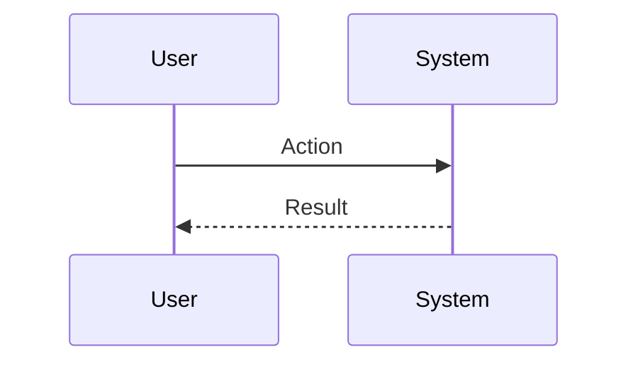
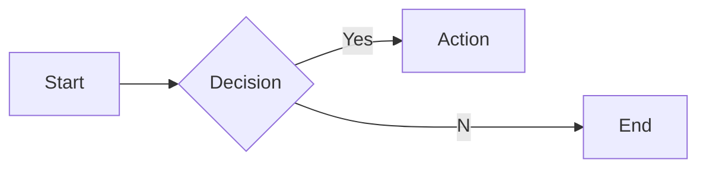

# Interview Questions: data_scientist (ROLE)

This document contains 100 interview questions tailored for the data_scientist role. The questions are designed to assess technical skills, soft skills, and cultural fit.

---

## 1. Design Systems

**Scenario:** Consistency.

**Question:** Why invest in a Design System?

**Key Concepts:** `UI/UX`, `Efficiency`

### Candidate Response Paths
*   **Junior**: It looks nice.
*   **Senior**: Scalability, consistency, and speed of development.

---

## 2. Accessibility

**Scenario:** WCAG.

**Question:** How do you design for accessibility?

**Key Concepts:** `A11y`, `Inclusivity`

### Candidate Response Paths
*   **Junior**: Contrast check.
*   **Senior**: Keyboard navigation, screen reader compatibility, and color blind modes.

---

## 3. User Research

**Scenario:** Validation.

**Question:** When should you conduct user research?

**Key Concepts:** `Research`, `Process`

### Candidate Response Paths
*   **Junior**: At the beginning.
*   **Senior**: Continuously throughout the product lifecycle (Discovery, Testing, Validation).

---

## 4. Handloff

**Scenario:** Dev collaboration.

**Question:** How do you ensure a smooth handoff to engineering?

**Key Concepts:** `Collaboration`, `Process`

### Candidate Response Paths
*   **Junior**: Send the Figma file.
*   **Senior**: Detailed specs, prototypes, and walkthroughs with devs.

---

## 5. Critique

**Scenario:** Feedback.

**Question:** How do you handle design critique?

**Key Concepts:** `Feedback`, `Growth`

### Candidate Response Paths
*   **Junior**: Defend my work.
*   **Senior**: Separate self from work, look for 'why', and iterate.

---

## 6. Tools

**Scenario:** Figma.

**Question:** What is your workflow in Figma?

**Key Concepts:** `Tools`, `Workflow`

### Candidate Response Paths
*   **Junior**: I draw shapes.
*   **Senior**: Components, Auto Layout, Variants, and organized layers.

---

## 7. Mobile Design

**Scenario:** Responsive.

**Question:** What are the key considerations for mobile-first design?

| Metric | Target | Status |
|---|---|---|
| KPI 1 | 100% | Green |
| KPI 2 | < 5% | Yellow |

**Key Concepts:** `Mobile`, `UX`

### Candidate Response Paths
*   **Junior**: Make it smaller.
*   **Senior**: Touch targets, gestures, and content hierarchy.

---

## 8. Prototyping

**Scenario:** Interaction.

**Question:** Why is prototyping important?

**Key Concepts:** `Prototyping`, `Validation`

### Candidate Response Paths
*   **Junior**: To show animations.
*   **Senior**: To test flow and interaction before expensive coding starts.

---

## 9. Data

**Scenario:** Metrics.

**Question:** How do you use data to inform design?

**Key Concepts:** `Data`, `UX`

### Candidate Response Paths
*   **Junior**: Look at clicks.
*   **Senior**: Heatmaps, conversion funnels, and A/B test results.

---

## 10. Empathy

**Scenario:** User needs.

**Question:** How do you build empathy for the user?

**Key Concepts:** `Empathy`, `Research`

### Candidate Response Paths
*   **Junior**: Imagine I am them.
*   **Senior**: Observation, interviews, and personas.

---

## 11. Conflict Resolution

**Scenario:** Disagreement with a peer.

**Question:** Tell me about a time you had a significant disagreement with a colleague. How did you resolve it?

**Key Concepts:** `Communication`, `Soft Skills`

### Candidate Response Paths
*   **Junior**: I told them I was right.
*   **Senior**: I listened to their perspective, found common ground, and we compromised.

---

## 12. Failure Handling

**Scenario:** A project went wrong.

**Question:** Describe a time you failed. What happened and what did you learn?

**Key Concepts:** `Growth Mindset`, `Resilience`

### Candidate Response Paths
*   **Junior**: I tried hard but it failed.
*   **Senior**: I analyzed the root cause, implemented a fix, and shared the learning.

---

## 13. Prioritization

**Scenario:** Too many tasks.

**Question:** How do you prioritize when you have multiple conflicting deadlines?

**Key Concepts:** `Time Management`, `Organization`

### Candidate Response Paths
*   **Junior**: I work longer hours.
*   **Senior**: I communicate with stakeholders to adjust expectations and focus on high-impact tasks.

---

## 14. Adaptability

**Scenario:** Changing requirements.

**Question:** How do you handle sudden changes in project scope or direction?

| Metric | Target | Status |
|---|---|---|
| KPI 1 | 100% | Green |
| KPI 2 | < 5% | Yellow |

**Key Concepts:** `Agility`, `Flexibility`

### Candidate Response Paths
*   **Junior**: I get frustrated but do it.
*   **Senior**: I assess the impact, communicate risks, and pivot quickly.

---

## 15. Communication

**Scenario:** Explaining complex topics.

**Question:** Describe a time you had to explain a complex technical/business concept to a non-expert.

**Key Concepts:** `Clarity`, `Empathy`

### Candidate Response Paths
*   **Junior**: I just said it simpler.
*   **Senior**: I used analogies and checked for understanding throughout.

---

## 16. Teamwork

**Scenario:** Collaborating with difficult personalities.

**Question:** How do you handle working with someone who is difficult to work with?

**Key Concepts:** `Collaboration`, `EQ`

### Candidate Response Paths
*   **Junior**: I avoid them.
*   **Senior**: I try to understand their motivations and find a way to work together effectively.

---

## 17. Innovation

**Scenario:** Improving a process.

**Question:** Tell me about a time you improved a process or workflow.

**Key Concepts:** `Innovation`, `Efficiency`

### Candidate Response Paths
*   **Junior**: I followed the rules.
*   **Senior**: I identified a bottleneck, proposed a solution, and measured the improvement.

---

## 18. Feedback

**Scenario:** Receiving constructive criticism.

**Question:** Tell me about a time you received difficult feedback. How did you react?

**Key Concepts:** `Self-awareness`, `Growth`

### Candidate Response Paths
*   **Junior**: I got defensive.
*   **Senior**: I listened, asked for examples, and worked on a plan to improve.

---

## 19. Leadership

**Scenario:** Leading without authority.

**Question:** Describe a time you demonstrated leadership when you weren't the formal manager.

**Key Concepts:** `Leadership`, `Influence`

### Candidate Response Paths
*   **Junior**: I told people what to do.
*   **Senior**: I rallied the team around a goal and supported them to achieve it.

---

## 20. Decision Making

**Scenario:** Incomplete information.

**Question:** How do you make decisions when you don't have all the data?

**Key Concepts:** `Judgment`, `Risk Mgmt`

### Candidate Response Paths
*   **Junior**: I wait for all data.
*   **Senior**: I assess the risk, make a call based on available info, and adjust as needed.

---

## 21. Information Arch Best Practices

**Scenario:** Standardization.

**Question:** What are the industry best practices for Information Arch?

| Metric | Target | Status |
|---|---|---|
| KPI 1 | 100% | Green |
| KPI 2 | < 5% | Yellow |

**Key Concepts:** `Information Arch`, `Standards`

### Candidate Response Paths
*   **Junior**: List a few.
*   **Senior**: Discusses why they are best practices and when to break them.

---

## 22. Teaching Prototyping

**Scenario:** Mentorship.

**Question:** How would you teach Prototyping to a junior team member?

**Key Concepts:** `Prototyping`, `Mentorship`

### Candidate Response Paths
*   **Junior**: Send them a link.
*   **Senior**: Structured learning path and hands-on practice.

---

## 23. Scaling Design Systems

**Scenario:** Growth.

**Question:** How do you scale Design Systems as the company grows?

**Key Concepts:** `Design Systems`, `Scale`

### Candidate Response Paths
*   **Junior**: Hire more people.
*   **Senior**: Process automation, documentation, and leverage.

---

## 24. Teaching Typography

**Scenario:** Mentorship.

**Question:** How would you teach Typography to a junior team member?

**Key Concepts:** `Typography`, `Mentorship`

### Candidate Response Paths
*   **Junior**: Send them a link.
*   **Senior**: Structured learning path and hands-on practice.

---

## 25. Future of Design Systems

**Scenario:** Trends.

**Question:** Where do you see Design Systems heading in the next 5 years?

**Key Concepts:** `Design Systems`, `Vision`

### Candidate Response Paths
*   **Junior**: It will get better.
*   **Senior**: Emerging trends, AI impact, and market shifts.

---

## 26. Challenges in Mobile Design

**Scenario:** Problem Solving.

**Question:** What are the biggest challenges you've faced regarding Mobile Design?

**Key Concepts:** `Mobile Design`, `Problem Solving`

### Candidate Response Paths
*   **Junior**: It was hard.
*   **Senior**: Specific examples of obstacles and strategies to overcome them.

---

## 27. Collaboration in Typography

**Scenario:** Teamwork.

**Question:** How does Typography require cross-functional collaboration?

**Key Concepts:** `Typography`, `Collaboration`

### Candidate Response Paths
*   **Junior**: I talk to people.
*   **Senior**: Alignment with other depts and shared goals.

---

## 28. Scaling Figma

**Scenario:** Growth.

**Question:** How do you scale Figma as the company grows?

| Metric | Target | Status |
|---|---|---|
| KPI 1 | 100% | Green |
| KPI 2 | < 5% | Yellow |

**Key Concepts:** `Figma`, `Scale`

### Candidate Response Paths
*   **Junior**: Hire more people.
*   **Senior**: Process automation, documentation, and leverage.

---

## 29. Teaching Information Arch

**Scenario:** Mentorship.

**Question:** How would you teach Information Arch to a junior team member?

**Key Concepts:** `Information Arch`, `Mentorship`

### Candidate Response Paths
*   **Junior**: Send them a link.
*   **Senior**: Structured learning path and hands-on practice.

---

## 30. Deep Dive: Figma

**Scenario:** Assessing depth in Figma.

**Question:** Can you explain Figma in detail and how you have applied it in your past role?

**Key Concepts:** `Figma`, `Experience`

### Candidate Response Paths
*   **Junior**: Basic definition.
*   **Senior**: Deep practical application and nuances.

---

## 31. Ethics in Interaction Design

**Scenario:** Ethics.

**Question:** What are the ethical considerations regarding Interaction Design?

**Key Concepts:** `Interaction Design`, `Ethics`

### Candidate Response Paths
*   **Junior**: Be nice.
*   **Senior**: Privacy, bias, and societal impact.

---

## 32. Metrics for Color Theory

**Scenario:** Measurement.

**Question:** How do you measure success in Color Theory?

**Key Concepts:** `Color Theory`, `Analytics`

### Candidate Response Paths
*   **Junior**: I guess.
*   **Senior**: Specific KPIs and leading/lagging indicators.

---

## 33. Mistakes in Usability

**Scenario:** Learning.

**Question:** What common mistakes do people make with Usability?

**Key Concepts:** `Usability`, `Experience`

### Candidate Response Paths
*   **Junior**: Doing it wrong.
*   **Senior**: Subtle pitfalls and how to avoid them.

---

## 34. Challenges in Prototyping

**Scenario:** Problem Solving.

**Question:** What are the biggest challenges you've faced regarding Prototyping?

**Key Concepts:** `Prototyping`, `Problem Solving`

### Candidate Response Paths
*   **Junior**: It was hard.
*   **Senior**: Specific examples of obstacles and strategies to overcome them.

---

## 35. Scaling Accessibility

**Scenario:** Growth.

**Question:** How do you scale Accessibility as the company grows?

| Metric | Target | Status |
|---|---|---|
| KPI 1 | 100% | Green |
| KPI 2 | < 5% | Yellow |

**Key Concepts:** `Accessibility`, `Scale`

### Candidate Response Paths
*   **Junior**: Hire more people.
*   **Senior**: Process automation, documentation, and leverage.

---

## 36. Teaching Usability

**Scenario:** Mentorship.

**Question:** How would you teach Usability to a junior team member?

**Key Concepts:** `Usability`, `Mentorship`

### Candidate Response Paths
*   **Junior**: Send them a link.
*   **Senior**: Structured learning path and hands-on practice.

---

## 37. Teaching Accessibility

**Scenario:** Mentorship.

**Question:** How would you teach Accessibility to a junior team member?

**Key Concepts:** `Accessibility`, `Mentorship`

### Candidate Response Paths
*   **Junior**: Send them a link.
*   **Senior**: Structured learning path and hands-on practice.

---

## 38. Deep Dive: Animation

**Scenario:** Assessing depth in Animation.

**Question:** Can you explain Animation in detail and how you have applied it in your past role?

**Key Concepts:** `Animation`, `Experience`

### Candidate Response Paths
*   **Junior**: Basic definition.
*   **Senior**: Deep practical application and nuances.

---

## 39. Scaling Animation

**Scenario:** Growth.

**Question:** How do you scale Animation as the company grows?

**Key Concepts:** `Animation`, `Scale`

### Candidate Response Paths
*   **Junior**: Hire more people.
*   **Senior**: Process automation, documentation, and leverage.

---

## 40. Challenges in Figma

**Scenario:** Problem Solving.

**Question:** What are the biggest challenges you've faced regarding Figma?

**Key Concepts:** `Figma`, `Problem Solving`

### Candidate Response Paths
*   **Junior**: It was hard.
*   **Senior**: Specific examples of obstacles and strategies to overcome them.

---

## 41. Ethics in Typography

**Scenario:** Ethics.

**Question:** What are the ethical considerations regarding Typography?

**Key Concepts:** `Typography`, `Ethics`

### Candidate Response Paths
*   **Junior**: Be nice.
*   **Senior**: Privacy, bias, and societal impact.

---

## 42. Deep Dive: Design Systems

**Scenario:** Assessing depth in Design Systems.

**Question:** Can you explain Design Systems in detail and how you have applied it in your past role?

| Metric | Target | Status |
|---|---|---|
| KPI 1 | 100% | Green |
| KPI 2 | < 5% | Yellow |

**Key Concepts:** `Design Systems`, `Experience`

### Candidate Response Paths
*   **Junior**: Basic definition.
*   **Senior**: Deep practical application and nuances.

---

## 43. Collaboration in Color Theory

**Scenario:** Teamwork.

**Question:** How does Color Theory require cross-functional collaboration?

**Key Concepts:** `Color Theory`, `Collaboration`

### Candidate Response Paths
*   **Junior**: I talk to people.
*   **Senior**: Alignment with other depts and shared goals.

---

## 44. Challenges in Animation

**Scenario:** Problem Solving.

**Question:** What are the biggest challenges you've faced regarding Animation?

**Key Concepts:** `Animation`, `Problem Solving`

### Candidate Response Paths
*   **Junior**: It was hard.
*   **Senior**: Specific examples of obstacles and strategies to overcome them.

---

## 45. Challenges in Interaction Design

**Scenario:** Problem Solving.

**Question:** What are the biggest challenges you've faced regarding Interaction Design?

**Key Concepts:** `Interaction Design`, `Problem Solving`

### Candidate Response Paths
*   **Junior**: It was hard.
*   **Senior**: Specific examples of obstacles and strategies to overcome them.

---

## 46. Animation Best Practices

**Scenario:** Standardization.

**Question:** What are the industry best practices for Animation?

**Key Concepts:** `Animation`, `Standards`

### Candidate Response Paths
*   **Junior**: List a few.
*   **Senior**: Discusses why they are best practices and when to break them.

---

## 47. Challenges in Usability

**Scenario:** Problem Solving.

**Question:** What are the biggest challenges you've faced regarding Usability?

**Key Concepts:** `Usability`, `Problem Solving`

### Candidate Response Paths
*   **Junior**: It was hard.
*   **Senior**: Specific examples of obstacles and strategies to overcome them.

---

## 48. Start vs Scale for Mobile Design

**Scenario:** Context.

**Question:** How does your approach to Mobile Design differ in a startup vs a large corp?

**Key Concepts:** `Mobile Design`, `Context`

### Candidate Response Paths
*   **Junior**: It's the same.
*   **Senior**: Speed/Chaos vs Process/Stability.

---

## 49. Mistakes in Typography

**Scenario:** Learning.

**Question:** What common mistakes do people make with Typography?

| Metric | Target | Status |
|---|---|---|
| KPI 1 | 100% | Green |
| KPI 2 | < 5% | Yellow |

**Key Concepts:** `Typography`, `Experience`

### Candidate Response Paths
*   **Junior**: Doing it wrong.
*   **Senior**: Subtle pitfalls and how to avoid them.

---

## 50. Future of Mobile Design

**Scenario:** Trends.

**Question:** Where do you see Mobile Design heading in the next 5 years?

**Key Concepts:** `Mobile Design`, `Vision`

### Candidate Response Paths
*   **Junior**: It will get better.
*   **Senior**: Emerging trends, AI impact, and market shifts.

---

## 51. Collaboration in Figma

**Scenario:** Teamwork.

**Question:** How does Figma require cross-functional collaboration?

**Key Concepts:** `Figma`, `Collaboration`

### Candidate Response Paths
*   **Junior**: I talk to people.
*   **Senior**: Alignment with other depts and shared goals.

---

## 52. Start vs Scale for User Testing

**Scenario:** Context.

**Question:** How does your approach to User Testing differ in a startup vs a large corp?

**Key Concepts:** `User Testing`, `Context`

### Candidate Response Paths
*   **Junior**: It's the same.
*   **Senior**: Speed/Chaos vs Process/Stability.

---

## 53. Tooling: Figma

**Scenario:** Proficiency.

**Question:** How do you utilize Figma to improve efficiency?

**Key Concepts:** `Figma`, `Productivity`

### Candidate Response Paths
*   **Junior**: I use it daily.
*   **Senior**: Advanced features and automation.

---

## 54. Mistakes in Information Arch

**Scenario:** Learning.

**Question:** What common mistakes do people make with Information Arch?

**Key Concepts:** `Information Arch`, `Experience`

### Candidate Response Paths
*   **Junior**: Doing it wrong.
*   **Senior**: Subtle pitfalls and how to avoid them.

---

## 55. Tooling: Typography

**Scenario:** Proficiency.

**Question:** How do you utilize Typography to improve efficiency?

**Key Concepts:** `Typography`, `Productivity`

### Candidate Response Paths
*   **Junior**: I use it daily.
*   **Senior**: Advanced features and automation.

---

## 56. Tooling: Color Theory

**Scenario:** Proficiency.

**Question:** How do you utilize Color Theory to improve efficiency?

| Metric | Target | Status |
|---|---|---|
| KPI 1 | 100% | Green |
| KPI 2 | < 5% | Yellow |

**Key Concepts:** `Color Theory`, `Productivity`

### Candidate Response Paths
*   **Junior**: I use it daily.
*   **Senior**: Advanced features and automation.

---

## 57. Scaling Usability

**Scenario:** Growth.

**Question:** How do you scale Usability as the company grows?

**Key Concepts:** `Usability`, `Scale`

### Candidate Response Paths
*   **Junior**: Hire more people.
*   **Senior**: Process automation, documentation, and leverage.

---

## 58. Scaling Web Design

**Scenario:** Growth.

**Question:** How do you scale Web Design as the company grows?

**Key Concepts:** `Web Design`, `Scale`

### Candidate Response Paths
*   **Junior**: Hire more people.
*   **Senior**: Process automation, documentation, and leverage.

---

## 59. Teaching Mobile Design

**Scenario:** Mentorship.

**Question:** How would you teach Mobile Design to a junior team member?

**Key Concepts:** `Mobile Design`, `Mentorship`

### Candidate Response Paths
*   **Junior**: Send them a link.
*   **Senior**: Structured learning path and hands-on practice.

---

## 60. Start vs Scale for Typography

**Scenario:** Context.

**Question:** How does your approach to Typography differ in a startup vs a large corp?

**Key Concepts:** `Typography`, `Context`

### Candidate Response Paths
*   **Junior**: It's the same.
*   **Senior**: Speed/Chaos vs Process/Stability.

---

## 61. Start vs Scale for Animation

**Scenario:** Context.

**Question:** How does your approach to Animation differ in a startup vs a large corp?

**Key Concepts:** `Animation`, `Context`

### Candidate Response Paths
*   **Junior**: It's the same.
*   **Senior**: Speed/Chaos vs Process/Stability.

---

## 62. Mistakes in Interaction Design

**Scenario:** Learning.

**Question:** What common mistakes do people make with Interaction Design?

**Key Concepts:** `Interaction Design`, `Experience`

### Candidate Response Paths
*   **Junior**: Doing it wrong.
*   **Senior**: Subtle pitfalls and how to avoid them.

---

## 63. Teaching Design Systems

**Scenario:** Mentorship.

**Question:** How would you teach Design Systems to a junior team member?

| Metric | Target | Status |
|---|---|---|
| KPI 1 | 100% | Green |
| KPI 2 | < 5% | Yellow |

**Key Concepts:** `Design Systems`, `Mentorship`

### Candidate Response Paths
*   **Junior**: Send them a link.
*   **Senior**: Structured learning path and hands-on practice.

---

## 64. Start vs Scale for Interaction Design

**Scenario:** Context.

**Question:** How does your approach to Interaction Design differ in a startup vs a large corp?

**Key Concepts:** `Interaction Design`, `Context`

### Candidate Response Paths
*   **Junior**: It's the same.
*   **Senior**: Speed/Chaos vs Process/Stability.

---

## 65. Web Design Best Practices

**Scenario:** Standardization.

**Question:** What are the industry best practices for Web Design?

**Key Concepts:** `Web Design`, `Standards`

### Candidate Response Paths
*   **Junior**: List a few.
*   **Senior**: Discusses why they are best practices and when to break them.

---

## 66. Challenges in Web Design

**Scenario:** Problem Solving.

**Question:** What are the biggest challenges you've faced regarding Web Design?

**Key Concepts:** `Web Design`, `Problem Solving`

### Candidate Response Paths
*   **Junior**: It was hard.
*   **Senior**: Specific examples of obstacles and strategies to overcome them.

---

## 67. Collaboration in Animation

**Scenario:** Teamwork.

**Question:** How does Animation require cross-functional collaboration?

**Key Concepts:** `Animation`, `Collaboration`

### Candidate Response Paths
*   **Junior**: I talk to people.
*   **Senior**: Alignment with other depts and shared goals.

---

## 68. Metrics for User Testing

**Scenario:** Measurement.

**Question:** How do you measure success in User Testing?

**Key Concepts:** `User Testing`, `Analytics`

### Candidate Response Paths
*   **Junior**: I guess.
*   **Senior**: Specific KPIs and leading/lagging indicators.

---

## 69. Challenges in Wireframing

**Scenario:** Problem Solving.

**Question:** What are the biggest challenges you've faced regarding Wireframing?

**Key Concepts:** `Wireframing`, `Problem Solving`

### Candidate Response Paths
*   **Junior**: It was hard.
*   **Senior**: Specific examples of obstacles and strategies to overcome them.

---

## 70. Metrics for Figma

**Scenario:** Measurement.

**Question:** How do you measure success in Figma?

| Metric | Target | Status |
|---|---|---|
| KPI 1 | 100% | Green |
| KPI 2 | < 5% | Yellow |

**Key Concepts:** `Figma`, `Analytics`

### Candidate Response Paths
*   **Junior**: I guess.
*   **Senior**: Specific KPIs and leading/lagging indicators.

---

## 71. Metrics for Accessibility

**Scenario:** Measurement.

**Question:** How do you measure success in Accessibility?

**Key Concepts:** `Accessibility`, `Analytics`

### Candidate Response Paths
*   **Junior**: I guess.
*   **Senior**: Specific KPIs and leading/lagging indicators.

---

## 72. Collaboration in User Testing

**Scenario:** Teamwork.

**Question:** How does User Testing require cross-functional collaboration?

**Key Concepts:** `User Testing`, `Collaboration`

### Candidate Response Paths
*   **Junior**: I talk to people.
*   **Senior**: Alignment with other depts and shared goals.

---

## 73. Deep Dive: User Testing

**Scenario:** Assessing depth in User Testing.

**Question:** Can you explain User Testing in detail and how you have applied it in your past role?

**Key Concepts:** `User Testing`, `Experience`

### Candidate Response Paths
*   **Junior**: Basic definition.
*   **Senior**: Deep practical application and nuances.

---

## 74. Metrics for Typography

**Scenario:** Measurement.

**Question:** How do you measure success in Typography?

**Key Concepts:** `Typography`, `Analytics`

### Candidate Response Paths
*   **Junior**: I guess.
*   **Senior**: Specific KPIs and leading/lagging indicators.

---

## 75. Metrics for Wireframing

**Scenario:** Measurement.

**Question:** How do you measure success in Wireframing?

**Key Concepts:** `Wireframing`, `Analytics`

### Candidate Response Paths
*   **Junior**: I guess.
*   **Senior**: Specific KPIs and leading/lagging indicators.

---

## 76. Future of User Testing

**Scenario:** Trends.

**Question:** Where do you see User Testing heading in the next 5 years?

**Key Concepts:** `User Testing`, `Vision`

### Candidate Response Paths
*   **Junior**: It will get better.
*   **Senior**: Emerging trends, AI impact, and market shifts.

---

## 77. Future of Wireframing

**Scenario:** Trends.

**Question:** Where do you see Wireframing heading in the next 5 years?

| Metric | Target | Status |
|---|---|---|
| KPI 1 | 100% | Green |
| KPI 2 | < 5% | Yellow |

**Key Concepts:** `Wireframing`, `Vision`

### Candidate Response Paths
*   **Junior**: It will get better.
*   **Senior**: Emerging trends, AI impact, and market shifts.

---

## 78. Ethics in Animation

**Scenario:** Ethics.

**Question:** What are the ethical considerations regarding Animation?

**Key Concepts:** `Animation`, `Ethics`

### Candidate Response Paths
*   **Junior**: Be nice.
*   **Senior**: Privacy, bias, and societal impact.

---

## 79. User Testing Best Practices

**Scenario:** Standardization.

**Question:** What are the industry best practices for User Testing?

**Key Concepts:** `User Testing`, `Standards`

### Candidate Response Paths
*   **Junior**: List a few.
*   **Senior**: Discusses why they are best practices and when to break them.

---

## 80. Collaboration in Prototyping

**Scenario:** Teamwork.

**Question:** How does Prototyping require cross-functional collaboration?

**Key Concepts:** `Prototyping`, `Collaboration`

### Candidate Response Paths
*   **Junior**: I talk to people.
*   **Senior**: Alignment with other depts and shared goals.

---

## 81. Deep Dive: Information Arch

**Scenario:** Assessing depth in Information Arch.

**Question:** Can you explain Information Arch in detail and how you have applied it in your past role?

**Key Concepts:** `Information Arch`, `Experience`

### Candidate Response Paths
*   **Junior**: Basic definition.
*   **Senior**: Deep practical application and nuances.

---

## 82. Scaling Wireframing

**Scenario:** Growth.

**Question:** How do you scale Wireframing as the company grows?

**Key Concepts:** `Wireframing`, `Scale`

### Candidate Response Paths
*   **Junior**: Hire more people.
*   **Senior**: Process automation, documentation, and leverage.

---

## 83. Collaboration in Layout

**Scenario:** Teamwork.

**Question:** How does Layout require cross-functional collaboration?

**Key Concepts:** `Layout`, `Collaboration`

### Candidate Response Paths
*   **Junior**: I talk to people.
*   **Senior**: Alignment with other depts and shared goals.

---

## 84. Tooling: Mobile Design

**Scenario:** Proficiency.

**Question:** How do you utilize Mobile Design to improve efficiency?

| Metric | Target | Status |
|---|---|---|
| KPI 1 | 100% | Green |
| KPI 2 | < 5% | Yellow |

**Key Concepts:** `Mobile Design`, `Productivity`

### Candidate Response Paths
*   **Junior**: I use it daily.
*   **Senior**: Advanced features and automation.

---

## 85. Prototyping Best Practices

**Scenario:** Standardization.

**Question:** What are the industry best practices for Prototyping?

**Key Concepts:** `Prototyping`, `Standards`

### Candidate Response Paths
*   **Junior**: List a few.
*   **Senior**: Discusses why they are best practices and when to break them.

---

## 86. Scaling Color Theory

**Scenario:** Growth.

**Question:** How do you scale Color Theory as the company grows?

**Key Concepts:** `Color Theory`, `Scale`

### Candidate Response Paths
*   **Junior**: Hire more people.
*   **Senior**: Process automation, documentation, and leverage.

---

## 87. Tooling: Animation

**Scenario:** Proficiency.

**Question:** How do you utilize Animation to improve efficiency?

**Key Concepts:** `Animation`, `Productivity`

### Candidate Response Paths
*   **Junior**: I use it daily.
*   **Senior**: Advanced features and automation.

---

## 88. Start vs Scale for Accessibility

**Scenario:** Context.

**Question:** How does your approach to Accessibility differ in a startup vs a large corp?

**Key Concepts:** `Accessibility`, `Context`

### Candidate Response Paths
*   **Junior**: It's the same.
*   **Senior**: Speed/Chaos vs Process/Stability.

---

## 89. Teaching Figma

**Scenario:** Mentorship.

**Question:** How would you teach Figma to a junior team member?

**Key Concepts:** `Figma`, `Mentorship`

### Candidate Response Paths
*   **Junior**: Send them a link.
*   **Senior**: Structured learning path and hands-on practice.

---

## 90. Design Systems Best Practices

**Scenario:** Standardization.

**Question:** What are the industry best practices for Design Systems?

**Key Concepts:** `Design Systems`, `Standards`

### Candidate Response Paths
*   **Junior**: List a few.
*   **Senior**: Discusses why they are best practices and when to break them.

---

## 91. Deep Dive: Prototyping

**Scenario:** Assessing depth in Prototyping.

**Question:** Can you explain Prototyping in detail and how you have applied it in your past role?

| Metric | Target | Status |
|---|---|---|
| KPI 1 | 100% | Green |
| KPI 2 | < 5% | Yellow |

**Key Concepts:** `Prototyping`, `Experience`

### Candidate Response Paths
*   **Junior**: Basic definition.
*   **Senior**: Deep practical application and nuances.

---

## 92. Start vs Scale for Layout

**Scenario:** Context.

**Question:** How does your approach to Layout differ in a startup vs a large corp?

**Key Concepts:** `Layout`, `Context`

### Candidate Response Paths
*   **Junior**: It's the same.
*   **Senior**: Speed/Chaos vs Process/Stability.

---

## 93. Mobile Design Best Practices

**Scenario:** Standardization.

**Question:** What are the industry best practices for Mobile Design?

**Key Concepts:** `Mobile Design`, `Standards`

### Candidate Response Paths
*   **Junior**: List a few.
*   **Senior**: Discusses why they are best practices and when to break them.

---

## 94. Deep Dive: Wireframing

**Scenario:** Assessing depth in Wireframing.

**Question:** Can you explain Wireframing in detail and how you have applied it in your past role?

**Key Concepts:** `Wireframing`, `Experience`

### Candidate Response Paths
*   **Junior**: Basic definition.
*   **Senior**: Deep practical application and nuances.

---

## 95. Teaching Wireframing

**Scenario:** Mentorship.

**Question:** How would you teach Wireframing to a junior team member?

**Key Concepts:** `Wireframing`, `Mentorship`

### Candidate Response Paths
*   **Junior**: Send them a link.
*   **Senior**: Structured learning path and hands-on practice.

---

## 96. Scaling Mobile Design

**Scenario:** Growth.

**Question:** How do you scale Mobile Design as the company grows?

**Key Concepts:** `Mobile Design`, `Scale`

### Candidate Response Paths
*   **Junior**: Hire more people.
*   **Senior**: Process automation, documentation, and leverage.

---

## 97. Deep Dive: Usability

**Scenario:** Assessing depth in Usability.

**Question:** Can you explain Usability in detail and how you have applied it in your past role?

**Key Concepts:** `Usability`, `Experience`

### Candidate Response Paths
*   **Junior**: Basic definition.
*   **Senior**: Deep practical application and nuances.

---

## 98. Collaboration in Interaction Design

**Scenario:** Teamwork.

**Question:** How does Interaction Design require cross-functional collaboration?

| Metric | Target | Status |
|---|---|---|
| KPI 1 | 100% | Green |
| KPI 2 | < 5% | Yellow |

**Key Concepts:** `Interaction Design`, `Collaboration`

### Candidate Response Paths
*   **Junior**: I talk to people.
*   **Senior**: Alignment with other depts and shared goals.

---

## 99. Challenges in Layout

**Scenario:** Problem Solving.

**Question:** What are the biggest challenges you've faced regarding Layout?

**Key Concepts:** `Layout`, `Problem Solving`

### Candidate Response Paths
*   **Junior**: It was hard.
*   **Senior**: Specific examples of obstacles and strategies to overcome them.

---

## 100. Ethics in Prototyping

**Scenario:** Ethics.

**Question:** What are the ethical considerations regarding Prototyping?

**Key Concepts:** `Prototyping`, `Ethics`

### Candidate Response Paths
*   **Junior**: Be nice.
*   **Senior**: Privacy, bias, and societal impact.

---
