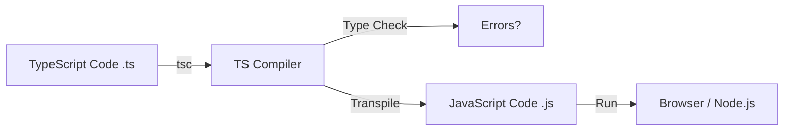
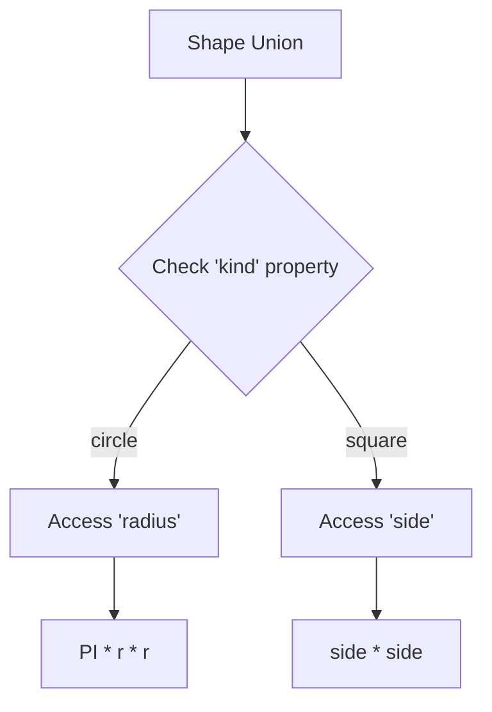

# TypeScript Interview Questions & Answers (100+)

This guide contains 100+ TypeScript interview questions, ranging from basic to advanced. Each question includes a model answer, code snippets, and potential follow-up paths based on the candidate's response.

## Part 1: Core TypeScript Basics (1-15)

### 1. What is TypeScript?

TypeScript is a superset of JavaScript developed by Microsoft that adds static typing and class-based object-oriented programming to the language. It compiles (transpiles) to plain JavaScript.

**Key Features:**
*   **Static Typing:** Checks types at compile time.
*   **Object-Oriented:** Classes, Interfaces, Inheritance.
*   **ES6+ Support:** Compiles modern JS down to older versions (ES5, ES3).

**Candidate Response Paths:**

*   **Path A: Candidate mentions "Superset".**
    *   *Follow-up:* "What does it mean to be a superset? Can I run TypeScript directly in the browser?"
    *   *Answer:* No, browsers cannot execute TS directly. It must be transpiled to JS. "Superset" means any valid JS code is also valid TS code.

*   **Path B: Candidate focuses on Types.**
    *   *Follow-up:* "Is the typing strong or weak? Static or dynamic?"
    *   *Answer:* TypeScript is statically typed (checked at compile time), but the underlying JS is dynamically typed. It allows for "any" type which effectively opts out of type checking.

### 2. What are the primitive types in TypeScript?

TypeScript supports the same primitives as JavaScript, plus a few more.

| Type | Description | Example |
| :--- | :--- | :--- |
| `number` | All numbers (integers, floats) | `let x: number = 10;` |
| `string` | Text data | `let s: string = "Hi";` |
| `boolean` | True/False | `let b: boolean = true;` |
| `null` | Intentional absence of value | `let n: null = null;` |
| `undefined` | Uninitialized variable | `let u: undefined = undefined;` |
| `symbol` | Unique identifier (ES6) | `let sym: symbol = Symbol();` |
| `bigint` | Large integers (ES2020) | `let big: bigint = 100n;` |

### 3. What is the `any` type?

`any` is a type that disables type checking for a variable. It allows you to assign any value to it and access any property or method on it without errors.

**Use Cases:**
*   Migrating a JS project to TS incrementally.
*   Working with 3rd party libraries without type definitions.

**Risk:** It defeats the purpose of TypeScript. Overusing it leads to "Anyscript".

### 4. What is `void`?

`void` represents the absence of a value. It is commonly used as the return type of functions that do not return a value.

```typescript
function logMessage(msg: string): void {
    console.log(msg);
}
```

**Candidate Response Paths:**

*   **Path A: Candidate compares with `undefined`.**
    *   *Follow-up:* "Can you assign `undefined` to a `void` variable?"
    *   *Answer:* Yes, because a function returning nothing actually returns `undefined` in JS.

### 5. What is `unknown` type?

`unknown` is the type-safe counterpart of `any`. You can assign anything to `unknown`, but you **cannot** perform operations on it (like calling methods) without first asserting or narrowing its type.

```typescript
let value: unknown = "hello";
// value.toUpperCase(); // Error: Object is of type 'unknown'.

if (typeof value === "string") {
    console.log(value.toUpperCase()); // OK
}
```

### 6. What is `never` type?

`never` represents the type of values that never occur.
Used for:
*   Functions that throw an exception.
*   Functions that have infinite loops.
*   Exhaustive type checking in switch statements.

```typescript
function error(message: string): never {
    throw new Error(message);
}
```

### 7. Explain Type Inference.

TypeScript can often infer the type of a variable when there is no explicit type annotation.

```typescript
let x = 10; // Inferred as number
// x = "hello"; // Error
```

**Candidate Response Paths:**

*   **Path A: Candidate mentions "Best Common Type".**
    *   *Follow-up:* "How does inference work for an array with mixed values like `[0, 1, null]`?"
    *   *Answer:* It tries to find a type that is a supertype of all candidates. `(number | null)[]`.

### 8. What is the difference between `let`, `const`, and `var`?

(Same as JavaScript ES6)
*   `var`: Function scoped, hoisted, can be redeclared.
*   `let`: Block scoped, not hoisted (TDZ), cannot be redeclared in same scope.
*   `const`: Block scoped, cannot be reassigned (immutable binding).

### 9. How do you define an Array in TypeScript?

Two syntaxes:
1.  `type[]`: `let list: number[] = [1, 2, 3];`
2.  `Array<type>`: `let list: Array<number> = [1, 2, 3];` (Generic syntax)

### 10. What is a Tuple?

A tuple is an array with a fixed number of elements whose types are known, but need not be the same.

```typescript
let x: [string, number];
x = ["hello", 10]; // OK
// x = [10, "hello"]; // Error
```

### 11. What is an Enum?

Enums allow defining a set of named constants. TypeScript supports both numeric and string-based enums.

```typescript
enum Direction {
    Up = 1,
    Down,
    Left,
    Right
}
```

**Candidate Response Paths:**

*   **Path A: Candidate mentions Numeric vs String Enums.**
    *   *Follow-up:* "What is a `const enum`?"
    *   *Answer:* Const enums are completely removed during compilation; usage is replaced by the literal values for performance.

### 12. What is Type Assertion?

Type assertion allows you to tell the compiler "I know more about this type than you do." It's similar to type casting in other languages but performs no special checking or restructuring of data.

Syntax:
1.  `as` syntax: `let strLength: number = (someValue as string).length;`
2.  Angle-bracket syntax: `let strLength: number = (<string>someValue).length;` (Conflict with JSX).

### 13. What is the `null` vs `undefined` difference in TS?

*   `undefined`: A variable that has been declared but not assigned a value.
*   `null`: An assignment value that acts as a representation of "no value".
By default `null` and `undefined` are subtypes of all other types (unless `strictNullChecks` is on).

### 14. What is `object` type?

`object` is a type that represents the non-primitive type (i.e., anything that is not `number`, `string`, `boolean`, `symbol`, `null`, or `undefined`).

### 15. How do you compile a TypeScript file?

Using the TypeScript Compiler (tsc).
Command: `tsc filename.ts` -> generates `filename.js`.

**Compilation Process Flow:**



## Part 2: Interfaces & Types (16-30)

### 16. Interface vs Type Alias?

| Feature | Interface | Type Alias |
| :--- | :--- | :--- |
| **Definition** | `interface User { ... }` | `type User = { ... }` |
| **Extensibility** | Can be merged (Declaration Merging) | Cannot be merged |
| **Use Case** | Defining shapes of objects/classes | Unions, Primitives, Tuples, Objects |
| **Implementation** | Can be implemented by classes | Can be implemented by classes |

**Candidate Response Paths:**

*   **Path A: Candidate prefers Interfaces.**
    *   *Follow-up:* "When MUST you use a Type Alias?"
    *   *Answer:* When defining Union types (`type Status = 'Success' | 'Fail'`) or Tuple types.

### 17. How to define optional properties in an Interface?

Use the `?` symbol.

```typescript
interface Car {
    make: string;
    model?: string; // Optional
}
```

### 18. What are Readonly properties?

Properties that can only be modified when an object is first created.

```typescript
interface Point {
    readonly x: number;
    readonly y: number;
}
```

### 19. Can interfaces extend each other?

Yes, using the `extends` keyword. An interface can extend multiple interfaces.

```typescript
interface Shape { color: string; }
interface Square extends Shape { sideLength: number; }
```

### 20. Index Signatures in Interfaces?

Used when you don't know all the names of properties beforehand but you know the shape of the values.

```typescript
interface StringArray {
    [index: number]: string;
}
```

### 21. Function Types in Interfaces?

Interfaces can describe function types.

```typescript
interface SearchFunc {
    (source: string, subString: string): boolean;
}
```

### 22. Hybrid Types?

An object that acts as both a function and an object, with additional properties.

```typescript
interface Counter {
    (start: number): string;
    interval: number;
    reset(): void;
}
```

### 23. Explain "Duck Typing" in TypeScript (Structural Typing).

TypeScript uses structural typing. If object A has all the properties of type B, then A is compatible with B, regardless of whether A explicitly implements B.

### 24. What is Literal Type?

A type that represents a specific value.

```typescript
type Easing = "ease-in" | "ease-out" | "ease-in-out";
```

### 25. What is a Union Type?

A type formed from two or more other types, representing values that may be *any one* of those types.
Operator: `|`

```typescript
function padLeft(value: string, padding: string | number) { ... }
```

### 26. What is an Intersection Type?

Combines multiple types into one. The new type has *all* features of the combined types.
Operator: `&`

```typescript
type Draggable = Drag & Drop;
```

### 27. What happens when you extend an interface with conflicting members?

It causes a compilation error unless the types are compatible. If they are not (e.g., `x: number` vs `x: string`), TS will flag it.

### 28. How to describe a Class Constructor in an Interface?

You need to define a "new" signature. Note: You cannot implement this interface directly on the class; it describes the *static* side (constructor).

```typescript
interface ClockConstructor {
    new (hour: number, minute: number): ClockInterface;
}
```

### 29. Can you implement an Interface in a Class?

Yes, using `implements`.

```typescript
class Car implements Vehicle { ... }
```

### 30. What is Declaration Merging?

If you define two interfaces with the same name, TypeScript automatically merges them into a single interface.

```typescript
interface Box { height: number; }
interface Box { width: number; }
// Box now has both height and width
```

## Part 3: Functions & Generics (31-45)

### 31. What are Generics?

Generics provide a way to make components work with any data type and not restrict them to one data type. It creates Reusable Components.

```typescript
function identity<T>(arg: T): T {
    return arg;
}
```

### 32. Generic Constraints?

 restricting the types that can be used with a generic by using `extends`.

```typescript
interface Lengthwise { length: number; }
function loggingIdentity<T extends Lengthwise>(arg: T): T {
    console.log(arg.length); // OK
    return arg;
}
```

### 33. What is `keyof` operator?

Takes an object type and produces a string or numeric literal union of its keys.

```typescript
interface Person { name: string; age: number; }
type P = keyof Person; // "name" | "age"
```

### 34. Explain Generic Utility Types: `Partial<T>`.

Constructs a type with all properties of `T` set to optional.

```typescript
function updateTodo(todo: Todo, fieldsToUpdate: Partial<Todo>) { ... }
```

### 35. Explain `Pick<T, K>`.

Constructs a type by picking the set of properties `K` from `T`.

```typescript
type TodoPreview = Pick<Todo, "title" | "completed">;
```

### 36. Explain `Omit<T, K>`.

Constructs a type by picking all properties from `T` and then removing `K`.

```typescript
type TodoPreview = Omit<Todo, "description">;
```

### 37. Explain `Record<K, T>`.

Constructs an object type whose property keys are `K` and whose property values are `T`.

```typescript
const x: Record<string, number> = { "a": 10, "b": 20 };
```

### 38. Explain `ReturnType<T>`.

Constructs a type consisting of the return type of function `T`.

```typescript
type T0 = ReturnType<() => string>; // string
```

### 39. Function Overloading in TypeScript?

You can provide multiple function signatures for the same function name. The implementation signature must be compatible with all overload signatures.

```typescript
function add(a: string, b: string): string;
function add(a: number, b: number): number;
function add(a: any, b: any): any {
    return a + b;
}
```

### 40. Rest Parameters?

Allows a function to accept an indefinite number of arguments as an array.

```typescript
function buildName(firstName: string, ...restOfName: string[]) { ... }
```

### 41. Default Parameters?

Parameters can have default values.

```typescript
function buildName(firstName: string, lastName = "Smith") { ... }
```

### 42. What is `this` typing in functions?

You can declare the type of `this` by adding a fake first parameter named `this` to the function.

```typescript
function f(this: void) {
    // make sure `this` is unusable in this standalone function
}
```

### 43. Why use Generics over `any`?

`any` loses type safety. Generics preserve the type information. If you pass a `string` to a generic function, the compiler knows the return type is also `string`.

### 44. Generic Classes?

Classes can also be generic.

```typescript
class GenericNumber<T> {
    zeroValue: T;
    add: (x: T, y: T) => T;
}
```

### 45. Using Class Types in Generics?

When creating factories in TypeScript using generics, it is necessary to refer to class types by their constructor functions.

```typescript
function create<T>(c: { new(): T; }): T {
    return new c();
}
```

## Part 4: Classes & OOP (46-60)

### 46. Access Modifiers in TypeScript?

| Modifier | Description |
| :--- | :--- |
| `public` | Accessible everywhere (Default). |
| `private` | Accessible only within the containing class. |
| `protected` | Accessible within the class and deriving classes. |

### 47. Abstract Classes?

Classes that cannot be instantiated directly. They serve as base classes. Can contain implementation details and abstract methods (must be implemented by subclass).

```typescript
abstract class Department {
    abstract printMeeting(): void; // Must be implemented
    printName(): void { console.log("Dept"); }
}
```

### 48. Parameter Properties?

A shorthand to create and initialize a member in one place.

```typescript
class Octopus {
    constructor(readonly name: string) {
        // Automatically creates a readonly property 'name' and assigns the arg
    }
}
```

### 49. Getters and Setters (Accessors)?

Intercept access to a member of an object.

```typescript
class Employee {
    private _fullName: string;
    get fullName(): string { return this._fullName; }
    set fullName(newName: string) { this._fullName = newName; }
}
```

### 50. Static Properties?

Members that are visible on the class itself rather than on the instances.

```typescript
class Grid {
    static origin = {x: 0, y: 0};
}
console.log(Grid.origin.x);
```

### 51. Readonly Modifier in Classes?

Prevents assignment to the field outside of the constructor.

### 52. Inheritance vs Composition?

*   **Inheritance:** "Is-a" relationship (Dog is an Animal). Good for hierarchy.
*   **Composition:** "Has-a" relationship (Car has an Engine). flexible, less coupling.
TypeScript supports both.

### 53. How to check if a class implements an interface at runtime?

Interfaces do not exist at runtime (they are erased). You cannot check `obj instanceof MyInterface`. You must use Type Guards.

### 54. What is a Mixin?

A way to build up classes from reusable components by combining simpler partial classes. TypeScript doesn't have a specific `mixin` keyword but supports the pattern.

### 55. Method Overriding?

A subclass can provide a specific implementation of a method that is already provided by its parent class.

### 56. `super` keyword?

*   `super()` calls the constructor of the parent class.
*   `super.method()` calls a method on the parent class.

### 57. Can a class implement multiple interfaces?

Yes. `class C implements A, B { ... }`

### 58. Can a class extend multiple classes?

No. TypeScript allows single inheritance only. Use Mixins for multiple inheritance behavior.

### 59. Difference between `private` and `#private` (JS private fields)?

*   `private`: TypeScript compile-time check. At runtime, it's just a normal property.
*   `#field`: Native JavaScript private field (ECMAScript feature). Truly private at runtime (hard privacy).

### 60. What is `strictPropertyInitialization`?

A compiler flag. Ensures that class properties are initialized in the constructor or declared with a default value.

## Part 5: Advanced Types & Type Manipulation (61-80)

### 61. What are Type Guards?

Techniques to narrow down the type of a variable within a conditional block.

1.  `typeof`: `if (typeof x === "string")`
2.  `instanceof`: `if (x instanceof Dog)`
3.  **User-Defined:** Function returning `parameter is Type`.

```typescript
function isFish(pet: Fish | Bird): pet is Fish {
    return (pet as Fish).swim !== undefined;
}
```

### 62. Discriminated Unions?

A pattern using a common literal property (the "tag") to distinguish between variants of a union.

```typescript
interface Circle { kind: "circle"; radius: number; }
interface Square { kind: "square"; side: number; }
type Shape = Circle | Square;

function getArea(s: Shape) {
    if (s.kind === "circle") { ... } // TS knows s is Circle here
}
```

**Visual Logic Flow:**



### 63. Mapped Types?

Allow you to create new types based on old ones by transforming properties.

```typescript
type Readonly<T> = {
    readonly [P in keyof T]: T[P];
}
```

### 64. Conditional Types?

Selects one of two types based on a condition expressed as a type relationship test.
Syntax: `T extends U ? X : Y`

```typescript
type TypeName<T> =
    T extends string ? "string" :
    T extends number ? "number" :
    "object";
```

### 65. `infer` keyword?

Used within conditional types to infer a type variable to be used in the true branch.

```typescript
type Unpacked<T> = T extends (infer U)[] ? U : T;
// If T is an array, extract the element type U.
```

### 66. Template Literal Types?

Build types using string literal syntax.

```typescript
type World = "world";
type Greeting = `hello ${World}`; // "hello world"
```

### 67. Explain `typeof` as a Type Operator.

Refers to the *type* of a variable or property.

```typescript
let s = "hello";
let n: typeof s; // string
```

### 68. Non-Null Assertion Operator (`!`)?

A post-fix expression operator that removes `null` and `undefined` from the type of an operand.
`x!.toFixed()` tells TS "I know x is not null here".

### 69. `declare` keyword?

Used for ambient declarations. It tells the compiler "this variable exists, trust me". Used for 3rd party libraries without types (`declare var $: any;`).

### 70. Namespace vs Module?

*   **Module:** File-based scope (ES6 modules). Preferred for modern apps.
*   **Namespace:** Internal organization of code (used to be called Internal Modules). `namespace MyMath { ... }`. Less common now.

### 71. Ambient Context?

Declarations found in `.d.ts` files. They don't generate code but define types for existing JS code.

### 72. Triple-Slash Directives?

`/// <reference path="..." />`
Used to include other files in the compilation context. mostly replaced by `import`/`export` and `tsconfig.json`.

### 73. `global` module augmentation?

Adding properties to global objects like `Window`.

```typescript
declare global {
    interface Window {
        myCustomProp: string;
    }
}
```

### 74. Recursive Types?

Types that reference themselves.

```typescript
type Json = string | number | boolean | null | { [property: string]: Json } | Json[];
```

### 75. Covariance vs Contravariance?

*   **Covariance:** A derived type is accepted where a base type is expected (Arrays, Return types).
*   **Contravariance:** A base type is accepted where a derived type is expected (Function arguments).

### 76. `const` assertions?

`as const` allows you to create fully readonly, literal types.

```typescript
let x = "hello" as const; // Type is "hello", not string
let arr = [10, 20] as const; // Type is readonly [10, 20]
```

### 77. `import type`?

Explicitly imports *only* type information. These imports are completely removed at runtime.

```typescript
import type { User } from './user';
```

### 78. What is `this` parameter in callbacks?

If a library calls a callback with a specific `this` context, you can type it.

```typescript
interface UIElement {
    addClickListener(onclick: (this: void, e: Event) => void): void;
}
```

### 79. Satisfies operator?

(TS 4.9+) Validates that an expression matches a type, without changing the expression's type (preserves narrowing).

```typescript
const palette = {
    red: [255, 0, 0],
    green: "#00ff00",
} satisfies Record<string, string | number[]>;
// palette.red is still number[], not string | number[]
```

### 80. Awaited<T>?

Unwraps Promises recursively.
`Awaited<Promise<string>>` -> `string`.

## Part 6: Configuration & Tooling (81-90)

### 81. What is `tsconfig.json`?

The root of a TypeScript project. Configures the compiler options and specifies which files to include.

### 82. Important Compiler Options?

*   `target`: JS version to output (ES5, ES6, ES2020).
*   `module`: Module system (CommonJS, ESNext).
*   `outDir`: Where to put compiled files.
*   `strict`: Enables all strict type checking options.

### 83. What is `strict: true`?

Enables:
*   `noImplicitAny`
*   `strictNullChecks`
*   `strictFunctionTypes`
*   `strictPropertyInitialization`
*   etc.

### 84. `noImplicitAny`?

Raises error on expressions and declarations with an implied `any` type.

### 85. `sourceMap`?

Generates `.map` files. Allows debugging the original TypeScript code in the browser/debugger instead of the compiled JS.

### 86. How to use TypeScript with React?

Use `.tsx` extension. Install `@types/react` and `@types/react-dom`.
Generics in JSX might need a trailing comma to distinguish from tags: `<T,>(arg: T) => ...` or use `extends`: `<T extends unknown>`.

### 87. What are DefintelyTyped and `@types`?

DefinitelyTyped is a repository of high-quality TypeScript type definitions.
`@types/package` packages are installed to provide types for JS libraries.

### 88. How to handle 3rd party library without types?

1.  Check for `@types/package`.
2.  Create a `global.d.ts` and add `declare module 'package';`.

### 89. Difference between `dependencies` and `devDependencies` for types?

Types used only for development/testing (like `@types/jest`) go in `devDependencies`. Types required for the library consumers (if publishing a library) might belong in `dependencies`, though typically published libraries bundle their own types.

### 90. `skipLibCheck`?

Skips type checking of declaration files (`.d.ts`). Speeds up compilation.

## Part 7: Ecosystem & Best Practices (91-100)

### 91. TypeScript vs JavaScript performance?

Runtime performance is the same (TS compiles to JS).
Dev time performance: TS adds a compilation step, but catches errors early, potentially saving debugging time.

### 92. When NOT to use TypeScript?

*   Very small scripts.
*   Prototyping where speed of change > safety.
*   Team completely unfamiliar with static typing (learning curve).

### 93. Best practice for migrating to TS?

1.  Enable `allowJs: true`.
2.  Rename files `.js` -> `.ts` one by one.
3.  Fix strict errors.
4.  Avoid `any`.

### 94. Explain Type Erasure.

TypeScript types are erased during compilation. They leave no trace in the runtime JavaScript code. You cannot rely on TS types for runtime logic.

### 95. Dependency Injection in TS?

TS works well with DI patterns. In Angular/NestJS, constructor injection is heavily used with TS types as tokens.

### 96. Formatting and Linting?

*   **ESLint:** Standard linter (TSLint is deprecated).
*   **Prettier:** Code formatter.

### 97. Project References?

Allow structuring a TS program into smaller pieces. Improves build times by allowing incremental builds of components.

### 98. TS with Node.js?

Node cannot run TS natively. Use `ts-node` for dev, or compile with `tsc` and run `node dist/index.js` for production.

### 99. Module Resolution Strategies?

*   **Classic:** Old strategy.
*   **Node:** Mimics Node.js resolution mechanism (looks in `node_modules`). Default for modern apps.

### 100. Future of TypeScript?

Continues to align with ECMAScript standards. Features often move from TS -> Stage X ES Proposal -> ES Standard. TS aims to "disappear" when compiled.

---

**End of Interview Questions**
