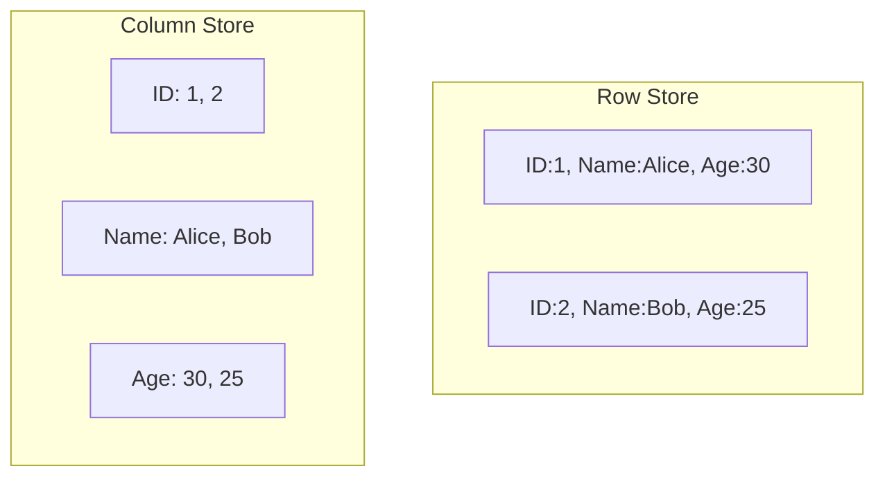
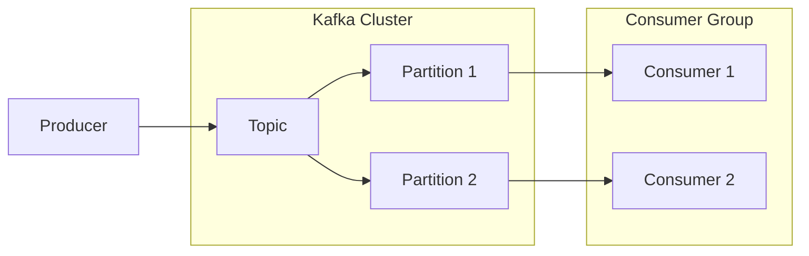

# Data Infrastructure Interview Questions & Answers (100+)

This guide contains 100+ Data Infrastructure interview questions, ranging from storage systems to distributed computing and orchestration. Each question includes a model answer and potential follow-up paths.

## Part 1: Data Storage & Databases (1-20)

### 1. What is the difference between SQL (Relational) and NoSQL databases?

| Feature | SQL (Relational) | NoSQL (Non-Relational) |
| :--- | :--- | :--- |
| **Schema** | Rigid, predefined schema | Flexible, dynamic schema |
| **Scaling** | Vertical (Scale-up) | Horizontal (Scale-out) |
| **ACID** | Strong ACID compliance | Often BASE (Eventual Consistency) |
| **Use Case** | Complex queries, transactions | Big Data, real-time apps, unstructured data |

**Candidate Response Paths:**

*   **Path A: Candidate mentions Scalability.**
    *   *Follow-up:* "Why is it harder to horizontally scale a SQL database compared to NoSQL?"
    *   *Answer:* SQL relies on joins and strict consistency (ACID), which are difficult to maintain across distributed nodes without significant performance penalties (distributed transactions).

### 2. Explain the CAP Theorem.

In a distributed data store, you can only guarantee two of the three properties:
*   **Consistency:** Every read receives the most recent write or an error.
*   **Availability:** Every request receives a (non-error) response, without the guarantee that it contains the most recent write.
*   **Partition Tolerance:** The system continues to operate despite an arbitrary number of messages being dropped or delayed by the network between nodes.

**Candidate Response Paths:**

*   **Path A: Candidate says "You pick 2".**
    *   *Follow-up:* "Can you really choose CA in a distributed system?"
    *   *Answer:* No. In a distributed system, network partitions *will* happen. So you really choose between CP (Consistency + Partition Tolerance) and AP (Availability + Partition Tolerance) when a partition occurs.

### 3. What is the difference between Row-Oriented and Column-Oriented storage?

*   **Row-Oriented (e.g., Postgres, MySQL):** Stores data row by row. Efficient for writing data and fetching entire rows (OLTP).
*   **Column-Oriented (e.g., Redshift, Snowflake, Parquet):** Stores data column by column. Efficient for reading specific columns and aggregations (OLAP).

### 4. What is ACID compliance?

*   **Atomicity:** All or nothing.
*   **Consistency:** Valid state to valid state.
*   **Isolation:** Transactions do not interfere.
*   **Durability:** Committed data is saved permanently.

### 5. What is BASE?

*   **Basically Available:** The system guarantees availability.
*   **Soft state:** The state of the system may change over time, even without input.
*   **Eventual consistency:** The system will eventually become consistent once it stops receiving input.

### 6. What is the difference between a Data Lake and a Data Warehouse?

| Feature | Data Lake | Data Warehouse |
| :--- | :--- | :--- |
| **Data Structure** | Raw, unstructured, semi-structured | Processed, structured, schema-on-write |
| **Purpose** | Data science, ML, exploration | BI, Reporting, Analytics |
| **Storage** | S3, HDFS, GCS | Snowflake, Redshift, BigQuery |
| **Cost** | Low | High |

### 7. What is a Data Lakehouse?

A hybrid architecture that combines the low-cost storage and flexibility of a Data Lake with the management and ACID features of a Data Warehouse.
*   *Key Tech:* Delta Lake, Apache Iceberg, Apache Hudi.

### 8. Explain Consistent Hashing.

A technique used in distributed systems to distribute data across nodes. It maps both data and nodes to a circle. When a node is added/removed, only `k/n` keys need to be remapped (where `k` is total keys, `n` is nodes), unlike traditional `mod n` hashing which requires remapping nearly all keys.

### 9. What is Replication Factor?

The number of times a piece of data is copied across different nodes to ensure durability and availability.
*   *Standard:* Often 3 (1 original + 2 copies).

### 10. What is Sharding?

Partitioning a database horizontally into smaller chunks (shards) spread across multiple servers.
*   *Sharding Key:* The field used to determine which shard data belongs to (e.g., `user_id`).

### 11. What is the "Hot Partition" problem?

When the sharding key is unevenly distributed (e.g., sharding by "country" and 90% of users are in the US), one shard receives most of the traffic, becoming a bottleneck.
*   *Fix:* Choose a better sharding key or use salt.

### 12. Explain the difference between `DELETE` and `COMPACTION` in Log-Structured Merge (LSM) trees (like Cassandra/RocksDB).

*   **Delete:** A "Tombstone" marker is written to indicate the record is deleted. The data is not immediately removed.
*   **Compaction:** A background process that merges SSTables, discarding obsolete data (overwritten values) and tombstones, reclaiming space.

### 13. What is Bloom Filter?

A probabilistic data structure used to test whether an element is a member of a set.
*   Returns "Possibly in set" or "Definitely not in set".
*   Used in databases (Cassandra, HBase) to avoid expensive disk lookups for non-existent rows.

### 14. What is CDC (Change Data Capture)?

A pattern to identify and track changes to data in a database and deliver them to downstream systems (like a Data Warehouse or Cache) in real-time.
*   *Tools:* Debezium, AWS DMS.

### 15. What is partitioning in Hive/Iceberg?

Organizing data into subdirectories based on column values (e.g., `date=2023-01-01`). This allows the query engine to skip reading files that don't match the query filter (**Partition Pruning**).

### 16. What is the difference between Star Schema and Snowflake Schema?

*   **Star Schema:** One fact table, denormalized dimension tables. Faster queries (fewer joins).
*   **Snowflake Schema:** Dimensions are normalized. Saves space, but slower (more joins).

### 17. What is an Inverted Index?

A data structure used in Search Engines (Elasticsearch, Solr). It maps content (words) to their location in a document/database.
*   *Example:* "Apple" -> Doc1, Doc5, Doc8.

### 18. Why use Parquet format?

*   **Columnar Storage:** Only read needed columns.
*   **Compression:** Efficient encoding (Run-Length, Dictionary) due to similar data types in columns.
*   **Schema Evolution:** Supports adding columns.
*   **Predicate Pushdown:** Statistics (min/max) in file metadata allow skipping blocks.

### 19. What is Object Storage (S3) vs Block Storage (EBS)?

*   **Object (S3):** Flat address space, HTTP API access, high latency, immutable objects, cheap. Good for Data Lakes.
*   **Block (EBS):** mounted volume, low latency, file system interface. Good for Database OS/Storage.

### 20. What is Time-Series Database (TSDB)?

Optimized for handling time-stamped data (metrics, IoT).
*   *Optimizations:* High write throughput, efficient time-range queries, downsampling/rollups.
*   *Examples:* InfluxDB, Prometheus, TimescaleDB.

## Part 2: Data Processing & Compute (21-40)

### 21. Explain the MapReduce paradigm.

1.  **Map:** Process input key/value pairs to generate intermediate key/value pairs.
2.  **Shuffle/Sort:** Group intermediate data by key.
3.  **Reduce:** Aggregate values for each key.

### 22. What is the difference between Spark and Hadoop MapReduce?

| Feature | Hadoop MapReduce | Apache Spark |
| :--- | :--- | :--- |
| **Processing** | Disk-based (writes to HDFS between steps) | In-memory (DAG execution) |
| **Speed** | Slower | 10-100x Faster |
| **API** | Verbose Java | Concise Python/Scala/SQL |
| **Workloads** | Batch only | Batch, Streaming, ML, Graph |

### 23. What are Spark RDDs?

**Resilient Distributed Datasets.**
*   Immutable collection of objects.
*   Distributed across cluster.
*   Lazily evaluated.
*   Fault-tolerant (recomputes partitions on failure using lineage).

### 24. RDD vs DataFrame vs Dataset in Spark?

*   **RDD:** Low-level, type-safe (Java/Scala), no optimization engine.
*   **DataFrame:** RDD + Schema. Optimized by Catalyst Optimizer. Untyped (Row objects).
*   **Dataset:** Type-safe DataFrame (Scala/Java). Best of both worlds.

### 25. Explain Spark Lazy Evaluation.

Spark does not execute transformations (map, filter) immediately. It builds a **DAG (Directed Acyclic Graph)** of instructions. Execution only starts when an **Action** (count, collect, save) is called. This allows optimization (pipeline fusion).

### 26. Transformation vs Action in Spark?

*   **Transformation (Lazy):** map, filter, groupBy, join. Returns a new DataFrame/RDD.
*   **Action (Eager):** count, show, write, collect. Triggers computation.

### 27. What is a Shuffle in Spark?

Redistributing data across partitions (and nodes). Occurs during `groupBy`, `join`, `repartition`.
*   *Impact:* Expensive (Disk I/O, Network I/O, Serialization).

### 28. What is Broadcast Join?

Optimization where the smaller table is sent (broadcast) to all worker nodes. This avoids shuffling the large table.
*   *Condition:* Small table must fit in memory.

### 29. What is Data Skew?

When data is unevenly distributed across partitions. One task takes much longer than others, delaying the entire job.
*   *Fix:* Salting keys, broadcast join, increasing parallelism.

### 30. Coalesce vs Repartition in Spark?

*   **Repartition:** Full shuffle. Can increase or decrease partitions. Balances data.
*   **Coalesce:** No shuffle (merges local partitions). Only decreases partitions. Faster.

### 31. What is the Catalyst Optimizer?

Spark's internal engine that optimizes DataFrames/SQL.
1.  Analysis (Resolve refs).
2.  Logical Optimization (Predicate pushdown, constant folding).
3.  Physical Planning (Choose join strategies).
4.  Code Generation (Java bytecode).

### 32. What is Tungsten Execution Engine?

Spark's backend that optimizes memory and CPU.
*   Manages memory explicitly (off-heap) to avoid GC pauses.
*   Uses cache-aware computation.

### 33. Explain "Predicate Pushdown".

Pushing filtering logic (`WHERE` clause) as close to the data source as possible.
*   *Example:* Instead of reading a whole Parquet file and filtering in Spark, Spark tells the Parquet reader to only return rows matching the filter.

### 34. What is Vectorized Execution?

Processing data in batches (vectors) of rows (columnar format) rather than row-by-row. Reduces CPU overhead (virtual function calls).

### 35. Batch vs Stream Processing?

*   **Batch:** Process finite data. High latency, high throughput. (Historical analysis).
*   **Stream:** Process infinite data. Low latency. (Real-time alerting).

### 36. What is Windowing in Streaming?

Grouping events by time.
*   **Tumbling Window:** Non-overlapping (00:00-00:05, 00:05-00:10).
*   **Sliding Window:** Overlapping (00:00-00:05, 00:01-00:06).
*   **Session Window:** Based on activity gaps.

### 37. Event Time vs Processing Time?

*   **Event Time:** When the event actually happened (timestamp in payload).
*   **Processing Time:** When the system received the event.
*   *Challenge:* Late arriving data.

### 38. What is Watermarking?

A threshold to handle late data in event-time processing. "I will wait 10 minutes for late events, then drop them/process them separately."

### 39. Exactly-Once Semantics (EOS)?

Ensuring each message is processed exactly once, even if failures occur.
*   *Spark Structured Streaming:* Uses Checkpoints + Idempotent Sinks.
*   *Flink:* Uses Chandy-Lamport (Distributed Snapshots).

### 40. What is Backpressure?

When the consumer is slower than the producer. The system must slow down the producer or buffer data to prevent crashing.

## Part 3: Data Modeling & Warehousing (41-60)

### 41. What is Dimensional Modeling?

A design technique for data warehouses (Ralph Kimball) optimized for query performance.
*   **Facts:** Measurements (Sales Amount).
*   **Dimensions:** Context (Product, Date, Customer).

### 42. Fact vs Dimension Table?

*   **Fact:** Long and narrow. Frequent updates (appends). Numeric metrics. Foreign keys.
*   **Dimension:** Short and wide. Descriptive text. Primary keys.

### 43. Types of Fact Tables?

1.  **Transaction:** One row per event.
2.  **Periodic Snapshot:** One row per period (e.g., daily balance).
3.  **Accumulating Snapshot:** One row per lifecycle (e.g., Order placed -> shipped -> delivered).

### 44. Slowly Changing Dimensions (SCD)?

How to handle changes in dimension attributes (e.g., Customer moves address).
*   **Type 0:** No change allowed.
*   **Type 1:** Overwrite (History lost).
*   **Type 2:** Add new row with version/dates (History preserved).
*   **Type 3:** Add new column (Current vs Previous).

### 45. What is a Surrogate Key?

An artificial primary key (usually integer) added to a dimension table, independent of the business/source system key.
*   *Why?* Source keys might change or be reused. Faster joins (int vs string).

### 46. What is the Grain of a table?

The level of detail represented by a single row.
*   *Example:* "Line Item per Order" vs "One row per Order".

### 47. Explain 3NF vs Star Schema.

*   **3NF (Inmon):** Minimize redundancy. Good for consistency and storage. Harder to query (many joins).
*   **Star Schema (Kimball):** Denormalized. Redundant data. Optimized for fast read queries.

### 48. What is OBT (One Big Table)?

Denormalizing everything into a single massive table.
*   *Pros:* No joins, very fast for columnar stores (BigQuery/Snowflake).
*   *Cons:* Data duplication, update anomalies.

### 49. What is a Semantic Layer?

An abstraction layer between raw data and BI tools. It defines business logic (metrics like "Churn Rate") in code (e.g., LookML, dbt metrics) so all tools use the same definition.

### 50. Explain dbt (data build tool).

A tool that allows data analysts to transform data in their warehouse using SQL `SELECT` statements. It handles dependency management, testing, and documentation (T in ELT).

**Candidate Response Paths:**

*   **Path A: Candidate focuses on "View vs Table".**
    *   *Follow-up:* "How does dbt decide whether to materialize a model as a view or a table?"
    *   *Answer:* It is configured in the `dbt_project.yml` or the model config block (e.g., `{{ config(materialized='table') }}`).

*   **Path B: Candidate mentions Jinja.**
    *   *Follow-up:* "What is the benefit of using Jinja in SQL?"
    *   *Answer:* It allows control structures (loops, if/else) and environment variables to be injected into standard SQL, enabling dynamic query generation.

### 51. ETL vs ELT?

*   **ETL (Extract, Transform, Load):** Transform before loading. Legacy (expensive on-prem hardware).
*   **ELT (Extract, Load, Transform):** Load raw data first, then transform in the warehouse. Modern (scalable cloud compute).

### 52. What is Data Governance?

Policies and procedures to ensure data availability, usability, integrity, and security. (Who owns this data? Is it PII? Is it correct?)

### 53. What is Data Lineage?

Tracking the flow of data from origin to destination. Helps debugging ("Why is this report wrong?" -> trace back upstream).

### 54. What is a Data Mesh?

A socio-technical architecture where data is treated as a product and owned by domain teams (not a central data team). Decentralized.

### 55. What is a Data Fabric?

A centralized architecture that uses metadata and automation to weave together data from disparate sources.

### 56. Handling PII (Personally Identifiable Information)?

*   **Encryption:** At rest and in transit.
*   **Masking/Tokenization:** Hiding real values in non-production.
*   **Access Control:** RBAC/Row-level security.

### 57. What is Data Quality?

Dimensions:
1.  **Accuracy:** Reality match.
2.  **Completeness:** No missing values.
3.  **Consistency:** Same across systems.
4.  **Timeliness:** Available when needed.

### 58. How to test data?

*   **Schema Tests:** Null checks, unique keys.
*   **Business Logic Tests:** `order_date <= ship_date`.
*   **Volume Tests:** Row count drops by 50%.
*   *Tools:* Great Expectations, dbt tests.

### 59. What is Idempotency in Data Pipelines?

Running the same pipeline multiple times produces the same result.
*   *Essential for:* Backfills and retries.
*   *Implementation:* `INSERT OVERWRITE` partition, `MERGE` statements.

### 60. What is "Schema on Read" vs "Schema on Write"?

*   **Schema on Write (RDBMS):** Define structure before inserting.
*   **Schema on Read (Hadoop/Lake):** Store raw files, define structure when querying.

## Part 4: Streaming & Messaging (61-80)

### 61. What is Apache Kafka?

A distributed event streaming platform. It acts as a high-throughput, low-latency, fault-tolerant message bus.

### 62. Explain Kafka Architecture.

*   **Producer:** Sends messages.
*   **Broker:** Server storing data.
*   **Topic:** Category for messages.
*   **Partition:** Shard of a topic (unit of parallelism).
*   **Consumer:** Reads messages.
*   **Consumer Group:** Set of consumers sharing work.

### 63. How does Kafka guarantee order?

Order is guaranteed **only within a partition**. There is no global order across a topic.

### 64. What is a Kafka Offset?

A unique integer ID assigned to each message in a partition. Consumers track their progress by committing offsets.

### 65. What is Log Compaction in Kafka?

Ensures that Kafka retains at least the last known value for each message key within the log of data for a single topic partition. Good for restoring state.

### 66. Kafka vs RabbitMQ?

*   **Kafka:** Log-based. "Dumb" broker, "Smart" consumer. High throughput. Data persistence (replayable).
*   **RabbitMQ:** Queue-based. "Smart" broker (routing logic). Low latency. Messages removed after consumption.

### 67. Pull vs Push model?

*   **Kafka (Pull):** Consumer requests data. Better flow control (prevents overwhelming consumer).
*   **Push:** Broker sends data immediately. Lower latency, but risk of flooding consumer.

### 68. What is a Dead Letter Queue (DLQ)?

A queue where messages that fail processing (e.g., malformed JSON) are sent, so they don't block the main pipeline.

### 69. SerDe (Serializer/Deserializer)?

Converting objects to bytes (Serialize) for network/disk and back (Deserialize).
*   *Formats:* Avro, Protobuf, JSON.

### 70. Why use Avro with Kafka?

*   **Schema Evolution:** Handles adding/removing fields.
*   **Compact:** Binary format, stores schema separately (Schema Registry).

### 71. What is Schema Registry?

A central server that stores schemas (Avro/Protobuf) for Kafka topics. Producers check compatibility before sending. Consumers download schema to deserialize.

### 72. At-Most-Once vs At-Least-Once delivery?

*   **At-Most-Once:** Fire and forget. Message might be lost, but never duplicated.
*   **At-Least-Once:** Retry until ack. No loss, but duplicates possible. (Standard for Kafka).

### 73. What is ISR (In-Sync Replicas)?

Replicas that are fully caught up with the leader. Only ISRs are eligible to become new leaders if the current leader fails.

### 74. Consumer Lag?

Difference between the latest offset produced and the latest offset committed by the consumer. High lag = System falling behind.

### 75. Kafka Connect?

Framework for connecting Kafka with external systems.
*   **Source Connector:** DB -> Kafka.
*   **Sink Connector:** Kafka -> S3/Snowflake.

### 76. Lambda Architecture?

Hybrid approach handling batch and stream.
*   **Batch Layer:** Master dataset (accurate, historical).
*   **Speed Layer:** Real-time (approximate, recent).
*   **Serving Layer:** Merges results.
*   *Cons:* Maintaining two codebases.

### 77. Kappa Architecture?

Simplify Lambda. **Everything is a stream.**
*   Real-time processing handles new data.
*   Reprocessing history = Replaying the stream.
*   *Pros:* One codebase.

### 78. What is Pulsar?

Alternative to Kafka.
*   Separates Compute (Brokers) from Storage (BookKeeper).
*   Better support for multi-tenancy and geo-replication.

### 79. Kinesis vs Kafka?

*   **Kinesis:** AWS Managed. Easy to setup. Pay per shard. Hard limits (1MB/sec write per shard).
*   **Kafka:** Self-hosted (or MSK/Confluent). Infinite scaling. Operational overhead.

### 80. Flink State Management?

Flink stores state (e.g., current sum) locally in memory/RocksDB. Periodically checkpoints state to remote storage (S3) for fault tolerance.

**Candidate Response Paths:**

*   **Path A: Candidate mentions Checkpoints.**
    *   *Follow-up:* "What happens if you don't enable checkpointing?"
    *   *Answer:* If the job fails, it restarts from the beginning (or loses state), effectively providing 'at-most-once' semantics instead of 'exactly-once'.

## Part 5: Infrastructure & Orchestration (81-100)

### 81. What is Apache Airflow?

A platform to programmatically author, schedule, and monitor workflows (DAGs). "Workflow as Code".

### 82. Airflow DAG (Directed Acyclic Graph)?

Collection of tasks with dependencies.
*   *Rule:* No loops allowed.

### 83. Airflow Operator vs Sensor?

*   **Operator:** Performs a task (BashOperator, PythonOperator).
*   **Sensor:** Waits for an external event (S3KeySensor, HttpSensor).

### 84. Airflow Scheduler?

Monitors DAGs and tasks, triggers task instances whose dependencies have been met.

### 85. Airflow Executor?

Decides *where* to run tasks.
*   **Sequential:** Local, debug only.
*   **Celery:** Distributed workers (Redis/RabbitMQ).
*   **Kubernetes:** One pod per task.

### 86. What is Backfilling in Airflow?

Running a DAG for a past time period (e.g., re-running last month's data with new logic).

### 87. XComs (Cross-Communication)?

Mechanism for Airflow tasks to exchange small amounts of data (metadata). Stored in Airflow DB. *Do not use for large dataframes!*

### 88. Dagster vs Airflow?

*   **Airflow:** Task-based. Focus on execution order.
*   **Dagster:** Asset-based (Software-Defined Assets). Focus on the data produced. "I need table X, build whatever is needed."

### 89. Infrastructure as Code (IaC)?

Managing infrastructure (Servers, DBs, Buckets) via code files (Terraform, CloudFormation) rather than manual GUI clicks.
*   *Benefits:* Version control, reproducibility.

### 90. Terraform State?

A file (`terraform.tfstate`) that maps real-world resources to your configuration, keeps track of metadata, and improves performance for large infrastructures.

### 91. Immutable Infrastructure?

Servers are never modified after deployment. If you need to update, you replace the entire server with a new one. (e.g., Docker containers).

### 92. Docker vs Virtual Machine?

*   **VM:** Virtualizes hardware. Has full OS. Heavy.
*   **Docker:** Virtualizes OS (Kernel). Shared kernel. Lightweight.

### 93. Kubernetes (K8s)?

Orchestration system for containers. Handles deployment, scaling, and management.
*   **Pod:** Smallest unit (one or more containers).
*   **Service:** Network abstraction.

### 94. Helm Charts?

Package manager for Kubernetes. Templatized YAML files to deploy complex apps.

### 95. CI/CD in Data?

*   **CI (Continuous Integration):** Lint SQL, test Python models, validate DAGs on commit.
*   **CD (Continuous Deployment):** Auto-deploy changes to Staging/Prod.

### 96. Blue/Green Deployment?

Two identical environments.
*   **Blue:** Live.
*   **Green:** New version.
*   Switch traffic Blue -> Green. Easy rollback.

### 97. Canary Deployment?

Roll out change to a small subset of users/servers. Monitor metrics. If good, roll out to rest.

### 98. Observability in Data?

*   **Metrics:** Latency, row counts. (Prometheus/Grafana).
*   **Logs:** Error messages. (ELK/Splunk).
*   **Traces:** Distributed request path. (OpenTelemetry).
*   **Data Reliability:** Freshness, distribution. (Monte Carlo).

### 99. FinOps in Cloud Data?

Managing cloud costs.
*   *Strategies:* Spot instances, auto-scaling, lifecycle policies (S3 IA/Glacier), tagging resources.

### 100. Serverless Data Architecture?

Using managed services where you don't manage servers.
*   *Examples:* AWS Lambda, Fargate, Glue, Athena, BigQuery.
*   *Pros:* Zero maintenance, scale to zero cost.
*   *Cons:* Cold starts, execution limits.

---
**End of Questions**
