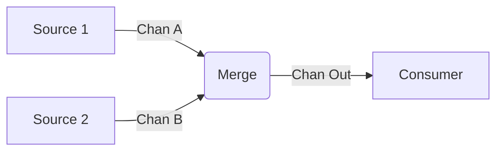

# Golang Interview Questions & Answers (100+)

This guide contains 100+ Go (Golang) interview questions, ranging from basic syntax to advanced concurrency and runtime internals. Each question includes a model answer and potential follow-up paths based on the candidate's response.

## Part 1: Basic Go Concepts (1-20)

### 1. What is Go and what are its main characteristics?

Go is an open-source programming language created at Google. It is statically typed, compiled, and designed for simplicity, concurrency, and performance.

**Key Characteristics:**
*   **Simple Syntax:** Easy to learn and read.
*   **Static Typing:** Catches errors at compile time.
*   **Concurrency Primitives:** Built-in support for concurrent execution (Goroutines, Channels).
*   **Garbage Collection:** Automatic memory management.
*   **Fast Compilation:** Fast build times.

**Candidate Response Paths:**

*   **Path A: Candidate mentions 'Object-Oriented'.**
    *   *Follow-up:* "Is Go an Object-Oriented language?"
    *   *Answer:* Go has some OO features (methods, interfaces), but it lacks inheritance and type hierarchy. It prefers composition over inheritance.

### 2. What is the difference between `GOPATH` and Go Modules?

*   **GOPATH:** The legacy way of managing workspace. Code must live inside `$GOPATH/src`. No built-in versioning.
*   **Go Modules (go.mod):** The modern dependency management system (introduced in Go 1.11). Allows code to live anywhere. Supports semantic versioning.

**Chart: Comparison**

| Feature | GOPATH | Go Modules |
| :--- | :--- | :--- |
| Workspace | Strict (`$GOPATH/src`) | Flexible (Anywhere) |
| Versioning | No (relied on master) | Yes (Semantic Versioning) |
| Dependency Loc | Global (`$GOPATH/pkg`) | Local cache + `go.sum` verification |

### 3. How do you define public (exported) vs private (unexported) symbols?

In Go, visibility is controlled by the case of the first letter of the identifier.
*   **Uppercase (e.g., `User`):** Public/Exported. Visible to other packages.
*   **Lowercase (e.g., `user`):** Private/Unexported. Visible only within the same package.

### 4. What are the basic data types in Go?

*   **Boolean:** `bool`
*   **Numeric:** `int`, `int8`, `int16`, `int32`, `int64`, `uint`, `float32`, `float64`, `complex64`, `complex128`.
*   **String:** `string` (immutable).
*   **Byte:** `byte` (alias for `uint8`).
*   **Rune:** `rune` (alias for `int32`, represents a Unicode code point).

### 5. What are pointers in Go?

A pointer holds the memory address of a value.
*   `&` operator generates a pointer to its operand.
*   `*` operator dereferences a pointer (accesses the value).

**Candidate Response Paths:**

*   **Path A: Comparison with C.**
    *   *Follow-up:* "Does Go support pointer arithmetic?"
    *   *Answer:* No, Go does not support pointer arithmetic (like `ptr++`) by default, to ensure safety. You can use `unsafe` package if absolutely necessary.

### 6. Explain the difference between Arrays and Slices.

| Feature | Array | Slice |
| :--- | :--- | :--- |
| Size | Fixed length (`[5]int`) | Dynamic length (`[]int`) |
| Value/Ref | Value type (copying copies whole array) | Reference type (points to underlying array) |
| Flexibility | Rigid | Flexible |

**Candidate Response Paths:**

*   **Path A: Slice internals.**
    *   *Follow-up:* "What are the three components of a slice?"
    *   *Answer:* Pointer to underlying array, Length (`len`), and Capacity (`cap`).

### 7. What is a Map?

A built-in data structure that associates keys with values (Hash Table).
*   Syntax: `map[KeyType]ValueType`.
*   KeyType must be comparable (supports `==`).

### 8. What is a Struct?

A typed collection of fields. It is the closest thing to a "class" in Go, used to group data.

```go
type Person struct {
    Name string
    Age  int
}
```

### 9. Difference between Functions and Methods?

*   **Function:** Standalone code block. `func Add(a, b int) int`.
*   **Method:** A function attached to a specific type (receiver). `func (p Person) Greet()`.

### 10. What is `defer`?

A keyword used to schedule a function call to be run after the function completes.
Commonly used for cleanup (closing files, unlocking mutexes).
Executed in LIFO (Last-In-First-Out) order.

**Candidate Response Paths:**

*   **Path A: Evaluation time.**
    *   *Follow-up:* "When are the arguments to a deferred function evaluated?"
    *   *Answer:* They are evaluated immediately when the `defer` statement is executed, not when the function runs.

### 11. What is `panic` and `recover`?

*   **Panic:** Stops normal execution. Similar to throwing an exception.
*   **Recover:** Used inside a deferred function to regain control of a panicking goroutine.

### 12. Difference between `make` and `new`?

*   `new(T)`: Allocates zeroed storage for a new item of type `T` and returns its address `*T`. Used for all types.
*   `make(T, args)`: Creates slices, maps, and channels only. Returns an initialized `T` (not a pointer).

### 13. What is the `init()` function?

A special function that executes before `main()`. It is used for package initialization.
*   Can have multiple `init()` functions per package (and per file).
*   Cannot be called explicitly.

### 14. What is the Blank Identifier `_`?

It is a write-only variable used to discard values.
*Example:* `_, err := os.Open("file.txt")` (if you don't care about the file handle).

### 15. What are Type Assertions?

Used to extract the underlying value of a specific type from an interface.

```go
var i interface{} = "hello"
s := i.(string) // panic if not string
s, ok := i.(string) // safe check
```

### 16. What is a Type Switch?

A switch statement that compares types rather than values.

```go
switch v := i.(type) {
case int:
    fmt.Println("Integer")
case string:
    fmt.Println("String")
}
```

### 17. How do Constants work (iota)?

Constants are immutable values known at compile time.
`iota` is a counter used to create enumerated constants.

```go
const (
    Red = iota // 0
    Blue       // 1
    Green      // 2
)
```

### 18. Is Go pass-by-value or pass-by-reference?

Go is strictly **pass-by-value**.
When passing a pointer, a copy of the pointer address is passed.
When passing a slice, a copy of the slice header (ptr, len, cap) is passed, so modifications to elements affect the original array, but `append` might not.

### 19. How are Strings handled in Go?

Strings are immutable sequences of bytes (UTF-8 encoded).
*   Backticks (`` ` ``) create raw string literals (multiline).
*   Double quotes (`""`) create interpreted string literals.

### 20. Explain the `for` loop variations.

Go has only one looping keyword: `for`.

1.  **C-style:** `for i := 0; i < 10; i++ {}`
2.  **While-style:** `for i < 10 {}`
3.  **Infinite:** `for {}`
4.  **Range:** `for index, value := range slice {}`

## Part 2: Concurrency & Channels (21-40)

### 21. What is a Goroutine?

A goroutine is a lightweight thread of execution managed by the Go runtime.
*   Started with the `go` keyword.
*   Very cheap start-up cost (few KB of stack).

### 22. How do Goroutines differ from OS threads?

| Feature | Goroutine | OS Thread |
| :--- | :--- | :--- |
| Stack Size | Growable (starts ~2KB) | Fixed (usually ~1MB) |
| Scheduling | M:N Model (Go Runtime) | Kernel Managed |
| Switch Cost | Low (user space) | High (kernel context switch) |

### 23. What is a Channel?

A typed conduit through which goroutines communicate and synchronize.
*   **Send:** `ch <- v`
*   **Receive:** `v := <-ch`

### 24. Difference between Buffered and Unbuffered Channels?

*   **Unbuffered:** `make(chan int)`. Sender blocks until receiver is ready. Guarantees synchronization.
*   **Buffered:** `make(chan int, 5)`. Sender only blocks if buffer is full. Receiver blocks if buffer is empty.

### 25. What happens if you send to a closed channel?

It causes a **panic**.

### 26. What happens if you read from a closed channel?

*   It returns the **zero value** of the channel's type immediately (does not block).
*   The second return value (boolean) indicates if the channel is open: `val, ok := <-ch`. `ok` will be `false`.

### 27. What is the `select` statement?

The `select` statement lets a goroutine wait on multiple communication operations. It blocks until one of its cases can run, then it executes that case. If multiple are ready, it chooses one at random.

```go
select {
case msg1 := <-c1:
    fmt.Println("received", msg1)
case msg2 := <-c2:
    fmt.Println("received", msg2)
default:
    fmt.Println("no message received") // Non-blocking
}
```

### 28. What is `sync.WaitGroup`?

It waits for a collection of goroutines to finish.
*   `Add(n)`: Increases counter.
*   `Done()`: Decrements counter.
*   `Wait()`: Blocks until counter is 0.

### 29. What is `sync.Mutex`?

A mutual exclusion lock. Used to protect shared memory (critical sections) from concurrent access.
*   `Lock()`
*   `Unlock()`

### 30. Difference between `Mutex` and `RWMutex`?

*   **Mutex:** Exclusive lock. Only one goroutine can read or write at a time.
*   **RWMutex:** Reader/Writer lock. Allows multiple readers (shared lock) OR one writer (exclusive lock). Better performance for read-heavy workloads.

### 31. What is a Data Race?

When two goroutines access the same variable concurrently, and at least one of the accesses is a write.

**Candidate Response Paths:**

*   **Path A: Undefined behavior.**
    *   *Follow-up:* "What happens to the program during a data race?"
    *   *Answer:* The behavior is undefined. It might crash, corrupt data, or act unpredictably.

### 32. How to detect data races in Go?

Use the built-in race detector:
`go run -race main.go` or `go test -race ./...`

### 33. What is a Deadlock?

A state where a group of goroutines are waiting for each other to release resources, and none can proceed.
Common case: Channel full and sender blocks, but receiver is waiting on something else.

### 34. Explain the "Fan-in" pattern.

Merging multiple input channels into a single output channel.



### 35. What is the `context` package used for?

It carries deadlines, cancellation signals, and request-scoped values across API boundaries and between goroutines.

### 36. Difference between `context.Background()` and `context.TODO()`?

*   `Background()`: Standard root context. Used in main, init, and tests.
*   `TODO()`: Placeholder when you intend to use a context but haven't structured the code yet. (Functionally identical to Background).

### 37. How to stop a goroutine (cancellation)?

You cannot "kill" a goroutine from the outside. You must signal it to stop using a **Context** or a **Done Channel**.

```go
ctx, cancel := context.WithCancel(context.Background())
go func() {
    select {
    case <-ctx.Done():
        return // Return to exit
    }
}()
cancel() // Send signal
```

### 38. What is `sync.Once`?

It ensures that a piece of code is executed **exactly once**, regardless of how many goroutines call it.
Commonly used for singleton initialization.

### 39. What is `sync.Pool`?

A set of temporary objects that may be individually saved and retrieved.
*   Used to reduce GC pressure by reusing allocated objects (e.g., buffers).
*   Items in the pool can be removed by GC at any time.

### 40. What is `sync.Map`?

A concurrent-safe map implementation.
*   Unlike `map` + `Mutex`, `sync.Map` is optimized for cases where keys are only written once but read many times (e.g., caches).
*   Methods: `Load`, `Store`, `LoadOrStore`, `Delete`.

## Part 3: Data Structures & Interfaces (41-60)

### 41. What is an Interface in Go?

An interface is a type that defines a set of method signatures.
*   **Implicit Implementation:** A type implements an interface by implementing its methods. No `implements` keyword.
*   Enables polymorphism.

### 42. What is the Empty Interface `interface{}`?

An interface with zero methods.
*   Every type satisfies the empty interface.
*   Used to handle values of unknown type (similar to `Object` in Java/C#, or `any` in TS).
*   Go 1.18+ introduced the alias `any` for `interface{}`.

### 43. Explain Struct Embedding (Composition).

Go allows you to embed one struct into another. The inner struct's fields and methods are promoted to the outer struct.

```go
type Base struct {
    ID int
}
type User struct {
    Base // Embedding
    Name string
}
// u.ID is accessible directly
```

### 44. How does Go implement interfaces implicitly?

If a concrete type has all the methods that an interface requires, it automatically implements that interface. This decouples the definition of the interface from the implementation.

### 45. Explain the internals of a Slice: `len` vs `cap`.

*   **Length (`len`):** The number of elements referred to by the slice.
*   **Capacity (`cap`):** The number of elements in the underlying array (beginning at the element referred to by the slice pointer).
*   `append` doubles capacity when full (up to a certain threshold), then grows by a smaller factor.

### 46. What are common "Slice Tricks"?

*   **Copy:** `b = make([]T, len(a)); copy(b, a)`
*   **Cut:** `a = append(a[:i], a[j:]...)`
*   **Delete:** `a = append(a[:i], a[i+1:]...)`
*   **Pop:** `x, a = a[len(a)-1], a[:len(a)-1]`

### 47. How do Maps work internally?

Go maps are implemented as **Hash Tables**.
*   They use buckets to store key/value pairs.
*   Collision resolution is done via chaining (overflow buckets).
*   Access time is O(1) on average.

### 48. What are Struct Tags?

Metadata attached to struct fields.
*   Accessed via Reflection (`reflect` package).
*   Commonly used for JSON serialization, ORM mapping, and validation.

```go
type User struct {
    Name string `json:"name" validate:"required"`
}
```

### 49. How does JSON Marshaling work?

The `encoding/json` package uses reflection to inspect struct fields and map them to JSON keys.
*   Only **exported** (public) fields are marshaled.
*   Fields with `json:"-"` are ignored.

### 50. What types are Comparable?

*   **Comparable:** Booleans, Numbers, Strings, Pointers, Channels, Interfaces (if dynamic type is comparable), Structs/Arrays (if all fields/elements are comparable).
*   **Not Comparable:** Slices, Maps, Functions.

### 51. Explain the "Interface nil" vs "Typed nil" gotcha.

An interface value is `nil` only if both its **value** and **concrete type** are `nil`.
If an interface holds a `nil` pointer of a concrete type, the interface itself is **not nil**.

```go
var p *int = nil
var i interface{} = p
fmt.Println(i == nil) // False!
```

### 52. What is the Functional Options Pattern?

A design pattern for constructing complex structs with optional parameters.

```go
func NewServer(addr string, opts ...Option) *Server { ... }
```

**Candidate Response Paths:**

*   **Path A: Builder Pattern.**
    *   *Follow-up:* "Why choose Functional Options over the Builder Pattern?"
    *   *Answer:* Functional options are often more idiomatic in Go and don't require a separate Builder struct.

### 53. How do Generics work in Go (Type Parameters)?

Introduced in Go 1.18. Allows writing functions and data structures that work with any type.

```go
func Map[T any, R any](s []T, f func(T) R) []R { ... }
```

### 54. What is the `comparable` constraint?

A pre-declared identifier in generics constraints that denotes the set of all types that can be compared using `==` and `!=`. Required for map keys.

### 55. What are Slice Expressions?

Constructing a new slice from an existing slice/array.
*   `a[low : high]`
*   `a[low : high : max]` (Controls capacity)

### 56. What does the `copy` function do?

Copies elements from a source slice into a destination slice.
*   Returns the number of elements copied (min of `len(src)` and `len(dst)`).
*   Handles overlapping slices correctly.

### 57. Are Maps safe for concurrent use?

**No.** Maps are not thread-safe.
Concurrent reads are safe. Concurrent read/write or write/write causes a **fatal error**.
Use `sync.RWMutex` or `sync.Map`.

### 58. Explain Method Sets (Pointer vs Value Receivers).

*   **Value Receiver (`func (t T)`):** Can be called on both value and pointer. Operates on a copy.
*   **Pointer Receiver (`func (t *T)`):** Can be called on both value (if addressable) and pointer. Can modify the original struct.
*   *Rule:* If you want to modify the receiver, or if the struct is large, use a pointer receiver.

**Table: Interface Implementation**

| Method Receiver | Interface requires | Implemented by |
| :--- | :--- | :--- |
| `(t T)` | `(t T)` | `T` and `*T` |
| `(t *T)` | `(t *T)` | `*T` only |

### 59. What is Interface Composition?

Embedding interfaces within other interfaces.

```go
type Reader interface { Read(p []byte) (n int, err error) }
type Writer interface { Write(p []byte) (n int, err error) }
type ReadWriter interface {
    Reader
    Writer
}
```

### 60. Difference between Type Definition and Type Alias?

*   **Type Definition:** `type MyInt int`. Creates a *new* type. `MyInt` and `int` are distinct.
*   **Type Alias:** `type MyInt = int`. `MyInt` and `int` are the *same* type. Used for refactoring/compatibility.

## Part 4: Error Handling & Testing (61-80)

### 61. How does Go handle errors?

Go treats errors as values. Functions return an `error` interface as the last return value.
There are no exceptions (in the traditional sense).

```go
f, err := os.Open("filename.ext")
if err != nil {
    log.Fatal(err)
}
```

### 62. How do you define a custom error type?

Any type that implements the `Error() string` method satisfies the `error` interface.

```go
type MyError struct {
    Msg string
    Code int
}
func (e *MyError) Error() string {
    return fmt.Sprintf("%d: %s", e.Code, e.Msg)
}
```

### 63. What is Error Wrapping (Go 1.13+)?

Wrapping an error with additional context while preserving the original error for inspection.
*   Use `%w` verb in `fmt.Errorf`.
*   `fmt.Errorf("access denied: %w", err)`

### 64. What are `errors.Is` and `errors.As`?

*   `errors.Is(err, target)`: Checks if an error (or any error in its chain) matches a specific sentinel error value.
*   `errors.As(err, &target)`: Checks if an error (or any error in its chain) matches a specific type, and if so, assigns it to the target.

### 65. How do you run tests in Go?

Using the `go test` command.
It looks for files ending in `_test.go` and executes functions starting with `Test`.

### 66. What is Table-Driven Testing?

A pattern where test inputs and expected outputs are defined in a slice of structs (the "table"), and a single test loop iterates over them.

| Name | Input | Expected |
| :--- | :--- | :--- |
| "Positive" | 2 | true |
| "Negative" | -1 | false |

### 67. How do you write a Benchmark?

*   Function signature: `func BenchmarkName(b *testing.B)`
*   Loop `b.N` times.
*   Run with `go test -bench .`

```go
func BenchmarkRand(b *testing.B) {
    for i := 0; i < b.N; i++ {
        rand.Int()
    }
}
```

### 68. What are Testable Examples?

Functions starting with `Example` in test files. They serve as documentation and tests.
The output is verified against a comment at the end of the function.

```go
func ExampleHello() {
    fmt.Println("Hello")
    // Output: Hello
}
```

### 69. What is Fuzzing (Go 1.18+)?

Automated testing that provides random invalid/unexpected inputs to find bugs/crashes.
*   `func FuzzName(f *testing.F)`

### 70. What is `TestMain`?

A function that allows setup and teardown code to run before and after all tests in a package.
Must call `m.Run()` to execute tests.

### 71. How do you run subtests?

Using `t.Run("name", func(t *testing.T) { ... })`.
Allows hierarchical test reporting and specific filtering.

### 72. How do you run tests in parallel?

Call `t.Parallel()` inside the test function (and subtests).

### 73. Difference between Mocks and Stubs?

*   **Stub:** Returns hardcoded data.
*   **Mock:** Verifies behavior (e.g., "was this method called X times with Y arguments?").
*   Go has no built-in mocking framework, but interfaces make it easy to write manual mocks or use tools like `gomock`.

### 74. How to handle Dependency Injection in Go?

Pass dependencies (usually interfaces) to the constructor or method.

```go
type Service struct {
    db Database // interface
}
func NewService(db Database) *Service {
    return &Service{db: db}
}
```

### 75. How do you check test coverage?

`go test -coverprofile=coverage.out`
`go tool cover -html=coverage.out` (Visualizes coverage)

### 76. What is the Race Detector?

(Covered in Part 2, but relevant here).
It detects concurrent access to shared memory.
Always run CI with `-race`.

### 77. What is `go vet`?

A static analysis tool that examines Go source code and reports suspicious constructs (e.g., printf arguments mismatch, unreachable code).

### 78. When should you panic instead of returning an error?

Only for **unrecoverable** errors that indicate a programmer error (e.g., nil pointer dereference, index out of bounds) or during initialization (`init()`) if the app cannot start (e.g., bad config).
For all other cases, return `error`.

### 79. Log package vs Structured Logging?

*   **Standard `log`:** Simple text output. Hard to parse by machines.
*   **Structured Logging (`slog` - Go 1.21+):** Outputs logs as JSON/Key-Value pairs. Better for observability stacks (ELK, Datadog).

### 80. How to handle HTTP errors?

Check the status code.
*   `resp, err := client.Get(url)` checks connection errors.
*   `if resp.StatusCode != http.StatusOK` checks application errors.

## Part 5: Advanced & Tooling (81-100)

### 81. How does the Garbage Collector work in Go?

Go uses a **Concurrent Mark-and-Sweep (CMS)** garbage collector (Tri-color marking).
*   **Concurrent:** Runs alongside the application code.
*   **Low Latency:** Designed to minimize "Stop the World" (STW) pauses.
*   **Write Barrier:** Ensures data consistency during concurrent marking.

### 82. What is Escape Analysis?

A compiler optimization technique that determines whether a variable can be allocated on the stack or must "escape" to the heap.
*   **Stack:** Fast, automatic cleanup.
*   **Heap:** Slower, requires GC.
*   Command: `go build -gcflags="-m"`

### 83. What is Inlining?

The compiler replaces a function call with the function body itself to save the overhead of the function call (stack setup, jumps).
*   Only small, simple functions are inlined.

### 84. What is `pprof`?

A tool for visualization and analysis of profiling data.
*   **CPU Profile:** Where CPU time is spent.
*   **Memory Profile:** Heap allocations.
*   **Block Profile:** Blocking on synchronization primitives.

### 85. What is `go tool trace`?

A tool to visualize the execution trace of the Go runtime.
*   Shows goroutine scheduling, GC pauses, and network blocking events over time.

### 86. What are Build Tags?

Comments that control which files are included in the build.
*   `//go:build linux`
*   `// +build linux` (Legacy)
*   Used for platform-specific code or integration tests.

### 87. What is CGo?

A mechanism that allows Go packages to call C code.
*   Uses `import "C"`.
*   **Performance cost:** High overhead due to stack switching (Goroutine stack vs C stack).
*   **Drawback:** Makes cross-compilation harder and disables some Go tools.

### 88. Explain the Memory Layout (Stack vs Heap).

*   **Stack:** Per-goroutine. LIFO. Stores local variables, arguments. Grows dynamically.
*   **Heap:** Global. Stores objects referenced across boundaries, large objects, or those that outlive the function scope (determined by Escape Analysis).

### 89. What is `GOMAXPROCS`?

An environment variable (and runtime function) that limits the number of operating system threads that can execute user-level Go code simultaneously.
*   Default: Number of CPU cores.

### 90. How does Reflection work in Go?

The `reflect` package allows inspecting type and value information at runtime.
*   `reflect.TypeOf()`
*   `reflect.ValueOf()`
*   **Cons:** Slower than direct access, not type-safe at compile time.

### 91. What is the `unsafe` package?

Bypasses Go's type safety and memory security.
*   Allows pointer arithmetic.
*   Allows converting between arbitrary types.
*   **Risk:** Can cause crashes and memory corruption.

### 92. What are Go Plugins?

Allows loading shared libraries (`.so` files) at runtime.
*   Limited support (Linux/macOS primarily).
*   Strict versioning requirements between main app and plugin.

### 93. What is the `vendor` directory?

A directory that contains copies of all dependency packages.
*   Ensures reproducible builds without relying on external sources.
*   `go mod vendor` creates it.

### 94. What is the Go 1 Compatibility Guarantee?

A promise that code written for Go 1.0 will continue to compile and run with all future Go 1.x versions.
(Exceptions: Security fixes, undefined behaviors).

### 95. What are Internal Packages?

Packages inside a directory named `internal`.
*   They can only be imported by the direct parent package and its subdirectories.
*   Enforces encapsulation at the module level.

### 96. Common `go mod` commands?

*   `go mod init`: Initialize module.
*   `go mod tidy`: Add missing and remove unused dependencies.
*   `go mod download`: Download dependencies to cache.
*   `go mod graph`: Print module requirement graph.

### 97. How do you Cross-Compile in Go?

Set `GOOS` and `GOARCH` environment variables.
*   `GOOS=linux GOARCH=arm64 go build main.go`
*   Go makes this incredibly easy compared to C/C++.

### 98. What is the `embed` package (Go 1.16+)?

Allows embedding static files (HTML, images, config) directly into the compiled Go binary.

```go
//go:embed static/*
var content embed.FS
```

### 99. Implement Singleton Pattern in Go.

```go
var (
    instance *Singleton
    once     sync.Once
)
func GetInstance() *Singleton {
    once.Do(func() {
        instance = &Singleton{}
    })
    return instance
}
```

### 100. Implement Factory Pattern in Go.

```go
type Animal interface { Speak() string }
type Dog struct{}
func (d Dog) Speak() string { return "Woof" }

func NewAnimal(type string) Animal {
    if type == "dog" { return Dog{} }
    return nil
}
```

---
**End of Interview Questions**


## Study Guide

To deepen your understanding of these concepts, check out the following resources:

- **Official Documentation**: [Golang Docs](https://go.dev/doc/)
- **Internal Style Guide**: [Golang Style Guide](../style_guides/golang/golang_style_guide.md)
