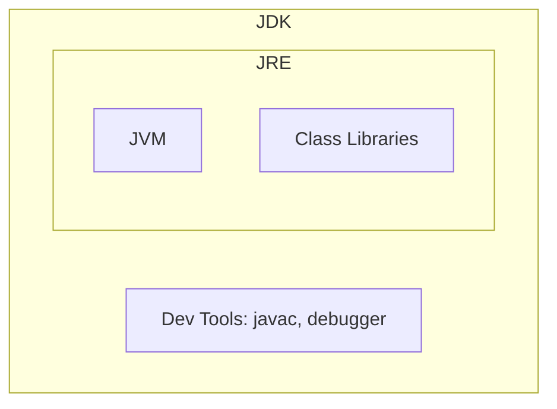
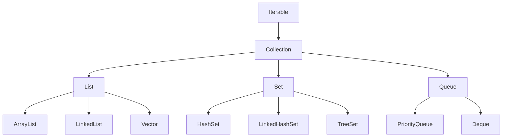
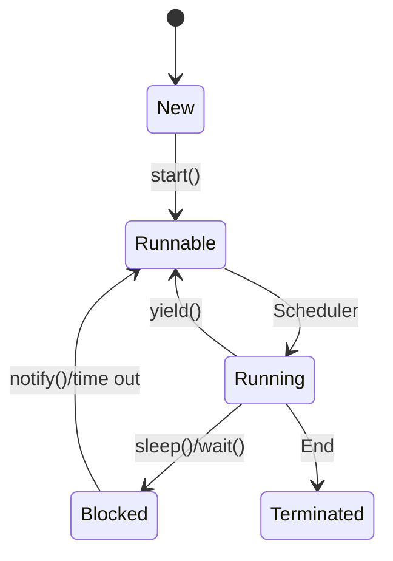
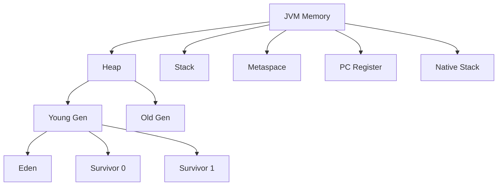

# Java Interview Questions & Answers (100+)

This guide contains 100+ Java interview questions, ranging from core concepts to advanced concurrency and performance tuning. Each question includes a model answer and potential follow-up paths based on the candidate's response.

## Part 1: Core Java & OOP (1-20)

### 1. What is the difference between JDK, JRE, and JVM?

| Component | Full Form | Description | Contains |
| :--- | :--- | :--- | :--- |
| **JVM** | Java Virtual Machine | The abstract machine that executes Java bytecode. | Just the execution engine. |
| **JRE** | Java Runtime Environment | The environment required to run Java applications. | JVM + Class Libraries. |
| **JDK** | Java Development Kit | The kit required to develop and compile Java applications. | JRE + Development Tools (javac, jdb, etc). |



**Candidate Response Paths:**

*   **Path A: Candidate focuses on definitions.**
    *   *Follow-up:* "Can I run a Java program with just the JVM installed?"
    *   *Answer:* No, you need the JRE which includes the libraries and the JVM.
*   **Path B: Candidate mentions platform independence.**
    *   *Follow-up:* "Is the JVM itself platform-independent?"
    *   *Answer:* No, the JVM is platform-dependent (there are specific JVMs for Windows, Linux, Mac), but it makes Java programs platform-independent.

### 2. Explain the difference between `==` and `equals()`.

*   `==`: Operator that checks for **reference equality** (memory address) for objects, and **value equality** for primitives.
*   `equals()`: Method in the Object class that checks for **content equality** (logical equality).

**Candidate Response Paths:**

*   **Path A: Candidate mentions overriding.**
    *   *Follow-up:* "What happens if I don't override `equals()` in my custom class?"
    *   *Answer:* It defaults to the implementation in the `Object` class, which uses `==` (reference equality).
*   **Path B: Candidate mentions String pool.**
    *   *Follow-up:* "Why does `"abc" == "abc"` return true?"
    *   *Answer:* Because of String Interning/String Pool, both literals point to the same object.

### 3. What are the 4 pillars of Object-Oriented Programming (OOP)?

1.  **Encapsulation:** Wrapping data (variables) and code (methods) together as a single unit (Class). Hiding internal details (private).
2.  **Inheritance:** Mechanism where one class acquires the properties and behaviors of another class.
3.  **Polymorphism:** The ability to perform a single action in different ways (Overloading & Overriding).
4.  **Abstraction:** Hiding implementation details and showing only functionality to the user (Interfaces & Abstract Classes).

**Candidate Response Paths:**

*   **Path A: Real-world examples.**
    *   *Follow-up:* "Give me a real-world example of Polymorphism."
    *   *Answer:* A `Shape` interface with a `draw()` method. `Circle` and `Square` implement it differently. The caller just calls `draw()` without knowing the specific shape.

### 4. Why is Java not considered "pure" object-oriented?

Because it supports **Primitive Types** (int, char, boolean, etc.) which are not objects.

**Candidate Response Paths:**

*   **Path A: Candidate mentions 'static'.**
    *   *Follow-up:* "How does the static keyword violate pure OOP?"
    *   *Answer:* Static methods/variables belong to the class, not an instance. Pure OOP suggests everything is an object interaction.

### 5. What is the difference between an Abstract Class and an Interface?

| Feature | Abstract Class | Interface (Java 8+) |
| :--- | :--- | :--- |
| **Methods** | Can have abstract and concrete methods. | Can have abstract, default, and static methods. |
| **Variables** | Can have final, non-final, static, non-static. | All variables are `public static final` (constants). |
| **Inheritance** | A class can extend only one class. | A class can implement multiple interfaces. |
| **Constructor** | Can have constructors. | Cannot have constructors. |

**Candidate Response Paths:**

*   **Path A: Design choice.**
    *   *Follow-up:* "When would you choose an Abstract Class over an Interface?"
    *   *Answer:* When you want to share code (state/implementation) among closely related classes, or require non-static / non-final fields.

### 6. What is the difference between Method Overloading and Method Overriding?

| Feature | Overloading | Overriding |
| :--- | :--- | :--- |
| **Definition** | Same method name, different parameter list (signature). | Same method name and signature in child class. |
| **Scope** | Within the same class. | Inheritance (Parent vs Child). |
| **Binding** | Static/Compile-time polymorphism. | Dynamic/Runtime polymorphism. |

### 7. What is the `static` keyword?

It means the member belongs to the type (class) itself, rather than to an instance of that type.
*   **Static Variable:** Shared among all instances.
*   **Static Method:** Can be called without creating an object. Cannot access instance variables.
*   **Static Block:** Executed once when the class is loaded.

**Candidate Response Paths:**

*   **Path A: Memory management.**
    *   *Follow-up:* "Where are static variables stored?"
    *   *Answer:* In the Metaspace (previously PermGen), specifically in the Class definitions.

### 8. Can we override a `static` method?

No. If you define a static method with the same signature in the child class, it is called **Method Hiding**, not overriding. The method called depends on the type of the reference, not the object.

### 9. What is the difference between `final`, `finally`, and `finalize`?

*   `final`: Keyword to apply restrictions.
    *   **Variable:** Constant.
    *   **Method:** Cannot be overridden.
    *   **Class:** Cannot be inherited (e.g., `String`).
*   `finally`: Block used in Exception Handling. Executes always (with rare exceptions).
*   `finalize`: Method used for Garbage Collection cleanup (Deprecated in Java 9).

### 10. Why is `String` immutable in Java?

1.  **Security:** Used for network connections, database URLs, usernames/passwords.
2.  **Synchronization:** Automatically thread-safe.
3.  **Caching:** String Pool requires immutability to ensure one reference doesn't change the value for others.
4.  **Hashcode Caching:** The hashcode is calculated once and cached, making it a great key for Maps.

### 11. `String` vs `StringBuilder` vs `StringBuffer`?

| Class | Mutable? | Thread-Safe? | Performance |
| :--- | :--- | :--- | :--- |
| `String` | No | Yes (Immutable) | Slow (creates new objects) |
| `StringBuilder` | Yes | No | Fast |
| `StringBuffer` | Yes | Yes (Synchronized) | Slower than Builder |

**Candidate Response Paths:**

*   **Path A: Usage context.**
    *   *Follow-up:* "When would you use `StringBuffer`?"
    *   *Answer:* Only in multi-threaded environments where a shared mutable string is being modified. Otherwise, `StringBuilder` is preferred.

### 12. Explain the difference between Checked and Unchecked Exceptions.

*   **Checked Exceptions:** Checked at compile-time. Must be handled (`try-catch`) or declared (`throws`).
    *   *Examples:* `IOException`, `SQLException`.
*   **Unchecked Exceptions:** Runtime Exceptions. Compiler does not force handling.
    *   *Examples:* `NullPointerException`, `ArrayIndexOutOfBoundsException`.

**Candidate Response Paths:**

*   **Path A: Design philosophy.**
    *   *Follow-up:* "When creating a custom exception, which one should you extend?"
    *   *Answer:* Generally `RuntimeException` (Unchecked) if the client cannot recover from it. `Exception` (Checked) if you expect the client to recover.

### 13. What is the `try-with-resources` statement?

Introduced in Java 7, it allows declaring resources (that implement `AutoCloseable`) inside the `try(...)` parenthesis. It ensures that the resources are closed automatically at the end of the block, replacing the verbose `finally` block pattern.

```java
try (BufferedReader br = new BufferedReader(new FileReader(path))) {
    return br.readLine();
} // br is closed here automatically
```

### 14. Does the `finally` block always execute?

Yes, except in these cases:
1.  `System.exit()` is called.
2.  The thread is killed.
3.  JVM crashes / Power failure.

### 15. What are Wrapper Classes?

Classes that wrap primitive data types into objects.
*   `int` -> `Integer`
*   `char` -> `Character`
*   `double` -> `Double`

**Candidate Response Paths:**

*   **Path A: Autoboxing.**
    *   *Follow-up:* "What is Autoboxing and Unboxing?"
    *   *Answer:* Automatic conversion between primitives and wrappers by the compiler.
    *   *Follow-up:* "What is the danger of Unboxing?"
    *   *Answer:* `NullPointerException` if the wrapper is null.

### 16. What is a Marker Interface?

An interface with no methods or fields. It provides run-time type information about objects so the JVM or compiler can take some special action.
*   *Examples:* `Serializable`, `Cloneable`, `Remote`.
*   *Modern Alternative:* Annotations.

### 17. Explain `public static void main(String[] args)`.

*   `public`: Access modifier, JVM can call it from outside.
*   `static`: No object needed to call it.
*   `void`: Returns nothing.
*   `main`: Identifier name the JVM looks for.
*   `String[] args`: Command line arguments.

### 18. Can we execute a program without `main` method?

Prior to Java 7, yes, using a static block. In modern Java versions (JDK 7+), No. The JVM explicitly looks for the main method before initializing the class.

### 19. What is "Pass by Value" vs "Pass by Reference"?

Java is strictly **Pass by Value**.
*   For **primitives**, the actual value is copied.
*   For **objects**, the *value of the reference* (memory address) is copied. The object itself is not copied, but the new reference points to the same object.

**Candidate Response Paths:**

*   **Path A: Confusion.**
    *   *Follow-up:* "If I pass an object to a method and modify its field, does the original object change?"
    *   *Answer:* Yes, because the copy of the reference points to the same heap object.
    *   *Follow-up:* "If I reassign the object parameter to a `new Object()` inside the method, does the original reference change?"
    *   *Answer:* No. You only changed the local copy of the reference.

### 20. What is the `super` keyword?

A reference variable used to refer to the immediate parent class object.
1.  Call parent constructor: `super()`.
2.  Call parent method: `super.method()`.
3.  Access parent field: `super.field`.


## Part 2: Collections & Generics (21-40)

### 21. What is the difference between Array and ArrayList?

| Feature | Array | ArrayList |
| :--- | :--- | :--- |
| **Size** | Fixed | Dynamic (Resizes automatically) |
| **Performance** | Fast (Direct index access) | Slightly slower (due to resizing overhead) |
| **Primitives** | Can store primitives (int, char). | Stores only Objects (Integer, Character). |
| **Generics** | No | Yes |

### 22. Explain the hierarchy of the Collection Framework.


*(Note: Map is not part of the Collection interface hierarchy, it is separate).*

### 23. List vs Set vs Map?

*   **List:** Ordered collection. Allows duplicates. Accessed by index.
*   **Set:** Unordered collection. No duplicates.
*   **Map:** Key-Value pairs. Unique keys.

### 24. How does `HashSet` check for duplicates?

It uses `hashCode()` and `equals()`.
1.  Calculates hash code of the object.
2.  Checks if that hash code exists in the internal bucket.
3.  If yes, it uses `equals()` to check if the objects are actually identical.

**Candidate Response Paths:**

*   **Path A: Internal implementation.**
    *   *Follow-up:* "What does HashSet use internally to store data?"
    *   *Answer:* It uses a `HashMap`, storing the element as the Key and a dummy object (`PRESENT`) as the Value.

### 25. Explain the internal working of `HashMap`.

It uses an array of "Nodes" (buckets). Each node is a Linked List (or Red-Black Tree in Java 8+).
1.  `put(K, V)` -> Hash(K) -> Index.
2.  If bucket is empty, add Node.
3.  If bucket is not empty (Collision), append to Linked List/Tree.

**Candidate Response Paths:**

*   **Path A: Java 8 Improvement.**
    *   *Follow-up:* "What changed in Java 8 regarding HashMap collisions?"
    *   *Answer:* When a bucket's linked list grows beyond a threshold (8), it converts to a **Balanced Tree (Red-Black Tree)** to improve worst-case search from O(n) to O(log n).

### 26. `ArrayList` vs `LinkedList`?

*   **ArrayList:** Uses a dynamic array.
    *   *Get:* O(1)
    *   *Insert/Delete:* O(n) (needs shifting).
*   **LinkedList:** Uses a doubly linked list.
    *   *Get:* O(n) (needs traversal).
    *   *Insert/Delete:* O(1) (pointer change, assuming you are at the node).

### 27. What is the difference between `HashMap` and `Hashtable`?

| Feature | HashMap | Hashtable |
| :--- | :--- | :--- |
| **Thread-Safe** | No | Yes (Synchronized) |
| **Null Keys/Values** | Allows 1 null key, multiple null values. | Does not allow nulls. |
| **Performance** | Fast | Slow |
| **Legacy** | Modern | Legacy (Vector/Stack/Hashtable) |

### 28. What is `ConcurrentHashMap`?

A thread-safe implementation of Map. Unlike `Hashtable` (which locks the entire map), `ConcurrentHashMap` uses **Bucket-Level Locking** (Segment locking in older versions, CAS + Synchronized on Node in Java 8+). It allows concurrent reads and writes.

### 29. What is the difference between `Comparable` and `Comparator`?

*   **Comparable:** Natural ordering. Implemented by the class itself (`implements Comparable<T>`). Override `compareTo()`.
    *   *Example:* `Collections.sort(list)` uses this.
*   **Comparator:** Custom ordering. Implemented by a separate class (`implements Comparator<T>`). Override `compare()`.
    *   *Example:* `Collections.sort(list, new MyComparator())`.

### 30. What is a PriorityQueue?

A queue where elements are ordered based on their priority (Natural ordering or Comparator), not insertion order. The head is always the least element.
*   *Implementation:* Binary Heap.
*   *Time Complexity:* Enqueue/Dequeue takes O(log n).

### 31. What is the contract between `hashCode()` and `equals()`?

1.  If two objects are equal according to `equals()`, they MUST have the same `hashCode()`.
2.  If two objects have the same `hashCode()`, they are NOT necessarily equal (Collision).

**Candidate Response Paths:**

*   **Path A: Violation consequences.**
    *   *Follow-up:* "What goes wrong if I override equals but not hashCode?"
    *   *Answer:* Collections relying on hashing (HashMap, HashSet) will fail to find the object because they look in the wrong bucket.

### 32. What is `fail-fast` vs `fail-safe` iterator?

*   **Fail-Fast:** Throws `ConcurrentModificationException` if the collection is modified while iterating (except via iterator's own remove method).
    *   *Examples:* ArrayList, HashMap iterators.
*   **Fail-Safe:** Works on a clone or snapshot of the collection. Does not throw exception.
    *   *Examples:* `CopyOnWriteArrayList`, `ConcurrentHashMap`.

### 33. What are Generics?

Generics allow types (classes and interfaces) to be parameters when defining classes, interfaces, and methods. It provides **Type Safety** at compile time and eliminates manual casting.

```java
List<String> list = new ArrayList<>();
```

### 34. What is Type Erasure?

The process where the compiler removes all generic type information after type checking. At runtime, `List<String>` and `List<Integer>` become just `List`.
*   *Why?* Backward compatibility with pre-Java 5 code.

### 35. What is the difference between `<? extends T>` and `<? super T>`?

*   `<? extends T>`: Upper Bound Wildcard. Accepts T or its subclasses. (Read-only mostly).
*   `<? super T>`: Lower Bound Wildcard. Accepts T or its superclasses. (Write-allowed).
*   **PECS Rule:** Producer Extends, Consumer Super.

### 36. Can you add an element to a `List<?>`?

No (except `null`). Because the compiler doesn't know what type the list holds, it prevents adding any object to ensure type safety.

### 37. What is `IdentityHashMap`?

A map that uses reference equality (`==`) instead of object equality (`equals()`) for keys. Useful for topology preservation in serialization.

### 38. What is `WeakHashMap`?

A Map where keys are **WeakReferences**. If a key is no longer referenced elsewhere in the application, the entry is eligible for Garbage Collection. Useful for Caches.

### 39. How to make a collection Read-Only (Immutable)?

Use `Collections.unmodifiableList(list)`.
*   *Note:* It returns a view. If the original list changes, the view changes. For a truly immutable independent copy, use `List.copyOf(list)` (Java 10+).

### 40. Why doesn't `Map` extend `Collection` interface?

Because Map is a key-value pair, while Collection is a group of individual objects. The methods `add(E)` or `iterator()` don't map directly to a Key-Value structure (which has `put(K,V)`, `keySet()`, `entrySet()`).

## Part 3: Concurrency & Multithreading (41-60)

### 41. What is the difference between `Process` and `Thread`?

*   **Process:** An instance of a program in execution. Has its own memory space (Heap, Stack). Heavyweight.
*   **Thread:** A subset of a process. Share the same memory space (Heap) but have their own Stack. Lightweight.

### 42. How can we create a Thread in Java?

1.  **Extending `Thread` class.**
2.  **Implementing `Runnable` interface.** (Preferred, as it allows extending other classes).
3.  **Implementing `Callable` interface.** (Returns a value).

### 43. What is the difference between `start()` and `run()`?

*   `start()`: Creates a new thread and then calls `run()` internally.
*   `run()`: Just executes the method in the *current* thread (no new thread created).

### 44. Explain Thread Lifecycle (States).

1.  **New:** Created but not started.
2.  **Runnable:** Ready to run (waiting for CPU).
3.  **Running:** Executing code.
4.  **Blocked/Waiting:** Waiting for resource or another thread.
5.  **Terminated:** Finished execution.



### 45. What is Synchronization?

A mechanism to control access of multiple threads to shared resources to prevent data inconsistency (Race Conditions).
*   **Method Synchronization:** `public synchronized void method() {}`
*   **Block Synchronization:** `synchronized(this) { ... }`

### 46. What is a "Race Condition"?

A condition where multiple threads access and modify shared data concurrently, and the final result depends on the order of execution (which is unpredictable).

### 47. What is Deadlock?

A situation where two or more threads are blocked forever, waiting for each other.
*   *Conditions:* Mutual Exclusion, Hold and Wait, No Preemption, Circular Wait.

**Candidate Response Paths:**

*   **Path A: Prevention.**
    *   *Follow-up:* "How can we prevent Deadlock?"
    *   *Answer:* Eliminate Circular Wait by enforcing a strict order of acquiring locks.

### 48. `wait()` vs `sleep()`?

| Feature | `wait()` | `sleep()` |
| :--- | :--- | :--- |
| **Origin** | `Object` class | `Thread` class |
| **Lock** | Releases the lock. | Keeps the lock. |
| **Usage** | Inter-thread communication. | Pausing execution. |

### 49. What is the `volatile` keyword?

It guarantees **Visibility**.
*   The value of a volatile variable will always be read from the main memory, not from the thread's local cache.
*   It also prevents instruction reordering.
*   *Note:* It does NOT guarantee Atomicity (e.g., `count++` is not safe even if `count` is volatile).

### 50. What is `ThreadLocal`?

A class that provides thread-local variables. Each thread accessing the variable has its own, independently initialized copy.
*   *Usage:* Storing User ID in a web request, Transaction context.

### 51. What is the Executor Framework?

Introduced in Java 5 (`java.util.concurrent`). It separates task submission from task execution.
*   **Interfaces:** `Executor`, `ExecutorService`.
*   **Implementations:** `ThreadPoolExecutor`.

### 52. What is the difference between `Runnable` and `Callable`?

*   **Runnable:** `run()` method returns `void`. Cannot throw checked exceptions.
*   **Callable:** `call()` method returns `V` (Result). Can throw checked exceptions.

### 53. What is a `Future`?

Represents the result of an asynchronous computation.
*   `get()`: Retrieves the result (blocks if not ready).
*   `isDone()`: Checks if task is completed.

### 54. What is the difference between `submit()` and `execute()`?

*   `execute(Runnable)`: Defined in `Executor`. Returns void. Fire and forget.
*   `submit(Callable/Runnable)`: Defined in `ExecutorService`. Returns a `Future`.

### 55. What is a "Thread Pool"?

A collection of pre-created threads waiting for tasks.
*   *Benefits:* Reduces overhead of thread creation/destruction. Limits resource usage.

### 56. Types of Thread Pools in `Executors` class?

1.  `newFixedThreadPool(n)`: Fixed number of threads.
2.  `newCachedThreadPool()`: Creates new threads as needed, reuses idle ones.
3.  `newSingleThreadExecutor()`: Single worker thread.
4.  `newScheduledThreadPool(n)`: For scheduled tasks.

### 57. What is `CountDownLatch`?

A synchronizer that allows one or more threads to wait until a set of operations being performed in other threads completes.
*   *Mechanism:* Initialized with count N. `await()` blocks until count reaches 0. Other threads call `countDown()`.

### 58. What is `CyclicBarrier`?

A synchronizer that allows a set of threads to all wait for each other to reach a common barrier point.
*   *Difference from CountDownLatch:* CyclicBarrier can be reused (reset) after the barrier is broken.

### 59. What is `AtomicInteger`?

A class in `java.util.concurrent.atomic` that provides atomic operations on `int` using CAS (Compare-And-Swap) machine instructions, without using synchronization.
*   *Example:* `incrementAndGet()` is atomic.

### 60. What is "CAS" (Compare-And-Swap)?

An optimistic locking technique used in non-blocking algorithms.
*   *Operation:* "I think the value is A. If it is essentially A, change it to B. If not, tell me the real value and I'll try again."
*   *Benefit:* Much faster than locks (synchronized) for low contention.

## Part 4: JVM, Memory & Performance (61-80)

### 61. Explain the JVM Memory Structure.

1.  **Heap Memory:** Stores Objects and Class variables. Shared by all threads.
2.  **Stack Memory:** Stores method calls, local variables, and reference variables. Per-thread.
3.  **Metaspace (formerly PermGen):** Stores Class definitions, Method metadata, static variables.
4.  **PC Register:** Current instruction address.
5.  **Native Method Stack:** For native (C/C++) methods.



### 62. What is Garbage Collection (GC)?

The process by which the JVM automatically identifies and removes objects from memory (Heap) that are no longer reachable (referenced) by the application.

### 63. How does the JVM know an object is "garbage"?

It uses **Reachability Analysis**.
*   **GC Roots:** Objects that are always accessible (e.g., Local variables in active stack, Static variables, Active threads).
*   Any object not reachable from a GC Root is considered garbage.

### 64. Explain the Generational Garbage Collection process.

1.  New objects are created in **Eden** (Young Gen).
2.  When Eden fills, a **Minor GC** occurs. Alive objects move to **Survivor Space (S0)**.
3.  Next Minor GC: Alive objects in Eden + S0 move to **S1**. S0 is cleared. S0 and S1 swap roles.
4.  Objects surviving multiple Minor GC cycles (threshold age) are promoted to **Old Gen**.
5.  When Old Gen fills, a **Major GC (Full GC)** occurs.

### 65. What are the different types of Garbage Collectors?

1.  **Serial GC:** Single-threaded. (Small apps).
2.  **Parallel GC:** Multi-threaded for Minor GC. (Throughput-oriented).
3.  **CMS (Concurrent Mark Sweep):** Minimizes pause times (Deprecated).
4.  **G1 GC (Garbage First):** Splits heap into regions. Default in Java 9+. Balanced throughput/latency.
5.  **ZGC:** Ultra-low latency (<10ms).

### 66. What is a "Memory Leak" in Java?

A situation where objects are no longer used by the application but are still referenced (e.g., in a static List or Map), preventing the GC from removing them. Eventually leads to `OutOfMemoryError`.

**Candidate Response Paths:**

*   **Path A: Debugging.**
    *   *Follow-up:* "How do you detect a memory leak?"
    *   *Answer:* Use a profiler (VisualVM, JProfiler) to analyze Heap Dumps. Look for objects with growing instance counts that shouldn't be growing.

### 67. What is `StackOverflowError`?

Occurs when the Stack memory is exhausted.
*   *Cause:* Deep or infinite recursion.

### 68. What is `OutOfMemoryError` (OOM)?

Occurs when the Heap (or Metaspace) is full and GC cannot free up enough space.
*   *Types:* `Java heap space`, `Metaspace`, `GC Overhead limit exceeded`.

### 69. What is Classloading?

The process of finding and loading class files (`.class`) into the JVM memory at runtime.

### 70. Explain the Classloader Hierarchy.

1.  **Bootstrap Classloader:** Loads core Java classes (`rt.jar`, `java.lang.*`). Native implementation.
2.  **Platform/Extension Classloader:** Loads extensions (`lib/ext`).
3.  **Application/System Classloader:** Loads classes from the classpath.

**Candidate Response Paths:**

*   **Path A: Delegation Model.**
    *   *Follow-up:* "How does the delegation model work?"
    *   *Answer:* A classloader delegates the search to its parent first. Only if the parent cannot find it, does it try to load it itself.

### 71. What is JIT (Just-In-Time) Compiler?

Part of the JVM execution engine. It compiles "hot" bytecode (frequently executed code) into native machine code at runtime for higher performance, while interpreting the rest.

### 72. What are Soft, Weak, and Phantom References?

*   **Strong Reference:** Default (`obj = new Object()`). Never collected if reachable.
*   **Soft Reference:** Collected only if JVM is running out of memory. (Good for Caches).
*   **Weak Reference:** Collected aggressively at the next GC event. (Good for Metadata maps).
*   **Phantom Reference:** Collected when the object is physically removed. Used for scheduling post-mortem cleanup.

### 73. What is the difference between Heap and Stack memory?

| Feature | Heap | Stack |
| :--- | :--- | :--- |
| **Storage** | Objects | Primitives, References, Methods |
| **Visibility** | Global (All threads) | Local (Per thread) |
| **Size** | Large | Small |
| **Speed** | Slower access | Faster access |

### 74. How do you tune JVM Memory?

Using JVM flags:
*   `-Xms`: Initial Heap Size.
*   `-Xmx`: Maximum Heap Size.
*   `-Xss`: Stack Size per thread.
*   `-XX:MaxMetaspaceSize`: Max Metaspace size.

### 75. What is "String Interning"?

The process of storing only one copy of each distinct string value, which must be immutable.
`String s = "hello"` places "hello" in the **String Constant Pool** (in Heap).
`s.intern()` forces a string object into the pool.

### 76. Why is `finalize()` deprecated?

1.  **Unpredictable:** No guarantee when (or if) it will run.
2.  **Performance:** Adds overhead to object creation and destruction.
3.  **Security:** Vulnerable to "Finalizer attacks".
4.  *Alternative:* Use `AutoCloseable` (try-with-resources) or `Cleaner` API.

### 77. What happens if you run a recursive function without a base case?

`StackOverflowError`. Each call adds a frame to the thread's stack until it hits the limit (`-Xss`).

### 78. What is the purpose of the `transient` keyword?

It indicates that a field should **not be serialized**. When an object is deserialized, transient fields are initialized to their default values (null/0).

### 79. What is "Escape Analysis"?

A JIT optimization. If an object is allocated inside a method and its reference never "escapes" that method (i.e., not returned or assigned to a global variable), the JVM might allocate it on the **Stack** instead of the Heap (Stack Allocation), or eliminate the allocation entirely (Scalar Replacement).

### 80. How does the JVM handle Integer Caching?

The JVM caches `Integer` objects for values between -128 and 127.
`Integer a = 100; Integer b = 100;` -> `a == b` is true.
`Integer x = 200; Integer y = 200;` -> `x == y` is false (creates new objects).


## Part 5: Advanced Features, Frameworks & Design Patterns (81-100)

### 81. What is the Singleton Design Pattern?

A design pattern that ensures a class has only one instance and provides a global point of access to it.

```java
// Thread-safe Bill Pugh Singleton
public class Singleton {
    private Singleton() {}
    private static class Holder {
        private static final Singleton INSTANCE = new Singleton();
    }
    public static Singleton getInstance() {
        return Holder.INSTANCE;
    }
}
```

### 82. What is the Factory Design Pattern?

A creational pattern that provides an interface for creating objects in a superclass, but allows subclasses to alter the type of objects that will be created.

### 83. What is Dependency Injection (DI)?

A design pattern used to implement IoC (Inversion of Control). It allows the creation of dependent objects outside of a class and provides those objects to a class through different ways (Constructor, Setter, Interface).

### 84. What is Reflection?

An API that is used to examine or modify the behavior of methods, classes, and interfaces at runtime.
*   *Uses:* IDEs, Debuggers, Test Tools, Spring Framework (DI).
*   *Drawbacks:* Performance overhead, Security risk, Breaks encapsulation.

### 85. What are Java Annotations?

Metadata about the program that is not part of the program itself.
*   *Built-in:* `@Override`, `@Deprecated`, `@SuppressWarnings`.
*   *Custom:* Created using `@interface`.

### 86. What is a Functional Interface?

An interface with exactly one abstract method.
*   *Annotation:* `@FunctionalInterface`.
*   *Purpose:* Used as the assignment target for a **Lambda Expression** or Method Reference.
*   *Examples:* `Runnable`, `Callable`, `Comparator`, `Predicate`.

### 87. Explain Java 8 Stream API.

A sequence of elements supporting sequential and parallel aggregate operations.
*   **Intermediate Operations (Lazy):** `filter`, `map`, `sorted`.
*   **Terminal Operations (Eager):** `forEach`, `collect`, `reduce`, `count`.

### 88. What is the difference between `map()` and `flatMap()`?

*   `map()`: Transforms each element into another object. One-to-One.
    *   `List<String>` -> `List<Integer>`
*   `flatMap()`: Transforms each element into a Stream of objects, then flattens the streams into a single Stream. One-to-Many.
    *   `List<List<String>>` -> `List<String>`

### 89. What is `Optional`?

A container object which may or may not contain a non-null value. It is used to avoid `NullPointerException` and explicit null checks.
*   *Methods:* `isPresent()`, `ifPresent()`, `orElse()`, `orElseGet()`, `orElseThrow()`.

### 90. What are Default Methods in Interfaces?

Introduced in Java 8, they allow adding new methods to interfaces without breaking the existing implementation classes.
*   *Keyword:* `default`.

**Candidate Response Paths:**

*   **Path A: Diamond Problem.**
    *   *Follow-up:* "What happens if a class implements two interfaces with the same default method?"
    *   *Answer:* The class fails to compile unless it overrides the method to resolve the conflict.

### 91. What are Java Modules (Project Jigsaw)?

Introduced in Java 9. A module is a named, self-describing collection of code and data.
*   *File:* `module-info.java`.
*   *Keywords:* `module`, `requires`, `exports`.
*   *Benefit:* Better encapsulation (stronger than packages), reduced runtime image size (`jlink`).

### 92. What are Java Records?

Introduced in Java 14 (Preview) / 16 (Standard). A concise way to declare classes that are transparent holders for immutable data.
*   *Replaces:* POJOs with boilerplate getters, `equals`, `hashCode`, `toString`.

```java
public record Point(int x, int y) {}
```

### 93. What is `var` in Java?

Introduced in Java 10. Local Variable Type Inference.
*   *Usage:* `var list = new ArrayList<String>();`
*   *Constraint:* Can only be used for local variables with an initializer. Cannot be used for method parameters or return types.

### 94. What is the difference between Serialization and Deserialization?

*   **Serialization:** Converting an object state into a byte stream (to save to file/DB or send over network).
*   **Deserialization:** Recreating the object from the byte stream.

### 95. What is `serialVersionUID`?

A unique identifier for each class version. It is used during deserialization to verify that the sender and receiver of a serialized object have loaded classes for that object that are compatible with respect to serialization.

### 96. What is the Observer Design Pattern?

A behavioral design pattern where an object (Subject) maintains a list of its dependents (Observers), and notifies them automatically of any state changes.
*   *Usage:* Event handling systems (GUI), Pub-Sub systems.

### 97. What is Inversion of Control (IoC)?

A principle where the control of objects or portions of a program is transferred to a container or framework.
*   *Traditional:* Application code calls Library.
*   *IoC:* Framework calls Application code (e.g., Spring calling your Controller methods).

### 98. What is AOP (Aspect Oriented Programming)?

A programming paradigm that aims to increase modularity by allowing the separation of cross-cutting concerns (e.g., logging, transaction management, security) from the business logic.

### 99. Explain the "Double-Checked Locking" pattern.

Used to reduce the overhead of acquiring a lock by first testing the locking criterion (the "lock hint") without actually acquiring the lock. Only if the check indicates that locking is required does the actual locking logic proceed.
*   *Crucial:* The variable must be `volatile`.

### 100. What is a Sealed Class?

Introduced in Java 15 (Preview) / 17 (Standard). It allows a class or interface to restrict which other classes or interfaces may extend or implement it.
*   *Keywords:* `sealed`, `permits`.

```java
public sealed class Shape permits Circle, Square {}
```

---
**End of Interview Questions**


## Study Guide

To deepen your understanding of these concepts, check out the following resources:

- **Official Documentation**: [Java Docs](https://docs.oracle.com/en/java/)
- **Internal Style Guide**: [Java Style Guide](../style_guides/java/java_style_guide.md)
