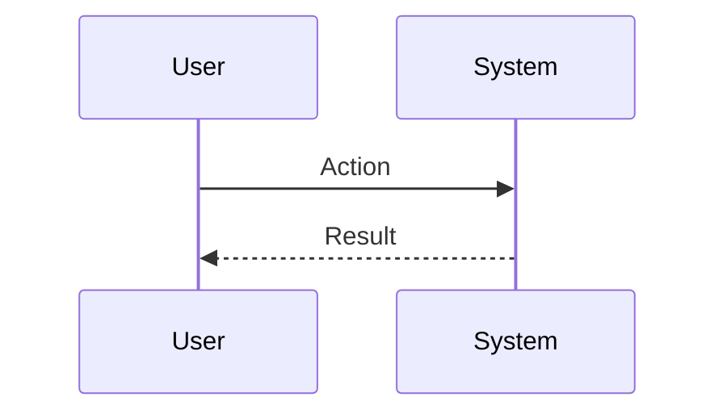
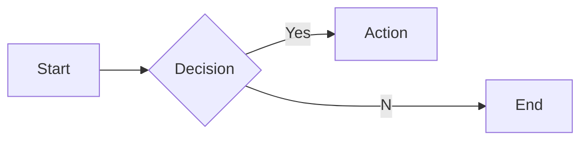

# Interview Questions: private_security (ROLE)

This document contains 100 interview questions tailored for the private_security role. The questions are designed to assess technical skills, soft skills, and cultural fit.

---

## 1. Discretion

**Scenario:** Overhearing sensitive info.

**Question:** How do you handle overhearing confidential or sensitive information about the principal?

**Key Concepts:** `Privacy`, `Discretion`

### Candidate Response Paths
*   **Junior**: I ignore it.
*   **Senior**: I maintain absolute confidentiality and act as if I heard nothing unless it impacts safety.

---

## 2. Anticipation

**Scenario:** Principal is busy.

**Question:** How do you anticipate the needs of the principal before they ask?

**Key Concepts:** `Proactivity`, `Service`

### Candidate Response Paths
*   **Junior**: I wait for instructions.
*   **Senior**: I learn their routines and preferences to have everything ready in advance.

---

## 3. Adaptability

**Scenario:** Last minute change.

**Question:** The schedule changes completely 10 minutes before an event. What do you do?

**Key Concepts:** `Adaptability`, `Composure`

### Candidate Response Paths
*   **Junior**: Panic.
*   **Senior**: Calmly execute the contingency plan and inform relevant parties.

---

## 4. Vendor Management

**Scenario:** Poor service.

**Question:** A vendor is not delivering to the expected standard. How do you handle it?

**Key Concepts:** `Vendor Mgmt`, `Standards`

### Candidate Response Paths
*   **Junior**: Complain to the principal.
*   **Senior**: Address it directly with the vendor, demand correction, or source a replacement.

---

## 5. Service Mindset

**Scenario:** Difficult request.

**Question:** The principal asks for something nearly impossible. How do you respond?

**Key Concepts:** `Resourcefulness`, `Can-do`

### Candidate Response Paths
*   **Junior**: Say no.
*   **Senior**: I say 'I will see what I can do' and exhaust every avenue to make it happen.

---

## 6. Conflict Resolution

**Scenario:** Disagreement with a peer.

**Question:** Tell me about a time you had a significant disagreement with a colleague. How did you resolve it?

**Key Concepts:** `Communication`, `Soft Skills`

### Candidate Response Paths
*   **Junior**: I told them I was right.
*   **Senior**: I listened to their perspective, found common ground, and we compromised.

---

## 7. Failure Handling

**Scenario:** A project went wrong.

**Question:** Describe a time you failed. What happened and what did you learn?

| Metric | Target | Status |
|---|---|---|
| KPI 1 | 100% | Green |
| KPI 2 | < 5% | Yellow |

**Key Concepts:** `Growth Mindset`, `Resilience`

### Candidate Response Paths
*   **Junior**: I tried hard but it failed.
*   **Senior**: I analyzed the root cause, implemented a fix, and shared the learning.

---

## 8. Prioritization

**Scenario:** Too many tasks.

**Question:** How do you prioritize when you have multiple conflicting deadlines?

**Key Concepts:** `Time Management`, `Organization`

### Candidate Response Paths
*   **Junior**: I work longer hours.
*   **Senior**: I communicate with stakeholders to adjust expectations and focus on high-impact tasks.

---

## 9. Adaptability

**Scenario:** Changing requirements.

**Question:** How do you handle sudden changes in project scope or direction?

**Key Concepts:** `Agility`, `Flexibility`

### Candidate Response Paths
*   **Junior**: I get frustrated but do it.
*   **Senior**: I assess the impact, communicate risks, and pivot quickly.

---

## 10. Communication

**Scenario:** Explaining complex topics.

**Question:** Describe a time you had to explain a complex technical/business concept to a non-expert.

**Key Concepts:** `Clarity`, `Empathy`

### Candidate Response Paths
*   **Junior**: I just said it simpler.
*   **Senior**: I used analogies and checked for understanding throughout.

---

## 11. Teamwork

**Scenario:** Collaborating with difficult personalities.

**Question:** How do you handle working with someone who is difficult to work with?

**Key Concepts:** `Collaboration`, `EQ`

### Candidate Response Paths
*   **Junior**: I avoid them.
*   **Senior**: I try to understand their motivations and find a way to work together effectively.

---

## 12. Innovation

**Scenario:** Improving a process.

**Question:** Tell me about a time you improved a process or workflow.

**Key Concepts:** `Innovation`, `Efficiency`

### Candidate Response Paths
*   **Junior**: I followed the rules.
*   **Senior**: I identified a bottleneck, proposed a solution, and measured the improvement.

---

## 13. Feedback

**Scenario:** Receiving constructive criticism.

**Question:** Tell me about a time you received difficult feedback. How did you react?

**Key Concepts:** `Self-awareness`, `Growth`

### Candidate Response Paths
*   **Junior**: I got defensive.
*   **Senior**: I listened, asked for examples, and worked on a plan to improve.

---

## 14. Leadership

**Scenario:** Leading without authority.

**Question:** Describe a time you demonstrated leadership when you weren't the formal manager.

| Metric | Target | Status |
|---|---|---|
| KPI 1 | 100% | Green |
| KPI 2 | < 5% | Yellow |

**Key Concepts:** `Leadership`, `Influence`

### Candidate Response Paths
*   **Junior**: I told people what to do.
*   **Senior**: I rallied the team around a goal and supported them to achieve it.

---

## 15. Decision Making

**Scenario:** Incomplete information.

**Question:** How do you make decisions when you don't have all the data?

**Key Concepts:** `Judgment`, `Risk Mgmt`

### Candidate Response Paths
*   **Junior**: I wait for all data.
*   **Senior**: I assess the risk, make a call based on available info, and adjust as needed.

---

## 16. Metrics for Event Planning

**Scenario:** Measurement.

**Question:** How do you measure success in Event Planning?

**Key Concepts:** `Event Planning`, `Analytics`

### Candidate Response Paths
*   **Junior**: I guess.
*   **Senior**: Specific KPIs and leading/lagging indicators.

---

## 17. Future of Relationship Mgmt

**Scenario:** Trends.

**Question:** Where do you see Relationship Mgmt heading in the next 5 years?

**Key Concepts:** `Relationship Mgmt`, `Vision`

### Candidate Response Paths
*   **Junior**: It will get better.
*   **Senior**: Emerging trends, AI impact, and market shifts.

---

## 18. Start vs Scale for Logistics

**Scenario:** Context.

**Question:** How does your approach to Logistics differ in a startup vs a large corp?

**Key Concepts:** `Logistics`, `Context`

### Candidate Response Paths
*   **Junior**: It's the same.
*   **Senior**: Speed/Chaos vs Process/Stability.

---

## 19. Collaboration in Logistics

**Scenario:** Teamwork.

**Question:** How does Logistics require cross-functional collaboration?

**Key Concepts:** `Logistics`, `Collaboration`

### Candidate Response Paths
*   **Junior**: I talk to people.
*   **Senior**: Alignment with other depts and shared goals.

---

## 20. Collaboration in Inventory Mgmt

**Scenario:** Teamwork.

**Question:** How does Inventory Mgmt require cross-functional collaboration?

**Key Concepts:** `Inventory Mgmt`, `Collaboration`

### Candidate Response Paths
*   **Junior**: I talk to people.
*   **Senior**: Alignment with other depts and shared goals.

---

## 21. Scaling Security

**Scenario:** Growth.

**Question:** How do you scale Security as the company grows?

| Metric | Target | Status |
|---|---|---|
| KPI 1 | 100% | Green |
| KPI 2 | < 5% | Yellow |

**Key Concepts:** `Security`, `Scale`

### Candidate Response Paths
*   **Junior**: Hire more people.
*   **Senior**: Process automation, documentation, and leverage.

---

## 22. Mistakes in Etiquette

**Scenario:** Learning.

**Question:** What common mistakes do people make with Etiquette?

**Key Concepts:** `Etiquette`, `Experience`

### Candidate Response Paths
*   **Junior**: Doing it wrong.
*   **Senior**: Subtle pitfalls and how to avoid them.

---

## 23. Tooling: Relationship Mgmt

**Scenario:** Proficiency.

**Question:** How do you utilize Relationship Mgmt to improve efficiency?

**Key Concepts:** `Relationship Mgmt`, `Productivity`

### Candidate Response Paths
*   **Junior**: I use it daily.
*   **Senior**: Advanced features and automation.

---

## 24. Logistics Best Practices

**Scenario:** Standardization.

**Question:** What are the industry best practices for Logistics?

**Key Concepts:** `Logistics`, `Standards`

### Candidate Response Paths
*   **Junior**: List a few.
*   **Senior**: Discusses why they are best practices and when to break them.

---

## 25. Challenges in Travel Planning

**Scenario:** Problem Solving.

**Question:** What are the biggest challenges you've faced regarding Travel Planning?

**Key Concepts:** `Travel Planning`, `Problem Solving`

### Candidate Response Paths
*   **Junior**: It was hard.
*   **Senior**: Specific examples of obstacles and strategies to overcome them.

---

## 26. Metrics for Vendor Negotiation

**Scenario:** Measurement.

**Question:** How do you measure success in Vendor Negotiation?

**Key Concepts:** `Vendor Negotiation`, `Analytics`

### Candidate Response Paths
*   **Junior**: I guess.
*   **Senior**: Specific KPIs and leading/lagging indicators.

---

## 27. Ethics in Crisis Mgmt

**Scenario:** Ethics.

**Question:** What are the ethical considerations regarding Crisis Mgmt?

**Key Concepts:** `Crisis Mgmt`, `Ethics`

### Candidate Response Paths
*   **Junior**: Be nice.
*   **Senior**: Privacy, bias, and societal impact.

---

## 28. Teaching Etiquette

**Scenario:** Mentorship.

**Question:** How would you teach Etiquette to a junior team member?

| Metric | Target | Status |
|---|---|---|
| KPI 1 | 100% | Green |
| KPI 2 | < 5% | Yellow |

**Key Concepts:** `Etiquette`, `Mentorship`

### Candidate Response Paths
*   **Junior**: Send them a link.
*   **Senior**: Structured learning path and hands-on practice.

---

## 29. Teaching Security

**Scenario:** Mentorship.

**Question:** How would you teach Security to a junior team member?

**Key Concepts:** `Security`, `Mentorship`

### Candidate Response Paths
*   **Junior**: Send them a link.
*   **Senior**: Structured learning path and hands-on practice.

---

## 30. Tooling: Vendor Negotiation

**Scenario:** Proficiency.

**Question:** How do you utilize Vendor Negotiation to improve efficiency?

**Key Concepts:** `Vendor Negotiation`, `Productivity`

### Candidate Response Paths
*   **Junior**: I use it daily.
*   **Senior**: Advanced features and automation.

---

## 31. Metrics for Protocol

**Scenario:** Measurement.

**Question:** How do you measure success in Protocol?

**Key Concepts:** `Protocol`, `Analytics`

### Candidate Response Paths
*   **Junior**: I guess.
*   **Senior**: Specific KPIs and leading/lagging indicators.

---

## 32. Travel Planning Best Practices

**Scenario:** Standardization.

**Question:** What are the industry best practices for Travel Planning?

**Key Concepts:** `Travel Planning`, `Standards`

### Candidate Response Paths
*   **Junior**: List a few.
*   **Senior**: Discusses why they are best practices and when to break them.

---

## 33. Challenges in Logistics

**Scenario:** Problem Solving.

**Question:** What are the biggest challenges you've faced regarding Logistics?

**Key Concepts:** `Logistics`, `Problem Solving`

### Candidate Response Paths
*   **Junior**: It was hard.
*   **Senior**: Specific examples of obstacles and strategies to overcome them.

---

## 34. Deep Dive: Etiquette

**Scenario:** Assessing depth in Etiquette.

**Question:** Can you explain Etiquette in detail and how you have applied it in your past role?

**Key Concepts:** `Etiquette`, `Experience`

### Candidate Response Paths
*   **Junior**: Basic definition.
*   **Senior**: Deep practical application and nuances.

---

## 35. Challenges in Crisis Mgmt

**Scenario:** Problem Solving.

**Question:** What are the biggest challenges you've faced regarding Crisis Mgmt?

| Metric | Target | Status |
|---|---|---|
| KPI 1 | 100% | Green |
| KPI 2 | < 5% | Yellow |

**Key Concepts:** `Crisis Mgmt`, `Problem Solving`

### Candidate Response Paths
*   **Junior**: It was hard.
*   **Senior**: Specific examples of obstacles and strategies to overcome them.

---

## 36. Relationship Mgmt Best Practices

**Scenario:** Standardization.

**Question:** What are the industry best practices for Relationship Mgmt?

**Key Concepts:** `Relationship Mgmt`, `Standards`

### Candidate Response Paths
*   **Junior**: List a few.
*   **Senior**: Discusses why they are best practices and when to break them.

---

## 37. Scaling Vendor Negotiation

**Scenario:** Growth.

**Question:** How do you scale Vendor Negotiation as the company grows?

**Key Concepts:** `Vendor Negotiation`, `Scale`

### Candidate Response Paths
*   **Junior**: Hire more people.
*   **Senior**: Process automation, documentation, and leverage.

---

## 38. Challenges in Etiquette

**Scenario:** Problem Solving.

**Question:** What are the biggest challenges you've faced regarding Etiquette?

**Key Concepts:** `Etiquette`, `Problem Solving`

### Candidate Response Paths
*   **Junior**: It was hard.
*   **Senior**: Specific examples of obstacles and strategies to overcome them.

---

## 39. Challenges in Event Planning

**Scenario:** Problem Solving.

**Question:** What are the biggest challenges you've faced regarding Event Planning?

**Key Concepts:** `Event Planning`, `Problem Solving`

### Candidate Response Paths
*   **Junior**: It was hard.
*   **Senior**: Specific examples of obstacles and strategies to overcome them.

---

## 40. Metrics for Crisis Mgmt

**Scenario:** Measurement.

**Question:** How do you measure success in Crisis Mgmt?

**Key Concepts:** `Crisis Mgmt`, `Analytics`

### Candidate Response Paths
*   **Junior**: I guess.
*   **Senior**: Specific KPIs and leading/lagging indicators.

---

## 41. Collaboration in Security

**Scenario:** Teamwork.

**Question:** How does Security require cross-functional collaboration?

**Key Concepts:** `Security`, `Collaboration`

### Candidate Response Paths
*   **Junior**: I talk to people.
*   **Senior**: Alignment with other depts and shared goals.

---

## 42. Future of Scheduling

**Scenario:** Trends.

**Question:** Where do you see Scheduling heading in the next 5 years?

| Metric | Target | Status |
|---|---|---|
| KPI 1 | 100% | Green |
| KPI 2 | < 5% | Yellow |

**Key Concepts:** `Scheduling`, `Vision`

### Candidate Response Paths
*   **Junior**: It will get better.
*   **Senior**: Emerging trends, AI impact, and market shifts.

---

## 43. Ethics in Privacy

**Scenario:** Ethics.

**Question:** What are the ethical considerations regarding Privacy?

**Key Concepts:** `Privacy`, `Ethics`

### Candidate Response Paths
*   **Junior**: Be nice.
*   **Senior**: Privacy, bias, and societal impact.

---

## 44. Tooling: Logistics

**Scenario:** Proficiency.

**Question:** How do you utilize Logistics to improve efficiency?

**Key Concepts:** `Logistics`, `Productivity`

### Candidate Response Paths
*   **Junior**: I use it daily.
*   **Senior**: Advanced features and automation.

---

## 45. Start vs Scale for Etiquette

**Scenario:** Context.

**Question:** How does your approach to Etiquette differ in a startup vs a large corp?

**Key Concepts:** `Etiquette`, `Context`

### Candidate Response Paths
*   **Junior**: It's the same.
*   **Senior**: Speed/Chaos vs Process/Stability.

---

## 46. Teaching Hospitality

**Scenario:** Mentorship.

**Question:** How would you teach Hospitality to a junior team member?

**Key Concepts:** `Hospitality`, `Mentorship`

### Candidate Response Paths
*   **Junior**: Send them a link.
*   **Senior**: Structured learning path and hands-on practice.

---

## 47. Future of Confidentiality

**Scenario:** Trends.

**Question:** Where do you see Confidentiality heading in the next 5 years?

**Key Concepts:** `Confidentiality`, `Vision`

### Candidate Response Paths
*   **Junior**: It will get better.
*   **Senior**: Emerging trends, AI impact, and market shifts.

---

## 48. Collaboration in Confidentiality

**Scenario:** Teamwork.

**Question:** How does Confidentiality require cross-functional collaboration?

**Key Concepts:** `Confidentiality`, `Collaboration`

### Candidate Response Paths
*   **Junior**: I talk to people.
*   **Senior**: Alignment with other depts and shared goals.

---

## 49. Mistakes in Vendor Negotiation

**Scenario:** Learning.

**Question:** What common mistakes do people make with Vendor Negotiation?

| Metric | Target | Status |
|---|---|---|
| KPI 1 | 100% | Green |
| KPI 2 | < 5% | Yellow |

**Key Concepts:** `Vendor Negotiation`, `Experience`

### Candidate Response Paths
*   **Junior**: Doing it wrong.
*   **Senior**: Subtle pitfalls and how to avoid them.

---

## 50. Challenges in Vendor Negotiation

**Scenario:** Problem Solving.

**Question:** What are the biggest challenges you've faced regarding Vendor Negotiation?

**Key Concepts:** `Vendor Negotiation`, `Problem Solving`

### Candidate Response Paths
*   **Junior**: It was hard.
*   **Senior**: Specific examples of obstacles and strategies to overcome them.

---

## 51. Collaboration in Scheduling

**Scenario:** Teamwork.

**Question:** How does Scheduling require cross-functional collaboration?

**Key Concepts:** `Scheduling`, `Collaboration`

### Candidate Response Paths
*   **Junior**: I talk to people.
*   **Senior**: Alignment with other depts and shared goals.

---

## 52. Tooling: Travel Planning

**Scenario:** Proficiency.

**Question:** How do you utilize Travel Planning to improve efficiency?

**Key Concepts:** `Travel Planning`, `Productivity`

### Candidate Response Paths
*   **Junior**: I use it daily.
*   **Senior**: Advanced features and automation.

---

## 53. Ethics in Event Planning

**Scenario:** Ethics.

**Question:** What are the ethical considerations regarding Event Planning?

**Key Concepts:** `Event Planning`, `Ethics`

### Candidate Response Paths
*   **Junior**: Be nice.
*   **Senior**: Privacy, bias, and societal impact.

---

## 54. Mistakes in Confidentiality

**Scenario:** Learning.

**Question:** What common mistakes do people make with Confidentiality?

**Key Concepts:** `Confidentiality`, `Experience`

### Candidate Response Paths
*   **Junior**: Doing it wrong.
*   **Senior**: Subtle pitfalls and how to avoid them.

---

## 55. Teaching Confidentiality

**Scenario:** Mentorship.

**Question:** How would you teach Confidentiality to a junior team member?

**Key Concepts:** `Confidentiality`, `Mentorship`

### Candidate Response Paths
*   **Junior**: Send them a link.
*   **Senior**: Structured learning path and hands-on practice.

---

## 56. Ethics in Confidentiality

**Scenario:** Ethics.

**Question:** What are the ethical considerations regarding Confidentiality?

| Metric | Target | Status |
|---|---|---|
| KPI 1 | 100% | Green |
| KPI 2 | < 5% | Yellow |

**Key Concepts:** `Confidentiality`, `Ethics`

### Candidate Response Paths
*   **Junior**: Be nice.
*   **Senior**: Privacy, bias, and societal impact.

---

## 57. Mistakes in Relationship Mgmt

**Scenario:** Learning.

**Question:** What common mistakes do people make with Relationship Mgmt?

**Key Concepts:** `Relationship Mgmt`, `Experience`

### Candidate Response Paths
*   **Junior**: Doing it wrong.
*   **Senior**: Subtle pitfalls and how to avoid them.

---

## 58. Start vs Scale for Relationship Mgmt

**Scenario:** Context.

**Question:** How does your approach to Relationship Mgmt differ in a startup vs a large corp?

**Key Concepts:** `Relationship Mgmt`, `Context`

### Candidate Response Paths
*   **Junior**: It's the same.
*   **Senior**: Speed/Chaos vs Process/Stability.

---

## 59. Future of Etiquette

**Scenario:** Trends.

**Question:** Where do you see Etiquette heading in the next 5 years?

**Key Concepts:** `Etiquette`, `Vision`

### Candidate Response Paths
*   **Junior**: It will get better.
*   **Senior**: Emerging trends, AI impact, and market shifts.

---

## 60. Teaching Inventory Mgmt

**Scenario:** Mentorship.

**Question:** How would you teach Inventory Mgmt to a junior team member?

**Key Concepts:** `Inventory Mgmt`, `Mentorship`

### Candidate Response Paths
*   **Junior**: Send them a link.
*   **Senior**: Structured learning path and hands-on practice.

---

## 61. Mistakes in Event Planning

**Scenario:** Learning.

**Question:** What common mistakes do people make with Event Planning?

**Key Concepts:** `Event Planning`, `Experience`

### Candidate Response Paths
*   **Junior**: Doing it wrong.
*   **Senior**: Subtle pitfalls and how to avoid them.

---

## 62. Deep Dive: Luxury Standards

**Scenario:** Assessing depth in Luxury Standards.

**Question:** Can you explain Luxury Standards in detail and how you have applied it in your past role?

**Key Concepts:** `Luxury Standards`, `Experience`

### Candidate Response Paths
*   **Junior**: Basic definition.
*   **Senior**: Deep practical application and nuances.

---

## 63. Ethics in Etiquette

**Scenario:** Ethics.

**Question:** What are the ethical considerations regarding Etiquette?

| Metric | Target | Status |
|---|---|---|
| KPI 1 | 100% | Green |
| KPI 2 | < 5% | Yellow |

**Key Concepts:** `Etiquette`, `Ethics`

### Candidate Response Paths
*   **Junior**: Be nice.
*   **Senior**: Privacy, bias, and societal impact.

---

## 64. Scheduling Best Practices

**Scenario:** Standardization.

**Question:** What are the industry best practices for Scheduling?

**Key Concepts:** `Scheduling`, `Standards`

### Candidate Response Paths
*   **Junior**: List a few.
*   **Senior**: Discusses why they are best practices and when to break them.

---

## 65. Scaling Scheduling

**Scenario:** Growth.

**Question:** How do you scale Scheduling as the company grows?

**Key Concepts:** `Scheduling`, `Scale`

### Candidate Response Paths
*   **Junior**: Hire more people.
*   **Senior**: Process automation, documentation, and leverage.

---

## 66. Start vs Scale for Vendor Negotiation

**Scenario:** Context.

**Question:** How does your approach to Vendor Negotiation differ in a startup vs a large corp?

**Key Concepts:** `Vendor Negotiation`, `Context`

### Candidate Response Paths
*   **Junior**: It's the same.
*   **Senior**: Speed/Chaos vs Process/Stability.

---

## 67. Teaching Crisis Mgmt

**Scenario:** Mentorship.

**Question:** How would you teach Crisis Mgmt to a junior team member?

**Key Concepts:** `Crisis Mgmt`, `Mentorship`

### Candidate Response Paths
*   **Junior**: Send them a link.
*   **Senior**: Structured learning path and hands-on practice.

---

## 68. Ethics in Vendor Negotiation

**Scenario:** Ethics.

**Question:** What are the ethical considerations regarding Vendor Negotiation?

**Key Concepts:** `Vendor Negotiation`, `Ethics`

### Candidate Response Paths
*   **Junior**: Be nice.
*   **Senior**: Privacy, bias, and societal impact.

---

## 69. Teaching Privacy

**Scenario:** Mentorship.

**Question:** How would you teach Privacy to a junior team member?

**Key Concepts:** `Privacy`, `Mentorship`

### Candidate Response Paths
*   **Junior**: Send them a link.
*   **Senior**: Structured learning path and hands-on practice.

---

## 70. Teaching Logistics

**Scenario:** Mentorship.

**Question:** How would you teach Logistics to a junior team member?

| Metric | Target | Status |
|---|---|---|
| KPI 1 | 100% | Green |
| KPI 2 | < 5% | Yellow |

**Key Concepts:** `Logistics`, `Mentorship`

### Candidate Response Paths
*   **Junior**: Send them a link.
*   **Senior**: Structured learning path and hands-on practice.

---

## 71. Future of Travel Planning

**Scenario:** Trends.

**Question:** Where do you see Travel Planning heading in the next 5 years?

**Key Concepts:** `Travel Planning`, `Vision`

### Candidate Response Paths
*   **Junior**: It will get better.
*   **Senior**: Emerging trends, AI impact, and market shifts.

---

## 72. Tooling: Scheduling

**Scenario:** Proficiency.

**Question:** How do you utilize Scheduling to improve efficiency?

**Key Concepts:** `Scheduling`, `Productivity`

### Candidate Response Paths
*   **Junior**: I use it daily.
*   **Senior**: Advanced features and automation.

---

## 73. Crisis Mgmt Best Practices

**Scenario:** Standardization.

**Question:** What are the industry best practices for Crisis Mgmt?

**Key Concepts:** `Crisis Mgmt`, `Standards`

### Candidate Response Paths
*   **Junior**: List a few.
*   **Senior**: Discusses why they are best practices and when to break them.

---

## 74. Teaching Event Planning

**Scenario:** Mentorship.

**Question:** How would you teach Event Planning to a junior team member?

**Key Concepts:** `Event Planning`, `Mentorship`

### Candidate Response Paths
*   **Junior**: Send them a link.
*   **Senior**: Structured learning path and hands-on practice.

---

## 75. Collaboration in Etiquette

**Scenario:** Teamwork.

**Question:** How does Etiquette require cross-functional collaboration?

**Key Concepts:** `Etiquette`, `Collaboration`

### Candidate Response Paths
*   **Junior**: I talk to people.
*   **Senior**: Alignment with other depts and shared goals.

---

## 76. Mistakes in Security

**Scenario:** Learning.

**Question:** What common mistakes do people make with Security?

**Key Concepts:** `Security`, `Experience`

### Candidate Response Paths
*   **Junior**: Doing it wrong.
*   **Senior**: Subtle pitfalls and how to avoid them.

---

## 77. Future of Inventory Mgmt

**Scenario:** Trends.

**Question:** Where do you see Inventory Mgmt heading in the next 5 years?

| Metric | Target | Status |
|---|---|---|
| KPI 1 | 100% | Green |
| KPI 2 | < 5% | Yellow |

**Key Concepts:** `Inventory Mgmt`, `Vision`

### Candidate Response Paths
*   **Junior**: It will get better.
*   **Senior**: Emerging trends, AI impact, and market shifts.

---

## 78. Mistakes in Hospitality

**Scenario:** Learning.

**Question:** What common mistakes do people make with Hospitality?

**Key Concepts:** `Hospitality`, `Experience`

### Candidate Response Paths
*   **Junior**: Doing it wrong.
*   **Senior**: Subtle pitfalls and how to avoid them.

---

## 79. Tooling: Security

**Scenario:** Proficiency.

**Question:** How do you utilize Security to improve efficiency?

**Key Concepts:** `Security`, `Productivity`

### Candidate Response Paths
*   **Junior**: I use it daily.
*   **Senior**: Advanced features and automation.

---

## 80. Future of Logistics

**Scenario:** Trends.

**Question:** Where do you see Logistics heading in the next 5 years?

**Key Concepts:** `Logistics`, `Vision`

### Candidate Response Paths
*   **Junior**: It will get better.
*   **Senior**: Emerging trends, AI impact, and market shifts.

---

## 81. Future of Luxury Standards

**Scenario:** Trends.

**Question:** Where do you see Luxury Standards heading in the next 5 years?

**Key Concepts:** `Luxury Standards`, `Vision`

### Candidate Response Paths
*   **Junior**: It will get better.
*   **Senior**: Emerging trends, AI impact, and market shifts.

---

## 82. Collaboration in Relationship Mgmt

**Scenario:** Teamwork.

**Question:** How does Relationship Mgmt require cross-functional collaboration?

**Key Concepts:** `Relationship Mgmt`, `Collaboration`

### Candidate Response Paths
*   **Junior**: I talk to people.
*   **Senior**: Alignment with other depts and shared goals.

---

## 83. Scaling Confidentiality

**Scenario:** Growth.

**Question:** How do you scale Confidentiality as the company grows?

**Key Concepts:** `Confidentiality`, `Scale`

### Candidate Response Paths
*   **Junior**: Hire more people.
*   **Senior**: Process automation, documentation, and leverage.

---

## 84. Protocol Best Practices

**Scenario:** Standardization.

**Question:** What are the industry best practices for Protocol?

| Metric | Target | Status |
|---|---|---|
| KPI 1 | 100% | Green |
| KPI 2 | < 5% | Yellow |

**Key Concepts:** `Protocol`, `Standards`

### Candidate Response Paths
*   **Junior**: List a few.
*   **Senior**: Discusses why they are best practices and when to break them.

---

## 85. Mistakes in Scheduling

**Scenario:** Learning.

**Question:** What common mistakes do people make with Scheduling?

**Key Concepts:** `Scheduling`, `Experience`

### Candidate Response Paths
*   **Junior**: Doing it wrong.
*   **Senior**: Subtle pitfalls and how to avoid them.

---

## 86. Tooling: Inventory Mgmt

**Scenario:** Proficiency.

**Question:** How do you utilize Inventory Mgmt to improve efficiency?

**Key Concepts:** `Inventory Mgmt`, `Productivity`

### Candidate Response Paths
*   **Junior**: I use it daily.
*   **Senior**: Advanced features and automation.

---

## 87. Deep Dive: Crisis Mgmt

**Scenario:** Assessing depth in Crisis Mgmt.

**Question:** Can you explain Crisis Mgmt in detail and how you have applied it in your past role?

**Key Concepts:** `Crisis Mgmt`, `Experience`

### Candidate Response Paths
*   **Junior**: Basic definition.
*   **Senior**: Deep practical application and nuances.

---

## 88. Scaling Hospitality

**Scenario:** Growth.

**Question:** How do you scale Hospitality as the company grows?

**Key Concepts:** `Hospitality`, `Scale`

### Candidate Response Paths
*   **Junior**: Hire more people.
*   **Senior**: Process automation, documentation, and leverage.

---

## 89. Metrics for Luxury Standards

**Scenario:** Measurement.

**Question:** How do you measure success in Luxury Standards?

**Key Concepts:** `Luxury Standards`, `Analytics`

### Candidate Response Paths
*   **Junior**: I guess.
*   **Senior**: Specific KPIs and leading/lagging indicators.

---

## 90. Ethics in Scheduling

**Scenario:** Ethics.

**Question:** What are the ethical considerations regarding Scheduling?

**Key Concepts:** `Scheduling`, `Ethics`

### Candidate Response Paths
*   **Junior**: Be nice.
*   **Senior**: Privacy, bias, and societal impact.

---

## 91. Mistakes in Logistics

**Scenario:** Learning.

**Question:** What common mistakes do people make with Logistics?

| Metric | Target | Status |
|---|---|---|
| KPI 1 | 100% | Green |
| KPI 2 | < 5% | Yellow |

**Key Concepts:** `Logistics`, `Experience`

### Candidate Response Paths
*   **Junior**: Doing it wrong.
*   **Senior**: Subtle pitfalls and how to avoid them.

---

## 92. Inventory Mgmt Best Practices

**Scenario:** Standardization.

**Question:** What are the industry best practices for Inventory Mgmt?

**Key Concepts:** `Inventory Mgmt`, `Standards`

### Candidate Response Paths
*   **Junior**: List a few.
*   **Senior**: Discusses why they are best practices and when to break them.

---

## 93. Mistakes in Crisis Mgmt

**Scenario:** Learning.

**Question:** What common mistakes do people make with Crisis Mgmt?

**Key Concepts:** `Crisis Mgmt`, `Experience`

### Candidate Response Paths
*   **Junior**: Doing it wrong.
*   **Senior**: Subtle pitfalls and how to avoid them.

---

## 94. Scaling Luxury Standards

**Scenario:** Growth.

**Question:** How do you scale Luxury Standards as the company grows?

**Key Concepts:** `Luxury Standards`, `Scale`

### Candidate Response Paths
*   **Junior**: Hire more people.
*   **Senior**: Process automation, documentation, and leverage.

---

## 95. Future of Vendor Negotiation

**Scenario:** Trends.

**Question:** Where do you see Vendor Negotiation heading in the next 5 years?

**Key Concepts:** `Vendor Negotiation`, `Vision`

### Candidate Response Paths
*   **Junior**: It will get better.
*   **Senior**: Emerging trends, AI impact, and market shifts.

---

## 96. Ethics in Security

**Scenario:** Ethics.

**Question:** What are the ethical considerations regarding Security?

**Key Concepts:** `Security`, `Ethics`

### Candidate Response Paths
*   **Junior**: Be nice.
*   **Senior**: Privacy, bias, and societal impact.

---

## 97. Future of Security

**Scenario:** Trends.

**Question:** Where do you see Security heading in the next 5 years?

**Key Concepts:** `Security`, `Vision`

### Candidate Response Paths
*   **Junior**: It will get better.
*   **Senior**: Emerging trends, AI impact, and market shifts.

---

## 98. Challenges in Confidentiality

**Scenario:** Problem Solving.

**Question:** What are the biggest challenges you've faced regarding Confidentiality?

| Metric | Target | Status |
|---|---|---|
| KPI 1 | 100% | Green |
| KPI 2 | < 5% | Yellow |

**Key Concepts:** `Confidentiality`, `Problem Solving`

### Candidate Response Paths
*   **Junior**: It was hard.
*   **Senior**: Specific examples of obstacles and strategies to overcome them.

---

## 99. Ethics in Luxury Standards

**Scenario:** Ethics.

**Question:** What are the ethical considerations regarding Luxury Standards?

**Key Concepts:** `Luxury Standards`, `Ethics`

### Candidate Response Paths
*   **Junior**: Be nice.
*   **Senior**: Privacy, bias, and societal impact.

---

## 100. Tooling: Crisis Mgmt

**Scenario:** Proficiency.

**Question:** How do you utilize Crisis Mgmt to improve efficiency?

**Key Concepts:** `Crisis Mgmt`, `Productivity`

### Candidate Response Paths
*   **Junior**: I use it daily.
*   **Senior**: Advanced features and automation.

---
