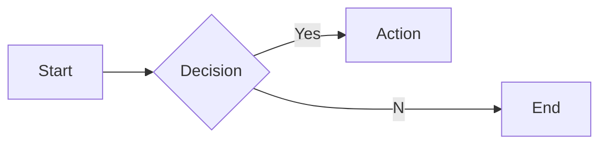
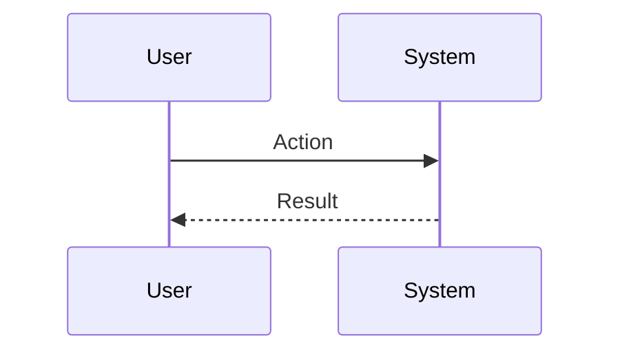

# Interview Questions: Specialist Consultant (PERS)

This document contains 100 interview questions tailored for the Specialist Consultant role. The questions are designed to assess technical skills, soft skills, and cultural fit.

---

## 1. Discretion

**Scenario:** Overhearing sensitive info.

**Question:** How do you handle overhearing confidential or sensitive information about the principal?

**Key Concepts:** `Privacy`, `Discretion`

### Candidate Response Paths
*   **Junior**: I ignore it.
*   **Senior**: I maintain absolute confidentiality and act as if I heard nothing unless it impacts safety.

---

## 2. Anticipation

**Scenario:** Principal is busy.

**Question:** How do you anticipate the needs of the principal before they ask?

**Key Concepts:** `Proactivity`, `Service`

### Candidate Response Paths
*   **Junior**: I wait for instructions.
*   **Senior**: I learn their routines and preferences to have everything ready in advance.

---

## 3. Adaptability

**Scenario:** Last minute change.

**Question:** The schedule changes completely 10 minutes before an event. What do you do?

**Key Concepts:** `Adaptability`, `Composure`

### Candidate Response Paths
*   **Junior**: Panic.
*   **Senior**: Calmly execute the contingency plan and inform relevant parties.

---

## 4. Vendor Management

**Scenario:** Poor service.

**Question:** A vendor is not delivering to the expected standard. How do you handle it?

**Key Concepts:** `Vendor Mgmt`, `Standards`

### Candidate Response Paths
*   **Junior**: Complain to the principal.
*   **Senior**: Address it directly with the vendor, demand correction, or source a replacement.

---

## 5. Service Mindset

**Scenario:** Difficult request.

**Question:** The principal asks for something nearly impossible. How do you respond?

**Key Concepts:** `Resourcefulness`, `Can-do`

### Candidate Response Paths
*   **Junior**: Say no.
*   **Senior**: I say 'I will see what I can do' and exhaust every avenue to make it happen.

---

## 6. Conflict Resolution

**Scenario:** Disagreement with a peer.

**Question:** Tell me about a time you had a significant disagreement with a colleague. How did you resolve it?

**Key Concepts:** `Communication`, `Soft Skills`

### Candidate Response Paths
*   **Junior**: I told them I was right.
*   **Senior**: I listened to their perspective, found common ground, and we compromised.

---

## 7. Failure Handling

**Scenario:** A project went wrong.

**Question:** Describe a time you failed. What happened and what did you learn?

| Metric | Target | Status |
|---|---|---|
| KPI 1 | 100% | Green |
| KPI 2 | < 5% | Yellow |

**Key Concepts:** `Growth Mindset`, `Resilience`

### Candidate Response Paths
*   **Junior**: I tried hard but it failed.
*   **Senior**: I analyzed the root cause, implemented a fix, and shared the learning.

---

## 8. Prioritization

**Scenario:** Too many tasks.

**Question:** How do you prioritize when you have multiple conflicting deadlines?

**Key Concepts:** `Time Management`, `Organization`

### Candidate Response Paths
*   **Junior**: I work longer hours.
*   **Senior**: I communicate with stakeholders to adjust expectations and focus on high-impact tasks.

---

## 9. Adaptability

**Scenario:** Changing requirements.

**Question:** How do you handle sudden changes in project scope or direction?

**Key Concepts:** `Agility`, `Flexibility`

### Candidate Response Paths
*   **Junior**: I get frustrated but do it.
*   **Senior**: I assess the impact, communicate risks, and pivot quickly.

---

## 10. Communication

**Scenario:** Explaining complex topics.

**Question:** Describe a time you had to explain a complex technical/business concept to a non-expert.

**Key Concepts:** `Clarity`, `Empathy`

### Candidate Response Paths
*   **Junior**: I just said it simpler.
*   **Senior**: I used analogies and checked for understanding throughout.

---

## 11. Teamwork

**Scenario:** Collaborating with difficult personalities.

**Question:** How do you handle working with someone who is difficult to work with?

**Key Concepts:** `Collaboration`, `EQ`

### Candidate Response Paths
*   **Junior**: I avoid them.
*   **Senior**: I try to understand their motivations and find a way to work together effectively.

---

## 12. Innovation

**Scenario:** Improving a process.

**Question:** Tell me about a time you improved a process or workflow.

**Key Concepts:** `Innovation`, `Efficiency`

### Candidate Response Paths
*   **Junior**: I followed the rules.
*   **Senior**: I identified a bottleneck, proposed a solution, and measured the improvement.

---

## 13. Feedback

**Scenario:** Receiving constructive criticism.

**Question:** Tell me about a time you received difficult feedback. How did you react?

**Key Concepts:** `Self-awareness`, `Growth`

### Candidate Response Paths
*   **Junior**: I got defensive.
*   **Senior**: I listened, asked for examples, and worked on a plan to improve.

---

## 14. Leadership

**Scenario:** Leading without authority.

**Question:** Describe a time you demonstrated leadership when you weren't the formal manager.

| Metric | Target | Status |
|---|---|---|
| KPI 1 | 100% | Green |
| KPI 2 | < 5% | Yellow |

**Key Concepts:** `Leadership`, `Influence`

### Candidate Response Paths
*   **Junior**: I told people what to do.
*   **Senior**: I rallied the team around a goal and supported them to achieve it.

---

## 15. Decision Making

**Scenario:** Incomplete information.

**Question:** How do you make decisions when you don't have all the data?

**Key Concepts:** `Judgment`, `Risk Mgmt`

### Candidate Response Paths
*   **Junior**: I wait for all data.
*   **Senior**: I assess the risk, make a call based on available info, and adjust as needed.

---

## 16. Teaching Crisis Mgmt

**Scenario:** Mentorship.

**Question:** How would you teach Crisis Mgmt to a junior team member?

**Key Concepts:** `Crisis Mgmt`, `Mentorship`

### Candidate Response Paths
*   **Junior**: Send them a link.
*   **Senior**: Structured learning path and hands-on practice.

---

## 17. Scaling Luxury Standards

**Scenario:** Growth.

**Question:** How do you scale Luxury Standards as the company grows?

**Key Concepts:** `Luxury Standards`, `Scale`

### Candidate Response Paths
*   **Junior**: Hire more people.
*   **Senior**: Process automation, documentation, and leverage.

---

## 18. Deep Dive: Travel Planning

**Scenario:** Assessing depth in Travel Planning.

**Question:** Can you explain Travel Planning in detail and how you have applied it in your past role?

**Key Concepts:** `Travel Planning`, `Experience`

### Candidate Response Paths
*   **Junior**: Basic definition.
*   **Senior**: Deep practical application and nuances.

---

## 19. Ethics in Scheduling

**Scenario:** Ethics.

**Question:** What are the ethical considerations regarding Scheduling?

**Key Concepts:** `Scheduling`, `Ethics`

### Candidate Response Paths
*   **Junior**: Be nice.
*   **Senior**: Privacy, bias, and societal impact.

---

## 20. Metrics for Confidentiality

**Scenario:** Measurement.

**Question:** How do you measure success in Confidentiality?

**Key Concepts:** `Confidentiality`, `Analytics`

### Candidate Response Paths
*   **Junior**: I guess.
*   **Senior**: Specific KPIs and leading/lagging indicators.

---

## 21. Scaling Inventory Mgmt

**Scenario:** Growth.

**Question:** How do you scale Inventory Mgmt as the company grows?

| Metric | Target | Status |
|---|---|---|
| KPI 1 | 100% | Green |
| KPI 2 | < 5% | Yellow |

**Key Concepts:** `Inventory Mgmt`, `Scale`

### Candidate Response Paths
*   **Junior**: Hire more people.
*   **Senior**: Process automation, documentation, and leverage.

---

## 22. Teaching Travel Planning

**Scenario:** Mentorship.

**Question:** How would you teach Travel Planning to a junior team member?

**Key Concepts:** `Travel Planning`, `Mentorship`

### Candidate Response Paths
*   **Junior**: Send them a link.
*   **Senior**: Structured learning path and hands-on practice.

---

## 23. Future of Relationship Mgmt

**Scenario:** Trends.

**Question:** Where do you see Relationship Mgmt heading in the next 5 years?

**Key Concepts:** `Relationship Mgmt`, `Vision`

### Candidate Response Paths
*   **Junior**: It will get better.
*   **Senior**: Emerging trends, AI impact, and market shifts.

---

## 24. Metrics for Vendor Negotiation

**Scenario:** Measurement.

**Question:** How do you measure success in Vendor Negotiation?

**Key Concepts:** `Vendor Negotiation`, `Analytics`

### Candidate Response Paths
*   **Junior**: I guess.
*   **Senior**: Specific KPIs and leading/lagging indicators.

---

## 25. Start vs Scale for Security

**Scenario:** Context.

**Question:** How does your approach to Security differ in a startup vs a large corp?

**Key Concepts:** `Security`, `Context`

### Candidate Response Paths
*   **Junior**: It's the same.
*   **Senior**: Speed/Chaos vs Process/Stability.

---

## 26. Collaboration in Scheduling

**Scenario:** Teamwork.

**Question:** How does Scheduling require cross-functional collaboration?

**Key Concepts:** `Scheduling`, `Collaboration`

### Candidate Response Paths
*   **Junior**: I talk to people.
*   **Senior**: Alignment with other depts and shared goals.

---

## 27. Ethics in Etiquette

**Scenario:** Ethics.

**Question:** What are the ethical considerations regarding Etiquette?

**Key Concepts:** `Etiquette`, `Ethics`

### Candidate Response Paths
*   **Junior**: Be nice.
*   **Senior**: Privacy, bias, and societal impact.

---

## 28. Scaling Event Planning

**Scenario:** Growth.

**Question:** How do you scale Event Planning as the company grows?

| Metric | Target | Status |
|---|---|---|
| KPI 1 | 100% | Green |
| KPI 2 | < 5% | Yellow |

**Key Concepts:** `Event Planning`, `Scale`

### Candidate Response Paths
*   **Junior**: Hire more people.
*   **Senior**: Process automation, documentation, and leverage.

---

## 29. Mistakes in Privacy

**Scenario:** Learning.

**Question:** What common mistakes do people make with Privacy?

**Key Concepts:** `Privacy`, `Experience`

### Candidate Response Paths
*   **Junior**: Doing it wrong.
*   **Senior**: Subtle pitfalls and how to avoid them.

---

## 30. Start vs Scale for Confidentiality

**Scenario:** Context.

**Question:** How does your approach to Confidentiality differ in a startup vs a large corp?

**Key Concepts:** `Confidentiality`, `Context`

### Candidate Response Paths
*   **Junior**: It's the same.
*   **Senior**: Speed/Chaos vs Process/Stability.

---

## 31. Tooling: Travel Planning

**Scenario:** Proficiency.

**Question:** How do you utilize Travel Planning to improve efficiency?

**Key Concepts:** `Travel Planning`, `Productivity`

### Candidate Response Paths
*   **Junior**: I use it daily.
*   **Senior**: Advanced features and automation.

---

## 32. Challenges in Protocol

**Scenario:** Problem Solving.

**Question:** What are the biggest challenges you've faced regarding Protocol?

**Key Concepts:** `Protocol`, `Problem Solving`

### Candidate Response Paths
*   **Junior**: It was hard.
*   **Senior**: Specific examples of obstacles and strategies to overcome them.

---

## 33. Teaching Scheduling

**Scenario:** Mentorship.

**Question:** How would you teach Scheduling to a junior team member?

**Key Concepts:** `Scheduling`, `Mentorship`

### Candidate Response Paths
*   **Junior**: Send them a link.
*   **Senior**: Structured learning path and hands-on practice.

---

## 34. Collaboration in Vendor Negotiation

**Scenario:** Teamwork.

**Question:** How does Vendor Negotiation require cross-functional collaboration?

**Key Concepts:** `Vendor Negotiation`, `Collaboration`

### Candidate Response Paths
*   **Junior**: I talk to people.
*   **Senior**: Alignment with other depts and shared goals.

---

## 35. Protocol Best Practices

**Scenario:** Standardization.

**Question:** What are the industry best practices for Protocol?

| Metric | Target | Status |
|---|---|---|
| KPI 1 | 100% | Green |
| KPI 2 | < 5% | Yellow |

**Key Concepts:** `Protocol`, `Standards`

### Candidate Response Paths
*   **Junior**: List a few.
*   **Senior**: Discusses why they are best practices and when to break them.

---

## 36. Challenges in Hospitality

**Scenario:** Problem Solving.

**Question:** What are the biggest challenges you've faced regarding Hospitality?

**Key Concepts:** `Hospitality`, `Problem Solving`

### Candidate Response Paths
*   **Junior**: It was hard.
*   **Senior**: Specific examples of obstacles and strategies to overcome them.

---

## 37. Mistakes in Crisis Mgmt

**Scenario:** Learning.

**Question:** What common mistakes do people make with Crisis Mgmt?

**Key Concepts:** `Crisis Mgmt`, `Experience`

### Candidate Response Paths
*   **Junior**: Doing it wrong.
*   **Senior**: Subtle pitfalls and how to avoid them.

---

## 38. Metrics for Scheduling

**Scenario:** Measurement.

**Question:** How do you measure success in Scheduling?

**Key Concepts:** `Scheduling`, `Analytics`

### Candidate Response Paths
*   **Junior**: I guess.
*   **Senior**: Specific KPIs and leading/lagging indicators.

---

## 39. Future of Travel Planning

**Scenario:** Trends.

**Question:** Where do you see Travel Planning heading in the next 5 years?

**Key Concepts:** `Travel Planning`, `Vision`

### Candidate Response Paths
*   **Junior**: It will get better.
*   **Senior**: Emerging trends, AI impact, and market shifts.

---

## 40. Scaling Travel Planning

**Scenario:** Growth.

**Question:** How do you scale Travel Planning as the company grows?

**Key Concepts:** `Travel Planning`, `Scale`

### Candidate Response Paths
*   **Junior**: Hire more people.
*   **Senior**: Process automation, documentation, and leverage.

---

## 41. Mistakes in Confidentiality

**Scenario:** Learning.

**Question:** What common mistakes do people make with Confidentiality?

**Key Concepts:** `Confidentiality`, `Experience`

### Candidate Response Paths
*   **Junior**: Doing it wrong.
*   **Senior**: Subtle pitfalls and how to avoid them.

---

## 42. Confidentiality Best Practices

**Scenario:** Standardization.

**Question:** What are the industry best practices for Confidentiality?

| Metric | Target | Status |
|---|---|---|
| KPI 1 | 100% | Green |
| KPI 2 | < 5% | Yellow |

**Key Concepts:** `Confidentiality`, `Standards`

### Candidate Response Paths
*   **Junior**: List a few.
*   **Senior**: Discusses why they are best practices and when to break them.

---

## 43. Collaboration in Privacy

**Scenario:** Teamwork.

**Question:** How does Privacy require cross-functional collaboration?

**Key Concepts:** `Privacy`, `Collaboration`

### Candidate Response Paths
*   **Junior**: I talk to people.
*   **Senior**: Alignment with other depts and shared goals.

---

## 44. Scaling Vendor Negotiation

**Scenario:** Growth.

**Question:** How do you scale Vendor Negotiation as the company grows?

**Key Concepts:** `Vendor Negotiation`, `Scale`

### Candidate Response Paths
*   **Junior**: Hire more people.
*   **Senior**: Process automation, documentation, and leverage.

---

## 45. Future of Privacy

**Scenario:** Trends.

**Question:** Where do you see Privacy heading in the next 5 years?

**Key Concepts:** `Privacy`, `Vision`

### Candidate Response Paths
*   **Junior**: It will get better.
*   **Senior**: Emerging trends, AI impact, and market shifts.

---

## 46. Ethics in Relationship Mgmt

**Scenario:** Ethics.

**Question:** What are the ethical considerations regarding Relationship Mgmt?

**Key Concepts:** `Relationship Mgmt`, `Ethics`

### Candidate Response Paths
*   **Junior**: Be nice.
*   **Senior**: Privacy, bias, and societal impact.

---

## 47. Collaboration in Relationship Mgmt

**Scenario:** Teamwork.

**Question:** How does Relationship Mgmt require cross-functional collaboration?

**Key Concepts:** `Relationship Mgmt`, `Collaboration`

### Candidate Response Paths
*   **Junior**: I talk to people.
*   **Senior**: Alignment with other depts and shared goals.

---

## 48. Challenges in Inventory Mgmt

**Scenario:** Problem Solving.

**Question:** What are the biggest challenges you've faced regarding Inventory Mgmt?

**Key Concepts:** `Inventory Mgmt`, `Problem Solving`

### Candidate Response Paths
*   **Junior**: It was hard.
*   **Senior**: Specific examples of obstacles and strategies to overcome them.

---

## 49. Ethics in Confidentiality

**Scenario:** Ethics.

**Question:** What are the ethical considerations regarding Confidentiality?

| Metric | Target | Status |
|---|---|---|
| KPI 1 | 100% | Green |
| KPI 2 | < 5% | Yellow |

**Key Concepts:** `Confidentiality`, `Ethics`

### Candidate Response Paths
*   **Junior**: Be nice.
*   **Senior**: Privacy, bias, and societal impact.

---

## 50. Mistakes in Protocol

**Scenario:** Learning.

**Question:** What common mistakes do people make with Protocol?

**Key Concepts:** `Protocol`, `Experience`

### Candidate Response Paths
*   **Junior**: Doing it wrong.
*   **Senior**: Subtle pitfalls and how to avoid them.

---

## 51. Challenges in Luxury Standards

**Scenario:** Problem Solving.

**Question:** What are the biggest challenges you've faced regarding Luxury Standards?

**Key Concepts:** `Luxury Standards`, `Problem Solving`

### Candidate Response Paths
*   **Junior**: It was hard.
*   **Senior**: Specific examples of obstacles and strategies to overcome them.

---

## 52. Start vs Scale for Privacy

**Scenario:** Context.

**Question:** How does your approach to Privacy differ in a startup vs a large corp?

**Key Concepts:** `Privacy`, `Context`

### Candidate Response Paths
*   **Junior**: It's the same.
*   **Senior**: Speed/Chaos vs Process/Stability.

---

## 53. Deep Dive: Privacy

**Scenario:** Assessing depth in Privacy.

**Question:** Can you explain Privacy in detail and how you have applied it in your past role?

**Key Concepts:** `Privacy`, `Experience`

### Candidate Response Paths
*   **Junior**: Basic definition.
*   **Senior**: Deep practical application and nuances.

---

## 54. Deep Dive: Protocol

**Scenario:** Assessing depth in Protocol.

**Question:** Can you explain Protocol in detail and how you have applied it in your past role?

**Key Concepts:** `Protocol`, `Experience`

### Candidate Response Paths
*   **Junior**: Basic definition.
*   **Senior**: Deep practical application and nuances.

---

## 55. Mistakes in Hospitality

**Scenario:** Learning.

**Question:** What common mistakes do people make with Hospitality?

**Key Concepts:** `Hospitality`, `Experience`

### Candidate Response Paths
*   **Junior**: Doing it wrong.
*   **Senior**: Subtle pitfalls and how to avoid them.

---

## 56. Crisis Mgmt Best Practices

**Scenario:** Standardization.

**Question:** What are the industry best practices for Crisis Mgmt?

| Metric | Target | Status |
|---|---|---|
| KPI 1 | 100% | Green |
| KPI 2 | < 5% | Yellow |

**Key Concepts:** `Crisis Mgmt`, `Standards`

### Candidate Response Paths
*   **Junior**: List a few.
*   **Senior**: Discusses why they are best practices and when to break them.

---

## 57. Scaling Relationship Mgmt

**Scenario:** Growth.

**Question:** How do you scale Relationship Mgmt as the company grows?

**Key Concepts:** `Relationship Mgmt`, `Scale`

### Candidate Response Paths
*   **Junior**: Hire more people.
*   **Senior**: Process automation, documentation, and leverage.

---

## 58. Future of Crisis Mgmt

**Scenario:** Trends.

**Question:** Where do you see Crisis Mgmt heading in the next 5 years?

**Key Concepts:** `Crisis Mgmt`, `Vision`

### Candidate Response Paths
*   **Junior**: It will get better.
*   **Senior**: Emerging trends, AI impact, and market shifts.

---

## 59. Inventory Mgmt Best Practices

**Scenario:** Standardization.

**Question:** What are the industry best practices for Inventory Mgmt?

**Key Concepts:** `Inventory Mgmt`, `Standards`

### Candidate Response Paths
*   **Junior**: List a few.
*   **Senior**: Discusses why they are best practices and when to break them.

---

## 60. Future of Protocol

**Scenario:** Trends.

**Question:** Where do you see Protocol heading in the next 5 years?

**Key Concepts:** `Protocol`, `Vision`

### Candidate Response Paths
*   **Junior**: It will get better.
*   **Senior**: Emerging trends, AI impact, and market shifts.

---

## 61. Scaling Security

**Scenario:** Growth.

**Question:** How do you scale Security as the company grows?

**Key Concepts:** `Security`, `Scale`

### Candidate Response Paths
*   **Junior**: Hire more people.
*   **Senior**: Process automation, documentation, and leverage.

---

## 62. Start vs Scale for Inventory Mgmt

**Scenario:** Context.

**Question:** How does your approach to Inventory Mgmt differ in a startup vs a large corp?

**Key Concepts:** `Inventory Mgmt`, `Context`

### Candidate Response Paths
*   **Junior**: It's the same.
*   **Senior**: Speed/Chaos vs Process/Stability.

---

## 63. Scheduling Best Practices

**Scenario:** Standardization.

**Question:** What are the industry best practices for Scheduling?

| Metric | Target | Status |
|---|---|---|
| KPI 1 | 100% | Green |
| KPI 2 | < 5% | Yellow |

**Key Concepts:** `Scheduling`, `Standards`

### Candidate Response Paths
*   **Junior**: List a few.
*   **Senior**: Discusses why they are best practices and when to break them.

---

## 64. Relationship Mgmt Best Practices

**Scenario:** Standardization.

**Question:** What are the industry best practices for Relationship Mgmt?

**Key Concepts:** `Relationship Mgmt`, `Standards`

### Candidate Response Paths
*   **Junior**: List a few.
*   **Senior**: Discusses why they are best practices and when to break them.

---

## 65. Ethics in Vendor Negotiation

**Scenario:** Ethics.

**Question:** What are the ethical considerations regarding Vendor Negotiation?

**Key Concepts:** `Vendor Negotiation`, `Ethics`

### Candidate Response Paths
*   **Junior**: Be nice.
*   **Senior**: Privacy, bias, and societal impact.

---

## 66. Metrics for Inventory Mgmt

**Scenario:** Measurement.

**Question:** How do you measure success in Inventory Mgmt?

**Key Concepts:** `Inventory Mgmt`, `Analytics`

### Candidate Response Paths
*   **Junior**: I guess.
*   **Senior**: Specific KPIs and leading/lagging indicators.

---

## 67. Start vs Scale for Crisis Mgmt

**Scenario:** Context.

**Question:** How does your approach to Crisis Mgmt differ in a startup vs a large corp?

**Key Concepts:** `Crisis Mgmt`, `Context`

### Candidate Response Paths
*   **Junior**: It's the same.
*   **Senior**: Speed/Chaos vs Process/Stability.

---

## 68. Tooling: Crisis Mgmt

**Scenario:** Proficiency.

**Question:** How do you utilize Crisis Mgmt to improve efficiency?

**Key Concepts:** `Crisis Mgmt`, `Productivity`

### Candidate Response Paths
*   **Junior**: I use it daily.
*   **Senior**: Advanced features and automation.

---

## 69. Challenges in Vendor Negotiation

**Scenario:** Problem Solving.

**Question:** What are the biggest challenges you've faced regarding Vendor Negotiation?

**Key Concepts:** `Vendor Negotiation`, `Problem Solving`

### Candidate Response Paths
*   **Junior**: It was hard.
*   **Senior**: Specific examples of obstacles and strategies to overcome them.

---

## 70. Metrics for Crisis Mgmt

**Scenario:** Measurement.

**Question:** How do you measure success in Crisis Mgmt?

| Metric | Target | Status |
|---|---|---|
| KPI 1 | 100% | Green |
| KPI 2 | < 5% | Yellow |

**Key Concepts:** `Crisis Mgmt`, `Analytics`

### Candidate Response Paths
*   **Junior**: I guess.
*   **Senior**: Specific KPIs and leading/lagging indicators.

---

## 71. Ethics in Event Planning

**Scenario:** Ethics.

**Question:** What are the ethical considerations regarding Event Planning?

**Key Concepts:** `Event Planning`, `Ethics`

### Candidate Response Paths
*   **Junior**: Be nice.
*   **Senior**: Privacy, bias, and societal impact.

---

## 72. Challenges in Relationship Mgmt

**Scenario:** Problem Solving.

**Question:** What are the biggest challenges you've faced regarding Relationship Mgmt?

**Key Concepts:** `Relationship Mgmt`, `Problem Solving`

### Candidate Response Paths
*   **Junior**: It was hard.
*   **Senior**: Specific examples of obstacles and strategies to overcome them.

---

## 73. Deep Dive: Confidentiality

**Scenario:** Assessing depth in Confidentiality.

**Question:** Can you explain Confidentiality in detail and how you have applied it in your past role?

**Key Concepts:** `Confidentiality`, `Experience`

### Candidate Response Paths
*   **Junior**: Basic definition.
*   **Senior**: Deep practical application and nuances.

---

## 74. Start vs Scale for Scheduling

**Scenario:** Context.

**Question:** How does your approach to Scheduling differ in a startup vs a large corp?

**Key Concepts:** `Scheduling`, `Context`

### Candidate Response Paths
*   **Junior**: It's the same.
*   **Senior**: Speed/Chaos vs Process/Stability.

---

## 75. Future of Inventory Mgmt

**Scenario:** Trends.

**Question:** Where do you see Inventory Mgmt heading in the next 5 years?

**Key Concepts:** `Inventory Mgmt`, `Vision`

### Candidate Response Paths
*   **Junior**: It will get better.
*   **Senior**: Emerging trends, AI impact, and market shifts.

---

## 76. Logistics Best Practices

**Scenario:** Standardization.

**Question:** What are the industry best practices for Logistics?

**Key Concepts:** `Logistics`, `Standards`

### Candidate Response Paths
*   **Junior**: List a few.
*   **Senior**: Discusses why they are best practices and when to break them.

---

## 77. Collaboration in Luxury Standards

**Scenario:** Teamwork.

**Question:** How does Luxury Standards require cross-functional collaboration?

| Metric | Target | Status |
|---|---|---|
| KPI 1 | 100% | Green |
| KPI 2 | < 5% | Yellow |

**Key Concepts:** `Luxury Standards`, `Collaboration`

### Candidate Response Paths
*   **Junior**: I talk to people.
*   **Senior**: Alignment with other depts and shared goals.

---

## 78. Deep Dive: Event Planning

**Scenario:** Assessing depth in Event Planning.

**Question:** Can you explain Event Planning in detail and how you have applied it in your past role?

**Key Concepts:** `Event Planning`, `Experience`

### Candidate Response Paths
*   **Junior**: Basic definition.
*   **Senior**: Deep practical application and nuances.

---

## 79. Mistakes in Inventory Mgmt

**Scenario:** Learning.

**Question:** What common mistakes do people make with Inventory Mgmt?

**Key Concepts:** `Inventory Mgmt`, `Experience`

### Candidate Response Paths
*   **Junior**: Doing it wrong.
*   **Senior**: Subtle pitfalls and how to avoid them.

---

## 80. Mistakes in Scheduling

**Scenario:** Learning.

**Question:** What common mistakes do people make with Scheduling?

**Key Concepts:** `Scheduling`, `Experience`

### Candidate Response Paths
*   **Junior**: Doing it wrong.
*   **Senior**: Subtle pitfalls and how to avoid them.

---

## 81. Tooling: Vendor Negotiation

**Scenario:** Proficiency.

**Question:** How do you utilize Vendor Negotiation to improve efficiency?

**Key Concepts:** `Vendor Negotiation`, `Productivity`

### Candidate Response Paths
*   **Junior**: I use it daily.
*   **Senior**: Advanced features and automation.

---

## 82. Challenges in Event Planning

**Scenario:** Problem Solving.

**Question:** What are the biggest challenges you've faced regarding Event Planning?

**Key Concepts:** `Event Planning`, `Problem Solving`

### Candidate Response Paths
*   **Junior**: It was hard.
*   **Senior**: Specific examples of obstacles and strategies to overcome them.

---

## 83. Ethics in Logistics

**Scenario:** Ethics.

**Question:** What are the ethical considerations regarding Logistics?

**Key Concepts:** `Logistics`, `Ethics`

### Candidate Response Paths
*   **Junior**: Be nice.
*   **Senior**: Privacy, bias, and societal impact.

---

## 84. Scaling Privacy

**Scenario:** Growth.

**Question:** How do you scale Privacy as the company grows?

| Metric | Target | Status |
|---|---|---|
| KPI 1 | 100% | Green |
| KPI 2 | < 5% | Yellow |

**Key Concepts:** `Privacy`, `Scale`

### Candidate Response Paths
*   **Junior**: Hire more people.
*   **Senior**: Process automation, documentation, and leverage.

---

## 85. Mistakes in Relationship Mgmt

**Scenario:** Learning.

**Question:** What common mistakes do people make with Relationship Mgmt?

**Key Concepts:** `Relationship Mgmt`, `Experience`

### Candidate Response Paths
*   **Junior**: Doing it wrong.
*   **Senior**: Subtle pitfalls and how to avoid them.

---

## 86. Teaching Relationship Mgmt

**Scenario:** Mentorship.

**Question:** How would you teach Relationship Mgmt to a junior team member?

**Key Concepts:** `Relationship Mgmt`, `Mentorship`

### Candidate Response Paths
*   **Junior**: Send them a link.
*   **Senior**: Structured learning path and hands-on practice.

---

## 87. Teaching Luxury Standards

**Scenario:** Mentorship.

**Question:** How would you teach Luxury Standards to a junior team member?

**Key Concepts:** `Luxury Standards`, `Mentorship`

### Candidate Response Paths
*   **Junior**: Send them a link.
*   **Senior**: Structured learning path and hands-on practice.

---

## 88. Tooling: Hospitality

**Scenario:** Proficiency.

**Question:** How do you utilize Hospitality to improve efficiency?

**Key Concepts:** `Hospitality`, `Productivity`

### Candidate Response Paths
*   **Junior**: I use it daily.
*   **Senior**: Advanced features and automation.

---

## 89. Metrics for Hospitality

**Scenario:** Measurement.

**Question:** How do you measure success in Hospitality?

**Key Concepts:** `Hospitality`, `Analytics`

### Candidate Response Paths
*   **Junior**: I guess.
*   **Senior**: Specific KPIs and leading/lagging indicators.

---

## 90. Teaching Hospitality

**Scenario:** Mentorship.

**Question:** How would you teach Hospitality to a junior team member?

**Key Concepts:** `Hospitality`, `Mentorship`

### Candidate Response Paths
*   **Junior**: Send them a link.
*   **Senior**: Structured learning path and hands-on practice.

---

## 91. Metrics for Etiquette

**Scenario:** Measurement.

**Question:** How do you measure success in Etiquette?

| Metric | Target | Status |
|---|---|---|
| KPI 1 | 100% | Green |
| KPI 2 | < 5% | Yellow |

**Key Concepts:** `Etiquette`, `Analytics`

### Candidate Response Paths
*   **Junior**: I guess.
*   **Senior**: Specific KPIs and leading/lagging indicators.

---

## 92. Collaboration in Confidentiality

**Scenario:** Teamwork.

**Question:** How does Confidentiality require cross-functional collaboration?

**Key Concepts:** `Confidentiality`, `Collaboration`

### Candidate Response Paths
*   **Junior**: I talk to people.
*   **Senior**: Alignment with other depts and shared goals.

---

## 93. Collaboration in Event Planning

**Scenario:** Teamwork.

**Question:** How does Event Planning require cross-functional collaboration?

**Key Concepts:** `Event Planning`, `Collaboration`

### Candidate Response Paths
*   **Junior**: I talk to people.
*   **Senior**: Alignment with other depts and shared goals.

---

## 94. Future of Logistics

**Scenario:** Trends.

**Question:** Where do you see Logistics heading in the next 5 years?

**Key Concepts:** `Logistics`, `Vision`

### Candidate Response Paths
*   **Junior**: It will get better.
*   **Senior**: Emerging trends, AI impact, and market shifts.

---

## 95. Privacy Best Practices

**Scenario:** Standardization.

**Question:** What are the industry best practices for Privacy?

**Key Concepts:** `Privacy`, `Standards`

### Candidate Response Paths
*   **Junior**: List a few.
*   **Senior**: Discusses why they are best practices and when to break them.

---

## 96. Future of Etiquette

**Scenario:** Trends.

**Question:** Where do you see Etiquette heading in the next 5 years?

**Key Concepts:** `Etiquette`, `Vision`

### Candidate Response Paths
*   **Junior**: It will get better.
*   **Senior**: Emerging trends, AI impact, and market shifts.

---

## 97. Future of Confidentiality

**Scenario:** Trends.

**Question:** Where do you see Confidentiality heading in the next 5 years?

**Key Concepts:** `Confidentiality`, `Vision`

### Candidate Response Paths
*   **Junior**: It will get better.
*   **Senior**: Emerging trends, AI impact, and market shifts.

---

## 98. Mistakes in Travel Planning

**Scenario:** Learning.

**Question:** What common mistakes do people make with Travel Planning?

| Metric | Target | Status |
|---|---|---|
| KPI 1 | 100% | Green |
| KPI 2 | < 5% | Yellow |

**Key Concepts:** `Travel Planning`, `Experience`

### Candidate Response Paths
*   **Junior**: Doing it wrong.
*   **Senior**: Subtle pitfalls and how to avoid them.

---

## 99. Collaboration in Inventory Mgmt

**Scenario:** Teamwork.

**Question:** How does Inventory Mgmt require cross-functional collaboration?

**Key Concepts:** `Inventory Mgmt`, `Collaboration`

### Candidate Response Paths
*   **Junior**: I talk to people.
*   **Senior**: Alignment with other depts and shared goals.

---

## 100. Collaboration in Etiquette

**Scenario:** Teamwork.

**Question:** How does Etiquette require cross-functional collaboration?

**Key Concepts:** `Etiquette`, `Collaboration`

### Candidate Response Paths
*   **Junior**: I talk to people.
*   **Senior**: Alignment with other depts and shared goals.

---
