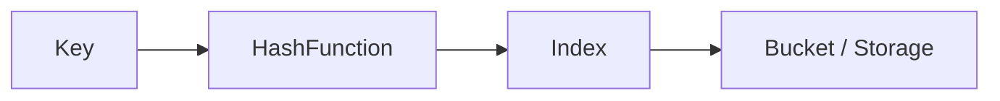

# Software Engineering Interview Questions & Answers (100+)

This guide contains 100+ Software Engineering interview questions, covering Algorithms, System Design, OS, Networking, and Soft Skills. Each question includes a model answer and potential follow-up paths.

## Part 1: Algorithms & Data Structures (1-20)

### 1. Explain Big O Notation.

Big O notation describes the **worst-case** performance or complexity of an algorithm. It characterizes the execution time or space used as the input size ($n$) grows.

| Notation | Name | Example Algorithm |
| :--- | :--- | :--- |
| $O(1)$ | Constant | Accessing array index |
| $O(\log n)$ | Logarithmic | Binary Search |
| $O(n)$ | Linear | Linear Search |
| $O(n \log n)$ | Linearithmic | Merge Sort |
| $O(n^2)$ | Quadratic | Bubble Sort |

**Candidate Response Paths:**

*   **Path A: Candidate mentions Space Complexity.**
    *   *Follow-up:* "What is the space complexity of a recursive Fibonacci function without memoization?"
    *   *Answer:* $O(n)$ (stack depth).

### 2. Array vs. Linked List?

*   **Array:** Contiguous memory. $O(1)$ access. $O(n)$ insertion/deletion (shifting). Fixed size (usually).
*   **Linked List:** Non-contiguous. $O(n)$ access. $O(1)$ insertion/deletion (if pointer known). Dynamic size.

**Candidate Response Paths:**

*   **Path A: Cache Locality.**
    *   *Follow-up:* "Why are Arrays generally faster for iteration than Linked Lists?"
    *   *Answer:* Spatial locality / CPU caching. Arrays are contiguous blocks.

### 3. What is a Hash Table?

A data structure that implements an associative array abstract data type, a structure that can map keys to values. It uses a hash function to compute an index into an array of buckets or slots.



**Candidate Response Paths:**

*   **Path A: Collisions.**
    *   *Follow-up:* "How do you handle collisions?"
    *   *Answer:* Chaining (Linked Lists in buckets) or Open Addressing (Probing).

### 4. Stack vs. Queue?

*   **Stack:** LIFO (Last In, First Out). Operations: `push`, `pop`. Used in recursion, undo mechanisms.
*   **Queue:** FIFO (First In, First Out). Operations: `enqueue`, `dequeue`. Used in job scheduling, BFS.

### 5. Explain Binary Search.

An efficient algorithm for finding an item from a **sorted** list of items. It works by repeatedly dividing in half the portion of the list that could contain the item.

**Time Complexity:** $O(\log n)$

**Candidate Response Paths:**

*   **Path A: Pre-requisites.**
    *   *Follow-up:* "What happens if the array is not sorted?"
    *   *Answer:* Binary search fails. You must sort first ($O(n \log n)$) or use Linear Search ($O(n)$).

### 6. What is a Binary Search Tree (BST)?

A node-based binary tree data structure which has the following properties:
*   The left subtree of a node contains only nodes with keys lesser than the node’s key.
*   The right subtree of a node contains only nodes with keys greater than the node’s key.

**Candidate Response Paths:**

*   **Path A: Balancing.**
    *   *Follow-up:* "What is the worst-case search time in a BST?"
    *   *Answer:* $O(n)$ if the tree becomes a skewed line. Balanced trees (AVL, Red-Black) guarantee $O(\log n)$.

### 7. BFS vs. DFS?

*   **BFS (Breadth-First Search):** Explores neighbor nodes first. Uses a **Queue**. Good for finding shortest path in unweighted graphs.
*   **DFS (Depth-First Search):** Explores as far as possible along each branch before backtracking. Uses a **Stack** (recursion). Good for puzzles, topological sort.

### 8. Explain QuickSort.

A divide-and-conquer algorithm. It picks an element as a **pivot** and partitions the given array around the picked pivot.

*   **Best/Avg:** $O(n \log n)$
*   **Worst:** $O(n^2)$ (if pivot is always smallest/largest)

**Candidate Response Paths:**

*   **Path A: Pivot Selection.**
    *   *Follow-up:* "How can you avoid the worst-case scenario?"
    *   *Answer:* Pick a random pivot or median-of-three.

### 9. Explain Merge Sort.

A divide-and-conquer algorithm that divides the input array into two halves, calls itself for the two halves, and then merges the two sorted halves.

*   **Complexity:** Always $O(n \log n)$.
*   **Stability:** Stable sort (maintains relative order of equal elements).

### 10. What is Dynamic Programming?

A method for solving complex problems by breaking them down into simpler subproblems. It is applicable to problems exhibiting **overlapping subproblems** and **optimal substructure**.

**Two approaches:**
1.  **Memoization (Top-Down):** Cache results of recursive calls.
2.  **Tabulation (Bottom-Up):** Fill a table iteratively.

### 11. What is a Priority Queue?

A generic data structure where each element has a "priority" associated with it. Elements with high priority are served before elements with low priority. Usually implemented with a **Heap**.

### 12. Min-Heap vs. Max-Heap?

*   **Min-Heap:** The key at the root must be minimum among all keys present in the Binary Heap. This property must be recursively true for all nodes.
*   **Max-Heap:** The key at the root must be maximum.

**Candidate Response Paths:**

*   **Path A: Complexity.**
    *   *Follow-up:* "Time complexity to insert or extract min/max?"
    *   *Answer:* $O(\log n)$ to maintain the heap property.

### 13. What is Recursion?

A process where a function calls itself as a subroutine.
Must have:
1.  **Base Case:** To stop the recursion.
2.  **Recursive Step:** To move closer to the base case.

### 14. Invert a Binary Tree.

Swap the left and right children of every node.

```python
def invertTree(root):
    if not root: return None
    root.left, root.right = invertTree(root.right), invertTree(root.left)
    return root
```

### 15. Detect a cycle in a Linked List.

**Floyd’s Cycle-Finding Algorithm (Tortoise and Hare):**
Use two pointers. One moves 1 step, the other moves 2 steps. If they meet, there is a cycle.

### 16. What is the difference between a Graph and a Tree?

A **Tree** is a special kind of **Graph** that is:
1.  Connected.
2.  Acyclic (No cycles).
3.  Has $N$ nodes and $N-1$ edges.

### 17. Explain 'Greedy' Algorithms.

An algorithmic paradigm that follows the problem-solving heuristic of making the locally optimal choice at each stage with the hope of finding a global optimum.
*Example:* Dijkstra's Algorithm, Huffman Coding.

### 18. How to find duplicates in an array in $O(n)$ time?

Use a **HashSet** or a **Frequency Map**. Iterate through the array; if the element is already in the set, it's a duplicate.

### 19. What is a Trie (Prefix Tree)?

A tree-like data structure used to store a dynamic set of strings where the keys are usually strings.
**Use Case:** Autocomplete systems.

### 20. String Immutability.

In many languages (Java, Python, C#), strings are immutable. You cannot change characters in place; you create a new string.
**Reason:** Security, Thread-safety, String Pool optimization.

## Part 2: System Design & Architecture (21-40)

### 21. Vertical vs. Horizontal Scaling?

| Feature | Vertical (Scale Up) | Horizontal (Scale Out) |
| :--- | :--- | :--- |
| **Definition** | Add more power (CPU, RAM) to existing machine. | Add more machines to the pool. |
| **Downtime** | Usually requires downtime to upgrade. | No downtime (add nodes dynamically). |
| **Limit** | Hard hardware limits. | Infinite (theoretical). |
| **Cost** | Exponentially expensive for high-end hardware. | Linear cost (commodity hardware). |

### 22. What is a Load Balancer?

A device that acts as a reverse proxy and distributes network or application traffic across a number of servers.
*   **Layer 4 (Transport):** Based on IP/Port.
*   **Layer 7 (Application):** Based on URL, Cookies, Headers.

### 23. Explain CAP Theorem.

In a distributed data store, you can only guarantee 2 out of 3:
1.  **Consistency:** Every read receives the most recent write or an error.
2.  **Availability:** Every request receives a (non-error) response, without the guarantee that it contains the most recent write.
3.  **Partition Tolerance:** The system continues to operate despite an arbitrary number of messages being dropped or delayed by the network.

**Candidate Response Paths:**

*   **Path A: Real world.**
    *   *Follow-up:* "Can you sacrifice P?"
    *   *Answer:* No, network partitions are inevitable. You must choose between CP (Mongo, Redis) and AP (Cassandra, Dynamo).

### 24. Monolithic vs. Microservices Architecture?

*   **Monolith:** Single codebase, single build, single deployment. Simple to start, hard to scale teams.
*   **Microservices:** Collection of loosely coupled services. Independent deployment, scalable, complex to manage (network latency, consistency).

### 25. What is Database Sharding?

A type of database partitioning that separates very large databases the into smaller, faster, more easily managed parts called data shards.
*   *Key:* Shard Key selection is critical to avoid "hot shards".

### 26. What is Caching?

Storing copies of data in a temporary storage location (cache) so that future requests for that data can be served faster.
*   **Types:** Browser, CDN, API Gateway, Application (Memcached/Redis), Database.

### 27. Cache Eviction Policies?

*   **LRU (Least Recently Used):** Discard items not used for the longest time.
*   **LFU (Least Frequently Used):** Discard items used least often.
*   **FIFO (First In, First Out).**

### 28. What is a CDN (Content Delivery Network)?

A geographically distributed group of servers which work together to provide fast delivery of Internet content. It caches static assets (images, CSS, JS) closer to the user.

### 29. SQL vs. NoSQL?

*   **SQL (Relational):** Structured, Schema-based, ACID, Vertical Scaling. (MySQL, Postgres).
*   **NoSQL (Non-Relational):** Unstructured/Semi-structured, Schema-less, BASE, Horizontal Scaling. (MongoDB, Cassandra).

### 30. What is Consistent Hashing?

A distributed hashing scheme that operates independently of the number of servers or objects in a distributed hash table. It minimizes reorganization of keys when a server is added or removed.

### 31. What is a Reverse Proxy?

A server that sits in front of web servers and forwards client (e.g. browser) requests to those web servers.
**Benefits:** Load Balancing, Security, Caching, SSL Termination.

### 32. Rate Limiting algorithms.

*   **Token Bucket:** Tokens are added at a fixed rate. Request consumes a token.
*   **Leaky Bucket:** Requests enter a queue and are processed at a constant rate.
*   **Fixed Window:** Count requests per minute.
*   **Sliding Window:** More smooth than fixed window.

### 33. What is a Message Queue?

A form of asynchronous service-to-service communication used in serverless and microservices architectures. (RabbitMQ, Kafka, SQS).
**Benefit:** Decoupling, Buffering, Reliability.

### 34. Throughput vs. Latency?

*   **Latency:** Time taken to process a single request (Speed).
*   **Throughput:** Number of requests processed per second (Capacity).

### 35. Explain "Backpressure".

When a system is overwhelmed by data/requests, it pushes back against the producer to slow down, preventing the system from crashing.

### 36. Polling vs. WebSockets vs. Server-Sent Events (SSE)?

*   **Polling:** Client asks server "New data?" periodically. (Inefficient).
*   **Long Polling:** Client asks, server holds connection open until data is available.
*   **WebSockets:** Full-duplex (two-way) communication over single TCP connection.
*   **SSE:** One-way (Server to Client) streaming.

### 37. What is Database Replication?

Copying data from one database server (primary) to others (replicas).
*   **Master-Slave:** Write to Master, Read from Slaves.
*   **Master-Master:** Write to any node (Complex conflict resolution).

### 38. Single Point of Failure (SPOF).

A part of a system that, if it fails, will stop the entire system from working.
**Solution:** Redundancy (Backup servers, Clusters).

### 39. Idempotency.

An operation is idempotent if applying it multiple times has the same effect as applying it once.
*   *GET/PUT/DELETE* are idempotent.
*   *POST* is generally not.

### 40. Design a URL Shortener (TinyURL).

**Key Components:**
1.  **API:** `create(long_url) -> short_url`, `get(short_url) -> long_url` (redirect).
2.  **Algorithm:** Base62 encoding of a unique ID.
3.  **Storage:** Key-Value store (fast lookups).

## Part 3: Operating Systems & Low Level (41-60)

### 41. Process vs. Thread?

| Feature | Process | Thread |
| :--- | :--- | :--- |
| **Definition** | An instance of a program in execution. | A sequence of instructions within a process. |
| **Memory** | Isolated memory space. | Shared memory (Heap) within process. |
| **Overhead** | High (Context switch is slow). | Low (Lightweight context switch). |
| **Communication** | IPC (Pipes, Sockets). | Direct memory access. |

### 42. What is Concurrency vs. Parallelism?

*   **Concurrency:** Handling multiple tasks at once (interleaving execution). Structure of the program.
*   **Parallelism:** Doing multiple tasks at once (simultaneous execution). Hardware execution.

### 43. What is a Deadlock?

A situation where a set of processes are blocked because each process is holding a resource and waiting for another resource acquired by some other process.

**Necessary Conditions (Coffman Conditions):**
1.  Mutual Exclusion.
2.  Hold and Wait.
3.  No Preemption.
4.  Circular Wait.

### 44. What is a Semaphore?

A variable or abstract data type used to control access to a common resource by multiple processes in a concurrent system such as a multitasking operating system.
*   **Binary Semaphore (Mutex):** 0 or 1.
*   **Counting Semaphore:** Allow $N$ accessors.

### 45. Explain Virtual Memory.

A memory management technique that provides an "idealized abstraction" of the storage resources that are actually available on a given machine. It maps memory addresses used by a program, called virtual addresses, into physical addresses in computer memory.

**Benefit:** Process isolation, ability to use more memory than physically available (Paging/Swapping).

### 46. Stack vs. Heap Memory?

*   **Stack:** Static memory allocation. Stores local variables, function calls. Fast access. Automatic deallocation when function returns.
*   **Heap:** Dynamic memory allocation. Stores objects. Slower access. Manual (C++) or Garbage Collected (Java/Python) deallocation.

### 47. What is a Context Switch?

The process of storing the state of a process or thread, so that it can be restored and resume execution later. This allows multiple processes to share a single CPU. It is computationally expensive.

### 48. What is a Race Condition?

A condition where the system's substantive behavior is dependent on the sequence or timing of other uncontrollable events. Occurs when two threads access shared data and try to change it at the same time.

### 49. Static vs. Dynamic Linking?

*   **Static:** Libraries are copied into the executable at compile time. Larger binary, no dependency issues.
*   **Dynamic:** Libraries are loaded at runtime. Smaller binary, shared memory efficiency, "DLL Hell" potential.

### 50. What is a System Call?

The programmatic way in which a computer program requests a service from the kernel of the operating system (e.g., File I/O, process creation).

### 51. Compiler vs. Interpreter?

*   **Compiler:** Translates entire source code into machine code *before* execution. (C++, Go). Faster execution.
*   **Interpreter:** Translates source code line-by-line *during* execution. (Python, Ruby). Faster development cycle.

### 52. What is Garbage Collection?

A form of automatic memory management. The garbage collector attempts to reclaim memory which was allocated by the program, but is no longer referenced.

**Candidate Response Paths:**

*   **Path A: How it works.**
    *   *Follow-up:* "What is 'Stop the World'?"
    *   *Answer:* A pause in application execution while the GC runs.

### 53. Big Endian vs. Little Endian?

Order of bytes.
*   **Big Endian:** Most significant byte first (at lowest address). (Networking protocols).
*   **Little Endian:** Least significant byte first. (x86 architecture).

### 54. What is Thrashing?

When the computer's virtual memory subsystem is in a constant state of paging (swapping data between RAM and Disk), rapidly exchanging data for data on disk, to the exclusion of most application-level processing.

### 55. What is an Inode?

A data structure in a Unix-style file system that describes a file-system object like a file or a directory. It stores attributes (permissions, owner, size) and disk block locations, but *not* the filename.

### 56. What happens when you type a URL in the browser?

1.  DNS Lookup (Domain -> IP).
2.  TCP Handshake (SYN, SYN-ACK, ACK).
3.  SSL/TLS Handshake (if HTTPS).
4.  HTTP GET Request.
5.  Server processes and sends HTTP Response.
6.  Browser renders content.

### 57. TCP vs. UDP?

*   **TCP (Transmission Control Protocol):** Connection-oriented, reliable, ordered, flow control. (Web, Email).
*   **UDP (User Datagram Protocol):** Connectionless, unreliable, no ordering, fast. (Streaming, Gaming).

### 58. Explain the OSI Model.

1.  **Physical** (Cables)
2.  **Data Link** (MAC, Switches)
3.  **Network** (IP, Routers)
4.  **Transport** (TCP/UDP)
5.  **Session**
6.  **Presentation** (Encryption)
7.  **Application** (HTTP, FTP)

### 59. What is a Zombie Process?

A process that has completed execution but still has an entry in the process table. This occurs for child processes that have stayed alive but their parent has not yet waited for them (called `wait()`).

### 60. Hard Link vs. Soft Link?

*   **Hard Link:** Direct pointer to the inode. Deleting original file doesn't affect hard link. Cannot cross file systems.
*   **Soft (Symbolic) Link:** Pointer to the file name/path. If original is deleted, link is broken. Can cross file systems.

## Part 4: Networking, Web & Databases (61-80)

### 61. HTTP Methods.

*   **GET:** Retrieve data.
*   **POST:** Submit data (create).
*   **PUT:** Update data (replace entirely).
*   **PATCH:** Partial update.
*   **DELETE:** Remove data.

### 62. HTTP Status Codes.

*   **2xx:** Success (200 OK, 201 Created).
*   **3xx:** Redirection (301 Moved Permanently, 304 Not Modified).
*   **4xx:** Client Error (400 Bad Request, 401 Unauthorized, 403 Forbidden, 404 Not Found).
*   **5xx:** Server Error (500 Internal Server Error, 502 Bad Gateway).

### 63. HTTPS vs. HTTP.

HTTPS is HTTP over **SSL/TLS**. It encrypts communication using Public Key Infrastructure (PKI) to ensure confidentiality, integrity, and authentication.

### 64. REST vs. GraphQL?

*   **REST:** Resource-based. Multiple endpoints (`/users`, `/posts`). Over-fetching/Under-fetching common.
*   **GraphQL:** Query language. Single endpoint. Client asks for exactly what it needs.

### 65. What is a Cookie?

Small piece of data sent from a website and stored on the user's computer by the user's web browser while the user is browsing. Used for Session management, Personalization, Tracking.

### 66. Session vs. Token (JWT) Authentication?

*   **Session:** Server stores session data in memory/DB. Client sends SessionID cookie. Stateful.
*   **Token (JWT):** Server signs a token with data. Client stores token. Server validates signature. Stateless.

### 67. What is CORS?

**Cross-Origin Resource Sharing**. A security feature where a browser blocks a web page from making requests to a different domain than the one that served the web page, unless the server explicitly allows it (via Headers like `Access-Control-Allow-Origin`).

### 68. LocalStorage vs. SessionStorage vs. Cookies?

| Feature | Cookie | LocalStorage | SessionStorage |
| :--- | :--- | :--- | :--- |
| **Capacity** | 4KB | 5-10MB | 5-10MB |
| **Expiry** | Manual | Never | On Tab Close |
| **Sent to Server** | Yes (Every Request) | No | No |

### 69. What is DNS?

**Domain Name System**. The phonebook of the internet. Translates human-readable domain names (`google.com`) to IP addresses (`142.250.190.46`).

### 70. What is SQL Injection?

A code injection technique where an attacker executes malicious SQL statements that control a web application's database server.
**Prevention:** Prepared Statements (Parameterized Queries).

### 71. What is XSS (Cross-Site Scripting)?

A vulnerability where an attacker injects malicious scripts into content from otherwise trusted websites.
**Prevention:** Content Security Policy (CSP), Escaping/Sanitizing inputs.

### 72. What is CSRF (Cross-Site Request Forgery)?

An attack that forces an end user to execute unwanted actions on a web application in which they're currently authenticated.
**Prevention:** Anti-CSRF Tokens.

### 73. What is a Webhook?

A way for an app to provide other applications with real-time information. A "user-defined HTTP callback".

### 74. TCP 3-Way Handshake.

1.  **SYN:** Client sends SYN to Server ("I want to connect").
2.  **SYN-ACK:** Server replies with SYN-ACK ("I acknowledge, let's connect").
3.  **ACK:** Client sends ACK ("Connection established").

### 75. Explain 'Keep-Alive'.

An instruction that allows a single TCP connection to remain open for multiple HTTP requests/responses, reducing latency (avoiding repeated handshakes).

### 76. Forward Proxy vs. Reverse Proxy?

*   **Forward:** Sits before the client. Hides client identity. (e.g., VPN, bypassing firewalls).
*   **Reverse:** Sits before the server. Hides server identity. (e.g., Load Balancer).

### 77. What is a Subnet Mask?

A 32-bit number that masks an IP address, and divides the IP address into network address and host address.

### 78. What is 'localhost' and 127.0.0.1?

The loopback address. It points back to the computer you are currently using.

### 79. What is dependency injection?

A design pattern in which a class requests dependencies from external sources rather than creating them.
**Benefit:** Decoupling, easier testing (mocking).

### 80. Explain 'Stateless' protocol.

A protocol where each request is treated as an independent transaction that is unrelated to any previous request. HTTP is stateless.

## Part 5: Soft Skills, Methodologies & DevOps (81-100)

### 81. Explain CI/CD.

*   **CI (Continuous Integration):** Developers merge their changes back to the main branch as often as possible. Automated builds and tests run.
*   **CD (Continuous Delivery/Deployment):** Automatically releasing code changes to a repository or production.

### 82. What is Git?

A distributed version control system for tracking changes in source code during software development.

**Candidate Response Paths:**

*   **Path A: Git vs SVN.**
    *   *Follow-up:* "What does 'distributed' mean?"
    *   *Answer:* Every developer has a full copy of the repository history.

### 83. Merge vs. Rebase?

*   **Merge:** Creates a new commit, preserves history structure. Non-destructive.
*   **Rebase:** Moves the entire feature branch to begin on the tip of the master branch. Cleaner history (linear), but destructive (rewrites history).

### 84. What is Agile?

A project management methodology characterized by the division of tasks into short phases of work and frequent reassessment and adaptation of plans.

### 85. Scrum vs. Kanban?

*   **Scrum:** Fixed sprints (e.g., 2 weeks). Roles (Scrum Master, PO). Ceremonies.
*   **Kanban:** Continuous flow. Visualize work. Limit WIP (Work In Progress). No fixed sprints.

### 86. What is TDD (Test Driven Development)?

Process:
1.  Write a failing test.
2.  Write just enough code to pass the test.
3.  Refactor.

### 87. Docker vs. Virtual Machine?

*   **VM:** Virtualizes hardware. Heavy. Includes full OS.
*   **Docker (Container):** Virtualizes OS. Lightweight. Shares Host OS kernel.

### 88. What is Kubernetes (K8s)?

An open-source system for automating deployment, scaling, and management of containerized applications (Orchestration).

### 89. Explain SOLID principles.

*   **S:** Single Responsibility Principle.
*   **O:** Open/Closed Principle.
*   **L:** Liskov Substitution Principle.
*   **I:** Interface Segregation Principle.
*   **D:** Dependency Inversion Principle.

### 90. What is Technical Debt?

The implied cost of additional rework caused by choosing an easy (limited) solution now instead of using a better approach that would take longer.

### 91. How do you handle a disagreement with a team member?

**STAR Method:**
*   **S/T:** Situation/Task (Disagreement on API design).
*   **A:** Action (Listened, understood their view, proposed compromise or data-driven decision).
*   **R:** Result (Reached consensus, improved relationship).

### 92. Describe a challenging bug you fixed.

*Look for:* Process of debugging. Logging, reproducing, isolating, fixing, adding regression test.

### 93. What is Code Review?

A systematic examination of computer source code.
**Goals:** Find bugs, improve quality, knowledge sharing, consistency.

### 94. What is "Blue/Green Deployment"?

A technique that reduces downtime and risk by running two identical production environments called Blue and Green.
At any time, one is live (Blue). You deploy to Green. Once tested, you switch the router to Green.

### 95. What is "Canary Deployment"?

Rolling out a new version to a small subset of users (canaries) before rolling it out to the entire infrastructure.

### 96. What is Infrastructure as Code (IaC)?

Managing and provisioning computer data centers through machine-readable definition files, rather than physical hardware configuration or interactive configuration tools. (Terraform, CloudFormation).

### 97. Pair Programming pros/cons?

*   **Pros:** Fewer bugs, knowledge sharing, focus.
*   **Cons:** Exhausting, personality clashes, short-term velocity drop.

### 98. How do you stay updated with technology?

Blogs (HackerNews), Conferences, Side Projects, Reading Docs, Twitter/X.

### 99. Explain the "Bus Factor".

The minimum number of team members that have to disappear from a project before the project stalls due to lack of knowledgeable or competent personnel.
**Goal:** Increase Bus Factor (Knowledge Sharing).

### 100. What happens when you type `ls -l` in a shell?

1.  Shell reads input.
2.  Parses tokens.
3.  Checks aliases/functions.
4.  Checks `PATH` for executable.
5.  `fork()` to create child process.
6.  `exec()` to run `ls`.
7.  `ls` reads directory entries and prints formatted output.
8.  Parent process `wait()`s for child to finish.
9.  Shell prints prompt.

---
**End of Questions**
