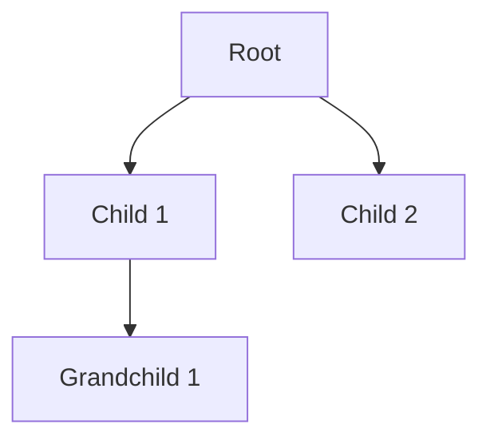
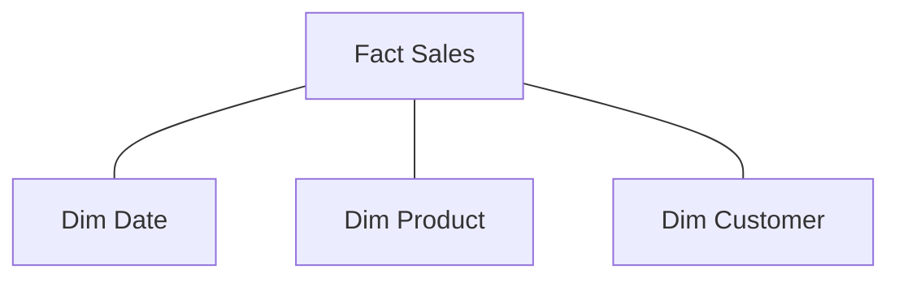

# SQL Interview Questions & Answers (100+)

This guide contains 100+ SQL interview questions, ranging from basic to advanced. Each question includes a model answer and potential follow-up paths based on the candidate's response.

## Part 1: Basic SQL Concepts (1-20)

### 1. What is the difference between `DELETE`, `TRUNCATE`, and `DROP`?

| Command | Type | Description | Rollback? | Performance |
| :--- | :--- | :--- | :--- | :--- |
| `DELETE` | DML | Removes specific rows based on a WHERE clause. | Yes | Slower (logs per row) |
| `TRUNCATE` | DDL | Removes all rows from a table. Resets identity. | No (usually) | Faster (minimal logging) |
| `DROP` | DDL | Removes the entire table structure and data. | No | Fast |

**Candidate Response Paths:**

*   **Path A: Candidate mentions transaction logs.**
    *   *Follow-up:* "Why does `TRUNCATE` generate less log volume than `DELETE`?"
    *   *Answer:* `TRUNCATE` logs the deallocation of data pages, while `DELETE` logs the deletion of individual rows.

*   **Path B: Candidate focuses on the `WHERE` clause.**
    *   *Follow-up:* "Can you use `TRUNCATE` with a `WHERE` clause?"
    *   *Answer:* No, `TRUNCATE` is all-or-nothing for the table data.

### 2. Explain the order of execution in a SQL query.

Most candidates write SQL in the order `SELECT` -> `FROM` -> `WHERE`. However, the engine executes them differently.


**Candidate Response Paths:**

*   **Path A: Candidate gets it right.**
    *   *Follow-up:* "Since `SELECT` is executed after `WHERE`, can I use a column alias defined in `SELECT` inside the `WHERE` clause?"
    *   *Answer:* No, because the `WHERE` clause is evaluated before the `SELECT` clause generates the alias.

*   **Path B: Candidate forgets `HAVING`.**
    *   *Follow-up:* "Where does `HAVING` fit in? Before or after `GROUP BY`?"
    *   *Answer:* After `GROUP BY`, as it filters the aggregated groups.

### 3. What is a Primary Key?

A **Primary Key** is a column (or set of columns) that uniquely identifies each row in a table. It must contain UNIQUE values and cannot be NULL.

**Candidate Response Paths:**

*   **Path A: Candidate mentions 'Composite Keys'.**
    *   *Follow-up:* "When would you use a composite primary key over a surrogate key (like an auto-incrementing ID)?"
    *   *Answer:* When there is a natural unique combination of data (e.g., `StudentId` + `CourseId` in an enrollment table) and you want to enforce that uniqueness strictly without an extra ID column.

### 4. What is the difference between `WHERE` and `HAVING`?

*   `WHERE`: Filters rows **before** aggregation.
*   `HAVING`: Filters groups **after** aggregation.

**Candidate Response Paths:**

*   **Path A: Candidate is unsure.**
    *   *Follow-up:* "Can I use `count(*)` in a `WHERE` clause?"
    *   *Answer:* No, aggregate functions cannot be used in `WHERE`. They must be used in `HAVING`.

### 5. What are the different types of Normalization?

Normalization organizes data to reduce redundancy and improve data integrity.

*   **1NF:** Atomic values (no repeating groups).
*   **2NF:** 1NF + No partial dependency (all non-key attributes depend on the *whole* primary key).
*   **3NF:** 2NF + No transitive dependency (non-key attributes depend *only* on the primary key).

**Candidate Response Paths:**

*   **Path A: Candidate mentions Denormalization.**
    *   *Follow-up:* "Why would we ever want to denormalize a database?"
    *   *Answer:* For read performance. Reducing joins by keeping redundant data can speed up complex queries (e.g., in Data Warehousing).

### 6. What is a Foreign Key?

A Foreign Key is a field (or collection of fields) in one table, that refers to the Primary Key in another table. It enforces **Referential Integrity**.

**Candidate Response Paths:**

*   **Path A: Candidate mentions 'Cascading'.**
    *   *Follow-up:* "What does `ON DELETE CASCADE` do?"
    *   *Answer:* If the parent record is deleted, all child records referencing it are automatically deleted.

### 7. What is `UNION` vs `UNION ALL`?

*   `UNION`: Combines result sets of two or more SELECT statements and **removes duplicates**.
*   `UNION ALL`: Combines result sets and **keeps duplicates**.

**Chart: Performance Comparison**

| Operation | Sorts Data? | Removes Duplicates? | Speed |
| :--- | :--- | :--- | :--- |
| `UNION` | Yes | Yes | Slower |
| `UNION ALL` | No | No | Faster |

**Candidate Response Paths:**

*   **Path A: Candidate focuses on performance.**
    *   *Follow-up:* "If you know your datasets have no overlapping data, which one should you use?"
    *   *Answer:* `UNION ALL`, to save the cost of the duplicate check/sort.

### 8. Explain `NULL` values in SQL.

`NULL` represents missing or undefined data. It is not equal to 0 or an empty string `""`.

**Candidate Response Paths:**

*   **Path A: Handling NULLs.**
    *   *Follow-up:* "What is the result of `SELECT * FROM Table WHERE Column <> NULL`?"
    *   *Answer:* It returns nothing. Comparison with NULL always results in `UNKNOWN`. You must use `IS NOT NULL`.

### 9. What is a wildcard?

Wildcards are special characters used with the `LIKE` operator to search patterns.
*   `%` - Represents zero or more characters.
*   `_` - Represents a single character.

### 10. What is an Alias in SQL?

An alias is a temporary name given to a table or column for the duration of a specific query.

```sql
SELECT first_name AS Name
FROM employees AS e
```

**Candidate Response Paths:**

*   **Path A: Code readability.**
    *   *Follow-up:* "Can aliases be used in the `WHERE` clause?"
    *   *Answer:* No (standard SQL), because `WHERE` executes before `SELECT` where the alias is assigned.

### 11. What is the `DISTINCT` keyword used for?

It is used to return only distinct (different) values.

### 12. What are SQL Constraints?

Rules applied to data columns.
*   `NOT NULL`
*   `UNIQUE`
*   `PRIMARY KEY`
*   `FOREIGN KEY`
*   `CHECK`
*   `DEFAULT`

### 13. What is a View?

A virtual table based on the result-set of an SQL statement. It contains rows and columns, just like a real table.

**Candidate Response Paths:**

*   **Path A: Candidate mentions security.**
    *   *Follow-up:* "How do Views improve security?"
    *   *Answer:* They can restrict access to specific columns or rows without giving users access to the underlying full tables.

### 14. What is an Index?

A data structure that improves the speed of data retrieval operations on a database table.

**Candidate Response Paths:**

*   **Path A: Candidate says 'makes everything faster'.**
    *   *Follow-up:* "Does an index make `INSERT` or `UPDATE` statements faster?"
    *   *Answer:* No, it usually slows them down because the index must also be updated.

### 15. What is the difference between `CHAR` and `VARCHAR`?

*   `CHAR(n)`: Fixed length. Pads with spaces. Faster for fixed-length data.
*   `VARCHAR(n)`: Variable length. Stores only characters used + length info. Space efficient.

### 16. What is the `BETWEEN` operator?

Selects values within a given range. The values can be numbers, text, or dates. It is inclusive: `begin` and `end` values are included.

### 17. What is the `IN` operator?

Allows you to specify multiple values in a `WHERE` clause. It is essentially a shorthand for multiple `OR` conditions.

### 18. What acts as a placeholder for a missing value?

`NULL`.

### 19. How do you select all columns from a table named `Users`?

```sql
SELECT * FROM Users;
```

### 20. How do you return the number of records that have non-null values in the `Price` column?

```sql
SELECT COUNT(Price) FROM Products;
```

*(Note: `COUNT(*)` counts rows including nulls, `COUNT(column)` counts non-nulls).*

## Part 2: Joins & Set Operations (21-40)

### 21. Explain the different types of JOINs.

| Join Type | Description | Diagram Representation |
| :--- | :--- | :--- |
| `INNER JOIN` | Returns records that have matching values in both tables. | Intersection (A ∩ B) |
| `LEFT JOIN` | Returns all records from the left table, and the matched records from the right table. | Left Circle (A) |
| `RIGHT JOIN` | Returns all records from the right table, and the matched records from the left table. | Right Circle (B) |
| `FULL JOIN` | Returns all records when there is a match in either left or right table. | Union (A ∪ B) |

**Candidate Response Paths:**

*   **Path A: Candidate mentions Cross Join.**
    *   *Follow-up:* "What is a CROSS JOIN and when is it dangerous?"
    *   *Answer:* Cartesian product. It matches every row of A with every row of B. Dangerous on large tables as it returns N*M rows.

### 22. What is a Self-Join?

A self-join is a regular join, but the table is joined with itself. It requires using table aliases to distinguish the two instances.

*Example Scenario:* Finding employees and their managers in a single `Employees` table.

### 23. What is a Cross Join?

Produces a Cartesian product of the two tables.

```sql
SELECT * FROM TableA CROSS JOIN TableB;
```

If TableA has 5 rows and TableB has 10 rows, the result has 50 rows.

### 24. How do you find records in Table A that are NOT in Table B?

**Candidate Response Paths:**

*   **Path A: Using `LEFT JOIN`.**
    *   *Answer:*
    ```sql
    SELECT A.id FROM A
    LEFT JOIN B ON A.id = B.id
    WHERE B.id IS NULL;
    ```
*   **Path B: Using `NOT IN`.**
    *   *Follow-up:* "What is the risk of using `NOT IN` if Table B contains NULLs?"
    *   *Answer:* If the subquery returns ANY `NULL`, `NOT IN` will return an empty set. `LEFT JOIN` or `NOT EXISTS` is safer.

### 25. What is the difference between `JOIN` and `UNION`?

*   `JOIN`: Combines columns from two tables based on a related column. (Horizontal growth)
*   `UNION`: Combines rows from two queries. (Vertical growth)

### 26. Can you join a table to itself without using a Self-Join syntax?

Technically, no. A "Self-Join" isn't a unique keyword, it is a concept. You use standard `INNER` or `LEFT` join syntax but reference the same table twice with aliases.

### 27. What happens if you join two tables on a column that has NULL values?

NULL values never match other NULL values in standard SQL (unless `ANSI_NULLS` is off, which is rare).
So, rows with NULL in the joining column will typically be excluded from an `INNER JOIN`.

### 28. What is a Natural Join?

A `NATURAL JOIN` automatically joins tables based on columns with the same name and data types.
*Risk:* If a new column with a matching name is added to one table later, the query logic might silently change or break.

### 29. Write a query to find the second highest salary.

**Candidate Response Paths:**

*   **Path A: Using `LIMIT/OFFSET`.**
    ```sql
    SELECT Salary FROM Employees ORDER BY Salary DESC LIMIT 1 OFFSET 1;
    ```
*   **Path B: Using Subquery `MAX`.**
    ```sql
    SELECT MAX(Salary) FROM Employees WHERE Salary < (SELECT MAX(Salary) FROM Employees);
    ```

### 30. How do you perform a "Running Total"?

Using a Window Function (best practice) or a Self-Join (legacy).

**Best Practice:**
```sql
SELECT Date, Amount, SUM(Amount) OVER (ORDER BY Date) as RunningTotal
FROM Sales;
```

### 31. What is a "Fan-out" trap in Joins?

When joining two tables with a 1-to-many relationship, and then joining a third table with a 1-to-many relationship, the intermediate result explodes, causing incorrect aggregate calculations (e.g., SUM counts rows multiple times).

### 32. What is a `SEMI JOIN`?

Returns rows from the first table where one or more matches exist in the second table. Often implemented with `EXISTS`. Unlike a join, it doesn't duplicate rows from the first table if multiple matches exist in the second.

### 33. What is an `ANTI JOIN`?

Returns rows from the first table where NO matches exist in the second table. Often implemented with `NOT EXISTS`.

### 34. Explain the difference between `INNER JOIN` and `WHERE` clause for filtering.

Functionally similar for Inner Joins.
However, for `LEFT JOIN`, placing a condition in the `ON` clause vs the `WHERE` clause is critical.
*   `ON`: Filters the join before it happens (preserves left rows).
*   `WHERE`: Filters the result *after* the join (turns a Left Join into an Inner Join if filtering on the right table).

### 35. What is a composite key join?

Joining on multiple columns.
```sql
FROM TableA a
JOIN TableB b ON a.col1 = b.col1 AND a.col2 = b.col2
```

### 36. How to select random rows from a table?

**Candidate Response Paths:**

*   **Path A: MySQL.** `ORDER BY RAND() LIMIT 1` (Slow on large tables).
*   **Path B: SQL Server.** `ORDER BY NEWID()`.
*   **Path C: PostgreSQL.** `ORDER BY RANDOM()`.

### 37. Difference between `INTERSECT` and `MINUS` (or `EXCEPT`)?

*   `INTERSECT`: Returns rows common to both query results.
*   `MINUS`/`EXCEPT`: Returns rows in the first result but not the second.

### 38. How to find duplicate records in a table?

```sql
SELECT ColumnA, COUNT(*)
FROM Table
GROUP BY ColumnA
HAVING COUNT(*) > 1;
```

### 39. How do you delete duplicate rows but keep one?

**Using CTE (Common Table Expressions) and `ROW_NUMBER()`:**
```sql
WITH CTE AS (
    SELECT *, ROW_NUMBER() OVER (PARTITION BY ID ORDER BY ID) as rn
    FROM Table
)
DELETE FROM CTE WHERE rn > 1;
```

### 40. What is a recursive CTE?

A CTE that references itself. Useful for hierarchical data (e.g., Organization Charts, Bill of Materials).



## Part 3: Aggregation & Grouping (41-60)

### 41. What is the difference between `COUNT(*)` and `COUNT(column_name)`?

*   `COUNT(*)`: Counts all rows in the result set, including those with NULL values.
*   `COUNT(column_name)`: Counts only rows where `column_name` is NOT NULL.

### 42. Can you group by a column that is not selected?

Yes, standard SQL allows grouping by a column that is not in the `SELECT` list. However, you cannot select a non-aggregated column that is not in the `GROUP BY` list (unless using MySQL with specific settings or functional dependencies).

### 43. How does `GROUP BY` interact with NULL values?

SQL considers all NULLs to be equal for grouping purposes. Therefore, all NULL values are grouped into a single bucket.

### 44. Write a query to find the department with the highest average salary.

```sql
SELECT DepartmentID, AVG(Salary) as AvgSalary
FROM Employees
GROUP BY DepartmentID
ORDER BY AvgSalary DESC
LIMIT 1;
```

**Candidate Response Paths:**

*   **Path A: Using CTE.**
    *   *Follow-up:* "If there is a tie, how do you return both?"
    *   *Answer:* Use `RANK()` or `DENSE_RANK()` in a CTE/Subquery and filter where rank = 1.

### 45. What is the `HAVING` clause?

(Already covered briefly in #4, but deeper dive)
It filters records that summarize the group.
*Example:* `SELECT Dept, SUM(Sal) FROM Emp GROUP BY Dept HAVING SUM(Sal) > 10000`.

### 46. Can you use an alias in the `HAVING` clause?

It depends on the SQL dialect.
*   **MySQL:** Yes.
*   **SQL Server/Standard SQL:** Generally No (because `HAVING` is evaluated before `SELECT`). You must repeat the aggregate function.

### 47. What is `ROLLUP`?

`ROLLUP` is an extension of the `GROUP BY` clause that produces sub-totals and a grand total.

```sql
SELECT Region, Country, SUM(Sales)
FROM Orders
GROUP BY ROLLUP (Region, Country);
```

### 48. What is `CUBE`?

`CUBE` generates sub-totals for *all possible combinations* of the grouping columns. It produces more rows than `ROLLUP`.

**Table: ROLLUP vs CUBE**

| Group By (A, B) | Resulting Groupings |
| :--- | :--- |
| `ROLLUP(A, B)` | (A, B), (A), () |
| `CUBE(A, B)` | (A, B), (A), (B), () |

### 49. What is `GROUPING SETS`?

It allows you to specify exactly which groupings you want to compute, rather than all combinations (CUBE) or hierarchical ones (ROLLUP). It is more efficient if you only need specific aggregates.

### 50. How do you pivot data in SQL?

**Candidate Response Paths:**

*   **Path A: `CASE WHEN`.** (Universal standard)
    ```sql
    SELECT
      SUM(CASE WHEN Year = 2020 THEN Revenue END) as Rev2020,
      SUM(CASE WHEN Year = 2021 THEN Revenue END) as Rev2021
    FROM Sales;
    ```
*   **Path B: `PIVOT` operator.** (SQL Server / Oracle)

### 51. How do you unpivot data?

Converting columns back into rows.
*   Use `UNION ALL`.
*   Use `UNPIVOT` operator (SQL Server/Oracle).
*   Use `CROSS APPLY` with `VALUES` (SQL Server).

### 52. What is the difference between `WHERE` and `ON` in a specific aggregation context?

If filtering before aggregation, use `WHERE`. If filtering the joined rows before aggregation, use `ON`.
*Important:* Filtering in `WHERE` on a `LEFT JOIN`ed table turns it into an `INNER JOIN`.

### 53. How to find the top 3 categories by sales?

```sql
SELECT Category, SUM(Sales)
FROM Orders
GROUP BY Category
ORDER BY SUM(Sales) DESC
LIMIT 3;
```

### 54. How to count distinct items in a group?

```sql
SELECT Department, COUNT(DISTINCT EmployeeID)
FROM Employees
GROUP BY Department;
```

### 55. What aggregate functions return a different data type than the input?

*   `COUNT()` always returns an Integer (or BigInt).
*   `AVG()` usually returns a Float/Decimal, even if input is Integer.

### 56. Can you nest aggregate functions?

No, you cannot do `MAX(SUM(Salary))`. You must use a subquery or CTE.
*Step 1:* Calculate SUM(Salary) per group.
*Step 2:* Calculate MAX() from that result.

### 57. What is the impact of indexing on aggregation?

Indexes can significantly speed up `MIN()`, `MAX()`, and `COUNT()` operations, especially if the index covers the column being aggregated. A "Covering Index" avoids accessing the table rows entirely.

### 58. Calculate the percentage contribution of each row to the total sum.

**Candidate Response Paths:**

*   **Path A: Using Window Function.**
    ```sql
    SELECT Item, Amount,
           Amount * 100.0 / SUM(Amount) OVER() as Pct
    FROM Sales;
    ```
*   **Path B: Using Subquery.**
    ```sql
    SELECT Item, Amount,
           Amount * 100.0 / (SELECT SUM(Amount) FROM Sales)
    FROM Sales;
    ```

### 59. How to find groups that have *at least* two specific items?

```sql
SELECT OrderID
FROM OrderDetails
WHERE ProductID IN ('A', 'B')
GROUP BY OrderID
HAVING COUNT(DISTINCT ProductID) = 2;
```

### 60. What is `string_agg` or `group_concat`?

It concatenates values from multiple rows into a single string per group.
*   MySQL: `GROUP_CONCAT(col)`
*   PostgreSQL: `STRING_AGG(col, ',')`
*   SQL Server: `STRING_AGG(col, ',')`


## Part 4: Advanced & Window Functions (61-80)

### 61. What is a Window Function?

Window functions perform calculations across a set of table rows that are somehow related to the current row. Unlike aggregate functions, they do not cause rows to become grouped into a single output row.

### 62. Difference between `RANK()`, `DENSE_RANK()`, and `ROW_NUMBER()`?

Consider data: 10, 20, 20, 30

| Value | ROW_NUMBER() | RANK() | DENSE_RANK() |
| :--- | :--- | :--- | :--- |
| 10 | 1 | 1 | 1 |
| 20 | 2 | 2 | 2 |
| 20 | 3 | 2 | 2 |
| 30 | 4 | 4 | 3 |

*   `ROW_NUMBER`: Unique sequential number.
*   `RANK`: Skips numbers after ties (1, 2, 2, 4).
*   `DENSE_RANK`: No gaps after ties (1, 2, 2, 3).

### 63. What is the `PARTITION BY` clause?

It divides the result set into partitions (groups) to which the window function is applied.
*Example:* `ROW_NUMBER() OVER (PARTITION BY Department ORDER BY Salary DESC)` resets the counter for each Department.

### 64. What is `LEAD` and `LAG`?

*   `LAG(col, n)`: Accesses data from a previous row (n rows back).
*   `LEAD(col, n)`: Accesses data from a following row (n rows forward).

**Use Case:** Calculating Year-Over-Year growth.

### 65. Calculate the difference between current and previous row's value.

```sql
SELECT Date, Value,
       Value - LAG(Value) OVER (ORDER BY Date) as Diff
FROM Metrics;
```

### 66. What is `NTILE(n)`?

Distributes rows of an ordered partition into a specified number of approximately equal groups (buckets).
*Example:* `NTILE(4)` divides data into Quartiles.

### 67. Explain the Frame clause (`ROWS BETWEEN ...`).

It defines the subset of rows within the partition to be considered for the calculation.

*   `UNBOUNDED PRECEDING`: Start at the first row of partition.
*   `CURRENT ROW`: Stop at current row.
*   `n PRECEDING / FOLLOWING`.

**Example: Rolling 3-day Average**
```sql
AVG(Val) OVER (ORDER BY Date ROWS BETWEEN 2 PRECEDING AND CURRENT ROW)
```

### 68. What are Common Table Expressions (CTEs)?

A temporary result set that you can reference within a SELECT, INSERT, UPDATE, or DELETE statement.
Pros: Readability, recursion.
Cons: Not indexed (usually), exists only for query duration.

### 69. CTE vs Subquery vs Temp Table?

| Feature | CTE | Subquery | Temp Table |
| :--- | :--- | :--- | :--- |
| Scope | Single Query | Single Query | Session |
| Recursive? | Yes | No | No |
| Indexed? | No | No | Yes |
| Performance | Optimized by engine | Optimized by engine | Overhead to create |

### 70. How to update a table based on values from another table?

```sql
UPDATE A
SET A.Value = B.Value
FROM TableA A
JOIN TableB B ON A.ID = B.ID;
```
*(Syntax varies by dialect: MySQL uses JOIN in update, SQL Server uses FROM).*

### 71. What is `MERGE` (or `UPSERT`)?

A single statement that performs `UPDATE` if a row exists, and `INSERT` if it does not.

```sql
MERGE INTO Target T
USING Source S ON T.id = S.id
WHEN MATCHED THEN UPDATE SET ...
WHEN NOT MATCHED THEN INSERT ...;
```

### 72. Explain `JSON` handling in modern SQL.

Most modern DBs (Postgres, MySQL, SQL Server) support JSON types.
*   **Extract:** `json_col ->> 'key'` (Postgres).
*   **Query:** `WHERE json_col ->> 'tags' LIKE '%urgent%'`.

### 73. What is a Stored Procedure?

A prepared SQL code that you can save, so the code can be reused over and over again. It can accept parameters.

**Candidate Response Paths:**

*   **Path A: Pros/Cons.**
    *   *Follow-up:* "Why are they considered bad for version control?"
    *   *Answer:* Logic is hidden in the DB, harder to diff/review than application code.

### 74. Function vs Stored Procedure?

*   **Function:** Must return a value. Cannot modify DB state (usually). Can be used in SELECT statements.
*   **Procedure:** Can return zero or n values. Can modify DB state. Cannot be used in SELECT statements.

### 75. What is a Trigger?

A special type of stored procedure that automatically runs when an event occurs in the database server (INSERT, UPDATE, DELETE).
*Risk:* Can create invisible logic chains ("Magic") that are hard to debug.

### 76. How to find gaps in sequential IDs?

**Candidate Response Paths:**

*   **Path A: Using LEAD.**
    ```sql
    SELECT id + 1 as StartGap, next_id - 1 as EndGap
    FROM (
        SELECT id, LEAD(id) OVER (ORDER BY id) as next_id
        FROM Table
    ) T
    WHERE next_id - id > 1;
    ```

### 77. What is `first_value()` and `last_value()`?

Returns the first or last value in an ordered set of values.
*Note:* `last_value` default frame is `RANGE BETWEEN UNBOUNDED PRECEDING AND CURRENT ROW`, so it often just returns the current row value unless you change the frame to `UNBOUNDED FOLLOWING`.

### 78. What is the `QUALIFY` clause?

(Used in Snowflake/Teradata)
Filters the results of window functions, similar to how `HAVING` filters `GROUP BY`.
Avoids the need for a subquery to filter by `RANK()`.

### 79. How do you handle Time Zones in SQL?

Always store in UTC (`TIMESTAMP WITH TIME ZONE` in Postgres). Convert to local time only at the presentation layer or reporting query.

### 80. Identify overlapping date ranges.

```sql
SELECT *
FROM Bookings A
JOIN Bookings B ON A.Room = B.Room AND A.ID <> B.ID
WHERE A.Start < B.End AND A.End > B.Start;
```

## Part 5: Performance, Design & ACID (81-100)

### 81. Explain ACID properties.

*   **A - Atomicity:** All or nothing. Transaction is a single unit.
*   **C - Consistency:** Database remains in a valid state before and after transaction.
*   **I - Isolation:** Transactions occur independently without interference.
*   **D - Durability:** Once committed, changes are permanent (survive power loss).

### 82. What are the Isolation Levels?

(Ordered from lowest isolation/highest concurrency to highest isolation/lowest concurrency)

1.  **Read Uncommitted:** Dirty reads allowed.
2.  **Read Committed:** No dirty reads. Phantom reads possible. (Default in many DBs).
3.  **Repeatable Read:** No non-repeatable reads. Phantom reads possible (prevented in some DBs like Postgres).
4.  **Serializable:** Strict sequential execution.

### 83. What is a "Dirty Read"?

Reading uncommitted data from another transaction. If that transaction rolls back, you read invalid data.

### 84. What is a "Phantom Read"?

A transaction executes a query returning a set of rows. Another transaction inserts a new row that matches the query. If the first transaction runs the query again, it sees the "phantom" row.

### 85. What is the N+1 problem?

A performance issue where the application executes 1 initial query (N=1) and then executes N additional queries to fetch related data for each row.
*Fix:* Use `JOIN`s or batch fetching.

### 86. How does a B-Tree Index work?

It is a balanced tree structure that keeps data sorted and allows searches, sequential access, insertions, and deletions in logarithmic time.

**Candidate Response Paths:**

*   **Path A: Clustered vs Non-Clustered.**
    *   *Follow-up:* "How many clustered indexes can a table have?"
    *   *Answer:* Only one, because it dictates the physical order of data storage.

### 87. What is Database Sharding?

Horizontal partitioning of data across multiple databases/servers (shards) to spread load.
*Key Challenge:* Cross-shard joins are expensive or impossible.

### 88. What is Partitioning?

Splitting a large table into smaller, more manageable pieces (e.g., by Year). The DB engine can skip scanning partitions that don't match the query (`Partition Pruning`).

### 89. Explain "Explain Plan".

A visualization of how the SQL engine intends to execute a query.
*Look for:* Table Scans (bad), Index Seek/Scan (good), Sort operations (expensive).

### 90. What is a "Deadlock"?

Two transactions are waiting for each other to give up a lock. The DB engine usually kills one to save the other.

### 91. Difference between OLTP and OLAP?

*   **OLTP (Online Transaction Processing):** Fast, short transactions (INSERT, UPDATE). Normalized (3NF).
*   **OLAP (Online Analytical Processing):** Complex queries, historical data. Denormalized (Star Schema).

### 92. What is a Star Schema?

A data warehousing modeling technique with a central **Fact Table** (metrics) connected to multiple **Dimension Tables** (attributes).



### 93. What is a Snowflake Schema?

A variation of Star Schema where dimension tables are normalized (split into sub-dimensions).
*   *Pros:* Less space.
*   *Cons:* More joins.

### 94. How to optimize a slow query?

1.  Check `EXPLAIN` plan.
2.  Add missing Indexes.
3.  Remove unnecessary columns (`SELECT *`).
4.  Check for Functions on columns in WHERE clause (sargability).
5.  Update Statistics.

### 95. What is "SARGable"?

**Search ARGument ABLE**.
A query is sargable if it can take advantage of an index.
*   *Bad:* `WHERE YEAR(date_col) = 2023` (Function on column blocks index).
*   *Good:* `WHERE date_col >= '2023-01-01' AND date_col < '2024-01-01'`.

### 96. What is a Materialized View?

A view whose result is physically stored (cached) on disk and refreshed periodically. Good for expensive aggregations.

### 97. What is optimistic vs pessimistic locking?

*   **Pessimistic:** Lock the record as soon as you select it for update.
*   **Optimistic:** Don't lock. Check version/timestamp on update. If changed by someone else, fail.

### 98. What is Vertical Scaling vs Horizontal Scaling?

*   **Vertical:** Bigger machine (more RAM/CPU). Easiest for SQL DBs.
*   **Horizontal:** More machines (Read Replicas, Sharding). Harder for SQL DBs.

### 99. What is CAP Theorem?

In a distributed system, you can only pick 2:
*   **C**onsistency.
*   **A**vailability.
*   **P**artition Tolerance.
*   Traditional SQL DBs usually choose CA (single node) or CP (distributed).

### 100. Write a query to find the 3rd highest salary without using `LIMIT`/`TOP`.

```sql
SELECT Salary
FROM Employees e1
WHERE 2 = (
    SELECT COUNT(DISTINCT Salary)
    FROM Employees e2
    WHERE e2.Salary > e1.Salary
);
```

---
**End of Interview Questions**


## Study Guide

To deepen your understanding of these concepts, check out the following resources:

- **Official Documentation**: [Sql Docs](https://www.postgresql.org/docs/)
- **Internal Style Guide**: [Sql Style Guide](../style_guides/sql/sql_style_guide.md)
