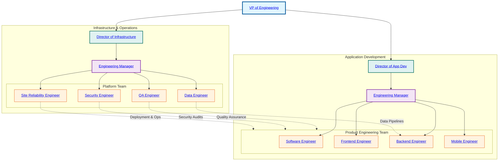

# Engineering & Technology Organization Chart

This chart illustrates the structural hierarchy within the Engineering & Technology department, detailing reporting lines, functional verticals, and team composition.

## Department Structure Overview

The **Engineering & Technology** department is structured to balance product delivery with technical excellence. It is divided into two main verticals:

1.  **Application Development**: Focused on building user-facing products, mobile applications, and the core business logic. This vertical is driven by speed, user experience, and feature delivery.
2.  **Infrastructure & Operations**: Focused on reliability, security, scalability, and data integrity. This vertical enables the App Dev team to move fast by providing stable platforms and tools.

Each vertical is led by a **Director** who reports to the **VP of Engineering**. **Engineering Managers** oversee specific teams or squads within these verticals, ensuring individual contributors (ICs) have the support and resources they need to succeed.
