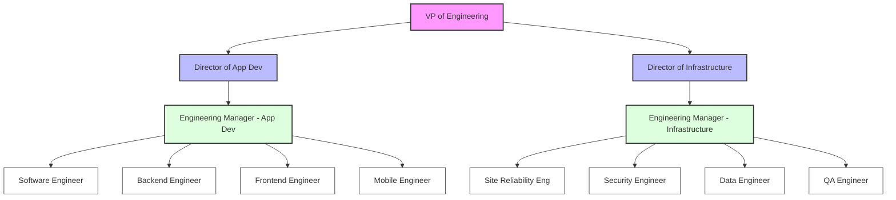

# Engineering & Technology Organization Chart

This chart illustrates the structural hierarchy within the Engineering & Technology department, showing reporting lines and team composition.

```mermaid
graph TD
    %% Executive Leadership
    VP[VP of Engineering] --> DirApp[Director of App Dev]
    VP --> DirInfra[Director of Infrastructure]

    %% Application Development Vertical
    DirApp --> EM_App[Engineering Manager - App Dev]

    EM_App --> SWE[Software Engineer]
    EM_App --> BE[Backend Engineer]
    EM_App --> FE[Frontend Engineer]
    EM_App --> Mobile[Mobile Engineer]

    %% Infrastructure Vertical
    DirInfra --> EM_Infra[Engineering Manager - Infrastructure]

    EM_Infra --> SRE[Site Reliability Eng]
    EM_Infra --> Sec[Security Engineer]
    EM_Infra --> Data[Data Engineer]
    EM_Infra --> QA[QA Engineer]

    %% Styling
    classDef executive fill:#f9f,stroke:#333,stroke-width:2px;
    classDef director fill:#bbf,stroke:#333,stroke-width:2px;
    classDef manager fill:#dfd,stroke:#333,stroke-width:2px;
    classDef ic fill:#fff,stroke:#333,stroke-width:1px;

    class VP executive;
    class DirApp,DirInfra director;
    class EM_App,EM_Infra manager;
    class SWE,BE,FE,Mobile,SRE,Sec,Data,QA ic;
```
