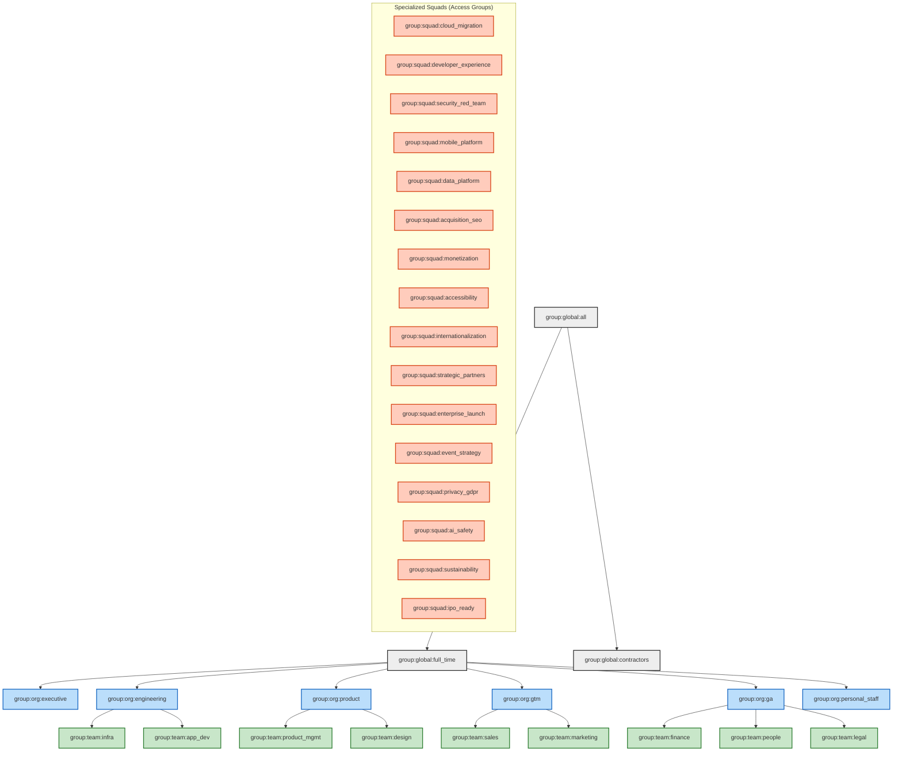

# User Management Group Hierarchy

## 1. Overview
This document defines the complete group hierarchy used for **User Management** and **Role-Based Access Control (RBAC)**.
Access permissions in our system are assigned to **Groups**. Users are members of one or more groups based on their **Department**, **Squad**, and **Job Role**.

The group structure mirrors the [Organizational Architecture](/devset/job_roles/job_role_organization/), ensuring that access rights automatically align with an employee's function and responsibilities.

### Group Naming Convention
Groups are identified by a unique slug following this convention:
`group:<type>:<name>`

*   **Type**:
    *   `org`: Top-level organizational units (Departments).
    *   `team`: Sub-departments or functional teams.
    *   `squad`: Cross-functional execution squads.
    *   `role`: Specific job roles (e.g., for role-specific tool access).
    *   `global`: Company-wide groups.

## 2. Visual Hierarchy Graph

The following graph illustrates the inheritance structure. Child groups inherit permissions from parent groups.

## 3. Detailed Group Definitions

### 3.1 Global Groups
| Group Slug | Description | Membership Criteria |
|---|---|---|
| `group:global:all` | The root group for all active accounts. | All active accounts. |
| `group:global:full_time` | Full-time employees. Grants access to internal benefits portals, All-Hands, etc. | Employment Type = Full Time. |
| `group:global:contractors` | External contractors. Restricted access policies apply. | Employment Type = Contractor. |

### 3.2 Functional Departments (Verticals)
These groups grant access to departmental resources (e.g., GitHub organizations, Shared Drives, Financial dashboards).

#### Executive Leadership
*   **Slug**: `group:org:executive`
*   **Members**: CEO, CTO, CPO, CRO, CFO, CLO.
*   **Access**: Full read access across organization; Write access to strategic docs.

#### Engineering & Technology
*   **Slug**: `group:org:engineering`
*   **Members**: All Engineering staff.
*   **Access**: GitHub Enterprise (Read), Jira, Confluence, Engineering VPN.

| Sub-Group Slug | Description | Roles Included |
|---|---|---|
| `group:team:infra` | Infrastructure & SRE. Access to AWS Root, Terraform Cloud, Production clusters. | Dir. Infra, SRE, Security Eng. |
| `group:team:app_dev` | Application Development. Access to App Repos, Dev/Staging environments. | Dir. App Dev, Backend, Frontend, Mobile. |

#### Product & Design
*   **Slug**: `group:org:product`
*   **Members**: Product Managers, Designers, Researchers.
*   **Access**: Productboard, Figma (Editor), Amplitude.

| Sub-Group Slug | Description | Roles Included |
|---|---|---|
| `group:team:product_mgmt` | Product Management. Access to Roadmapping tools. | VP Product, Directors, PMs. |
| `group:team:design` | Design Team. Access to Design System libraries. | VP Design, Designers, UX Writers. |

#### Go-To-Market (Sales & Marketing)
*   **Slug**: `group:org:gtm`
*   **Members**: Sales and Marketing staff.
*   **Access**: CRM (Salesforce/HubSpot), Marketing Automation.

| Sub-Group Slug | Description | Roles Included |
|---|---|---|
| `group:team:sales` | Sales Organization. Access to Deal pipeline, Revenue dashboards. | AEs, SDRs, SEs, CSMs. |
| `group:team:marketing` | Marketing Organization. Access to Social Media accounts, Ad platforms. | Brand Mgr, Comms, Marketing Mgr. |

#### General & Administrative (G&A)
*   **Slug**: `group:org:ga`
*   **Members**: Finance, HR, Legal.
*   **Access**: ERP (NetSuite), HRIS (Workday).

| Sub-Group Slug | Description | Roles Included |
|---|---|---|
| `group:team:finance` | Finance Team. Access to Bank accounts, Payroll. | VP Finance, Controller, FP&A. |
| `group:team:people` | HR/People Team. Access to Sensitive Employee Data. | VP People, HRBPs, Recruiters. |
| `group:team:legal` | Legal Team. Access to Contracts, CLM. | CLO, Corp Counsel. |

#### Personal Staff
*   **Slug**: `group:org:personal_staff`
*   **Members**: Private office staff.
*   **Access**: Family Office systems, Private Travel portals.

### 3.3 Specialized Squads (Horizontals)
Membership in these groups is **additive**. Users remain in their Functional Department group but gain specific access required for their squad's mission (e.g., specific Cloud environments, specific data sets).

| Squad Group Slug | Squad Name | Specific Access Rights (Examples) |
|---|---|---|
| `group:squad:cloud_migration` | Cloud Migration Squad | Legacy Data Center VPN, AWS Migration Hub. |
| `group:squad:developer_experience` | Developer Experience | CI/CD Admin, Internal Tooling Repos (Write). |
| `group:squad:security_red_team` | Security Red Team | Pentesting Tools, Security Audit Logs (Read/Write). |
| `group:squad:mobile_platform` | Mobile Platform | Apple App Store Connect (Admin), Google Play Console. |
| `group:squad:data_platform` | Data Platform | Snowflake (Admin), Airflow (Admin). |
| `group:squad:acquisition_seo` | Acquisition (SEO) | Google Search Console, SEMRush. |
| `group:squad:monetization` | Monetization | Stripe Dashboard, Billing Microservices. |
| `group:squad:accessibility` | Accessibility (A11y) | Accessibility Testing Tools, UI Repo (Write). |
| `group:squad:internationalization` | Internationalization | Translation Management System (Lokalise). |
| `group:squad:strategic_partners` | Strategic Partner | Partner API Portals, Shared Slack Channels. |
| `group:squad:enterprise_launch` | Enterprise Launch | Enterprise Customer Staging Envs. |
| `group:squad:event_strategy` | Event Strategy | Event Platform Admin, Social Media (Event handles). |
| `group:squad:privacy_gdpr` | Privacy (GDPR) | OneTrust Admin, Data Mapping Tools. |
| `group:squad:ai_safety` | AI Ethics & Safety | Model Registry (Read), Evaluation Sets. |
| `group:squad:sustainability` | Sustainability (ESG) | Carbon Tracking Dashboard, Facilities Data. |
| `group:squad:ipo_ready` | IPO / Audit Ready | Audit Trails, SOX Compliance Tools. |

### 3.4 Role-Based Groups
In addition to organizational groups, specific Role Codes map to groups for granular tool access.

| Role Group Slug | Mapped Role Code | Example Usage |
|---|---|---|
| `group:role:swen1001` | SWEN1001 (Software Eng) | Standard IDE licenses, Copilot access. |
| `group:role:srel1001` | SREL1001 (SRE) | PagerDuty User access. |
| `group:role:exec0001` | EXEC0001 (CEO) | CEO Dashboard, Board Portal access. |
| `group:role:sale9001` | SALE9001 (Account Exec) | Salesforce 'AE' Profile. |
| ... | ... | (All Role Codes map 1:1 to a corresponding group) |
