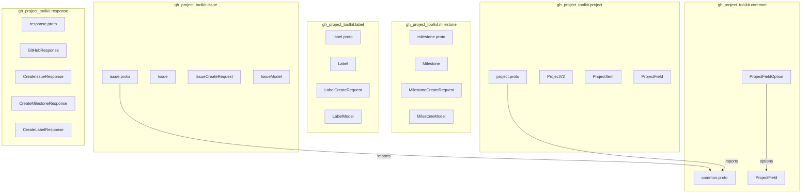

# Protocol Buffer Definitions

This directory contains the Protocol Buffer message definitions for the GitHub Project Management Toolkit.

## Overview

Protocol Buffers (protobuf) are used as the data serialization format for all data models in the toolkit. This provides:
- Efficient binary serialization
- Strong typing across services
- Language-agnostic data contracts
- Versioned API contracts

## Proto Files



## Package Structure

| Package | File | Description |
|---------|------|-------------|
| `gh_project_toolkit.common` | common.proto | Shared types (ProjectFieldOption, ProjectField) |
| `gh_project_toolkit.issue` | issue.proto | Issue-related messages |
| `gh_project_toolkit.milestone` | milestone.proto | Milestone-related messages |
| `gh_project_toolkit.label` | label.proto | Label-related messages |
| `gh_project_toolkit.project` | project.proto | Project V2-related messages |
| `gh_project_toolkit.response` | response.proto | Response messages |

## Messages Reference

### Issue Models

| Message | Purpose |
|---------|---------|
| `Issue` | GitHub Issue representation |
| `IssueCreateRequest` | Request to create an issue |
| `IssueModel` | Raw API response format |

### Milestone Models

| Message | Purpose |
|---------|---------|
| `Milestone` | GitHub Milestone representation |
| `MilestoneCreateRequest` | Request to create a milestone |
| `MilestoneModel` | Raw API response format |

### Label Models

| Message | Purpose |
|---------|---------|
| `Label` | GitHub Label representation |
| `LabelCreateRequest` | Request to create a label |
| `LabelModel` | Raw API response format |

### Project V2 Models

| Message | Purpose |
|---------|---------|
| `ProjectV2` | GitHub Project V2 board |
| `ProjectItem` | Item in a Project V2 |
| `ProjectField` | Project V2 field with options |
| `ProjectFieldOption` | Option for single-select field |

### Response Models

| Message | Purpose |
|---------|---------|
| `GitHubResponse` | Base API response |
| `CreateIssueResponse` | Issue creation response |
| `CreateMilestoneResponse` | Milestone creation response |
| `CreateLabelResponse` | Label creation response |

## Usage

To generate Python code from these protobuf definitions:

```bash
protoc --python_out=src/gh_project_toolkit \
       --proto_path=src/gh_project_toolkit/protos \
       src/gh_project_toolkit/protos/*.proto
```

Or use the Makefile:

```bash
make protobuf-generate
```

## Imports

- `common.proto` is imported by `issue.proto` and `project.proto`
- All other proto files are independent

## Generated Files

After running protoc, the following Python files will be generated:

- `common_pb2.py`
- `issue_pb2.py`
- `milestone_pb2.py`
- `label_pb2.py`
- `project_pb2.py`
- `response_pb2.py`

These files should be committed to the repository or generated as part of the build process.