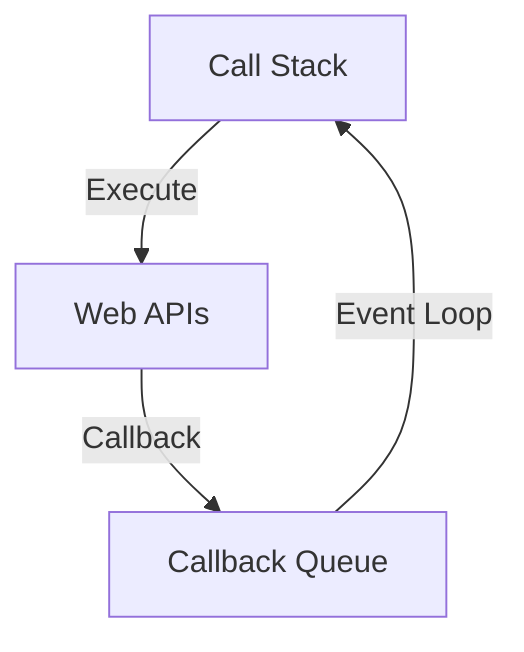

# JavaScript Interview Questions & Answers (100+)

This guide contains 100+ JavaScript interview questions, ranging from basic to advanced. Each question includes a model answer, code snippets, and potential follow-up paths based on the candidate's response.

## Part 1: Core JavaScript Basics (1-20)
### 1. What are the different data types in JavaScript?

JavaScript has **Primitive** and **Non-Primitive** (Reference) types.

*   **Primitives:**
    1.  `String`
    2.  `Number`
    3.  `BigInt` (ES2020)
    4.  `Boolean`
    5.  `Undefined`
    6.  `Null`
    7.  `Symbol` (ES6)
*   **Non-Primitive:**
    1.  `Object` (includes Arrays, Functions, etc.)

**Candidate Response Paths:**

*   **Path A: Candidate mentions `null` vs `undefined`.**
    *   *Follow-up:* "What is the result of `typeof null`?"
    *   *Answer:* `"object"`. This is a known bug in JavaScript that hasn't been fixed for legacy reasons.

### 2. What is the difference between `var`, `let`, and `const`?

| Feature | `var` | `let` | `const` |
| :--- | :--- | :--- | :--- |
| **Scope** | Function Scope | Block Scope | Block Scope |
| **Hoisting** | Yes (initialized `undefined`) | Yes (TDZ) | Yes (TDZ) |
| **Reassignable** | Yes | Yes | No |
| **Redeclarable** | Yes | No | No |

**Candidate Response Paths:**

*   **Path A: Candidate mentions TDZ (Temporal Dead Zone).**
    *   *Follow-up:* "Can you explain what the Temporal Dead Zone is?"
    *   *Answer:* It's the period between the start of the block and the actual declaration of the variable. Accessing the variable during this time throws a `ReferenceError`.

### 3. What is Hoisting?

Hoisting is JavaScript's default behavior of moving declarations to the top of the current scope (script or function) during the compilation phase.

*   **`var`:** Hoisted and initialized with `undefined`.
*   **Function Declarations:** Fully hoisted (can call before definition).
*   **`let`/`const`:** Hoisted but not initialized (enter Temporal Dead Zone).

### 4. Explain `==` vs `===`.

*   `==` (Loose Equality): Performs **Type Coercion** before comparison.
*   `===` (Strict Equality): Checks both **Value** and **Type**.

```javascript
0 == false   // true
0 === false  // false
'1' == 1     // true
'1' === 1    // false
```

### 5. What is Type Coercion?

The automatic or implicit conversion of values from one data type to another (e.g., string to number).

*   **Implicit:** `1 + '2'` -> `'12'`
*   **Explicit:** `Number('2')`

**Candidate Response Paths:**

*   **Path A: Candidate discusses truthy/falsy.**
    *   *Follow-up:* "Is `[]` truthy or falsy?"
    *   *Answer:* Truthy. But `[] == false` is `true` (coercion fun).

### 6. What is `NaN`?

It stands for "Not-a-Number". It is a value of the `Number` type.
It results from invalid math operations (e.g., `Math.sqrt(-1)`, `'a' * 1`).

**Properties:**
*   `NaN === NaN` is **false**.
*   Use `Number.isNaN(value)` to check.

### 7. What are the Falsy values in JavaScript?

There are 6 falsy values (plus `false` itself):
1.  `false`
2.  `0` (and `-0`, `0n`)
3.  `""` (Empty string)
4.  `null`
5.  `undefined`
6.  `NaN`

Everything else is **Truthy** (e.g., `[]`, `{}`, `"0"`, `"false"`).

### 8. What is the difference between `null` and `undefined`?

*   **`undefined`:** A variable has been declared but not assigned a value. It is the default value of uninitialized variables/parameters.
*   **`null`:** Represents the intentional absence of any object value. It is an assignment value.

### 9. Explain strict mode (`'use strict'`).

Strict mode is a way to opt in to a restricted variant of JavaScript.
**Benefits:**
1.  Eliminates some silent errors by throwing them.
2.  Fixes mistakes that make it difficult for engines to perform optimizations.
3.  Prohibits some syntax likely to be defined in future versions.
**Example:** Prevents accidental global variables (`x = 3.14` throws error if `x` not declared).

### 10. How do you check the type of a variable?

Using the `typeof` operator.

```javascript
typeof "John" // "string"
typeof 3.14   // "number"
typeof {}     // "object"
typeof []     // "object"
typeof (() => {}) // "function"
```

**Candidate Response Paths:**

*   **Path A: Candidate notes `typeof array` is object.**
    *   *Follow-up:* "How do you specifically check if a variable is an Array?"
    *   *Answer:* `Array.isArray(variable)` or `variable instanceof Array`.

### 11. What is the difference between Function Declaration and Function Expression?

*   **Declaration:** `function foo() {}`. Hoisted (can be called before defined).
*   **Expression:** `const foo = function() {}`. Not hoisted (behaves like variable).

### 12. What is an IIFE (Immediately Invoked Function Expression)?

A function that runs as soon as it is defined.
Used to create a local scope and avoid polluting the global namespace.

```javascript
(function() {
    var secret = "I am safe here";
})();
```

### 13. What is the difference between `call`, `apply`, and `bind`?

All three allow you to control the value of `this` inside a function.

| Method | Syntax | Execution |
| :--- | :--- | :--- |
| **`call`** | `func.call(thisObj, arg1, arg2)` | Immediately |
| **`apply`** | `func.apply(thisObj, [argArray])` | Immediately |
| **`bind`** | `const newFunc = func.bind(thisObj)` | Returns new function |

### 14. What is `this` keyword?

`this` refers to the object that is **executing** the current function.
*   **Global Context:** `window` (browsers) or `global` (Node).
*   **Object Method:** The object itself.
*   **Event Handler:** The element that received the event.
*   **Arrow Function:** Lexical `this` (inherits from outer scope).

### 15. What are Arrow Functions?

A concise syntax for writing function expressions.
**Key Differences:**
1.  No own `this` (lexical scoping).
2.  No `arguments` object.
3.  Cannot be used as constructors (`new` fails).

### 16. What is a Callback Function?

A function passed into another function as an argument, which is then invoked inside the outer function to complete some kind of routine or action.

### 17. What is Scope?

Scope determines the accessibility (visibility) of variables.
1.  **Global Scope:** Accessible everywhere.
2.  **Function Scope:** Accessible only within the function.
3.  **Block Scope:** (`let`, `const`) Accessible only within the block `{}`.

### 18. What is a Closure?

A closure is the combination of a function bundled together (enclosed) with references to its surrounding state (the lexical environment). In other words, a closure gives you access to an outer function’s scope from an inner function.

```javascript
function makeAdder(x) {
  return function(y) {
    return x + y;
  };
}
const add5 = makeAdder(5);
console.log(add5(2)); // 7
```

### 19. Explain the module pattern.

A design pattern used to wrap a set of variables and functions together in a single scope. It is used to define private and public access levels (encapsulation) using closures (often IIFEs).

### 20. What is "Currying"?

Currying is the process of converting a function that takes multiple arguments into a sequence of functions that each take a single argument.

```javascript
const add = a => b => a + b;
add(1)(2); // 3
```

## Part 2: Objects, Arrays & Prototypes (21-40)

### 21. What is the Prototype Chain?

In JavaScript, objects have a special hidden property `[[Prototype]]` (exposed as `__proto__`). If you access a property that doesn't exist on the object, JS looks for it on the prototype, then the prototype's prototype, until it reaches `null`. This chain is used for inheritance.

### 22. What is the difference between `__proto__` and `prototype`?

*   **`__proto__`:** The actual object that is used in the lookup chain to resolve methods, etc. (exists on instances).
*   **`prototype`:** The object that will be used as the `__proto__` of instances created when using `new Constructor()`. (exists on functions).

### 23. How do you create an object in JavaScript?

1.  **Object Literal:** `const o = {}`
2.  **Constructor:** `const o = new Object()`
3.  **`Object.create()`:** `const o = Object.create(proto)`
4.  **Class (ES6):** `new MyClass()`

### 24. What is `Object.freeze()` vs `Object.seal()`?

*   **`Object.freeze()`:** Totally immutable. Cannot add, remove, or modify properties.
*   **`Object.seal()`:** Cannot add or remove properties, but *can* modify existing property values.

### 25. How do you check if a key exists in an object?

1.  `"key" in obj` (Check prototype chain too)
2.  `obj.hasOwnProperty("key")` (Check own properties only)
3.  `Object.hasOwn(obj, "key")` (Modern, safer version of `hasOwnProperty`)

### 26. What are the primitive wrapper objects?

`String`, `Number`, `Boolean`.
They allow you to access properties/methods on primitives (e.g., `"hello".toUpperCase()`). JS temporarily wraps the primitive in an object, calls the method, and discards the object.

### 27. What is Destructuring Assignment?

A syntax that makes it possible to unpack values from arrays, or properties from objects, into distinct variables.

```javascript
const user = { id: 42, isVerified: true };
const { id, isVerified } = user;
```

### 28. What is the Spread Operator (`...`)?

It expands an iterable (like an array or string) into more elements.

```javascript
const arr1 = [1, 2];
const arr2 = [...arr1, 3, 4]; // [1, 2, 3, 4]
```
Also used for Object spread (shallow copy/merge).

### 29. What is the Rest Parameter (`...`)?

It allows a function to accept an indefinite number of arguments as an array.

```javascript
function sum(...args) {
    return args.reduce((a, b) => a + b);
}
```

### 30. Explain Shallow Copy vs Deep Copy.

*   **Shallow Copy:** Copies the object, but nested objects are still references to the original. (`{...obj}`, `Object.assign()`).
*   **Deep Copy:** Recursively copies everything. (`JSON.parse(JSON.stringify(obj))` or `structuredClone()`).

### 31. What is the difference between `map` and `forEach`?

*   **`map()`:** Returns a **new array**. Used to transform data.
*   **`forEach()`:** Returns `undefined`. Used for side effects.

### 32. How does `reduce()` work?

Executes a reducer function on each element of the array, resulting in a single output value.

```javascript
const sum = [1, 2, 3].reduce((acc, curr) => acc + curr, 0);
```

### 33. What is `filter()`?

Creates a new array with all elements that pass the test implemented by the provided function.

### 34. What are Higher-Order Functions?

Functions that take other functions as arguments or return functions as their result. (e.g., `map`, `filter`, `setTimeout`).

### 35. What is the difference between `slice()` and `splice()`?

*   **`slice(start, end)`:** Returns a new array (shallow copy). Does **not** modify original.
*   **`splice(start, count, ...items)`:** Removes/Adds items. **Modifies** the original array.

### 36. What is a `Set`?

A collection of values where each value must be **unique**.

```javascript
const unique = [...new Set([1, 2, 2, 3])]; // [1, 2, 3]
```

### 37. What is a `Map` vs `Object`?

| Feature | Map | Object |
| :--- | :--- | :--- |
| **Keys** | Any type (incl. objects) | Strings & Symbols |
| **Order** | Insertion order | Not guaranteed (historically) |
| **Size** | `.size` property | Manually count |
| **Iteration** | Directly iterable | `Object.keys()`, etc. |

### 38. What is a `WeakMap`?

A `Map` where keys must be objects and are held "weakly". If the key object is not referenced elsewhere, it can be garbage collected. Not iterable.

### 39. How do you sort an array of numbers?

`[1, 10, 2].sort()` sorts alphabetically by default -> `[1, 10, 2]`.
**Correct way:**
```javascript
[1, 10, 2].sort((a, b) => a - b); // [1, 2, 10]
```

### 40. What is `Array.from()`?

Creates a new Array instance from an array-like or iterable object (e.g., `NodeList`, `arguments`, `String`).

```javascript
Array.from('foo'); // ["f", "o", "o"]
```

## Part 3: Async JavaScript (41-60)

### 41. What is the Event Loop?

JavaScript is single-threaded. The Event Loop monitors the Call Stack and the Callback Queue. If the Call Stack is empty, it takes the first event from the queue and pushes it to the stack.

**Diagram:**


### 42. Explain Synchronous vs Asynchronous.

*   **Synchronous:** Code executes line-by-line, blocking execution until completion.
*   **Asynchronous:** Code executes without blocking (e.g., timers, network requests), providing a callback or promise to handle the result later.

### 43. What is a Promise?

An object representing the eventual completion (or failure) of an asynchronous operation and its resulting value.
**States:**
1.  Pending
2.  Fulfilled (Resolved)
3.  Rejected

### 44. What are the instance methods of a Promise?

1.  `.then(onSuccess, onFailure)`
2.  `.catch(onFailure)`
3.  `.finally(onAlways)`

### 45. Explain `Promise.all()` vs `Promise.allSettled()`.

*   **`Promise.all(iterable)`:** Waits for all to resolve. Rejects immediately if **any** promise rejects (fail-fast).
*   **`Promise.allSettled(iterable)`:** Waits for all to finish (resolve or reject). Returns an array of status objects.

### 46. What is `Promise.race()`?

Returns a promise that resolves or rejects as soon as one of the promises in the iterable resolves or rejects.

### 47. Explain `async` and `await`.

Syntactic sugar built on top of Promises to write asynchronous code that looks synchronous.
*   `async` function returns a Promise.
*   `await` pauses execution until the Promise resolves.

```javascript
async function fetchData() {
    try {
        const response = await fetch('/api');
        const data = await response.json();
    } catch (error) {
        console.error(error);
    }
}
```

### 48. What happens if you `await` a non-promise?

It is converted to a resolved Promise automatically.
`const x = await 5; // x is 5`

### 49. Can you use `await` inside a loop?

Yes.
*   **`forEach`:** `async` callbacks run in parallel (doesn't wait).
*   **`for...of`:** `await` inside pauses the loop (sequential execution).

### 50. What is a Microtask vs Macrotask?

*   **Microtasks:** Promises, `queueMicrotask`, `MutationObserver`. (High priority, run immediately after current script).
*   **Macrotasks:** `setTimeout`, `setInterval`, `setImmediate`, I/O. (Run in next Event Loop tick).

**Execution Order:** Script -> All Microtasks -> Render -> One Macrotask.

### 51. What is the output?

```javascript
console.log(1);
setTimeout(() => console.log(2), 0);
Promise.resolve().then(() => console.log(3));
console.log(4);
```
**Answer:** `1, 4, 3, 2`
(Sync -> Sync -> Microtask -> Macrotask).

### 52. What is `setTimeout`?

Schedules code to be run after a specified delay (in ms). It is **not** part of JS engine, but a Web API provided by the browser/Node environment.

### 53. Why is `setTimeout(fn, 0)` useful?

It pushes the function to the end of the Call Stack (to the task queue), allowing the UI to update or the current execution to finish first.

### 54. What is Callback Hell?

The situation where callbacks are nested within other callbacks several levels deep, making code difficult to read and maintain.
**Solution:** Use Promises or Async/Await.

### 55. What is `fetch` API?

A modern interface for making HTTP requests (replacement for `XMLHttpRequest`). It returns a Promise.

### 56. How do you cancel a fetch request?

Using an `AbortController`.

```javascript
const controller = new AbortController();
fetch(url, { signal: controller.signal });
controller.abort(); // Cancels request
```

### 57. What is `JSON.parse` and `JSON.stringify`?

*   `JSON.parse()`: Parses a JSON string to a JS object.
*   `JSON.stringify()`: Converts a JS object to a JSON string.

### 58. What is debouncing?

Ensures that a function is not called again until a certain amount of time has passed since it was last called. (e.g., search input).

```javascript
function debounce(func, delay) {
    let timeout;
    return (...args) => {
        clearTimeout(timeout);
        timeout = setTimeout(() => func(...args), delay);
    };
}
```

### 59. What is throttling?

Ensures that a function is called at most once in a specified time period. (e.g., window resize, scroll).

### 60. What is a Generator Function in async context?

Generators (`function*`) can yield Promises. Before `async/await`, libraries like `co` used generators to mimic sync-style async code.

## Part 4: DOM & Web API (61-80)

### 61. What is the DOM?

**Document Object Model.** A tree structure representation of the HTML document. It allows JS to manipulate content, structure, and style.

### 62. How to select elements in DOM?

*   `document.getElementById('id')`
*   `document.getElementsByClassName('class')`
*   `document.getElementsByTagName('div')`
*   `document.querySelector('.class')` (Returns first match)
*   `document.querySelectorAll('.class')` (Returns NodeList)

### 63. `NodeList` vs `HTMLCollection`?

*   **`HTMLCollection`:** Live (updates automatically if DOM changes). Returned by `getElementsByClassName`.
*   **`NodeList`:** Static (mostly). Returned by `querySelectorAll`.

### 64. What is Event Bubbling?

When an event triggers on an element, it first runs the handlers on it, then on its parent, then all the way up on other ancestors. (Bottom -> Up).

### 65. What is Event Capturing (Trickling)?

The opposite of bubbling. The event goes down to the element. (Top -> Down).
Enabled by passing `{ capture: true }` to `addEventListener`.

### 66. How to stop propagation?

`event.stopPropagation()` stops the event from moving to the next part of the propagation flow (bubbling or capturing).

### 67. What is `event.preventDefault()`?

Prevents the browser's default behavior for the event (e.g., prevents form submission, or link navigation).

### 68. What is Event Delegation?

Instead of attaching event listeners to individual elements, you attach a single listener to a common parent. It utilizes event bubbling to handle events for child elements (even dynamically added ones).

```javascript
document.getElementById('list').addEventListener('click', (e) => {
    if (e.target.tagName === 'LI') {
        console.log('List item clicked');
    }
});
```

### 69. What is the `dataset` property?

Allows access to custom data attributes (`data-*`) on elements.

```html
<div id="user" data-id="123" data-role="admin"></div>
<script>
    const el = document.getElementById('user');
    console.log(el.dataset.id); // "123"
</script>
```

### 70. `innerHTML` vs `innerText` vs `textContent`?

*   **`innerHTML`:** Parses HTML string (Security risk: XSS).
*   **`innerText`:** Visible text (aware of CSS styling like `display: none`).
*   **`textContent`:** All text (including hidden elements). Faster.

### 71. What is the BOM (Browser Object Model)?

Objects provided by the browser to interact with everything *outside* the page content.
Examples: `window`, `navigator`, `location`, `history`, `screen`.

### 72. How do you detect the browser name?

`navigator.userAgent`. (Though feature detection is preferred over browser detection).

### 73. What is `localStorage` vs `sessionStorage`?

*   **`localStorage`:** Data persists even after the browser is closed. (No expiration).
*   **`sessionStorage`:** Data survives page refresh but is cleared when the tab/window is closed.

### 74. What are Cookies?

Small data stored in the browser. Sent with every HTTP request to the server.
Properties: `Expires`, `HttpOnly` (secure against XSS), `Secure` (HTTPS only).

### 75. How to create a new DOM element?

`document.createElement('tagName')`.

### 76. What is a DocumentFragment?

A lightweight, minimal document object. It has no parent. Appending to it doesn't cause reflow. Appending the fragment to DOM moves all its children. Used for performance optimization when adding multiple elements.

### 77. What is Reflow and Repaint?

*   **Reflow (Layout):** Calculating positions and geometries of elements. (Expensive).
*   **Repaint:** Changing visibility (color, background) without changing layout.

### 78. What is Shadow DOM?

Encapsulation mechanism. Allows a hidden DOM tree to be attached to an element. Styles inside Shadow DOM don't leak out, and global styles don't leak in. Basis of Web Components.

### 79. What is `window.onload` vs `DOMContentLoaded`?

*   **`DOMContentLoaded`:** HTML is parsed and DOM is built. (External scripts/styles might not be loaded).
*   **`window.onload`:** Everything is loaded (images, styles, scripts).

### 80. How does `defer` and `async` work in script tags?

*   **`<script>`:** Blocks parsing, fetches, executes.
*   **`<script async>`:** Fetches in parallel, executes as soon as fetched (pauses parsing). Order not guaranteed.
*   **`<script defer>`:** Fetches in parallel, executes after HTML parsing is complete. Order guaranteed.

## Part 5: ES6+ & Advanced Concepts (81-100)

### 81. What is a Class in ES6?

Syntactic sugar over prototype-based inheritance.

```javascript
class Person {
    constructor(name) { this.name = name; }
    greet() { return `Hi, ${this.name}`; }
}
```

### 82. What are Modules (ESM)?

Official standard for modules.
*   `export` (Named or Default).
*   `import`.
*   File-based scope. Always strict mode.

### 83. What are Template Literals?

String literals allowing embedded expressions. Enclosed by backticks (`` ` ``).
Supports multi-line strings.

### 84. What is the Optional Chaining Operator (`?.`)?

Safely access nested properties. Returns `undefined` if reference is nullish.

```javascript
const zip = user?.address?.zipCode;
```

### 85. What is the Nullish Coalescing Operator (`??`)?

Returns the right-hand operand when the left is `null` or `undefined` (not just falsy).

```javascript
const x = 0 ?? 5; // 0
const y = 0 || 5; // 5
```

### 86. What is a Symbol?

A unique and immutable primitive. Often used as object keys to create private-like properties or avoid name collisions.

### 87. What is a Proxy?

An object that wraps another object and intercepts operations (like read, write, function call).

```javascript
const handler = {
    get: (obj, prop) => prop in obj ? obj[prop] : "Not Found"
};
const p = new Proxy({}, handler);
```

### 88. What is `Reflect`?

A built-in object that provides methods for interceptable JavaScript operations. Complements `Proxy`.

### 89. What is Memory Leak in JS?

When objects are no longer needed but are still referenced, preventing Garbage Collection.
**Causes:** Global variables, forgotton timers, closures, detached DOM nodes.

### 90. How does Garbage Collection work?

**Mark-and-Sweep:**
1.  Roots (Global, Stack) are marked.
2.  References are traversed and marked.
3.  Unmarked objects (unreachable) are swept (deleted).

### 91. What is `BigInt`?

A primitive for integers larger than `2^53 - 1`. Created by appending `n`.
`const huge = 1234567890123456789012345678901234567890n;`

### 92. What is `globalThis`?

A standard way to access the global object across environments (window, self, global).

### 93. What is Currying vs Partial Application?

*   **Currying:** `f(a, b, c)` -> `f(a)(b)(c)`.
*   **Partial App:** `f(a, b, c)` -> `g(b, c)` (where `a` is fixed).

### 94. What is Memoization?

Optimization technique. Caching the result of an expensive function call based on arguments and returning the cached result when the same inputs occur again.

### 95. What is the difference between `for...in` and `for...of`?

*   **`for...in`:** Iterates over **keys** (enumerable properties). (Works on Objects).
*   **`for...of`:** Iterates over **values**. (Works on Iterables: Array, Map, Set, String).

### 96. What is TCO (Tail Call Optimization)?

An optimization where a recursive function call is the last action in the function. The engine reuses the stack frame. (Supported in Safari, theoretically in ES6 spec).

### 97. What is a Polyfill?

Code that implements a feature on web browsers that do not support the feature.

### 98. What is Transpilation (Babel)?

Converting modern JS (ES6+) code into older JS (ES5) to ensure compatibility with older browsers.

### 99. What are Worker Threads (Web Workers)?

Allow running scripts in background threads, separate from the main execution thread. Prevents UI blocking during heavy computations. They don't have access to DOM.

### 100. What is Server-Side Rendering (SSR) vs Client-Side Rendering (CSR)?

*   **CSR:** Browser downloads minimal HTML and a JS bundle. JS fetches data and builds the UI. (Slower initial load, faster interaction).
*   **SSR:** Server renders HTML with data and sends it. (Faster initial load, SEO friendly).

---
**End of Interview Questions**


## Study Guide

To deepen your understanding of these concepts, check out the following resources:

- **Official Documentation**: [Javascript Docs](https://developer.mozilla.org/en-US/docs/Web/JavaScript)
- **Internal Style Guide**: [Javascript Style Guide](../style_guides/javascript/javascript_style_guide.md)
